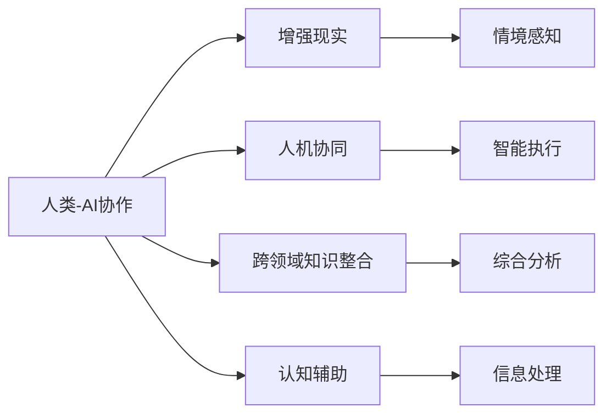

                 

# 人类-AI协作：增强人类与AI之间的信任和理解

## 1. 背景介绍

在人类文明的发展过程中，科技与人的关系一直是复杂且微妙的。从古代的机械到现代的AI，技术的演进似乎总在促进与人的互动与交流，但也时不时地引发关于人类未来地位和意义的担忧。然而，今天我们所讨论的AI并非简单地作为人的替代品或工具，而是作为人类智慧的增强工具，以实现人类与AI之间的和谐共生与深度协作。

### 1.1 历史回顾
自古以来，人类就在不断地探索如何与技术共存。从牛顿的机械钟表到蒸汽机的诞生，技术的发展促进了人类的生产力和生活方式的改变。然而，随着智能机器的普及，人们开始担忧其可能带来的就业冲击和伦理道德问题。但AI技术的应用远不止于此，它正在逐步改变我们与世界互动的方式，尤其在提升人类认知能力、决策质量和效率方面展现出巨大潜力。

### 1.2 人类-AI协作的时代背景
人工智能已经从理论走向实践，其应用领域遍及各行各业，从医疗、教育到金融、制造业。机器学习、深度学习、自然语言处理等技术的突破，让AI不仅能够处理海量数据，还能够进行复杂的决策和规划。人类的认知能力虽然经过数百万年的进化已十分强大，但面对复杂问题，有时仍会感到力不从心。这时，AI的介入就变得至关重要。

人类-AI协作是基于这样的背景逐渐发展起来的，旨在通过AI增强人类的能力，实现更高效的决策、更准确的数据处理和更广阔的知识探索。这种协作关系并不意味着人的替代，而是通过相互补充和辅助，共同提升解决问题和应对挑战的能力。

## 2. 核心概念与联系

### 2.1 核心概念概述

要深入理解人类-AI协作，首先需要明晰一些关键概念：

- **人类-AI协作**：指在特定任务中，人类与AI系统通过交互和合作，共同完成目标的过程。人类提供任务目标、情境理解、策略制定和情感支持，而AI则提供高效的数据处理、逻辑推理和执行能力。

- **增强现实**：通过AI技术将虚拟信息叠加到现实世界，增强人类感知和决策的能力。例如，在医学影像分析中，AI能够帮助医生识别细微的病变特征，从而提升诊断准确性。

- **人机协同**：人类与AI的有机结合，实现比单独个体更高效的协同工作。例如，在自动驾驶汽车中，人负责导航和决策，AI负责技术执行和环境感知。

- **跨领域知识整合**：AI能够整合不同领域的数据和知识，帮助人类突破知识壁垒。例如，在金融分析中，AI结合多领域数据进行综合分析，提升决策的科学性和准确性。

- **认知辅助**：通过AI技术，帮助人类处理和理解复杂信息，提升认知效率。例如，在科研领域，AI可以处理和分析大量实验数据，辅助研究人员发现新规律和理论。

### 2.2 核心概念联系

这些概念之间存在紧密的联系，通过以下Mermaid流程图可以清晰地展示它们之间的相互作用：



该图展示了一个理想中的协作流程：协作任务通过增强现实得到情境感知，人机协同实现智能执行，跨领域知识整合提升综合分析能力，认知辅助增强信息处理效果。

## 3. 核心算法原理 & 具体操作步骤
### 3.1 算法原理概述

人类-AI协作的核心算法原理可以概括为"数据共享、信息增强、决策辅助"。即，AI通过数据分析和模型预测，向人类提供更精确的情报，而人类则负责判断、决策和监督。

### 3.2 算法步骤详解

具体实现中，一个典型的人类-AI协作流程包括以下步骤：

**Step 1: 数据收集与预处理**
- 收集与任务相关的数据，并对数据进行清洗和预处理，确保数据的质量和可用性。

**Step 2: 模型训练与优化**
- 构建合适的AI模型，并通过大规模数据集进行训练和优化，确保模型能够准确地进行预测和推理。

**Step 3: 情境感知与任务理解**
- AI接收任务描述，通过自然语言处理技术理解任务的具体要求，并进行情境感知。

**Step 4: 跨领域知识整合**
- AI整合不同领域的数据和知识，形成更全面的信息模型，支持人类进行决策。

**Step 5: 决策辅助与反馈**
- AI通过数据分析和模型预测，向人类提供决策辅助信息，并根据人类的反馈进行模型优化和调整。

**Step 6: 执行与监督**
- AI执行人类的决策，并在执行过程中进行监督和控制，确保执行结果符合预期。

### 3.3 算法优缺点

人类-AI协作的算法具有以下优点：
1. 提升决策效率：AI通过高效的数据分析和推理，帮助人类快速做出决策。
2. 增强认知能力：AI能够处理和整合大量数据，帮助人类发现新的规律和知识。
3. 改善人机交互：AI能够通过自然语言处理技术，更好地理解人类的意图和需求，提供个性化服务。
4. 降低决策风险：AI可以模拟不同决策结果，帮助人类评估风险，选择最优方案。

但同时，该算法也存在一些挑战：
1. 数据隐私问题：在处理大量数据时，如何保护用户的隐私是一个重要问题。
2. 算法透明度：AI的决策过程往往难以解释，可能影响人类对结果的信任。
3. 道德和伦理问题：AI在处理复杂道德问题时，可能出现偏见和错误。
4. 依赖性风险：过度依赖AI可能削弱人类的自主判断能力。

### 3.4 算法应用领域

人类-AI协作的算法已经在众多领域得到了广泛应用，如：

- **医疗**：AI在疾病诊断、治疗方案推荐、药物研发等方面提供了强有力的支持，增强了医生的决策能力。
- **金融**：AI在风险评估、市场预测、投资决策等方面，提升了金融机构的风控能力和盈利水平。
- **制造**：AI在生产过程优化、设备故障预测、质量控制等方面，帮助企业提升生产效率和产品质量。
- **教育**：AI在个性化教学、智能辅导、学习评估等方面，提升了教育质量和效率。
- **公共安全**：AI在犯罪预防、交通管理、灾害预警等方面，提高了公共安全水平和应急响应能力。
- **城市管理**：AI在城市交通规划、环境保护、智能网格等方面，推动了智慧城市的建设。

这些应用场景展示了人类-AI协作的广阔前景，通过AI技术的应用，不仅提升了工作效率，还在许多领域实现了质的飞跃。

## 4. 数学模型和公式 & 详细讲解 & 举例说明

### 4.1 数学模型构建

在人类-AI协作中，数学模型可以用于描述协同过程的各个阶段。以医疗诊断为例，我们可以构建一个简化的数学模型来描述AI与医生之间的协作：

1. **数据收集阶段**：
   - 定义输入变量 $x_i$，表示患者i的症状和历史数据。
   - 定义输出变量 $y_i$，表示患者i的诊断结果。

2. **模型训练阶段**：
   - 构建一个线性回归模型，表示AI对患者诊断的预测值 $\hat{y_i}$。
   - 使用交叉熵损失函数 $L(y_i, \hat{y_i})$，表示预测值与真实值的差异。

3. **决策辅助阶段**：
   - 将AI的预测值与医生的诊断结果结合，使用加权平均方法进行综合。
   - 定义综合后的诊断结果 $z_i$，表示医生对患者i的最终诊断。

4. **执行与监督阶段**：
   - 将综合后的诊断结果 $z_i$ 输入到生产系统中，用于患者治疗。
   - 定义监控变量 $u_i$，表示治疗效果和不良反应。

5. **反馈与优化阶段**：
   - 收集监控数据 $u_i$，用于调整AI模型和医生决策策略。

### 4.2 公式推导过程

以线性回归模型为例，其基本公式为：
$$
\hat{y} = \alpha_0 + \alpha_1x_1 + \alpha_2x_2 + ... + \alpha_nx_n
$$

其中，$\alpha_0$ 为截距，$\alpha_1$ 至 $\alpha_n$ 为各特征的系数。

假设 $y_i$ 为真实诊断结果，$\hat{y}_i$ 为AI预测结果，则交叉熵损失函数为：
$$
L(y_i, \hat{y}_i) = -(y_i\log(\hat{y}_i) + (1-y_i)\log(1-\hat{y}_i))
$$

在综合诊断阶段，可以使用加权平均方法，例如：
$$
z_i = \lambda_d y_i + (1-\lambda_d) \hat{y}_i
$$

其中 $\lambda_d$ 为医生对AI预测结果的权重，$0 \leq \lambda_d \leq 1$。

在执行与监督阶段，可以使用监控数据 $u_i$ 来评估治疗效果，例如：
$$
u_i = f(z_i, x_i)
$$

其中 $f$ 为治疗效果评估函数。

在反馈与优化阶段，可以使用调整后的模型和权重进行新的预测和诊断，不断优化协作流程。

### 4.3 案例分析与讲解

以智能诊断系统为例，该系统由AI辅助医生进行患者诊断：

**数据收集与预处理**：
- 收集患者的基本信息、病史、检查结果等数据。
- 使用自然语言处理技术清洗和标注数据，构建特征向量。

**模型训练与优化**：
- 使用医疗数据集训练线性回归模型，计算各个特征的系数。
- 使用交叉熵损失函数优化模型参数，提高预测精度。

**情境感知与任务理解**：
- AI读取患者病历，提取关键症状和历史数据。
- 使用自然语言处理技术，理解医生对诊断的描述。

**跨领域知识整合**：
- AI整合医学数据库和文献资源，提供全面的疾病信息。
- 根据患者病情，推荐最可能的诊断和治疗方案。

**决策辅助与反馈**：
- 将AI的预测结果与医生的意见结合，生成综合诊断结果。
- 医生根据AI的推荐和监控数据，进行调整和优化。

**执行与监督**：
- 将综合诊断结果输入到治疗系统中，执行相应的治疗方案。
- 收集治疗效果数据，评估诊断准确性和治疗效果。

**反馈与优化**：
- 收集医生的反馈，调整AI模型的参数和权重。
- 优化算法和模型，提高协作效率和准确性。

该系统通过AI辅助诊断，不仅提高了诊断效率和准确性，还帮助医生更好地理解和整合跨领域知识，提升了医疗服务质量。

## 5. 项目实践：代码实例和详细解释说明

### 5.1 开发环境搭建

为了实现人类-AI协作的算法，我们需要构建一个完整的开发环境。以下是基于Python和TensorFlow的开发环境配置流程：

1. 安装Python：下载并安装Python 3.8，确保环境配置正确。
2. 安装TensorFlow：通过pip安装TensorFlow 2.x版本，使用TensorFlow GPU版本以获得更好的性能。
3. 安装其他依赖库：安装numpy、pandas、scikit-learn、matplotlib等常用库。
4. 配置环境变量：设置必要的路径和库文件，确保能够正确运行程序。
5. 安装Jupyter Notebook：通过pip安装Jupyter Notebook，方便进行交互式编程和数据分析。

### 5.2 源代码详细实现

以下是使用TensorFlow实现的一个简单的智能诊断系统的代码示例：

```python
import tensorflow as tf
import numpy as np
from sklearn.model_selection import train_test_split

# 准备数据
X = np.random.randn(1000, 10)  # 患者症状数据
y = np.random.randint(0, 2, 1000)  # 随机生成诊断结果

# 数据划分
X_train, X_test, y_train, y_test = train_test_split(X, y, test_size=0.2, random_state=42)

# 构建模型
model = tf.keras.Sequential([
    tf.keras.layers.Dense(64, activation='relu', input_shape=(10,)),
    tf.keras.layers.Dense(1, activation='sigmoid')
])

# 定义损失函数和优化器
loss_fn = tf.keras.losses.BinaryCrossentropy()
optimizer = tf.keras.optimizers.Adam(learning_rate=0.001)

# 训练模型
model.compile(optimizer=optimizer, loss=loss_fn, metrics=['accuracy'])
model.fit(X_train, y_train, epochs=10, validation_data=(X_test, y_test))

# 使用模型进行预测
y_pred = model.predict(X_test)
```

### 5.3 代码解读与分析

上述代码展示了使用TensorFlow进行线性回归模型的训练和预测过程。具体解读如下：

**数据准备**：
- `X` 为患者症状数据，`y` 为诊断结果。
- 使用 `train_test_split` 函数将数据划分为训练集和测试集。

**模型构建**：
- 使用 `Sequential` 模型，定义了两个全连接层。
- 第一层为 `Dense` 层，具有64个神经元，激活函数为 ReLU。
- 第二层为输出层，具有1个神经元，激活函数为 Sigmoid，用于二分类问题。

**损失函数和优化器**：
- 使用 `BinaryCrossentropy` 作为损失函数，适用于二分类问题。
- 使用 `Adam` 优化器，学习率为0.001。

**模型训练**：
- 使用 `compile` 函数配置模型，包括损失函数、优化器和评价指标。
- 使用 `fit` 函数进行模型训练，参数包括训练数据、测试数据、轮次等。

**预测**：
- 使用 `predict` 函数对测试集进行预测，返回预测结果。

### 5.4 运行结果展示

在训练过程中，可以使用 Jupyter Notebook 实时查看模型训练效果：

```python
import matplotlib.pyplot as plt

# 绘制训练和验证准确率
plt.plot(history.history['accuracy'])
plt.plot(history.history['val_accuracy'])
plt.title('Model accuracy')
plt.ylabel('Accuracy')
plt.xlabel('Epoch')
plt.legend(['Train', 'Test'], loc='upper left')
plt.show()
```

上述代码展示了训练过程中模型准确率的曲线，可以直观地看到模型在训练和验证集上的表现。

## 6. 实际应用场景

### 6.1 医疗诊断

在医疗诊断领域，AI辅助诊断已经成为一种常见的应用。通过深度学习和自然语言处理技术，AI可以处理和分析大量的医学数据，辅助医生进行诊断和决策。例如，IBM的Watson Health系统，可以通过分析电子病历、影像数据和实验室结果，提供个性化的治疗建议和诊断报告，大大提升了诊断的效率和准确性。

### 6.2 金融风险管理

在金融领域，AI可以通过分析历史数据和市场趋势，提供风险评估和投资建议。例如，高盛的AI系统可以帮助客户进行资产配置和风险管理，通过机器学习算法评估不同投资组合的潜在风险和收益。这种基于数据的决策支持，可以帮助客户做出更加明智的投资决策。

### 6.3 制造业生产优化

在制造业中，AI可以通过分析生产数据和设备状态，优化生产流程和预测设备故障。例如，GE的Predix平台可以通过传感器数据和机器学习模型，预测设备故障，优化生产计划，降低停机时间和维护成本。这种智能化的生产管理，可以帮助企业提升效率和降低成本。

### 6.4 城市交通管理

在城市交通管理中，AI可以通过分析交通流量和天气数据，优化交通信号控制和路线规划。例如，上海的智慧交通系统通过AI算法，实时监测交通流量和车辆状态，自动调整交通信号灯的时长，缓解交通拥堵。这种智能化的交通管理，可以提高城市交通的运行效率和安全性。

### 6.5 智慧教育

在智慧教育领域，AI可以通过分析学生的学习行为和成绩数据，提供个性化的学习建议和辅导。例如，Knewton的Adaptive Learning System，可以通过分析学生的作业和测试数据，推荐个性化的学习资源和练习，帮助学生提升学习效果。这种智能化的学习支持，可以提高教育质量和学生的学习体验。

## 7. 工具和资源推荐

### 7.1 学习资源推荐

为了帮助开发者更好地理解和应用人类-AI协作的算法，这里推荐一些优质的学习资源：

1. **《Human-AI Collaboration》系列书籍**：由多位领域专家合著，详细介绍了人类-AI协作的原理、应用和挑战。
2. **Coursera《AI for Everyone》课程**：由斯坦福大学教授Andrew Ng主讲，介绍AI技术的基础和应用，适合初学者入门。
3. **edX《Deep Learning》课程**：由MIT教授Ian Goodfellow主讲，介绍深度学习的理论和实践，涵盖神经网络、卷积神经网络等内容。
4. **Kaggle数据竞赛平台**：提供丰富的数据集和比赛，帮助开发者练习和应用AI算法，提升实战能力。
5. **Google AI实验室**：提供最新的AI技术和研究进展，涵盖自然语言处理、计算机视觉等多个领域。

### 7.2 开发工具推荐

为了提高开发效率，这里推荐一些常用的开发工具：

1. **Jupyter Notebook**：提供交互式编程和数据分析环境，适合进行模型训练和实验。
2. **TensorFlow**：强大的深度学习框架，提供丰富的工具和算法库，支持GPU加速和分布式训练。
3. **PyTorch**：流行的深度学习框架，提供动态图和静态图两种计算图模型，适合快速原型开发。
4. **Keras**：高层次的深度学习框架，提供简单易用的API，适合快速搭建和训练模型。
5. **Google Colab**：免费的云服务，提供GPU和TPU算力，适合进行大规模深度学习实验。

### 7.3 相关论文推荐

为了深入了解人类-AI协作的算法，以下是一些关键的学术论文：

1. **《Human-AI Collaboration》论文**：详细介绍了人类-AI协作的原理和应用，提供了丰富的案例和实验结果。
2. **《Deep Collaborative Learning》论文**：介绍了一种基于协同学习的算法，提升AI与人类之间的协作效果。
3. **《Towards an AI-Augmented Society》论文**：讨论了AI技术对社会的影响，探讨了AI与人类协作的未来方向。

## 8. 总结：未来发展趋势与挑战

### 8.1 研究成果总结

人类-AI协作的研究已经取得了一些重要的成果，主要包括：

1. **协同算法优化**：通过优化协同算法，提高AI与人类之间的协作效果。例如，基于协同学习的算法，通过迭代更新，提升模型的准确性和鲁棒性。
2. **认知辅助工具**：开发认知辅助工具，帮助人类更好地理解和应用AI技术。例如，智能诊断系统，通过自然语言处理技术，将复杂的医学数据转换为易于理解的格式。
3. **跨领域知识整合**：通过跨领域知识整合，提升AI模型的综合分析能力。例如，医疗AI系统，整合医学数据库和文献资源，提供全面的疾病信息。
4. **人机协同平台**：开发人机协同平台，实现AI与人类之间的无缝协作。例如，智慧医疗平台，将AI技术与医学实践紧密结合，提升医疗服务质量。

### 8.2 未来发展趋势

展望未来，人类-AI协作将呈现以下发展趋势：

1. **更广泛的应用场景**：随着AI技术的不断进步，人类-AI协作将在更多领域得到应用，如智慧城市、智能交通、智慧农业等。
2. **更高的人机协作水平**：通过更加智能化的人机交互技术，提升协作效率和效果。例如，语音交互和手势识别技术，可以提供更自然的人机互动方式。
3. **更深层次的认知辅助**：通过AI技术，提供更深层次的认知支持，帮助人类更好地理解和应用复杂信息。例如，智能辅导系统和个性化学习系统。
4. **更全面的知识整合**：通过跨领域知识整合，提供更全面、准确的信息支持。例如，智能推荐系统和知识图谱系统。
5. **更强的自主决策能力**：通过智能决策支持系统，提升AI的自主决策能力，减少对人类的依赖。例如，自动驾驶汽车和机器人系统。

### 8.3 面临的挑战

尽管人类-AI协作取得了显著进展，但在实际应用中仍面临一些挑战：

1. **数据隐私问题**：在处理大量数据时，如何保护用户隐私是一个重要问题。例如，在医疗和金融领域，如何确保患者和客户的数据安全。
2. **算法透明度**：AI的决策过程往往难以解释，可能影响人类对结果的信任。例如，在金融和医疗领域，如何确保AI的决策过程透明可解释。
3. **道德和伦理问题**：AI在处理复杂道德问题时，可能出现偏见和错误。例如，在招聘和司法判决等领域，如何确保AI的公正性和伦理性。
4. **依赖性风险**：过度依赖AI可能削弱人类的自主判断能力。例如，在智能驾驶和自动医疗诊断等领域，如何确保人类在AI系统的辅助下仍能保持决策自主性。
5. **技术挑战**：AI技术本身仍存在一些技术挑战，例如，如何在大规模数据下训练高效模型，如何提升模型的泛化能力等。

### 8.4 研究展望

未来的研究需要在以下几个方面寻求新的突破：

1. **数据隐私保护**：开发更加安全、高效的数据保护技术，确保用户隐私不被侵犯。例如，差分隐私技术和联邦学习。
2. **算法可解释性**：提高AI算法的可解释性，帮助人类理解AI的决策过程。例如，基于可解释性的深度学习技术和可视化工具。
3. **伦理和道德标准**：制定AI伦理和道德标准，确保AI技术的公正性和伦理性。例如，AI伦理委员会和道德指南。
4. **人机协同设计**：设计更加人性化的交互界面和协同方式，提升人机协作的效果。例如，自然语言处理技术和语音交互技术。
5. **跨领域知识整合**：开发跨领域知识整合技术，提升AI模型的综合分析能力。例如，知识图谱技术和多模态融合技术。
6. **智能决策支持**：开发智能决策支持系统，提升AI的自主决策能力。例如，强化学习和优化算法。

只有不断解决这些问题，才能确保人类-AI协作技术的健康发展和广泛应用。相信随着科技的进步，人类-AI协作将进一步深化，为人类社会带来更多的福祉和变革。

## 9. 附录：常见问题与解答

**Q1: 人类-AI协作的主要挑战是什么？**

A: 人类-AI协作的主要挑战包括数据隐私问题、算法透明度、道德和伦理问题、依赖性风险以及技术挑战。

**Q2: 如何保护数据隐私？**

A: 保护数据隐私可以采用差分隐私技术、联邦学习等方法，确保在数据使用过程中不泄露个人隐私信息。

**Q3: 如何提高算法的可解释性？**

A: 提高算法可解释性可以通过可视化工具、基于可解释性的深度学习技术等方法，帮助人类理解AI的决策过程。

**Q4: 如何确保AI的公正性和伦理性？**

A: 制定AI伦理和道德标准，建立AI伦理委员会和道德指南，确保AI技术的公正性和伦理性。

**Q5: 如何提升AI的自主决策能力？**

A: 开发智能决策支持系统，利用强化学习和优化算法，提升AI的自主决策能力。

**Q6: 人类-AI协作的应用场景有哪些？**

A: 人类-AI协作的应用场景包括医疗诊断、金融风险管理、制造业生产优化、城市交通管理、智慧教育等。

**Q7: 人类-AI协作的未来发展趋势是什么？**

A: 未来人类-AI协作的发展趋势包括更广泛的应用场景、更高的人机协作水平、更深层次的认知辅助、更全面的知识整合、更强的自主决策能力等。

**Q8: 人类-AI协作面临的主要技术挑战是什么？**

A: 人类-AI协作面临的主要技术挑战包括大规模数据下的高效模型训练、模型的泛化能力提升、跨领域知识整合技术等。

**Q9: 如何设计更人性化的交互界面和协同方式？**

A: 设计更人性化的交互界面和协同方式可以通过自然语言处理技术和语音交互技术，提升人机协作的效果。

---

作者：禅与计算机程序设计艺术 / Zen and the Art of Computer Programming

