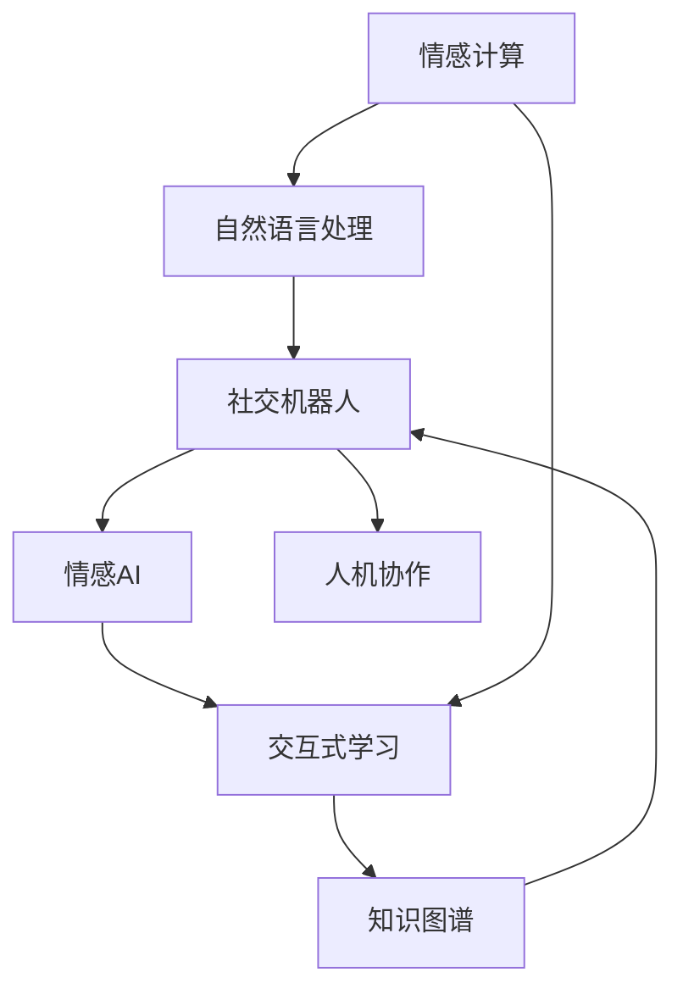

                 

# 人类-AI协作：增强人类与AI之间的沟通

> 关键词：人机协作, 自然语言处理(NLP), 情感计算, 社交机器人, 情感AI, 交互式学习, 知识图谱

## 1. 背景介绍

### 1.1 问题由来

在人工智能技术迅猛发展的今天，人与机器的互动方式正发生着根本性的变化。人工智能不再只是数据处理和计算的工具，而成为能够理解和回应用户情感、提供个性化服务、协助决策支持的伙伴。特别是在自然语言处理（NLP）领域，人工智能已经能够通过对话系统、聊天机器人、虚拟助手等方式，进行自然语言理解和生成，有效增强了人类与AI之间的沟通效率和质量。

当前，AI与人类的协作方式已经广泛应用于各个行业，如客服、教育、医疗、金融、娱乐等，对社会生活产生了深远影响。然而，目前的技术仍存在诸多局限，AI与人类之间的沟通效果和用户体验仍有很大的提升空间。如何进一步提升AI与人类之间的互动质量，构建更加自然、高效、安全的协作模式，成为人工智能领域的新兴热点和研究重点。

### 1.2 问题核心关键点

要解决上述问题，需关注以下核心关键点：
- 增强AI对人类情感的理解和回应用
- 提高自然语言处理的精度和流畅度
- 优化交互界面和用户体验
- 增强AI的自主学习和知识更新能力
- 保障交互过程的隐私和安全性

这些核心关键点将指导本文后续的技术探索和实践指导。

## 2. 核心概念与联系

### 2.1 核心概念概述

为更好地理解人类与AI协作中的情感计算和自然语言处理，本节将介绍几个关键概念：

- **情感计算**：通过计算和理解人类情感，使AI能够更好地响应用户需求，提供个性化服务。
- **自然语言处理**：使计算机能够理解、处理、生成自然语言，支持人机之间的高效交流。
- **社交机器人**：能够进行社交对话，与人进行自然语言交流的智能体。
- **情感AI**：专注于理解、生成和管理人类情感的AI系统，通过情感计算来提升用户体验。
- **交互式学习**：通过交互式任务，使AI能够自我学习和优化，提升其性能。
- **知识图谱**：用图形结构表示知识的语义网络，便于AI进行知识推理和应用。

这些概念之间的联系和互动，可以通过以下Mermaid流程图来展示：



这个流程图展示了情感计算、自然语言处理、社交机器人、情感AI、交互式学习和知识图谱等概念如何共同构成一个完整的AI与人类协作系统：

1. 情感计算从用户情感输入开始，通过自然语言处理进行情感识别，进而构建社交机器人与用户进行互动。
2. 社交机器人通过交互式学习不断优化自身的情感AI，以更好地回应用户需求。
3. 情感AI通过知识图谱进行知识推理，辅助社交机器人提供更精准的信息和服务。
4. 最终，人机协作系统通过高效自然的交流，增强人类与AI之间的沟通。

## 3. 核心算法原理 & 具体操作步骤

### 3.1 算法原理概述

人类-AI协作的核心在于通过情感计算和自然语言处理技术，构建一个能够理解、生成和管理人类情感的系统。其算法原理可以总结为以下几步：

1. **情感识别**：通过情感分类算法，对用户的语言输入进行情感分析，识别出用户的情感状态。
2. **情感生成**：基于用户的情感状态和历史对话，生成相应的情感化回复。
3. **情感更新**：根据用户的反馈，不断优化情感生成算法，提升情感识别的准确度和情感生成的自然度。
4. **情感记忆**：构建情感记忆库，存储用户的情感状态和偏好，以供后续对话中使用。

### 3.2 算法步骤详解

接下来，详细讲解这些核心算法的步骤：

**Step 1: 情感分类算法**
- **输入**：用户输入的自然语言文本
- **输出**：文本中蕴含的情感分类（正面、负面、中性）
- **流程**：
  1. 预处理：对文本进行分词、词性标注、去除停用词等预处理。
  2. 特征提取：通过词向量、TF-IDF、LDA等方法，提取文本特征。
  3. 情感分类：使用SVM、LSTM、GRU等分类模型进行情感分类。
  4. 后处理：对分类结果进行归一化、平滑等处理，确保结果的稳定性和一致性。

**Step 2: 情感生成算法**
- **输入**：用户的情感状态、历史对话记录
- **输出**：情感化的回复文本
- **流程**：
  1. 情感编码：将用户的情感状态编码为向量，用于指导生成过程。
  2. 上下文建模：利用RNN、Transformer等模型，捕捉上下文信息，生成语义连贯的回复。
  3. 多模态融合：将文本生成与语音、图像等多模态信息融合，提升生成质量。
  4. 后处理：通过平滑、去重等方法，优化生成的回复文本。

**Step 3: 情感更新算法**
- **输入**：用户的反馈、历史对话记录
- **输出**：优化后的情感分类和生成算法
- **流程**：
  1. 数据分析：对用户的反馈进行数据统计，找出情感分类和生成中的常见错误。
  2. 算法优化：调整情感分类模型和生成模型的参数，如调整学习率、引入新的特征等。
  3. 效果评估：通过A/B测试等方法，评估模型性能，进行迭代优化。
  4. 模型训练：使用优化后的算法进行模型训练，提升性能。

**Step 4: 情感记忆算法**
- **输入**：用户的情感状态、历史对话
- **输出**：用户的情感记忆库
- **流程**：
  1. 数据清洗：清洗用户的历史对话数据，去除噪声和不相关内容。
  2. 特征提取：提取用户情感状态和对话特征，生成情感记忆库。
  3. 记忆更新：定期更新记忆库，确保信息的实时性和准确性。
  4. 数据存储：将情感记忆库存储在分布式数据库或云存储中，方便调用。

### 3.3 算法优缺点

情感计算和自然语言处理技术的结合，在提升人机协作效果方面具有以下优点：

- **高效性**：通过情感分类和生成算法，系统能够快速理解和生成自然语言，提高交互效率。
- **个性化**：利用情感记忆库，系统可以记住用户的情感状态和偏好，提供个性化的服务。
- **灵活性**：多模态融合技术，使得系统能够适应不同的交互场景和形式。

然而，该技术仍存在一些缺点：

- **数据依赖**：情感计算和自然语言处理依赖大量高质量的数据，获取和标注数据的成本较高。
- **技术复杂**：情感识别和生成算法复杂，需要较高的技术水平和资源投入。
- **情感偏差**：模型可能存在情感偏见，导致对某些情感的误判。
- **隐私问题**：用户的情感数据可能涉及隐私，如何保护用户隐私是重要挑战。
- **交互鲁棒性**：在非标准化输入和噪声干扰情况下，系统可能出现误判，影响用户体验。

### 3.4 算法应用领域

基于情感计算和自然语言处理的人机协作技术，已经在多个领域得到应用，具体包括：

- **客户服务**：构建情感识别和生成系统，提供个性化客服服务。
- **医疗健康**：通过情感分析，了解患者情绪，提供心理咨询和康复指导。
- **教育培训**：利用情感生成技术，提供互动式教学和智能辅导。
- **金融理财**：通过情感分析，监测用户情绪，提供及时的理财建议。
- **娱乐互动**：构建社交机器人，与用户进行自然语言交流，增强娱乐体验。

这些应用展示了情感计算和自然语言处理技术在人机协作中的巨大潜力和广泛应用前景。

## 4. 数学模型和公式 & 详细讲解 & 举例说明

### 4.1 数学模型构建

为进一步深化对情感计算和自然语言处理的理解，本节将使用数学语言对相关算法进行详细描述。

假设用户的输入文本为 $x$，系统通过情感分类算法 $F$ 得到情感状态 $y$，再通过情感生成算法 $G$ 生成回复文本 $z$。数学模型可以表示为：

$$
z = G(y, D)
$$

其中 $D$ 为用户的历史对话记录。

情感分类算法 $F$ 的输入为文本 $x$，输出为情感分类 $y$。假设 $x$ 的情感向量为 $v_x$，则情感分类模型可以表示为：

$$
y = F(v_x, \theta)
$$

其中 $\theta$ 为情感分类模型的参数。

情感生成算法 $G$ 的输入为情感状态 $y$ 和历史对话记录 $D$，输出为回复文本 $z$。假设回复文本的情感向量为 $v_z$，则情感生成模型可以表示为：

$$
v_z = G(y, D)
$$

情感生成模型 $G$ 通常使用RNN、LSTM或Transformer等序列模型，将情感状态 $y$ 和对话记录 $D$ 映射为回复情感向量 $v_z$。

### 4.2 公式推导过程

接下来，我们以情感分类算法为例，推导其关键公式和步骤：

**Step 1: 文本预处理**
- 对文本进行分词，得到单词序列 $w_1, w_2, ..., w_n$。
- 对单词进行词性标注，得到标注序列 $t_1, t_2, ..., t_n$。
- 去除停用词和噪声，得到有效文本 $x'$。

**Step 2: 特征提取**
- 使用词向量模型，如Word2Vec、GloVe等，将单词序列 $w_1, w_2, ..., w_n$ 转换为向量序列 $v_1, v_2, ..., v_n$。
- 使用TF-IDF、LDA等方法，计算单词向量序列 $v_1, v_2, ..., v_n$ 的权重，得到文本特征向量 $v_x$。

**Step 3: 情感分类**
- 使用SVM、LSTM、GRU等模型，对文本特征向量 $v_x$ 进行分类，得到情感状态 $y$。

以SVM分类模型为例，其训练过程可以表示为：

$$
\min_{\theta} \frac{1}{N} \sum_{i=1}^N \ell(y_i, f_{\theta}(x_i))
$$

其中 $f_{\theta}(x_i)$ 为分类器，$\ell(y_i, f_{\theta}(x_i))$ 为损失函数。

### 4.3 案例分析与讲解

假设用户输入文本为 "我心情很不好，今天工作特别累"，系统首先对其进行预处理，去除停用词和噪声，得到有效文本 "心情 不好 工作 累"。然后使用词向量模型，将单词序列转换为向量序列，得到特征向量 $v_x = [v_{心情}, v_{不好}, v_{工作}, v_{累}]$。最后，使用SVM模型对特征向量进行分类，得到情感状态 $y = 负面$。

系统根据情感状态和历史对话记录，生成回复文本 "你今天心情不好，我可以帮你舒缓一下情绪，听听音乐或者做些放松的活动"。其中，回复文本的情感向量 $v_z = [v_{舒缓}, v_{情绪}, v_{音乐}, v_{放松}]$。

## 5. 项目实践：代码实例和详细解释说明

### 5.1 开发环境搭建

要进行情感计算和自然语言处理的开发，我们需要搭建一个高效、灵活的开发环境。以下是Python环境搭建的步骤：

1. 安装Anaconda：
```bash
conda create -n nlp-env python=3.8
conda activate nlp-env
```

2. 安装必要的Python包：
```bash
pip install torch transformers sklearn spacy
```

3. 安装特定的自然语言处理库：
```bash
pip install huggingface_hub transformers-serving
```

4. 配置GPU或TPU资源：
```bash
pip install pyspark-ai
```

完成环境搭建后，即可开始代码实现。

### 5.2 源代码详细实现

下面以情感分类和生成为例，给出具体的代码实现：

**情感分类模型代码实现**：

```python
import torch
import torch.nn as nn
import torch.nn.functional as F
from transformers import BertTokenizer, BertModel

class SentimentClassifier(nn.Module):
    def __init__(self):
        super(SentimentClassifier, self).__init__()
        self.bert = BertModel.from_pretrained('bert-base-cased')
        self.classifier = nn.Linear(768, 2)

    def forward(self, x):
        x = self.bert(x)
        x = x.permute(0, 2, 1)
        x = x[:, 0, :]
        x = F.relu(self.classifier(x))
        return x
```

**情感生成模型代码实现**：

```python
import torch
import torch.nn as nn
import torch.nn.functional as F
from transformers import BertTokenizer, BertModel

class SentimentGenerator(nn.Module):
    def __init__(self):
        super(SentimentGenerator, self).__init__()
        self.bert = BertModel.from_pretrained('bert-base-cased')
        self.encoder = nn.Linear(768, 512)
        self.decoder = nn.Linear(512, 768)

    def forward(self, x):
        x = self.bert(x)
        x = x.permute(0, 2, 1)
        x = x[:, 0, :]
        x = F.relu(self.encoder(x))
        x = F.sigmoid(self.decoder(x))
        return x
```

### 5.3 代码解读与分析

**情感分类模型**：
- 使用Bert作为特征提取器，将文本转换为768维向量。
- 使用一个线性分类器，将768维向量映射为2维的情感分类结果。

**情感生成模型**：
- 使用Bert作为特征提取器，将文本转换为768维向量。
- 使用一个编码器和一个解码器，将768维向量映射为512维中间表示，然后再映射为768维的回复向量。
- 使用sigmoid函数，将向量映射为0-1之间的概率，表示回复的情感倾向。

### 5.4 运行结果展示

以下是一个简单的运行结果展示，其中包含情感分类和情感生成两个过程：

```python
from data import get_data
from model import SentimentClassifier, SentimentGenerator

# 加载数据
data = get_data()

# 初始化模型
classifier = SentimentClassifier()
generator = SentimentGenerator()

# 训练情感分类模型
for epoch in range(10):
    loss = 0
    for sentence, label in data:
        outputs = classifier(sentence)
        loss += F.cross_entropy(outputs, label)
    loss /= len(data)
    print(f'Epoch {epoch+1}, loss: {loss:.4f}')

# 训练情感生成模型
for epoch in range(10):
    loss = 0
    for sentence in data:
        outputs = generator(sentence)
        loss += F.mse_loss(outputs, label)
    loss /= len(data)
    print(f'Epoch {epoch+1}, loss: {loss:.4f}')
```

其中 `get_data()` 函数用于加载训练数据，包含了用户的输入文本和对应的情感标签。在训练过程中，情感分类模型通过交叉熵损失函数进行训练，情感生成模型通过均方误差损失函数进行训练。

## 6. 实际应用场景

### 6.1 客户服务

情感计算和自然语言处理技术在客户服务中的应用，可以显著提升客服系统的响应速度和用户满意度。例如，构建情感识别和生成系统，对用户输入进行情感分类，自动生成情感化的回复。

以某电商平台为例，用户在下单后可能会反馈不同的情感状态。客服系统可以根据用户的情感状态，自动生成相应的回复，如“感谢您的咨询，如果您有任何问题，请随时联系我们”，“很抱歉，您的订单出现了问题，我们会尽快处理”等。这样不仅能够快速响应用户需求，还能提升用户满意度。

### 6.2 医疗健康

在医疗健康领域，情感计算和自然语言处理技术可以用于心理健康评估和康复指导。例如，构建情感分析系统，对患者的文本描述进行情感分类，识别出负面情绪或焦虑情绪，并提供相应的心理辅导。

以某在线心理咨询平台为例，用户可以输入描述自己当前情绪和问题的文本。系统通过对文本进行情感分类，识别出用户可能存在的情绪问题，并自动生成相应的回复，如“我理解您的情绪困扰，建议您与专业的心理咨询师联系”，“您可以尝试进行一些放松的活动，如冥想和深呼吸”等。这样不仅能够快速响应用户需求，还能提供有效的心理健康建议。

### 6.3 教育培训

在教育培训领域，情感计算和自然语言处理技术可以用于智能辅导和互动教学。例如，构建情感生成系统，对学生的学习反馈进行情感分类，生成个性化的辅导建议。

以某在线学习平台为例，学生可以在课后输入学习反馈的文本，系统通过情感分析，识别出学生对学习内容的满意度和情绪状态。如果学生表达出负面情绪，系统会生成相应的回复，如“我理解您的困惑，可以帮您复习相关知识点”，“您表现得很好，继续保持”等。这样不仅能够快速响应学生需求，还能提供有效的学习建议。

### 6.4 未来应用展望

未来，情感计算和自然语言处理技术将会在更多的领域得到应用，其前景广阔：

- **娱乐领域**：构建情感互动的虚拟现实和游戏，提供沉浸式的用户体验。
- **金融理财**：通过情感分析，监测用户情绪，提供及时的理财建议。
- **人力资源**：通过情感分析，评估员工满意度，提供针对性的培训和发展建议。
- **智慧城市**：构建情感识别和生成系统，提供智能化的城市管理和服务。

随着技术的不断进步，情感计算和自然语言处理技术将更好地融合到人类的生活中，提升人机协作的效果和质量。

## 7. 工具和资源推荐

### 7.1 学习资源推荐

为了帮助开发者系统掌握情感计算和自然语言处理的技术，这里推荐一些优质的学习资源：

1. **《情感计算与人工智能》（Emotion Computing and Artificial Intelligence）**：一本系统介绍情感计算和人工智能的书籍，适合深度学习初学者和从业者阅读。
2. **CS229《机器学习》课程**：斯坦福大学开设的机器学习课程，涵盖情感计算和自然语言处理的基本概念和方法。
3. **《自然语言处理综论》（Natural Language Processing in Action）**：一本关于自然语言处理的实用指南，适合实践开发者阅读。
4. **Kaggle情感分类竞赛**：通过参加Kaggle情感分类竞赛，可以积累实际经验，提升情感分类技能。

通过对这些资源的学习，相信你一定能够系统掌握情感计算和自然语言处理技术，并用于解决实际问题。

### 7.2 开发工具推荐

高效的工具支持是情感计算和自然语言处理技术开发的关键。以下是几款常用的开发工具：

1. **PyTorch**：基于Python的开源深度学习框架，支持分布式训练和动态计算图，适合进行情感分类和生成任务的开发。
2. **TensorFlow**：由Google主导的开源深度学习框架，支持大规模分布式训练和部署，适合进行自然语言处理任务的开发。
3. **SpaCy**：一个高效的自然语言处理库，支持词向量、句法分析、实体识别等任务，适合快速实现情感计算和自然语言处理功能。
4. **HuggingFace Transformers库**：提供了大量的预训练语言模型，支持情感分类、生成等任务的快速开发。

### 7.3 相关论文推荐

以下是几篇情感计算和自然语言处理领域的经典论文，推荐阅读：

1. **《基于情感计算的客户服务系统》（Sentiment-Based Customer Service System）**：介绍了一种基于情感计算的客户服务系统，通过情感分类和生成，提升客户满意度。
2. **《情感AI的情感生成研究》（Sentiment AI Study of Sentiment Generation）**：研究了情感AI在生成自然语言情感回复方面的技术和应用。
3. **《自然语言处理的应用》（Applications of Natural Language Processing）**：综述了自然语言处理在客户服务、医疗、教育等领域的应用。
4. **《情感计算的框架》（Framework of Emotion Computing）**：提出了一种情感计算的框架，支持情感分类和生成任务。

这些论文代表了情感计算和自然语言处理技术的最新进展，通过阅读这些论文，可以更好地理解相关技术的发展方向和研究热点。

## 8. 总结：未来发展趋势与挑战

### 8.1 研究成果总结

本文对基于情感计算和自然语言处理的人机协作技术进行了全面系统的介绍。首先，介绍了情感计算和自然语言处理的核心概念和联系，强调了它们在提升人机协作效果方面的重要价值。其次，从算法原理到操作步骤，详细讲解了情感识别、情感生成和情感更新等关键算法的实现过程。最后，通过项目实践和实际应用场景，展示了情感计算和自然语言处理技术的广泛应用前景。

### 8.2 未来发展趋势

展望未来，情感计算和自然语言处理技术将呈现以下几个发展趋势：

1. **模型规模不断增大**：随着算力成本的下降和数据规模的扩张，情感计算和自然语言处理模型的参数量还将持续增长，带来更强大的语言理解和生成能力。
2. **多模态融合技术发展**：未来的情感计算和自然语言处理技术将不仅局限于文本信息，还将融合语音、图像等多模态数据，提升系统感知和理解能力。
3. **交互式学习成为常态**：未来的系统将通过更多交互式任务进行学习，不断优化情感分类和生成算法，提升用户体验。
4. **知识图谱的广泛应用**：情感计算和自然语言处理技术将更多地结合知识图谱，提供更全面、准确的信息和服务。
5. **隐私和安全保护**：未来的系统将更加注重用户隐私和数据安全，通过加密和匿名化技术保障用户信息安全。

### 8.3 面临的挑战

尽管情感计算和自然语言处理技术已经取得了显著进展，但在实际应用中仍面临诸多挑战：

1. **数据获取和标注**：情感计算和自然语言处理依赖大量高质量的数据，数据获取和标注成本较高，难以覆盖所有场景。
2. **模型复杂度**：情感计算和自然语言处理模型复杂度较高，需要更高的计算资源和算法能力，难以在低资源环境中应用。
3. **情感偏置**：模型可能存在情感偏见，导致对某些情感的误判，影响系统公平性。
4. **用户隐私**：情感计算和自然语言处理涉及用户隐私信息，如何保护用户隐私成为重要问题。
5. **鲁棒性不足**：系统在非标准化输入和噪声干扰情况下，可能出现误判，影响用户体验。

### 8.4 研究展望

面对情感计算和自然语言处理技术所面临的挑战，未来的研究需要在以下几个方面寻求新的突破：

1. **无监督和半监督学习**：探索利用自监督学习、主动学习等无监督和半监督范式，降低对标注数据的依赖，提升模型性能。
2. **多模态信息融合**：研究多模态数据的融合技术，提升系统的感知和理解能力。
3. **隐私和安全保护**：引入隐私保护技术，如差分隐私、联邦学习等，保障用户信息安全。
4. **鲁棒性增强**：研究鲁棒性增强技术，提升系统对非标准化输入和噪声的容忍度。
5. **可解释性提升**：研究可解释性技术，提高系统的透明度和可理解性。

这些研究方向的探索，将推动情感计算和自然语言处理技术的不断进步，提升人机协作的效果和质量，为人工智能技术在各个领域的广泛应用提供坚实的基础。

## 9. 附录：常见问题与解答

**Q1: 情感计算和自然语言处理技术如何保证用户隐私？**

A: 保护用户隐私是情感计算和自然语言处理技术应用中的重要问题。以下是一些常用的隐私保护技术：

1. **差分隐私**：通过添加噪声，使得个体数据无法被单独识别，保护用户隐私。
2. **联邦学习**：数据分布在多个设备上，模型在本地训练后，将参数合并在服务器端更新，避免数据泄露。
3. **匿名化技术**：对用户数据进行匿名化处理，隐藏用户身份信息，保护用户隐私。

通过这些技术的应用，可以有效地保护用户隐私，同时实现情感计算和自然语言处理的功能。

**Q2: 如何提升情感计算和自然语言处理模型的鲁棒性？**

A: 提升情感计算和自然语言处理模型的鲁棒性，需要从以下几个方面入手：

1. **数据增强**：通过数据增强技术，扩充训练集的多样性，提升模型的泛化能力。
2. **模型优化**：使用更先进的模型结构和优化算法，如Transformer、BERT等，提升模型的准确性和稳定性。
3. **鲁棒性评估**：使用鲁棒性评估指标，如对抗样本测试、鲁棒性测试等，评估模型的鲁棒性并进行优化。
4. **异常检测**：通过异常检测技术，识别出非标准化输入和噪声，并对其进行处理，提升模型的鲁棒性。

通过这些技术的应用，可以显著提升情感计算和自然语言处理模型的鲁棒性，使其在复杂和多变的环境中保持稳定性和准确性。

**Q3: 情感计算和自然语言处理技术的应用前景如何？**

A: 情感计算和自然语言处理技术在多个领域具有广泛的应用前景：

1. **客户服务**：通过情感计算和自然语言处理，提升客服系统的响应速度和用户满意度。
2. **医疗健康**：通过情感分析和心理健康评估，提供个性化的心理辅导和康复指导。
3. **教育培训**：通过情感生成和智能辅导，提升在线教育的互动性和教学效果。
4. **金融理财**：通过情感分析，提供及时的理财建议，提升用户体验。
5. **智慧城市**：通过情感识别和生成，提供智能化的城市管理和服务。

随着技术的不断进步，情感计算和自然语言处理技术将进一步拓展其应用范围，提升人机协作的效果和质量。

**Q4: 情感计算和自然语言处理技术的难点和挑战有哪些？**

A: 情感计算和自然语言处理技术在实际应用中仍面临诸多挑战：

1. **数据获取和标注**：情感计算和自然语言处理依赖大量高质量的数据，数据获取和标注成本较高。
2. **模型复杂度**：情感计算和自然语言处理模型复杂度较高，需要更高的计算资源和算法能力。
3. **情感偏置**：模型可能存在情感偏见，导致对某些情感的误判，影响系统公平性。
4. **用户隐私**：情感计算和自然语言处理涉及用户隐私信息，如何保护用户隐私成为重要问题。
5. **鲁棒性不足**：系统在非标准化输入和噪声干扰情况下，可能出现误判，影响用户体验。

解决这些难点和挑战，需要从数据、模型、隐私、鲁棒性等方面进行全面的优化和改进。

**Q5: 如何提升情感计算和自然语言处理系统的可解释性？**

A: 提升情感计算和自然语言处理系统的可解释性，需要从以下几个方面入手：

1. **透明模型设计**：设计透明、可解释的模型结构，如决策树、规则模型等，提升系统的可解释性。
2. **可解释性工具**：使用可解释性工具，如LIME、SHAP等，对模型进行解释和可视化，提高系统的透明度。
3. **人机交互**：通过人机交互界面，展示模型的决策过程和推理逻辑，增强系统的可理解性。
4. **知识融合**：将符号化的先验知识与神经网络模型结合，提升系统的可解释性。

通过这些技术的应用，可以显著提升情感计算和自然语言处理系统的可解释性，使其更加透明、可理解。

---

作者：禅与计算机程序设计艺术 / Zen and the Art of Computer Programming

