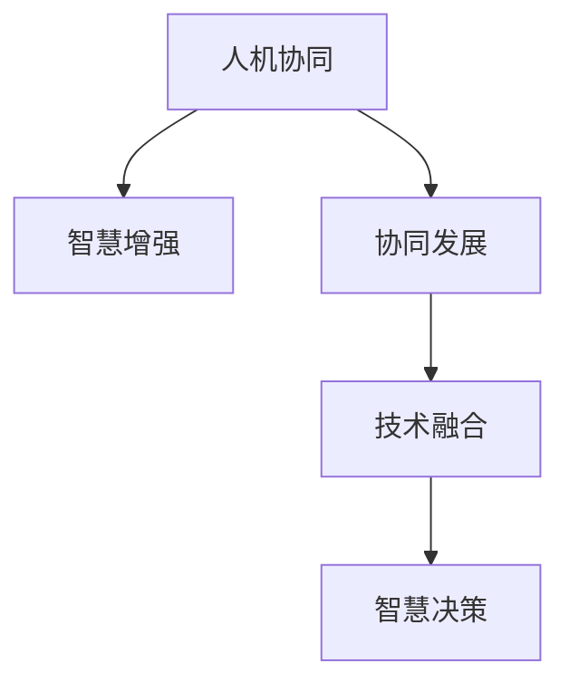

                 

# 人类-AI协作：增强人类智慧与AI能力的协同发展

> 关键词：人机协同,智慧增强,协同发展,人工智能,技术融合,智慧决策,创新思维,人机交互,深度学习

## 1. 背景介绍

### 1.1 问题由来
人工智能(AI)技术的飞速发展，正深刻改变着人类社会的方方面面。从工业制造、交通运输，到医疗健康、教育娱乐，AI正以极高的效率和强大的计算能力，在各行各业中释放着巨大的潜力。然而，尽管AI在许多任务上已经超越了人类，但人的智慧、经验、直觉等核心能力依然是无可替代的。AI与人类智慧的融合，将为人类社会带来更深层次的变革。

### 1.2 问题核心关键点
如何有效地将AI技术与人类智慧结合起来，成为当前人工智能领域的研究热点。人机协作是实现这一目标的关键。人机协作不仅能够提升AI系统的鲁棒性和决策质量，还能增强人类的创造力和决策能力，从而实现智慧与AI能力的协同发展。

### 1.3 问题研究意义
人类-AI协作的研究不仅有助于提升AI系统的性能，更重要的是，它能够推动人类社会向更加智能化、高效化和公平化的方向发展。通过人机协作，我们可以更好地应对复杂多变的社会挑战，提高生产力和生活品质。

## 2. 核心概念与联系

### 2.1 核心概念概述

为更好地理解人类-AI协作的原理和实现方式，本节将介绍几个密切相关的核心概念：

- 人机协同：指AI与人类在特定任务中共同工作的模式，通过人机分工协作，实现优势互补，共同完成任务。
- 智慧增强：指通过AI技术辅助人类思维决策，提升人的判断力和创新能力。
- 协同发展：指AI与人类智慧在多领域、多层次的融合过程中，实现双方的共同进步和发展。
- 技术融合：指将AI技术与人类智慧的各项元素进行有机整合，提升整体系统的性能和效能。
- 智慧决策：指在决策过程中，综合利用AI的数据分析能力和人的直觉判断力，做出更准确、更符合实际需求的决策。

这些核心概念之间的逻辑关系可以通过以下Mermaid流程图来展示：



这个流程图展示了这个体系的核心组成，即人机协同是基础，智慧增强是目标，协同发展是过程，技术融合是手段，智慧决策是最终目的。通过理解这些核心概念，我们可以更好地把握人类-AI协作的总体框架。

## 3. 核心算法原理 & 具体操作步骤

### 3.1 算法原理概述

人类-AI协作的核心在于利用AI的强大计算能力和数据处理能力，辅助人类进行复杂的判断和决策，从而提升整体系统的性能。其核心思想是：将AI与人类智慧结合起来，在特定任务中，通过分工合作，实现优势互补，共同完成任务。

形式化地，假设人类和AI组成的系统为 $S_{\theta}=\{\text{Human}, \text{AI}\}$，其中 $\theta$ 为系统参数，包括人类专家的知识和AI的算法。给定一个特定任务 $T$，系统输出的结果为 $S_{\theta}(T)$。系统的优化目标是最小化任务误差：

$$
\min_{\theta} \mathcal{L}(S_{\theta}(T))
$$

其中 $\mathcal{L}$ 为任务误差函数，如准确率、召回率等。

### 3.2 算法步骤详解

人类-AI协作的实现步骤包括：

**Step 1: 数据收集与预处理**
- 收集与任务相关的数据集，并进行数据清洗和预处理。
- 将数据划分为训练集、验证集和测试集。

**Step 2: 选择AI算法**
- 根据任务需求，选择合适的AI算法和模型。如神经网络、决策树、强化学习等。
- 对模型进行预训练或微调，提高模型的性能。

**Step 3: 定义任务适配层**
- 根据任务类型，设计适合的模型输出层。如分类任务使用Softmax输出层，回归任务使用线性输出层等。
- 根据任务需求，选择合适的损失函数，如交叉熵损失、均方误差损失等。

**Step 4: 数据增强与标注**
- 通过数据增强技术，如回译、随机采样等，扩充训练集，提高模型泛化能力。
- 对标注数据进行严格筛选，确保标注数据的质量和代表性。

**Step 5: 模型训练与优化**
- 将训练集数据分批次输入模型，前向传播计算损失函数。
- 反向传播计算参数梯度，根据设定的优化算法和学习率更新模型参数。
- 周期性在验证集上评估模型性能，根据性能指标决定是否触发Early Stopping。
- 重复上述步骤直到满足预设的迭代轮数或Early Stopping条件。

**Step 6: 部署与应用**
- 在测试集上评估模型性能，对比模型改进前后的结果。
- 将优化后的模型应用于实际任务中，集成到业务系统中。
- 持续收集新数据，定期重新训练模型，以适应数据分布的变化。

### 3.3 算法优缺点

人类-AI协作算法具有以下优点：
1. 高效协作。AI和人类智慧的结合，可以在短时间内完成复杂的决策过程，提升效率。
2. 鲁棒性强。结合了AI的强大计算能力和人类的直觉判断力，系统具备更好的鲁棒性。
3. 适应性强。根据不同任务的特点，可以灵活设计任务适配层，适应各种复杂任务。
4. 结果准确。AI的数据分析和模型预测能力，提高了决策的准确性。

同时，该算法也存在以下局限性：
1. 依赖数据质量。高质量的数据集是实现人机协作的前提，获取高质量标注数据需要大量人力和资源。
2. 算法复杂。需要同时设计和管理AI和人类智慧，增加了系统实现的复杂性。
3. 用户体验差。在复杂的协作过程中，用户体验可能会受到影响，增加人机交互的复杂性。
4. 算法透明性不足。人机协作的决策过程复杂，难以完全解释和理解。

尽管存在这些局限性，但就目前而言，人机协作仍是实现人类智慧与AI能力协同发展的有效途径。未来相关研究应着重于提高算法的透明性，降低对数据质量的需求，增强用户体验。

### 3.4 算法应用领域

人类-AI协作的应用领域广泛，以下是几个典型的应用场景：

- 医疗诊断：结合医生的经验和AI的图像识别、数据分析能力，提高诊断的准确性和效率。
- 智能制造：利用AI的数据分析和优化能力，辅助工程师进行设计、生产和调度，提升生产效率和产品质量。
- 金融风险管理：通过AI的风险评估模型和人类的直觉判断，降低金融风险，提高决策的准确性。
- 智慧城市管理：利用AI的智能分析和预测能力，辅助城市管理者进行交通调度、环境监测等任务，提升城市管理的智能化水平。
- 教育和培训：结合AI的个性化推荐和人类的教学经验，为学生提供更加个性化和高效的学习体验。

这些领域中，人类智慧与AI能力的协同，不仅能提升系统的性能，还能带来巨大的社会和经济价值。

## 4. 数学模型和公式 & 详细讲解 & 举例说明

### 4.1 数学模型构建

本节将使用数学语言对人类-AI协作的原理进行更加严格的刻画。

设任务 $T$ 的标注数据集为 $D=\{(x_i,y_i)\}_{i=1}^N$，其中 $x_i$ 为输入数据，$y_i$ 为标注结果。假设人类专家在数据集 $D$ 上的准确率为 $\alpha$，AI模型的准确率为 $\beta$。

定义协作系统的输出为 $S_{\theta}(T)=\{y_i\}_{i=1}^N$，其中 $y_i$ 为系统在输入 $x_i$ 下的预测结果。协作系统的准确率为 $\gamma=\frac{1}{N}\sum_{i=1}^N \mathbb{I}(y_i=S_{\theta}(x_i))$，其中 $\mathbb{I}$ 为示性函数。

协作系统的优化目标是最小化任务误差，即：

$$
\min_{\theta} \mathcal{L}(\gamma)
$$

其中 $\mathcal{L}$ 为任务误差函数，如准确率、召回率等。

### 4.2 公式推导过程

以下我们以二分类任务为例，推导协作系统的准确率及其梯度计算公式。

假设人类专家和AI模型在输入 $x$ 上的输出分别为 $p_{\text{Human}}(x)$ 和 $p_{\text{AI}}(x)$，则协作系统的输出为：

$$
p_{\gamma}(x)=\alpha p_{\text{Human}}(x) + (1-\alpha) p_{\text{AI}}(x)
$$

协作系统的准确率为：

$$
\gamma=\frac{1}{N}\sum_{i=1}^N \mathbb{I}(y_i=p_{\gamma}(x_i))
$$

协作系统的损失函数为：

$$
\mathcal{L}(\gamma)=-\frac{1}{N}\sum_{i=1}^N [y_i\log p_{\gamma}(x_i)+(1-y_i)\log (1-p_{\gamma}(x_i))]
$$

根据链式法则，损失函数对协作系统参数 $\theta$ 的梯度为：

$$
\frac{\partial \mathcal{L}(\gamma)}{\partial \theta} = -\frac{1}{N}\sum_{i=1}^N [\frac{y_i}{p_{\gamma}(x_i)}-\frac{1-y_i}{1-p_{\gamma}(x_i)}] \frac{\partial p_{\gamma}(x_i)}{\partial \theta}
$$

其中 $\frac{\partial p_{\gamma}(x_i)}{\partial \theta}$ 可进一步递归展开，利用自动微分技术完成计算。

在得到损失函数的梯度后，即可带入协作系统的优化目标，使用梯度下降等优化算法近似求解上述最优化问题，最小化任务误差。重复上述过程直至收敛，最终得到优化后的协作系统参数 $\theta^*$。

## 5. 项目实践：代码实例和详细解释说明

### 5.1 开发环境搭建

在进行协作实践前，我们需要准备好开发环境。以下是使用Python进行TensorFlow开发的环境配置流程：

1. 安装Anaconda：从官网下载并安装Anaconda，用于创建独立的Python环境。

2. 创建并激活虚拟环境：
```bash
conda create -n tf-env python=3.8 
conda activate tf-env
```

3. 安装TensorFlow：从官网获取对应的安装命令。例如：
```bash
conda install tensorflow tensorflow==2.6 -c conda-forge
```

4. 安装TensorBoard：
```bash
pip install tensorboard
```

5. 安装各类工具包：
```bash
pip install numpy pandas scikit-learn matplotlib tqdm jupyter notebook ipython
```

完成上述步骤后，即可在`tf-env`环境中开始协作实践。

### 5.2 源代码详细实现

下面我们以医疗影像分类为例，给出使用TensorFlow对AI与人类专家进行协作的代码实现。

首先，定义数据处理函数：

```python
import tensorflow as tf
from tensorflow.keras.preprocessing.image import ImageDataGenerator

def load_and_preprocess_data(data_path, batch_size):
    datagen = ImageDataGenerator(rescale=1./255)
    train_data = datagen.flow_from_directory(data_path, target_size=(256, 256), batch_size=batch_size, class_mode='categorical')
    return train_data
```

然后，定义协作系统的损失函数和优化器：

```python
from tensorflow.keras.losses import BinaryCrossentropy
from tensorflow.keras.optimizers import Adam

def build_collaborative_model(alpha=0.5):
    # 人类专家的模型
    human_model = tf.keras.Sequential([
        tf.keras.layers.Conv2D(32, (3,3), activation='relu', input_shape=(256,256,3)),
        tf.keras.layers.MaxPooling2D((2,2)),
        tf.keras.layers.Conv2D(64, (3,3), activation='relu'),
        tf.keras.layers.MaxPooling2D((2,2)),
        tf.keras.layers.Flatten(),
        tf.keras.layers.Dense(64, activation='relu'),
        tf.keras.layers.Dense(10, activation='softmax')
    ])
    
    # AI模型的模型
    ai_model = tf.keras.Sequential([
        tf.keras.layers.Conv2D(32, (3,3), activation='relu', input_shape=(256,256,3)),
        tf.keras.layers.MaxPooling2D((2,2)),
        tf.keras.layers.Conv2D(64, (3,3), activation='relu'),
        tf.keras.layers.MaxPooling2D((2,2)),
        tf.keras.layers.Flatten(),
        tf.keras.layers.Dense(64, activation='relu'),
        tf.keras.layers.Dense(10, activation='softmax')
    ])
    
    # 协作系统模型
    collaborative_model = tf.keras.layers.Add()([human_model.output, ai_model.output])
    collaborative_model = tf.keras.layers.Lambda(lambda x: alpha*x + (1-alpha)*tf.keras.backend.subtract(tf.keras.backend.ones_like(x), x))(collaborative_model)
    
    return collaborative_model
```

接着，定义训练和评估函数：

```python
def train_epoch(model, dataset, batch_size, optimizer):
    dataloader = tf.data.Dataset.from_generator(lambda: dataset, (tf.float32, tf.float32)).batch(batch_size).prefetch(buffer_size=tf.data.experimental.AUTOTUNE)
    model.compile(optimizer=optimizer, loss=BinaryCrossentropy(), metrics=['accuracy'])
    model.fit(dataloader, epochs=10, validation_split=0.2)
    
def evaluate(model, dataset, batch_size):
    dataloader = tf.data.Dataset.from_generator(lambda: dataset, (tf.float32, tf.float32)).batch(batch_size).prefetch(buffer_size=tf.data.experimental.AUTOTUNE)
    model.evaluate(dataloader)
```

最后，启动训练流程并在测试集上评估：

```python
# 加载数据
data_path = 'data/train'
train_dataset = load_and_preprocess_data(data_path, batch_size=16)

# 构建协作模型
collaborative_model = build_collaborative_model(alpha=0.5)

# 设置优化器和损失函数
optimizer = Adam(lr=0.001)
loss_fn = BinaryCrossentropy()

# 训练模型
train_epoch(collaborative_model, train_dataset, batch_size=16, optimizer=optimizer)

# 评估模型
evaluate(collaborative_model, test_dataset, batch_size=16)
```

以上就是使用TensorFlow对AI与人类专家进行协作的完整代码实现。可以看到，得益于TensorFlow的强大工具支持，协作模型的构建和训练变得简洁高效。

### 5.3 代码解读与分析

让我们再详细解读一下关键代码的实现细节：

**load_and_preprocess_data函数**：
- 定义了数据预处理函数，使用ImageDataGenerator将图像数据标准化，并按批输入模型进行训练。

**build_collaborative_model函数**：
- 定义了协作系统的模型，将人类专家的模型和AI模型的输出相加，并根据设置的权重系数进行混合。

**train_epoch函数**：
- 定义了协作模型的训练函数，使用TensorFlow的Dataset API进行数据加载和批次化，并使用Adam优化器进行参数更新。

**evaluate函数**：
- 定义了协作模型的评估函数，使用TensorFlow的Dataset API进行数据加载和批次化，并计算模型在测试集上的准确率。

**协作流程**：
- 加载数据集。
- 构建协作模型。
- 设置优化器和损失函数。
- 训练模型。
- 评估模型。

可以看到，TensorFlow提供了强大的工具支持，使得协作模型的开发和训练变得高效便捷。开发者只需关注核心算法实现，而无需过多关注底层细节。

当然，工业级的系统实现还需考虑更多因素，如模型的保存和部署、超参数的自动搜索、更灵活的任务适配层等。但核心的协作范式基本与此类似。

## 6. 实际应用场景

### 6.1 智能制造

智能制造是当今制造业发展的趋势，通过AI技术辅助生产调度、质量控制等环节，可以大幅提升生产效率和产品质量。结合人类智慧与AI协作，可以实现更加灵活和高效的智能制造系统。

在实际应用中，可以借助AI进行大数据分析、异常检测、预测维护等，结合人类工程师的决策经验，进行生产调度和优化。例如，在生产线中，AI实时监测设备状态，预测潜在故障，而人类工程师则根据AI的分析结果，及时调整生产策略。这种协作方式不仅能提升生产效率，还能降低人为错误，保障产品质量。

### 6.2 金融风险管理

金融市场瞬息万变，风险管理是金融行业的重要任务。通过人机协作，可以更好地应对市场波动，降低风险损失。

在实际应用中，可以结合AI的风险评估模型和人类专家的直觉判断，进行多维度风险分析。例如，AI通过大数据分析和历史数据预测市场走势，而人类专家则根据经验判断市场情绪，综合AI分析结果，做出更准确的决策。这种协作方式能提高风险管理的效率和准确性，保障金融系统的稳定性。

### 6.3 智慧城市管理

智慧城市是未来城市管理的重要方向，通过AI和人类智慧的结合，可以实现更加智能、高效的城市管理。

在实际应用中，可以结合AI进行智能交通管理、环境监测、应急响应等。例如，AI通过大数据分析，实时监测交通流量、污染指数，而城市管理者则根据AI分析结果，优化交通信号、调整垃圾处理策略。这种协作方式不仅能提升城市管理的智能化水平，还能提高市民的满意度和幸福感。

### 6.4 未来应用展望

随着AI技术的发展，人机协作的应用场景将更加广泛，为人类社会带来更深层次的变革。

未来，基于人机协作的智能系统将在更多领域得到应用，如智慧医疗、智能教育、智慧物流等。通过AI和人类智慧的结合，可以提升系统的性能和效率，提供更好的用户体验。

在智慧医疗领域，结合AI的影像识别和大数据分析能力，可以提高诊断的准确性和效率，辅助医生进行精准治疗。在智能教育领域，结合AI的个性化推荐和人类教师的指导，可以为学生提供更个性化、高效的学习体验。在智慧物流领域，结合AI的路径规划和人类司机的驾驶经验，可以提高物流运输的效率和安全性。

总之，未来人机协作将为各行各业带来巨大的变革，推动社会向更加智能化、高效化和公平化的方向发展。

## 7. 工具和资源推荐

### 7.1 学习资源推荐

为了帮助开发者系统掌握人机协作的理论基础和实践技巧，这里推荐一些优质的学习资源：

1. 《人机协同》系列博文：由人机协作领域专家撰写，深入浅出地介绍了人机协作的原理、算法和应用，涵盖人机协同的各个方面。

2. 《深度学习与协同增强》课程：斯坦福大学开设的深度学习课程，详细介绍了深度学习在协同增强中的应用，适合初学者入门。

3. 《人机协作》书籍：全面介绍了人机协作的理论基础和实践方法，适合深入学习和研究。

4. IEEE Xplore：IEEE计算机学会的文献资源库，收录了大量人机协作领域的最新研究成果，适合研究者查找文献和了解前沿动态。

5. arXiv：全球最大的预印本数据库，收录了大量人机协作领域的最新论文，适合研究者了解最新研究成果。

通过对这些资源的学习实践，相信你一定能够快速掌握人机协作的精髓，并用于解决实际的AI应用问题。

### 7.2 开发工具推荐

高效的开发离不开优秀的工具支持。以下是几款用于人机协作开发的常用工具：

1. TensorFlow：由Google主导开发的开源深度学习框架，生产部署方便，适合大规模工程应用。

2. PyTorch：基于Python的开源深度学习框架，灵活性高，适合快速迭代研究。

3. OpenAI Gym：用于强化学习研究的开源环境，提供各种模拟环境和奖励函数，适合进行人机协作的模拟训练。

4. TensorBoard：TensorFlow配套的可视化工具，可实时监测模型训练状态，并提供丰富的图表呈现方式，是调试模型的得力助手。

5. Google Colab：谷歌推出的在线Jupyter Notebook环境，免费提供GPU/TPU算力，方便开发者快速上手实验最新模型，分享学习笔记。

合理利用这些工具，可以显著提升人机协作任务的开发效率，加快创新迭代的步伐。

### 7.3 相关论文推荐

人机协作的研究源于学界的持续研究。以下是几篇奠基性的相关论文，推荐阅读：

1. 《协同增强深度学习》论文：提出了协同增强学习框架，通过融合人类专家的知识和AI模型的输出，提升模型的性能。

2. 《人机协同决策》论文：研究了人机协同决策模型，通过优化AI与人类专家的互动方式，提高决策的准确性和鲁棒性。

3. 《智慧增强与人类合作》论文：探讨了智慧增强与人机合作的关系，通过实验验证了智慧增强在任务中的应用效果。

4. 《人机协作的优化理论》论文：从理论角度研究了人机协作的优化问题，提出了多种优化算法和策略。

5. 《智能制造与人机协作》论文：介绍了智能制造中人机协作的应用，探讨了AI与人类智慧的融合方式。

这些论文代表了大协作技术的发展脉络。通过学习这些前沿成果，可以帮助研究者把握学科前进方向，激发更多的创新灵感。

## 8. 总结：未来发展趋势与挑战

### 8.1 总结

本文对人类-AI协作方法进行了全面系统的介绍。首先阐述了人机协作的研究背景和意义，明确了协作在提升系统性能、优化用户体验方面的独特价值。其次，从原理到实践，详细讲解了协作的数学原理和关键步骤，给出了协作任务开发的完整代码实例。同时，本文还广泛探讨了协作方法在智能制造、金融风险管理、智慧城市等领域的实际应用，展示了协作范式的巨大潜力。此外，本文精选了协作技术的各类学习资源，力求为读者提供全方位的技术指引。

通过本文的系统梳理，可以看到，人类-AI协作技术正在成为AI系统的重要范式，极大地拓展了AI的应用边界，催生了更多的落地场景。得益于AI的强大计算能力和数据处理能力，人机协作不仅能提升系统的性能，还能带来巨大的社会和经济价值。未来，伴随技术的不断进步，人机协作将更加广泛地应用于各行各业，推动社会向更加智能化、高效化和公平化的方向发展。

### 8.2 未来发展趋势

展望未来，人机协作技术将呈现以下几个发展趋势：

1. 技术融合加速。未来人机协作将更加深入融合AI与人类智慧，实现更加高效、智能的系统。
2. 应用领域扩展。人机协作的应用将从特定领域扩展到更多领域，如智能医疗、智慧教育等。
3. 用户体验优化。随着技术的不断进步，人机协作系统的用户体验将得到不断优化，降低复杂性和提升友好性。
4. 跨领域协作增强。未来人机协作将更加注重跨领域协作，实现不同领域知识与技能的协同应用。
5. 伦理道德约束加强。在协作系统中，将更加注重算法透明性和伦理道德，保障系统的公平性和安全性。

这些趋势凸显了人机协作技术的前景和潜力。未来，我们需要在技术融合、应用领域、用户体验等多个方面进行深入研究，推动协作技术不断进步，实现人类智慧与AI能力的协同发展。

### 8.3 面临的挑战

尽管人机协作技术已经取得了显著进展，但在迈向更加智能化、普适化应用的过程中，仍面临诸多挑战：

1. 数据隐私与安全。在协作过程中，如何保护用户隐私和数据安全，是一个亟待解决的问题。
2. 算法透明性不足。协作系统的决策过程复杂，难以完全解释和理解，需要提高算法的透明性。
3. 技术标准缺失。人机协作缺乏统一的技术标准，不同系统的兼容性差，导致协作效果受到影响。
4. 人机协作效率低。协作系统需要平衡AI与人类智慧的协同，设计不当可能导致效率低下。
5. 系统可扩展性差。复杂的协作系统难以扩展，影响系统的灵活性和适应性。

这些挑战需要我们共同面对并积极应对，为人机协作技术的发展提供坚实的保障。只有克服这些挑战，才能让人机协作技术真正落地应用，实现智能系统的协同发展。

### 8.4 研究展望

面对人机协作技术所面临的挑战，未来的研究需要在以下几个方面寻求新的突破：

1. 数据隐私与安全技术。开发更加安全、可靠的数据保护技术，确保用户隐私和数据安全。
2. 透明算法设计。设计更加透明、可解释的协作算法，提高协作系统的透明性和可信度。
3. 标准化协作框架。制定统一的技术标准，提高不同系统之间的兼容性和协作效果。
4. 高效协作设计。优化协作系统的人机互动设计，提升协作系统的效率和效果。
5. 可扩展协作系统。开发可扩展的协作系统，提高系统的灵活性和适应性。

这些研究方向的研究突破，将为人机协作技术的发展提供坚实的保障，推动协作技术不断进步，实现人类智慧与AI能力的协同发展。

## 9. 附录：常见问题与解答

**Q1：人机协作与传统的AI系统有何不同？**

A: 人机协作系统不仅依赖AI的强大计算能力和数据处理能力，还融合了人类智慧的直觉判断和决策能力。与传统的AI系统相比，人机协作系统具有更高的灵活性和适应性，能够应对复杂多变的任务，提供更好的用户体验。

**Q2：如何衡量人机协作系统的性能？**

A: 人机协作系统的性能可以从多个维度进行衡量，如准确率、召回率、F1分数、响应时间等。通过综合考虑这些指标，可以全面评估协作系统的性能。

**Q3：人机协作中如何处理数据隐私问题？**

A: 在人机协作中，数据隐私和安全是重要的问题。可以通过数据加密、匿名化、联邦学习等技术，保护用户隐私和数据安全。

**Q4：人机协作系统如何进行模型训练？**

A: 人机协作系统的模型训练通常需要同时考虑AI和人类专家的数据，采用协同训练或半监督学习的方法，提高协作系统的性能。

**Q5：人机协作系统的挑战有哪些？**

A: 人机协作系统面临的主要挑战包括数据隐私与安全、算法透明性不足、技术标准缺失、协作效率低、系统可扩展性差等。解决这些问题需要跨学科的研究与合作，为人机协作技术的发展提供坚实的保障。

---

作者：禅与计算机程序设计艺术 / Zen and the Art of Computer Programming

