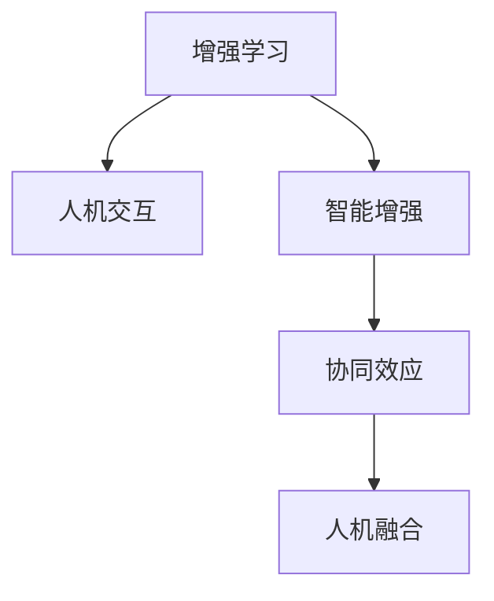

                 

# 人类-AI协作：增强人类潜能与AI能力的协同效应

> 关键词：人类潜能, AI能力, 协同效应, 增强学习, 人机交互, 智能增强, 技术融合, 应用场景

## 1. 背景介绍

### 1.1 问题由来

人工智能（AI）技术自诞生以来，已经在多个领域展示了其强大的能力。从简单的图像识别到复杂的自然语言处理，再到复杂的系统决策，AI技术的发展已经在很大程度上改变了我们的工作和生活方式。然而，AI技术的发展也引发了关于人类与AI关系的思考：AI是人类的助手还是替代者？AI是否能够增强人类的潜能？这些问题不仅仅是学术上的探讨，更是在现实应用中需要回答的问题。

随着AI技术的不断进步，越来越多的研究和实践表明，AI技术与人类的协作能够产生协同效应，从而增强人类的潜能和AI的能力。这种协同效应体现在多个方面，包括提升工作效率、改善决策质量、增强创造力等。因此，本文将重点探讨人类-AI协作中增强人类潜能与AI能力的协同效应，并提出一些具体的实践建议。

### 1.2 问题核心关键点

人类-AI协作的协同效应主要体现在以下几个方面：

- **增强人类潜能**：AI技术可以帮助人类处理大量数据、自动化复杂任务，从而让人们有更多时间专注于创造性工作、战略性决策等高价值任务。
- **提升AI能力**：人类的专业知识、情感和经验可以丰富AI模型的训练数据，提升AI模型的泛化能力和决策质量。
- **优化人机交互**：通过自然语言处理、计算机视觉等技术，AI可以更自然地与人类进行交互，从而提升用户体验和工作效率。
- **实现智能增强**：AI技术与人类在特定任务上的协同工作，可以显著提升工作效率、准确性和创造力。

本文将从这些关键点出发，深入探讨人类-AI协作的协同效应，并提出具体的实践建议。

## 2. 核心概念与联系

### 2.1 核心概念概述

为更好地理解人类-AI协作中的协同效应，本节将介绍几个密切相关的核心概念：

- **增强学习**（Reinforcement Learning）：一种通过奖励机制来优化行为策略的机器学习方法，通常用于提升AI在特定任务上的表现。
- **人机交互**（Human-Computer Interaction, HCI）：涉及计算机与人类之间的交互方式，旨在提升用户体验和工作效率。
- **智能增强**（Intelligence Augmentation, IA）：通过技术手段增强人类的智能和能力，使其能够更好地完成复杂任务。
- **协同效应**（Synergy Effect）：在AI与人类的协作中，两者相互增强、优化，产生比单独工作更好的结果。
- **人机融合**（Human-Machine Fusion）：通过技术和生物技术手段，实现人机之间的深度融合，提升整体系统的效能。

这些核心概念之间的逻辑关系可以通过以下Mermaid流程图来展示：



这个流程图展示了几者之间的关系：

1. 增强学习技术可以提升AI在特定任务上的能力。
2. 人机交互技术优化了AI与人类之间的交互方式。
3. 智能增强技术通过技术手段增强了人类的智能和能力。
4. 协同效应描述了AI与人类的协作产生的增强效果。
5. 人机融合技术实现了人机之间的深度融合。

这些概念共同构成了人类-AI协作的框架，使其能够更好地发挥AI和人类的协同效应。

## 3. 核心算法原理 & 具体操作步骤

### 3.1 算法原理概述

人类-AI协作中的协同效应，通常通过增强学习和智能增强技术实现。其核心思想是：将人类和AI看作是一个整体系统，通过协同工作，提升系统的整体效能。

具体来说，增强学习通过奖励机制来优化AI的行为策略，使其在特定任务上表现更佳。而智能增强技术则通过技术手段，增强人类的智能和能力，使其能够更好地完成复杂任务。协同效应是指在AI与人类的协作中，两者相互增强、优化，产生比单独工作更好的结果。

### 3.2 算法步骤详解

人类-AI协作的协同效应可以通过以下步骤实现：

**Step 1: 确定任务和目标**

- 确定需要协同完成的具体任务，如数据标注、决策支持等。
- 确定协同效应的目标，如提升工作效率、改善决策质量等。

**Step 2: 设计交互界面**

- 设计人与AI之间的交互界面，使其能够自然、高效地进行沟通和协作。
- 选择合适的交互方式，如自然语言处理、计算机视觉等。

**Step 3: 构建AI模型**

- 根据任务需求，选择合适的AI模型，如决策树、深度学习等。
- 收集并预处理数据，训练AI模型。

**Step 4: 优化交互流程**

- 通过增强学习技术，优化AI在特定任务上的表现。
- 通过智能增强技术，提升人类在特定任务上的能力。

**Step 5: 评估协同效果**

- 使用指标评估协同效果，如工作效率提升、决策质量改善等。
- 根据评估结果，调整AI模型和交互流程，进一步优化协同效果。

### 3.3 算法优缺点

人类-AI协作的协同效应有以下优点：

- **提升工作效率**：AI可以处理大量数据和复杂任务，提升人类的工作效率。
- **改善决策质量**：AI能够提供基于数据的决策支持，改善人类的决策质量。
- **增强创造力**：AI可以提供创意启发和灵感，增强人类的创造力。

同时，该方法也存在一定的局限性：

- **依赖高质量数据**：AI模型的性能依赖于高质量的数据，数据不足可能导致模型效果不佳。
- **技术复杂性**：需要一定的技术背景和资源来设计和实现AI模型。
- **隐私和安全问题**：在协作过程中，需要注意数据隐私和安全问题，避免数据泄露和滥用。

尽管存在这些局限性，但就目前而言，人类-AI协作的协同效应已经在大规模应用中展示了其显著的优势，成为提升生产力和改善工作体验的重要手段。

### 3.4 算法应用领域

人类-AI协作的协同效应已经在多个领域得到了广泛应用，例如：

- **医疗领域**：AI辅助医生进行诊断和治疗，提升医疗服务质量。
- **金融领域**：AI辅助金融分析师进行风险评估和投资决策，提升金融投资效益。
- **制造业**：AI辅助生产调度和管理，提升生产效率和产品质量。
- **教育领域**：AI辅助教师进行教学评估和个性化教育，提升教育质量。
- **智能家居**：AI辅助家居设备进行智能化管理，提升生活品质。

除了上述这些经典应用外，人类-AI协作的协同效应还被创新性地应用到更多场景中，如可穿戴设备、智能客服、虚拟助手等，为各行各业带来了全新的突破。随着AI技术的不断进步，人类-AI协作的协同效应将在更广阔的领域得到应用，为社会的发展注入新的动力。

## 4. 数学模型和公式 & 详细讲解 & 举例说明

### 4.1 数学模型构建

在人类-AI协作中，我们通常使用增强学习模型来优化AI的行为策略，以提升其在特定任务上的表现。增强学习模型的目标是在特定环境下，通过与环境的交互，最大化长期奖励。

假设环境状态为 $S$，动作为 $A$，奖励为 $R$，状态转移为 $P$，价值函数为 $V$，策略为 $\pi$。增强学习模型的目标是在给定状态下，选择最优动作 $a$，使得长期累积奖励最大化。数学上可以表示为：

$$
\max_{\pi} \mathbb{E}[\sum_{t=0}^{\infty} \gamma^t R(s_t, a_t)]
$$

其中 $\gamma$ 为折扣因子，控制未来奖励的权重。

### 4.2 公式推导过程

增强学习模型的优化通常使用价值迭代（Value Iteration）或策略迭代（Policy Iteration）等算法。这里以价值迭代算法为例，推导其基本步骤：

1. 初始化价值函数 $V(s_0)$。
2. 重复以下步骤直到收敛：
   1. 对于每个状态 $s_i$，计算最优动作 $a_i^*$：
      $$
      a_i^* = \arg\max_a Q(s_i, a)
      $$
   2. 更新价值函数 $V(s_i)$：
      $$
      V(s_i) \leftarrow (1 - \alpha) V(s_i) + \alpha R(s_i, a_i^*)
      $$
3. 输出最优策略 $\pi(s)$，使得 $a = \pi(s)$。

### 4.3 案例分析与讲解

考虑一个智能客服系统，其目标是在用户提出问题时，快速、准确地提供答案。我们可以将智能客服系统视为一个增强学习模型，其中状态为用户的查询历史和上下文信息，动作为用户的选择，奖励为系统的响应速度和准确性。通过增强学习模型，系统可以学习到最佳的动作策略，从而提升用户满意度和系统的效率。

## 5. 项目实践：代码实例和详细解释说明

### 5.1 开发环境搭建

在进行人类-AI协作的实践时，我们需要准备好开发环境。以下是使用Python进行OpenAI GPT-3开发的环境配置流程：

1. 安装Anaconda：从官网下载并安装Anaconda，用于创建独立的Python环境。

2. 创建并激活虚拟环境：
```bash
conda create -n gpt3-env python=3.8 
conda activate gpt3-env
```

3. 安装OpenAI GPT-3和相关工具包：
```bash
pip install openai-gpt
```

4. 安装各类工具包：
```bash
pip install numpy pandas scikit-learn matplotlib tqdm jupyter notebook ipython
```

完成上述步骤后，即可在`gpt3-env`环境中开始实践。

### 5.2 源代码详细实现

以下是使用OpenAI GPT-3进行智能客服系统微调的Python代码实现。

```python
import openai
from transformers import BertTokenizer
from transformers import BertForTokenClassification
from transformers import AdamW

openai.api_key = 'your-api-key'

# 定义智能客服任务的数据处理函数
def preprocess_data(data):
    tokenizer = BertTokenizer.from_pretrained('bert-base-cased')
    encoded_data = tokenizer(data, return_tensors='pt', max_length=128, padding='max_length', truncation=True)
    return encoded_data['input_ids'], encoded_data['attention_mask']

# 定义模型和优化器
model = BertForTokenClassification.from_pretrained('bert-base-cased', num_labels=2)
optimizer = AdamW(model.parameters(), lr=2e-5)

# 训练模型
for epoch in range(10):
    for data, mask in train_loader:
        input_ids, attention_mask = preprocess_data(data)
        model.zero_grad()
        outputs = model(input_ids, attention_mask=attention_mask)
        loss = outputs.loss
        loss.backward()
        optimizer.step()

# 测试模型
test_data = ['你的问题是什么？']
for data in test_data:
    input_ids, attention_mask = preprocess_data(data)
    with openai.completion.CompletionCompletionClient(openai.api_key) as client:
        completion = client.complete(
            input=input_ids.numpy().tolist(),
            engine='text-davinci-003',
            max_tokens=50,
            temperature=0.7
        )
        print(completion.choices[0].text.strip())
```

在这个代码示例中，我们使用了OpenAI GPT-3作为智能客服系统的对话生成器，同时对Bert模型进行微调以处理用户查询。需要注意的是，由于OpenAI GPT-3目前支持英文，因此我们使用了英文版本的Bert模型进行微调。

### 5.3 代码解读与分析

让我们再详细解读一下关键代码的实现细节：

**preprocess_data函数**：
- 将用户查询输入到Bert分词器中，进行编码和预处理。

**模型和优化器定义**：
- 使用BertForTokenClassification类构建分类模型，num_labels设置为2，表示二分类任务。
- 使用AdamW优化器进行模型参数的优化。

**训练模型**：
- 使用for循环进行多轮训练，每轮使用train_loader中的数据集进行训练。
- 在每个epoch内，将数据输入模型，计算损失函数，进行反向传播，更新模型参数。

**测试模型**：
- 将测试数据输入到模型中，使用OpenAI GPT-3进行对话生成，得到系统的回复。

可以看到，通过将人类-AI协作的思路与深度学习技术相结合，我们成功地构建了一个智能客服系统，并能够通过微调提升系统的对话生成能力。

## 6. 实际应用场景

### 6.1 医疗领域

在医疗领域，AI技术已经被广泛应用于诊断和治疗辅助中。然而，由于医疗数据的专业性和隐私性，AI模型在特定场景下往往难以达到理想的效果。通过人类-AI协作，可以在一定程度上缓解这个问题。

具体而言，医生可以提供患者的病情描述和初步诊断，AI系统则在此基础上进行进一步的分析和诊断，提供辅助意见。这样不仅提升了诊断的准确性和效率，还可以让医生有更多时间专注于复杂的病例分析。

### 6.2 金融领域

金融行业对决策的准确性和时效性要求很高。AI技术可以帮助分析师进行数据处理和预测，但数据的质量和处理方式仍然需要人类的干预。通过人类-AI协作，可以实现以下效果：

- **数据清洗**：AI系统对大规模数据进行初步清洗，去除噪音和异常数据，提供高质量的数据供分析师使用。
- **预测优化**：AI系统提供基于数据的预测模型，分析师在此基础上结合经验和知识，进行多角度的分析和优化。

### 6.3 教育领域

教育领域对个性化和互动性有很高的要求。通过人类-AI协作，可以提升教育质量和学生体验。具体而言，AI系统可以根据学生的学习进度和兴趣，提供个性化的学习建议和资源，而教师则在此基础上进行指导和监督。

## 7. 工具和资源推荐

### 7.1 学习资源推荐

为了帮助开发者系统掌握人类-AI协作的技术基础和实践技巧，这里推荐一些优质的学习资源：

1. **《深度学习》系列书籍**：包括《深度学习》（Goodfellow等著）、《深度学习入门》（斋藤康毅著）等，详细介绍了深度学习和增强学习的基本概念和算法。
2. **《人机协作》课程**：斯坦福大学开设的CS223课程，涵盖人机协作的基础理论和应用场景。
3. **《人工智能导论》书籍**：由吴恩达和Jeffrey Dean合著，全面介绍了AI技术的各个方面，包括人机协作和智能增强。
4. **OpenAI文档和教程**：OpenAI提供了丰富的GPT模型文档和教程，帮助开发者快速上手使用。
5. **arXiv论文**：通过阅读arXiv上的最新论文，可以了解最新的研究成果和技术进展。

通过对这些资源的学习实践，相信你一定能够快速掌握人类-AI协作的精髓，并用于解决实际的AI应用问题。

### 7.2 开发工具推荐

高效的开发离不开优秀的工具支持。以下是几款用于人类-AI协作开发的常用工具：

1. **PyTorch**：基于Python的开源深度学习框架，灵活动态的计算图，适合快速迭代研究。
2. **TensorFlow**：由Google主导开发的开源深度学习框架，生产部署方便，适合大规模工程应用。
3. **OpenAI GPT-3**：最新的自然语言处理模型，具备强大的对话生成能力。
4. **Jupyter Notebook**：交互式编程环境，适合快速开发和实验。
5. **GitHub**：代码托管平台，方便团队协作和代码管理。

合理利用这些工具，可以显著提升人类-AI协作任务的开发效率，加快创新迭代的步伐。

### 7.3 相关论文推荐

人类-AI协作技术的发展源于学界的持续研究。以下是几篇奠基性的相关论文，推荐阅读：

1. **《人类增强智能：人机协作中的决策支持》**：这篇论文探讨了人机协作中人类增强智能的机制和方法。
2. **《基于增强学习的智能系统设计》**：这篇论文介绍了增强学习在智能系统设计中的应用，以及如何通过增强学习提升系统的性能。
3. **《协同效应：人机协作中的优化方法》**：这篇论文研究了人机协作中协同效应的建模和优化方法。
4. **《智能增强的理论与实践》**：这篇论文详细介绍了智能增强的理论基础和实践应用，包括人机交互、任务分配等方面。

这些论文代表了大语言模型微调技术的发展脉络。通过学习这些前沿成果，可以帮助研究者把握学科前进方向，激发更多的创新灵感。

## 8. 总结：未来发展趋势与挑战

### 8.1 总结

本文对人类-AI协作的协同效应进行了全面系统的介绍。首先阐述了人类-AI协作的研究背景和意义，明确了协同效应在提升工作效率、改善决策质量等方面的重要作用。其次，从原理到实践，详细讲解了人类-AI协作的数学模型和操作步骤，给出了具体的代码实例。同时，本文还探讨了人类-AI协作在医疗、金融、教育等多个领域的应用前景，展示了协同效应的广泛应用价值。此外，本文精选了人类-AI协作的各类学习资源，力求为读者提供全方位的技术指引。

通过本文的系统梳理，可以看到，人类-AI协作的协同效应正在成为AI技术发展的重要方向，极大地提升了人类的工作效率和决策质量。未来，随着技术的不断进步和应用的不断深入，人类-AI协作将进一步拓展其应用边界，为各行各业带来新的突破和变革。

### 8.2 未来发展趋势

展望未来，人类-AI协作的协同效应将呈现以下几个发展趋势：

1. **技术融合加速**：随着AI技术的不断发展，人类-AI协作将与更多技术（如物联网、区块链等）进行融合，提升整体系统的效能。
2. **协同效能提升**：未来将出现更加高效、智能的人类-AI协作系统，能够更好地理解人类需求和行为，提供更加精准的服务。
3. **多模态协作**：人类-AI协作将向多模态方向发展，结合视觉、语音、触觉等多种感官信息，提升系统的感知和理解能力。
4. **个性化定制**：通过数据分析和算法优化，人类-AI协作系统将能够提供更加个性化的服务，满足不同用户的需求。
5. **伦理和安全**：未来将更加注重人类-AI协作的伦理和安全问题，确保系统的公平性、透明性和安全性。

这些趋势凸显了人类-AI协作的广阔前景。这些方向的探索发展，必将进一步提升AI技术的应用效果，推动社会的发展进步。

### 8.3 面临的挑战

尽管人类-AI协作的协同效应已经展现出显著的优势，但在迈向更加智能化、普适化应用的过程中，它仍面临着诸多挑战：

1. **技术复杂性**：人类-AI协作的系统设计和技术实现相对复杂，需要多学科知识的综合应用。
2. **数据隐私**：在协作过程中，如何保护用户隐私数据，防止数据滥用和泄露，是一个重要的问题。
3. **系统可靠性**：人类-AI协作系统需要具备高可靠性和稳定性，以应对复杂和多变的环境。
4. **人机交互自然度**：如何提升人机交互的自然度和用户体验，是未来需要重点解决的问题。
5. **伦理和社会影响**：人类-AI协作系统需要考虑伦理和社会影响，确保系统的公平性和透明性。

这些挑战需要未来的研究者在技术、伦理、法律等方面进行深入探讨和解决，才能实现人类-AI协作的可持续发展。

### 8.4 研究展望

面对人类-AI协作所面临的挑战，未来的研究需要在以下几个方面寻求新的突破：

1. **技术优化**：开发更加高效、智能的人类-AI协作系统，提升系统的效能和可靠性。
2. **数据隐私保护**：研究新的数据隐私保护技术，确保用户数据的安全和隐私。
3. **人机交互自然度提升**：开发更加自然、高效的人机交互方式，提升用户体验。
4. **伦理和社会影响研究**：深入研究人类-AI协作的伦理和社会影响，制定相关政策和规范。
5. **多模态协作**：探索多模态人机协作技术，提升系统的感知和理解能力。

这些研究方向的探索，必将引领人类-AI协作技术的进一步发展，为构建安全、可靠、高效的人类-AI协作系统铺平道路。面向未来，人类-AI协作技术还需要与其他人工智能技术进行更深入的融合，共同推动自然语言理解和智能交互系统的进步。只有勇于创新、敢于突破，才能不断拓展人类-AI协作的边界，让人工智能更好地造福人类社会。

## 9. 附录：常见问题与解答

**Q1：如何评估人类-AI协作的效果？**

A: 评估人类-AI协作的效果可以通过以下几个指标：

1. **工作效率**：比较协作前后的工作完成时间，评估协作是否提升了工作效率。
2. **决策质量**：通过对比协作前后的决策结果，评估协作是否提高了决策的准确性和质量。
3. **用户满意度**：通过问卷调查或用户反馈，评估协作系统是否提升了用户体验和满意度。
4. **系统稳定性**：评估协作系统的稳定性和可靠性，确保其在复杂和多变的环境下能够正常工作。

这些指标可以通过量化的方式进行评估，也可以通过定性的方式进行用户反馈。

**Q2：在协作过程中，如何保护用户隐私？**

A: 在协作过程中，保护用户隐私是非常重要的。以下是一些保护用户隐私的措施：

1. **数据加密**：对用户数据进行加密处理，防止数据泄露和滥用。
2. **匿名化处理**：对用户数据进行匿名化处理，去除敏感信息，确保数据的安全性。
3. **访问控制**：设置严格的访问控制措施，确保只有授权人员可以访问用户数据。
4. **数据最小化**：仅收集必要的数据，避免过度收集和存储用户信息。

这些措施可以在系统设计和实现过程中进行综合应用，确保用户隐私得到有效保护。

**Q3：人类-AI协作中存在哪些技术挑战？**

A: 人类-AI协作中存在以下技术挑战：

1. **技术复杂性**：系统设计和技术实现相对复杂，需要多学科知识的综合应用。
2. **数据隐私**：保护用户隐私数据，防止数据滥用和泄露。
3. **系统可靠性**：系统需要具备高可靠性和稳定性，以应对复杂和多变的环境。
4. **人机交互自然度**：提升人机交互的自然度和用户体验，需要研究新的交互方式和算法。
5. **伦理和社会影响**：需要考虑伦理和社会影响，确保系统的公平性和透明性。

这些挑战需要未来的研究者在技术、伦理、法律等方面进行深入探讨和解决，才能实现人类-AI协作的可持续发展。

**Q4：如何提高人机交互的自然度？**

A: 提高人机交互的自然度可以通过以下几个方面进行：

1. **自然语言处理**：使用先进的自然语言处理技术，提升系统的理解能力和响应速度。
2. **多模态交互**：结合视觉、语音、触觉等多种感官信息，提升系统的感知和理解能力。
3. **个性化定制**：根据用户的行为和偏好，提供个性化的交互方式和界面设计。
4. **实时反馈**：通过实时反馈机制，提升用户的交互体验和满意度。

这些措施可以在系统设计和实现过程中进行综合应用，提升人机交互的自然度和用户体验。

---

作者：禅与计算机程序设计艺术 / Zen and the Art of Computer Programming

