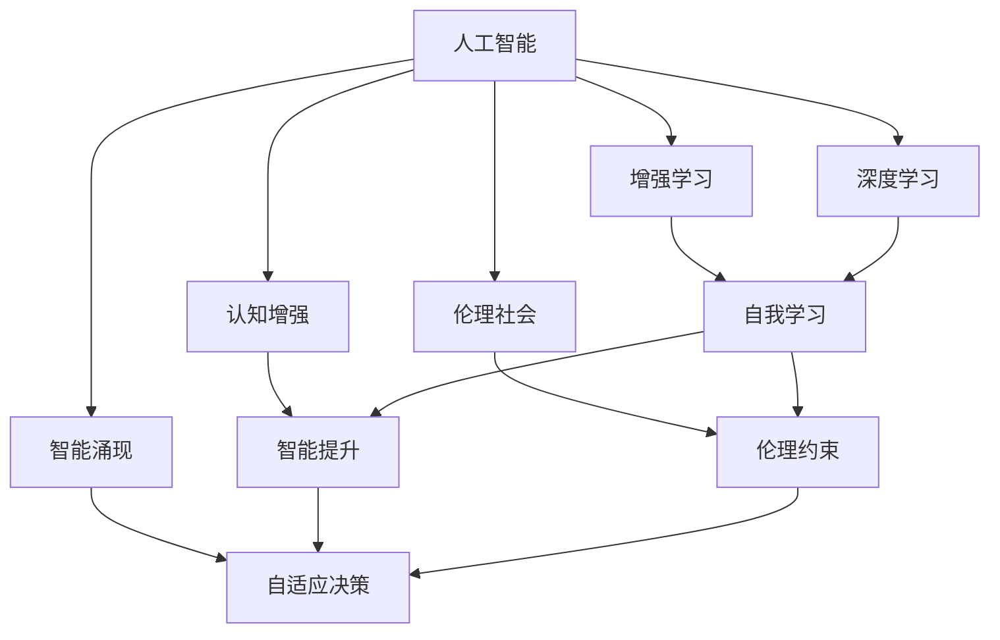

                 

# 人类-AI协作：增强人类潜能与AI能力的未来发展

> 关键词：人机协作,人工智能,增强学习,深度学习,认知增强,智能涌现,伦理社会

## 1. 背景介绍

随着人工智能技术的快速发展，人类与AI之间的协作正迎来一个前所未有的时代。这一时代不仅意味着技术的飞速进步，更标志着人类潜能的深度挖掘与AI能力的广泛释放。无论是科学研究、社会治理、企业生产，还是个人生活，人工智能正以一种全新的方式深刻影响着各个领域，重新定义着人类的未来。

### 1.1 研究背景

人工智能（Artificial Intelligence, AI）作为21世纪最前沿的技术领域，已经从单一的算法研究和理论探讨，发展成为跨学科、跨行业的综合性应用。在深度学习、增强学习、认知增强、多模态智能融合等领域，AI已经展现出惊人的潜力。然而，尽管AI技术不断突破，其核心使命仍是为人类服务，增强人类的智能和能力。因此，探讨人类与AI的协作方式、AI技术如何为人类赋能，以及这种协作带来的社会、伦理和道德挑战，成为当前研究的重要方向。

### 1.2 研究意义

本文旨在深入探讨人类与AI协作的未来发展，特别是如何利用AI技术增强人类的智能潜能，推动智能社会的建设。通过分析AI技术在各个领域的应用，探讨人机协作的可行性、效果及其潜在风险，为未来智能技术的应用提供理论指导和实践参考。同时，本文也将关注AI技术发展过程中所面临的伦理和社会问题，力求构建一个负责任、可持续发展的智能社会。

## 2. 核心概念与联系

### 2.1 核心概念概述

要深入理解人类与AI协作的未来发展，首先需要明确几个核心概念：

- **人工智能（Artificial Intelligence, AI）**：通过算法和计算，使计算机系统能够执行通常需要人类智能的任务，如学习、推理、规划和理解语言。
- **增强学习（Reinforcement Learning, RL）**：一种学习方式，通过与环境的交互，智能体根据奖励信号调整策略，以实现特定目标。
- **深度学习（Deep Learning, DL）**：基于多层神经网络，通过模拟人脑神经元工作方式，实现对复杂数据的处理和学习。
- **认知增强（Cognitive Enhancement）**：利用AI技术提升人类的认知能力，如记忆、注意力、问题解决等。
- **智能涌现（Emergent Intelligence）**：多个简单单元通过交互和协作，形成复杂、自主的行为和决策，超出单个单元的能力。
- **伦理社会（Ethical Society）**：一个强调道德、公正和可持续发展的社会，AI技术的应用需遵守伦理准则。

这些概念之间存在紧密的联系，共同构成了人类与AI协作的未来发展框架。深度学习为AI提供了强大的技术支撑，增强学习则为AI赋予了自我学习的能力，认知增强则体现了AI技术对人类智力的增强，智能涌现则展示了AI系统自我演化的潜力，伦理社会则强调了AI技术应用时需要遵循的伦理原则。

### 2.2 核心概念联系（Mermaid 流程图）



上述流程图展示了人工智能技术通过深度学习、增强学习、认知增强和智能涌现等多个维度，实现对人类潜能的增强，并在伦理社会的框架下，确保AI技术的健康发展。

## 3. 核心算法原理 & 具体操作步骤

### 3.1 算法原理概述

人类与AI协作的实现依赖于多种核心算法，包括深度学习、增强学习、认知增强和智能涌现等。这些算法通过技术手段，帮助人类在决策、问题解决、认知提升等方面实现突破。

- **深度学习**：通过多层神经网络对数据进行抽象和表示，提取高层次的特征，从而在图像、语音、自然语言处理等领域取得显著成效。
- **增强学习**：利用奖励信号引导智能体逐步学习最优策略，适用于复杂的控制和决策问题，如游戏AI、机器人控制等。
- **认知增强**：通过AI技术增强人类的认知能力，如记忆扩展、注意力提升、问题解决等，实现智能辅助和认知增强。
- **智能涌现**：通过多智能体间的交互与协作，实现复杂、自适应、自主的行为和决策，提升系统整体的智能水平。

### 3.2 算法步骤详解

在实践中，这些核心算法可以按照以下步骤进行具体操作：

1. **数据获取与预处理**：
   - 收集人类与AI协作的相关数据，如人机交互日志、AI系统的决策记录等。
   - 对数据进行清洗和标准化处理，确保数据的质量和一致性。

2. **模型选择与训练**：
   - 根据具体任务选择合适的深度学习、增强学习、认知增强和智能涌现模型。
   - 利用已有数据集对模型进行训练，调整模型参数，优化模型性能。

3. **人机协作实现**：
   - 将训练好的AI模型集成到人类协作系统中，如决策支持系统、智能辅助工具等。
   - 设计合适的用户界面和交互机制，确保人类与AI系统能够有效沟通和协作。

4. **性能评估与优化**：
   - 在实际应用中，不断评估AI系统的性能，收集用户反馈和系统表现数据。
   - 根据评估结果，调整模型参数和系统设计，提升协作效果。

5. **伦理审查与社会监督**：
   - 确保AI系统遵守伦理和社会规范，避免偏见和歧视。
   - 建立透明的决策过程和解释机制，增强用户对AI系统的信任。

### 3.3 算法优缺点

基于人类与AI协作的算法原理和操作步骤，可以总结出以下优缺点：

**优点**：
- **高效性**：AI技术可以在短时间内处理大量数据，提供高效的决策支持。
- **创新性**：通过智能涌现和多智能体的协作，AI系统可以产生新的解决方案和创新思维。
- **广泛适用性**：AI技术可以应用于多个领域，提升生产效率和生活质量。

**缺点**：
- **依赖数据**：AI系统的性能高度依赖于数据质量，数据偏见可能导致AI系统的偏见。
- **解释性不足**：许多AI系统的决策过程缺乏解释，难以理解和调试。
- **伦理风险**：AI系统在决策过程中可能出现偏见、歧视等问题，需进行伦理审查。

### 3.4 算法应用领域

基于深度学习、增强学习、认知增强和智能涌现的AI技术，已经在多个领域取得了显著的应用效果，具体如下：

- **医疗健康**：AI技术在医疗影像诊断、药物研发、个性化医疗等方面发挥了重要作用，提升了医疗服务的质量和效率。
- **金融服务**：通过智能推荐、风险评估、客户服务等应用，AI技术帮助金融机构提升了服务水平和运营效率。
- **教育培训**：AI技术在个性化学习、智能辅导、作业批改等方面展示了其强大的潜力，为教育公平提供了新的解决方案。
- **智能制造**：通过智能检测、智能调度、智能控制等应用，AI技术提升了制造业的生产效率和产品质量。
- **智能交通**：通过智能导航、智能调度、智能监控等应用，AI技术提升了交通系统的安全性和效率。

## 4. 数学模型和公式 & 详细讲解 & 举例说明

### 4.1 数学模型构建

为了更好地理解人类与AI协作的算法原理，本节将介绍几个常用的数学模型：

- **深度学习模型**：
  - 多层感知机（Multilayer Perceptron, MLP）：一种前馈神经网络，通过多个线性变换和激活函数进行特征提取。
  - 卷积神经网络（Convolutional Neural Network, CNN）：利用卷积操作提取图像特征，适用于图像分类、目标检测等任务。
  - 循环神经网络（Recurrent Neural Network, RNN）：通过时间维度上的递归关系，处理序列数据，适用于语言建模、机器翻译等任务。

- **增强学习模型**：
  - Q-learning：一种基于状态-动作-奖励（State-Action-Reward, SAR）的模型，通过奖励信号指导智能体的决策。
  - Deep Q-Network（DQN）：将Q-learning与深度学习结合，利用神经网络进行状态和动作的表示和选择。

- **认知增强模型**：
  - 记忆增强网络（Memory-Augmented Neural Network, MANN）：通过外部记忆模块增强神经网络的记忆能力。
  - 注意力机制（Attention Mechanism）：利用注意力机制提升神经网络对关键信息的关注，优化决策过程。

- **智能涌现模型**：
  - 分布式协同优化（Distributed Cooperative Optimization, DCO）：通过多个智能体间的协同优化，提升系统整体的性能。
  - 多智能体系统（Multi-Agent System, MAS）：通过智能体间的交互和协作，实现复杂的决策和行为。

### 4.2 公式推导过程

以下以深度学习和增强学习为例，推导两个常见的数学公式。

**深度学习中的前向传播公式**：
$$
h = \sigma(z) = \sigma(Wx + b)
$$
其中，$h$ 为神经网络中间层的输出，$x$ 为输入，$W$ 为权重矩阵，$b$ 为偏置向量，$\sigma$ 为激活函数。

**增强学习中的Q-learning公式**：
$$
Q(s, a) \leftarrow (1-\alpha)Q(s, a) + \alpha(r + \gamma \max_{a'}Q(s', a'))
$$
其中，$Q(s, a)$ 为状态-动作值函数，$\alpha$ 为学习率，$r$ 为即时奖励，$\gamma$ 为折扣因子，$s'$ 为下一个状态，$a'$ 为下一个动作。

### 4.3 案例分析与讲解

为了更好地理解这些数学模型的应用，下面以一个简单的例子进行讲解：

**案例：智能推荐系统**

- **深度学习模型应用**：
  - 使用卷积神经网络（CNN）对用户的历史行为数据进行特征提取。
  - 利用全连接层对提取的特征进行分类，推荐最相关的商品或内容。

- **增强学习模型应用**：
  - 将用户点击、浏览、购买等行为视为状态，将推荐结果视为动作。
  - 利用Q-learning模型优化推荐策略，提高用户的满意度。

- **认知增强模型应用**：
  - 通过记忆增强网络（MANN）保存用户的历史偏好和行为数据。
  - 利用注意力机制对不同特征进行加权，提升推荐的准确性。

## 5. 项目实践：代码实例和详细解释说明

### 5.1 开发环境搭建

在进行AI技术项目实践前，我们需要准备好开发环境。以下是使用Python进行TensorFlow开发的流程：

1. 安装Anaconda：从官网下载并安装Anaconda，用于创建独立的Python环境。

2. 创建并激活虚拟环境：
```bash
conda create -n tf-env python=3.8 
conda activate tf-env
```

3. 安装TensorFlow：
```bash
pip install tensorflow
```

4. 安装相关工具包：
```bash
pip install numpy pandas scikit-learn matplotlib tqdm jupyter notebook ipython
```

完成上述步骤后，即可在`tf-env`环境中开始AI技术项目实践。

### 5.2 源代码详细实现

下面我们以智能推荐系统为例，给出使用TensorFlow进行深度学习模型开发的PyTorch代码实现。

首先，定义数据处理函数：

```python
import tensorflow as tf
import numpy as np

def load_data():
    # 加载用户行为数据
    user_behaviors = np.load('user_behaviors.npy')
    # 加载商品信息
    items = np.load('items.npy')
    return user_behaviors, items
```

然后，定义模型结构：

```python
def build_model(user_behaviors, items, num_users, num_items, embedding_dim=128):
    # 定义输入层
    user_input = tf.keras.layers.Input(shape=(user_behaviors.shape[1],))
    item_input = tf.keras.layers.Input(shape=(items.shape[1],))
    # 定义卷积层和全连接层
    user_feats = tf.keras.layers.Dense(embedding_dim, activation='relu')(user_input)
    item_feats = tf.keras.layers.Dense(embedding_dim, activation='relu')(item_input)
    # 定义点积层
    dot_product = tf.keras.layers.Dot(axes=(2, 2))([user_feats, item_feats])
    # 定义输出层
    output = tf.keras.layers.Dense(1, activation='sigmoid')(dot_product)
    # 定义模型
    model = tf.keras.Model(inputs=[user_input, item_input], outputs=output)
    return model
```

接着，定义训练和评估函数：

```python
def train_model(model, user_behaviors, items, num_users, num_items, batch_size=16, epochs=10):
    # 定义损失函数
    loss_fn = tf.keras.losses.BinaryCrossentropy()
    # 定义优化器
    optimizer = tf.keras.optimizers.Adam()
    # 编译模型
    model.compile(optimizer=optimizer, loss=loss_fn)
    # 训练模型
    model.fit([user_behaviors, items], labels, batch_size=batch_size, epochs=epochs, validation_split=0.2)
    # 评估模型
    test_loss = model.evaluate([test_user_behaviors, test_items], test_labels, batch_size=batch_size)
    return model, test_loss
```

最后，启动训练流程并在测试集上评估：

```python
# 加载数据
user_behaviors, items = load_data()

# 构建模型
model = build_model(user_behaviors, items, num_users, num_items)

# 训练模型
model, test_loss = train_model(model, user_behaviors, items, num_users, num_items)

# 打印测试损失
print(f'Test loss: {test_loss:.4f}')
```

以上就是使用TensorFlow进行深度学习模型开发的完整代码实现。可以看到，TensorFlow提供了强大的API和工具，可以方便地实现深度学习模型的构建和训练。

### 5.3 代码解读与分析

让我们再详细解读一下关键代码的实现细节：

**load_data函数**：
- 加载用户行为数据和商品信息，为模型训练提供数据支持。

**build_model函数**：
- 定义了用户行为特征和商品特征的输入层。
- 通过卷积层和全连接层进行特征提取和编码。
- 使用点积层计算用户行为和商品特征的相似度。
- 通过输出层进行二分类，预测用户是否会点击某商品。

**train_model函数**：
- 定义了损失函数和优化器，编译模型。
- 使用训练集进行模型训练，并在验证集上进行性能评估。
- 在测试集上计算模型的损失，评估模型效果。

**训练流程**：
- 定义了训练轮数和批次大小，启动训练流程。
- 每轮训练使用所有训练数据进行前向传播和反向传播，更新模型参数。
- 在验证集上定期评估模型性能，防止过拟合。
- 在测试集上计算模型损失，给出最终评估结果。

## 6. 实际应用场景

### 6.1 智能医疗

在智能医疗领域，AI技术的应用主要集中在医疗影像诊断、药物研发和个性化医疗等方面。通过深度学习和增强学习，AI技术可以辅助医生进行精确诊断，优化药物研发流程，提供个性化的治疗方案。

- **医疗影像诊断**：
  - 利用卷积神经网络（CNN）对医学影像进行特征提取和分类，辅助医生进行疾病诊断。
  - 使用增强学习模型优化诊断流程，提高诊断准确性和效率。

- **药物研发**：
  - 利用深度学习模型对化学分子进行建模，预测其生物活性。
  - 通过增强学习模型优化药物设计流程，加速新药研发。

- **个性化医疗**：
  - 通过认知增强模型分析患者的基因数据和生活习惯，提供个性化的治疗方案。
  - 利用智能涌现模型优化医疗决策，提升治疗效果。

### 6.2 智能金融

在金融领域，AI技术主要应用于风险评估、智能投顾和欺诈检测等方面。通过深度学习和增强学习，AI技术可以提高金融机构的决策效率，降低风险，提升客户服务体验。

- **风险评估**：
  - 利用深度学习模型对客户的信用记录和行为数据进行分析，评估其信用风险。
  - 通过增强学习模型优化信贷审批流程，提高审批效率和准确性。

- **智能投顾**：
  - 利用深度学习模型对市场数据进行分析和预测，提供投资建议。
  - 通过增强学习模型优化投资组合，实现资产配置优化。

- **欺诈检测**：
  - 利用深度学习模型对交易数据进行异常检测，识别潜在的欺诈行为。
  - 通过增强学习模型优化欺诈检测算法，提高检测准确性。

### 6.3 智能教育

在教育领域，AI技术主要应用于个性化学习、智能辅导和作业批改等方面。通过深度学习和增强学习，AI技术可以为学生提供个性化的学习方案，提高教育质量和效率。

- **个性化学习**：
  - 利用深度学习模型对学生的学习行为和表现进行分析，提供个性化的学习建议。
  - 通过增强学习模型优化学习路径，提高学习效果。

- **智能辅导**：
  - 利用深度学习模型对学生的提问进行分析和回答，提供智能辅导服务。
  - 通过增强学习模型优化辅导策略，提高辅导效果。

- **作业批改**：
  - 利用深度学习模型对学生的作业进行自动批改和反馈，提高批改效率和准确性。
  - 通过增强学习模型优化批改算法，提升批改质量。

### 6.4 未来应用展望

随着AI技术的不断发展，人类与AI协作的未来应用将更加广泛和深入。以下是一些未来的应用展望：

- **智慧城市**：通过AI技术实现智能交通、智能安防、智能环保等应用，提升城市管理水平和居民生活质量。
- **智能制造**：利用AI技术实现智能检测、智能调度和智能控制，提升制造业的生产效率和产品质量。
- **智能家居**：通过AI技术实现智能家居设备的操作和控制，提高家庭生活的便利性和舒适度。
- **智能交互**：通过自然语言处理和智能推荐技术，实现人机自然交互和智能推荐，提升用户体验。

## 7. 工具和资源推荐

### 7.1 学习资源推荐

为了帮助开发者系统掌握AI技术的应用，以下是一些优质的学习资源：

1. 《深度学习》课程：斯坦福大学开设的深度学习课程，讲解深度学习的基本原理和应用。
2. 《强化学习》课程：强化学习领域的经典教材，系统介绍了增强学习的基本理论和算法。
3. 《认知增强》书籍：介绍认知增强技术的基本原理和应用，探讨AI技术对人类认知的增强。
4. 《智能涌现》书籍：探讨智能涌现的基本原理和应用，分析多智能体系统的协同演进。
5. 《伦理社会》书籍：探讨AI技术在社会应用中的伦理问题，强调伦理审查和公平性。

通过对这些资源的深入学习，相信你一定能够掌握AI技术的基本原理和应用方法，为未来人类与AI协作的发展做出贡献。

### 7.2 开发工具推荐

高效的开发离不开优秀的工具支持。以下是几款用于AI技术开发的常用工具：

1. TensorFlow：谷歌开发的深度学习框架，提供丰富的API和工具，支持分布式计算。
2. PyTorch：Facebook开发的深度学习框架，灵活性和易用性高，支持动态图和静态图。
3. Keras：高层次的深度学习框架，提供简洁的API和易用的工具，支持多种后端引擎。
4. Jupyter Notebook：开源的交互式笔记本环境，支持多种编程语言和库，方便开发和调试。
5. TensorBoard：TensorFlow配套的可视化工具，提供实时监测和数据分析，帮助调试模型。

合理利用这些工具，可以显著提升AI技术的开发效率，加速创新迭代的步伐。

### 7.3 相关论文推荐

AI技术的发展源于学界的持续研究。以下是几篇奠基性的相关论文，推荐阅读：

1. Deep Blue：IBM开发的国际象棋AI，展示了AI在决策和推理中的应用。
2. AlphaGo：DeepMind开发的围棋AI，展示了AI在复杂策略和自适应决策中的应用。
3. Generative Adversarial Networks（GANs）：提出了生成对抗网络，展示了AI在图像生成和数据增强中的应用。
4. Reinforcement Learning for Human-Robot Interaction（RLHRI）：探讨了增强学习在机器人控制和人机交互中的应用。
5. Cognitive Enhancement：介绍了认知增强技术的基本原理和应用，探讨AI技术对人类认知的增强。

这些论文代表了大规模AI技术的发展脉络，通过学习这些前沿成果，可以帮助研究者把握学科前进方向，激发更多的创新灵感。

## 8. 总结：未来发展趋势与挑战

### 8.1 研究成果总结

本文对人类与AI协作的未来发展进行了系统介绍，涵盖了深度学习、增强学习、认知增强和智能涌现等多个领域，探讨了AI技术在各个应用场景中的应用和潜力。通过分析AI技术的优势和不足，明确了未来发展的方向和挑战，为未来智能技术的应用提供了理论指导和实践参考。

### 8.2 未来发展趋势

展望未来，人类与AI协作将呈现以下几个发展趋势：

1. **技术融合**：AI技术与物联网、大数据、云计算等技术深度融合，实现更广泛的应用场景。
2. **智能化协同**：AI技术与人类的协同工作将更加紧密，实现智能辅助和增强人类认知。
3. **伦理规范**：随着AI技术的应用，伦理问题将受到越来越多的关注，强调透明、公正和可解释性。
4. **多模态智能**：AI技术将更多地应用于多模态数据处理，实现视觉、语音、文本等数据的协同建模。
5. **人机共生**：AI技术将更多地融入人类生活和工作，实现人机共生共融。

### 8.3 面临的挑战

尽管AI技术的发展势头迅猛，但在迈向更加智能化、普适化的过程中，仍面临诸多挑战：

1. **数据隐私**：AI技术的应用需要大量的数据，如何保护数据隐私和用户隐私是一个重要问题。
2. **伦理问题**：AI技术在应用过程中可能出现偏见、歧视等问题，如何确保公平性和公正性是一个难题。
3. **模型可解释性**：许多AI模型缺乏解释，难以理解和调试，如何提高模型的可解释性是一个挑战。
4. **技术门槛**：AI技术的开发和应用需要高水平的技术能力和资源投入，如何降低技术门槛是一个现实问题。
5. **社会接受度**：AI技术的应用需要社会各界的广泛接受和支持，如何提高社会对AI技术的理解和信任是一个关键问题。

### 8.4 研究展望

面对AI技术发展过程中面临的诸多挑战，未来的研究需要在以下几个方面寻求新的突破：

1. **隐私保护技术**：开发隐私保护技术，确保数据安全和用户隐私，增强用户信任。
2. **公平性算法**：开发公平性算法，确保AI系统的决策公正透明，避免偏见和歧视。
3. **可解释性模型**：研究可解释性模型，提高模型的透明度和可解释性，增强用户理解和信任。
4. **多模态融合**：研究多模态融合技术，实现视觉、语音、文本等数据的协同建模，提升AI系统的智能水平。
5. **人机共融**：研究人机共融技术，实现AI技术与人类协同工作，提升生产效率和生活质量。

通过不断探索和突破，相信人类与AI协作的未来将更加光明和美好。AI技术将在多个领域实现深度应用，为人类智能和社会发展注入新的动力。

## 9. 附录：常见问题与解答

**Q1：人类与AI协作是否会取代人类？**

A: 不会。AI技术的目标是增强人类能力，而不是取代人类。AI系统在某些特定任务上可能表现更优，但在复杂决策和情感交互等方面，人类仍具有不可替代的优势。

**Q2：人类与AI协作是否存在伦理风险？**

A: 是的。AI系统在决策过程中可能出现偏见、歧视等问题，需进行伦理审查和规范。同时，AI系统的透明度和可解释性也是一个重要问题，需要确保用户对AI系统的理解和信任。

**Q3：如何提高AI系统的可解释性？**

A: 提高AI系统的可解释性可以从多个方面入手，如使用可解释模型、增加透明度机制、提供用户界面等。同时，需要加强对AI系统决策过程的审查和监督，确保其公正性和透明性。

**Q4：如何保护数据隐私？**

A: 保护数据隐私可以通过数据匿名化、差分隐私、联邦学习等技术手段实现。同时，需要建立严格的数据使用规范和法规，确保数据使用的合法性和安全性。

**Q5：未来人类与AI协作的应用前景如何？**

A: 未来人类与AI协作的应用前景非常广阔，涵盖医疗、金融、教育、制造等多个领域。通过AI技术的应用，可以提高生产效率和生活质量，提升社会治理水平，实现智能化社会的建设。

总之，人类与AI协作的未来发展将是一个复杂而有趣的过程，既充满了机遇，也面临着诸多挑战。通过深入理解和应用AI技术，相信我们可以实现人机共融，共同构建一个更加智能、公平和可持续发展的未来社会。

---

作者：禅与计算机程序设计艺术 / Zen and the Art of Computer Programming

