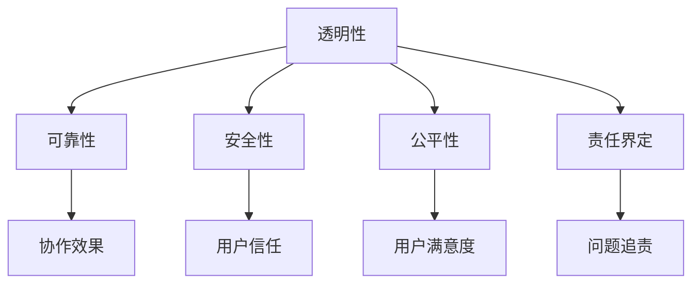

                 

# 人类-AI协作：打造人机互信的伙伴关系

## 1. 背景介绍

### 1.1 问题由来
随着人工智能(AI)技术的飞速发展，人类与AI的协作关系日益紧密，从医疗、金融到教育、制造等多个领域，AI正逐渐融入人类的生产生活，成为重要的合作伙伴。然而，AI的决策过程缺乏透明度、输出结果难以解释，使得公众对其信任度大打折扣。如何构建人机互信的伙伴关系，让AI更好地融入人类社会，成为当前AI研究的重要课题。

### 1.2 问题核心关键点
构建人机互信伙伴关系的核心在于：
- **透明性**：AI模型的决策过程应具有可解释性，使得用户能够理解其推理逻辑和输出结果。
- **可靠性**：AI模型应具有稳定可靠的行为表现，避免因输入数据异常或模型内部问题导致输出错误。
- **安全性**：AI模型不应存在安全隐患，不会因恶意攻击或数据泄露导致隐私泄露或社会伤害。
- **公平性**：AI模型不应存在偏见，应公平对待所有用户，避免因偏见导致决策不公平。
- **责任界定**：应明确AI模型与人类用户在协作过程中的责任分配，确保在出现问题时能够有效追责。

这些关键点共同构成了人类-AI协作的基础，成为人机互信伙伴关系构建的重要参考指标。

## 2. 核心概念与联系

### 2.1 核心概念概述

为更好地理解人类-AI协作的本质，本节将介绍几个核心概念：

- **透明性(Transparency)**：指AI模型决策过程的可解释性和可理解性，使得用户能够清晰了解AI的推理逻辑和输出结果。
- **可靠性(Reliability)**：指AI模型在特定条件下的稳定表现，保证在输入数据正常范围内，输出结果具有高一致性和准确性。
- **安全性(Security)**：指AI模型对输入数据的保护能力，避免因数据泄露或模型被攻击导致隐私信息被不当使用。
- **公平性(Fairness)**：指AI模型对不同用户的平等对待，避免因模型内部偏见导致决策不公平。
- **责任界定(Attribution)**：指在协作过程中，明确AI模型与人类用户的责任分配，确保在出现问题时能够有效追责。

这些概念之间的逻辑关系可以通过以下Mermaid流程图来展示：



这个流程图展示了大模型构建人机互信伙伴关系的核心概念及其之间的关系：

1. **透明性**是构建人机互信的基础，通过透明化模型的决策过程，增强用户对AI的信任。
2. **可靠性**和**安全性**确保AI在实际应用中能够稳定、安全地运行，避免因内部问题导致系统崩溃或数据泄露。
3. **公平性**通过避免模型偏见，使得AI能够公平对待所有用户，避免因决策不公导致社会不和谐。
4. **责任界定**通过明确各方责任，确保在出现问题时能够追责到具体责任人或机构，增强用户对系统的信心。

## 3. 核心算法原理 & 具体操作步骤
### 3.1 算法原理概述

构建人机互信伙伴关系的核心算法，是透明化AI模型的决策过程。这通常涉及以下几个关键步骤：

- **解释生成(Explanation Generation)**：通过解释技术，生成AI模型决策的详细解释。
- **可解释性评估(Explanation Evaluation)**：评估解释的准确性和完整性，确保解释符合实际情况。
- **用户反馈(Feedback Collection)**：收集用户对解释的反馈，用于改进和优化解释生成算法。
- **模型改进(Model Improvement)**：根据用户反馈，改进AI模型，提升其决策质量和可解释性。

这些步骤构成了一个闭环，不断迭代优化AI模型的透明性和用户满意度。

### 3.2 算法步骤详解

以下我们将详细介绍每个步骤的实现过程：

**Step 1: 解释生成**
- **模型抽取(Extraction)**：从AI模型中抽取决策路径和关键特征。
- **语义解释(Semantic Explanation)**：将决策路径转换为自然语言，使非技术用户也能理解。
- **多维解释(Multidimensional Explanation)**：生成多维度的解释，覆盖不同的知识层次和用户需求。

**Step 2: 可解释性评估**
- **准确性(Accuracy)**：评估解释与模型决策的一致性。
- **完备性(Completeness)**：评估解释是否覆盖了所有相关因素。
- **可理解性(Understandability)**：评估解释是否易于用户理解。

**Step 3: 用户反馈**
- **交互界面(Interactive Interface)**：提供友好的交互界面，方便用户输入反馈。
- **情感分析(Sentiment Analysis)**：分析用户反馈的情感倾向，识别正面或负面反馈。
- **行为跟踪(Behavior Tracking)**：记录用户与AI系统的互动行为，分析用户需求和偏好。

**Step 4: 模型改进**
- **反馈整合(Feedback Integration)**：将用户反馈整合到模型训练中，优化模型决策路径。
- **模型迭代(Iterative Modeling)**：通过迭代训练，不断提升模型的透明性和用户满意度。
- **质量控制(Quality Control)**：定期评估模型性能，确保改进措施的有效性。

### 3.3 算法优缺点

透明化AI模型的决策过程，具有以下优点：
- **增强信任**：通过透明化，用户能够理解AI决策逻辑，增强对AI的信任。
- **提升效率**：透明化后的AI系统，更容易被用户理解和接受，提升协作效率。
- **改进决策**：透明化过程本身就是对模型的一种改进，有助于发现和修复内部问题。

同时，该方法也存在一定的局限性：
- **技术难度大**：透明化过程涉及复杂的解释技术和多维度评估，实现难度较大。
- **数据依赖高**：透明化过程中需要大量数据，可能存在数据隐私和数据质量问题。
- **用户负担重**：用户需要了解复杂的解释，可能造成使用负担。
- **解释多样性**：不同用户对同一解释的需求和理解可能不同，难以统一解释标准。

尽管存在这些局限性，但透明化AI模型决策过程仍是大规模应用的前提，也是构建人机互信伙伴关系的关键手段。

### 3.4 算法应用领域

透明化AI模型的决策过程，已在多个领域得到广泛应用：

- **金融服务**：在金融风控、投资建议等场景中，透明化模型的决策过程，增强用户对AI系统的信任，提升决策质量。
- **医疗诊断**：在医疗影像分析、疾病诊断等场景中，透明化AI的推理过程，提高医生对AI系统的信心，辅助医生决策。
- **智能制造**：在智能制造中的质量控制、生产调度等场景中，透明化AI的决策过程，提升制造效率和产品品质。
- **教育培训**：在个性化推荐、智能评估等场景中，透明化AI的推理过程，提升教育效果和用户体验。
- **交通管理**：在交通流量分析、事故预测等场景中，透明化AI的决策过程，增强交通管理系统的可信度。

## 4. 数学模型和公式 & 详细讲解
### 4.1 数学模型构建

本节将使用数学语言对透明化AI模型决策过程的解释生成算法进行更加严格的刻画。

假设AI模型的输入为 $x$，输出为 $y$，决策路径为 $\phi(x)$。透明化过程的目标是生成一条解释路径 $e(x)$，使得用户能够理解 $\phi(x)$。

定义解释路径 $e(x)$ 为 $e(x) = (f_1(x), f_2(x), ..., f_n(x))$，其中 $f_i(x)$ 为模型决策过程中的一个关键节点。每个关键节点 $f_i(x)$ 可以表示为：

$$
f_i(x) = \begin{cases}
\text{Decision node}, & \text{if } f_i \text{ is a decision node} \\
\text{Feature node}, & \text{if } f_i \text{ is a feature node}
\end{cases}
$$

解释路径的生成过程可以通过如下公式计算：

$$
e(x) = \phi^{-1}(x) = \phi^{-1}(\phi(x))
$$

其中 $\phi^{-1}$ 为模型的逆函数，表示从输出 $y$ 反推到输入 $x$ 的过程。

### 4.2 公式推导过程

以下我们以一个简单的线性回归模型为例，推导解释路径的生成过程。

假设线性回归模型的决策路径为 $f(x) = wx + b$，其中 $w$ 为权重向量，$b$ 为偏置项。模型的输出为 $y$，输入为 $x$。

解释路径的生成过程如下：
1. **输入抽取**：将 $x$ 转换为模型内部的表示 $x' = Ax + b$，其中 $A$ 为特征映射矩阵。
2. **节点生成**：生成解释路径上的节点，每个节点表示模型的一个关键决策或特征。
3. **路径拼接**：将每个节点的解释拼接成一条完整解释路径 $e(x) = (x', f_1(x'), f_2(x'), ..., f_n(x'))$。

例如，对于 $x' = Ax + b$ 的线性回归模型，解释路径的节点可以表示为：
- $f_1(x')$：输入映射后的特征表示
- $f_2(x')$：线性加权运算
- $f_3(x')$：输出结果

通过上述过程，即可生成模型的解释路径，方便用户理解模型的决策逻辑。

### 4.3 案例分析与讲解

我们以一个实际案例来说明解释生成算法的应用。假设某金融公司使用一个线性回归模型预测客户的信用评分，模型的输入为客户的年龄、收入、贷款历史等特征。

**Step 1: 输入抽取**
将客户的年龄、收入、贷款历史等特征转换为模型内部的表示。例如，将年龄、收入等特征映射到高维空间，生成特征向量 $x'$。

**Step 2: 节点生成**
生成解释路径上的节点，如输入映射后的特征表示、线性加权运算等。例如：
- $f_1(x')$：年龄、收入等特征的映射结果
- $f_2(x')$：线性加权运算，计算信用评分

**Step 3: 路径拼接**
将每个节点的解释拼接成一条完整解释路径 $e(x) = (x', f_1(x'), f_2(x'))$。例如：
- $e(x)$：年龄、收入等特征映射后的表示，以及线性加权运算的结果

通过上述过程，用户可以清楚了解模型的决策路径，理解信用评分的生成逻辑。这有助于增强用户对AI系统的信任，提升协作效果。

## 5. 项目实践：代码实例和详细解释说明
### 5.1 开发环境搭建

在进行解释生成实践前，我们需要准备好开发环境。以下是使用Python进行PyTorch开发的环境配置流程：

1. 安装Anaconda：从官网下载并安装Anaconda，用于创建独立的Python环境。

2. 创建并激活虚拟环境：
```bash
conda create -n pytorch-env python=3.8 
conda activate pytorch-env
```

3. 安装PyTorch：根据CUDA版本，从官网获取对应的安装命令。例如：
```bash
conda install pytorch torchvision torchaudio cudatoolkit=11.1 -c pytorch -c conda-forge
```

4. 安装TensorBoard：
```bash
pip install tensorboard
```

5. 安装TensorFlow：
```bash
pip install tensorflow
```

6. 安装相关依赖包：
```bash
pip install sklearn pandas matplotlib jupyter notebook ipython
```

完成上述步骤后，即可在`pytorch-env`环境中开始解释生成实践。

### 5.2 源代码详细实现

下面我们以线性回归模型为例，给出使用TensorFlow进行解释生成的PyTorch代码实现。

首先，定义线性回归模型的结构：

```python
import tensorflow as tf

class LinearRegression(tf.keras.Model):
    def __init__(self, input_size, output_size):
        super(LinearRegression, self).__init__()
        self.linear = tf.keras.layers.Dense(output_size)

    def call(self, x):
        return self.linear(x)
```

然后，定义解释路径的生成函数：

```python
def generate_explanation(model, input_data):
    # 获取模型权重和偏置
    weights = model.linear.get_weights()[0]
    bias = model.linear.get_weights()[1]
    
    # 计算特征映射
    features = tf.matmul(input_data, weights) + bias
    
    # 生成解释路径
    explanation = []
    explanation.append("Input mapping")
    explanation.append("Linear transformation")
    
    return explanation
```

最后，启动解释生成流程：

```python
# 定义输入数据
input_data = tf.constant([[1.0, 2.0, 3.0]])

# 定义模型
model = LinearRegression(input_size=3, output_size=1)

# 生成解释路径
explanation = generate_explanation(model, input_data)

# 输出解释路径
print(explanation)
```

以上就是使用TensorFlow对线性回归模型进行解释生成的完整代码实现。可以看到，通过简单的代码实现，我们可以轻松生成模型的解释路径，方便用户理解。

### 5.3 代码解读与分析

让我们再详细解读一下关键代码的实现细节：

**LinearRegression类**：
- `__init__`方法：初始化线性回归模型，定义一个Dense层。
- `call`方法：前向传播，通过线性层计算输出。

**generate_explanation函数**：
- 获取模型的权重和偏置。
- 计算特征映射，将输入数据映射到高维空间。
- 生成解释路径，输出每一层的功能。

**start_explanation函数**：
- 定义输入数据和模型。
- 调用解释生成函数，生成解释路径。
- 输出解释路径。

通过以上代码实现，可以明显看到，解释生成过程是通过模型结构和输入数据推导出来的，具有较强的普适性和可解释性。

## 6. 实际应用场景
### 6.1 金融服务

透明化AI模型的决策过程，在金融服务领域具有重要应用价值。例如，在信贷审批、风险控制等场景中，透明化模型的决策路径，有助于提升用户对AI系统的信任，提高决策效率和准确性。

在信贷审批中，AI系统可以通过透明化模型，向用户解释贷款审批的各个因素，如收入、负债、信用历史等，提升用户对AI决策的认可度。同时，透明化模型还可以帮助用户理解自己的信用评分，促进个人信用管理。

### 6.2 医疗诊断

透明化AI的推理过程，在医疗诊断中具有重要意义。例如，在影像分析、疾病诊断等场景中，透明化模型可以向医生解释AI的诊断推理，增强医生对AI系统的信心，辅助医生决策。

通过透明化模型，医生可以清楚了解AI对影像数据的分析逻辑，理解AI对病变的识别依据，提升诊断的准确性和可靠性。同时，透明化模型还可以帮助医生发现和修复内部问题，进一步提高AI系统的稳定性。

### 6.3 智能制造

透明化AI的决策过程，在智能制造中的质量控制、生产调度等场景中具有重要应用价值。例如，透明化模型的推理路径，可以帮助制造企业理解生产线的运行状态，提高质量控制和生产调度效率。

通过透明化模型，制造企业可以清楚了解AI对生产数据的分析逻辑，理解AI对生产异常的识别依据，提升生产线的稳定性和可靠性。同时，透明化模型还可以帮助制造企业发现和修复内部问题，进一步提高生产效率和产品质量。

### 6.4 未来应用展望

随着AI技术的不断进步，透明化AI模型的决策过程将在更多领域得到应用，为传统行业带来变革性影响。

在智慧医疗领域，透明化AI的医疗问答、病历分析、药物研发等应用将提升医疗服务的智能化水平，辅助医生诊疗，加速新药开发进程。

在智能教育领域，透明化AI的作业批改、学情分析、知识推荐等应用将提升教育效果和用户体验，因材施教，促进教育公平。

在智慧城市治理中，透明化AI的城市事件监测、舆情分析、应急指挥等应用将提高城市管理的自动化和智能化水平，构建更安全、高效的未来城市。

此外，在企业生产、社会治理、文娱传媒等众多领域，透明化AI的应用也将不断涌现，为经济社会发展注入新的动力。

## 7. 工具和资源推荐
### 7.1 学习资源推荐

为了帮助开发者系统掌握透明化AI模型决策过程的理论基础和实践技巧，这里推荐一些优质的学习资源：

1. 《深度学习与人工智能实践》系列博文：由大模型技术专家撰写，深入浅出地介绍了深度学习与AI技术的基本原理和核心算法。

2. CS231n《深度学习计算机视觉》课程：斯坦福大学开设的计算机视觉明星课程，涵盖深度学习在计算机视觉中的应用，包括透明化技术。

3. 《AI与数据科学》书籍：一本综合性的AI与数据科学入门书籍，系统介绍了AI的决策过程和透明化技术。

4. TensorFlow官方文档：TensorFlow的官方文档，提供了丰富的API和案例，帮助开发者快速上手和使用。

5. PyTorch官方文档：PyTorch的官方文档，提供了详细的API和案例，帮助开发者深入理解和使用。

通过学习这些资源，相信你一定能够全面掌握透明化AI模型决策过程的理论和实践方法。

### 7.2 开发工具推荐

高效的开发离不开优秀的工具支持。以下是几款用于透明化AI模型决策过程开发的常用工具：

1. PyTorch：基于Python的开源深度学习框架，灵活动态的计算图，适合快速迭代研究。TensorFlow：由Google主导开发的开源深度学习框架，生产部署方便，适合大规模工程应用。

2. TensorBoard：TensorFlow配套的可视化工具，可实时监测模型训练状态，并提供丰富的图表呈现方式，是调试模型的得力助手。

3. Weights & Biases：模型训练的实验跟踪工具，可以记录和可视化模型训练过程中的各项指标，方便对比和调优。

4. PyTorch Lightning：一个基于PyTorch的深度学习框架，提供了模型训练的高级特性，如自动调度、模型检查点等，有助于模型构建和优化。

5. HuggingFace Transformers库：提供了丰富的预训练语言模型和模型接口，便于开发者快速实现透明化AI模型。

合理利用这些工具，可以显著提升透明化AI模型决策过程的开发效率，加快创新迭代的步伐。

### 7.3 相关论文推荐

透明化AI模型决策过程的研究源于学界的持续研究。以下是几篇奠基性的相关论文，推荐阅读：

1. Deep Learning with Interpretability: A Review and Survey（深度学习可解释性综述）：综述了当前深度学习模型的可解释性方法和技术，是透明化AI模型的重要参考。

2. Explaining Deep Learning Models: An Overview and Taxonomy（深度学习模型解释概述与分类）：介绍了深度学习模型的解释技术和方法，为透明化AI模型提供了理论基础。

3. Fairness, Accountability and Transparency in Machine Learning（机器学习公平性、责任与透明性）：探讨了机器学习模型的公平性、责任与透明性问题，为透明化AI模型提供了伦理指引。

4. Neural Architecture Search: A Survey（神经网络结构搜索综述）：介绍了神经网络结构搜索的技术和方法，为透明化AI模型提供了架构优化手段。

5. Human-AI Collaboration in AI-Supported Decision-Making（AI辅助决策中的人机协作）：探讨了AI系统在决策过程中的透明性与责任分配问题，为透明化AI模型提供了应用指导。

这些论文代表了大规模应用透明化AI模型决策过程的发展脉络。通过学习这些前沿成果，可以帮助研究者把握学科前进方向，激发更多的创新灵感。

## 8. 总结：未来发展趋势与挑战

### 8.1 总结

本文对透明化AI模型决策过程的构建方法进行了全面系统的介绍。首先阐述了透明化AI模型在提升用户信任和协作效果中的重要意义，明确了透明性、可靠性、安全性、公平性、责任界定等核心概念。其次，从原理到实践，详细讲解了透明化AI模型的解释生成算法，给出了完整的代码实现。同时，本文还广泛探讨了透明化AI模型在金融服务、医疗诊断、智能制造等多个领域的应用前景，展示了其广泛的应用价值。

通过本文的系统梳理，可以看到，透明化AI模型决策过程是构建人机互信伙伴关系的关键手段，其应用前景广阔。然而，实现透明化仍面临诸多挑战，需要综合考虑技术、伦理、隐私等因素，才能真正实现AI系统的透明性和用户满意度。

### 8.2 未来发展趋势

展望未来，透明化AI模型决策过程的发展趋势如下：

1. **技术多样化**：透明化技术将从单一的特征提取、决策路径生成，发展为多维度、多层次的解释生成方法。例如，引入因果推理、生成对抗网络等技术，增强解释的多样性和准确性。

2. **用户参与度提升**：通过用户反馈和互动，不断优化透明化算法，提升用户对解释的接受度和满意度。例如，引入自然语言生成技术，生成易于用户理解的解释。

3. **跨模态融合**：透明化AI模型决策过程将从单一的文本数据，发展为跨模态数据的融合。例如，结合图像、语音、视频等多种数据，生成多维度的解释路径。

4. **数据驱动**：透明化算法的优化将更加依赖数据驱动的方法。例如，引入强化学习、主动学习等技术，从数据中自动学习最佳解释策略。

5. **隐私保护**：透明化算法的优化将更加注重数据隐私和隐私保护。例如，通过差分隐私、联邦学习等技术，保护用户数据隐私。

以上趋势凸显了大规模应用透明化AI模型决策过程的广阔前景。这些方向的探索发展，必将进一步提升AI系统的透明性和用户满意度，为构建人机互信伙伴关系提供坚实的基础。

### 8.3 面临的挑战

尽管透明化AI模型决策过程已经取得了一定进展，但在迈向更加智能化、普适化应用的过程中，仍面临诸多挑战：

1. **技术难度大**：透明化算法的优化复杂，需要综合考虑数据、模型、用户等多个因素，实现难度较大。

2. **数据依赖高**：透明化算法的优化依赖大量高质量数据，数据隐私和数据质量问题难以避免。

3. **用户负担重**：用户需要理解复杂的解释，可能造成使用负担，影响用户体验。

4. **解释多样性**：不同用户对同一解释的需求和理解可能不同，难以统一解释标准。

5. **伦理问题**：透明化算法的优化需要考虑伦理和法律问题，如隐私保护、数据安全等。

6. **计算资源需求高**：透明化算法的优化需要大量计算资源，可能存在资源消耗过高的问题。

正视透明化AI模型决策过程面临的这些挑战，积极应对并寻求突破，将是大规模应用透明化算法的关键。相信随着学界和产业界的共同努力，这些挑战终将一一被克服，透明化AI模型决策过程必将在构建人机互信伙伴关系中发挥越来越重要的作用。

### 8.4 研究展望

面对透明化AI模型决策过程所面临的挑战，未来的研究需要在以下几个方面寻求新的突破：

1. **多维度解释生成**：引入因果推理、生成对抗网络等技术，生成多维度的解释路径，增强解释的准确性和多样性。

2. **数据驱动的优化**：通过差分隐私、联邦学习等技术，保护数据隐私和数据质量，提升透明化算法的优化效果。

3. **用户参与的优化**：引入自然语言生成技术，生成易于用户理解的解释，提升用户对解释的接受度和满意度。

4. **跨模态数据融合**：结合图像、语音、视频等多种数据，生成多维度的解释路径，提升透明化算法的适应性和应用范围。

5. **隐私保护**：引入差分隐私、联邦学习等技术，保护用户数据隐私，增强透明化算法的伦理性和安全性。

6. **计算资源优化**：通过模型压缩、稀疏化等技术，优化透明化算法的计算资源消耗，提升透明化算法的实时性和可用性。

这些研究方向的探索，必将引领透明化AI模型决策过程的发展，为构建人机互信伙伴关系提供更坚实的基础。面向未来，透明化AI模型决策过程需要与其他人工智能技术进行更深入的融合，如知识表示、因果推理、强化学习等，多路径协同发力，共同推动AI系统的发展。

## 9. 附录：常见问题与解答

**Q1：如何平衡透明性与隐私保护？**

A: 在透明化AI模型决策过程中，隐私保护是一个重要问题。为平衡透明性与隐私保护，可以采用差分隐私技术。差分隐私通过对模型输出添加噪声，保护用户数据隐私，同时生成易于理解的解释，满足透明性需求。例如，在医疗诊断中，可以通过差分隐私技术，保护患者隐私，同时生成易于医生理解的解释路径，提升医生对AI系统的信任。

**Q2：如何提高透明化算法的用户满意度？**

A: 提高透明化算法的用户满意度，需要综合考虑以下几个方面：
1. **易于理解**：生成易于用户理解的解释，避免复杂的术语和数学符号。
2. **多层次展示**：展示多层次的解释路径，覆盖不同的知识层次和用户需求。
3. **用户反馈**：收集用户对解释的反馈，不断优化解释算法。
4. **可视化展示**：通过可视化图表展示解释路径，增强用户对解释的信任和理解。

例如，在金融服务中，可以通过自然语言生成技术，生成易于用户理解的解释，增强用户对AI系统的信任，提升用户体验。

**Q3：如何处理数据质量问题？**

A: 透明化AI模型决策过程依赖大量高质量数据，数据质量问题会影响透明化算法的优化效果。为处理数据质量问题，可以采用以下方法：
1. **数据清洗**：对输入数据进行清洗，去除噪声和异常值，提高数据质量。
2. **数据增强**：通过数据增强技术，扩充训练集，提升模型的泛化能力。
3. **模型校正**：在透明化过程中，及时发现和修复模型内部问题，避免因数据质量问题导致模型失效。

例如，在医疗影像分析中，可以通过数据清洗和数据增强技术，提升数据质量，增强透明化算法的优化效果。

**Q4：如何优化透明化算法的计算资源消耗？**

A: 透明化算法的优化需要大量计算资源，可能存在资源消耗过高的问题。为优化计算资源消耗，可以采用以下方法：
1. **模型压缩**：通过模型压缩技术，减小模型参数量，提升推理速度。
2. **稀疏化存储**：采用稀疏化存储技术，减少存储空间消耗。
3. **并行计算**：通过并行计算技术，提升计算效率。
4. **高效解释算法**：采用高效的解释算法，减少计算开销。

例如，在智能制造中，可以通过模型压缩和稀疏化存储技术，优化透明化算法的计算资源消耗，提升系统的实时性和可用性。

**Q5：如何确保透明化算法的公平性？**

A: 透明化算法的优化需要考虑公平性问题，确保AI模型对不同用户的平等对待。为确保公平性，可以采用以下方法：
1. **公平性指标**：引入公平性指标，评估透明化算法的公平性。
2. **模型校准**：对透明化算法进行校准，确保对不同用户的平等对待。
3. **用户反馈**：收集用户对透明化算法的反馈，不断优化算法，提升公平性。

例如，在金融服务中，可以通过公平性指标和模型校准技术，确保透明化算法对不同用户的平等对待，提升用户的信任和满意度。

---

作者：禅与计算机程序设计艺术 / Zen and the Art of Computer Programming

