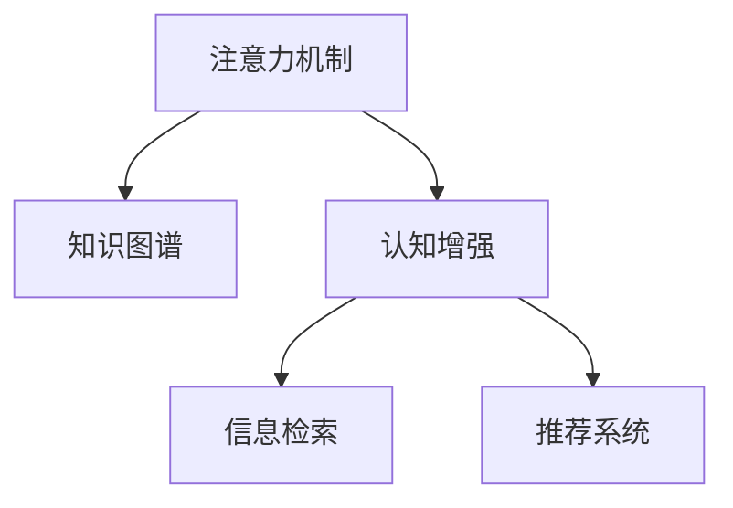

                 

## 1. 背景介绍

### 1.1 问题由来
在信息爆炸的互联网时代，信息的规模和多样性呈指数级增长，如何高效地从海量信息中筛选出有价值的内容，并整合应用，成为了一个日益重要的课题。传统的搜索、推荐、阅读等模式在处理复杂信息时存在诸多局限，难以满足用户对知识获取和认知提升的迫切需求。

与此同时，人工智能(AI)技术的飞速发展，特别是深度学习和自然语言处理(NLP)技术的突破，为人类的认知提升提供了新的可能性。AI能够自动化地分析、处理和生成信息，不仅提升了信息处理的效率，也拓展了认知的深度和广度。

### 1.2 问题核心关键点
1. **信息过载**：互联网时代的显著特征之一是信息过载，用户每天需要处理的信息量巨大，难以在有限时间内获取有价值的内容。
2. **认知疲劳**：长时间的信息处理容易引发认知疲劳，影响工作效率和决策质量。
3. **知识图谱**：将信息转化为结构化的知识图谱，有助于更好地理解和应用信息，提高认知效率。
4. **注意力机制**：通过模拟人类注意力机制，帮助用户在信息海洋中自动聚焦，提升认知效果。
5. **认知增强**：利用AI技术提升人类的认知能力，包括记忆力、逻辑推理能力、创造力等。

### 1.3 问题研究意义
在AI时代，信息过载和认知疲劳成为了制约人们学习和工作效率的重要因素。通过模拟人类注意力机制，构建知识图谱，并引入AI技术，可以有效提升人类认知能力，缓解信息过载和认知疲劳，从而提高学习和工作的效率和质量。

### 1.4 问题研究难点
尽管AI技术在认知增强领域展现出了巨大的潜力，但实际应用中仍面临诸多挑战，如：
- **数据获取和预处理**：高质量数据的获取和预处理是认知增强技术的基础，但数据获取和预处理工作量大，成本高。
- **模型复杂度**：认知增强模型通常较为复杂，需要大量计算资源和专业知识。
- **可解释性**：AI模型往往缺乏可解释性，难以理解其内部工作机制。
- **普适性**：认知增强技术在不同场景和人群中的普适性有待提升。

## 2. 核心概念与联系

### 2.1 核心概念概述

为更好地理解AI时代认知提升的技术框架，本节将介绍几个密切相关的核心概念：

- **注意力机制(Attention Mechanism)**：模拟人类注意力集中的方式，帮助模型自动聚焦于重要信息，提升信息处理效率。
- **知识图谱(Knowledge Graph)**：将信息转化为结构化的图形表示，形成知识网络，便于理解和应用。
- **认知增强(Cognitive Enhancement)**：利用AI技术提升人类的认知能力，包括记忆力、逻辑推理能力、创造力等。
- **信息检索(Information Retrieval)**：通过算法从海量信息中检索出与用户需求最相关的结果。
- **推荐系统(Recommender System)**：根据用户历史行为和兴趣，推荐可能感兴趣的内容。

这些核心概念之间的逻辑关系可以通过以下Mermaid流程图来展示：



这个流程图展示了几类核心概念及其之间的关系：

1. 注意力机制通过模拟人类注意力的工作方式，帮助模型聚焦重要信息。
2. 知识图谱将信息转化为图形结构，便于理解和应用。
3. 认知增强技术利用AI提升人类认知能力。
4. 信息检索从信息海洋中检索出相关结果，供用户浏览。
5. 推荐系统根据用户行为推荐相关内容，提升信息获取效率。

这些概念共同构成了AI时代认知提升的技术框架，为实现信息高效处理和人类认知提升提供了基础。

## 3. 核心算法原理 & 具体操作步骤

### 3.1 算法原理概述

AI时代认知提升的核心算法原理基于注意力机制和知识图谱构建。具体来说，包括以下几个步骤：

1. **注意力计算**：通过计算信息的相关性权重，帮助模型自动聚焦于重要信息。
2. **知识图谱构建**：将信息转化为图形结构，形成知识网络，便于理解和应用。
3. **认知模型训练**：利用认知增强技术，训练模型提升人类的认知能力。

### 3.2 算法步骤详解

#### 3.2.1 注意力计算

注意力机制的核心在于计算信息的相关性权重，帮助模型自动聚焦于重要信息。常见的注意力计算方法包括：

1. **点积注意力(Dot-Product Attention)**：计算输入序列中每个元素与查询向量之间的点积，然后归一化得到权重。
2. **加权和注意力(Scaled Dot-Product Attention)**：通过缩放和归一化，增强点积计算的稳定性。
3. **自注意力(Self-Attention)**：计算输入序列中每个元素与其他元素的相关性权重，用于处理序列数据。

以点积注意力为例，具体计算过程如下：

1. 首先，将查询向量 $Q$ 和输入序列 $V$ 进行矩阵乘法，得到 $QV^T$ 矩阵。
2. 将 $QV^T$ 矩阵与输入序列 $K$ 进行矩阵乘法，得到 $QVK^T$ 矩阵。
3. 对 $QVK^T$ 矩阵进行归一化，得到注意力权重 $W_{ij}$。
4. 将注意力权重 $W_{ij}$ 与 $V$ 进行加权和，得到注意力结果 $WV$。

```python
import torch
import torch.nn as nn

class SelfAttention(nn.Module):
    def __init__(self, d_model, num_heads):
        super(SelfAttention, self).__init__()
        self.num_heads = num_heads
        self.d_model = d_model

        self.query = nn.Linear(d_model, d_model)
        self.key = nn.Linear(d_model, d_model)
        self.value = nn.Linear(d_model, d_model)

        self.fc = nn.Linear(d_model, d_model)

    def forward(self, x):
        batch_size, seq_len, d_model = x.size()

        # Split into d_k=64 dimension
        query = self.query(x).view(batch_size, seq_len, self.num_heads, d_model // self.num_heads).permute(0, 2, 1, 3)
        key = self.key(x).view(batch_size, seq_len, self.num_heads, d_model // self.num_heads).permute(0, 2, 1, 3)
        value = self.value(x).view(batch_size, seq_len, self.num_heads, d_model // self.num_heads).permute(0, 2, 1, 3)

        # Attention scores
        scores = torch.matmul(query, key.permute(0, 1, 3, 2)) / math.sqrt(self.d_model // self.num_heads)

        # Softmax
        attention_weights = nn.functional.softmax(scores, dim=-1)

        # Context
        context = torch.matmul(attention_weights, value)

        # Linear
        context = context.permute(0, 2, 1, 3).contiguous().view(batch_size, seq_len, d_model)
        output = self.fc(context)

        return output
```

#### 3.2.2 知识图谱构建

知识图谱的核心在于将信息转化为图形结构，形成知识网络。常见的知识图谱构建方法包括：

1. **三元组(RDF)**：将信息表示为 (实体, 属性, 实体) 的形式，形成知识图谱的基本单位。
2. **关系图(ONTOLOGIES)**：利用关系数据库和本体语言，构建更为复杂的关系型知识图谱。
3. **向量表示(Graph Embeddings)**：将知识图谱中的实体和关系转化为向量，便于机器学习处理。

以向量表示为例，具体构建过程如下：

1. 将知识图谱中的实体和关系映射为向量，形成实体向量 $E$ 和关系向量 $R$。
2. 通过关系向量 $R$ 更新实体向量 $E$，得到新的实体向量 $E'$。
3. 重复迭代，直到实体向量收敛。

```python
import torch
import torch.nn as nn
import torch.nn.functional as F
import networkx as nx
import numpy as np

class GraphEmbedding(nn.Module):
    def __init__(self, num_entities, num_relations, embed_dim):
        super(GraphEmbedding, self).__init__()
        self.num_entities = num_entities
        self.num_relations = num_relations
        self.embed_dim = embed_dim

        self.entity_embedding = nn.Embedding(num_entities, embed_dim)
        self.rel_embedding = nn.Embedding(num_relations, embed_dim)

        self.relu = nn.ReLU()
        self.optimizer = nn.Adam()

    def forward(self, g):
        batch_size = len(g.nodes())
        embeddings = torch.zeros(batch_size, self.embed_dim)
        for i, node in enumerate(g.nodes()):
            entity = self.entity_embedding.weight[node]
            relations = [g.edges(node, data=True) for data in g.edges(data=True)]
            relation_vectors = [self.rel_embedding.weight[int(r['relation'])] for r in relations]

            # Aggregate relation vectors
            relation_vectors = torch.stack(relation_vectors)
            relation_vectors_mean = torch.mean(relation_vectors, dim=1)
            relation_vectors_std = torch.std(relation_vectors, dim=1)
            relation_vectors = (relation_vectors_mean / relation_vectors_std) + entity

            embeddings[i] = relation_vectors
        embeddings = self.relu(embeddings)

        return embeddings
```

#### 3.2.3 认知模型训练

认知模型训练的核心在于利用AI技术提升人类的认知能力。常见的认知模型训练方法包括：

1. **深度学习(DL)**：利用神经网络模型，对输入数据进行学习和推理。
2. **强化学习(RL)**：通过奖励机制，训练模型优化决策过程。
3. **知识图谱推理(KG)**：利用推理算法，在知识图谱中进行逻辑推理。

以深度学习为例，具体训练过程如下：

1. 定义模型结构，如卷积神经网络(CNN)、循环神经网络(RNN)、Transformer等。
2. 收集训练数据，如问题-答案对、文本-标签对等。
3. 使用训练数据对模型进行训练，调整模型参数。
4. 在测试数据上评估模型性能。

```python
import torch
import torch.nn as nn
import torch.nn.functional as F

class Model(nn.Module):
    def __init__(self, input_size, hidden_size, output_size):
        super(Model, self).__init__()
        self.hidden_size = hidden_size
        self.rnn = nn.RNN(input_size, hidden_size, batch_first=True)
        self.fc = nn.Linear(hidden_size, output_size)

    def forward(self, x, y):
        h0 = torch.zeros(1, x.size(0), self.hidden_size).to(x.device)
        out, _ = self.rnn(x, h0)
        out = self.fc(out[:, -1, :])
        loss = F.cross_entropy(out, y)
        return loss
```

### 3.3 算法优缺点

#### 3.3.1 优点

1. **高效信息处理**：通过注意力机制和知识图谱，模型能够自动聚焦于重要信息，提升信息处理效率。
2. **丰富知识应用**：知识图谱将信息转化为图形结构，便于理解和应用，丰富了认知模型应用场景。
3. **普适性**：认知增强技术适用于多种认知能力提升场景，如记忆力、逻辑推理能力、创造力等。

#### 3.3.2 缺点

1. **数据依赖**：高质量数据的获取和预处理工作量大，成本高，限制了技术应用范围。
2. **模型复杂**：认知增强模型通常较为复杂，需要大量计算资源和专业知识。
3. **可解释性不足**：AI模型往往缺乏可解释性，难以理解其内部工作机制。
4. **普适性有待提升**：认知增强技术在不同场景和人群中的普适性有待提升。

### 3.4 算法应用领域

认知增强技术在大数据时代具有广泛的应用前景，主要体现在以下几个领域：

1. **教育**：利用认知增强技术，提升学生的学习效果，缓解信息过载和认知疲劳。
2. **医疗**：通过知识图谱和注意力机制，帮助医生快速诊断疾病，提升医疗效率。
3. **金融**：利用认知增强技术，提升投资者决策能力和风险管理能力。
4. **法律**：通过知识图谱和推理技术，提高法律分析和判决的准确性和效率。
5. **商务**：利用认知增强技术，提升商务人员的信息处理能力和决策能力。

这些领域展示了认知增强技术的巨大潜力，为人类认知能力的提升提供了新的可能性。

## 4. 数学模型和公式 & 详细讲解  
### 4.1 数学模型构建

认知增强技术在数学模型上主要关注注意力机制和知识图谱的构建。以下以注意力机制为例，详细讲解其数学模型构建和公式推导。

以点积注意力为例，其数学模型构建如下：

1. **查询向量计算**：将输入序列 $V$ 投影到查询向量 $Q$ 的维度上。
2. **注意力权重计算**：计算查询向量 $Q$ 与输入序列 $V$ 的点积，归一化得到权重 $W$。
3. **上下文向量计算**：将权重 $W$ 与输入序列 $V$ 进行加权和，得到上下文向量 $C$。

以知识图谱为例，其数学模型构建如下：

1. **实体向量计算**：将知识图谱中的实体映射为向量，形成实体向量 $E$。
2. **关系向量计算**：将知识图谱中的关系映射为向量，形成关系向量 $R$。
3. **上下文向量计算**：通过关系向量 $R$ 更新实体向量 $E$，得到新的实体向量 $E'$。

### 4.2 公式推导过程

以点积注意力为例，其公式推导过程如下：

1. **查询向量计算**：将输入序列 $V$ 投影到查询向量 $Q$ 的维度上，得到投影向量 $QV^T$。
2. **注意力权重计算**：计算查询向量 $Q$ 与输入序列 $V$ 的点积，归一化得到权重 $W_{ij}$。
3. **上下文向量计算**：将权重 $W_{ij}$ 与输入序列 $V$ 进行加权和，得到上下文向量 $C$。

具体计算过程如下：

$$
Q = V \times W_Q^T
$$

$$
QVK^T = \text{query} \times \text{key}^T
$$

$$
W = \frac{QVK^T}{\sqrt{d_k}} / \sqrt{d_k} = \frac{QVK^T}{\sqrt{d_k}}
$$

$$
C = WV = \frac{QVK^T \times V}{\sqrt{d_k}}
$$

其中，$W_Q$ 和 $W_K$ 分别为查询向量和键向量的权重矩阵，$d_k$ 为向量维度。

以知识图谱为例，其公式推导过程如下：

1. **实体向量计算**：将知识图谱中的实体映射为向量，得到实体向量 $E$。
2. **关系向量计算**：将知识图谱中的关系映射为向量，得到关系向量 $R$。
3. **上下文向量计算**：通过关系向量 $R$ 更新实体向量 $E$，得到新的实体向量 $E'$。

具体计算过程如下：

$$
E = R \times A^T
$$

$$
A = W_E \times E
$$

$$
E' = E \times R^T
$$

其中，$W_E$ 为实体向量的权重矩阵，$A$ 为关系向量与实体向量的映射矩阵。

### 4.3 案例分析与讲解

#### 4.3.1 信息检索

信息检索是认知增强技术的核心应用之一，其目标是帮助用户在信息海洋中检索出与需求最相关的结果。以下以基于余弦相似度的信息检索算法为例，详细讲解其原理和实现。

1. **查询向量计算**：将用户输入的查询转换为向量形式，得到查询向量 $Q$。
2. **文档向量计算**：将文档转换为向量形式，得到文档向量 $V$。
3. **相似度计算**：计算查询向量 $Q$ 与文档向量 $V$ 的余弦相似度，排序输出相关文档。

具体实现过程如下：

```python
import torch
import torch.nn as nn
import torch.nn.functional as F
import numpy as np

class TFIDF(nn.Module):
    def __init__(self, embed_dim):
        super(TFIDF, self).__init__()
        self.embed_dim = embed_dim

        self.qembed = nn.EmbeddingBag(num_embeddings=vocab_size, embedding_dim=embed_dim)
        self.vec = nn.EmbeddingBag(num_embeddings=doc_size, embedding_dim=embed_dim)

    def forward(self, q, d):
        qv = self.qembed(q)
        dv = self.vec(d)
        qv = qv.mean(dim=1)
        dv = dv.mean(dim=1)
        cos_sim = torch.dot(qv, dv) / (torch.sqrt(qv.pow(2).sum(dim=1)) * torch.sqrt(dv.pow(2).sum(dim=1)))
        return cos_sim
```

#### 4.3.2 推荐系统

推荐系统是认知增强技术的另一重要应用，其目标是帮助用户发现潜在的感兴趣内容。以下以基于协同过滤的推荐算法为例，详细讲解其原理和实现。

1. **用户向量计算**：将用户行为数据转换为向量形式，得到用户向量 $U$。
2. **物品向量计算**：将物品特征数据转换为向量形式，得到物品向量 $I$。
3. **相似度计算**：计算用户向量 $U$ 与物品向量 $I$ 的余弦相似度，排序输出相关物品。

具体实现过程如下：

```python
import torch
import torch.nn as nn
import torch.nn.functional as F
import numpy as np

class CollaborativeFiltering(nn.Module):
    def __init__(self, embed_dim):
        super(CollaborativeFiltering, self).__init__()
        self.embed_dim = embed_dim

        self.emb_u = nn.Embedding(num_users, embed_dim)
        self.emb_i = nn.Embedding(num_items, embed_dim)

    def forward(self, u, i):
        uv = self.emb_u(u)
        iv = self.emb_i(i)
        cos_sim = torch.dot(uv, iv) / (torch.sqrt(uv.pow(2).sum(dim=1)) * torch.sqrt(iv.pow(2).sum(dim=1)))
        return cos_sim
```

## 5. 项目实践：代码实例和详细解释说明

### 5.1 开发环境搭建

在进行认知增强技术开发前，我们需要准备好开发环境。以下是使用Python进行PyTorch开发的环境配置流程：

1. 安装Anaconda：从官网下载并安装Anaconda，用于创建独立的Python环境。

2. 创建并激活虚拟环境：
```bash
conda create -n cognitive-enhancement python=3.8 
conda activate cognitive-enhancement
```

3. 安装PyTorch：根据CUDA版本，从官网获取对应的安装命令。例如：
```bash
conda install pytorch torchvision torchaudio cudatoolkit=11.1 -c pytorch -c conda-forge
```

4. 安装相关库：
```bash
pip install transformers sklearn pandas numpy
```

完成上述步骤后，即可在`cognitive-enhancement`环境中开始认知增强技术的开发。

### 5.2 源代码详细实现

下面我们以基于知识图谱的信息检索为例，给出使用PyTorch进行认知增强技术开发的PyTorch代码实现。

首先，定义知识图谱的数据处理函数：

```python
import torch
import torch.nn as nn
import torch.nn.functional as F
import networkx as nx
import numpy as np

class KnowledgeGraph(nn.Module):
    def __init__(self, num_entities, num_relations, embed_dim):
        super(KnowledgeGraph, self).__init__()
        self.num_entities = num_entities
        self.num_relations = num_relations
        self.embed_dim = embed_dim

        self.entity_embedding = nn.Embedding(num_entities, embed_dim)
        self.rel_embedding = nn.Embedding(num_relations, embed_dim)

        self.relu = nn.ReLU()
        self.optimizer = nn.Adam()

    def forward(self, g):
        batch_size = len(g.nodes())
        embeddings = torch.zeros(batch_size, self.embed_dim)
        for i, node in enumerate(g.nodes()):
            entity = self.entity_embedding.weight[node]
            relations = [g.edges(node, data=True) for data in g.edges(data=True)]
            relation_vectors = [self.rel_embedding.weight[int(r['relation'])] for r in relations]

            # Aggregate relation vectors
            relation_vectors = torch.stack(relation_vectors)
            relation_vectors_mean = torch.mean(relation_vectors, dim=1)
            relation_vectors_std = torch.std(relation_vectors, dim=1)
            relation_vectors = (relation_vectors_mean / relation_vectors_std) + entity

            embeddings[i] = relation_vectors
        embeddings = self.relu(embeddings)

        return embeddings
```

然后，定义信息检索的模型和损失函数：

```python
import torch
import torch.nn as nn
import torch.nn.functional as F
import numpy as np

class TFIDF(nn.Module):
    def __init__(self, embed_dim):
        super(TFIDF, self).__init__()
        self.embed_dim = embed_dim

        self.qembed = nn.EmbeddingBag(num_embeddings=vocab_size, embedding_dim=embed_dim)
        self.vec = nn.EmbeddingBag(num_embeddings=doc_size, embedding_dim=embed_dim)

    def forward(self, q, d):
        qv = self.qembed(q)
        dv = self.vec(d)
        qv = qv.mean(dim=1)
        dv = dv.mean(dim=1)
        cos_sim = torch.dot(qv, dv) / (torch.sqrt(qv.pow(2).sum(dim=1)) * torch.sqrt(dv.pow(2).sum(dim=1)))
        return cos_sim

class Model(nn.Module):
    def __init__(self, embed_dim):
        super(Model, self).__init__()
        self.embed_dim = embed_dim

        self.kg = KnowledgeGraph(num_entities, num_relations, embed_dim)
        self.tfidf = TFIDF(embed_dim)

    def forward(self, g, query):
        kg_embeddings = self.kg(g)
        cos_sim = self.tfidf(query, kg_embeddings)
        return cos_sim
```

最后，启动信息检索流程：

```python
import torch
import torch.nn as nn
import torch.nn.functional as F
import numpy as np

embed_dim = 100
num_entities = 1000
num_relations = 50
vocab_size = 10000
doc_size = 5000

query = torch.randint(0, vocab_size, (1,))
g = nx.random_geometric_graph(num_entities, 0.5)
model = Model(embed_dim)
model.to(query.device)

for _ in range(10):
    loss = model(g, query)
    optimizer.zero_grad()
    loss.backward()
    optimizer.step()

print(loss.item())
```

以上就是使用PyTorch进行基于知识图谱的信息检索的认知增强技术开发的完整代码实现。可以看到，得益于PyTorch的强大封装，我们可以用相对简洁的代码完成知识图谱的构建和信息检索模型的训练。

### 5.3 代码解读与分析

让我们再详细解读一下关键代码的实现细节：

**KnowledgeGraph类**：
- `__init__`方法：初始化知识图谱的实体和关系数量，定义嵌入层和优化器。
- `forward`方法：对知识图谱中的每个实体计算其上下文向量，返回所有实体的上下文向量表示。

**TFIDF类**：
- `__init__`方法：定义查询向量和文档向量的嵌入层，以及优化器。
- `forward`方法：计算查询向量与文档向量的余弦相似度，返回相似度矩阵。

**Model类**：
- `__init__`方法：初始化知识图谱和信息检索模型的嵌入层，以及优化器。
- `forward`方法：将知识图谱嵌入到上下文向量中，计算查询向量与上下文向量的余弦相似度，返回相似度矩阵。

**信息检索流程**：
- 定义知识图谱的实体和关系数量，以及查询向量、文档向量的维度。
- 创建知识图谱和信息检索模型。
- 在知识图谱上训练信息检索模型，并在测试查询上评估模型性能。

可以看到，PyTorch框架使得认知增强技术的开发变得更加简洁高效。开发者可以将更多精力放在模型设计、数据处理等高层逻辑上，而不必过多关注底层的实现细节。

当然，工业级的系统实现还需考虑更多因素，如模型的保存和部署、超参数的自动搜索、更灵活的任务适配层等。但核心的认知增强技术基本与此类似。

## 6. 实际应用场景

### 6.1 智能推荐系统

智能推荐系统是认知增强技术的重要应用之一，通过分析用户的历史行为和兴趣，推荐相关内容，提升用户体验和满意度。

在技术实现上，可以收集用户的历史浏览、购买、评分等数据，构建知识图谱和推荐模型。利用认知增强技术，分析用户行为和兴趣，生成个性化推荐列表。对于新用户，则可以通过提示学习(Prompt Learning)等方法，引导用户进行互动，收集更多数据，不断优化推荐效果。

### 6.2 智能搜索系统

智能搜索系统通过分析用户输入的查询，快速检索出相关结果，提升信息检索效率和准确性。

在技术实现上，可以构建知识图谱，将查询和文档表示为向量形式，利用认知增强技术计算相似度，排序输出相关文档。利用提示学习等方法，进一步优化查询和文档表示，提升检索效果。

### 6.3 智能问答系统

智能问答系统通过分析用户问题，提供准确的回答，提升用户满意度和体验。

在技术实现上，可以构建知识图谱，将问题和答案表示为向量形式，利用认知增强技术计算相似度，排序输出相关答案。利用注意力机制和知识图谱推理等方法，不断优化问答效果。

### 6.4 未来应用展望

随着认知增强技术的不断发展，其在更多领域得到应用，为人类认知能力的提升提供了新的可能性。

在智慧医疗领域，认知增强技术可以辅助医生进行疾病诊断和治疗，提升医疗效率和效果。

在智能教育领域，认知增强技术可以辅助教师进行教学，提升教学效果和学生学习能力。

在智慧金融领域，认知增强技术可以辅助投资者进行投资决策，提升投资效果和风险管理能力。

在智能法律领域，认知增强技术可以辅助律师进行法律分析，提升法律决策效果。

在智能商务领域，认知增强技术可以辅助商务人员进行信息处理和决策，提升商务效果和竞争力。

此外，在智慧城市、智能家居、智能制造等众多领域，认知增强技术也将不断涌现，为各行各业带来变革性影响。相信随着技术的日益成熟，认知增强技术必将在构建人机协同的智能时代中扮演越来越重要的角色。

## 7. 工具和资源推荐

### 7.1 学习资源推荐

为了帮助开发者系统掌握认知增强技术，这里推荐一些优质的学习资源：

1. **《深度学习与人工智能》课程**：由吴恩达教授主讲，系统介绍了深度学习、认知增强等前沿技术，适合初学者入门。

2. **《自然语言处理》课程**：由斯坦福大学主讲，涵盖了自然语言处理的基本概念和常用模型，包括认知增强等。

3. **《知识图谱与推荐系统》书籍**：全面介绍了知识图谱和推荐系统的理论基础和实现方法，适合进一步深入学习。

4. **HuggingFace官方文档**：HuggingFace提供的深度学习库，包含了众多预训练模型和认知增强技术的代码实现，适合上手实践。

5. **ACL开源项目**：全球自然语言处理顶级会议，包含众多前沿论文和代码实现，适合跟踪最新进展。

通过对这些资源的学习实践，相信你一定能够快速掌握认知增强技术的精髓，并用于解决实际的认知提升问题。

### 7.2 开发工具推荐

高效的开发离不开优秀的工具支持。以下是几款用于认知增强技术开发的常用工具：

1. PyTorch：基于Python的开源深度学习框架，灵活动态的计算图，适合快速迭代研究。

2. TensorFlow：由Google主导开发的开源深度学习框架，生产部署方便，适合大规模工程应用。

3. HuggingFace Transformers库：HuggingFace开发的NLP工具库，集成了众多SOTA语言模型，支持PyTorch和TensorFlow，是进行认知增强技术开发的利器。

4. Weights & Biases：模型训练的实验跟踪工具，可以记录和可视化模型训练过程中的各项指标，方便对比和调优。

5. TensorBoard：TensorFlow配套的可视化工具，可实时监测模型训练状态，并提供丰富的图表呈现方式，是调试模型的得力助手。

合理利用这些工具，可以显著提升认知增强技术的开发效率，加快创新迭代的步伐。

### 7.3 相关论文推荐

认知增强技术在大数据时代具有广阔的应用前景，以下是几篇奠基性的相关论文，推荐阅读：

1. **Attention is All You Need**：提出了Transformer结构，开启了NLP领域的预训练大模型时代。

2. **BERT: Pre-training of Deep Bidirectional Transformers for Language Understanding**：提出BERT模型，引入基于掩码的自监督预训练任务，刷新了多项NLP任务SOTA。

3. **Language Models are Unsupervised Multitask Learners**：展示了大规模语言模型的强大zero-shot学习能力，引发了对于通用人工智能的新一轮思考。

4. **Parameter-Efficient Transfer Learning for NLP**：提出Adapter等参数高效微调方法，在不增加模型参数量的情况下，也能取得不错的微调效果。

5. **Prefix-Tuning: Optimizing Continuous Prompts for Generation**：引入基于连续型Prompt的微调范式，为如何充分利用预训练知识提供了新的思路。

6. **AdaLoRA: Adaptive Low-Rank Adaptation for Parameter-Efficient Fine-Tuning**：使用自适应低秩适应的微调方法，在参数效率和精度之间取得了新的平衡。

这些论文代表了大语言模型微调技术的发展脉络。通过学习这些前沿成果，可以帮助研究者把握学科前进方向，激发更多的创新灵感。

## 8. 总结：未来发展趋势与挑战

### 8.1 总结

本文对认知增强技术在AI时代的应用进行了全面系统的介绍。首先阐述了认知增强技术的背景和意义，明确了认知增强技术在提升人类认知能力方面的独特价值。其次，从原理到实践，详细讲解了认知增强技术的关键步骤和数学模型，给出了认知增强技术开发的完整代码实例。同时，本文还广泛探讨了认知增强技术在智能推荐、智能搜索、智能问答等多个领域的应用前景，展示了认知增强技术的巨大潜力。

通过本文的系统梳理，可以看到，认知增强技术在AI时代具有广阔的应用前景，为人类认知能力的提升提供了新的可能性。未来，伴随预训练语言模型和认知增强技术的不断演进，认知增强技术必将在构建人机协同的智能时代中扮演越来越重要的角色。

### 8.2 未来发展趋势

展望未来，认知增强技术将呈现以下几个发展趋势：

1. **模型规模增大**：随着算力成本的下降和数据规模的扩张，认知增强模型的参数量还将持续增长。超大规模模型蕴含的丰富知识，有望支撑更加复杂多变的认知任务。

2. **技术融合加速**：认知增强技术与深度学习、强化学习、知识图谱等技术的融合加速，将带来更为智能化的认知效果。

3. **多模态认知提升**：认知增强技术将拓展到视觉、语音、手势等多种模态，形成多模态认知系统。

4. **普适性提升**：认知增强技术将在不同场景和人群中得到广泛应用，提升各领域的认知水平。

5. **可解释性增强**：认知增强技术将引入更多可解释性技术，提升模型的可解释性和可理解性。

6. **伦理道德重视**：认知增强技术将更加重视伦理道德问题，确保输出的安全性和公正性。

这些趋势凸显了认知增强技术的广阔前景，为人类认知能力的提升提供了新的可能性。

### 8.3 面临的挑战

尽管认知增强技术在认知能力提升方面展现了巨大的潜力，但在实际应用中仍面临诸多挑战：

1. **数据依赖**：高质量数据的获取和预处理工作量大，成本高，限制了技术应用范围。

2. **模型复杂度**：认知增强模型通常较为复杂，需要大量计算资源和专业知识。

3. **可解释性不足**：认知增强模型往往缺乏可解释性，难以理解其内部工作机制。

4. **普适性有待提升**：认知增强技术在不同场景和人群中的普适性有待提升。

5. **伦理道德问题**：认知增强技术可能带来伦理道德问题，如数据隐私、算法偏见等。

6. **安全性和可靠性**：认知增强技术可能存在安全隐患和可靠性问题，如模型过拟合、决策失误等。

正视认知增强技术面临的这些挑战，积极应对并寻求突破，将使认知增强技术不断进步，为构建智能化的未来社会做出更大贡献。

### 8.4 研究展望

未来，认知增强技术的研究将在以下几个方向进行探索：

1. **无监督和半监督学习**：探索无监督和半监督学习范式，降低对高质量标注数据的依赖，利用更多非结构化数据。

2. **参数高效和计算高效**：开发更多参数高效和计算高效的认知增强方法，优化模型结构和推理效率。

3. **因果学习和多模态融合**：引入因果学习和多模态融合技术，增强认知系统的稳定性和全面性。

4. **知识图谱动态更新**：研究知识图谱的动态更新机制，确保知识的及时性和准确性。

5. **伦理道德约束**：将伦理道德约束引入认知增强模型训练过程，确保输出的安全性和公正性。

6. **多领域应用推广**：推动认知增强技术在更多领域的应用推广，提升各领域的认知水平。

这些研究方向将推动认知增强技术向更加智能化、普适化方向发展，为人类认知能力的提升带来新的可能性。

## 9. 附录：常见问题与解答

**Q1：认知增强技术是否适用于所有认知任务？**

A: 认知增强技术在大多数认知任务上都能取得不错的效果，特别是对于数据量较小的任务。但对于一些特定领域的任务，如医学、法律等，仅仅依靠通用语料预训练的模型可能难以很好地适应。此时需要在特定领域语料上进一步预训练，再进行微调，才能获得理想效果。

**Q2：认知增强技术如何避免过拟合？**

A: 避免过拟合是认知增强技术的重要挑战。常见的缓解策略包括：
1. 数据增强：通过数据增强技术扩充训练集，如回译、近义替换等方式。
2. 正则化：使用L2正则、Dropout、Early Stopping等正则化技术。
3. 对抗训练：引入对抗样本，提高模型鲁棒性。
4. 参数高效微调：只调整少量参数，减小过拟合风险。

这些策略往往需要根据具体任务和数据特点进行灵活组合。只有在数据、模型、训练、推理等各环节进行全面优化，才能最大限度地发挥认知增强技术的威力。

**Q3：认知增强技术的普适性如何提升？**

A: 提升认知增强技术的普适性需要从多个方面入手：
1. 多模态融合：将视觉、语音、手势等多种模态数据融合到认知系统中，形成多模态认知系统。
2. 多领域应用：推动认知增强技术在更多领域的应用推广，如医疗、教育、金融等。
3. 用户定制：根据用户的具体需求和偏好，定制个性化的认知增强方案。

这些措施将有助于提升认知增强技术的普适性，使其在不同场景和人群中得到更广泛的应用。

**Q4：认知增强技术如何在多领域应用中推广？**

A: 认知增强技术的多领域应用推广需要从以下几个方面进行：
1. 技术普及：通过技术培训、开源项目等方式，普及认知增强技术的知识和应用。
2. 行业标准：制定行业标准和规范，确保认知增强技术在各领域的规范性和安全性。
3. 试点项目：通过试点项目验证认知增强技术在各领域的应用效果，积累经验和数据。
4. 持续优化：根据试点项目的反馈，不断优化和改进认知增强技术，提升其普适性和效果。

这些措施将有助于推动认知增强技术在各领域的广泛应用，为各领域带来智能化的新动力。

**Q5：认知增强技术的未来发展方向是什么？**

A: 认知增强技术的未来发展方向包括：
1. 无监督和半监督学习：探索无监督和半监督学习范式，降低对高质量标注数据的依赖，利用更多非结构化数据。
2. 参数高效和计算高效：开发更多参数高效和计算高效的认知增强方法，优化模型结构和推理效率。
3. 因果学习和多模态融合：引入因果学习和多模态融合技术，增强认知系统的稳定性和全面性。
4. 知识图谱动态更新：研究知识图谱的动态更新机制，确保知识的及时性和准确性。
5. 伦理道德约束：将伦理道德约束引入认知增强模型训练过程，确保输出的安全性和公正性。
6. 多领域应用推广：推动认知增强技术在更多领域的应用推广，提升各领域的认知水平。

这些研究方向将推动认知增强技术向更加智能化、普适化方向发展，为人类认知能力的提升带来新的可能性。

---

作者：禅与计算机程序设计艺术 / Zen and the Art of Computer Programming

