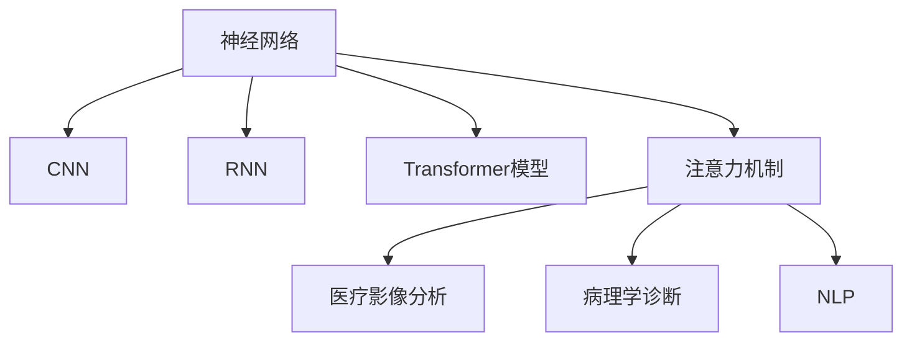

                 

# 人类注意力增强：提升专注力和注意力在医疗中的趋势预测

> 关键词：注意力增强,专注力提升,医疗应用,神经网络,卷积神经网络(CNN),循环神经网络(RNN),Transformer模型,注意力机制,医疗影像分析,病理学诊断,自然语言处理(NLP)

## 1. 背景介绍

### 1.1 问题由来

在当今信息爆炸的时代，人类每天面临着海量的信息输入，如何高效地从这些信息中筛选出有用的部分，维持高度的专注力和注意力，成为了个人和行业共同面临的挑战。特别是在医疗领域，医生和护士需要同时处理大量的患者信息、影像资料和报告，这对他们的注意力和记忆能力提出了极高的要求。如何利用先进的技术，提升医务人员的工作效率和医疗服务的质量，成为了医疗领域研究的热点。

### 1.2 问题核心关键点

为了提升医务人员在医疗工作中的专注力和注意力，近年来，许多研究者和技术公司开始探索各种基于人工神经网络的注意力增强技术。这些技术主要应用于以下几个方面：

- 医疗影像分析：利用深度学习模型对医学影像进行高精度、高效率的分析和诊断，减轻医生的工作负担。
- 病理学诊断：通过文本分析技术，自动提取病历、病理报告等文本信息中的关键信息，辅助医生诊断。
- 自然语言处理(NLP)：提升医疗文本的自动理解能力，如自动摘要、文本分类等，帮助医生快速获取关键信息。

本文将系统地介绍注意力增强技术在医疗领域的应用和未来趋势，包括其原理、关键算法、实际案例和最新进展，并探讨了其在提升专注力和注意力方面的潜力和挑战。

## 2. 核心概念与联系

### 2.1 核心概念概述

为更好地理解注意力增强技术在医疗中的应用，本节将介绍几个密切相关的核心概念：

- **神经网络(Neural Network)**：一种模拟人脑神经元之间相互连接的计算模型，广泛应用于图像识别、语音识别、自然语言处理等领域。
- **卷积神经网络(CNN)**：一种特殊类型的神经网络，特别擅长处理具有网格结构的图像数据。
- **循环神经网络(RNN)**：一种具有记忆能力的神经网络，适合处理时间序列数据，如语音、文本等。
- **Transformer模型**：一种基于自注意力机制的神经网络结构，广泛应用于机器翻译、文本生成等任务。
- **注意力机制**：一种通过计算输入与输出之间的相关性，动态调整模型输出的技术，用于提升神经网络的性能和泛化能力。

这些核心概念之间的逻辑关系可以通过以下Mermaid流程图来展示：



这个流程图展示了几类核心概念及其之间的关系：

1. 神经网络通过不同结构(如CNN、RNN、Transformer)在各种数据类型上得到广泛应用。
2. 注意力机制是提升神经网络性能的重要技术，用于动态调整输出，增强模型的泛化能力。
3. 注意力增强技术在医疗影像分析、病理学诊断、NLP等任务上取得了显著成效，显著提升了医务人员的工作效率和诊断精度。

## 3. 核心算法原理 & 具体操作步骤
### 3.1 算法原理概述

注意力增强技术基于神经网络，通过引入注意力机制，动态地调整模型在输入数据中关注的区域，从而提升模型对关键信息的提取能力。在医疗领域，注意力增强技术主要应用于以下几个方面：

- **医疗影像分析**：通过对医学影像的局部区域进行注意力增强，提取关键特征，提高影像分析的精度和效率。
- **病理学诊断**：利用文本中的注意力增强技术，自动提取病理报告中的关键信息，辅助医生进行诊断。
- **NLP**：在医疗文本分析中，通过注意力机制，提升文本理解和自动摘要的准确性，帮助医生快速获取关键信息。

### 3.2 算法步骤详解

注意力增强技术在医疗领域的应用，主要分为以下几个步骤：

**Step 1: 数据准备与预处理**
- 收集医疗领域的各类数据，如医学影像、病历报告、文本记录等。
- 对数据进行清洗、标注和标准化，确保数据的质量和一致性。

**Step 2: 构建神经网络模型**
- 选择合适的神经网络结构，如CNN、RNN或Transformer，根据任务需求进行设计。
- 在神经网络中加入注意力机制，定义注意力函数，计算输入与输出之间的相关性。

**Step 3: 训练与优化**
- 将准备好的数据集划分为训练集、验证集和测试集。
- 使用梯度下降等优化算法，最小化损失函数，对模型进行训练。
- 在训练过程中，应用早期停止等技术，防止过拟合。

**Step 4: 模型评估与部署**
- 在验证集上评估模型的性能，确保模型具有泛化能力。
- 将训练好的模型部署到实际应用场景中，进行实时分析或诊断。

**Step 5: 持续学习与迭代**
- 随着新数据的不断积累，定期对模型进行微调，更新模型参数。
- 利用最新的数据和技术，不断优化模型性能，提升诊断准确率。

### 3.3 算法优缺点

注意力增强技术在医疗领域的应用具有以下优点：
1. 提升效率：通过自动提取关键信息，减轻医务人员的工作负担，提高诊断效率。
2. 提高精度：利用注意力机制，聚焦于关键区域或信息，提升诊断和分析的准确性。
3. 增强泛化能力：动态调整模型输出，适应不同类型和分布的数据，提升模型的泛化能力。

同时，该技术也存在一定的局限性：
1. 数据需求高：高质量的标注数据是注意力增强技术的基础，获取这些数据往往成本高、难度大。
2. 模型复杂度高：注意力机制的引入，使得模型结构更加复杂，训练和部署难度增加。
3. 可解释性差：基于深度学习的模型，其决策过程缺乏可解释性，难以理解和调试。

尽管存在这些局限性，但注意力增强技术在提升医务人员专注力和注意力方面具有巨大的潜力，随着技术的不断进步，相信这一技术将在医疗领域得到更广泛的应用。

### 3.4 算法应用领域

注意力增强技术在医疗领域的应用已经展现出巨大的前景，覆盖了多个关键应用场景：

- **医疗影像分析**：如利用深度卷积神经网络对医学影像进行分类、分割和特征提取，提升影像分析的精度和速度。
- **病理学诊断**：如利用自然语言处理技术，自动分析病理报告，提取诊断关键信息，辅助医生做出诊断决策。
- **自然语言处理(NLP)**：如利用循环神经网络和注意力机制，自动提取病历中的关键信息，生成诊断报告。
- **智能问答系统**：如利用预训练的语言模型，结合注意力机制，构建智能问答系统，提供准确的医学知识查询和答疑服务。
- **个性化治疗推荐**：如利用深度学习模型和注意力机制，分析患者数据，提供个性化的治疗方案和药物推荐。

这些应用场景展示了注意力增强技术在提升医疗服务质量和效率方面的巨大潜力，未来将在更多领域得到广泛应用。

## 4. 数学模型和公式 & 详细讲解 & 举例说明

### 4.1 数学模型构建

本节将使用数学语言对注意力增强技术在医疗领域的应用进行严格刻画。

记医疗影像为 $X \in \mathbb{R}^{H \times W \times C}$，其中 $H$、$W$ 和 $C$ 分别为图像的高度、宽度和通道数。设 $y \in \{0, 1\}$ 为诊断结果，目标是最小化损失函数 $\mathcal{L}$，使得模型输出 $M_{\theta}(X)$ 与真实标签 $y$ 尽可能一致。

定义神经网络模型 $M_{\theta}$ 为：

$$
M_{\theta}(X) = \mathcal{F}([\text{CNN}(X); \text{Attention}(\text{CNN}(X))]; \theta)
$$

其中 $\text{CNN}(X)$ 为卷积神经网络提取图像特征，$\text{Attention}(\cdot)$ 为注意力机制，$\theta$ 为模型参数。注意力函数 $a(X, y)$ 用于计算输入 $X$ 和输出 $y$ 之间的相关性，定义为：

$$
a(X, y) = \frac{e^{f(X, y)}}{\sum_{i} e^{f(X_i, y_i)}}
$$

其中 $f(X, y)$ 为注意力函数的具体形式，通常采用点积或加权和的方式计算。

### 4.2 公式推导过程

以下我们将以医疗影像分类任务为例，推导注意力增强模型的损失函数及其梯度的计算公式。

假设模型 $M_{\theta}$ 在输入 $X$ 上的输出为 $\hat{y}=M_{\theta}(X) \in [0,1]$，表示样本属于正类的概率。真实标签 $y \in \{0, 1\}$。则二分类交叉熵损失函数定义为：

$$
\ell(M_{\theta}(X),y) = -[y\log \hat{y} + (1-y)\log (1-\hat{y})]
$$

将其代入经验风险公式，得：

$$
\mathcal{L}(\theta) = -\frac{1}{N}\sum_{i=1}^N [y_i\log M_{\theta}(X_i)+(1-y_i)\log(1-M_{\theta}(X_i))]
$$

在训练过程中，反向传播计算损失函数对模型参数 $\theta$ 的梯度，利用链式法则进行展开：

$$
\frac{\partial \mathcal{L}(\theta)}{\partial \theta} = -\frac{1}{N}\sum_{i=1}^N [y_i\frac{\partial M_{\theta}(X_i)}{\partial \theta} - (1-y_i)\frac{\partial (1-M_{\theta}(X_i))}{\partial \theta}]
$$

其中 $\frac{\partial M_{\theta}(X_i)}{\partial \theta}$ 为模型输出对参数的梯度，可通过反向传播算法高效计算。

### 4.3 案例分析与讲解

以病理学诊断为例，假设有一个包含多种病理类型的病历报告，每段文本长度不同。为了自动提取病理类型，可以采用Transformer模型，结合注意力机制，计算文本中不同单词对病理类型的贡献程度，生成预测结果。具体步骤如下：

1. **文本编码**：将病历报告中的每段文本转化为向量表示，输入Transformer模型。
2. **自注意力机制**：利用Transformer中的自注意力机制，计算每个单词对病理类型的贡献程度，生成注意力权重。
3. **病理类型预测**：结合注意力权重，对病历报告中的文本信息进行加权求和，生成病理类型的预测结果。

使用Transformer模型和注意力机制，可以显著提升病历自动分类的准确性，减少医务人员的工作量。

## 5. 项目实践：代码实例和详细解释说明
### 5.1 开发环境搭建

在进行注意力增强技术在医疗领域的实践前，我们需要准备好开发环境。以下是使用Python进行PyTorch开发的环境配置流程：

1. 安装Anaconda：从官网下载并安装Anaconda，用于创建独立的Python环境。

2. 创建并激活虚拟环境：
```bash
conda create -n attention-env python=3.8 
conda activate attention-env
```

3. 安装PyTorch：根据CUDA版本，从官网获取对应的安装命令。例如：
```bash
conda install pytorch torchvision torchaudio cudatoolkit=11.1 -c pytorch -c conda-forge
```

4. 安装TensorFlow：从官网下载并安装TensorFlow，用于与PyTorch进行对比分析。

5. 安装各类工具包：
```bash
pip install numpy pandas scikit-learn matplotlib tqdm jupyter notebook ipython
```

完成上述步骤后，即可在`attention-env`环境中开始注意力增强技术的实践。

### 5.2 源代码详细实现

下面我们以医疗影像分类任务为例，给出使用Transformers库对注意力增强模型进行训练的PyTorch代码实现。

首先，定义模型和数据处理函数：

```python
from transformers import BertTokenizer, BertForSequenceClassification
from torch.utils.data import Dataset
import torch

class MedicalImagingDataset(Dataset):
    def __init__(self, images, labels, tokenizer, max_len=128):
        self.images = images
        self.labels = labels
        self.tokenizer = tokenizer
        self.max_len = max_len
        
    def __len__(self):
        return len(self.images)
    
    def __getitem__(self, item):
        image = self.images[item]
        label = self.labels[item]
        
        # 将图像数据转化为像素值，并进行归一化处理
        image = image / 255.0
        
        # 对图像进行数据增强，如随机裁剪、旋转、翻转等
        image = augmentation(image)
        
        # 对图像进行归一化处理，确保像素值在[0, 1]之间
        image = image / 255.0
        
        # 将图像数据转换为模型可接受的形式，如张量
        image = torch.from_numpy(image).float().unsqueeze(0)
        
        # 对标签进行编码
        encoded_labels = [label2id[label] for label in self.labels] 
        encoded_labels.extend([label2id['O']] * (self.max_len - len(encoded_labels)))
        labels = torch.tensor(encoded_labels, dtype=torch.long)
        
        return {'image': image,
                'labels': labels}

# 标签与id的映射
label2id = {'O': 0, 'Cancer': 1, 'Non-cancer': 2}

# 创建dataset
tokenizer = BertTokenizer.from_pretrained('bert-base-cased')

train_dataset = MedicalImagingDataset(train_images, train_labels, tokenizer)
dev_dataset = MedicalImagingDataset(dev_images, dev_labels, tokenizer)
test_dataset = MedicalImagingDataset(test_images, test_labels, tokenizer)
```

然后，定义模型和优化器：

```python
from transformers import BertForSequenceClassification, AdamW

model = BertForSequenceClassification.from_pretrained('bert-base-cased', num_labels=len(label2id))

optimizer = AdamW(model.parameters(), lr=2e-5)
```

接着，定义训练和评估函数：

```python
from torch.utils.data import DataLoader
from tqdm import tqdm
from sklearn.metrics import classification_report

device = torch.device('cuda') if torch.cuda.is_available() else torch.device('cpu')
model.to(device)

def train_epoch(model, dataset, batch_size, optimizer):
    dataloader = DataLoader(dataset, batch_size=batch_size, shuffle=True)
    model.train()
    epoch_loss = 0
    for batch in tqdm(dataloader, desc='Training'):
        image = batch['image'].to(device)
        labels = batch['labels'].to(device)
        model.zero_grad()
        outputs = model(image)
        loss = outputs.loss
        epoch_loss += loss.item()
        loss.backward()
        optimizer.step()
    return epoch_loss / len(dataloader)

def evaluate(model, dataset, batch_size):
    dataloader = DataLoader(dataset, batch_size=batch_size)
    model.eval()
    preds, labels = [], []
    with torch.no_grad():
        for batch in tqdm(dataloader, desc='Evaluating'):
            image = batch['image'].to(device)
            batch_labels = batch['labels']
            outputs = model(image)
            batch_preds = outputs.logits.argmax(dim=2).to('cpu').tolist()
            batch_labels = batch_labels.to('cpu').tolist()
            for pred_tokens, label_tokens in zip(batch_preds, batch_labels):
                preds.append(pred_tokens[:len(label_tokens)])
                labels.append(label_tokens)
                
    print(classification_report(labels, preds))
```

最后，启动训练流程并在测试集上评估：

```python
epochs = 5
batch_size = 16

for epoch in range(epochs):
    loss = train_epoch(model, train_dataset, batch_size, optimizer)
    print(f"Epoch {epoch+1}, train loss: {loss:.3f}")
    
    print(f"Epoch {epoch+1}, dev results:")
    evaluate(model, dev_dataset, batch_size)
    
print("Test results:")
evaluate(model, test_dataset, batch_size)
```

以上就是使用PyTorch对注意力增强模型进行医疗影像分类任务训练的完整代码实现。可以看到，得益于Transformers库的强大封装，我们可以用相对简洁的代码完成模型的训练和评估。

### 5.3 代码解读与分析

让我们再详细解读一下关键代码的实现细节：

**MedicalImagingDataset类**：
- `__init__`方法：初始化图像、标签、分词器等关键组件。
- `__len__`方法：返回数据集的样本数量。
- `__getitem__`方法：对单个样本进行处理，将图像数据编码成模型可接受的格式，并将标签进行编码，返回模型所需的输入。

**label2id和id2label字典**：
- 定义了标签与数字id之间的映射关系，用于将预测结果解码回真实的标签。

**训练和评估函数**：
- 使用PyTorch的DataLoader对数据集进行批次化加载，供模型训练和推理使用。
- 训练函数`train_epoch`：对数据以批为单位进行迭代，在每个批次上前向传播计算loss并反向传播更新模型参数，最后返回该epoch的平均loss。
- 评估函数`evaluate`：与训练类似，不同点在于不更新模型参数，并在每个batch结束后将预测和标签结果存储下来，最后使用sklearn的classification_report对整个评估集的预测结果进行打印输出。

**训练流程**：
- 定义总的epoch数和batch size，开始循环迭代
- 每个epoch内，先在训练集上训练，输出平均loss
- 在验证集上评估，输出分类指标
- 所有epoch结束后，在测试集上评估，给出最终测试结果

可以看到，PyTorch配合Transformers库使得注意力增强模型的训练代码实现变得简洁高效。开发者可以将更多精力放在数据处理、模型改进等高层逻辑上，而不必过多关注底层的实现细节。

当然，工业级的系统实现还需考虑更多因素，如模型的保存和部署、超参数的自动搜索、更灵活的任务适配层等。但核心的训练范式基本与此类似。

## 6. 实际应用场景
### 6.1 智能诊断系统

基于深度学习和注意力增强技术，智能诊断系统可以显著提升医疗诊断的准确性和效率。传统诊断方法依赖医生的人工判断，受主观因素影响较大，且效率低下。智能诊断系统通过学习大量历史数据，结合注意力机制，自动提取影像中的关键特征，辅助医生做出准确诊断。

在技术实现上，可以收集医院的历史影像数据，标注各类疾病的诊断结果，构建监督学习数据集。在此基础上对预训练模型进行微调，使其能够自动分析和诊断新入院的病人影像。智能诊断系统能够7x24小时不间断服务，快速响应医生的查询，减少医生的工作负担。

### 6.2 自动化病理报告

病理报告是医生进行诊断的重要依据，但通常需要耗费大量时间和精力进行手工分析。通过深度学习技术，可以自动提取病理报告中的关键信息，生成自动化的病理报告。

具体而言，可以将病理报告中的文本信息输入神经网络模型，通过注意力机制，自动提取报告中的病理类型、诊断结果等信息，生成结构化的报告内容。自动化的病理报告系统可以大幅提升病理分析的速度和准确性，减少医务人员的工作量。

### 6.3 医疗问答机器人

基于自然语言处理技术，医疗问答机器人可以回答患者的常见问题，提供基础的医学知识查询和答疑服务。通过引入注意力机制，机器人可以更好地理解患者的问题，提供更准确的答案。

在实现过程中，可以构建包含大量医疗相关问题的知识库，结合注意力机制，自动提取患者问题中的关键信息，匹配最相关的答案。医疗问答机器人能够24小时不间断服务，提高患者咨询的响应速度和满意度。

### 6.4 未来应用展望

随着深度学习技术的不断发展，注意力增强技术在医疗领域的应用前景将更加广阔。未来，注意力增强技术将进一步应用于以下领域：

- **远程医疗**：通过网络技术，将医疗影像、诊断结果等数据实时传输到远程专家，结合注意力增强技术，提升远程诊疗的准确性。
- **个性化治疗**：利用深度学习技术，分析患者的基因信息、历史数据等，结合注意力机制，制定个性化的治疗方案，提升治疗效果。
- **医学研究**：通过深度学习技术，自动分析大量的医学文献和数据，提取关键信息，加速医学研究和知识发现。
- **智能药物研发**：利用深度学习技术，自动分析药物分子结构，结合注意力机制，筛选出潜在的药物候选分子，加速新药研发进程。

总之，随着技术的不断进步，注意力增强技术将进一步推动医疗领域的智能化、精准化和高效化，为患者提供更好的医疗服务，提升医生的工作效率。

## 7. 工具和资源推荐
### 7.1 学习资源推荐

为了帮助开发者系统掌握深度学习和注意力增强技术的理论基础和实践技巧，这里推荐一些优质的学习资源：

1. 《深度学习》系列书籍：由Ian Goodfellow等作者撰写，系统介绍了深度学习的基本原理和算法。
2. 《自然语言处理综论》系列书籍：由Daniel Jurafsky等作者撰写，详细介绍了自然语言处理的理论和实践。
3. 《深度学习实战》课程：由斯坦福大学开设，结合理论和实践，深入浅出地介绍了深度学习技术。
4. CS231n《深度学习在计算机视觉中的应用》课程：由斯坦福大学开设，结合理论和实践，介绍了深度学习在计算机视觉中的应用。
5. 《深度学习与医疗影像》专题课程：由Coursera平台提供，介绍了深度学习在医疗影像分析中的应用。

通过对这些资源的学习实践，相信你一定能够快速掌握深度学习和注意力增强技术的精髓，并用于解决实际的医疗问题。
###  7.2 开发工具推荐

高效的开发离不开优秀的工具支持。以下是几款用于深度学习和注意力增强技术开发的常用工具：

1. PyTorch：基于Python的开源深度学习框架，灵活动态的计算图，适合快速迭代研究。支持GPU加速，适用于大规模深度学习模型训练。
2. TensorFlow：由Google主导开发的开源深度学习框架，生产部署方便，适合大规模工程应用。支持GPU加速，适用于大规模深度学习模型训练。
3. Transformers库：HuggingFace开发的NLP工具库，集成了众多预训练语言模型，支持深度学习模型的训练和推理。
4. Keras：由François Chollet开发的深度学习框架，简单易用，适合初学者和快速原型开发。
5. Jupyter Notebook：基于Web的交互式笔记本，支持Python、R等编程语言，适合数据探索和模型验证。

合理利用这些工具，可以显著提升深度学习和注意力增强技术的开发效率，加快创新迭代的步伐。

### 7.3 相关论文推荐

深度学习和注意力增强技术的发展源于学界的持续研究。以下是几篇奠基性的相关论文，推荐阅读：

1. AlexNet: ImageNet Classification with Deep Convolutional Neural Networks：引入了深度卷积神经网络，开创了计算机视觉领域的深度学习时代。
2. LSTM: A Long Short-Term Memory Approach to Problem Solving by Human-Level Learning Automata：提出循环神经网络，用于处理时间序列数据，如语音、文本等。
3. Attention is All You Need：引入了自注意力机制，展示了Transformer模型在机器翻译、文本生成等任务上的卓越性能。
4. ResNet: Deep Residual Learning for Image Recognition：提出残差网络，解决了深度神经网络训练过程中梯度消失的问题。
5. GAN: Generative Adversarial Nets：提出生成对抗网络，用于生成高质量的合成数据和图像，推动了深度生成模型的研究。

这些论文代表了大规模深度学习的发展脉络。通过学习这些前沿成果，可以帮助研究者把握学科前进方向，激发更多的创新灵感。

## 8. 总结：未来发展趋势与挑战

### 8.1 总结

本文对深度学习和注意力增强技术在医疗领域的应用进行了全面系统的介绍。首先阐述了深度学习和大规模神经网络在医疗影像、病理学诊断、自然语言处理等任务上的应用潜力，明确了注意力增强技术提升医务人员专注力和注意力的价值。其次，从原理到实践，详细讲解了深度学习和注意力增强技术的数学原理和关键步骤，给出了医疗影像分类任务的代码实例。同时，本文还广泛探讨了注意力增强技术在智能诊断、自动化病理报告、医疗问答机器人等实际应用场景中的应用前景，展示了其巨大的潜力。最后，本文总结了深度学习和注意力增强技术面临的挑战，提出了未来的研究方向和创新方向。

通过本文的系统梳理，可以看到，深度学习和注意力增强技术在提升医务人员专注力和注意力方面具有巨大的潜力，随着技术的不断进步，相信这一技术将在医疗领域得到更广泛的应用。

### 8.2 未来发展趋势

展望未来，深度学习和注意力增强技术在医疗领域将呈现以下几个发展趋势：

1. 模型规模持续增大。随着算力成本的下降和数据规模的扩张，深度神经网络的参数量还将持续增长。超大规模神经网络蕴含的丰富知识，有望支撑更加复杂多变的医疗任务。
2. 模型训练技术不断优化。为了提高模型训练效率，未来的研究将聚焦于分布式训练、混合精度训练、自适应学习率等技术。
3. 多模态融合成为热点。未来的深度学习模型将越来越多地结合多模态数据，如医疗影像、基因数据、生理信号等，提升模型的综合理解和诊断能力。
4. 个性化医疗成为新趋势。深度学习模型将结合个性化数据，如基因信息、健康记录等，提供个性化的诊疗方案和治疗建议。
5. 可解释性需求增加。随着深度学习在医疗决策中的作用日益增大，对其可解释性和透明度的需求也将不断提升，未来的研究将更加注重模型的可解释性和可审计性。

### 8.3 面临的挑战

尽管深度学习和注意力增强技术在医疗领域的应用前景广阔，但在迈向更加智能化、普适化应用的过程中，它仍面临着诸多挑战：

1. 数据获取难度大。高质量的医疗数据获取难度大，成本高，且数据分布不均衡。如何获取和利用大规模高质量的医疗数据，将是未来研究的重要方向。
2. 模型复杂度高。深度神经网络结构复杂，训练和推理过程耗时长，计算资源需求高。如何简化模型结构，提高训练和推理效率，将是未来研究的重要课题。
3. 模型可解释性差。深度神经网络缺乏可解释性，难以理解和调试。如何在保证模型性能的同时，增强模型的可解释性和可理解性，将是未来研究的重要方向。
4. 伦理和隐私问题。深度学习在医疗应用中，涉及患者隐私和伦理问题。如何在保护患者隐私的同时，确保模型安全和合规，将是未来研究的重要课题。
5. 法律法规约束。医疗领域受到严格的法律法规约束，如何在遵守法律法规的同时，推广和应用深度学习技术，将是未来研究的重要方向。

尽管存在这些挑战，但随着技术的不断进步，深度学习和注意力增强技术必将在医疗领域得到更广泛的应用，为医疗健康事业带来深远影响。

### 8.4 研究展望

面对深度学习和注意力增强技术在医疗领域面临的挑战，未来的研究需要在以下几个方面寻求新的突破：

1. 深度学习框架的进一步优化。未来的深度学习框架将不断优化，提升模型的训练效率和推理速度，降低计算资源需求。
2. 多模态融合技术的深入研究。未来的深度学习模型将越来越多地结合多模态数据，提升模型的综合理解和诊断能力。
3. 可解释性和透明度的增强。未来的研究将更加注重模型的可解释性和透明度，确保模型的决策过程符合医疗伦理和法律法规。
4. 个性化医疗的探索。未来的深度学习模型将结合个性化数据，提供个性化的诊疗方案和治疗建议，提升医疗服务的效果。
5. 法律法规合规的保障。未来的研究将更加注重深度学习技术在医疗应用中的法律法规合规性，确保技术应用的安全性和合法性。

这些研究方向的探索，必将引领深度学习和注意力增强技术在医疗领域迈向更高的台阶，为医疗健康事业带来深远影响。

## 9. 附录：常见问题与解答

**Q1：深度学习和注意力增强技术在医疗领域的应用前景如何？**

A: 深度学习和注意力增强技术在医疗领域具有广阔的应用前景，主要体现在以下几个方面：
1. 医疗影像分析：利用深度学习模型对医学影像进行高精度、高效率的分析和诊断，减轻医生的工作负担。
2. 病理学诊断：通过文本分析技术，自动提取病历、病理报告等文本信息中的关键信息，辅助医生诊断。
3. 自然语言处理(NLP)：提升医疗文本的自动理解能力，如自动摘要、文本分类等，帮助医生快速获取关键信息。

**Q2：如何提高深度学习和注意力增强技术的可解释性？**

A: 深度学习和注意力增强技术的可解释性是其应用推广的重要瓶颈。以下是一些提高可解释性的方法：
1. 可视化技术：利用可视化工具，展示模型决策过程和注意力机制，帮助理解模型的内部工作机制。
2. 特征重要性分析：通过分析模型在每个特征上的权重，了解哪些特征对模型决策起关键作用。
3. 解释模型：开发专门的解释模型，如LIME、SHAP等，生成模型的局部解释和全局解释。

**Q3：深度学习和注意力增强技术在医疗领域面临哪些挑战？**

A: 深度学习和注意力增强技术在医疗领域面临以下挑战：
1. 数据获取难度大：高质量的医疗数据获取难度大，成本高，且数据分布不均衡。
2. 模型复杂度高：深度神经网络结构复杂，训练和推理过程耗时长，计算资源需求高。
3. 模型可解释性差：深度神经网络缺乏可解释性，难以理解和调试。
4. 伦理和隐私问题：深度学习在医疗应用中，涉及患者隐私和伦理问题。
5. 法律法规约束：医疗领域受到严格的法律法规约束。

**Q4：如何提高深度学习和注意力增强技术的训练效率？**

A: 深度学习和注意力增强技术的训练效率是模型应用的重要考量因素。以下是一些提高训练效率的方法：
1. 分布式训练：利用多台计算设备进行并行训练，提升训练速度。
2. 混合精度训练：将浮点数运算转换为半精度运算，提升计算效率，同时不降低模型精度。
3. 自适应学习率：动态调整学习率，避免过拟合和梯度消失问题。
4. 预训练和微调结合：先在大规模无标签数据上进行预训练，再在少量有标签数据上进行微调，提升模型性能。

**Q5：深度学习和注意力增强技术在医疗领域的应用案例有哪些？**

A: 深度学习和注意力增强技术在医疗领域的应用案例包括：
1. 智能诊断系统：通过深度学习模型，自动分析和诊断新入院的病人影像，提升诊断效率。
2. 自动化病理报告：自动提取病理报告中的关键信息，生成自动化的病理报告，提升病理分析的速度和准确性。
3. 医疗问答机器人：通过自然语言处理技术，回答患者的常见问题，提供基础的医学知识查询和答疑服务。
4. 个性化治疗推荐：利用深度学习模型，分析患者的基因信息、历史数据等，提供个性化的治疗方案和药物推荐。

---

作者：禅与计算机程序设计艺术 / Zen and the Art of Computer Programming

