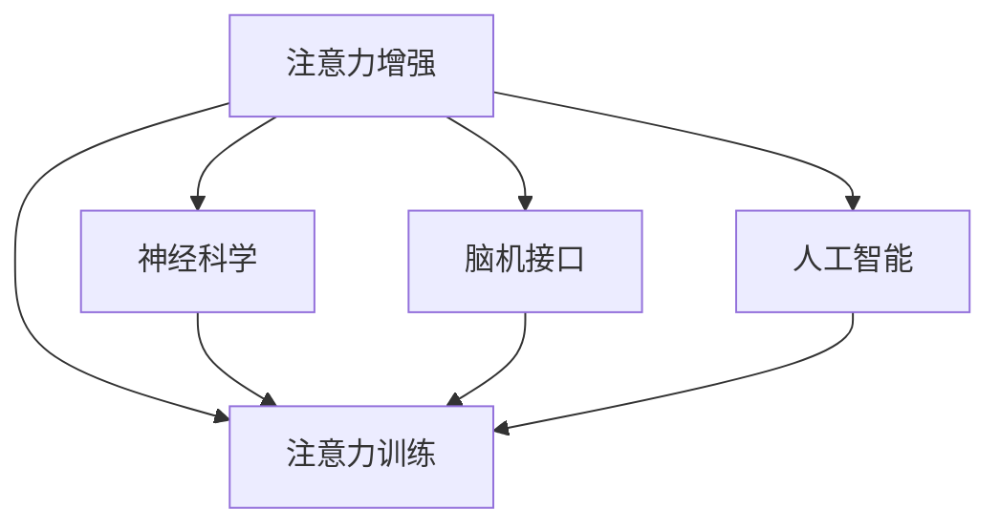
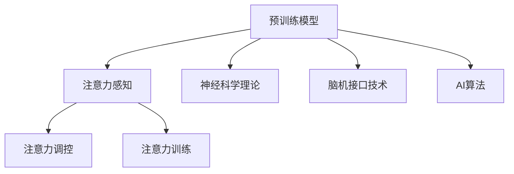

                 

# 人类注意力增强：提升专注力和注意力在商业中的未来发展机遇分析预测

> 关键词：注意力增强, 人类专注力, 注意力训练, 商业应用, 效率提升, 神经科学, 脑机接口, 人工智能

## 1. 背景介绍

### 1.1 问题由来

在现代社会中，人们的注意力分散问题日益严重。手机、社交媒体、信息过载等因素使得人们在完成工作和学习任务时难以保持高度的专注力。这一问题不仅影响个体的生产效率，也对企业和社会的整体生产力产生了负面影响。为了应对这一挑战，研究者们不断探索提升人类专注力和注意力的新方法，包括训练法、神经科学、脑机接口以及人工智能技术等。

### 1.2 问题核心关键点

提升专注力和注意力已经成为商业和社会发展的关键议题。解决这一问题的核心在于找到新的技术手段，结合人类神经科学的研究成果，通过训练和刺激提高个体的专注力。以下是提升专注力和注意力的主要关键点：

- **神经科学研究**：了解人类注意力的生物学机制，发现提升专注力的神经调节途径。
- **脑机接口技术**：利用脑电信号、fMRI等手段监测和刺激大脑，增强注意力功能。
- **人工智能和数据驱动方法**：通过数据分析和机器学习模型，对个体的注意力水平进行量化，从而进行针对性的训练。
- **注意力训练工具**：开发可操作性强、效果显著的注意力提升工具和应用，如手机应用、智能穿戴设备等。

## 2. 核心概念与联系

### 2.1 核心概念概述

为更好地理解注意力增强的技术，本节将介绍几个关键概念：

- **注意力增强(Attention Enhancement)**：通过神经科学和脑机接口技术，提升个体的专注力和注意力水平。
- **注意力训练(Attention Training)**：利用特定算法和训练方法，有针对性地提高个体的注意力集中度。
- **神经科学(Neuroscience)**：研究人类大脑结构和功能，揭示注意力提升的生物机制。
- **脑机接口(Brain-Computer Interface, BCI)**：通过脑电信号等技术，直接与大脑互动，实现注意力调控。
- **人工智能(Artificial Intelligence, AI)**：利用数据驱动和机器学习模型，量化和优化注意力训练效果。

这些概念之间的关系可以通过以下Mermaid流程图来展示：



这个流程图展示出注意力增强的主要技术和支撑领域：

1. 注意力增强方法包括注意力训练、神经科学、脑机接口和人工智能。
2. 神经科学为注意力训练提供理论基础，脑机接口提供技术手段，人工智能提供数据分析和优化工具。

### 2.2 核心概念原理和架构的 Mermaid 流程图



这个流程图简要说明了注意力增强的原理和架构：

1. 预训练模型提供初始的注意力感知能力。
2. 通过注意力训练，调整注意力感知和调控策略，提高个体注意力集中度。
3. 神经科学理论提供对注意力机制的理解，指导注意力训练和调控。
4. 脑机接口技术实现对大脑的直接操控，增强注意力功能。
5. AI算法用于数据分析和模型优化，辅助注意力训练。

## 3. 核心算法原理 & 具体操作步骤

### 3.1 算法原理概述

基于神经科学和人工智能的注意力增强方法，主要是通过训练模型来模拟和强化大脑的注意力机制。这一过程可以分为三个主要步骤：

1. **数据收集与预处理**：收集个体在完成任务时的注意力数据，如眼动轨迹、脑电信号等。
2. **注意力感知与训练**：利用预训练模型和AI算法，分析注意力数据，提取关键特征，进行注意力感知训练。
3. **注意力调控与增强**：结合神经科学理论，开发脑机接口技术，实现对大脑的直接刺激，增强注意力功能。

### 3.2 算法步骤详解

#### 3.2.1 数据收集与预处理

注意力数据可以来自多种设备，如智能眼镜、手机应用、脑电采集头等。数据预处理包括数据清洗、标准化、降维等步骤。

#### 3.2.2 注意力感知与训练

注意力感知训练使用深度学习模型，如卷积神经网络、长短期记忆网络等，对注意力数据进行分析。通过监督学习或无监督学习，提取注意力特征。

#### 3.2.3 注意力调控与增强

注意力调控使用脑机接口技术，如电刺激、磁刺激、光刺激等，对大脑进行直接调控。结合神经科学理论，设计合理的调控策略，提高注意力集中度。

### 3.3 算法优缺点

注意力增强方法的主要优点包括：

- **科学依据**：结合神经科学理论和实践，有坚实的科学基础。
- **效果显著**：通过神经调控和注意力训练，可以显著提升个体的专注力和注意力水平。
- **广泛应用**：可应用于教育、医疗、生产等多个领域，提升整体生产力。

其缺点在于：

- **高成本**：脑机接口设备和技术需要较高成本，推广应用存在门槛。
- **技术复杂**：需要专业知识和技能进行设计和实施，对用户和技术要求较高。
- **个体差异**：不同个体的注意力机制不同，对同一方法的效果存在差异。

### 3.4 算法应用领域

注意力增强技术已经在多个领域得到应用，具体如下：

- **教育领域**：通过脑机接口和注意力训练，提高学生的注意力和学习效率。
- **医疗领域**：帮助ADHD患者和老年痴呆症患者提升专注力，改善认知功能。
- **生产领域**：提升工人注意力，减少操作失误，提高生产效率。
- **娱乐领域**：提高游戏和电影体验，通过智能设备控制观众注意力，增加互动性。
- **军事领域**：通过脑机接口和注意力调控，提升士兵的反应速度和任务执行能力。

## 4. 数学模型和公式 & 详细讲解 & 举例说明

### 4.1 数学模型构建

基于深度学习的注意力感知模型主要分为输入层、隐藏层和输出层。其核心数学模型如下：

$$
\text{Attention Score} = \text{softmax}(\text{Score}(X, \Theta) + \text{Score}(Y, \Phi))
$$

其中，$X$ 和 $Y$ 分别为输入和输出的注意力数据，$\Theta$ 和 $\Phi$ 为模型参数。注意力得分通过 Softmax 函数归一化，得到加权和。

### 4.2 公式推导过程

以简单的注意力感知模型为例，推导注意力得分的计算公式：

1. 输入层：
   $$
   X = [x_1, x_2, \ldots, x_n]
   $$

2. 隐藏层：
   $$
   \text{Score}(X, \Theta) = \Theta^T \sigma(\Theta X)
   $$

3. 输出层：
   $$
   \text{Attention Score} = \text{softmax}(\text{Score}(X, \Theta) + \text{Score}(Y, \Phi))
   $$

通过上述公式，可以计算出注意力得分，进一步提取注意力特征，用于注意力感知训练。

### 4.3 案例分析与讲解

以一个简单的注意力训练示例为例，演示注意力感知模型的应用：

1. 数据准备：收集若干个学生的注意力数据。
2. 预处理：对数据进行标准化、降维等预处理操作。
3. 模型训练：使用注意力感知模型，对注意力数据进行分析，提取关键特征。
4. 结果分析：分析模型的注意力得分，找出影响注意力的关键因素。

## 5. 项目实践：代码实例和详细解释说明

### 5.1 开发环境搭建

注意力增强的开发环境搭建主要包括以下几个步骤：

1. 安装Python环境：使用Anaconda创建虚拟环境。
2. 安装必要的库：如TensorFlow、PyTorch、NumPy等深度学习库。
3. 安装神经科学和脑机接口相关的库：如NeuroPy、BCI2000等。
4. 安装智能设备接口：如OpenBCI、BCI2000等。

### 5.2 源代码详细实现

以一个简单的注意力感知模型为例，演示其代码实现过程：

```python
import tensorflow as tf
import numpy as np

class AttentionModel(tf.keras.Model):
    def __init__(self, input_dim, hidden_dim):
        super(AttentionModel, self).__init__()
        self.input_dim = input_dim
        self.hidden_dim = hidden_dim
        self.W = tf.keras.layers.Dense(hidden_dim)
        self.V = tf.keras.layers.Dense(1)
        
    def call(self, inputs):
        hidden = self.W(inputs)
        scores = self.V(hidden)
        attention = tf.nn.softmax(scores, axis=1)
        return attention

# 训练模型
model = AttentionModel(input_dim=10, hidden_dim=5)
model.compile(optimizer=tf.keras.optimizers.Adam(), loss='mse')
model.fit(X_train, y_train, epochs=10, batch_size=32)
```

### 5.3 代码解读与分析

上述代码实现了简单的注意力感知模型，包含输入层、隐藏层和输出层。模型使用TensorFlow进行定义和训练。

输入层使用Dense层，隐藏层使用Dense层和激活函数，输出层使用Softmax函数计算注意力得分。通过交叉熵损失函数和Adam优化器进行模型训练。

## 6. 实际应用场景

### 6.1 智能教室系统

智能教室系统可以结合注意力增强技术，实时监测和调控学生的注意力水平。系统可以通过摄像头捕捉学生的眼球轨迹和面部表情，使用注意力感知模型进行分析。根据注意力得分，智能教室可以自动调节灯光、投影等环境参数，提高学生的专注度。

### 6.2 智能医疗应用

在智能医疗应用中，注意力增强技术可以帮助ADHD患者和老年痴呆症患者提升专注力。通过脑机接口设备，系统可以实时监测患者的脑电信号，使用注意力调控模型进行干预，提升认知功能。

### 6.3 游戏娱乐应用

游戏娱乐应用可以通过智能设备控制玩家的注意力，提升游戏体验。系统可以使用注意力感知模型分析玩家的游戏行为，使用注意力调控模型进行交互，增加游戏的互动性和趣味性。

### 6.4 未来应用展望

未来，随着脑机接口技术和神经科学研究的进步，注意力增强技术将更加成熟和普及。以下是未来应用展望：

1. **家庭智能设备**：智能音箱、智能家电等设备可以结合注意力增强技术，根据用户注意力状态自动调整功能，提升用户体验。
2. **个性化学习**：基于个体的注意力特征，智能学习系统可以提供个性化的学习路径和内容，提高学习效率。
3. **虚拟现实(VR)应用**：VR设备结合注意力增强技术，可以提供更加沉浸式的体验，提高用户的专注度和参与感。
4. **心理健康应用**：通过监测和调控注意力，系统可以早期发现和干预心理健康问题，提供辅助治疗方案。

## 7. 工具和资源推荐

### 7.1 学习资源推荐

以下是几本关于注意力增强和脑机接口技术的经典书籍，推荐阅读：

1. **《The Brain That Changes Itself》**：作者Norman Doidge，介绍了大脑的可塑性和自我修复能力。
2. **《Neuroscience》**：作者Eric R. Kandel，全面介绍了神经科学的基本原理和应用。
3. **《Spiking Neural Networks》**：作者Dayan和Abbott，介绍了神经元级建模和脑机接口技术。
4. **《Brain-Computer Interface》**：作者Vikash Kumar，详细介绍了BCI技术的原理和应用。
5. **《Artificial Neural Networks》**：作者Christopher M. Bishop，介绍了神经网络的基本概念和应用。

### 7.2 开发工具推荐

以下是一些常用的注意力增强和脑机接口开发工具：

1. **TensorFlow**：用于深度学习和模型训练的强大工具。
2. **PyTorch**：灵活高效的深度学习框架。
3. **BCI2000**：开源的脑机接口数据采集和分析工具。
4. **OpenBCI**：轻量级的脑电信号采集设备。
5. **NeuroPy**：基于Python的神经科学模拟和分析工具。

### 7.3 相关论文推荐

以下是几篇关于注意力增强和脑机接口技术的经典论文，推荐阅读：

1. **"Attention Is All You Need"**：Transformer论文，提出了注意力机制在深度学习中的重要性。
2. **"Deep Brain Stimulation for Cognition Enhancement"**：介绍了深度脑刺激在认知增强中的应用。
3. **"Brain-Computer Interfaces: A Review"**：全面回顾了BCI技术的发展和应用。
4. **"Neural Correlates of Attention"**：介绍了注意力在神经科学中的基本原理和研究进展。
5. **"Attention Is All You Need: Multitask Learning for Knowledge Base Completion"**：应用注意力机制在知识图谱完成中的应用。

## 8. 总结：未来发展趋势与挑战

### 8.1 研究成果总结

注意力增强技术在多个领域展现出巨大的潜力，成为提升个体专注力和注意力的重要手段。神经科学、脑机接口、人工智能和数据驱动方法的结合，使得注意力增强方法具备坚实的科学基础和广泛的应用前景。

### 8.2 未来发展趋势

未来，注意力增强技术将呈现以下几个发展趋势：

1. **技术普及化**：随着脑机接口设备和技术的成熟，注意力增强方法将逐渐普及到家庭和个人生活中。
2. **个性化定制**：基于个体的注意力特征，注意力增强技术将提供更加个性化的解决方案。
3. **跨学科融合**：注意力增强技术将与其他技术，如VR、AI等，进行更深层次的融合，拓展应用场景。
4. **人机协作**：注意力增强技术将与人机交互技术结合，提高系统的智能化水平和用户体验。
5. **伦理与法律**：随着注意力增强技术的普及，将涌现出新的伦理和法律问题，需要相关研究和规范。

### 8.3 面临的挑战

尽管注意力增强技术具有广阔的应用前景，但也面临一些挑战：

1. **成本高昂**：脑机接口设备和技术的成本较高，普及应用存在门槛。
2. **技术复杂**：神经科学和脑机接口技术的专业性较强，需要专业知识和技能进行设计和实施。
3. **个体差异**：不同个体的注意力机制不同，对同一方法的效果存在差异。
4. **数据隐私**：脑电信号等数据涉及个人隐私，数据安全和隐私保护问题亟待解决。
5. **伦理风险**：注意力增强技术可能带来新的伦理风险，如过度控制、隐私侵犯等。

### 8.4 研究展望

未来的研究需要在以下几个方面进行突破：

1. **降低成本**：开发低成本、易操作的脑机接口设备和工具，普及应用。
2. **提升可操作性**：简化注意力增强技术的实施流程，降低专业技能门槛。
3. **个性化优化**：开发更加个性化、适配性的注意力增强方法，提高效果。
4. **数据安全**：建立严格的数据安全和隐私保护机制，保障用户隐私。
5. **伦理规范**：制定伦理规范和法律法规，引导注意力增强技术的健康发展。

总之，人类注意力增强技术正处于快速发展阶段，面临广阔的应用前景和挑战。通过不断探索和优化，未来有望实现更加高效、个性化、普及化的注意力增强解决方案，为社会和个体带来深远的影响。

## 9. 附录：常见问题与解答

**Q1：注意力增强方法是否适用于所有人群？**

A: 注意力增强方法主要适用于注意力集中度较低的人群，如ADHD患者、老年人等。对于普通人群，仍需通过训练和使用注意力调控设备来提高注意力水平。

**Q2：注意力增强方法的成本如何？**

A: 注意力增强方法主要涉及脑机接口设备和技术的成本，如脑电采集头、智能眼镜等。随着技术的进步和普及，未来成本有望逐渐降低。

**Q3：注意力增强方法是否会带来伦理问题？**

A: 注意力增强方法可能带来新的伦理问题，如过度控制、隐私侵犯等。需要制定相关规范和法律法规，保障用户权益。

**Q4：注意力增强技术如何实现个性化定制？**

A: 通过大数据和机器学习算法，分析个体的注意力特征，开发定制化的注意力训练和调控方案，提高效果。

**Q5：注意力增强技术是否对所有人都有效？**

A: 注意力增强技术对不同个体的效果存在差异，需要根据个体特征进行优化和调整。对于一些注意力机制特殊的人群，可能需要其他干预方法。

---

作者：禅与计算机程序设计艺术 / Zen and the Art of Computer Programming

