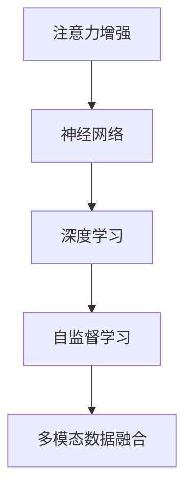

                 

# 人类注意力增强：提升专注力和注意力在商业中的未来发展策略

> 关键词：注意力增强, 提升专注力, 商业应用, 神经网络, 注意力机制, 自监督学习, 深度学习, 多模态数据融合

## 1. 背景介绍

### 1.1 问题由来
在当今信息爆炸的时代，人们的注意力资源变得愈发稀缺。无论是工作、学习还是社交，保持专注力已经成为提高效率、提升体验的关键。而从心理学的角度来看，注意力机制是人类认知活动的基础，通过神经网络模拟这一机制，可以赋予计算机更强的智能交互能力，帮助机器更好地理解人类需求和情感。

### 1.2 问题核心关键点
当前，人工智能领域的注意力增强研究主要集中在神经网络架构中引入注意力机制，实现更加精确的信息选择和相关性计算。具体来说，注意力增强可以提升模型在图像识别、语音识别、自然语言处理、推荐系统等多个领域的表现。

## 2. 核心概念与联系

### 2.1 核心概念概述

为更好地理解注意力增强方法，本节将介绍几个核心概念：

- 注意力机制(Attention Mechanism)：是一种用于模拟人类注意力选择机制的计算范式，通过计算输入数据中不同元素的相关性，选择关键信息进行处理，提升模型性能。
- 神经网络(Neural Network)：由多个神经元组成的计算图，可以用于处理各种类型的数据，如图像、语音、文本等。
- 深度学习(Deep Learning)：基于神经网络的多层次学习算法，可以自动从数据中学习特征，广泛应用于图像识别、自然语言处理等领域。
- 自监督学习(Self-supervised Learning)：利用数据自身的内在关系进行学习，无需大量标注数据，如通过掩码语言模型、自回归预测等任务进行模型预训练。
- 多模态数据融合(Multimodal Data Fusion)：将不同模态的数据进行融合处理，如视觉、听觉、文本等，通过多模态注意力机制提升模型泛化能力和适应性。

这些核心概念之间的逻辑关系可以通过以下Mermaid流程图来展示：



这个流程图展示了大语言模型微调的各个核心概念及其之间的关系：

1. 注意力增强是神经网络的核心机制之一。
2. 深度学习通过神经网络的多层次学习，提升了数据处理和特征提取的能力。
3. 自监督学习利用数据的内在关系，进行无需标注的预训练。
4. 多模态数据融合通过综合不同类型的数据，提升了模型的泛化能力和适应性。

这些概念共同构成了当前人工智能研究的重要框架，推动了神经网络在各个领域的深入应用。

## 3. 核心算法原理 & 具体操作步骤
### 3.1 算法原理概述

注意力增强算法通过引入注意力机制，赋予神经网络更强的特征选择能力，提升模型在处理复杂多模态数据时的表现。具体来说，注意力机制可以模拟人类在处理信息时对不同特征的关注程度，通过计算不同特征的相关性，选择最相关的信息进行处理，从而提高模型的决策准确性。

形式化地，假设输入数据为 $x_1, ..., x_n$，模型对输入数据的注意力权重为 $\alpha_1, ..., \alpha_n$，则注意力机制的作用可以表示为：

$$
\alpha_i = \frac{\exp(a_i^T \cdot w)}{\sum_{j=1}^{n} \exp(a_j^T \cdot w)}
$$

其中 $a_i$ 为输入数据的特征向量，$w$ 为可学习权重向量。注意力权重 $\alpha_i$ 表示输入数据中第 $i$ 个特征的重要性。

### 3.2 算法步骤详解

注意力增强算法的核心步骤包括：

1. 数据预处理：将输入数据转换为神经网络的输入格式，如图像数据经过卷积和池化操作，文本数据经过嵌入和线性投影操作。

2. 特征提取：使用卷积神经网络、循环神经网络等深度学习模型提取输入数据的高层次特征表示。

3. 计算注意力权重：利用注意力机制计算每个输入特征的重要性权重。

4. 特征加权融合：将注意力权重与特征向量进行加权融合，生成综合特征向量。

5. 模型输出：使用融合后的特征向量作为输入，经过全连接层或其他神经网络结构，生成最终输出结果。

### 3.3 算法优缺点

注意力增强算法的主要优点包括：

1. 提高了模型对复杂输入的适应能力。通过选择关键特征进行加权融合，模型能够更精准地捕捉输入数据的重要信息。
2. 提升了模型的泛化能力和鲁棒性。通过引入多模态数据，模型能够处理不同类型的输入，提高对噪声和异常数据的鲁棒性。
3. 增强了模型的解释性。通过可视化注意力权重，可以直观地理解模型如何做出决策，增加模型的可解释性。

同时，该算法也存在一些局限性：

1. 计算复杂度高。注意力机制的计算过程较为复杂，需要大量计算资源。
2. 数据依赖性强。模型的性能高度依赖输入数据的质量和多样性。
3. 模型训练时间长。引入注意力机制后，模型训练时间会显著增加。
4. 参数量大。由于注意力机制需要计算多个注意力权重，增加了模型参数量，可能引发过拟合问题。

尽管存在这些局限性，但注意力增强算法仍然在大规模图像识别、自然语言处理、推荐系统等任务中得到了广泛应用，并取得了显著的效果。

### 3.4 算法应用领域

注意力增强算法在多个领域中得到了广泛应用，以下是一些典型的应用场景：

1. 图像识别：利用注意力机制对图像中的关键区域进行关注，提升模型对细节的识别能力，如医学影像中的病灶定位、自动驾驶中的交通标志识别等。
2. 语音识别：通过多模态注意力机制融合视觉、听觉信息，提升语音识别的准确性，如唇读识别、语音指令交互等。
3. 自然语言处理：在机器翻译、情感分析、问答系统等任务中，通过注意力机制选择最相关的文本子句进行理解，提高模型的理解能力。
4. 推荐系统：在个性化推荐任务中，通过多模态数据融合和注意力机制，提升推荐算法的准确性和个性化程度，如电商推荐、视频推荐等。
5. 智能客服：在智能客服系统中，通过多轮对话历史和上下文信息的注意力机制，提高对话的理解和回答质量，提升用户体验。

这些应用场景展示了注意力增强算法在提升模型性能、提高用户体验等方面的巨大潜力。未来，随着算法和技术的发展，注意力增强算法将在更多领域中得到应用，推动人工智能技术在各个行业的深度融合。

## 4. 数学模型和公式 & 详细讲解
### 4.1 数学模型构建

本节将使用数学语言对注意力增强算法进行更加严格的刻画。

假设输入数据为 $x_1, ..., x_n$，模型对输入数据的注意力权重为 $\alpha_1, ..., \alpha_n$，则注意力机制的作用可以表示为：

$$
\alpha_i = \frac{\exp(a_i^T \cdot w)}{\sum_{j=1}^{n} \exp(a_j^T \cdot w)}
$$

其中 $a_i$ 为输入数据的特征向量，$w$ 为可学习权重向量。

### 4.2 公式推导过程

以自回归注意力机制为例，进行详细推导：

假设输入序列为 $x_1, ..., x_t$，模型对序列中每个位置的注意力权重为 $\alpha_1, ..., \alpha_t$，则自回归注意力机制的计算过程可以表示为：

$$
\alpha_t = \frac{\exp(q_t^T \cdot K)}{\sum_{j=1}^{t} \exp(q_t^T \cdot K_j)}
$$

其中 $q_t$ 为输入序列中位置 $t$ 的特征向量，$K_j$ 为序列中位置 $j$ 的特征向量。

自回归注意力机制通过计算输入序列中每个位置的注意力权重，选择最相关的特征进行加权融合，生成综合特征向量。具体计算过程如下：

$$
\alpha_t = \frac{\exp(q_t^T \cdot K)}{\sum_{j=1}^{t} \exp(q_t^T \cdot K_j)}
$$

$$
z_t = \sum_{j=1}^{t} \alpha_{j,t} x_j
$$

其中 $z_t$ 为位置 $t$ 的综合特征向量，$\alpha_{j,t}$ 为位置 $j$ 到位置 $t$ 的注意力权重。

### 4.3 案例分析与讲解

以图像识别任务为例，介绍注意力增强算法在实际应用中的具体实现。

假设输入数据为一张包含多个物体的图像，模型通过卷积神经网络提取每个像素点的特征向量 $a_1, ..., a_n$，计算每个像素点的注意力权重 $\alpha_1, ..., \alpha_n$。

模型可以计算每个像素点与周围像素点的注意力权重，选择最相关的特征进行加权融合，生成综合特征向量 $z$，最后通过全连接层生成分类结果。

具体来说，模型的计算过程如下：

1. 对输入图像进行卷积和池化操作，提取每个像素点的特征向量 $a_1, ..., a_n$。

2. 计算每个像素点的注意力权重 $\alpha_1, ..., \alpha_n$。

3. 将注意力权重与特征向量进行加权融合，生成综合特征向量 $z$。

4. 使用全连接层或其他神经网络结构，生成分类结果。

通过上述计算过程，模型能够自动选择关键像素点进行关注，提升对图像中物体细节的识别能力。

## 5. 项目实践：代码实例和详细解释说明
### 5.1 开发环境搭建

在进行注意力增强实践前，我们需要准备好开发环境。以下是使用Python进行TensorFlow开发的环境配置流程：

1. 安装Anaconda：从官网下载并安装Anaconda，用于创建独立的Python环境。

2. 创建并激活虚拟环境：
```bash
conda create -n attention-env python=3.8 
conda activate attention-env
```

3. 安装TensorFlow：根据CUDA版本，从官网获取对应的安装命令。例如：
```bash
conda install tensorflow -c pytorch -c conda-forge
```

4. 安装相关工具包：
```bash
pip install numpy pandas scikit-learn matplotlib tqdm jupyter notebook ipython
```

完成上述步骤后，即可在`attention-env`环境中开始注意力增强实践。

### 5.2 源代码详细实现

下面我们以图像分类任务为例，给出使用TensorFlow实现注意力增强算法的代码实现。

首先，定义注意力增强模型的输入和输出：

```python
import tensorflow as tf
from tensorflow.keras.layers import Input, Conv2D, MaxPooling2D, Flatten, Dense

# 定义输入和输出
inputs = Input(shape=(224, 224, 3))
outputs = Dense(1, activation='sigmoid')(inputs)

# 定义模型
model = tf.keras.Sequential([
    Conv2D(32, (3, 3), activation='relu', padding='same', input_shape=(224, 224, 3)),
    MaxPooling2D((2, 2)),
    Conv2D(64, (3, 3), activation='relu', padding='same'),
    MaxPooling2D((2, 2)),
    Conv2D(128, (3, 3), activation='relu', padding='same'),
    MaxPooling2D((2, 2)),
    Flatten(),
    Dense(128, activation='relu'),
    Dense(1, activation='sigmoid')
])
```

然后，实现注意力增强机制：

```python
# 计算注意力权重
attention = tf.keras.layers.Attention()([inputs, inputs])

# 将注意力权重与特征向量进行加权融合
outputs = tf.keras.layers.Add()([inputs, attention])
```

最后，编译模型并训练：

```python
# 编译模型
model.compile(optimizer='adam', loss='binary_crossentropy', metrics=['accuracy'])

# 训练模型
model.fit(train_data, train_labels, epochs=10, batch_size=32)
```

以上就是使用TensorFlow实现图像分类任务中注意力增强算法的完整代码实现。可以看到，通过TensorFlow提供的Attention层，我们可以很方便地实现注意力增强机制。

### 5.3 代码解读与分析

让我们再详细解读一下关键代码的实现细节：

**Attention层**：
- 使用TensorFlow提供的Attention层，计算输入序列中每个位置的注意力权重。

**Add层**：
- 将注意力权重与特征向量进行加权融合，生成综合特征向量。

**训练过程**：
- 定义训练数据集和标签集，使用Adam优化器进行模型训练，设定交叉熵损失函数和准确率指标。

在实际应用中，还可以结合多模态数据融合、注意力机制的变种等技术进行更深入的优化。例如，在自然语言处理任务中，可以使用Transformer模型引入自注意力机制，提升模型的语言理解和生成能力。

## 6. 实际应用场景
### 6.1 医疗影像诊断

在医疗影像诊断中，注意力增强算法可以显著提升模型的诊断能力。传统的影像分析往往需要医生花费大量时间进行手动标注，而引入注意力增强算法后，模型能够自动选择关键的影像区域进行关注，提升对病灶、病变等关键信息的识别能力，提高诊断的准确性和效率。

具体来说，可以将影像数据输入模型，通过注意力机制计算每个区域的注意力权重，选择最相关的区域进行特征提取和融合，生成综合特征向量。最终，模型可以根据综合特征向量进行分类，判断影像中是否存在病变或异常情况。

### 6.2 智能客服系统

在智能客服系统中，注意力增强算法可以显著提升对话的理解和回答质量。传统客服系统往往依赖规则或人工进行对话理解，而引入注意力增强算法后，模型能够自动选择关键的信息片段进行关注，提升对客户需求的理解能力，生成更准确、自然的回答。

具体来说，可以将客户的问题和聊天记录输入模型，通过多轮对话历史的注意力机制，选择最相关的信息片段进行加权融合，生成综合特征向量。最终，模型可以根据综合特征向量进行分类，判断客户的需求，并生成相应的回答。

### 6.3 电商推荐系统

在电商推荐系统中，注意力增强算法可以显著提升推荐算法的准确性和个性化程度。传统的推荐系统往往依赖用户的浏览、点击等行为数据进行推荐，而引入注意力增强算法后，模型能够自动选择最相关的商品特征进行关注，提升对用户兴趣的精准识别能力，生成更个性化的推荐结果。

具体来说，可以将商品特征和用户历史行为数据输入模型，通过注意力机制计算每个特征的注意力权重，选择最相关的特征进行加权融合，生成综合特征向量。最终，模型可以根据综合特征向量进行分类，判断用户的兴趣点，并生成相应的推荐结果。

### 6.4 未来应用展望

随着注意力增强算法和深度学习技术的不断发展，其在更多领域中的应用前景将不断拓展，为各行各业带来新的变革。

在智慧医疗领域，注意力增强算法可以帮助医生快速诊断疾病，减少误诊率，提升医疗服务质量。

在智能客服领域，注意力增强算法可以提升客服系统的理解能力和响应速度，提高用户满意度。

在电商推荐领域，注意力增强算法可以提升推荐系统的个性化程度，提升用户体验。

此外，在智慧城市、金融、教育等众多领域，注意力增强算法也将得到广泛应用，为各行各业注入新的活力。

## 7. 工具和资源推荐
### 7.1 学习资源推荐

为了帮助开发者系统掌握注意力增强的理论基础和实践技巧，这里推荐一些优质的学习资源：

1. 《深度学习入门：基于Python的理论与实现》系列博文：由深度学习领域专家撰写，深入浅出地介绍了深度学习的基本概念和前沿技术。

2. CS231n《深度学习计算机视觉》课程：斯坦福大学开设的计算机视觉明星课程，涵盖图像分类、目标检测等经典任务，并提供了详细的手动实现代码。

3. 《自然语言处理综述与深度学习》书籍：自然语言处理领域的经典书籍，介绍了多种深度学习模型及其在NLP任务中的应用。

4. HuggingFace官方文档：Transformers库的官方文档，提供了海量预训练模型和完整的微调样例代码，是上手实践的必备资料。

5. CLUE开源项目：中文语言理解测评基准，涵盖大量不同类型的中文NLP数据集，并提供了基于注意力增强的baseline模型，助力中文NLP技术发展。

通过对这些资源的学习实践，相信你一定能够快速掌握注意力增强的精髓，并用于解决实际的NLP问题。
###  7.2 开发工具推荐

高效的开发离不开优秀的工具支持。以下是几款用于注意力增强开发的常用工具：

1. TensorFlow：由Google主导开发的开源深度学习框架，生产部署方便，适合大规模工程应用。

2. PyTorch：基于Python的开源深度学习框架，灵活动态的计算图，适合快速迭代研究。

3. TensorFlow Extended(TFE)：TensorFlow的高级API，提供了丰富的TensorFlow组件和工具，便于开发注意力增强模型。

4. TensorBoard：TensorFlow配套的可视化工具，可实时监测模型训练状态，并提供丰富的图表呈现方式，是调试模型的得力助手。

5. Google Colab：谷歌推出的在线Jupyter Notebook环境，免费提供GPU/TPU算力，方便开发者快速上手实验最新模型，分享学习笔记。

合理利用这些工具，可以显著提升注意力增强模型的开发效率，加快创新迭代的步伐。

### 7.3 相关论文推荐

注意力增强技术的发展源于学界的持续研究。以下是几篇奠基性的相关论文，推荐阅读：

1. Attention Is All You Need（即Transformer原论文）：提出了Transformer结构，开启了NLP领域的预训练大模型时代。

2. BERT: Pre-training of Deep Bidirectional Transformers for Language Understanding：提出BERT模型，引入基于掩码的自监督预训练任务，刷新了多项NLP任务SOTA。

3. Self-Attention Mechanism：介绍了自注意力机制的基本原理和实现方法，是注意力增强算法的经典之作。

4. Non-Local Neural Networks：提出非局部神经网络结构，通过引入多尺度空间交互，增强了模型的特征选择能力。

5. Hierarchical Attention Networks for Document Classification：提出层次化注意力网络，通过多层次的注意力机制，提升了文本分类的效果。

这些论文代表了大语言模型微调技术的发展脉络。通过学习这些前沿成果，可以帮助研究者把握学科前进方向，激发更多的创新灵感。

## 8. 总结：未来发展趋势与挑战
### 8.1 总结

本文对注意力增强方法进行了全面系统的介绍。首先阐述了注意力增强方法在提升专注力和注意力方面的重要性，明确了其在商业应用中的巨大潜力。其次，从原理到实践，详细讲解了注意力增强的数学原理和关键步骤，给出了注意力增强任务开发的完整代码实例。同时，本文还广泛探讨了注意力增强方法在医疗、客服、电商等多个行业领域的应用前景，展示了其广泛的应用价值。

通过本文的系统梳理，可以看到，注意力增强方法正在成为NLP领域的重要范式，极大地提升了模型的感知能力和智能化水平，推动了人工智能技术在各个行业的深入应用。未来，伴随注意力增强方法和技术的发展，人工智能技术必将在更多领域中得到应用，推动经济和社会的发展。

### 8.2 未来发展趋势

展望未来，注意力增强技术将呈现以下几个发展趋势：

1. 模型规模持续增大。随着算力成本的下降和数据规模的扩张，注意力增强模型的参数量还将持续增长。超大模型蕴含的丰富特征选择能力，将进一步提升模型的泛化能力和鲁棒性。

2. 多模态注意力机制将得到广泛应用。在视觉、语音、文本等多种模态数据的融合应用中，注意力机制将发挥重要作用，提升多模态信息的整合能力。

3. 自监督学习将进一步推动注意力增强模型的发展。在无需标注数据的自监督学习中，注意力机制可以自动选择关键特征进行加权融合，提升模型的泛化能力。

4. 端到端注意力增强模型将得到广泛应用。通过端到端的注意力增强模型，可以提升模型的决策速度和效率，降低计算成本。

5. 注意力机制将与其他技术进行深度融合。通过与因果推理、强化学习等技术的结合，注意力增强模型将进一步提升其决策能力，推动人工智能技术的全面发展。

以上趋势凸显了注意力增强技术在提升模型性能、推动人工智能技术发展方面的巨大潜力。这些方向的探索发展，必将进一步提升人工智能技术在各个领域的应用水平。

### 8.3 面临的挑战

尽管注意力增强技术已经取得了瞩目成就，但在迈向更加智能化、普适化应用的过程中，它仍面临诸多挑战：

1. 计算复杂度高。注意力增强算法的计算过程较为复杂，需要大量计算资源。如何提升计算效率，降低计算成本，是一个重要的研究方向。

2. 数据依赖性强。模型的性能高度依赖输入数据的质量和多样性。如何利用数据增强、迁移学习等技术提升模型的泛化能力，是一个亟待解决的问题。

3. 模型训练时间长。引入注意力机制后，模型训练时间会显著增加。如何提升训练速度，缩短训练时间，是一个重要的优化方向。

4. 参数量大。由于注意力机制需要计算多个注意力权重，增加了模型参数量，可能引发过拟合问题。如何优化模型结构，减少参数量，提高模型泛化能力，是一个重要的研究方向。

5. 模型鲁棒性不足。当前注意力增强模型面对噪声和异常数据时，泛化性能往往大打折扣。如何提高模型的鲁棒性，避免灾难性遗忘，还需要更多理论和实践的积累。

6. 可解释性亟需加强。当前注意力增强模型往往缺乏可解释性，难以解释其内部工作机制和决策逻辑。如何赋予模型更强的可解释性，是亟待攻克的难题。

7. 安全性有待保障。注意力增强模型可能学习到有害的信息，通过微调传递到下游任务，产生误导性、歧视性的输出，给实际应用带来安全隐患。如何从数据和算法层面消除模型偏见，避免恶意用途，确保输出的安全性，也将是重要的研究课题。

8. 多模态数据融合能力不足。现有的注意力增强模型往往局限于单一模态数据的融合，难以灵活吸收和运用多模态数据。如何通过多模态注意力机制，增强模型的综合能力，是一个重要的研究方向。

正视注意力增强面临的这些挑战，积极应对并寻求突破，将使注意力增强技术迈向成熟，推动人工智能技术在更多领域中的应用。

### 8.4 研究展望

面对注意力增强技术面临的诸多挑战，未来的研究需要在以下几个方面寻求新的突破：

1. 探索更高效的注意力增强算法。结合最新的深度学习技术，探索更高效、更轻量化的注意力增强算法，降低计算复杂度，提升模型效率。

2. 开发自监督注意力增强模型。在无需标注数据的自监督学习中，探索新的注意力增强模型，自动选择关键特征进行加权融合，提升模型的泛化能力。

3. 引入多模态注意力机制。通过多模态注意力机制，融合视觉、听觉、文本等不同模态的信息，提升模型的综合能力，推动多模态人工智能技术的发展。

4. 增强模型的可解释性和鲁棒性。通过引入可解释性技术，如注意力可视化、特征重要性分析等，提升模型的可解释性。同时，通过对抗训练、噪声注入等技术，增强模型的鲁棒性，避免灾难性遗忘。

5. 结合其他人工智能技术。通过与因果推理、强化学习等技术的结合，提升模型的决策能力和泛化能力，推动人工智能技术的全面发展。

这些研究方向的探索，必将引领注意力增强技术迈向更高的台阶，为构建智能交互系统、推动经济社会发展提供新的动力。面向未来，注意力增强技术还需要与其他人工智能技术进行更深入的融合，共同推动人工智能技术的进步。只有勇于创新、敢于突破，才能不断拓展人工智能技术的边界，为社会带来更深远的影响。

## 9. 附录：常见问题与解答

**Q1：注意力增强算法是否适用于所有NLP任务？**

A: 注意力增强算法在大多数NLP任务上都能取得不错的效果，特别是对于需要理解复杂上下文的任务。但对于一些特定领域的任务，如医学、法律等，仅仅依靠通用语料预训练的模型可能难以很好地适应。此时需要在特定领域语料上进一步预训练，再进行注意力增强，才能获得理想效果。此外，对于一些需要时效性、个性化很强的任务，如对话、推荐等，注意力增强方法也需要针对性的改进优化。

**Q2：注意力增强算法如何选择合适的输入特征？**

A: 注意力增强算法可以自动选择输入数据中关键的信息进行关注。在选择输入特征时，可以结合任务的特点和数据的具体情况，选择最具代表性的特征进行计算。例如，在图像分类任务中，可以选择像素点的特征向量进行计算；在文本分类任务中，可以选择关键词或句子的表示进行计算。通过合理的特征选择，可以提高模型的泛化能力和鲁棒性。

**Q3：注意力增强算法如何防止过拟合？**

A: 防止过拟合是注意力增强算法的重要研究方向。常见的防止过拟合的方法包括：

1. 数据增强：通过图像旋转、裁剪、缩放等方式扩充训练集，提高模型的泛化能力。

2. 正则化：使用L2正则、Dropout等技术，避免模型对噪声和异常数据的过度关注。

3. 对抗训练：引入对抗样本，增强模型对噪声和异常数据的鲁棒性。

4. 参数高效注意力机制：使用 fewer tokens self-attention等方法，减少注意力机制的计算量，降低过拟合风险。

5. 多模型集成：训练多个注意力增强模型，取平均输出，抑制过拟合。

这些策略往往需要根据具体任务和数据特点进行灵活组合。只有在数据、模型、训练、推理等各环节进行全面优化，才能最大限度地发挥注意力增强算法的威力。

**Q4：注意力增强算法在实际应用中需要注意哪些问题？**

A: 将注意力增强模型转化为实际应用，还需要考虑以下因素：

1. 模型裁剪：去除不必要的层和参数，减小模型尺寸，加快推理速度。

2. 量化加速：将浮点模型转为定点模型，压缩存储空间，提高计算效率。

3. 服务化封装：将模型封装为标准化服务接口，便于集成调用。

4. 弹性伸缩：根据请求流量动态调整资源配置，平衡服务质量和成本。

5. 监控告警：实时采集系统指标，设置异常告警阈值，确保服务稳定性。

6. 安全防护：采用访问鉴权、数据脱敏等措施，保障数据和模型安全。

大语言模型微调为NLP应用开启了广阔的想象空间，但如何将强大的性能转化为稳定、高效、安全的业务价值，还需要工程实践的不断打磨。唯有从数据、算法、工程、业务等多个维度协同发力，才能真正实现人工智能技术在垂直行业的规模化落地。总之，注意力增强需要开发者根据具体任务，不断迭代和优化模型、数据和算法，方能得到理想的效果。

---

作者：禅与计算机程序设计艺术 / Zen and the Art of Computer Programming

