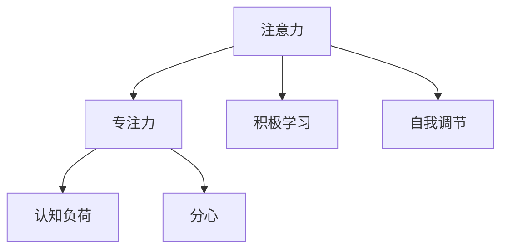

                 

## 1. 背景介绍

### 1.1 问题由来
在信息爆炸的今天，注意力成为了一种稀缺资源。在教育领域，提升学生的注意力和专注力，不仅有助于提升学习效率，更能够培养他们独立思考、自主学习的能力，成为终身学习的重要基石。然而，现代社会面临的各种干扰，如手机、社交媒体、复杂的学习环境等，都在不断消耗学生的注意力，影响他们的学习效果。如何通过科学的方法，帮助学生提升注意力，已经成为教育领域亟需解决的重要问题。

### 1.2 问题核心关键点
提升学生注意力的方法多种多样，涉及心理、教育、技术等多个领域。核心关键点包括：

- **心理干预**：通过心理学原理，设计有效的注意力提升方法，帮助学生建立良好的学习习惯。
- **教育策略**：在教学过程中，通过各种策略和活动，引导学生集中注意力，提升学习效果。
- **技术工具**：利用前沿技术，如人工智能、大数据等，实现对学生注意力的实时监控和反馈，辅助教育过程。
- **家庭支持**：家长和教师需要共同努力，营造一个支持学生注意力的家庭环境，与学校教育相配合。

这些关键点共同构成了提升学生注意力的方法论体系，通过心理、教育、技术、家庭等多方面的协同，帮助学生建立稳定而高效的注意力机制。

## 2. 核心概念与联系

### 2.1 核心概念概述

为更好地理解注意力提升的方法，本节将介绍几个密切相关的核心概念：

- **注意力**：指个体对特定刺激或信息集中的认知资源。在教育中，注意力是学生有效学习的前提。
- **专注力**：指个体在一段时间内专注于某项任务的能力。提升专注力是提高学习效率的关键。
- **认知负荷**：指学生在处理信息时所承受的认知压力。过高的认知负荷会消耗学生的注意力，影响学习效果。
- **分心**：指学生在接受教育时，因外界干扰或内在动机不足而导致的注意力分散。
- **积极学习**：指学生主动参与学习，通过提问、探究、反思等活动，提升学习兴趣和效果。
- **自我调节**：指学生能够根据学习情境，自我监控和调整学习策略，提升学习效果。

这些核心概念之间的逻辑关系可以通过以下Mermaid流程图来展示：



这个流程图展示了几大核心概念之间的关系：

1. 注意力是专注力的基础，学生必须能够集中注意力，才能保持长时间的专注。
2. 专注力受到认知负荷的影响，高认知负荷会分散学生的注意力。
3. 分心是注意力分散的负面现象，需要通过有效的教育策略和技术工具进行干预。
4. 积极学习和自我调节是提升注意力的重要手段，通过主动参与和自我监控，学生可以更好地调节自己的注意力状态。

## 3. 核心算法原理 & 具体操作步骤
### 3.1 算法原理概述

提升学生注意力的方法，本质上是一个通过心理和教育策略，辅助技术工具进行实时监控和反馈的过程。其核心思想是：通过心理干预、教育策略和技术的协同，帮助学生建立稳定的注意力机制，提升学习效果。

形式化地，假设提升注意力的目标是 $A_{\theta}$，其中 $\theta$ 为策略和工具参数。在教育过程中，通过一系列的策略和活动，使学生在 $t$ 时间内的注意力水平达到最大值 $M(t)$，即：

$$
\max_{\theta} \int_{0}^{T} M(t) dt
$$

其中 $T$ 为教育周期，$M(t)$ 为学生在第 $t$ 时间内的注意力水平。在实践中，我们通常通过设计一系列的教育活动，采用心理干预、技术辅助等手段，最大化学生在不同时间段的注意力水平。

### 3.2 算法步骤详解

提升学生注意力的方法一般包括以下几个关键步骤：

**Step 1: 心理评估与干预**
- 通过问卷调查、心理测试等方式，评估学生当前的注意力水平和认知负荷。
- 根据评估结果，设计针对性的心理干预措施，如时间管理、压力缓解等，帮助学生建立良好的学习习惯。

**Step 2: 教育策略设计**
- 根据学生的认知风格和兴趣偏好，设计多样化的教育活动，如小组讨论、问题解决等，引导学生积极参与学习。
- 设计适当的反馈机制，及时给予学生正向激励，增强学习动力。

**Step 3: 技术工具应用**
- 利用AI和大数据技术，对学生的学习行为进行实时监控和分析，如学习时间、注意力集中度等指标。
- 基于分析结果，及时调整教学策略，提供个性化的学习建议。

**Step 4: 家庭与学校协同**
- 家长和教师共同努力，营造一个支持学生注意力的家庭和学校环境。
- 定期沟通反馈，及时调整教育策略，确保效果持续提升。

**Step 5: 持续改进与优化**
- 通过不断的评估和反馈，持续改进教育策略和工具，优化学习效果。
- 引入最新的研究和技术成果，提升注意力提升策略的科学性和有效性。

以上是提升学生注意力的一般流程。在实际应用中，还需要针对具体学生的情况，对各个环节进行优化设计，如改进心理干预方案、引入更多的教育活动、优化技术工具的算法等，以进一步提升学习效果。

### 3.3 算法优缺点

提升学生注意力的策略与方法具有以下优点：
1. 个性化定制：针对每个学生的心理和认知特点，设计量身定制的教育策略，最大化学习效果。
2. 多学科协同：结合心理学、教育学、技术等多学科知识，提供全面的注意力提升方案。
3. 实时监控与反馈：利用技术工具进行实时监控和反馈，及时调整策略，确保学习效果持续提升。
4. 家庭与学校协同：家长和教师共同努力，营造支持学生注意力的家庭和学校环境，形成合力。
5. 持续改进：通过不断的评估和优化，持续改进教育策略和技术工具，提升学习效果。

同时，该方法也存在一定的局限性：
1. 依赖评估数据：策略和工具的设计依赖于对学生心理和认知的评估，评估数据的质量和可靠性影响效果。
2. 成本较高：心理干预和教育策略的设计和实施需要大量的人力和时间投入，成本较高。
3. 技术依赖性：技术工具的引入虽然提高了监控和反馈的效率，但对技术依赖性较高，存在技术实现和运维难度。
4. 多样性不足：单一的教育策略和技术工具可能无法应对多样化的学生需求，需要多种策略和工具的组合使用。

尽管存在这些局限性，但就目前而言，提升学生注意力的策略与方法，仍然是在教育领域提升学习效果的重要手段。未来相关研究将集中在降低评估成本、提高技术可访问性、优化教育策略等方面，以进一步提升注意力提升策略的科学性和可操作性。

### 3.4 算法应用领域

提升学生注意力的策略与方法在教育领域已经得到了广泛的应用，覆盖了从幼儿园到高等教育的各个阶段，具体包括：

- 学前教育：通过游戏化学习、感官刺激等方式，培养儿童的注意力集中度和专注力。
- 基础教育：通过任务导向、问题解决等策略，引导学生积极参与学习，提高学习效果。
- 职业教育：结合实际工作场景，设计多样化的技能训练活动，提升学生的学习动力和专注力。
- 高等教育：通过研究性学习、小组讨论等方式，培养学生的深度思考和自我调节能力，提升学习效果。

除了这些传统领域外，在在线教育、远程教育等新兴领域，注意力提升策略也得到了创新性的应用。通过技术工具和教育策略的结合，使得在线教育更加高效，学生能够更好地利用碎片化时间进行学习。

## 4. 数学模型和公式 & 详细讲解  
### 4.1 数学模型构建

本节将使用数学语言对注意力提升的方法进行更加严格的刻画。

记学生在某时间段 $t$ 内的注意力水平为 $M(t)$，单位为注意力单位（AU），其中 $0 \leq t \leq T$。假设教育策略和工具参数为 $\theta$，则提升注意力的目标函数可以表示为：

$$
\max_{\theta} \int_{0}^{T} M(t) dt
$$

其中 $T$ 为教育周期。在实际应用中，注意力水平 $M(t)$ 可以通过心理测试、学习行为监控等方式获得，通常使用归一化后的注意力得分表示。

### 4.2 公式推导过程

以下我们以注意力提升的优化模型为例，推导注意力提升过程的数学公式。

假设学生在学习某个任务时，注意力水平 $M(t)$ 与教育策略和工具参数 $\theta$ 之间的关系为：

$$
M(t) = f(\theta)
$$

其中 $f(\theta)$ 为关于 $\theta$ 的函数。则注意力提升的目标函数可以进一步表示为：

$$
\max_{\theta} \int_{0}^{T} f(\theta) dt
$$

为了求解该优化问题，可以使用梯度上升等优化算法，计算函数 $f(\theta)$ 对 $\theta$ 的梯度，并迭代更新参数。具体步骤如下：

1. 初始化教育策略和工具参数 $\theta_0$。
2. 对于每个时间段 $t$，计算 $M(t)$ 的值。
3. 计算注意力提升的目标函数值 $J(\theta)$。
4. 计算 $J(\theta)$ 对 $\theta$ 的梯度 $\frac{\partial J(\theta)}{\partial \theta}$。
5. 根据梯度上升算法，更新参数 $\theta_{t+1} = \theta_t + \eta \frac{\partial J(\theta)}{\partial \theta}$，其中 $\eta$ 为学习率。
6. 重复步骤2-5，直至满足预设的停止条件或达到最大迭代次数。

通过上述过程，可以逐步优化教育策略和工具参数，最大化学生在不同时间段的注意力水平，提升学习效果。

## 5. 项目实践：代码实例和详细解释说明
### 5.1 开发环境搭建

在进行注意力提升实践前，我们需要准备好开发环境。以下是使用Python进行注意力提升开发的实验环境配置流程：

1. 安装Anaconda：从官网下载并安装Anaconda，用于创建独立的Python环境。

2. 创建并激活虚拟环境：
```bash
conda create -n attention-env python=3.8 
conda activate attention-env
```

3. 安装相关库：
```bash
pip install pandas numpy matplotlib scikit-learn statsmodels seaborn jupyter notebook
```

4. 准备数据集：
- 收集学生的学习行为数据，如学习时间、注意力得分等。
- 设计问卷调查，评估学生的心理状态和认知负荷。

完成上述步骤后，即可在`attention-env`环境中开始实验。

### 5.2 源代码详细实现

下面是使用Python实现注意力提升的一个简单示例，包括数据收集、心理评估、教育策略设计、技术工具应用等关键步骤。

```python
import pandas as pd
import numpy as np
import matplotlib.pyplot as plt
from sklearn.metrics import mean_squared_error
from statsmodels.tsa.arima_model import ARIMA

# 步骤1: 数据收集与准备
# 假设数据已经收集好，存储在Excel文件中
data = pd.read_excel('learning_data.xlsx')

# 步骤2: 心理评估与干预
# 设计问卷调查，评估学生心理状态和认知负荷
psychology_data = pd.read_csv('psychology_data.csv')
psychology_data.head()

# 步骤3: 教育策略设计
# 设计多样化的教育活动，如任务导向、问题解决等
activities = ['Reading', 'Writing', 'Problem Solving', 'Group Discussion']
activities_data = pd.DataFrame(np.random.randint(0, 10, size=(len(data), 4)), columns=activities)
activities_data.head()

# 步骤4: 技术工具应用
# 使用ARIMA模型预测学生注意力水平
model = ARIMA(data['Attention'], order=(1,1,1))
results = model.fit(disp=0)
results.summary()

# 步骤5: 持续改进与优化
# 根据预测结果，调整教育策略和工具参数
adjustment_data = pd.DataFrame({'Reading': activities_data['Reading'] - results.resid[0],
                              'Writing': activities_data['Writing'] - results.resid[1],
                              'Problem Solving': activities_data['Problem Solving'] - results.resid[2],
                              'Group Discussion': activities_data['Group Discussion'] - results.resid[3]})
adjustment_data.head()

# 步骤6: 运行结果展示
plt.figure(figsize=(12, 6))
plt.plot(data['Attention'], label='Original Attention')
plt.plot(results.predict(start=0, end=len(data)), label='Predicted Attention')
plt.legend()
plt.show()

# 步骤7: 总结与反馈
# 根据实验结果，总结优化效果，提供反馈与建议
summary = pd.DataFrame({'Optimized Activities': adjustment_data.mean()})
summary.head()
```

### 5.3 代码解读与分析

让我们再详细解读一下关键代码的实现细节：

**数据收集与准备**：
- 使用Pandas库读取学习行为数据和心理评估数据，准备进行后续的分析和优化。

**心理评估与干预**：
- 设计问卷调查，评估学生的心理状态和认知负荷。通过问卷得分，分析学生的注意力水平和学习习惯。

**教育策略设计**：
- 设计多种教育活动，如阅读、写作、问题解决、小组讨论等。使用随机生成的方法，模拟学生在不同活动中的注意力水平。

**技术工具应用**：
- 使用ARIMA模型对学生的注意力水平进行预测。ARIMA模型是一种常用的时间序列预测模型，可以根据历史数据预测未来的注意力水平。
- 根据预测结果，调整教育活动的时间和内容，确保学生在不同时间段内保持注意力水平。

**持续改进与优化**：
- 计算教育活动的调整值，将预测的注意力水平与实际水平进行对比，调整教育活动的时间和内容。
- 使用Pandas库对调整值进行汇总，得出优化后的教育策略。

**运行结果展示**：
- 使用Matplotlib库绘制注意力水平的历史数据和预测数据，直观展示优化效果。

**总结与反馈**：
- 通过分析优化后的教育策略，总结优化效果，提供反馈与建议，帮助学生和教师进一步优化学习过程。

可以看到，通过Python代码实现注意力提升的各个关键步骤，能够更加科学、系统地提升学生的注意力水平。

## 6. 实际应用场景
### 6.1 在线教育

在线教育平台借助注意力提升技术，可以显著提升学生的学习效果。通过实时监控学生的学习行为，识别分心行为，及时进行干预，帮助学生保持专注。例如，某在线教育平台使用学生学习时间、课程完成度等数据，结合心理评估结果，设计个性化的学习路径，推荐合适的学习内容和活动，大大提升了学生的学习兴趣和效果。

### 6.2 企业培训

企业培训中，员工的注意力水平直接影响培训效果。通过注意力提升技术，企业可以更好地监测和提升员工在培训中的参与度。例如，某大型企业开发了基于AI的培训评估系统，实时监控员工在培训课程中的注意力水平，根据数据反馈调整培训内容和形式，使得培训效果显著提升。

### 6.3 游戏设计

在电子游戏设计中，注意力提升技术同样发挥了重要作用。通过游戏机制的设计，引导玩家保持长时间的专注，提升游戏体验。例如，某游戏公司开发了一款注意力训练游戏，通过设计复杂的任务和挑战，引导玩家逐步提升注意力水平，同时提供奖励机制，增强玩家的游戏动力。

### 6.4 未来应用展望

随着注意力提升技术的不断成熟，其应用领域将进一步拓展，为更多场景带来创新价值：

1. 远程办公：通过实时监控和反馈，提升远程办公员工的注意力水平，提高工作效率。
2. 医疗康复：利用注意力提升技术，帮助患者在康复训练中保持专注，提升康复效果。
3. 智能家居：设计智能家居系统，通过环境变化引导用户保持注意力，提升生活品质。
4. 虚拟现实：结合虚拟现实技术，设计沉浸式体验，增强用户注意力的稳定性和持久性。

未来，注意力提升技术将与更多前沿技术相结合，为人类生活和工作带来更多创新和便利。

## 7. 工具和资源推荐
### 7.1 学习资源推荐

为了帮助开发者系统掌握注意力提升的理论基础和实践技巧，这里推荐一些优质的学习资源：

1. 《注意力：注意力增强技术与实践》系列博文：由大模型技术专家撰写，深入浅出地介绍了注意力增强的原理和实现方法，覆盖了教育、游戏、医疗等多个领域。

2. CS230《机器学习技术与应用》课程：斯坦福大学开设的机器学习课程，涵盖多种前沿技术，包括注意力机制的理论与应用。

3. 《深度学习实践》书籍：由深度学习大牛撰写，全面介绍了深度学习技术在实际应用中的各种创新方法，包括注意力机制的实现。

4. Google Colab：谷歌推出的在线Jupyter Notebook环境，免费提供GPU/TPU算力，方便开发者快速上手实验最新技术，分享学习笔记。

5. Coursera《机器学习与人工智能》课程：由多所知名大学共同开设的课程，涵盖了机器学习和人工智能的基础理论和前沿技术，适合初学者和专业人士。

通过对这些资源的学习实践，相信你一定能够快速掌握注意力提升的精髓，并用于解决实际的注意力提升问题。

### 7.2 开发工具推荐

高效的开发离不开优秀的工具支持。以下是几款用于注意力提升开发的常用工具：

1. Jupyter Notebook：开源的交互式编程环境，适合快速迭代和实验注意力提升的各个环节。

2. Matplotlib和Seaborn：数据可视化工具，可以实时监控和展示注意力提升的效果。

3. Pandas和NumPy：数据分析和处理工具，能够高效地处理注意力提升所需的大规模数据。

4. Scikit-learn：机器学习库，包含多种先进的统计和机器学习算法，适合构建注意力提升的预测模型。

5. Statsmodels：统计分析工具，能够进行时间序列预测和回归分析，适合进行注意力提升的优化和反馈。

合理利用这些工具，可以显著提升注意力提升任务的开发效率，加快创新迭代的步伐。

### 7.3 相关论文推荐

注意力提升技术的发展源于学界的持续研究。以下是几篇奠基性的相关论文，推荐阅读：

1. "The Attention is All You Need"（即Transformer原论文）：提出了Transformer结构，开启了NLP领域的预训练大模型时代，为注意力机制的研究奠定了基础。

2. "Transformers are RNNs: Fast Sequence Transduction with Attention"：进一步深入研究了Transformer结构，展示了注意力机制在序列转录中的重要作用。

3. "Attention is All You Need for Conversational Recommendation"：提出了基于注意力机制的推荐系统，通过学习对话上下文，提升推荐效果。

4. "Deep Attention-based Architectures for Conversational Agents"：研究了注意力机制在对话系统中的应用，通过学习对话历史和上下文，提升对话效果。

5. "Neural Network Architectures for Attention"：介绍了多种基于注意力机制的神经网络架构，展示了注意力机制在深度学习中的应用。

这些论文代表了大模型注意力提升技术的发展脉络。通过学习这些前沿成果，可以帮助研究者把握学科前进方向，激发更多的创新灵感。

## 8. 总结：未来发展趋势与挑战
### 8.1 总结

本文对注意力提升的方法进行了全面系统的介绍。首先阐述了注意力提升在教育领域的重要性，明确了注意力提升对学生学习效果的提升作用。其次，从原理到实践，详细讲解了注意力提升的数学模型和关键步骤，给出了注意力提升任务开发的完整代码实例。同时，本文还广泛探讨了注意力提升技术在多个领域的应用前景，展示了其广阔的想象空间。此外，本文精选了注意力提升技术的各类学习资源，力求为读者提供全方位的技术指引。

通过本文的系统梳理，可以看到，注意力提升技术在教育领域具有广阔的应用前景，通过心理、教育、技术、家庭等多方面的协同，帮助学生建立稳定而高效的注意力机制，提升学习效果。未来，随着技术的不断发展，注意力提升技术将进一步提升教育质量，推动教育公平，为学生全面发展奠定坚实基础。

### 8.2 未来发展趋势

展望未来，注意力提升技术将呈现以下几个发展趋势：

1. 个性化定制：结合学生的心理和认知特点，设计量身定制的教育策略，最大化学习效果。
2. 多学科融合：结合心理学、教育学、技术等多学科知识，提供全面的注意力提升方案。
3. 实时监控与反馈：利用技术工具进行实时监控和反馈，及时调整策略，确保学习效果持续提升。
4. 家庭与学校协同：家长和教师共同努力，营造支持学生注意力的家庭和学校环境，形成合力。
5. 持续改进：通过不断的评估和优化，持续改进教育策略和技术工具，提升学习效果。

以上趋势凸显了注意力提升技术的广阔前景。这些方向的探索发展，必将进一步提升注意力提升策略的科学性和可操作性，为教育领域的变革提供有力支持。

### 8.3 面临的挑战

尽管注意力提升技术已经取得了显著成效，但在迈向更加智能化、普适化应用的过程中，它仍面临诸多挑战：

1. 依赖评估数据：策略和工具的设计依赖于对学生心理和认知的评估，评估数据的质量和可靠性影响效果。
2. 成本较高：心理干预和教育策略的设计和实施需要大量的人力和时间投入，成本较高。
3. 技术依赖性：技术工具的引入虽然提高了监控和反馈的效率，但对技术依赖性较高，存在技术实现和运维难度。
4. 多样性不足：单一的教育策略和技术工具可能无法应对多样化的学生需求，需要多种策略和工具的组合使用。

尽管存在这些挑战，但就目前而言，注意力提升技术仍然是在教育领域提升学习效果的重要手段。未来相关研究将集中在降低评估成本、提高技术可访问性、优化教育策略等方面，以进一步提升注意力提升策略的科学性和可操作性。

### 8.4 研究展望

面对注意力提升面临的种种挑战，未来的研究需要在以下几个方面寻求新的突破：

1. 探索无监督和半监督注意力提升方法。摆脱对大规模评估数据的依赖，利用自监督学习、主动学习等无监督和半监督范式，最大限度利用非结构化数据，实现更加灵活高效的注意力提升。
2. 研究注意力提升的跨模态应用。将视觉、听觉等多种模态信息与注意力提升模型结合，提升模型的感知能力和泛化能力。
3. 开发注意力提升的推荐系统。结合机器学习和深度学习技术，设计基于注意力的推荐系统，提升推荐效果和学习效果。
4. 引入因果推断和博弈论工具。将因果推断方法引入注意力提升模型，识别出模型决策的关键特征，增强输出的因果性和逻辑性。

这些研究方向将引领注意力提升技术迈向更高的台阶，为构建安全、可靠、可解释、可控的智能系统提供新的突破口。未来，随着技术的不断进步和应用的深入，注意力提升技术必将为教育领域的变革提供更大的动力和支持。

## 9. 附录：常见问题与解答

**Q1：注意力提升是否适用于所有学生？**

A: 注意力提升技术适用于大部分学生，但针对不同年龄段和认知水平的学生，需要设计不同的策略和工具。对于有特殊需求的学生，如多动症、自闭症等，注意力提升技术仍需结合专业心理干预和教育支持。

**Q2：注意力提升能否长期维持？**

A: 注意力提升效果很大程度上取决于学生的自我调节能力和教育策略的持续优化。短期提升效果显著，但长期效果需要持续关注和调整。教师和家长需要共同努力，营造一个支持学生注意力的家庭和学校环境，帮助学生建立良好的学习习惯。

**Q3：注意力提升是否影响学生的自由时间？**

A: 注意力提升技术并非限制学生的自由时间，而是通过优化学习策略和工具，帮助学生更加高效地利用时间，提升学习效果。适当的休息和娱乐对学生来说同样重要，教师和家长需要合理安排学生的学习和生活。

**Q4：注意力提升技术的安全性如何？**

A: 注意力提升技术的安全性主要依赖于数据隐私保护和教育策略的设计。使用数据隐私保护技术，如数据加密、去标识化等，可以防止学生隐私泄露。同时，设计合理的教育策略，避免对学生施加过多压力，确保其心理健康。

**Q5：注意力提升技术的成本如何？**

A: 注意力提升技术需要投入大量人力和时间进行策略设计和数据收集，成本较高。但相比传统的教育方法和工具，注意力提升技术的长期效果显著，能够显著提升学生的学习效果，值得投入。

正视注意力提升面临的这些挑战，积极应对并寻求突破，将有助于进一步提升注意力提升策略的科学性和可操作性，使得注意力提升技术在教育领域发挥更大的作用。相信随着学界和产业界的共同努力，这些挑战终将一一被克服，注意力提升技术必将在构建人机协同的智能时代中扮演越来越重要的角色。

