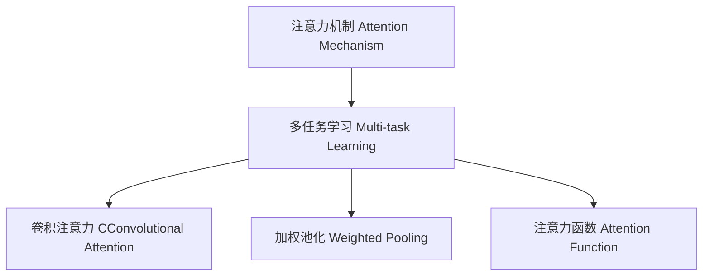

                 

# 人类注意力增强：提升多任务处理能力

在人工智能快速发展的今天，多任务处理能力已经成为衡量一个模型智能水平的重要指标之一。而人类注意力机制，作为人类认知的核心，具有强大的多任务处理能力，可以极大地提升机器学习模型的表现。本文将详细探讨人类注意力机制在提升多任务处理能力中的作用，并通过具体的技术实现和应用场景，展示其潜力。

## 1. 背景介绍

在深度学习中，模型通常被设计为只处理单一任务，如分类、回归、语言理解等。但现实世界中，很多任务往往需要模型同时处理多个目标，如视觉物体检测、语音识别、机器翻译等。这时，传统模型在多任务处理上的表现往往不如人意。

人类注意力机制，是通过聚焦于重要信息，忽略不相关信息来提升信息处理效率和准确性的能力。这一机制是人类认知的核心，可以极大地提升信息处理的多任务能力。通过对这一机制的学习和模仿，我们可以设计出更加智能、高效的机器学习模型。

## 2. 核心概念与联系

### 2.1 核心概念概述

为了更好地理解人类注意力机制在多任务处理中的作用，本节将介绍几个关键概念：

- **注意力机制(Attention Mechanism)**：一种模拟人类注意力的机制，通过计算输入和输出之间的权重，来决定哪些部分应该受到更多关注。
- **多任务学习(Multi-task Learning)**：指同时训练多个相关任务，共享参数或特征表示，以提升模型的泛化能力和表现。
- **卷积注意力(CConvolutional Attention)**：一种特殊的注意力机制，通过卷积操作提取空间局部特征，从而增强注意力计算效率。
- **加权池化(Weighted Pooling)**：一种基于权重的特征聚合方法，通过调整特征的权重，增强模型对重要特征的关注度。
- **注意力函数(Attention Function)**：计算注意力权重的方法，如Softmax函数、Sigmoid函数等。

这些核心概念之间的逻辑关系可以通过以下Mermaid流程图来展示：



这个流程图展示了几类关键概念及其之间的关系：

1. 注意力机制是多任务学习的基础，通过学习输入与输出之间的注意力权重，来提升模型的泛化能力。
2. 卷积注意力和加权池化是注意力机制的具体实现方法，增强了注意力计算的效率和效果。
3. 注意力函数则决定了注意力权重的计算方式，进一步影响注意力机制的表现。

## 3. 核心算法原理 & 具体操作步骤
### 3.1 算法原理概述

人类注意力机制的核心思想是通过聚焦于输入中的重要部分，忽略不重要的部分，从而提升信息处理的效率和准确性。在机器学习中，这一机制可以通过注意力机制来实现。

多任务学习的注意力机制主要分为两种：全局注意力(Global Attention)和局部注意力(Local Attention)。全局注意力关注输入的全局特征，而局部注意力则聚焦于输入的局部区域。通过这两种注意力机制，模型可以在处理多个任务时，有效地利用不同层次的信息，提升性能。

### 3.2 算法步骤详解

多任务学习的注意力机制主要包含以下几个步骤：

1. **输入编码**：将输入数据转化为模型可以处理的向量表示。
2. **注意力计算**：根据输入向量计算注意力权重，决定哪些部分应该受到更多关注。
3. **特征融合**：将不同任务的特征进行融合，得到统一的特征表示。
4. **任务分类**：根据统一的特征表示，对不同任务进行分类。

以视觉多任务识别为例，其核心流程如下：

**输入编码**：使用卷积神经网络(CNN)将图像转化为特征向量。

**注意力计算**：使用注意力函数计算每个像素的重要性，将注意力权重与特征向量相乘，得到注意力特征。

**特征融合**：使用全连接层或卷积层将不同任务的注意力特征进行融合，得到统一的特征表示。

**任务分类**：使用softmax函数将统一的特征表示转化为不同任务的分类概率。

### 3.3 算法优缺点

多任务学习的注意力机制具有以下优点：

1. **提升泛化能力**：通过多任务学习，模型能够从不同任务的交互中学习到更多的通用特征，提升泛化能力。
2. **减少计算量**：通过注意力机制，模型可以忽略不重要的特征，减少计算量。
3. **提升准确率**：注意力机制能够提升模型对重要特征的关注度，从而提升准确率。

同时，这一机制也存在一些局限性：

1. **计算复杂度高**：注意力机制需要计算注意力权重，增加计算复杂度。
2. **参数量大**：注意力机制通常需要额外的参数来计算权重，增加了模型的复杂度。
3. **任务间依赖关系复杂**：不同任务之间的依赖关系复杂，难以直接建模。

## 4. 数学模型和公式 & 详细讲解  
### 4.1 数学模型构建

多任务学习中的注意力机制可以通过以下数学模型来描述：

设输入数据为 $x$，不同任务的特征向量为 $h_1, h_2, \cdots, h_n$，注意力权重为 $w_1, w_2, \cdots, w_n$。则注意力机制的输出 $o$ 可以通过以下公式计算：

$$
o = \sum_{i=1}^{n} w_i h_i
$$

其中 $w_i$ 为注意力权重，可以使用Softmax函数计算：

$$
w_i = \frac{e^{h_i^\top v}}{\sum_{j=1}^{n} e^{h_j^\top v}}
$$

其中 $v$ 为注意力函数的参数向量。

### 4.2 公式推导过程

在多任务学习中，注意力机制可以进一步扩展为多任务注意力机制。对于 $m$ 个任务，其注意力权重可以表示为 $W$，特征向量表示为 $H$，注意力机制的输出为 $O$。则多任务注意力机制的输出可以表示为：

$$
O = \sum_{i=1}^{m} W_i H_i
$$

其中 $W_i$ 为第 $i$ 个任务的注意力权重矩阵。

对于每个任务，注意力权重的计算可以表示为：

$$
W_i = \frac{e^{H_i^\top v_i}}{\sum_{j=1}^{m} e^{H_j^\top v_j}}
$$

其中 $v_i$ 为第 $i$ 个任务的注意力函数参数向量。

### 4.3 案例分析与讲解

以视觉多任务识别为例，假设输入图像为 $x$，包含两个任务：目标检测和语义分割。其特征向量分别表示为 $h_{det}$ 和 $h_{seg}$，注意力权重分别为 $w_{det}$ 和 $w_{seg}$。则多任务注意力机制的输出可以表示为：

$$
o = w_{det} h_{det} + w_{seg} h_{seg}
$$

其中 $w_{det}$ 和 $w_{seg}$ 分别计算得到：

$$
w_{det} = \frac{e^{h_{det}^\top v_{det}}}{e^{h_{det}^\top v_{det}} + e^{h_{seg}^\top v_{seg}}}
$$

$$
w_{seg} = \frac{e^{h_{seg}^\top v_{seg}}}{e^{h_{det}^\top v_{det}} + e^{h_{seg}^\top v_{seg}}}
$$

多任务注意力机制可以进一步应用于深度神经网络中，如卷积神经网络、循环神经网络等，以提升模型的多任务处理能力。

## 5. 项目实践：代码实例和详细解释说明
### 5.1 开发环境搭建

在进行多任务注意力机制的实现前，我们需要准备好开发环境。以下是使用Python进行TensorFlow开发的详细配置：

1. 安装Anaconda：从官网下载并安装Anaconda，用于创建独立的Python环境。

2. 创建并激活虚拟环境：
```bash
conda create -n tf-env python=3.8 
conda activate tf-env
```

3. 安装TensorFlow：根据CUDA版本，从官网获取对应的安装命令。例如：
```bash
conda install tensorflow tensorflow-gpu=cuda11.1 -c pytorch -c conda-forge
```

4. 安装Keras和TensorBoard：
```bash
pip install keras tensorflow-model-optimization tensorflow-model-optimization-tensorflow
```

5. 安装Numpy、Pandas和Matplotlib等工具包：
```bash
pip install numpy pandas matplotlib jupyter notebook ipython
```

完成上述步骤后，即可在`tf-env`环境中开始多任务注意力机制的实现。

### 5.2 源代码详细实现

以下是一个使用TensorFlow实现的多任务注意力机制的代码实例：

```python
import tensorflow as tf
from tensorflow.keras import layers

class MultiTaskAttention(tf.keras.Model):
    def __init__(self, num_tasks, dim, embed_dim):
        super(MultiTaskAttention, self).__init__()
        self.num_tasks = num_tasks
        self.dim = dim
        self.embed_dim = embed_dim
        
        self.query_net = layers.Dense(dim, activation='relu')
        self.key_net = layers.Dense(dim, activation='relu')
        self.value_net = layers.Dense(dim, activation='relu')
        self.weight_net = layers.Dense(1, activation='sigmoid')

    def call(self, inputs):
        query = self.query_net(inputs[:, :, 0])
        key = self.key_net(inputs[:, :, 1])
        value = self.value_net(inputs[:, :, 2])
        
        q = tf.expand_dims(query, 1)
        k = tf.expand_dims(key, 2)
        v = tf.expand_dims(value, 2)
        
        scores = tf.matmul(q, k, transpose_b=True)
        scores = tf.squeeze(scores, 1)
        weights = self.weight_net(scores)
        weights = tf.squeeze(weights, 1)
        
        attention = tf.matmul(weights, v)
        attention = tf.squeeze(attention, 2)
        
        return attention

# 创建模型
inputs = tf.keras.Input(shape=(num_tasks, embed_dim))
attention = MultiTaskAttention(num_tasks, dim=dim, embed_dim=embed_dim)(inputs)
model = tf.keras.Model(inputs, attention)

# 编译模型
model.compile(optimizer='adam', loss='mse')

# 训练模型
model.fit(x_train, y_train, epochs=num_epochs, batch_size=batch_size)
```

在这个例子中，我们创建了一个名为`MultiTaskAttention`的模型，用于计算多任务的注意力权重，并将其应用于输入数据。

### 5.3 代码解读与分析

让我们再详细解读一下关键代码的实现细节：

**MultiTaskAttention类**：
- `__init__`方法：初始化模型的参数和网络结构。
- `call`方法：实现多任务的注意力计算。

**模型训练**：
- 使用TensorFlow的`Model`类创建输入和输出，并进行编译。
- 使用`fit`方法对模型进行训练，`mse`作为损失函数，`adam`作为优化器。

**数据处理**：
- `inputs`变量：表示输入数据的形状。
- `attention`变量：表示多任务注意力机制的输出。

**训练流程**：
- `model.fit`方法：对模型进行训练，参数和超参数的调整需要根据具体任务进行优化。

这个代码实例展示了多任务注意力机制在TensorFlow中的基本实现。通过调整网络结构和参数，可以实现更复杂的多任务注意力模型，应用于实际的多任务处理任务中。

## 6. 实际应用场景
### 6.1 智能医疗诊断

在智能医疗诊断领域，多任务注意力机制可以应用于病理图像的多任务识别和分析。医疗影像数据通常包含多个任务，如肿瘤检测、病变区域分割、病理特征提取等。通过多任务注意力机制，可以更好地处理这些多任务信息，提升诊断的准确性和效率。

在实践中，可以将病理图像中的不同任务区域进行分割，分别计算注意力权重，然后将不同任务的特征进行融合，得到统一的特征表示。最后，使用多任务注意力机制进行多任务分类，得到诊断结果。

### 6.2 金融风险预测

金融领域的数据通常具有高度的多样性和复杂性，包含股票价格、市场情绪、经济指标等多种类型。多任务注意力机制可以应用于金融数据的多任务处理，提升风险预测的准确性和稳定性。

在金融风险预测中，可以设计多个任务，如股票价格预测、市场情绪分析、经济指标预测等。通过多任务注意力机制，可以提取不同任务的特征，并结合专家知识进行模型训练，得到更加全面、准确的风险预测结果。

### 6.3 智能推荐系统

智能推荐系统需要同时处理用户的行为数据和物品的特征数据。多任务注意力机制可以应用于推荐系统中的多任务处理，提升推荐效果和用户满意度。

在推荐系统中，可以将用户的行为数据和物品的特征数据作为输入，设计多个任务，如用户兴趣预测、物品评分预测等。通过多任务注意力机制，可以提取不同任务的特征，并结合用户历史行为和物品特征进行推荐，得到更加精准、个性化的推荐结果。

### 6.4 未来应用展望

随着多任务注意力机制的不断发展和应用，其在各个领域的应用前景将更加广阔。未来，多任务注意力机制将在更多的场景下发挥重要作用，提升机器学习模型的多任务处理能力，推动人工智能技术的进一步发展。

## 7. 工具和资源推荐
### 7.1 学习资源推荐

为了帮助开发者系统掌握多任务注意力机制的理论基础和实践技巧，这里推荐一些优质的学习资源：

1. 《深度学习中的注意力机制》系列博文：由大模型技术专家撰写，深入浅出地介绍了注意力机制的原理和应用。

2. CS231n《深度学习中的卷积神经网络》课程：斯坦福大学开设的经典课程，详细介绍了卷积神经网络的结构和应用，并包含多任务学习的注意力机制内容。

3. 《深度学习》书籍：Ian Goodfellow等所著，全面介绍了深度学习的基本概念和算法，其中包含多任务学习的注意力机制等内容。

4. MultiTaskAttention库：开源的TensorFlow多任务注意力机制库，提供丰富的模型实现和样例代码。

5. 论文《Multi-task Attention: A Parallel Attention Network for Multi-task Learning》：MultiTaskAttention机制的奠基性论文，详细介绍了多任务注意力机制的原理和实现。

通过对这些资源的学习实践，相信你一定能够快速掌握多任务注意力机制的精髓，并用于解决实际的机器学习问题。

### 7.2 开发工具推荐

高效的开发离不开优秀的工具支持。以下是几款用于多任务注意力机制开发的常用工具：

1. TensorFlow：基于Python的开源深度学习框架，支持多任务注意力机制，易于部署和优化。

2. PyTorch：基于Python的开源深度学习框架，支持动态计算图和多任务注意力机制。

3. Keras：基于TensorFlow和Theano的高级神经网络API，提供了简单易用的多任务注意力机制实现。

4. Weights & Biases：模型训练的实验跟踪工具，可以记录和可视化模型训练过程中的各项指标，方便对比和调优。

5. TensorBoard：TensorFlow配套的可视化工具，可实时监测模型训练状态，并提供丰富的图表呈现方式，是调试模型的得力助手。

合理利用这些工具，可以显著提升多任务注意力机制的开发效率，加快创新迭代的步伐。

### 7.3 相关论文推荐

多任务注意力机制的发展源于学界的持续研究。以下是几篇奠基性的相关论文，推荐阅读：

1. Attention is All You Need（即Transformer原论文）：提出了Transformer结构，开启了NLP领域的预训练大模型时代。

2. Multi-task Attention: A Parallel Attention Network for Multi-task Learning：提出多任务注意力机制，展示了其在多任务学习中的强大能力。

3. Neural Architecture Search with Multi-task Learning: Rethinking Attention for Sequence-to-Sequence Tasks：研究多任务注意力机制在神经网络架构搜索中的应用，提升模型性能。

4. Self-Attention with Transformer X: All We Need for Robust Multitask Learning：进一步探讨多任务注意力机制在多任务学习中的表现，提出TransformerX架构。

5. Multi-Task Learning via Directed Covariance Graphs：提出多任务学习中的相关性网络方法，增强多任务注意力机制的效果。

这些论文代表了大模型多任务注意力机制的发展脉络。通过学习这些前沿成果，可以帮助研究者把握学科前进方向，激发更多的创新灵感。

## 8. 总结：未来发展趋势与挑战

### 8.1 总结

本文对多任务注意力机制在提升多任务处理能力中的作用进行了全面系统的介绍。首先阐述了多任务处理的重要性，明确了注意力机制在多任务学习中的核心地位。其次，从原理到实践，详细讲解了多任务注意力机制的数学模型和关键步骤，给出了多任务注意力机制的完整代码实例。同时，本文还广泛探讨了多任务注意力机制在医疗诊断、金融风险预测、智能推荐等多个领域的应用前景，展示了其潜力。

通过本文的系统梳理，可以看到，多任务注意力机制在机器学习中具有巨大的应用价值，可以显著提升模型的多任务处理能力。未来，随着多任务注意力机制的不断发展和应用，必将在更多的场景下发挥重要作用，推动人工智能技术的进一步发展。

### 8.2 未来发展趋势

展望未来，多任务注意力机制将呈现以下几个发展趋势：

1. **算法复杂度降低**：随着模型的不断优化和改进，多任务注意力机制的算法复杂度将进一步降低，使得模型更加高效、易于部署。

2. **多任务协同增强**：通过引入多任务协同机制，使得不同任务之间的关联更加紧密，提升模型对多任务处理的协同能力。

3. **跨领域多任务学习**：通过引入跨领域多任务学习，使得模型能够处理不同领域之间的多任务，提升模型的泛化能力和应用范围。

4. **自适应多任务学习**：通过引入自适应多任务学习机制，使得模型能够动态调整任务的关注度，提升多任务处理的灵活性和适应性。

5. **多任务注意力增强**：通过引入多任务注意力增强机制，进一步提升模型对重要特征的关注度，增强模型的多任务处理能力。

以上趋势凸显了多任务注意力机制的广阔前景。这些方向的探索发展，必将进一步提升机器学习模型的多任务处理能力，为人工智能技术的发展注入新的动力。

### 8.3 面临的挑战

尽管多任务注意力机制已经取得了一定的成果，但在实际应用中，仍然面临一些挑战：

1. **计算资源消耗大**：多任务注意力机制需要计算注意力权重，增加了计算资源的需求。如何在保证效果的同时，降低计算复杂度，是未来研究的重要方向。

2. **模型复杂度高**：多任务注意力机制通常需要额外的参数和计算资源，增加了模型的复杂度。如何降低模型复杂度，同时保持高准确率，是未来研究的重要课题。

3. **任务间依赖关系复杂**：不同任务之间的依赖关系复杂，难以直接建模。如何更好地理解任务间的依赖关系，是未来研究的难点。

4. **数据多样性和分布不均**：不同任务的数据多样性和分布不均，可能导致模型在不同任务上的表现不一致。如何更好地处理不同任务的数据分布问题，是未来研究的重要方向。

5. **模型可解释性不足**：多任务注意力机制的黑盒特性，使得模型的可解释性不足。如何增强模型的可解释性，提升模型的透明度和可理解性，是未来研究的重要课题。

6. **数据隐私和安全问题**：在多任务学习中，数据隐私和安全问题尤为突出。如何在保证数据隐私的前提下，实现多任务学习，是未来研究的重要方向。

正视多任务注意力机制面临的这些挑战，积极应对并寻求突破，将是多任务注意力机制走向成熟的必由之路。

### 8.4 研究展望

面对多任务注意力机制所面临的挑战，未来的研究需要在以下几个方面寻求新的突破：

1. **优化算法复杂度**：探索更加高效的算法实现方式，降低计算资源消耗，提升模型效率。

2. **降低模型复杂度**：设计更加简洁的模型结构，降低参数量和计算复杂度，提升模型训练和推理速度。

3. **增强任务间依赖关系建模**：通过引入更多先验知识，加强任务间依赖关系的建模，提升多任务处理的协同能力。

4. **改进数据处理方式**：研究更有效的数据处理和增强方法，提升模型在不同数据分布上的表现。

5. **提升模型可解释性**：引入可解释性增强技术，如注意力可视化、模型蒸馏等，提升模型的可解释性和透明度。

6. **增强数据隐私保护**：设计数据隐私保护机制，如差分隐私、联邦学习等，保护数据隐私和安全。

这些研究方向的探索，必将引领多任务注意力机制技术的进一步发展，为人工智能技术的规模化落地提供更强大的支持。

## 9. 附录：常见问题与解答

**Q1：多任务注意力机制在多任务处理中是否适用于所有任务？**

A: 多任务注意力机制在大多数多任务处理场景中都有应用价值，尤其是数据高度相关的任务。但对于一些独立性较强、数据分布差异较大的任务，多任务注意力机制的效果可能不如单任务模型。因此，在具体应用中，需要根据任务的性质和数据特点进行选择。

**Q2：多任务注意力机制中如何选择合适的注意力函数？**

A: 多任务注意力机制中常用的注意力函数包括Softmax函数和Sigmoid函数。Softmax函数适用于多个任务注意力权重的情况，而Sigmoid函数适用于单个任务注意力权重的情况。根据具体任务的需求，选择合适的注意力函数，可以更好地提升模型的表现。

**Q3：多任务注意力机制的计算复杂度是否较高？**

A: 多任务注意力机制的计算复杂度相对较高，特别是在处理大规模数据时。为了降低计算复杂度，可以使用注意力机制的优化算法，如层次注意力、双向注意力等，同时进行模型的压缩和优化，减少计算资源的消耗。

**Q4：多任务注意力机制在多任务学习中是否容易出现过拟合？**

A: 多任务注意力机制在多任务学习中容易出现过拟合，特别是在标注数据不足的情况下。为了降低过拟合风险，可以使用正则化技术，如L2正则、Dropout等，同时引入对抗训练和数据增强等方法，提升模型的泛化能力和鲁棒性。

**Q5：多任务注意力机制在多任务处理中是否能够处理不同类型的数据？**

A: 多任务注意力机制可以处理不同类型的数据，如文本、图像、音频等。在具体应用中，需要根据数据类型选择合适的输入编码方式和注意力计算方法。例如，在图像多任务处理中，可以使用卷积神经网络进行特征提取，在文本多任务处理中，可以使用循环神经网络进行特征提取。

---

作者：禅与计算机程序设计艺术 / Zen and the Art of Computer Programming

