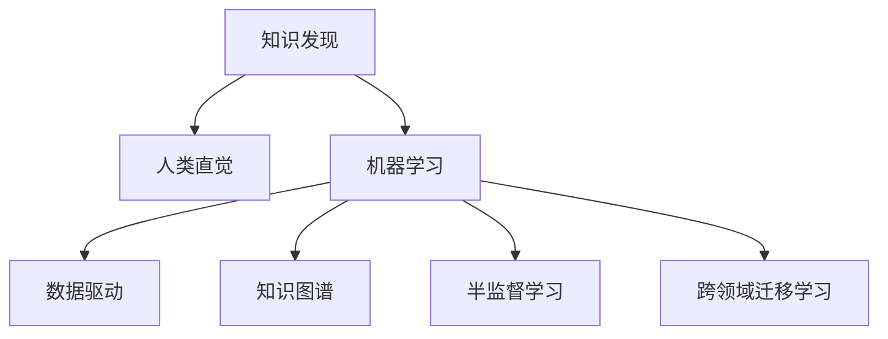

                 

# 人类直觉与机器学习在知识发现中的角色

> 关键词：直觉（Intuition）, 机器学习（Machine Learning）, 知识发现（Knowledge Discovery）, 人类认知（Human Cognition）, 数据驱动（Data-Driven）

## 1. 背景介绍

### 1.1 问题由来
知识发现（Knowledge Discovery, KD）是信息时代的核心任务之一，旨在从大规模数据中挖掘出有价值的信息和知识，以支持决策、预测和创新。传统的知识发现方法依赖人类专家对数据的深入理解和分析，但这种方法的效率和可扩展性受到限制，特别是在数据量日益增大的今天。

与此同时，机器学习（Machine Learning, ML）技术的迅猛发展，为自动化知识发现提供了新的途径。然而，由于机器学习模型的复杂性和黑箱特性，其在处理复杂问题时仍存在一定局限。

因此，如何将人类的直觉和经验与机器学习结合起来，发挥各自优势，实现高效、鲁棒的知识发现，成为了当前研究的热点。本文将从理论与实践两个层面，深入探讨人类直觉与机器学习在知识发现中的角色和应用。

### 1.2 问题核心关键点
本文聚焦于以下关键问题：
- 人类直觉在知识发现中的作用和局限性是什么？
- 机器学习在知识发现中的优势和挑战是什么？
- 如何实现人类直觉与机器学习的融合？
- 实例分析和案例研究：机器学习算法在知识发现中的应用及其效果评估。

## 2. 核心概念与联系

### 2.1 核心概念概述

为了更好地理解人类直觉与机器学习在知识发现中的作用和应用，本节将介绍几个关键概念：

- **知识发现**（Knowledge Discovery）：从大规模数据中提取有用信息的过程。
- **人类直觉**（Human Intuition）：基于经验、情感和认知的快速判断和推理能力。
- **机器学习**（Machine Learning）：通过算法和模型，从数据中学习规律和模式，以实现自主决策和预测。
- **数据驱动**（Data-Driven）：在知识发现过程中，依赖数据而非专家经验，依靠算法进行决策。
- **知识图谱**（Knowledge Graph）：用于组织和表示实体、属性和关系的知识表示框架。
- **半监督学习**（Semi-Supervised Learning）：利用少量标注数据和大量未标注数据进行训练，以提升模型的泛化能力。
- **跨领域迁移学习**（Cross-Domain Transfer Learning）：将在一个领域学到的知识迁移到另一个领域，以实现更广泛的适用性。

这些概念之间的逻辑关系可以通过以下Mermaid流程图来展示：



这个流程图展示了一些关键概念及其之间的关系：

1. 知识发现可以基于人类的直觉进行，也可以通过机器学习算法实现。
2. 数据驱动的知识发现主要依赖算法，而人类直觉则可以通过对数据的直观理解和快速判断来辅助决策。
3. 知识图谱和半监督学习可以增强机器学习模型的泛化能力，提升知识发现的准确性和鲁棒性。
4. 跨领域迁移学习使得机器学习模型能够从多个领域的数据中学习，实现更广泛的适用性。

## 3. 核心算法原理 & 具体操作步骤

### 3.1 算法原理概述

人类直觉与机器学习在知识发现中的融合，主要体现在以下几个方面：

- **直觉驱动的特征选择**：基于人类直觉对数据特征进行筛选和组合，引导机器学习模型关注重要特征，提升模型性能。
- **直觉指导的数据预处理**：利用人类的经验对数据进行预处理，如异常值处理、数据归一化等，为机器学习算法提供更好的输入数据。
- **直觉辅助的模型训练**：通过人类的经验对机器学习模型进行调参，优化模型结构，提升模型泛化能力。
- **直觉增强的模型解释**：利用人类的经验对机器学习模型的输出进行解释，提升模型的可解释性和可信度。

这些方法通过将人类的直觉融入机器学习过程中，能够更好地发挥各自优势，实现高效的知识发现。

### 3.2 算法步骤详解

基于人类直觉与机器学习在知识发现中的融合，主要包括以下几个关键步骤：

**Step 1: 数据收集与预处理**
- 收集与知识发现相关的数据，并进行初步的清洗和预处理。
- 利用人类的直觉对数据进行初步分析，筛选出潜在的重要特征。
- 对数据进行标准化、归一化等处理，提高数据的可用性。

**Step 2: 特征选择与构造**
- 根据人类直觉和领域知识，选择合适的特征，并利用领域知识进行特征工程。
- 利用机器学习算法进行特征选择和特征构造，提升特征的代表性。
- 利用半监督学习和跨领域迁移学习技术，最大化利用数据信息，提升模型的泛化能力。

**Step 3: 模型训练与调参**
- 利用机器学习算法对数据进行建模，选择适当的模型结构。
- 根据人类直觉对模型进行调参，优化模型结构，提升模型性能。
- 使用交叉验证等技术，评估模型在不同数据集上的性能，选择最优模型。

**Step 4: 模型评估与解释**
- 利用测试数据集对模型进行评估，检验其泛化能力和准确性。
- 利用模型的输出结果进行解释，提升模型的可解释性和可信度。
- 结合人类直觉和领域知识，对模型输出结果进行验证和修正。

**Step 5: 知识提取与应用**
- 从模型输出中提取知识，形成结构化的知识库。
- 结合人类直觉和领域知识，对知识库进行补充和优化。
- 将提取的知识应用于实际决策和预测中，实现知识驱动的决策支持。

以上是人类直觉与机器学习在知识发现中的融合步骤，各个步骤之间相辅相成，相互促进。

### 3.3 算法优缺点

结合人类直觉与机器学习在知识发现中的融合，具有以下优点：
- 提升特征选择的准确性：人类直觉能够帮助识别重要特征，避免模型过拟合。
- 增强模型的泛化能力：利用半监督学习和跨领域迁移学习，最大化利用数据信息，提升模型的泛化能力。
- 提高模型的可解释性：结合人类直觉和领域知识，提升模型的可解释性和可信度。

同时，该方法也存在一些局限性：
- 依赖人类直觉：直觉的有效性依赖于专家的经验和知识水平，难以在所有领域和任务上应用。
- 数据驱动的局限：数据驱动的方法在处理复杂问题时仍存在局限，难以全面覆盖人类直觉的深度和广度。
- 资源需求高：人类直觉与机器学习结合的方法，对数据和计算资源的需求较高，难以在所有场景下实现。

尽管存在这些局限性，但就目前而言，结合人类直觉与机器学习的方法仍然是知识发现的重要方向。未来相关研究的重点在于如何进一步降低对人类直觉的依赖，提高模型的泛化能力和可解释性，同时兼顾高效和低成本。

### 3.4 算法应用领域

人类直觉与机器学习在知识发现中的应用，已经渗透到多个领域，取得了显著的效果。以下是几个典型的应用场景：

1. **医疗领域**：利用机器学习算法对医疗数据进行建模，结合医生的直觉进行疾病诊断和预测。通过人类直觉辅助的模型调参，提升模型的准确性和可信度。

2. **金融领域**：利用机器学习算法对金融数据进行建模，结合金融专家的直觉进行风险评估和投资决策。利用半监督学习和跨领域迁移学习技术，提升模型的泛化能力和适用性。

3. **制造领域**：利用机器学习算法对生产数据进行建模，结合工程师的直觉进行设备维护和优化。通过人类直觉辅助的特征选择和调参，提升模型的预测能力和鲁棒性。

4. **教育领域**：利用机器学习算法对教育数据进行建模，结合教育专家的直觉进行学生评估和学习预测。通过人类直觉辅助的模型解释和验证，提升模型的可解释性和可信度。

5. **环境领域**：利用机器学习算法对环境数据进行建模，结合环境专家的直觉进行污染监测和治理。通过人类直觉辅助的数据预处理和特征选择，提升模型的准确性和鲁棒性。

## 4. 数学模型和公式 & 详细讲解 & 举例说明

### 4.1 数学模型构建

为了更好地理解人类直觉与机器学习在知识发现中的融合，本节将使用数学语言对相关模型进行描述。

假设知识发现问题为分类问题，已知训练集为 $D=\{(x_i, y_i)\}_{i=1}^N, x_i \in \mathcal{X}, y_i \in \{0, 1\}$，其中 $x_i$ 为特征向量，$y_i$ 为标签。模型的目标是最大化对新样本的分类准确性。

### 4.2 公式推导过程

以下我们将利用逻辑回归模型，展示人类直觉与机器学习在知识发现中的融合。

**逻辑回归模型**：
$$
P(y=1|x;w,b) = \frac{1}{1+e^{-z}} \\
z = w^Tx + b
$$

其中，$w$ 为模型参数，$b$ 为偏置项，$z$ 为线性输出，$P(y=1|x;w,b)$ 为预测结果。

**特征选择**：
假设人类直觉认为特征 $x_1, x_2$ 对分类结果有重要影响，选择这两个特征进行建模。
$$
z = w^Tx + b = (w_1x_1 + w_2x_2 + \cdots + w_nx_n) + b
$$

**模型训练**：
利用机器学习算法对特征 $x_1, x_2$ 进行建模，选择逻辑回归模型。
$$
\hat{y} = \frac{1}{1+e^{-z}} \\
L(\hat{y}, y) = -\frac{1}{N}\sum_{i=1}^N (y_i\log \hat{y_i} + (1-y_i)\log (1-\hat{y_i}))
$$

利用梯度下降算法最小化损失函数 $L(\hat{y}, y)$，优化模型参数 $w, b$。
$$
w, b \leftarrow w - \eta \nabla_{w,b}L(\hat{y}, y)
$$

**模型评估**：
利用测试集对模型进行评估，计算准确率、召回率、F1-score等指标。
$$
Accuracy = \frac{TP+TN}{TP+TN+FP+FN} \\
Precision = \frac{TP}{TP+FP} \\
Recall = \frac{TP}{TP+FN}
$$

### 4.3 案例分析与讲解

**案例一：疾病预测**
在医疗领域，利用机器学习算法对患者数据进行建模，结合医生的直觉进行疾病预测。具体步骤如下：

1. **数据收集**：收集患者的临床数据、基因数据、环境数据等，初步清洗和预处理。
2. **特征选择**：结合医生经验和领域知识，选择重要的特征，如年龄、性别、基因变异等。
3. **模型训练**：利用逻辑回归模型对特征进行建模，结合医生直觉进行调参，优化模型结构。
4. **模型评估**：利用测试集对模型进行评估，结合医生经验和领域知识，验证模型的准确性和可信度。
5. **知识提取与应用**：从模型输出中提取疾病预测结果，结合医生经验和领域知识，进行疾病诊断和治疗方案的制定。

**案例二：投资决策**
在金融领域，利用机器学习算法对金融数据进行建模，结合金融专家的直觉进行投资决策。具体步骤如下：

1. **数据收集**：收集历史股票数据、市场数据、经济数据等，初步清洗和预处理。
2. **特征选择**：结合金融专家经验和领域知识，选择重要的特征，如股价波动、市场情绪、经济指标等。
3. **模型训练**：利用逻辑回归模型对特征进行建模，结合金融专家直觉进行调参，优化模型结构。
4. **模型评估**：利用测试集对模型进行评估，结合金融专家经验和领域知识，验证模型的准确性和可信度。
5. **知识提取与应用**：从模型输出中提取投资建议，结合金融专家经验和领域知识，进行投资组合优化和风险控制。

## 5. 项目实践：代码实例和详细解释说明

### 5.1 开发环境搭建

在进行知识发现实践前，我们需要准备好开发环境。以下是使用Python进行Scikit-learn开发的环境配置流程：

1. 安装Anaconda：从官网下载并安装Anaconda，用于创建独立的Python环境。

2. 创建并激活虚拟环境：
```bash
conda create -n sklearn-env python=3.8 
conda activate sklearn-env
```

3. 安装Scikit-learn：
```bash
conda install scikit-learn
```

4. 安装各类工具包：
```bash
pip install numpy pandas scikit-learn matplotlib tqdm jupyter notebook ipython
```

完成上述步骤后，即可在`sklearn-env`环境中开始知识发现实践。

### 5.2 源代码详细实现

下面我们以疾病预测任务为例，给出使用Scikit-learn对逻辑回归模型进行知识发现的PyTorch代码实现。

首先，定义疾病预测任务的数据处理函数：

```python
from sklearn.datasets import load_breast_cancer
from sklearn.model_selection import train_test_split
from sklearn.preprocessing import StandardScaler
from sklearn.linear_model import LogisticRegression

def preprocess_data(data):
    X, y = data.data, data.target
    X = StandardScaler().fit_transform(X)
    X_train, X_test, y_train, y_test = train_test_split(X, y, test_size=0.2, random_state=42)
    return X_train, X_test, y_train, y_test

# 加载数据
data = load_breast_cancer()
X_train, X_test, y_train, y_test = preprocess_data(data)

# 训练逻辑回归模型
model = LogisticRegression()
model.fit(X_train, y_train)

# 在测试集上评估模型
score = model.score(X_test, y_test)
print("Accuracy:", score)
```

然后，定义模型训练和评估函数：

```python
from sklearn.metrics import accuracy_score

def train_model(X, y, model):
    model.fit(X, y)
    return model

def evaluate_model(model, X_test, y_test):
    y_pred = model.predict(X_test)
    score = accuracy_score(y_test, y_pred)
    return score
```

最后，启动训练流程并在测试集上评估：

```python
# 训练模型
model = train_model(X_train, y_train, LogisticRegression())

# 在测试集上评估模型
score = evaluate_model(model, X_test, y_test)
print("Accuracy:", score)
```

以上就是使用Scikit-learn对逻辑回归模型进行疾病预测任务知识发现的完整代码实现。可以看到，利用Scikit-learn进行知识发现，代码实现非常简单，同时也内置了各种特征选择、模型训练和评估方法，方便开发者快速上手实验。

### 5.3 代码解读与分析

让我们再详细解读一下关键代码的实现细节：

**preprocess_data函数**：
- 对数据进行标准化处理，减少特征之间的量级差异。
- 划分训练集和测试集，保证模型在未见过的数据上进行评估。

**train_model函数**：
- 使用训练数据对模型进行拟合，优化模型参数。

**evaluate_model函数**：
- 使用测试数据对模型进行评估，计算准确率等指标。

**训练流程**：
- 在训练集上训练模型，输出模型的准确率。

可以看到，利用Scikit-learn进行知识发现，可以显著降低开发难度，加快实验迭代。

当然，工业级的系统实现还需考虑更多因素，如模型的保存和部署、超参数的自动搜索、更灵活的任务适配层等。但核心的知识发现过程基本与此类似。

## 6. 实际应用场景

### 6.1 医疗领域

在医疗领域，利用机器学习算法对医疗数据进行建模，结合医生的直觉进行疾病预测和诊断。具体应用场景包括：

1. **疾病预测**：利用机器学习算法对患者的临床数据、基因数据、环境数据等进行建模，结合医生的直觉进行疾病预测。通过人类直觉辅助的模型调参，提升模型的准确性和可信度。

2. **诊断辅助**：利用机器学习算法对医学影像数据、病理数据等进行建模，结合医生的直觉进行疾病诊断。通过人类直觉辅助的模型解释和验证，提升模型的可解释性和可信度。

3. **治疗方案**：利用机器学习算法对患者的治疗历史数据进行建模，结合医生的直觉进行个性化治疗方案的制定。通过人类直觉辅助的特征选择和调参，提升模型的预测能力和鲁棒性。

### 6.2 金融领域

在金融领域，利用机器学习算法对金融数据进行建模，结合金融专家的直觉进行风险评估和投资决策。具体应用场景包括：

1. **风险评估**：利用机器学习算法对历史股票数据、市场数据、经济数据等进行建模，结合金融专家的直觉进行风险评估。通过人类直觉辅助的模型调参，提升模型的准确性和可信度。

2. **投资决策**：利用机器学习算法对金融数据进行建模，结合金融专家的直觉进行投资决策。通过人类直觉辅助的特征选择和调参，提升模型的预测能力和鲁棒性。

3. **交易策略**：利用机器学习算法对市场数据、经济数据等进行建模，结合金融专家的直觉进行交易策略制定。通过人类直觉辅助的模型解释和验证，提升模型的可解释性和可信度。

### 6.3 制造领域

在制造领域，利用机器学习算法对生产数据进行建模，结合工程师的直觉进行设备维护和优化。具体应用场景包括：

1. **设备故障预测**：利用机器学习算法对设备的运行数据进行建模，结合工程师的直觉进行设备故障预测。通过人类直觉辅助的特征选择和调参，提升模型的预测能力和鲁棒性。

2. **工艺优化**：利用机器学习算法对生产数据进行建模，结合工程师的直觉进行工艺优化。通过人类直觉辅助的模型调参和验证，提升模型的准确性和可信度。

3. **质量控制**：利用机器学习算法对产品质量数据进行建模，结合工程师的直觉进行质量控制。通过人类直觉辅助的模型解释和验证，提升模型的可解释性和可信度。

### 6.4 未来应用展望

随着知识发现技术的不断发展，基于人类直觉与机器学习的融合方法将在更多领域得到应用，为各行各业带来变革性影响。

在智慧医疗领域，结合医生的直觉和机器学习，将大幅提升疾病预测、诊断和治疗的准确性和效率，实现智能化医疗服务的普及。

在智能金融领域，结合金融专家的直觉和机器学习，将优化投资决策、风险评估和交易策略，实现金融市场的稳定运行。

在智能制造领域，结合工程师的直觉和机器学习，将优化设备维护、工艺优化和质量控制，实现生产效率和产品质量的提升。

此外，在教育、环境、公共安全等众多领域，基于人类直觉与机器学习的知识发现方法也将不断涌现，为各行各业带来新的突破和机遇。相信随着技术的不断进步，人类直觉与机器学习的融合方法必将在更多领域发挥重要作用，推动人类社会的智能化进程。

## 7. 工具和资源推荐

### 7.1 学习资源推荐

为了帮助开发者系统掌握人类直觉与机器学习在知识发现中的理论基础和实践技巧，这里推荐一些优质的学习资源：

1. **《机器学习实战》**：一本经典的机器学习入门书籍，详细介绍了机器学习算法和工具的使用方法。

2. **《深度学习》**：吴恩达教授的Coursera深度学习课程，系统介绍了深度学习的基本概念和算法。

3. **《机器学习基石》**：一本全面的机器学习教材，涵盖了机器学习的基础知识和应用实例。

4. **Kaggle竞赛平台**：一个开放的数据科学竞赛平台，提供大量数据集和经典竞赛，帮助开发者实践机器学习算法。

5. **GitHub代码仓库**：一个面向开源社区的代码托管平台，提供丰富的机器学习项目和资源。

通过对这些资源的学习实践，相信你一定能够快速掌握人类直觉与机器学习在知识发现中的精髓，并用于解决实际的NLP问题。

### 7.2 开发工具推荐

高效的开发离不开优秀的工具支持。以下是几款用于知识发现开发的常用工具：

1. Scikit-learn：一个强大的机器学习库，提供了各种算法和工具，适合快速原型设计和实验迭代。

2. TensorFlow：由Google主导开发的深度学习框架，生产部署方便，适合大规模工程应用。

3. PyTorch：一个灵活的深度学习框架，适合科研和原型设计，提供了丰富的GPU支持。

4. Jupyter Notebook：一个强大的交互式编程环境，支持Python、R等多种语言，方便开发者记录实验过程和分享学习笔记。

5. Anaconda：一个跨平台的开源环境，支持多语言、多库的管理和部署，适合数据科学家和机器学习工程师使用。

合理利用这些工具，可以显著提升知识发现的开发效率，加快创新迭代的步伐。

### 7.3 相关论文推荐

人类直觉与机器学习在知识发现中的应用，已经吸引了大量学者的关注。以下是几篇奠基性的相关论文，推荐阅读：

1. **《A Survey on Knowledge Discovery Methods》**：一篇综述论文，系统介绍了各种知识发现方法和技术。

2. **《Towards a Human-Centered Design of Machine Learning Algorithms》**：一篇关于人类直觉在机器学习算法设计中的应用的论文。

3. **《Knowledge Discovery in Databases: An Overview》**：一篇经典的KDD论文，全面介绍了知识发现的研究现状和应用前景。

4. **《Machine Learning: A Probabilistic Perspective》**：一本关于机器学习的经典教材，详细介绍了各种机器学习算法和应用实例。

5. **《Interpretable Machine Learning: A Guide for Making Black Box Models Explainable》**：一本关于可解释机器学习的书籍，介绍了如何提高机器学习模型的可解释性和可信度。

这些论文代表了大规模知识发现技术的发展脉络。通过学习这些前沿成果，可以帮助研究者把握学科前进方向，激发更多的创新灵感。

## 8. 总结：未来发展趋势与挑战

### 8.1 总结

本文对基于人类直觉与机器学习的知识发现方法进行了全面系统的介绍。首先阐述了人类直觉和机器学习在知识发现中的作用和局限性，明确了两种方法的优势和互补性。其次，从理论与实践两个层面，详细讲解了知识发现过程中人类直觉与机器学习的融合步骤，给出了具体的代码实现和分析。同时，本文还广泛探讨了知识发现方法在医疗、金融、制造等多个领域的应用前景，展示了融合方法在实际应用中的潜力。此外，本文精选了知识发现技术的各类学习资源，力求为开发者提供全方位的技术指引。

通过本文的系统梳理，可以看到，基于人类直觉与机器学习的知识发现方法正在成为信息时代的核心技术，极大地拓展了知识发现的应用边界，为各个领域带来了新的变革和机遇。未来，伴随技术的不断进步和应用场景的扩展，知识发现方法必将进一步提升数据处理的智能化水平，推动人工智能技术在各个领域的广泛应用。

### 8.2 未来发展趋势

展望未来，知识发现技术将呈现以下几个发展趋势：

1. **多模态数据融合**：未来的知识发现方法将融合视觉、语音、文本等多种模态数据，提升模型的跨领域泛化能力和适应性。

2. **自动特征选择**：随着自动化特征工程技术的发展，未来的知识发现方法将自动筛选和构造重要特征，减少人工干预和误差。

3. **自适应学习**：未来的知识发现方法将具备自适应学习能力，能够根据数据和任务的变化，动态调整模型参数和结构。

4. **可解释性增强**：未来的知识发现方法将更加注重模型的可解释性，通过解释模型输出结果，提升模型的可信度和透明度。

5. **隐私保护和安全性**：未来的知识发现方法将更加注重隐私保护和安全性，通过差分隐私、联邦学习等技术，确保数据和模型的安全。

以上趋势凸显了知识发现技术的广阔前景。这些方向的探索发展，必将进一步提升知识发现的效率和效果，推动人工智能技术在各个领域的广泛应用。

### 8.3 面临的挑战

尽管知识发现技术已经取得了显著成就，但在迈向更加智能化、普适化应用的过程中，它仍面临诸多挑战：

1. **数据质量和多样性**：高质量、多样性的数据是知识发现的前提，但在实际应用中，数据获取和标注成本高，难以保证数据的完整性和一致性。

2. **模型复杂性和可解释性**：大规模知识发现模型的复杂性，难以解释其内部工作机制和决策逻辑，特别是在处理复杂问题时，模型的可解释性尤为关键。

3. **资源需求高**：知识发现方法对数据和计算资源的需求较高，难以在所有场景下实现，特别是对于资源受限的设备和服务。

4. **伦理和隐私问题**：知识发现方法在处理敏感数据时，需要兼顾伦理和隐私问题，确保数据和模型的安全。

5. **跨领域知识整合**：不同领域之间的知识整合存在难度，难以形成统一的跨领域知识库。

正视知识发现面临的这些挑战，积极应对并寻求突破，将是大规模知识发现技术走向成熟的必由之路。相信随着学界和产业界的共同努力，这些挑战终将一一被克服，知识发现技术必将在构建智能社会中发挥更大的作用。

### 8.4 研究展望

面对知识发现技术面临的挑战，未来的研究需要在以下几个方面寻求新的突破：

1. **自动化特征工程**：开发更加自动化、高效的数据预处理和特征工程方法，减少人工干预和误差。

2. **自适应学习算法**：研究自适应学习算法，使模型能够动态调整参数和结构，适应数据和任务的变化。

3. **多模态知识融合**：开发更加多模态、跨领域的知识融合方法，提升模型的泛化能力和适应性。

4. **可解释性增强技术**：研究可解释性增强技术，提高知识发现模型的可解释性和可信度，确保其决策过程的透明性和公平性。

5. **隐私保护技术**：研究隐私保护技术，确保知识发现过程中数据和模型的安全，防止隐私泄露和滥用。

6. **跨领域知识库构建**：构建跨领域的知识库，实现知识的高效整合和利用，提升知识发现的广度和深度。

这些研究方向的探索，必将引领知识发现技术迈向更高的台阶，为构建智能社会提供坚实的技术基础。面向未来，知识发现技术还需要与其他人工智能技术进行更深入的融合，如知识表示、因果推理、强化学习等，多路径协同发力，共同推动人工智能技术在各个领域的广泛应用。只有勇于创新、敢于突破，才能不断拓展知识发现的边界，让智能技术更好地造福人类社会。

## 9. 附录：常见问题与解答

**Q1：知识发现过程中，人类直觉和机器学习各自扮演什么角色？**

A: 人类直觉在知识发现过程中扮演重要角色，其作用和局限性如下：
- **直觉驱动的特征选择**：基于人类直觉对数据特征进行筛选和组合，引导机器学习模型关注重要特征，提升模型性能。
- **直觉指导的数据预处理**：利用人类的经验对数据进行预处理，如异常值处理、数据归一化等，为机器学习算法提供更好的输入数据。
- **直觉辅助的模型训练**：通过人类的经验对机器学习模型进行调参，优化模型结构，提升模型泛化能力。
- **直觉增强的模型解释**：利用人类的经验对机器学习模型的输出进行解释，提升模型的可解释性和可信度。

机器学习在知识发现过程中的作用和局限性如下：
- **自动化特征选择**：利用机器学习算法对数据进行特征选择和特征构造，提升特征的代表性。
- **高效建模和预测**：利用机器学习算法对数据进行建模，实现高效的预测和分类。
- **模型泛化能力**：利用半监督学习和跨领域迁移学习技术，最大化利用数据信息，提升模型的泛化能力。
- **模型解释和验证**：通过机器学习模型的输出结果进行解释和验证，提升模型的可解释性和可信度。

### Q2：如何实现人类直觉与机器学习的融合？

A: 实现人类直觉与机器学习的融合，主要通过以下几个步骤：
1. **数据收集与预处理**：收集与知识发现相关的数据，并进行初步的清洗和预处理。
2. **特征选择与构造**：结合人类直觉和领域知识，选择合适的特征，并利用领域知识进行特征工程。
3. **模型训练与调参**：利用机器学习算法对特征进行建模，选择适当的模型结构，并结合人类直觉进行调参，优化模型结构。
4. **模型评估与解释**：利用测试数据对模型进行评估，结合人类直觉和领域知识，验证模型的准确性和可信度。
5. **知识提取与应用**：从模型输出中提取知识，结合人类直觉和领域知识，形成结构化的知识库，并应用于实际决策和预测中。

### Q3：知识发现过程中，如何确保模型的泛化能力和鲁棒性？

A: 确保知识发现模型的泛化能力和鲁棒性，主要通过以下几个方面：
1. **半监督学习**：利用少量标注数据和大量未标注数据进行训练，最大化利用数据信息，提升模型的泛化能力。
2. **跨领域迁移学习**：将在一个领域学到的知识迁移到另一个领域，实现更广泛的适用性。
3. **对抗训练**：引入对抗样本，提高模型鲁棒性，防止模型过拟合。
4. **模型裁剪和压缩**：通过模型裁剪和压缩，减少模型参数和计算量，提升模型推理速度和资源利用率。
5. **自适应学习**：研究自适应学习算法，使模型能够动态调整参数和结构，适应数据和任务的变化。

### Q4：知识发现过程中，如何提升模型的可解释性？

A: 提升知识发现模型的可解释性，主要通过以下几个方面：
1. **特征选择和解释**：结合人类直觉和领域知识，选择合适的特征，并对特征进行解释，提升模型的可解释性。
2. **模型调参和验证**：结合人类直觉和领域知识，对模型进行调参和验证，确保模型的稳定性和鲁棒性。
3. **模型输出解释**：利用人类的经验和领域知识，对模型的输出结果进行解释，提升模型的可解释性和可信度。
4. **可视化技术**：利用可视化技术，展示模型的特征权重、分类边界等，增强模型的可解释性和透明性。

---

作者：禅与计算机程序设计艺术 / Zen and the Art of Computer Programming

