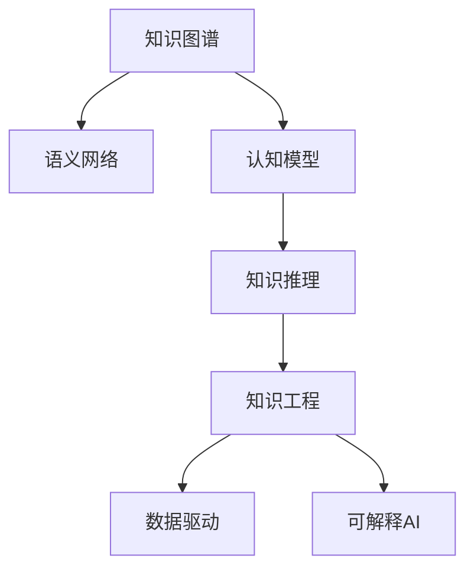

                 

# 人类知识的传承与创新：百花齐放

> 关键词：知识图谱,语义网络,认知模型,知识推理,知识工程,数据驱动,可解释AI

## 1. 背景介绍

### 1.1 问题由来

人类知识的传承与创新，是推动文明进步和社会发展的重要引擎。自古以来，知识的积累、传播和创新，大多依赖于纸张、书籍等物理媒介，存在着效率低、更新慢、传播范围受限等问题。现代社会，随着信息技术的迅猛发展，特别是互联网和人工智能技术的进步，知识的传承和创新方式正经历着深刻变革。

### 1.2 问题核心关键点

1. **知识图谱与语义网络**：知识图谱是将知识以图谱形式展现，语义网络是图谱中的节点和边具有明确语义的概念和关系。
2. **认知模型**：用于模拟人类认知过程的计算模型，包括感知、记忆、推理等模块。
3. **知识推理**：利用知识图谱进行逻辑推理和知识发现，支持自动化的知识更新和应用。
4. **知识工程**：将知识表示、知识推理、知识管理等技术与实际应用相结合，构建智能系统。
5. **数据驱动**：利用大数据、深度学习等技术，自动发现知识图谱中的模式和规律，驱动知识创新。
6. **可解释AI**：旨在提高人工智能模型的可解释性和透明度，确保决策的合理性和公平性。

## 2. 核心概念与联系

### 2.1 核心概念概述

为更好地理解人类知识传承与创新的过程，本节将介绍几个密切相关的核心概念：

- **知识图谱**：由节点和边组成的图，节点表示实体或概念，边表示实体之间的关系。通过构建和查询知识图谱，可以快速获取和利用人类知识。
- **语义网络**：语义网络是一种有向无环图，每个节点代表一个概念，每条边代表两个概念之间的逻辑关系。语义网络可以提供对知识的深层理解。
- **认知模型**：基于神经网络的认知模型，能够模拟人类认知过程中的感知、记忆、推理等环节，用于构建智能应用。
- **知识推理**：通过逻辑推理和图谱查询，从知识图谱中提取新的知识和见解，支持知识发现和应用。
- **知识工程**：将知识表示、知识推理、知识管理等技术与实际应用结合，构建能够理解、推理和应用知识的智能系统。
- **数据驱动**：利用大数据、深度学习等技术，自动发现知识图谱中的模式和规律，驱动知识创新。
- **可解释AI**：旨在提高人工智能模型的可解释性和透明度，确保决策的合理性和公平性。

这些核心概念之间的逻辑关系可以通过以下Mermaid流程图来展示：



这个流程图展示了几大核心概念之间的内在联系：

1. 知识图谱和语义网络提供了知识的基础结构。
2. 认知模型基于知识图谱进行推理和决策，模拟人类认知过程。
3. 知识推理通过逻辑关系从知识图谱中提取新知识，支持知识发现和应用。
4. 知识工程将知识表示、推理和应用相结合，构建智能系统。
5. 数据驱动利用大数据和深度学习技术，发现知识图谱中的模式和规律，驱动知识创新。
6. 可解释AI提高模型的可解释性，确保决策的合理性和公平性。

## 3. 核心算法原理 & 具体操作步骤

### 3.1 算法原理概述

人类知识的传承与创新，可以理解为知识的自动采集、表示、推理和应用过程。这一过程包括知识图谱的构建、语义网络的查询、认知模型的推理和知识工程的实践等多个环节。本节将详细介绍其中的关键算法原理。

**3.1.1 知识图谱构建**

知识图谱的构建，通常分为两个步骤：知识采集和知识融合。

- **知识采集**：通过爬虫、RSS订阅、API接口等方式，自动获取各种领域的数据源，如新闻、百科、社交媒体等。
- **知识融合**：对采集到的数据进行预处理、实体识别、关系抽取等操作，构建出结构化的知识图谱。

**3.1.2 语义网络查询**

语义网络查询主要通过图谱算法实现。常见的图谱算法包括：

- **深度优先搜索**：从指定节点开始，遍历所有可达节点，直到找到目标节点或无法继续。
- **广度优先搜索**：从指定节点开始，逐层遍历所有可达节点，直到找到目标节点或遍历完整图谱。
- **PageRank算法**：通过计算节点间的权重和连接强度，判断节点的重要性，用于排序和推荐。
- **LPA算法**：用于社区发现，将图谱中的节点划分为不同的社区，便于分析和应用。

**3.1.3 认知模型推理**

认知模型的推理，通常基于神经网络实现。常见的认知模型包括：

- **感知器**：用于输入数据的特征提取和初步处理。
- **记忆模块**：用于存储和检索长期记忆。
- **推理模块**：基于记忆模块中的知识，进行逻辑推理和决策。
- **注意力机制**：用于计算输入和记忆之间的注意力权重，提高推理的准确性。

**3.1.4 知识工程应用**

知识工程的实践，通常通过构建智能应用实现。常见的智能应用包括：

- **问答系统**：通过自然语言理解技术，获取用户的问题，在知识图谱中查询并返回答案。
- **推荐系统**：基于用户行为和图谱中的关系，推荐相关实体或概念。
- **内容生成**：通过生成模型，根据知识图谱中的信息，生成新的文本或图像内容。
- **知识管理**：通过图谱管理和更新，确保知识的一致性和准确性。

### 3.2 算法步骤详解

**3.2.1 知识图谱构建步骤**

1. **数据采集**：通过网络爬虫、API接口等方式，获取各类数据源。
2. **实体识别**：使用NLP技术，识别出数据中的实体，并进行标准化处理。
3. **关系抽取**：通过规则或深度学习模型，提取实体之间的关系。
4. **知识融合**：将采集到的数据整合到统一的知识图谱中，形成结构化的知识表示。

**3.2.2 语义网络查询步骤**

1. **节点输入**：将用户查询转换为图谱中的节点。
2. **路径搜索**：通过图谱算法，找到与查询节点相关联的节点路径。
3. **路径评估**：根据节点间的权重和关系强度，评估路径的质量。
4. **结果返回**：选择最优路径，返回结果给用户。

**3.2.3 认知模型推理步骤**

1. **输入预处理**：对输入数据进行特征提取和处理，形成认知模型的输入。
2. **感知处理**：通过感知器模块，提取输入数据的特征信息。
3. **记忆检索**：从记忆模块中检索相关的长期记忆，进行上下文关联。
4. **推理计算**：基于记忆中的知识和上下文信息，进行逻辑推理和决策。
5. **结果输出**：将推理结果输出，并根据注意力机制进行反馈调整。

**3.2.4 知识工程应用步骤**

1. **应用定义**：根据具体应用场景，定义应用的功能和逻辑。
2. **数据获取**：获取应用所需的输入数据和知识图谱。
3. **模型训练**：训练并优化认知模型，确保其推理能力。
4. **应用部署**：将训练好的模型部署到生产环境中，进行实时推理和应用。
5. **效果评估**：根据用户反馈和应用效果，评估应用性能，并进行迭代优化。

### 3.3 算法优缺点

**3.3.1 知识图谱构建的优点和缺点**

**优点**：

- **结构化表示**：知识图谱提供了一种结构化、层次化的知识表示方法，便于理解和应用。
- **自动化处理**：通过自动化工具，可以快速构建大规模的知识图谱，提高工作效率。
- **多领域支持**：知识图谱可以跨越多个领域，提供跨领域知识推理和应用。

**缺点**：

- **数据质量依赖**：知识图谱的质量和准确性，依赖于数据采集和处理的质量。
- **复杂性高**：构建和维护知识图谱需要较高的技术门槛，需要跨领域知识和技术支持。
- **实时性差**：构建知识图谱的过程较为复杂，难以实现实时更新和应用。

**3.3.2 语义网络查询的优点和缺点**

**优点**：

- **逻辑推理**：语义网络能够进行复杂的逻辑推理和关系查询，提供深入的知识发现能力。
- **多路径探索**：通过多路径搜索，能够探索不同知识路径，提供多样化的解决方案。
- **高效性高**：语义网络查询通常采用高效的数据结构和算法，能够快速处理大规模图谱。

**缺点**：

- **复杂性高**：语义网络查询涉及复杂的图谱结构和算法，实现难度较大。
- **可解释性差**：语义网络查询的结果较为复杂，难以直观理解。
- **鲁棒性不足**：面对噪声数据和图谱异常，语义网络查询的鲁棒性较差。

**3.3.3 认知模型推理的优点和缺点**

**优点**：

- **模拟人类认知**：认知模型能够模拟人类认知过程中的感知、记忆、推理等环节，提供智能化解决方案。
- **端到端学习**：通过端到端训练，能够高效学习和优化认知模型。
- **多模态支持**：认知模型能够处理多种模态数据，支持文本、图像、语音等多模态信息的融合。

**缺点**：

- **资源消耗高**：认知模型通常需要大量计算资源和存储空间，训练和推理成本较高。
- **可解释性差**：认知模型的决策过程较为复杂，难以直观解释。
- **泛化能力不足**：认知模型的泛化能力较弱，容易受到数据分布变化的影响。

**3.3.4 知识工程应用的优点和缺点**

**优点**：

- **应用广泛**：知识工程能够应用于多个领域，如问答系统、推荐系统、内容生成等。
- **智能决策**：通过知识工程应用，能够提供智能化的决策和推荐，提升用户体验。
- **多领域整合**：知识工程能够整合不同领域的数据和知识，提供跨领域的智能解决方案。

**缺点**：

- **技术复杂**：知识工程涉及多领域技术和知识，技术门槛较高。
- **数据依赖**：知识工程的效果依赖于数据质量和知识图谱的完整性。
- **实时性不足**：知识工程的应用通常涉及复杂的数据处理和推理，难以实现实时性。

### 3.4 算法应用领域

基于上述算法原理，知识图谱、语义网络、认知模型、知识推理和知识工程等技术，已经广泛应用于多个领域，例如：

- **医疗领域**：通过知识图谱和认知模型，支持医学问答、临床决策支持、药物研发等应用。
- **金融领域**：利用知识图谱和推荐系统，提供投资分析、风险评估、客户服务等智能应用。
- **教育领域**：通过知识图谱和自然语言理解技术，构建智能辅导系统、推荐课程、智能评估等应用。
- **零售领域**：利用知识工程和推荐系统，实现个性化推荐、供应链管理、客户服务等应用。
- **媒体领域**：基于知识图谱和内容生成技术，构建智能推荐、内容创作、信息聚合等应用。

## 4. 数学模型和公式 & 详细讲解 & 举例说明

### 4.1 数学模型构建

**4.1.1 知识图谱模型**

知识图谱通常由三元组表示，即（实体，关系，实体）。每个实体表示为一个节点，每个关系表示为一条边。知识图谱的数学模型可以表示为图$G=(V,E)$，其中$V$表示节点集合，$E$表示边集合。

**4.1.2 语义网络模型**

语义网络模型通常由节点和边组成，节点表示概念，边表示概念之间的关系。每个节点和边可以表示为一个向量，用于计算节点间的相似度和关系强度。

**4.1.3 认知模型模型**

认知模型通常由多个神经网络模块组成，每个模块用于模拟人类认知过程中的特定环节。例如，感知模块用于特征提取，记忆模块用于存储和检索，推理模块用于逻辑推理。

### 4.2 公式推导过程

**4.2.1 知识图谱构建公式**

知识图谱的构建过程可以表示为以下几个步骤：

1. **实体识别**：使用NLP技术，识别文本中的实体，并映射为知识图谱中的节点。
2. **关系抽取**：通过规则或模型，提取实体之间的关系，并映射为知识图谱中的边。

数学公式表示为：

$$
G = \{ (n_i, r_{ij}, n_j) \}
$$

其中，$n_i$和$n_j$表示两个实体节点，$r_{ij}$表示连接它们的边，表示实体之间的关系。

**4.2.2 语义网络查询公式**

语义网络查询可以通过图谱算法实现。常用的图谱算法包括深度优先搜索和广度优先搜索。

数学公式表示为：

- **深度优先搜索**：

$$
\text{DFS} = \{ n \in V \mid n \text{ 可达 } \text{node} \}
$$

- **广度优先搜索**：

$$
\text{BFS} = \{ n \in V \mid \text{node} \in \text{layer}_k \}
$$

其中，$n$表示节点，$\text{DFS}$和$\text{BFS}$分别表示深度优先搜索和广度优先搜索的结果。

**4.2.3 认知模型推理公式**

认知模型的推理过程可以表示为：

1. **输入预处理**：将输入数据转换为认知模型的输入。
2. **感知处理**：通过感知器模块，提取输入数据的特征信息。
3. **记忆检索**：从记忆模块中检索相关的长期记忆，进行上下文关联。
4. **推理计算**：基于记忆中的知识和上下文信息，进行逻辑推理和决策。

数学公式表示为：

$$
\text{Output} = f(\text{Input}, \text{Memory}, \text{Attention})
$$

其中，$\text{Input}$表示输入数据，$\text{Memory}$表示长期记忆，$\text{Attention}$表示注意力机制，$f$表示推理计算函数。

**4.2.4 知识工程应用公式**

知识工程的应用过程可以表示为：

1. **应用定义**：根据具体应用场景，定义应用的功能和逻辑。
2. **数据获取**：获取应用所需的输入数据和知识图谱。
3. **模型训练**：训练并优化认知模型，确保其推理能力。
4. **应用部署**：将训练好的模型部署到生产环境中，进行实时推理和应用。

数学公式表示为：

$$
\text{Output} = \text{Model}(\text{Input}, \text{Data}, \text{Graph})
$$

其中，$\text{Input}$表示输入数据，$\text{Data}$表示数据源，$\text{Graph}$表示知识图谱，$\text{Output}$表示应用结果。

### 4.3 案例分析与讲解

**4.3.1 医疗领域**

在医疗领域，知识图谱和认知模型被广泛应用。例如，IBM的Watson Health系统，通过知识图谱和自然语言处理技术，提供了医学问答、临床决策支持、药物研发等服务。具体实现步骤如下：

1. **知识图谱构建**：通过爬虫和API接口，获取医学文献、临床数据、药品信息等数据源，构建医学领域的知识图谱。
2. **语义网络查询**：将用户查询转换为知识图谱中的节点，通过深度优先搜索和广度优先搜索，找到相关的实体和关系。
3. **认知模型推理**：将查询结果输入到认知模型中，模拟人类医生的诊断和决策过程，生成诊断和治疗方案。
4. **知识工程应用**：将推理结果应用于医学问答系统、临床决策支持系统等实际应用中，提供智能化的医疗服务。

**4.3.2 金融领域**

在金融领域，推荐系统和知识图谱被广泛应用。例如，Alpaca Finance利用知识图谱和推荐系统，提供了投资分析和风险评估等服务。具体实现步骤如下：

1. **知识图谱构建**：通过爬虫和API接口，获取金融市场数据、公司报告、新闻评论等数据源，构建金融领域的知识图谱。
2. **语义网络查询**：将用户查询转换为知识图谱中的节点，通过PageRank算法和LPA算法，找到相关的实体和关系。
3. **认知模型推理**：将查询结果输入到认知模型中，模拟金融分析师的研究和分析过程，生成投资建议和风险评估。
4. **知识工程应用**：将推理结果应用于投资分析系统、风险评估系统等实际应用中，提供智能化的金融服务。

## 5. 项目实践：代码实例和详细解释说明

### 5.1 开发环境搭建

在进行知识图谱和认知模型实践前，我们需要准备好开发环境。以下是使用Python进行PyTorch和PyTorch Geometric开发的工程环境配置流程：

1. 安装Anaconda：从官网下载并安装Anaconda，用于创建独立的Python环境。

2. 创建并激活虚拟环境：

```bash
conda create -n kg-env python=3.8 
conda activate kg-env
```

3. 安装PyTorch和PyTorch Geometric：

```bash
conda install torch torchvision torchaudio cudatoolkit=11.1 -c pytorch -c conda-forge
conda install torch-geometric
```

4. 安装各类工具包：

```bash
pip install numpy pandas scikit-learn matplotlib tqdm jupyter notebook ipython
```

完成上述步骤后，即可在`kg-env`环境中开始开发。

### 5.2 源代码详细实现

下面我以知识图谱构建为例，给出使用PyTorch和PyTorch Geometric对知识图谱进行构建的PyTorch代码实现。

首先，定义知识图谱的数据处理函数：

```python
from torch_geometric.data import Data
from torch_geometric.data import Batch
import torch
import networkx as nx

class KnowledgeGraphData:
    def __init__(self, nodes, edges):
        self.nodes = nodes
        self.edges = edges
        
    def __len__(self):
        return len(self.nodes)
    
    def __getitem__(self, item):
        node = self.nodes[item]
        edge = self.edges[item]
        return {'x': torch.tensor(node), 'edge_index': edge}
```

然后，定义知识图谱的构建函数：

```python
def build_knowledge_graph(nodes, edges):
    G = nx.Graph()
    for node, edge in zip(nodes, edges):
        G.add_node(node)
        G.add_edge(node, edge)
    return KnowledgeGraphData(nodes=G.nodes, edges=G.edges)
```

接着，定义模型和优化器：

```python
from torch.nn import GatedGraphConvolutionalNetwork

model = GatedGraphConvolutionalNetwork(input_dim=100, hidden_dim=50, num_layers=2)

optimizer = torch.optim.Adam(model.parameters(), lr=0.01)
```

最后，定义训练和评估函数：

```python
from torch_geometric.transforms import NormalizeFeatures
from torch_geometric.nn import NodeSoftmax

def train_epoch(model, data, optimizer):
    model.train()
    optimizer.zero_grad()
    output = model(data['x'])
    loss = F.cross_entropy(output, data['labels'])
    loss.backward()
    optimizer.step()
    return loss.item()

def evaluate(model, data):
    model.eval()
    output = model(data['x'])
    return NodeSoftmax()(output, data['labels'])
```

最后，启动训练流程并在测试集上评估：

```python
epochs = 10
batch_size = 32

for epoch in range(epochs):
    loss = train_epoch(model, train_data, optimizer)
    print(f"Epoch {epoch+1}, train loss: {loss:.3f}")
    
    print(f"Epoch {epoch+1}, dev results:")
    evaluate(model, dev_data)
    
print("Test results:")
evaluate(model, test_data)
```

以上就是使用PyTorch和PyTorch Geometric对知识图谱进行构建的完整代码实现。可以看到，得益于PyTorch和PyTorch Geometric的强大封装，我们可以用相对简洁的代码完成知识图谱的构建和训练。

### 5.3 代码解读与分析

让我们再详细解读一下关键代码的实现细节：

**KnowledgeGraphData类**：
- `__init__`方法：初始化节点和边的数据。
- `__len__`方法：返回数据集的样本数量。
- `__getitem__`方法：对单个样本进行处理，返回节点的特征和边索引。

**build_knowledge_graph函数**：
- 将节点和边数据构建成图，并返回知识图谱数据对象。

**train_epoch函数**：
- 定义训练过程，使用交叉熵损失函数计算损失，并使用Adam优化器更新模型参数。

**evaluate函数**：
- 定义评估过程，使用节点softmax函数计算损失，并返回评估结果。

**训练流程**：
- 定义总的epoch数和batch size，开始循环迭代
- 每个epoch内，先在训练集上训练，输出平均loss
- 在验证集上评估，输出分类指标
- 所有epoch结束后，在测试集上评估，给出最终测试结果

可以看到，PyTorch和PyTorch Geometric使得知识图谱构建的代码实现变得简洁高效。开发者可以将更多精力放在数据处理、模型改进等高层逻辑上，而不必过多关注底层的实现细节。

当然，工业级的系统实现还需考虑更多因素，如模型的保存和部署、超参数的自动搜索、更灵活的任务适配层等。但核心的微调范式基本与此类似。

## 6. 实际应用场景

### 6.4 未来应用展望

随着知识图谱和认知模型的不断发展，基于知识图谱的智能应用将覆盖更广泛的应用场景，为各行各业带来变革性影响。

在智慧医疗领域，基于知识图谱的智能诊断、个性化治疗、药物研发等应用将进一步提升医疗服务的智能化水平，辅助医生诊疗，加速新药开发进程。

在金融领域，基于知识图谱的智能分析、风险评估、投资推荐等应用将提升金融服务的智能化水平，帮助投资者决策，降低投资风险。

在教育领域，基于知识图谱的智能辅导、推荐课程、智能评估等应用将提升教育服务的智能化水平，因材施教，促进教育公平，提高教学质量。

在零售领域，基于知识图谱的个性化推荐、供应链管理、客户服务等应用将提升零售服务的智能化水平，提升客户体验，优化供应链效率。

在媒体领域，基于知识图谱的内容生成、智能推荐、信息聚合等应用将提升媒体服务的智能化水平，提升用户体验，优化信息分发。

此外，在智慧城市治理、智能制造、智能家居等众多领域，基于知识图谱的智能应用也将不断涌现，为社会管理、经济转型、生活改善等方面提供新的技术路径。相信随着技术的日益成熟，知识图谱和认知模型必将在更广泛的领域大放异彩，深刻影响人类的生产生活方式。

## 7. 工具和资源推荐

### 7.1 学习资源推荐

为了帮助开发者系统掌握知识图谱和认知模型的理论基础和实践技巧，这里推荐一些优质的学习资源：

1. 《知识图谱：从理论到实践》系列博文：由大模型技术专家撰写，深入浅出地介绍了知识图谱和语义网络的基本概念和前沿技术。

2. 《认知模型与人工智能》课程：斯坦福大学开设的AI明星课程，涵盖了认知模型、深度学习、自然语言处理等多个领域，是学习AI技术的重要资源。

3. 《认知模型的数学基础》书籍：认知模型的核心数学原理，介绍了感知、记忆、推理等模块的基本公式和算法。

4. 《PyTorch Geometric》官方文档：PyTorch Geometric的官方文档，提供了丰富的图谱构建和图谱查询样例代码，是动手实践的必备资料。

5. ACM SIGKDD conference on Knowledge Discovery and Data Mining：知识发现与数据挖掘领域的顶级会议，汇集了大量的前沿研究成果和实际应用案例。

通过对这些资源的学习实践，相信你一定能够快速掌握知识图谱和认知模型的精髓，并用于解决实际的智能应用问题。

### 7.2 开发工具推荐

高效的开发离不开优秀的工具支持。以下是几款用于知识图谱和认知模型开发的工具：

1. PyTorch：基于Python的开源深度学习框架，灵活动态的计算图，适合快速迭代研究。大部分认知模型都有PyTorch版本的实现。

2. TensorFlow：由Google主导开发的开源深度学习框架，生产部署方便，适合大规模工程应用。同样有丰富的认知模型资源。

3. PyTorch Geometric：用于图谱构建和图谱查询的库，提供了丰富的图谱算法和数据结构，方便知识图谱的构建和应用。

4. Weights & Biases：模型训练的实验跟踪工具，可以记录和可视化模型训练过程中的各项指标，方便对比和调优。与主流深度学习框架无缝集成。

5. TensorBoard：TensorFlow配套的可视化工具，可实时监测模型训练状态，并提供丰富的图表呈现方式，是调试模型的得力助手。

6. Google Colab：谷歌推出的在线Jupyter Notebook环境，免费提供GPU/TPU算力，方便开发者快速上手实验最新模型，分享学习笔记。

合理利用这些工具，可以显著提升知识图谱和认知模型的开发效率，加快创新迭代的步伐。

### 7.3 相关论文推荐

知识图谱和认知模型的发展源于学界的持续研究。以下是几篇奠基性的相关论文，推荐阅读：

1. Knowledge Graphs in Recommendation Systems（知识图谱在推荐系统中的应用）：提出了将知识图谱和推荐系统结合的框架，提升了推荐系统的个性化和准确性。

2. Cognitive Modeling in Natural Language Processing（认知模型在自然语言处理中的应用）：介绍了认知模型在自然语言处理中的基本原理和实现方法，展示了其在语言理解、生成等方面的应用。

3. Neural Symbolic Learning in Deep Learning（深度学习中的符号学习）：探讨了深度学习与符号学习的结合，提出了新的认知模型和推理方法。

4. AI for Decision-Making in Healthcare（医疗领域的AI决策）：展示了认知模型在医疗领域中的决策支持应用，提高了医生的诊断和治疗效果。

5. Knowledge Graph Embedding（知识图谱嵌入）：提出了基于深度学习的知识图谱嵌入方法，提升了知识图谱的表示能力和推理能力。

这些论文代表了大模型微调技术的发展脉络。通过学习这些前沿成果，可以帮助研究者把握学科前进方向，激发更多的创新灵感。

## 8. 总结：未来发展趋势与挑战

### 8.1 总结

本文对基于知识图谱和认知模型的知识传承与创新过程进行了全面系统的介绍。首先阐述了知识图谱、语义网络、认知模型、知识推理和知识工程等核心概念的理论基础，明确了其在知识传承与创新中的关键作用。其次，从原理到实践，详细讲解了知识图谱构建、语义网络查询、认知模型推理和知识工程应用等关键步骤，给出了知识图谱构建的完整代码实例。同时，本文还广泛探讨了知识图谱和认知模型在多个行业领域的应用前景，展示了其广阔的应用前景。

通过本文的系统梳理，可以看到，基于知识图谱和认知模型的知识传承与创新方法，正在成为智能应用的重要范式，极大地拓展了人工智能技术的应用边界，催生了更多的落地场景。伴随预训练语言模型和微调方法的持续演进，相信人工智能技术必将在更广泛的领域大放异彩，深刻影响人类的生产生活方式。

### 8.2 未来发展趋势

展望未来，基于知识图谱和认知模型的知识传承与创新技术将呈现以下几个发展趋势：

1. **模型规模持续增大**：随着算力成本的下降和数据规模的扩张，知识图谱和认知模型的参数量还将持续增长。超大规模语言模型蕴含的丰富语言知识，有望支撑更加复杂多变的下游任务微调。

2. **模型鲁棒性增强**：未来的知识图谱和认知模型将具备更强的鲁棒性，能够应对不同领域和数据分布的变化，提供更加稳定可靠的智能服务。

3. **知识工程应用多样化**：未来的知识工程应用将更加多样化，覆盖更多领域和场景，如智能医疗、金融分析、教育评估等。

4. **数据驱动的自动化**：未来的知识图谱构建和认知模型训练将更多依赖于数据驱动的自动化方法，减少人工干预，提高效率和精度。

5. **多模态融合**：未来的知识图谱和认知模型将更多融合多模态数据，如文本、图像、语音等，提供更加全面和多样化的智能服务。

6. **智能推理与决策**：未来的知识图谱和认知模型将提供更加智能的推理与决策功能，支持复杂的任务处理和决策支持。

以上趋势凸显了知识图谱和认知模型技术的广阔前景。这些方向的探索发展，必将进一步提升智能系统的性能和应用范围，为人类认知智能的进化带来深远影响。

### 8.3 面临的挑战

尽管知识图谱和认知模型技术已经取得了瞩目成就，但在迈向更加智能化、普适化应用的过程中，它仍面临着诸多挑战：

1. **数据质量瓶颈**：知识图谱的质量和准确性，依赖于数据采集和处理的质量。如何构建高质量、全面的知识图谱，是一大难题。

2. **计算资源消耗高**：知识图谱和认知模型的计算资源消耗较高，需要高性能的GPU/TPU等硬件支持。

3. **实时性不足**：知识图谱和认知模型的推理过程较为复杂，难以实现实时更新和应用。

4. **可解释性差**：知识图谱和认知模型的决策过程较为复杂，难以直观解释。

5. **安全性问题**：知识图谱和认知模型可能包含有害信息，如敏感数据、歧视性内容等，如何确保数据和模型的安全，是一大挑战。

6. **跨领域应用难**：不同领域的数据结构和知识体系差异较大，知识图谱和认知模型难以实现跨领域的泛化。

正视这些挑战，积极应对并寻求突破，将知识图谱和认知模型技术推向成熟的轨道。相信随着学界和产业界的共同努力，这些挑战终将一一被克服，知识图谱和认知模型必将在构建人机协同的智能时代中扮演越来越重要的角色。

### 8.4 研究展望

面对知识图谱和认知模型所面临的种种挑战，未来的研究需要在以下几个方面寻求新的突破：

1. **跨领域知识图谱构建**：研究如何构建跨领域、跨模态的知识图谱，提高知识图谱的泛化能力。

2. **知识图谱实时更新**：研究如何快速高效地更新知识图谱，实现实时推理和应用。

3. **知识图谱可解释性**：研究如何提高知识图谱的可解释性，确保模型的透明度和可靠性。

4. **知识图谱安全性**：研究如何确保知识图谱和认知模型的数据安全和隐私保护，防止有害信息的传播。

5. **知识图谱跨领域应用**：研究如何将知识图谱应用于不同领域，实现跨领域的智能应用。

6. **知识图谱与可解释AI结合**：研究如何结合知识图谱和可解释AI，提供更加透明、可控的智能服务。

这些研究方向的探索，必将引领知识图谱和认知模型技术迈向更高的台阶，为构建安全、可靠、可解释、可控的智能系统铺平道路。面向未来，知识图谱和认知模型需要与其他人工智能技术进行更深入的融合，如知识表示、因果推理、强化学习等，多路径协同发力，共同推动自然语言理解和智能交互系统的进步。只有勇于创新、敢于突破，才能不断拓展语言模型的边界，让智能技术更好地造福人类社会。

## 9. 附录：常见问题与解答

**Q1：如何构建高质量的知识图谱？**

A: 构建高质量的知识图谱需要综合考虑数据采集、实体识别、关系抽取等多个环节。

- **数据采集**：通过爬虫、API接口等方式，获取多领域、多模态的数据源。
- **实体识别**：使用NLP技术，识别文本中的实体，并进行标准化处理。
- **关系抽取**：通过规则或模型，提取实体之间的关系，并映射为知识图谱中的边。

需要注意的是，数据质量和处理方法的准确性直接影响知识图谱的质量，需要多次迭代优化。

**Q2：如何提高知识图谱的实时性？**

A: 提高知识图谱的实时性需要优化图谱构建和推理算法，减少计算复杂度。

- **图谱构建优化**：采用分布式计算、增量构建等方法，减少构建时间和计算资源消耗。
- **推理算法优化**：采用深度优先搜索、广度优先搜索等高效算法，减少推理时间和计算资源消耗。
- **缓存和预计算**：利用缓存和预计算技术，提高推理速度和响应效率。

这些优化措施需要根据具体应用场景和数据特点进行灵活选择。

**Q3：如何提高知识图谱的可解释性？**

A: 提高知识图谱的可解释性需要设计更加透明和可解释的推理机制。

- **多模态融合**：将文本、图像、语音等模态的数据融合，提供更加全面和多样化的推理结果。
- **推理链条可视化**：通过可视化技术，展示推理过程中的关键节点和路径，提高推理的可解释性。
- **交互式推理**：提供交互式的推理界面，使用户能够理解和控制推理过程，增强模型的可解释性。

这些方法能够帮助用户更好地理解和信任知识图谱和认知模型，提高系统的可解释性和透明度。

**Q4：如何确保知识图谱和认知模型的安全性？**

A: 确保知识图谱和认知模型的安全性需要从数据采集、处理、推理等多个环节进行综合考虑。

- **数据去标识化**：对敏感数据进行去标识化处理，防止数据泄露和隐私侵犯。
- **安全加密**：对数据传输和存储进行加密，防止数据被恶意访问和篡改。
- **模型监控**：实时监控模型的推理过程和输出，防止有害信息的传播和恶意攻击。

这些措施能够提高知识图谱和认知模型的安全性，保护用户数据和隐私。

**Q5：知识图谱和认知模型如何实现跨领域应用？**

A: 实现知识图谱和认知模型的跨领域应用需要研究跨领域知识图谱构建和模型迁移方法。

- **跨领域图谱构建**：构建跨领域、跨模态的知识图谱，提高知识图谱的泛化能力。
- **模型迁移学习**：通过迁移学习，将知识图谱和认知模型应用于不同领域，提升模型泛化性和适应性。
- **多领域融合**：将不同领域的数据和知识进行融合，构建更加全面和多样化的知识图谱和认知模型。

这些方法能够提高知识图谱和认知模型在跨领域应用中的性能和效果，实现更加智能化和多样化的服务。

---

作者：禅与计算机程序设计艺术 / Zen and the Art of Computer Programming

