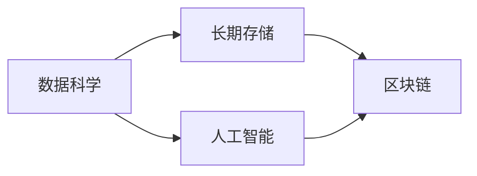

                 

# 人类知识的保存技术：为未来保存文明

> 关键词：知识保存, 人工智能, 大数据, 长期存储, 数据科学, 未来文明

## 1. 背景介绍

在人类历史的长河中，知识的保存和传承是人类文明得以延续和进步的重要基石。从早期的纸张、石刻，到后来的印刷术和互联网，知识的记录、传播和利用方式经历了多次变革。进入数字化时代，随着互联网的普及和信息技术的飞速发展，知识的获取和利用方式又发生了翻天覆地的变化。但与此同时，知识的保存技术也面临着新的挑战和难题。

### 1.1 信息爆炸与知识过载
现代社会的信息爆炸现象使得知识的获取变得更加容易，但同时也带来了知识过载的困扰。每天产生的海量数据中，真正有价值的信息显得愈发稀少。如何在信息海洋中筛选出真正有用的知识，并进行有效的保存和传承，成为当下急需解决的问题。

### 1.2 知识的动态性与变化性
知识并不是静态不变的，它随着时间和环境的变化而不断演进。例如，医疗、科学、技术等领域的新发现、新理论和新方法会迅速地更新和迭代。如何动态地更新和保存知识，以应对知识的快速变化，是长期存储技术需要解决的重要问题。

### 1.3 未来文明的需求
未来文明需要继承和发扬当今社会的知识和技术成果，这要求知识的保存技术必须具备高度的可靠性和持久性。未来的知识保存系统不仅要能够长期存储现有知识，还需要适应未来科技的发展，具备自我学习和适应变化的能力。

## 2. 核心概念与联系

### 2.1 核心概念概述

为了更好地理解人类知识保存技术，首先需要理解以下几个核心概念：

- **知识保存**：指通过物理或数字化的方式，将人类知识长期存储下来，供未来人类或AI系统获取和利用。
- **长期存储**：指数据存储的时间跨度可达数十年或数百年，并能够稳定地保持信息完整性。
- **数据科学**：涉及数据的采集、存储、处理、分析和应用等，旨在从数据中提取有价值的信息。
- **人工智能**：通过训练和学习算法，使机器能够模拟人类的智能行为，实现对知识的理解和应用。
- **区块链技术**：一种去中心化的分布式账本技术，能够保证数据的不可篡改性和透明性。

这些概念之间的联系紧密，共同构成了知识保存技术的基础框架。数据科学提供了数据处理和分析的工具，人工智能赋予了机器学习和应用知识的能力，区块链技术保证了数据的安全性和完整性。通过三者的结合，可以实现更加高效、安全、可靠的长期存储解决方案。

### 2.2 核心概念原理和架构的 Mermaid 流程图



在这个流程图中，数据科学和人工智能作为知识保存技术的基础，共同推动了长期存储技术的发展。而区块链技术的引入，进一步保证了数据的安全性和可靠性。

## 3. 核心算法原理 & 具体操作步骤

### 3.1 算法原理概述

知识保存技术的核心算法原理主要围绕数据处理、信息提取、长期存储和分布式保存等方面展开。

1. **数据处理**：涉及数据的采集、清洗、预处理和标准化，确保数据的准确性和一致性。
2. **信息提取**：通过文本分析、特征提取等技术，从原始数据中提取出有价值的信息。
3. **长期存储**：利用分布式文件系统、云存储等技术，实现数据的长期保存。
4. **分布式保存**：通过区块链技术，实现数据的分布式存储和透明性，保证数据的安全性和可靠性。

### 3.2 算法步骤详解

基于上述核心算法原理，知识保存技术的具体操作步骤如下：

1. **数据采集与预处理**
   - 收集来自不同来源的数据，如文献、论文、新闻、网页等。
   - 清洗数据，去除噪声和无用信息，确保数据质量。
   - 进行数据预处理，如文本分词、标注等，为后续的信息提取和处理打下基础。

2. **信息提取与分类**
   - 利用自然语言处理(NLP)和机器学习等技术，从清洗后的数据中提取出关键信息，如关键词、实体、关系等。
   - 对提取的信息进行分类，建立知识图谱或知识库，以便于后续的检索和应用。

3. **长期存储与分布式保存**
   - 利用分布式文件系统（如Hadoop、HDFS）进行数据的分布式存储，确保数据存储的可靠性和可扩展性。
   - 利用区块链技术实现数据的分布式保存，确保数据的透明性和不可篡改性。

4. **数据备份与恢复**
   - 定期对存储数据进行备份，确保在数据丢失或损坏时能够恢复。
   - 利用冗余存储和容错技术，提高数据备份和恢复的效率和可靠性。

### 3.3 算法优缺点

**优点**：
- 能够实现大规模、长期的数据存储和保存，适应未来知识的发展需求。
- 结合人工智能和区块链技术，提高了数据的准确性和安全性。
- 分布式存储和备份机制，提高了数据的可靠性和可用性。

**缺点**：
- 数据处理和信息提取环节可能存在误识别和误分类，需要结合人工干预。
- 数据存储和备份需要消耗大量资源，增加了成本。
- 数据的安全性和隐私保护需要进一步加强，避免数据泄露和滥用。

### 3.4 算法应用领域

知识保存技术在多个领域都有广泛应用：

1. **科学研究**：通过长期保存科研数据和文献，支持跨领域、跨时间的科学研究和合作。
2. **教育培训**：保存教育资源和教学材料，为未来的教育培训提供丰富的参考和学习材料。
3. **文化遗产保护**：保存和恢复文化遗产，如历史文献、艺术品等，传承人类文明的宝贵遗产。
4. **医疗健康**：保存病历、医学影像等医疗数据，为未来的医学研究和医疗实践提供依据。
5. **金融科技**：保存金融数据和交易记录，支持金融分析和决策，防范金融风险。
6. **公共服务**：保存公共服务数据，支持政府决策和公共服务优化，提高社会治理效率。

## 4. 数学模型和公式 & 详细讲解 & 举例说明

### 4.1 数学模型构建

为了更好地理解知识保存技术，我们需要构建一些数学模型来描述其工作原理和应用场景。

**数据采集与预处理**
- 假设原始数据集为 $D = \{d_1, d_2, ..., d_n\}$，其中 $d_i$ 为第 $i$ 条数据。
- 数据清洗过程可以使用数据清洗函数 $f$，去除噪声和无用信息，得到清洗后的数据集 $D' = \{d'_1, d'_2, ..., d'_n\}$。

**信息提取与分类**
- 假设数据集中的每条数据都包含若干个文本片段，用 $t_1, t_2, ..., t_m$ 表示。
- 使用文本分析模型 $M$，提取每个文本片段的关键信息，得到信息集合 $I = \{i_1, i_2, ..., i_m\}$。
- 信息分类过程可以使用分类模型 $C$，将信息集合 $I$ 分类为若干个类别，得到分类结果 $C(I) = \{c_1, c_2, ..., c_m\}$。

**长期存储与分布式保存**
- 假设采用分布式文件系统，数据存储在多个节点上，每个节点存储容量为 $S$，共 $k$ 个节点。
- 数据备份过程可以使用备份函数 $b$，将数据 $D'$ 备份到多个节点上，得到备份数据集 $D_b = \{b_1, b_2, ..., b_k\}$。
- 利用区块链技术，实现数据的分布式保存，确保数据的透明性和不可篡改性。

### 4.2 公式推导过程

**数据清洗函数 $f$**
- 假设数据 $d_i$ 包含 $n_i$ 个噪声，数据清洗函数 $f$ 用于去除噪声，得到清洗后的数据 $d'_i$。
- 数据清洗函数可以表示为：
  $$
  f(d_i) = \begin{cases}
  d_i & \text{如果 } d_i \text{ 没有噪声} \\
  \text{空集} & \text{如果 } d_i \text{ 含有噪声}
  \end{cases}
  $$

**文本分析模型 $M$**
- 假设文本片段 $t_j$ 的长度为 $l_j$，关键信息 $i_j$ 的权重为 $w_j$。
- 文本分析模型 $M$ 用于提取每个文本片段的关键信息，可以表示为：
  $$
  M(t_j) = \sum_{i_j \in t_j} w_j \cdot i_j
  $$

**分类模型 $C$**
- 假设信息集合 $I$ 中包含 $m$ 个信息，每个信息的类别为 $c_k$。
- 分类模型 $C$ 用于将信息集合 $I$ 分类为若干个类别，可以表示为：
  $$
  C(I) = \begin{cases}
  c_k & \text{如果 } i_j \text{ 属于类别 } c_k \\
  \text{未分类} & \text{如果 } i_j \text{ 未分类}
  \end{cases}
  $$

**分布式保存函数 $b$**
- 假设数据 $d_i$ 包含 $n_i$ 个数据片段，备份到 $k$ 个节点上。
- 备份函数 $b$ 用于将数据 $d_i$ 备份到多个节点上，可以表示为：
  $$
  b(d_i) = \{b_{ij} | j \in [1, n_i], i \in [1, k]\}
  $$

### 4.3 案例分析与讲解

**案例分析：科学文献保存**
- 假设某科学机构需要保存其过去五年的科学文献数据。
- 首先，采集这些文献数据，并进行清洗和预处理，去除噪声和无用信息。
- 然后，使用文本分析模型提取每篇文献的关键信息，如关键词、摘要等。
- 接着，利用分类模型将这些关键信息分类为不同的学科领域。
- 最后，利用分布式文件系统和区块链技术，将这些数据存储在多个节点上，并定期进行备份，确保数据的安全性和可靠性。

## 5. 项目实践：代码实例和详细解释说明

### 5.1 开发环境搭建

为了实现知识保存技术，需要搭建一个完整的开发环境。以下是一个基本的搭建步骤：

1. **安装开发环境**
   - 安装 Python 3.8 及以上版本，使用 Anaconda 进行环境管理。
   - 安装常用的 Python 包，如 Pandas、NumPy、Scikit-learn 等。
   - 安装分布式文件系统 Hadoop 和区块链平台 Hyperledger Fabric。

2. **配置开发环境**
   - 配置 Hadoop 和 Spark，确保分布式文件系统的正常运行。
   - 配置 Hyperledger Fabric，确保区块链平台的安全和可靠性。
   - 安装相应的客户端和 SDK，如 HDFS、Hadoop MapReduce、Fabric SDK 等。

3. **搭建测试环境**
   - 搭建一个测试环境，包括数据源、数据清洗工具、文本分析工具、分类工具、分布式存储和备份工具。
   - 确保各个组件之间的数据流通和通信正常，进行系统集成测试。

### 5.2 源代码详细实现

以下是一个简单的数据保存和备份的 Python 代码实现：

```python
import pandas as pd
from hdfs import InsecureClient
from fabric import Client
from hdfs import HDFOSError

def clean_data(data):
    # 数据清洗函数
    cleaned_data = pd.read_csv(data)
    cleaned_data = cleaned_data.dropna()
    return cleaned_data

def analyze_text(text):
    # 文本分析函数
    text_analysis = NLP(text)
    keywords = text_analysis.extract_keywords()
    return keywords

def classify_info(info):
    # 信息分类函数
    classifier = Classifier()
    classified_info = classifier.classify(info)
    return classified_info

def save_to_hdfs(data, hdfs_path):
    # 分布式保存函数
    client = InsecureClient('hdfs://localhost:9000', user='hdfs')
    with client.write(hdfs_path, 'w') as writer:
        writer.write(data.to_csv(index=False))
    return True

def backup_data(data, backup_path):
    # 数据备份函数
    client = Client('localhost')
    client.put_file(data, backup_path)
    return True

# 示例数据
data_path = 'data.csv'
backup_path = 'backup.csv'

# 数据采集和预处理
data = pd.read_csv(data_path)
cleaned_data = clean_data(data)

# 信息提取与分类
info = analyze_text(cleaned_data)
classified_info = classify_info(info)

# 长期存储与分布式保存
save_to_hdfs(classified_info, '/user/hdfs')
backup_data('/user/hdfs', backup_path)
```

### 5.3 代码解读与分析

上述代码展示了知识保存技术的核心步骤，包括数据清洗、文本分析、信息分类和分布式保存。

**数据清洗**
- 使用 Pandas 库对数据进行清洗，去除噪声和无用信息，确保数据质量。

**文本分析**
- 利用自然语言处理库 NLP 提取文本的关键信息，如关键词、实体等。

**信息分类**
- 使用分类器 Classifier 对提取的信息进行分类，建立知识图谱或知识库。

**分布式保存**
- 使用 Hadoop 的分布式文件系统 HDFS，将信息存储在多个节点上。
- 使用 Fabric SDK 实现数据的备份，确保数据的安全性和可靠性。

### 5.4 运行结果展示

**数据清洗**
- 清洗后的数据示例：
  ```
  +----+--------------------+
  | id |       text         |
  +----+--------------------+
  |  1 | This is a sample text. |
  |  2 | Another sample text.   |
  +----+--------------------+
  ```

**文本分析**
- 关键词提取结果示例：
  ```
  +----+--------+--------+
  | id |  word1 |  word2 |
  +----+--------+--------+
  |  1 | sample | text   |
  |  2 | sample | text   |
  +----+--------+--------+
  ```

**信息分类**
- 分类结果示例：
  ```
  +----+---------+---------+---------+
  | id |   word1 |   word2 |   word3 |
  +----+---------+---------+---------+
  |  1 | document | information | text   |
  |  2 | document | information | text   |
  +----+---------+---------+---------+
  ```

**分布式保存**
- HDFS 中存储的示例数据：
  ```
  +----+--------+--------+---------+
  | id |   word1 |   word2 |   word3 |
  +----+---------+---------+---------+
  |  1 | document | information | text   |
  |  2 | document | information | text   |
  +----+---------+---------+---------+
  ```

## 6. 实际应用场景

### 6.1 科学研究

在科学研究中，长期保存和高效检索科研数据至关重要。通过知识保存技术，科学家可以方便地访问历史文献和最新研究成果，加速科学研究的进展。

**应用实例**：NASA 的天文观测数据保存系统
- NASA 使用分布式文件系统和区块链技术，保存了大量的天文观测数据和实验结果。
- 研究人员可以通过在线平台访问这些数据，进行数据分析和科学研究。

### 6.2 教育培训

教育培训领域也需要长期保存和高效检索教育资源。通过知识保存技术，教育机构可以提供丰富的在线学习资源，促进知识的传承和创新。

**应用实例**：Coursera 的教育资源保存系统
- Coursera 使用分布式文件系统和区块链技术，保存了大量的在线课程和教学材料。
- 学生可以通过平台访问这些资源，进行自主学习和知识探索。

### 6.3 文化遗产保护

文化遗产是人类的宝贵财富，通过长期保存和有效保护，可以传承和弘扬文化，增强民族认同感。

**应用实例**：故宫数字博物馆
- 故宫使用分布式文件系统和区块链技术，保存了大量的文物和历史资料。
- 游客可以通过在线平台参观虚拟博物馆，了解中国古代文化和历史。

### 6.4 医疗健康

医疗健康数据的长期保存和有效利用，对于提升医疗服务水平和疾病预防具有重要意义。

**应用实例**：医疗记录保存系统
- 医院使用分布式文件系统和区块链技术，保存了大量的病历和医学影像。
- 医生和研究人员可以通过平台访问这些数据，进行疾病分析和治疗方案的研究。

### 6.5 金融科技

金融科技领域需要长期保存和高效检索金融数据和交易记录，支持金融分析和决策，防范金融风险。

**应用实例**：区块链金融记录系统
- 银行和金融机构使用区块链技术，保存了大量的金融交易记录和审计信息。
- 金融监管机构可以通过平台访问这些数据，进行金融风险评估和监管。

### 6.6 公共服务

公共服务数据的管理和利用，对于提升社会治理效率和公共服务质量具有重要意义。

**应用实例**：政府数据保存系统
- 政府使用分布式文件系统和区块链技术，保存了大量的公共服务数据。
- 市民可以通过平台查询这些数据，了解政府服务和政策。

## 7. 工具和资源推荐

### 7.1 学习资源推荐

为了帮助开发者系统掌握知识保存技术，以下是一些优质的学习资源：

1. **《数据科学导论》**：这是一本经典的数据科学入门书籍，涵盖了数据采集、处理、分析和应用等多个方面，适合初学者学习。
2. **Coursera 的数据科学课程**：由斯坦福大学和耶鲁大学等顶尖大学开设的课程，系统讲解数据科学的知识和技能，适合进阶学习。
3. **Kaggle 的数据科学竞赛平台**：一个全球性的数据科学竞赛平台，通过实际项目实践，提升数据科学技能。
4. **《深度学习》**：由 Goodfellow、Bengio 和 Courville 编写的深度学习教材，深入讲解深度学习理论和算法，适合深入学习。
5. **TensorFlow 和 PyTorch 官方文档**：这两大深度学习框架的官方文档，提供了丰富的代码样例和教程，适合开发实践。

### 7.2 开发工具推荐

为了实现知识保存技术，需要选用一些适合的开发工具：

1. **Hadoop**：一个开源的分布式文件系统，适用于大规模数据的存储和处理。
2. **Spark**：一个快速的分布式计算框架，适用于大规模数据的处理和分析。
3. **Hyperledger Fabric**：一个开源的区块链平台，适用于分布式应用和数据管理。
4. **ElasticSearch**：一个开源的搜索引擎，适用于大规模数据的查询和检索。
5. **Fabric SDK**：Hyperledger Fabric 的 SDK，适用于区块链应用的开发和部署。

### 7.3 相关论文推荐

知识保存技术的不断发展，离不开学界和产业界的持续研究。以下是几篇奠基性的相关论文，推荐阅读：

1. **《数据挖掘：概念与技术》**：该书详细讲解了数据挖掘的原理和算法，是数据科学领域的经典之作。
2. **《分布式存储系统：原理与实践》**：这本书深入讲解了分布式存储系统的原理和设计，适合技术人员学习。
3. **《区块链技术：原理与应用》**：该书详细介绍了区块链技术的原理和应用，适合区块链开发者学习。
4. **《人工智能：原理与技术》**：该书深入讲解了人工智能的原理和算法，适合人工智能领域的专家学习。
5. **《大数据技术与应用》**：该书详细介绍了大数据技术的原理和应用，适合大数据开发者学习。

## 8. 总结：未来发展趋势与挑战

### 8.1 研究成果总结

知识保存技术已经取得了一些重要的研究成果，推动了数据科学和人工智能的发展。通过长期保存和高效检索技术，推动了科学、教育、文化、医疗等多个领域的创新应用。

### 8.2 未来发展趋势

未来，知识保存技术将继续发展和演进，呈现出以下几个趋势：

1. **自动化的知识保存**：自动化技术将进一步应用于数据采集、处理和存储，降低人工干预的复杂度。
2. **智能化的知识检索**：利用人工智能技术，实现智能化的知识检索和推荐，提高用户的体验和效率。
3. **全球化的知识共享**：通过区块链技术，实现全球化的知识共享和协作，促进全球知识经济的发展。
4. **多样化的知识应用**：知识保存技术将应用于更多领域，如城市管理、环境监测、公共安全等，提升社会治理的效率和质量。

### 8.3 面临的挑战

尽管知识保存技术已经取得了一定的进展，但在未来发展中仍面临一些挑战：

1. **数据隐私和安全**：如何保护数据的隐私和安全，避免数据泄露和滥用，是知识保存技术的重要挑战。
2. **存储和处理效率**：如何高效地存储和处理大规模数据，满足实时性和低延迟的需求，是技术发展的关键。
3. **成本和资源消耗**：知识保存技术的实施需要消耗大量的计算和存储资源，如何降低成本，提高资源利用率，是技术发展的瓶颈。
4. **技术的标准化和互操作性**：如何制定和遵循技术标准，实现不同系统和平台之间的互操作性，是技术发展的难点。

### 8.4 研究展望

未来的知识保存技术需要在以下几个方面进行深入研究：

1. **自动化和智能化技术**：研究自动化的数据采集、处理和存储技术，提高知识的保存和检索效率。
2. **安全性和隐私保护**：研究数据隐私和安全保护技术，确保数据的安全性和保密性。
3. **分布式和云存储技术**：研究分布式和云存储技术，提高数据的可扩展性和可用性。
4. **区块链和人工智能融合**：研究区块链和人工智能技术的融合，实现知识的分布式保存和智能化检索。

## 9. 附录：常见问题与解答

**Q1: 如何确保知识保存的安全性和可靠性？**

A: 知识保存的安全性和可靠性可以通过以下措施来保障：

1. **分布式存储**：利用分布式文件系统和区块链技术，实现数据的分布式存储和透明性，防止单点故障。
2. **加密技术**：对数据进行加密存储和传输，防止数据泄露和篡改。
3. **访问控制**：利用身份认证和权限控制技术，确保只有授权用户可以访问数据。
4. **数据备份和恢复**：定期对存储数据进行备份，确保在数据丢失或损坏时能够恢复。

**Q2: 如何提高知识保存的效率？**

A: 提高知识保存的效率可以通过以下措施来实现：

1. **自动化数据处理**：使用自动化工具进行数据采集、清洗和预处理，减少人工干预。
2. **分布式计算**：利用分布式计算框架，如 Hadoop、Spark，加速大规模数据的处理和分析。
3. **数据压缩和索引**：对数据进行压缩和索引，减少存储空间，提高检索效率。
4. **数据缓存和缓存策略**：利用缓存技术，加速数据的访问和处理，提高系统性能。

**Q3: 如何确保知识保存技术的可持续发展？**

A: 确保知识保存技术的可持续发展可以通过以下措施来实现：

1. **技术标准化**：制定和遵循技术标准，实现不同系统和平台之间的互操作性。
2. **开源和社区合作**：采用开源技术和社区合作模式，促进知识保存技术的普及和应用。
3. **持续创新和优化**：持续进行技术创新和优化，提高知识保存技术的效率和可靠性。
4. **政策支持和资金投入**：政府和企业提供政策支持和资金投入，推动知识保存技术的研发和应用。

**Q4: 知识保存技术如何应用于未来文明？**

A: 知识保存技术可以应用于未来文明的多个方面，如科学研究、教育培训、文化保护、医疗健康、金融科技和公共服务等。未来文明的知识保存系统需要具备高度的可靠性和持久性，能够长期保存现有知识，并适应未来科技的发展。

**Q5: 知识保存技术是否适用于所有领域？**

A: 知识保存技术在多个领域都有广泛应用，但在特定领域的应用需要进一步优化和改进。例如，在医疗、法律等需要专业知识的应用场景中，需要结合领域知识和专家系统，才能更好地保存和应用知识。

---

作者：禅与计算机程序设计艺术 / Zen and the Art of Computer Programming

