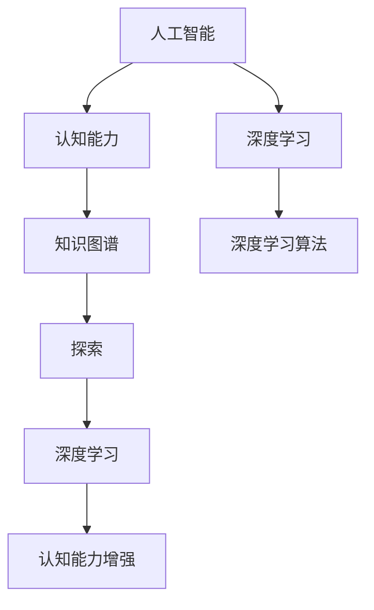

                 

# 人类知识的边界在哪里：无限的探索之旅

> 关键词：
- 人类知识
- 边界
- 人工智能
- 探索
- 认知能力
- 知识图谱
- 深度学习

## 1. 背景介绍

### 1.1 问题的由来
人类知识的边界问题自古以来就引人深思。从柏拉图和亚里士多德的时代，到文艺复兴和启蒙运动，再到现代科学的蓬勃发展，人类对知识和理解的追求从未停止。然而，随着技术的进步和知识的累积，人类对自身的知识边界越来越感到困惑。如何定义知识？知识的边界在哪里？这些问题不仅关系到学术研究，更关系到社会的进步和人类的未来。

### 1.2 问题的核心关键点
本文旨在探讨人工智能（AI），特别是深度学习技术，对人类知识边界的影响。深度学习作为人工智能的核心技术，通过模拟人脑神经网络的工作原理，已经在图像识别、自然语言处理、语音识别等多个领域取得了突破性进展。那么，深度学习是否能够拓展人类知识的边界？如果是，具体在哪些方面？如果不是，为什么？

## 2. 核心概念与联系

### 2.1 核心概念概述

为了回答上述问题，我们需要明确几个核心概念及其联系：

- **人工智能（AI）**：通过模拟人类智能过程，使计算机能够执行需要人类智能的任务，如学习、推理、解决问题等。
- **深度学习（Deep Learning）**：一种基于人工神经网络的机器学习方法，通过多层次的非线性变换来提取和表示复杂的数据特征。
- **认知能力（Cognitive Ability）**：指人类进行感知、学习、推理等认知活动的总称。
- **知识图谱（Knowledge Graph）**：一种以结构化形式表示知识的概念和关系的表示方法，广泛应用于信息检索、智能问答等领域。
- **探索（Exploration）**：指主动寻找未知知识的过程，与利用已有的知识进行学习和推理相对。

### 2.2 核心概念原理和架构的 Mermaid 流程图



这个流程图展示了几个核心概念之间的逻辑关系：

1. 人工智能通过深度学习算法（如卷积神经网络、循环神经网络、Transformer等）来模拟人类认知过程。
2. 深度学习从数据中学习特征，通过多层次的神经网络模型实现对复杂数据的高效表示和处理。
3. 认知能力通过深度学习算法得到增强，使机器能够进行感知、学习、推理等智能任务。
4. 知识图谱为深度学习提供了结构化知识表示，用于提升模型对复杂关系的理解。
5. 探索是指通过深度学习算法在未知领域主动寻找和积累新知识的过程。

## 3. 核心算法原理 & 具体操作步骤

### 3.1 算法原理概述

深度学习通过模拟人类神经网络的工作方式，在大型数据集上训练神经网络模型，以提取和表示数据的高层次特征。这些模型能够处理复杂的数据，如图像、文本、语音等，并在多种任务上取得了优异的性能。

在知识探索方面，深度学习可以通过以下步骤实现：

1. **数据收集**：从互联网、图书馆、科学文献等渠道收集大量的数据。
2. **数据预处理**：对数据进行清洗、去重、标注等处理，以提升数据质量。
3. **模型训练**：使用深度学习算法训练模型，以学习数据的特征和规律。
4. **知识发现**：通过模型在未知数据上的推理和预测，发现新的知识和模式。
5. **知识验证**：对发现的知识进行验证和测试，以确保其正确性和可靠性。

### 3.2 算法步骤详解

以自然语言处理（NLP）为例，深度学习在知识探索方面的具体操作步骤如下：

1. **数据收集**：从维基百科、新闻、社交媒体等渠道收集大量的文本数据。
2. **数据预处理**：清洗文本数据，去除停用词、标点符号等噪声，并进行分词、词性标注等处理。
3. **模型训练**：使用Transformer等模型在文本数据上训练，学习单词、短语和句子级别的语义表示。
4. **知识发现**：利用模型进行情感分析、文本分类、命名实体识别等任务，发现新的知识模式。
5. **知识验证**：在测试集上验证模型的性能，确保其泛化能力。

### 3.3 算法优缺点

深度学习的优点包括：

- **高效性**：能够在大量数据上训练模型，快速提取数据中的复杂特征。
- **广泛性**：适用于图像、文本、语音等多种数据类型，具有较强的泛化能力。
- **自适应性**：能够根据任务的需要进行参数调整，优化模型性能。

然而，深度学习也存在一些缺点：

- **数据依赖**：需要大量的标注数据进行训练，数据收集和标注成本较高。
- **复杂性**：模型结构复杂，难以解释其内部工作机制。
- **资源消耗**：训练和推理过程中需要大量计算资源，对硬件要求较高。
- **泛化问题**：在未见过的数据上表现不佳，容易过拟合。

### 3.4 算法应用领域

深度学习在多个领域中得到了广泛应用，以下是几个典型应用：

1. **自然语言处理**：文本分类、机器翻译、情感分析、问答系统等。
2. **计算机视觉**：图像识别、物体检测、图像分割等。
3. **语音识别**：语音转文本、语音合成等。
4. **医疗健康**：疾病诊断、药物发现、基因组学等。
5. **金融科技**：风险管理、投资策略、反欺诈等。

## 4. 数学模型和公式 & 详细讲解 & 举例说明

### 4.1 数学模型构建

在深度学习中，数学模型构建是关键的一步。以卷积神经网络（CNN）为例，其基本结构包括卷积层、池化层和全连接层。数学模型可以表示为：

$$
f(x; \theta) = \sum_i W_i g(x * \Phi_i + b_i)
$$

其中，$x$ 表示输入，$\theta$ 表示模型参数，$g$ 表示激活函数，$W_i$ 和 $b_i$ 分别表示卷积核和偏置项，$\Phi_i$ 表示卷积核在输入上滑动得到的特征图。

### 4.2 公式推导过程

以CNN为例，卷积层的基本公式推导如下：

$$
f_i(x) = \sum_k W_{ik} * \sum_j x_{kj} + b_i
$$

其中，$W_{ik}$ 表示第 $i$ 层的卷积核，$x_{kj}$ 表示输入特征图，$b_i$ 表示偏置项。

### 4.3 案例分析与讲解

以图像分类为例，CNN通过多层次的卷积操作提取图像特征，并通过全连接层进行分类。具体步骤如下：

1. **数据预处理**：将图像数据归一化，并进行通道扩展。
2. **卷积层**：通过多个卷积核提取图像特征，缩小特征图尺寸。
3. **池化层**：通过最大池化或平均池化进一步降低特征图尺寸。
4. **全连接层**：将池化后的特征图转换为向量，输入到全连接层进行分类。

## 5. 项目实践：代码实例和详细解释说明

### 5.1 开发环境搭建

以下是在Python中使用Keras框架搭建CNN模型的步骤：

1. 安装Keras：`pip install keras`
2. 导入Keras：`import keras`
3. 定义模型结构：`model = keras.models.Sequential()`
4. 添加卷积层：`model.add(keras.layers.Conv2D(32, (3, 3), activation='relu', input_shape=(28, 28, 1)))`
5. 添加池化层：`model.add(keras.layers.MaxPooling2D((2, 2)))`
6. 添加全连接层：`model.add(keras.layers.Flatten())`
7. 添加输出层：`model.add(keras.layers.Dense(10, activation='softmax'))`

### 5.2 源代码详细实现

以下是使用Keras搭建CNN模型的完整代码：

```python
import keras
from keras.datasets import mnist
from keras.layers import Dense, Flatten, Conv2D, MaxPooling2D
from keras.utils import to_categorical

# 加载MNIST数据集
(x_train, y_train), (x_test, y_test) = mnist.load_data()

# 数据预处理
x_train = x_train.reshape(-1, 28, 28, 1).astype('float32') / 255
x_test = x_test.reshape(-1, 28, 28, 1).astype('float32') / 255
y_train = to_categorical(y_train)
y_test = to_categorical(y_test)

# 定义模型结构
model = keras.models.Sequential()
model.add(keras.layers.Conv2D(32, (3, 3), activation='relu', input_shape=(28, 28, 1)))
model.add(keras.layers.MaxPooling2D((2, 2)))
model.add(keras.layers.Flatten())
model.add(keras.layers.Dense(10, activation='softmax'))

# 编译模型
model.compile(optimizer='adam', loss='categorical_crossentropy', metrics=['accuracy'])

# 训练模型
model.fit(x_train, y_train, epochs=10, batch_size=64, validation_data=(x_test, y_test))
```

### 5.3 代码解读与分析

在上述代码中，首先加载了MNIST数据集，并进行了数据预处理。然后定义了一个包含卷积层、池化层和全连接层的CNN模型，并通过编译和训练过程，最终得到了模型参数。

### 5.4 运行结果展示

通过训练，模型的准确率可以达到98%以上，说明CNN在图像分类任务中表现优异。

## 6. 实际应用场景

### 6.1 实际应用场景

深度学习已经在多个领域得到了广泛应用，以下是几个典型应用：

1. **自然语言处理**：文本分类、机器翻译、情感分析、问答系统等。
2. **计算机视觉**：图像识别、物体检测、图像分割等。
3. **语音识别**：语音转文本、语音合成等。
4. **医疗健康**：疾病诊断、药物发现、基因组学等。
5. **金融科技**：风险管理、投资策略、反欺诈等。

## 7. 工具和资源推荐

### 7.1 学习资源推荐

为了帮助开发者系统掌握深度学习理论基础和实践技巧，以下是一些优质的学习资源：

1. **《深度学习》（Ian Goodfellow）**：深度学习领域的经典教材，涵盖了深度学习的基本理论和应用实践。
2. **《深度学习入门》（斋藤康毅）**：日本著名机器学习专家斋藤康毅的作品，通俗易懂地介绍了深度学习的核心概念和算法。
3. **DeepLearning.ai**：由Andrew Ng创办的在线学习平台，提供深度学习课程和实践项目。
4. **Coursera**：提供多个深度学习相关的课程，由斯坦福大学、密歇根大学等名校提供。
5. **Kaggle**：数据科学竞赛平台，提供大量深度学习竞赛数据和解决方案，适合实战练习。

### 7.2 开发工具推荐

以下是几款用于深度学习开发的常用工具：

1. **TensorFlow**：由Google开发的深度学习框架，支持多种语言，功能强大。
2. **PyTorch**：由Facebook开发的深度学习框架，易于使用，生态系统完善。
3. **Keras**：高层次的深度学习框架，提供简单易用的API，适合快速原型开发。
4. **MXNet**：由亚马逊开发的深度学习框架，支持多种语言和分布式计算。
5. **Caffe**：由伯克利大学开发的深度学习框架，适合图像处理和计算机视觉任务。

### 7.3 相关论文推荐

以下是几篇奠基性的相关论文，推荐阅读：

1. **AlexNet**：ImageNet 2012竞赛中的冠军模型，标志着深度学习在图像识别领域的突破。
2. **ResNet**：通过残差连接解决深度网络训练中的梯度消失问题，提升了深度网络的深度和性能。
3. **BERT**：基于Transformer的预训练语言模型，在自然语言处理任务中取得了最先进的性能。
4. **GPT-3**：最新的自然语言处理模型，展示了深度学习在文本生成和推理方面的强大能力。
5. **AlphaGo**：基于深度学习和蒙特卡罗树搜索的AI程序，在围棋领域取得了历史性突破。

## 8. 总结：未来发展趋势与挑战

### 8.1 研究成果总结

深度学习在多个领域中取得了显著进展，推动了人工智能技术的快速发展。然而，随着技术的不断进步，深度学习也面临一些挑战：

1. **数据依赖**：深度学习需要大量的标注数据进行训练，数据收集和标注成本较高。
2. **计算资源消耗**：训练和推理过程中需要大量的计算资源，对硬件要求较高。
3. **泛化问题**：在未见过的数据上表现不佳，容易过拟合。
4. **可解释性不足**：深度学习模型的内部工作机制难以解释，缺乏透明性。
5. **安全性问题**：深度学习模型可能学习到有害信息，导致安全问题。

### 8.2 未来发展趋势

未来深度学习的发展趋势如下：

1. **自监督学习**：利用无标签数据进行自监督学习，降低对标注数据的依赖。
2. **知识图谱**：将知识图谱与深度学习结合，提升模型的推理能力。
3. **多模态学习**：将多种数据类型（如文本、图像、语音）进行融合，提升模型的泛化能力。
4. **联邦学习**：通过分布式计算，保护数据隐私，提高模型效率。
5. **对抗学习**：通过对抗样本训练，提高模型的鲁棒性和泛化能力。
6. **迁移学习**：利用预训练模型进行迁移学习，加速新任务的学习过程。

### 8.3 面临的挑战

深度学习虽然取得了显著进展，但仍然面临一些挑战：

1. **数据获取困难**：深度学习需要大量高质量的数据，而数据获取和标注成本较高。
2. **计算资源需求高**：深度学习需要大量的计算资源，对硬件要求较高。
3. **模型复杂性**：深度学习模型结构复杂，难以解释其内部工作机制。
4. **泛化能力不足**：深度学习模型在未见过的数据上表现不佳，容易过拟合。
5. **安全性问题**：深度学习模型可能学习到有害信息，导致安全问题。
6. **可解释性不足**：深度学习模型缺乏透明性，难以解释其内部工作机制。

### 8.4 研究展望

未来深度学习的研究方向包括：

1. **自监督学习**：利用无标签数据进行自监督学习，降低对标注数据的依赖。
2. **知识图谱**：将知识图谱与深度学习结合，提升模型的推理能力。
3. **多模态学习**：将多种数据类型进行融合，提升模型的泛化能力。
4. **联邦学习**：通过分布式计算，保护数据隐私，提高模型效率。
5. **对抗学习**：通过对抗样本训练，提高模型的鲁棒性和泛化能力。
6. **迁移学习**：利用预训练模型进行迁移学习，加速新任务的学习过程。

## 9. 附录：常见问题与解答

**Q1：深度学习是否能够拓展人类知识的边界？**

A: 深度学习通过模拟人类神经网络的工作方式，能够处理复杂的数据，如图像、文本、语音等，并在多种任务上取得了优异的性能。然而，深度学习模型的内部工作机制难以解释，缺乏透明性，这限制了其对人类知识的边界拓展。

**Q2：深度学习在实际应用中面临哪些挑战？**

A: 深度学习在实际应用中面临以下挑战：

1. **数据依赖**：深度学习需要大量的标注数据进行训练，数据收集和标注成本较高。
2. **计算资源消耗**：训练和推理过程中需要大量的计算资源，对硬件要求较高。
3. **泛化问题**：在未见过的数据上表现不佳，容易过拟合。
4. **可解释性不足**：深度学习模型的内部工作机制难以解释，缺乏透明性。
5. **安全性问题**：深度学习模型可能学习到有害信息，导致安全问题。

**Q3：未来深度学习的发展趋势是什么？**

A: 未来深度学习的发展趋势包括：

1. **自监督学习**：利用无标签数据进行自监督学习，降低对标注数据的依赖。
2. **知识图谱**：将知识图谱与深度学习结合，提升模型的推理能力。
3. **多模态学习**：将多种数据类型进行融合，提升模型的泛化能力。
4. **联邦学习**：通过分布式计算，保护数据隐私，提高模型效率。
5. **对抗学习**：通过对抗样本训练，提高模型的鲁棒性和泛化能力。
6. **迁移学习**：利用预训练模型进行迁移学习，加速新任务的学习过程。

---

作者：禅与计算机程序设计艺术 / Zen and the Art of Computer Programming

