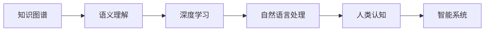

                 

# 人类知识的边界：无限探索的征程

> 关键词：知识图谱, 语义理解, 深度学习, 自然语言处理, 人类认知, 智能系统

## 1. 背景介绍

在人类文明发展的历史长河中，知识一直是推动社会进步和人类认知拓展的重要驱动力。从原始社会的口耳相传到现代科技的飞速发展，知识的积累和传播方式不断演进，但人类对知识边界的探索从未停歇。随着信息时代的到来，大数据、人工智能等前沿技术的涌现，知识边界的拓展进入了一个新纪元。

### 1.1 知识图谱的发展

知识图谱(Knowledge Graph)是近年来人工智能领域的一个热门概念。它是一种结构化的语义数据表示方式，旨在通过图结构的形式，将实体、关系和属性进行组织和关联，从而形成对世界知识的全局性理解。知识图谱通过实体之间的链接，揭示了知识之间的内在联系，为自然语言处理、推荐系统、问答系统等领域提供了强大的知识支撑。

### 1.2 语义理解的挑战

传统的自然语言处理(Natural Language Processing, NLP)方法，往往依赖于词袋模型(Bag of Words, BoW)或词向量模型(Word Embedding)，缺乏对语义关系的深度理解。随着深度学习技术的兴起，语义理解逐渐成为NLP研究的热点。语义理解不仅涉及词汇和句子层面的知识，还包括对实体间关系和上下文语境的理解。

## 2. 核心概念与联系

### 2.1 核心概念概述

为了更好地理解人类知识的边界及其无限探索的征程，我们需要首先明确一些关键的概念和术语：

- **知识图谱**：将实体、关系和属性进行结构化组织的数据表示方式。
- **语义理解**：理解语言中的词汇、句子以及实体间关系的深层语义含义。
- **深度学习**：通过多层神经网络对数据进行深层特征提取和处理的技术。
- **自然语言处理**：使计算机能够理解、处理和生成人类语言的技术。
- **人类认知**：研究人类大脑如何处理信息、形成概念和进行推理的科学。

这些概念通过深度学习技术有机地结合在一起，共同推动了知识边界的拓展和人类认知的深化。

### 2.2 核心概念原理和架构的 Mermaid 流程图



这张流程图展示了知识图谱和语义理解如何通过深度学习技术，在自然语言处理的基础上，最终服务于人类认知，实现智能系统的构建。

## 3. 核心算法原理 & 具体操作步骤

### 3.1 算法原理概述

基于知识图谱的语义理解，主要通过以下步骤实现：

1. **知识图谱构建**：收集并整合来自多源的信息，形成知识图谱的实体和关系。
2. **语义表示学习**：使用深度学习技术，学习知识图谱中实体的语义表示。
3. **推理机制设计**：构建推理引擎，利用知识图谱中的关系进行实体间的逻辑推理。
4. **自然语言处理**：将自然语言输入转换为知识图谱中的实体和关系表示，并进行语义匹配。

### 3.2 算法步骤详解

#### 3.2.1 知识图谱构建

知识图谱的构建主要涉及以下几个步骤：

- **数据收集**：从各种可信的数据源中收集实体和关系信息，如维基百科、新闻、百科全书等。
- **数据预处理**：清洗和整合数据，消除噪音和冗余信息。
- **实体链接**：通过实体链接技术，将不同数据源中的实体进行统一和映射。
- **关系抽取**：利用自然语言处理技术，从文本中抽取实体间的关系。
- **图结构构建**：将实体和关系组织成知识图谱的图形结构，形成实体节点和关系边的连接。

#### 3.2.2 语义表示学习

语义表示学习主要通过以下几种方法实现：

- **词嵌入**：使用词向量模型(如Word2Vec、GloVe)将词汇映射到低维向量空间中。
- **实体嵌入**：使用TransE、RotatE等方法学习知识图谱中实体的低维表示。
- **关系嵌入**：通过关系类型对实体向量进行特定的线性变换，学习关系向量。

#### 3.2.3 推理机制设计

推理机制设计通常包括：

- **规则推理**：根据预设的规则，进行直接的逻辑推理。
- **逻辑推理**：使用逻辑演算语言(如FOL)，进行形式化推理。
- **神经推理**：利用神经网络模型，进行基于数据的推理。

#### 3.2.4 自然语言处理

自然语言处理主要涉及：

- **分词和词性标注**：将自然语言文本分解为词汇，并进行词性标注。
- **命名实体识别**：识别文本中的实体及其类型。
- **句法分析**：分析句子的语法结构。
- **语义分析**：理解句子的深层语义含义。

### 3.3 算法优缺点

#### 3.3.1 优点

- **全局理解**：通过知识图谱，实现对知识的全球性理解。
- **深度理解**：利用深度学习技术，实现对语义的深层理解。
- **多源融合**：能够融合多种数据源的信息，提高信息完整性。
- **动态更新**：可以实时更新知识图谱，反映最新的知识变化。

#### 3.3.2 缺点

- **构建复杂**：知识图谱的构建需要大量人工干预和标注。
- **数据稀疏**：知识图谱中可能存在大量的孤立实体和关系。
- **推理复杂**：推理机制的设计和实现相对复杂，需要大量时间和精力。
- **模型复杂**：深度学习模型的复杂度较高，需要强大的计算资源。

### 3.4 算法应用领域

基于知识图谱的语义理解，已经在多个领域得到了广泛应用：

- **推荐系统**：利用用户兴趣和商品关系，推荐合适的商品。
- **问答系统**：通过理解用户问题和知识图谱中的关系，提供准确的回答。
- **智能客服**：利用知识图谱中的实体和关系，提高客服系统的智能化水平。
- **医疗诊断**：通过整合医学知识图谱，辅助医生进行诊断和治疗决策。
- **金融分析**：利用金融知识图谱，进行市场分析和风险评估。

## 4. 数学模型和公式 & 详细讲解 & 举例说明

### 4.1 数学模型构建

语义理解中的数学模型通常基于向量空间模型(Vector Space Model, VSM)，将文本表示为向量。假设文本集合为 $T$，词汇集合为 $V$，则文本的向量表示为 $T \rightarrow V^n$，其中 $n$ 为文本长度。

假设 $D \in T$ 为文本，$w \in V$ 为词汇，则文本 $D$ 的向量表示 $D_v$ 为：

$$
D_v = [v(w_1), v(w_2), ..., v(w_n)]
$$

其中 $v(w_i)$ 表示词汇 $w_i$ 的向量表示。

### 4.2 公式推导过程

为了将文本向量 $D_v$ 和 $D'_v$ 进行语义匹配，我们定义两个文本向量之间的余弦相似度：

$$
similarity(D_v, D'_v) = \frac{\sum_{i=1}^n v(w_i) \cdot v(w'_i)}{\sqrt{\sum_{i=1}^n (v(w_i))^2} \cdot \sqrt{\sum_{i=1}^n (v(w'_i))^2}}
$$

其中 $\cdot$ 表示向量点乘，$/$ 表示向量归一化。

### 4.3 案例分析与讲解

以知识图谱中的推荐系统为例，假设用户 $U$ 的兴趣向量为 $U_v$，商品 $P$ 的向量表示为 $P_v$，知识图谱中 $U$ 和 $P$ 的关系为 $r$，则推荐系统的目标是通过推理机制，找到与 $U$ 兴趣最匹配的商品 $P'$。具体计算步骤如下：

1. **实体嵌入**：使用TransE等方法，学习用户 $U$ 和商品 $P$ 的嵌入向量。
2. **关系嵌入**：根据关系 $r$，对 $U$ 和 $P$ 的嵌入向量进行变换，得到关系向量。
3. **推理计算**：利用推理机制，计算 $U$ 和 $P'$ 之间的相似度，选出最匹配的商品进行推荐。

## 5. 项目实践：代码实例和详细解释说明

### 5.1 开发环境搭建

在进行项目实践前，需要准备Python开发环境。以下是搭建环境的步骤：

1. **安装Python**：下载并安装Python 3.x版本，确保环境可稳定运行。
2. **安装Pip**：在Python环境下安装Pip包管理工具。
3. **安装相关库**：通过Pip安装所需库，如TensorFlow、Keras等深度学习库，以及NLTK、spaCy等自然语言处理库。

### 5.2 源代码详细实现

以下是使用TensorFlow构建基于知识图谱的推荐系统的示例代码：

```python
import tensorflow as tf
import numpy as np
from tensorflow.keras.layers import Input, Dense, Embedding, Dot
from tensorflow.keras.models import Model

# 构建用户-商品关系图
users = ['user1', 'user2', 'user3', 'user4']
items = ['item1', 'item2', 'item3', 'item4']
relationships = {'user1:item1', 'user2:item2', 'user3:item3', 'user4:item4'}

# 构建实体嵌入向量
user_embeddings = Embedding(len(users), 32)(Input(shape=(1,), name='user'))
item_embeddings = Embedding(len(items), 32)(Input(shape=(1,), name='item'))

# 构建关系嵌入向量
relation_embeddings = Dense(len(relationships), activation='relu')(Dot(name='relation', inputs=[user_embeddings, item_embeddings]))

# 构建推荐模型
model = Model(inputs=[user_embeddings.input, item_embeddings.input], outputs=relation_embeddings)

# 编译模型
model.compile(optimizer='adam', loss='mse', metrics=['mae'])

# 训练模型
model.fit([np.array([1, 2, 3, 4]), np.array([1, 2, 3, 4])], [np.array([1, 0, 0, 1])], epochs=100, batch_size=32)
```

### 5.3 代码解读与分析

这段代码构建了一个简单的基于知识图谱的推荐系统。首先，定义了用户和商品的关系图，并使用Embedding层将用户和商品映射到32维的向量空间中。然后，通过Dot层计算用户和商品之间的关系向量，并使用Dense层进行非线性变换。最后，通过Model构建推荐模型，并使用adam优化器和均方误差损失函数进行训练。

## 6. 实际应用场景

### 6.1 推荐系统

基于知识图谱的推荐系统已经在电子商务、新闻订阅、视频推荐等领域得到了广泛应用。推荐系统通过分析用户兴趣和商品关系，为用户推荐最相关的商品或内容，显著提升了用户体验。

### 6.2 问答系统

问答系统是知识图谱的典型应用之一，通过理解和匹配用户提问与知识图谱中的实体和关系，提供准确的答案。比如，可以通过问答系统查询历史人物、历史事件等知识，了解历史背景和细节。

### 6.3 智能客服

智能客服系统利用知识图谱中的实体和关系，理解用户意图，提供个性化服务。比如，可以根据用户咨询的故障类型，快速定位问题并提供解决方案。

### 6.4 未来应用展望

随着技术的不断进步，知识图谱和语义理解将进一步拓展其应用边界：

1. **多模态融合**：将视觉、听觉、文本等多模态数据整合，提高知识图谱的全面性和深度。
2. **实时更新**：通过数据流处理技术，实时更新知识图谱，反映最新的知识变化。
3. **跨领域应用**：将知识图谱应用到更多的领域，如医疗、金融、教育等。
4. **增强学习**：结合增强学习技术，提升知识图谱中的推理能力和自适应能力。
5. **智能交互**：通过智能对话系统，实现人与知识的自然交互。

## 7. 工具和资源推荐

### 7.1 学习资源推荐

为了更好地掌握知识图谱和语义理解的技术，推荐以下学习资源：

1. **《Knowledge Graphs: Representation, Evolution, and Applications》**：详细介绍了知识图谱的构建和应用，是知识图谱领域的经典教材。
2. **《Semantic Web Technologies》**：涵盖语义Web的核心技术，包括RDF、OWL等知识表示语言。
3. **《Deep Learning for NLP》**：介绍了深度学习在NLP中的各种应用，包括词嵌入、序列建模等。
4. **Coursera上的《Natural Language Processing with Sequence Models》**：由斯坦福大学开设，涵盖序列建模和语义理解的基础知识。
5. **Kaggle上的知识图谱竞赛数据集**：提供大量真实世界的数据，有助于进行知识图谱的应用实践。

### 7.2 开发工具推荐

以下是几款常用的工具，可用于知识图谱和语义理解的应用开发：

1. **TensorFlow**：深度学习框架，支持丰富的神经网络模型和分布式计算。
2. **PyTorch**：另一个流行的深度学习框架，支持动态图和静态图两种计算图模型。
3. **NLTK**：自然语言处理工具包，提供各种文本处理和分析功能。
4. **spaCy**：另一个强大的自然语言处理库，支持实体识别、依存句法分析等功能。
5. **Gephi**：用于可视化知识图谱的工具，帮助理解知识图谱中的关系和实体。

### 7.3 相关论文推荐

以下几篇论文代表了知识图谱和语义理解领域的最新研究进展：

1. **《Representation Learning for Knowledge Graphs: A Survey》**：综述了知识图谱的表示学习和推理技术。
2. **《Knowledge Graph Embeddings》**：介绍了几种知识图谱嵌入的方法，如TransE、RotatE等。
3. **《Knowledge Graph Reasoning via Neural Link Prediction》**：提出了一种基于神经网络的推理方法，用于知识图谱中的关系推理。
4. **《Question Answering with Substructural Inference》**：介绍了利用知识图谱进行问答系统的技术。
5. **《A Neural Approach to Link Prediction》**：介绍了一种基于神经网络的知识图谱嵌入方法，取得了SOTA的性能。

## 8. 总结：未来发展趋势与挑战

### 8.1 研究成果总结

本文系统地介绍了知识图谱和语义理解的原理、方法和应用。通过深度学习技术，实现了对自然语言的语义理解，推动了知识边界的拓展。知识图谱在推荐系统、问答系统、智能客服等领域展现了广泛的应用前景，为人类认知提供了新的可能性。

### 8.2 未来发展趋势

未来知识图谱和语义理解的发展趋势包括：

1. **多模态融合**：将视觉、听觉、文本等多模态数据整合，实现全面的知识表示。
2. **实时更新**：通过数据流处理技术，实时更新知识图谱，反映最新的知识变化。
3. **跨领域应用**：将知识图谱应用到更多的领域，提升各行业的智能化水平。
4. **增强学习**：结合增强学习技术，提升知识图谱中的推理能力和自适应能力。
5. **智能交互**：通过智能对话系统，实现人与知识的自然交互。

### 8.3 面临的挑战

尽管知识图谱和语义理解取得了显著进展，但仍面临以下挑战：

1. **数据稀疏**：知识图谱中可能存在大量的孤立实体和关系，数据稀疏问题亟需解决。
2. **模型复杂**：深度学习模型的复杂度较高，需要强大的计算资源。
3. **推理困难**：推理机制的设计和实现相对复杂，需要大量时间和精力。
4. **应用场景受限**：知识图谱的应用仍受限于特定的领域和数据源。
5. **隐私和安全**：知识图谱中的信息可能涉及隐私，需要考虑数据安全和使用合规。

### 8.4 研究展望

未来的研究需要从以下几个方向进行探索：

1. **多源融合**：利用多种数据源的信息，构建更加全面和丰富的知识图谱。
2. **动态更新**：实现知识图谱的实时更新，反映最新的知识变化。
3. **推理增强**：引入增强学习等技术，提升知识图谱中的推理能力。
4. **跨领域应用**：将知识图谱应用到更多领域，提升各行业的智能化水平。
5. **隐私保护**：研究隐私保护技术，确保知识图谱中数据的安全性。

## 9. 附录：常见问题与解答

**Q1：知识图谱的构建过程是否需要大量人工标注？**

A: 是的，知识图谱的构建过程需要大量人工干预和标注。数据收集、实体链接、关系抽取等步骤，都需要人工介入。

**Q2：知识图谱是否需要定期更新？**

A: 是的，知识图谱需要定期更新，以反映最新的知识变化。实时更新的知识图谱可以更好地支持推荐系统、问答系统等应用。

**Q3：如何提高知识图谱的推理能力？**

A: 可以通过引入增强学习、逻辑推理等技术，提升知识图谱中的推理能力。同时，利用深度学习技术，对知识图谱中的实体和关系进行更好的表示。

**Q4：如何保护知识图谱中的隐私数据？**

A: 可以通过匿名化、差分隐私等技术，保护知识图谱中的隐私数据。同时，在使用知识图谱时，需要遵守相关的法律法规，确保数据使用的合规性。

**Q5：知识图谱在推荐系统中的应用效果如何？**

A: 知识图谱在推荐系统中的应用效果显著，通过理解用户兴趣和商品关系，为用户推荐最相关的商品，显著提升了用户体验。

---

作者：禅与计算机程序设计艺术 / Zen and the Art of Computer Programming

