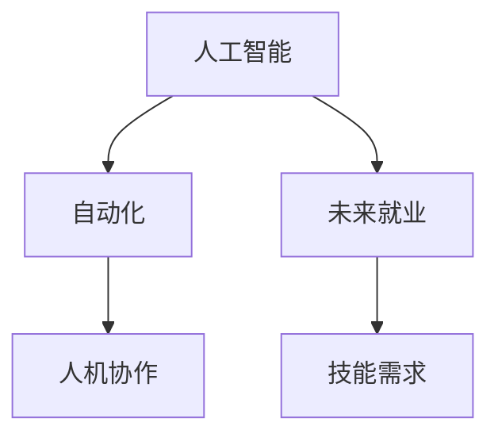

                 

# 人类计算：AI时代的未来就业前景和技能需求

> 关键词：人工智能,未来就业,技能需求,自动化,人类智能,人机协作

## 1. 背景介绍

随着人工智能（AI）技术的飞速发展，AI正逐渐改变各行各业的运作方式。AI不仅能够替代人类完成重复性高的任务，还能够提升工作效率和质量。然而，AI的发展也带来了新的就业挑战和机会。本文将探讨AI时代下人类计算的未来前景和所需技能。

## 2. 核心概念与联系

### 2.1 核心概念概述

- **人工智能（AI）**：通过计算机技术模拟和扩展人类智能，包括感知、学习、推理和决策等方面的能力。
- **自动化（Automation）**：将重复性高、规则明确的任务交给机器自动完成，以提高效率和降低成本。
- **人机协作（Human-Machine Collaboration）**：人类与机器的协同工作，充分发挥各自优势，共同完成复杂任务。
- **未来就业**：AI时代下，人类就业市场和职业结构将发生重大变化。
- **技能需求**：AI技术发展对人类所需技能提出了新的要求，包括技术技能、软技能等。

### 2.2 核心概念原理和架构的 Mermaid 流程图



### 2.3 核心概念之间的关系

1. **人工智能和自动化**：AI技术为自动化提供了技术基础，使得机器可以自动执行许多任务，减少了对人力的依赖。
2. **人机协作**：AI和自动化技术的发展，推动了人机协作的新模式。AI承担复杂决策和分析工作，人类则负责监督、指导和管理。
3. **未来就业和技能需求**：AI技术的普及，改变了就业市场的需求，对技能提出了新的要求。人类需要掌握新的技能，以适应新的工作环境。

## 3. 核心算法原理 & 具体操作步骤

### 3.1 算法原理概述

AI时代的就业变化主要受到两个因素的影响：自动化和智能化。自动化替代了重复性高、规则明确的任务，而智能化则提升了复杂任务的处理能力。

1. **自动化**：通过算法和机器学习模型，机器能够自动完成数据处理、图像识别、语音识别等任务，减少了对人工的依赖。例如，机器人可以完成制造线上的装配工作，智能客服可以处理客户咨询等。

2. **智能化**：AI能够进行复杂决策和分析，如自然语言处理、图像识别、医疗诊断等。智能化提升了工作效率和准确性，但也增加了对高技能人才的需求。

### 3.2 算法步骤详解

AI时代下，就业市场的变化主要分为以下几个步骤：

1. **识别自动化和智能化机会**：评估哪些任务可以通过AI自动化完成，哪些任务需要AI的智能化支持。例如，制造业的装配、客服的自动化咨询、医疗的影像分析等。

2. **评估技能需求**：分析自动化和智能化对不同技能的需求，包括技术技能、软技能等。例如，机器人操作需要机械工程、电子工程等技术技能；智能化任务需要数据分析、机器学习等技术技能。

3. **培养和提升技能**：根据技能需求，制定培训计划，提升现有劳动力的技能水平。例如，通过职业培训、在线课程等方式，提升员工的技术技能和软技能。

4. **探索人机协作新模式**：探索人类与机器协作的新模式，充分发挥各自优势。例如，人类与AI协同完成复杂决策，AI处理数据分析，人类负责监督和管理。

### 3.3 算法优缺点

**优点**：
- **提高效率**：自动化和智能化可以显著提高工作效率，减少人力成本。
- **提升准确性**：AI的精确计算能力提升了任务的准确性，减少了人为错误。
- **灵活应对变化**：AI和自动化技术可以快速适应环境变化，调整工作流程。

**缺点**：
- **就业替代**：自动化和智能化可能导致部分低技能岗位被替代，造成就业压力。
- **技能差距**：技术快速发展对劳动力的技能提出了新的要求，可能导致技能差距问题。
- **伦理和隐私问题**：AI技术的应用涉及伦理和隐私问题，需要制定相应的政策和规范。

### 3.4 算法应用领域

AI技术在多个领域的应用，对未来就业和技能需求产生了重要影响：

1. **制造业**：机器人自动化生产线，智能质量检测等。
2. **金融业**：智能投顾、自动化风险管理等。
3. **医疗健康**：智能诊断、自动化病历记录等。
4. **服务业**：智能客服、自动化客户管理等。
5. **教育**：智能教学、自动化评估等。

## 4. 数学模型和公式 & 详细讲解 & 举例说明

### 4.1 数学模型构建

AI时代下的就业变化可以通过数学模型来描述。以下是一个简单的模型：

设 $N$ 为某个行业劳动力总数，$C$ 为该行业的自动化水平，$S$ 为智能化水平，$E$ 为自动化和智能化对不同技能的需求。模型如下：

$$
E = f(C, S)
$$

其中，$f$ 为转换函数，表示自动化和智能化对技能需求的影响。

### 4.2 公式推导过程

以制造业为例，设 $C$ 为机器人自动化生产线的占比，$S$ 为智能化质量检测系统的占比。模型可以进一步细化为：

$$
E = k_1C + k_2S
$$

其中，$k_1$ 和 $k_2$ 为系数，表示自动化和智能化对不同技能的需求权重。

### 4.3 案例分析与讲解

以医疗健康领域为例，分析AI技术对未来就业和技能需求的影响。

- **自动化**：机器人自动化手术、智能药物配给系统等。这些技术减少了人力需求，但对机械工程、电子工程等技术技能的需求增加。
- **智能化**：AI辅助诊断、智能影像分析等。这些技术提升了诊断准确性，但对数据分析、机器学习等技术技能的需求增加。

## 5. 项目实践：代码实例和详细解释说明

### 5.1 开发环境搭建

在进行项目实践前，需要先搭建好开发环境。以下是使用Python进行项目开发的步骤：

1. 安装Anaconda：从官网下载并安装Anaconda，用于创建独立的Python环境。

2. 创建并激活虚拟环境：
```bash
conda create -n my_env python=3.8 
conda activate my_env
```

3. 安装必要的Python包：
```bash
pip install numpy pandas matplotlib scikit-learn
```

4. 安装Jupyter Notebook：用于编写和运行代码，可以通过Jupyter Notebook进行交互式开发。

5. 安装Git和GitHub：用于版本控制和代码共享，方便团队协作。

### 5.2 源代码详细实现

以下是一个简单的Python代码示例，用于计算自动化和智能化对技能需求的影响：

```python
import numpy as np
from sympy import symbols, Eq, solve

# 定义符号
C, S, E, k1, k2 = symbols('C S E k1 k2')

# 定义方程
equation = Eq(E, k1*C + k2*S)

# 求解
solution = solve(equation, E)

# 输出结果
print(solution)
```

### 5.3 代码解读与分析

上述代码使用Sympy库定义了一个方程，表示自动化和智能化对技能需求的影响。通过求解方程，可以得到不同自动化和智能化水平下，对技能的需求变化。

例如，假设 $k_1=0.5$，$k_2=0.3$，则当自动化水平为50%，智能化水平为30%时，技能需求 $E$ 为：

$$
E = 0.5 \times 0.5 + 0.3 \times 0.3 = 0.5 + 0.09 = 0.59
$$

即技能需求为59%。

## 6. 实际应用场景

### 6.1 制造业

AI在制造业中的应用主要集中在自动化和智能化两个方面：

- **自动化**：机器人自动化生产线，可以大幅提高生产效率，减少人力需求。例如，福特的柔性生产线，使用机器人进行装配和组装。
- **智能化**：智能化质量检测系统，可以实时监控生产过程，提升产品质量。例如，使用AI进行表面缺陷检测和尺寸测量。

### 6.2 金融业

AI在金融业的应用主要集中在智能投顾和自动化风险管理两个方面：

- **智能投顾**：智能投顾可以根据用户行为和偏好，提供个性化的投资建议。例如，智能投顾系统可以分析用户的投资历史、风险偏好等，提供最优投资组合。
- **自动化风险管理**：自动化风险管理系统可以实时监控交易风险，及时预警和处理风险事件。例如，使用AI进行信用风险评估和欺诈检测。

### 6.3 医疗健康

AI在医疗健康中的应用主要集中在智能化诊断和自动化病历记录两个方面：

- **智能化诊断**：AI辅助诊断系统可以通过分析影像、病理数据等，提供精准的诊断结果。例如，AI可以辅助医生进行乳腺癌诊断和影像分析。
- **自动化病历记录**：智能病历记录系统可以自动生成病历报告，减少医生录入时间。例如，使用AI进行电子病历的自动记录和分析。

### 6.4 未来应用展望

未来，AI将在更多领域得到广泛应用，对就业和技能需求产生深远影响：

1. **智能家居**：智能家居设备将更加普及，对人机协作的需求将增加。例如，智能音箱、智能冰箱等设备需要与人类进行自然语言交互。
2. **智能交通**：智能交通系统将大幅提升交通管理效率，但对交通管理和运营技能的需求将增加。例如，智能交通管理系统需要处理大规模交通数据，进行实时监控和调度。
3. **智能农业**：智能农业技术将提高农业生产效率，但对农业工程和数据科学技能的需求将增加。例如，使用AI进行农田监控和病虫害预测。

## 7. 工具和资源推荐

### 7.1 学习资源推荐

以下是一些推荐的学习资源，帮助你掌握AI时代下未来就业和技能需求：

1. **《人工智能简史》**：吴军老师的《人工智能简史》，深入浅出地介绍了AI的发展历程和未来前景。
2. **《深度学习》**：Ian Goodfellow的《深度学习》，全面介绍了深度学习的基础知识和应用场景。
3. **Coursera和edX**：提供丰富的在线课程，涵盖AI、机器学习、数据科学等多个领域。
4. **Kaggle**：数据科学和机器学习竞赛平台，提供大量数据集和竞赛项目，有助于实践和技能提升。
5. **GitHub**：代码托管平台，提供大量开源项目和代码库，方便学习交流和代码分享。

### 7.2 开发工具推荐

以下是一些推荐的开发工具，帮助你高效开发AI项目：

1. **PyTorch**：开源深度学习框架，支持GPU加速，广泛应用于AI项目开发。
2. **TensorFlow**：Google开发的深度学习框架，支持分布式计算和模型部署。
3. **Jupyter Notebook**：交互式开发环境，支持Python和R语言，方便代码调试和可视化。
4. **Git**：版本控制工具，支持代码管理和团队协作。
5. **Docker**：容器化技术，支持应用部署和环境隔离。

### 7.3 相关论文推荐

以下是一些推荐的相关论文，帮助你深入了解AI时代下未来就业和技能需求：

1. **《深度学习》**：Ian Goodfellow的《深度学习》，全面介绍了深度学习的基础知识和应用场景。
2. **《人工智能伦理》**：John Markoff的《人工智能伦理》，探讨了AI技术的伦理和社会影响。
3. **《未来就业报告》**：麦肯锡全球研究院的《未来就业报告》，预测了未来就业趋势和技能需求。
4. **《人机协作》**：Judea Pearl的《人机协作》，探讨了人机协作的未来发展方向和应用场景。

## 8. 总结：未来发展趋势与挑战

### 8.1 研究成果总结

AI时代的就业变化是一个复杂而深远的话题，本文从自动化、智能化、人机协作和未来就业等多个角度进行了探讨。AI技术的发展带来了新的就业机会和挑战，对技能需求提出了新的要求。未来，我们需要不断提升技术技能和软技能，以适应新的工作环境。

### 8.2 未来发展趋势

未来，AI技术将继续快速发展，对就业市场和技能需求产生深远影响。以下是一些发展趋势：

1. **自动化和智能化进一步普及**：AI技术将进一步普及，替代更多重复性高、规则明确的任务。
2. **人机协作成为主流**：人机协作将更加普遍，充分发挥各自优势，提升工作效率和质量。
3. **技能需求多样化**：未来的技能需求将更加多样化，技术技能和软技能都将受到重视。
4. **跨领域融合**：AI技术将与其他领域进行更深入的融合，产生更多交叉应用。
5. **伦理和社会影响**：AI技术的发展需要考虑伦理和社会影响，制定相应的政策和规范。

### 8.3 面临的挑战

AI技术的发展也带来了新的挑战：

1. **就业替代**：自动化和智能化可能导致部分低技能岗位被替代，造成就业压力。
2. **技能差距**：技术快速发展对劳动力的技能提出了新的要求，可能导致技能差距问题。
3. **伦理和隐私问题**：AI技术的应用涉及伦理和隐私问题，需要制定相应的政策和规范。
4. **数据安全和隐私保护**：AI技术需要处理大量数据，需要保护数据安全和隐私。

### 8.4 研究展望

未来的研究可以从以下几个方面进行：

1. **人机协作模型**：研究人机协作的模型和算法，探索最优的人机协作方式。
2. **技能提升路径**：制定技能提升路径和培训计划，帮助劳动者适应新的工作环境。
3. **伦理和社会影响**：研究AI技术的伦理和社会影响，制定相应的政策和规范。
4. **跨领域融合**：探索AI技术与其他领域的融合应用，产生更多交叉应用。

## 9. 附录：常见问题与解答

### Q1: AI时代下，哪些工作容易被替代？

A: AI技术能够替代重复性高、规则明确的任务，例如数据录入、流程管理等。

### Q2: AI技术的发展对就业市场有何影响？

A: AI技术的发展带来了新的就业机会和挑战。自动化和智能化可能导致部分低技能岗位被替代，但也带来了新的高技能岗位需求。

### Q3: 未来就业市场对技能的需求有哪些变化？

A: 未来就业市场对技术技能和软技能的需求将增加。技术技能包括数据分析、机器学习、深度学习等，软技能包括沟通能力、团队合作能力等。

### Q4: 如何应对AI技术带来的挑战？

A: 应对AI技术带来的挑战需要制定相应的政策和规范，保护就业者权益。同时，需要通过教育和培训提升劳动者的技能水平，适应新的工作环境。

### Q5: AI技术的发展对社会有哪些影响？

A: AI技术的发展对社会的影响是多方面的。它提升了生产效率，但也可能导致就业问题。需要制定相应的政策和规范，确保AI技术的发展不会带来负面影响。

---

作者：禅与计算机程序设计艺术 / Zen and the Art of Computer Programming

