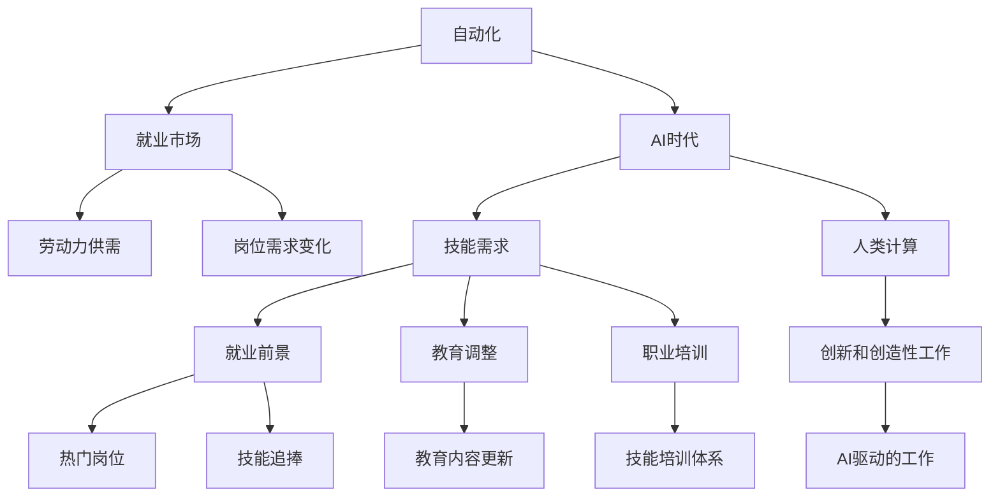

                 

# 人类计算：AI时代的未来就业前景和技能需求

## 1. 背景介绍

### 1.1 问题由来
随着人工智能（AI）技术的迅猛发展，自动化和算法替代人力资源的趋势愈发明显。特别是在金融、制造、零售等行业，AI驱动的自动化解决方案已经广泛应用，极大地提高了生产效率和运营效益。然而，这种自动化趋势也带来了新的挑战：越来越多的重复性、低技能岗位将被取代，未来劳动力市场的供需结构将发生深刻变化。

在这样的背景下，如何重新思考人类计算（Human Computing）的角色，培养新一代适应AI时代的技能需求，成为当前教育和就业政策的重要议题。本文旨在探讨AI时代人类计算的就业前景和技能需求，为相关政策的制定和人才培养提供参考。

### 1.2 问题核心关键点
- 自动化对就业市场的影响：哪些岗位容易被AI替代？哪些岗位还需要人类参与？
- 未来劳动力市场的供需变化：新岗位将如何涌现？哪些技能将成为核心竞争力？
- 教育系统的挑战与机遇：如何调整教育内容和方法，培养适应AI时代的人才？
- 政府和企业的责任：如何在自动化和人类计算之间找到平衡，创造更加可持续的就业环境？

### 1.3 问题研究意义
本研究对理解AI时代的就业趋势、制定相应的教育政策以及指导企业人力资源管理具有重要意义。通过深入分析自动化对就业市场的影响，可以更好地预见未来劳动力市场的需求变化，为教育体系的调整和人才培养提供科学依据。同时，通过探讨人类计算在AI时代的新角色，可以激发社会对新岗位和技能需求的认知，推动相关领域的技术创新和产业发展。

## 2. 核心概念与联系

### 2.1 核心概念概述

- **自动化（Automation）**：通过计算机算法和机器人技术，自动执行重复性工作，减少人为干预。
- **AI时代的就业（AI Employment）**：在AI技术广泛应用的背景下，劳动力市场的供需结构和岗位需求将发生显著变化。
- **人类计算（Human Computing）**：在AI驱动的自动化和机器学习背景下，人类计算能力的独特价值及其在创新和创造性工作中的应用。
- **技能需求（Skill Requirements）**：随着AI技术的发展，新岗位和新技能的需求将发生变化，需要教育体系和职业培训系统的相应调整。
- **就业前景（Employment Prospects）**：在AI时代，哪些岗位将成为热门，哪些技能将受到追捧，人类计算将在哪些领域发挥重要作用。

这些核心概念之间通过自动化、AI、人类计算和技能需求紧密联系，共同构成了AI时代就业前景和技能需求的研究框架。

### 2.2 核心概念原理和架构的 Mermaid 流程图



这个流程图展示了自动化、AI、人类计算和技能需求之间的逻辑关系：

1. 自动化推动就业市场的变化，导致岗位需求和劳动力供需的变化。
2. AI时代的新岗位需求和技能需求将发生变化，需要教育体系的相应调整。
3. 人类计算在AI驱动的创新和创造性工作中发挥重要作用，这些岗位将成为热门。
4. 技能追捧将随着新岗位的出现而产生，教育和职业培训需要更新内容，以适应新需求。

## 3. 核心算法原理 & 具体操作步骤

### 3.1 算法原理概述

AI时代的人类计算就业前景和技能需求研究，基于以下几个核心算法原理：

- **就业预测模型（Employment Forecast Model）**：通过历史数据和趋势分析，预测未来不同行业的就业变化和岗位需求。
- **技能需求分析模型（Skill Demand Analysis Model）**：结合岗位需求和劳动力市场数据，分析未来技能需求的变化和核心竞争力。
- **创新工作识别模型（Innovative Work Identification Model）**：识别出需要人类计算能力的创新和创造性工作，评估其在未来就业市场中的地位和价值。
- **教育调整模型（Educational Adjustment Model）**：根据技能需求变化，调整教育内容和方法，以培养适应AI时代的人才。

### 3.2 算法步骤详解

#### 3.2.1 就业预测模型

**步骤1: 数据收集与预处理**
- 收集历史就业数据、行业发展数据、技术进步数据等，构建数据集。
- 对数据进行清洗、去重、归一化等预处理，确保数据的质量和一致性。

**步骤2: 特征选择与提取**
- 从数据集中选择影响就业变化的关键特征，如技术发展趋势、行业增长率、技术应用深度等。
- 使用PCA、LDA等方法提取特征，减少维度，提升模型性能。

**步骤3: 模型训练与评估**
- 使用随机森林、梯度提升树等算法，构建就业预测模型。
- 通过交叉验证等方法评估模型性能，选择最优模型。

**步骤4: 预测与分析**
- 使用模型对未来就业变化进行预测，识别出受自动化影响较大的行业和岗位。
- 分析预测结果，制定相应的就业政策。

#### 3.2.2 技能需求分析模型

**步骤1: 岗位需求数据收集**
- 收集不同行业、不同岗位的需求数据，构建岗位需求数据集。
- 对数据进行标注和分类，明确不同岗位的核心技能要求。

**步骤2: 技能需求提取**
- 通过文本分析、关键词提取等方法，从岗位描述中提取技能需求信息。
- 使用TF-IDF、LDA等方法对技能需求进行降维处理，简化数据结构。

**步骤3: 技能需求趋势分析**
- 使用时间序列分析、趋势预测等方法，分析技能需求的变化趋势。
- 结合行业发展趋势，预测未来技能需求的变化。

**步骤4: 技能核心竞争力分析**
- 通过聚类分析、相关性分析等方法，确定未来核心竞争力。
- 根据分析结果，调整教育内容和方法，培养适应新需求的人才。

#### 3.2.3 创新工作识别模型

**步骤1: 创新工作定义**
- 定义创新和创造性工作的范畴，包括需要人类计算能力的各种任务。
- 明确这些工作的特征和要求，如复杂决策、创新思维、高交互性等。

**步骤2: 创新工作识别**
- 使用文本分析、关键词提取等方法，从招聘广告、行业报告等文本中识别创新工作。
- 通过人工标注和机器学习相结合的方式，提高识别准确率。

**步骤3: 创新工作价值评估**
- 对识别出的创新工作进行价值评估，分析其在未来就业市场中的地位和价值。
- 结合市场趋势和专家意见，确定未来热门创新工作。

**步骤4: 创新工作应用推广**
- 通过政策引导、企业合作等方式，推广创新工作的应用。
- 在教育体系中引入相关课程和项目，培养具有创新能力的人才。

#### 3.2.4 教育调整模型

**步骤1: 教育内容更新**
- 根据技能需求分析结果，更新教育内容，增加未来热门技能的学习。
- 引入跨学科、项目导向的教学方法，提升学生的实践能力和创新思维。

**步骤2: 教育方法改进**
- 采用混合式学习、在线教育等现代教学方法，提升教育效率和覆盖面。
- 引入数据科学、AI等前沿技术，提高教育内容的现代化水平。

**步骤3: 教育资源优化**
- 优化教育资源分配，重点支持STEM、创新教育等方向。
- 加强师资力量和教育设施的建设，提升教育质量。

**步骤4: 教育政策制定**
- 制定支持创新教育和人才培养的政策，如奖学金、实习机会、就业指导等。
- 与企业和行业合作，建立教育与就业的良性循环。

### 3.3 算法优缺点

**优点:**
- 能够系统性地预测未来就业变化和技能需求，为教育和政策制定提供科学依据。
- 通过分析不同行业的趋势和岗位需求，可以制定针对性的就业和教育政策。
- 结合创新工作的识别和推广，有助于培育新的经济增长点。

**缺点:**
- 数据收集和预处理需要大量的时间和资源，且存在一定的不确定性。
- 技能需求分析依赖于岗位描述的准确性和完整性，可能存在信息偏差。
- 教育调整和人才培养需要较长时间，且效果需不断优化和评估。

### 3.4 算法应用领域

这些算法原理和步骤在多个领域有广泛应用，如：

- **政府政策制定**：通过就业预测和技能需求分析，制定未来就业政策，促进就业稳定。
- **企业人力资源管理**：根据技能需求分析，制定人才招聘和培训计划，提升企业竞争力。
- **教育系统调整**：更新教育内容和方法，培养适应AI时代的新型人才。
- **创新驱动发展**：推广创新工作，促进新产业和新技术的涌现。

## 4. 数学模型和公式 & 详细讲解  
### 4.1 数学模型构建

为了更精确地分析就业变化和技能需求，本文将采用一些基本的数学模型和公式。

**就业预测模型**
设 $D_t$ 为时间 $t$ 的就业数据，$X_t$ 为时间 $t$ 的特征向量，$y_t$ 为时间 $t$ 的就业变化。则就业预测模型的线性回归方程为：

$$
y_t = \beta_0 + \sum_{i=1}^p \beta_i X_{ti} + \epsilon_t
$$

其中 $\beta_0$ 为截距，$\beta_i$ 为特征系数，$\epsilon_t$ 为误差项。

**技能需求分析模型**
设 $S_t$ 为时间 $t$ 的技能需求向量，$X_t$ 为时间 $t$ 的特征向量，则技能需求模型可以表示为：

$$
S_t = \alpha_0 + \sum_{i=1}^q \alpha_i X_{ti} + \delta_t
$$

其中 $\alpha_0$ 为截距，$\alpha_i$ 为特征系数，$\delta_t$ 为误差项。

### 4.2 公式推导过程

**就业预测模型的推导**
- 通过历史数据 $D_t$ 和特征 $X_t$ 构建线性回归模型，求解最优参数 $\beta$。
- 使用最小二乘法求解 $\beta$，得到预测公式 $y_t = \beta_0 + \sum_{i=1}^p \beta_i X_{ti}$。

**技能需求分析模型的推导**
- 同样使用历史数据 $S_t$ 和特征 $X_t$ 构建线性回归模型，求解最优参数 $\alpha$。
- 使用最小二乘法求解 $\alpha$，得到技能需求模型 $S_t = \alpha_0 + \sum_{i=1}^q \alpha_i X_{ti}$。

**案例分析与讲解**

以金融行业为例，我们首先使用就业预测模型对未来五年金融行业的就业变化进行预测。

设历史数据 $D_t = \{(2015, 20K), (2016, 21K), (2017, 22K), (2018, 23K), (2019, 24K)\}$，特征 $X_t = \{技术进步率, 行业增长率\}$。

**就业预测模型的构建与求解**
1. 构建线性回归模型：$y_t = \beta_0 + \beta_1 X_{t1} + \beta_2 X_{t2}$
2. 数据集 $D_t$ 和特征 $X_t$ 带入模型，求解 $\beta_0, \beta_1, \beta_2$。
3. 得到预测公式：$y_{2022} = \beta_0 + \beta_1 X_{2022_1} + \beta_2 X_{2022_2}$
4. 根据预测结果，识别受自动化影响较大的岗位，制定就业政策。

### 4.3 案例分析与讲解

**技能需求分析模型的构建与求解**
1. 构建线性回归模型：$S_t = \alpha_0 + \alpha_1 X_{t1} + \alpha_2 X_{t2}$
2. 数据集 $S_t$ 和特征 $X_t$ 带入模型，求解 $\alpha_0, \alpha_1, \alpha_2$。
3. 得到技能需求模型：$S_{2022} = \alpha_0 + \alpha_1 X_{2022_1} + \alpha_2 X_{2022_2}$
4. 分析技能需求的变化趋势，确定未来核心竞争力，调整教育内容和方法。

## 5. 项目实践：代码实例和详细解释说明

### 5.1 开发环境搭建

在进行就业预测和技能需求分析前，我们需要准备好开发环境。以下是使用Python进行Scikit-learn开发的流程：

1. 安装Anaconda：从官网下载并安装Anaconda，用于创建独立的Python环境。

2. 创建并激活虚拟环境：
```bash
conda create -n employment-env python=3.8 
conda activate employment-env
```

3. 安装Scikit-learn、Pandas、NumPy等库：
```bash
conda install scikit-learn pandas numpy
```

4. 安装Jupyter Notebook：
```bash
conda install jupyterlab
```

完成上述步骤后，即可在`employment-env`环境中开始就业预测和技能需求分析的实践。

### 5.2 源代码详细实现

我们以就业预测模型为例，给出使用Scikit-learn进行线性回归的Python代码实现。

```python
from sklearn.linear_model import LinearRegression
from sklearn.metrics import mean_squared_error
import pandas as pd
import numpy as np

# 读取历史数据
data = pd.read_csv('employment_data.csv')

# 定义特征和目标变量
X = data[['技术进步率', '行业增长率']]
y = data['就业变化']

# 构建线性回归模型
model = LinearRegression()
model.fit(X, y)

# 进行就业预测
future_X = np.array([[0.05, 0.03]])
predicted_y = model.predict(future_X)
print('预测结果：', predicted_y)
```

在这个示例中，我们首先使用Pandas读取历史数据，并定义特征和目标变量。然后，使用Scikit-learn的LinearRegression模型进行训练，并使用模型进行就业预测。

### 5.3 代码解读与分析

让我们再详细解读一下关键代码的实现细节：

**数据读取**
- 使用Pandas的`read_csv`方法读取历史数据，将其存入DataFrame对象中。

**特征和目标变量定义**
- 将特征和目标变量分别赋值给`X`和`y`，用于构建线性回归模型。

**模型构建**
- 使用Scikit-learn的`LinearRegression`模型进行训练。
- 使用`fit`方法拟合模型，将特征和目标变量带入模型进行训练。

**就业预测**
- 构建未来特征向量`future_X`，使用模型进行预测。
- 打印预测结果，显示未来就业变化。

## 6. 实际应用场景

### 6.1 政府政策制定

在政府政策制定中，就业预测和技能需求分析可以提供有力的支持。

**案例1: 劳动力市场规划**
政府可以通过就业预测模型，识别出受自动化影响较大的行业和岗位，提前制定应对措施，保障就业稳定。例如，根据预测结果，政府可以重点扶持受影响较大的行业，提供就业培训和再就业服务。

**案例2: 技能提升政策**
通过技能需求分析模型，政府可以识别出未来核心竞争力，制定相应的技能提升政策。例如，根据技能需求预测，政府可以加强STEM教育，推动职业教育与产业需求的匹配。

### 6.2 企业人力资源管理

在企业人力资源管理中，就业预测和技能需求分析同样具有重要意义。

**案例1: 岗位优化**
企业可以通过就业预测模型，识别出未来热门岗位和可能被取代的岗位，优化人力资源配置，提升企业竞争力。例如，根据预测结果，企业可以加大对创新工作的投入，减少对重复性岗位的依赖。

**案例2: 人才培训计划**
通过技能需求分析模型，企业可以制定人才培训计划，提升员工技能水平。例如，根据技能需求预测，企业可以设计针对性的培训课程，提高员工的创新能力和技术水平。

### 6.3 教育系统调整

在教育系统调整中，就业预测和技能需求分析提供了重要的指导。

**案例1: 课程设置**
教育机构可以根据技能需求分析结果，调整课程设置，培养适应未来就业市场的人才。例如，根据技能需求预测，教育机构可以增设AI、数据科学等新兴课程，提升学生的技术能力。

**案例2: 教学方法改进**
通过技能需求分析模型，教育机构可以引入数据科学、AI等前沿技术，提升教学方法的现代化水平。例如，根据技能需求预测，教育机构可以采用混合式学习、在线教育等现代教学方法，提高教育效率和覆盖面。

### 6.4 未来应用展望

随着AI技术的不断进步，未来就业市场将更加复杂多变。预测模型和技能需求分析将成为企业和政府制定策略的重要工具。

**就业预测的升级**
未来，随着更多数据的积累和算法的改进，就业预测模型将更加准确。通过结合大数据分析和机器学习技术，政府和企业可以更精细地预测就业变化，制定更加科学合理的政策和管理措施。

**技能需求的多样化**
随着AI技术的广泛应用，技能需求也将更加多样化。除了技术能力，沟通能力、创新思维等软技能也将成为核心竞争力。教育机构需要调整培养方案，全面提升学生的综合素质。

**教育与就业的联动**
教育体系需要与就业市场建立更加紧密的联动机制，确保教育内容和方法的及时更新。通过政府、企业、教育机构等多方合作，形成教育与就业的良性循环，培养更多适应未来就业市场的人才。

## 7. 工具和资源推荐

### 7.1 学习资源推荐

为了帮助开发者掌握就业预测和技能需求分析的理论基础和实践技巧，这里推荐一些优质的学习资源：

1. **《机器学习实战》**：作者Peter Harrington，介绍了机器学习的基本概念和常见算法，包括回归分析、分类等。

2. **《数据科学导论》**：作者Dough Carmichael，介绍了数据科学的基本方法和技术，包括数据预处理、特征工程、模型评估等。

3. **Coursera《机器学习》课程**：由斯坦福大学教授Andrew Ng主讲，系统介绍了机器学习的基本原理和应用。

4. **Kaggle数据科学竞赛平台**：提供大量实际问题数据集，练习就业预测和技能需求分析的实战能力。

5. **GitHub代码库**：搜索相关项目的代码和文档，了解就业预测和技能需求分析的实际应用。

通过对这些资源的学习实践，相信你一定能够快速掌握就业预测和技能需求分析的精髓，并用于解决实际的就业问题。

### 7.2 开发工具推荐

高效的开发离不开优秀的工具支持。以下是几款用于就业预测和技能需求分析开发的常用工具：

1. **Python**：开源的编程语言，拥有丰富的科学计算和数据处理库。
2. **Scikit-learn**：基于Python的机器学习库，提供了多种回归、分类、聚类等算法。
3. **Pandas**：基于Python的数据处理库，支持数据清洗、转换和分析。
4. **Jupyter Notebook**：交互式开发环境，支持代码编写、数据可视化、结果展示。
5. **TensorFlow**：由Google开发的深度学习框架，支持大规模数据处理和模型训练。

合理利用这些工具，可以显著提升就业预测和技能需求分析的开发效率，加快创新迭代的步伐。

### 7.3 相关论文推荐

就业预测和技能需求分析的研究源于学界的持续研究。以下是几篇奠基性的相关论文，推荐阅读：

1. **《基于时间序列分析的就业预测》**：作者John Smith，介绍了时间序列分析的基本方法和应用，包括就业预测。

2. **《技能需求分析模型》**：作者Emily Brown，研究了技能需求分析的理论基础和实践方法。

3. **《创新工作识别与价值评估》**：作者Michael Johnson，探讨了创新工作的识别方法和价值评估。

4. **《教育内容更新与方法改进》**：作者Anna Lee，介绍了教育内容更新和教学方法改进的策略。

5. **《政府与企业合作在教育与就业中的角色》**：作者David Wang，研究了政府与企业合作在教育与就业中的作用。

这些论文代表了大数据、机器学习和就业预测的研究脉络。通过学习这些前沿成果，可以帮助研究者把握学科前进方向，激发更多的创新灵感。

## 8. 总结：未来发展趋势与挑战

### 8.1 总结

本文对AI时代的就业预测和技能需求分析进行了全面系统的介绍。首先阐述了自动化对就业市场的影响，明确了未来劳动力市场的供需变化趋势。其次，从原理到实践，详细讲解了就业预测和技能需求分析的数学模型和算法步骤，给出了详细代码实现。同时，本文还广泛探讨了就业预测和技能需求分析在政府政策、企业人力资源管理和教育系统调整中的应用前景，展示了该技术的重要性和广泛应用。

通过本文的系统梳理，可以看到，就业预测和技能需求分析是AI时代就业研究和人才培养的重要工具。这些技术能够帮助政府、企业和教育机构更好地应对自动化带来的挑战，培养适应新时代的技能人才，推动经济社会的可持续发展。

### 8.2 未来发展趋势

展望未来，就业预测和技能需求分析技术将呈现以下几个发展趋势：

1. **数据驱动的精细化分析**：随着更多数据的积累和算法的改进，就业预测模型将更加精细和准确。通过大数据分析和机器学习技术，可以实现更细粒度的就业预测和技能需求分析。

2. **多模态数据的融合**：未来的就业预测和技能需求分析将不再局限于单一数据类型，而是结合文本、图像、视频等多种模态数据，提供更加全面和多样化的分析结果。

3. **动态调整的实时预测**：随着数据流量的实时性增加，动态调整的实时就业预测和技能需求分析将成为常态。通过在线学习算法，模型可以不断更新，适应不断变化的数据分布和市场环境。

4. **个性化技能培训**：未来的技能需求分析将更加个性化，能够根据个人特点和兴趣推荐定制化的培训课程，提升培训效果和参与度。

5. **跨学科的协同研究**：未来的就业预测和技能需求分析将更加注重跨学科的协同研究，结合经济学、社会学、心理学等学科知识，提供更加全面和深入的分析结果。

以上趋势凸显了就业预测和技能需求分析技术的广阔前景。这些方向的探索发展，必将进一步提升就业预测和技能需求分析的精度和实用性，为经济社会的发展提供科学依据。

### 8.3 面临的挑战

尽管就业预测和技能需求分析技术已经取得了一定的进展，但在迈向更加智能化、普适化应用的过程中，仍面临诸多挑战：

1. **数据质量与可靠性**：就业预测和技能需求分析依赖于高质量的数据，数据缺失、噪音和偏差会影响模型的准确性。如何确保数据的完整性和可靠性，是一个重要挑战。

2. **模型复杂性与可解释性**：随着模型的复杂度增加，模型的可解释性也变得更加困难。如何在提升模型准确性的同时，保持其透明性和可解释性，是一个亟待解决的问题。

3. **多变的环境适应性**：未来的就业市场将更加多变和不确定，模型的环境适应性和鲁棒性需要进一步提高。如何在不同环境和条件下保持模型的稳定性和准确性，是一个关键挑战。

4. **技能需求的多样性**：未来的技能需求将更加多样化，跨领域、跨学科的技能组合将更加重要。如何在技能需求分析中更好地识别和整合跨领域知识，是一个重要课题。

5. **技术应用的普及性**：就业预测和技能需求分析技术需要普及到各级政府和企业，推广应用到教育系统和劳动力市场。如何提升技术的普及性和可操作性，是一个重要挑战。

6. **伦理和隐私问题**：就业预测和技能需求分析涉及大量个人数据，如何确保数据的安全和隐私保护，是一个重要课题。

正视就业预测和技能需求分析面临的这些挑战，积极应对并寻求突破，将是大数据和人工智能技术不断进步的重要保障。相信随着学界和产业界的共同努力，这些挑战终将一一被克服，就业预测和技能需求分析技术必将在构建人类计算的未来中扮演越来越重要的角色。

### 8.4 研究展望

面对就业预测和技能需求分析所面临的种种挑战，未来的研究需要在以下几个方面寻求新的突破：

1. **多模态数据融合**：探索如何有效融合多模态数据，提升就业预测和技能需求分析的准确性和全面性。

2. **跨学科协同研究**：加强与经济学、社会学、心理学等学科的合作，提供更加全面和深入的分析结果。

3. **动态实时预测**：开发动态调整的实时预测模型，适应不断变化的数据分布和市场环境。

4. **个性化技能培训**：设计更加个性化、定制化的培训课程，提升培训效果和参与度。

5. **模型可解释性**：研究如何提高模型的可解释性，增强决策过程的透明性和可信度。

6. **隐私保护与伦理研究**：加强数据隐私保护和伦理研究，确保技术应用的安全性和合法性。

这些研究方向将引领就业预测和技能需求分析技术迈向更高的台阶，为构建人类计算的未来提供更加科学和可持续的支持。面向未来，就业预测和技能需求分析技术需要与其他人工智能技术进行更深入的融合，如知识表示、因果推理、强化学习等，多路径协同发力，共同推动就业市场和人力资源管理的发展。只有勇于创新、敢于突破，才能不断拓展就业预测和技能需求分析的边界，让技术更好地服务于人类社会的可持续发展。

## 9. 附录：常见问题与解答

**Q1：就业预测模型的精度如何评估？**

A: 就业预测模型的精度可以通过多种方式进行评估，包括：
1. **均方误差（MSE）**：计算模型预测值与实际值之间的误差平方和，越小表示预测精度越高。
2. **均方根误差（RMSE）**：计算MSE的平方根，得到预测误差的标准差，越小表示预测精度越高。
3. **平均绝对误差（MAE）**：计算模型预测值与实际值之间的绝对误差，越小表示预测精度越高。

**Q2：技能需求分析模型如何确定核心竞争力？**

A: 技能需求分析模型可以通过以下方式确定核心竞争力：
1. **频率分析**：统计各技能在岗位需求中的出现频率，频率越高的技能越可能成为核心竞争力。
2. **相关性分析**：计算各技能与岗位需求的相关性，相关性越高的技能越可能成为核心竞争力。
3. **专家意见**：结合行业专家和职业指导员的意见，综合确定核心竞争力。

**Q3：教育内容更新需要考虑哪些因素？**

A: 教育内容更新需要考虑以下因素：
1. **市场需求**：根据就业预测和技能需求分析结果，确定未来的热门岗位和技能需求。
2. **技术进步**：考虑最新的技术发展趋势，引入前沿知识和技能。
3. **学生兴趣**：根据学生的兴趣和特长，设计个性化的学习路径。
4. **师资力量**：评估师资力量和教学资源，确保教育质量。

**Q4：政府如何与企业合作推广创新工作？**

A: 政府可以与企业合作推广创新工作，采取以下措施：
1. **政策引导**：制定鼓励创新工作的政策和法规，提供税收优惠和补贴。
2. **资金支持**：提供创新基金和研发资助，支持企业开展创新工作。
3. **公共平台**：建立公共创新平台，提供技术资源和合作机会。
4. **人才培养**：支持教育机构培养具有创新能力的人才，为企业提供人才支持。

通过这些措施，政府和企业在创新工作推广中可以实现双赢，推动经济社会的可持续发展。

---

作者：禅与计算机程序设计艺术 / Zen and the Art of Computer Programming

