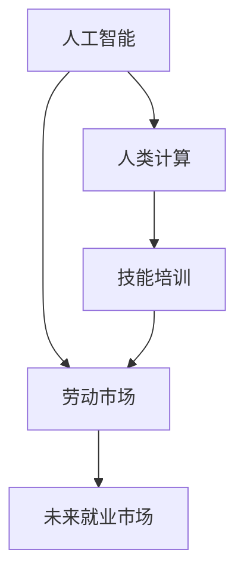

                 

# 人类计算：AI时代的未来就业市场与技能培训发展分析预测

## 1. 背景介绍

### 1.1 问题由来
随着人工智能(AI)技术的飞速发展，尤其是深度学习和机器学习的崛起，人类计算的角色发生了深刻的变革。在过去的几十年里，计算机编程和数据处理的任务逐渐被自动化和智能化的软件系统所取代。然而，AI技术的广泛应用不仅创造了前所未有的工作机会，也引发了一系列关于未来就业市场和技能培训的广泛讨论和担忧。

当前，AI技术已经深入到各行各业，从制造业到金融业，从医疗保健到教育，再到艺术和文化，AI的影子无处不在。这些变化引发了关于人类计算的新思考：人工智能将如何影响劳动市场的结构？哪些技能将会变得重要？技能培训体系又将如何调整以适应新的就业市场？

### 1.2 问题核心关键点
为了回答这些问题，我们需要深入分析AI时代下就业市场和技能培训的变化趋势。本文将围绕以下几个核心关键点进行探讨：
1. AI技术对劳动市场的影响。
2. 未来就业市场的变化趋势。
3. 技能培训体系面临的挑战与机遇。
4. 个人和组织如何应对这些变化。

## 2. 核心概念与联系

### 2.1 核心概念概述

为了更好地理解AI时代下就业市场和技能培训的变化，本节将介绍几个密切相关的核心概念：

- **人工智能**：一种模拟人类智能的技术，通过算法和模型来解决复杂的问题，包括机器学习、深度学习、自然语言处理、计算机视觉等。
- **人类计算**：指的是使用人类智能解决复杂问题的过程，包括编程、数据分析、设计和创新等。
- **技能培训**：为了提升员工的专业技能和知识水平，而提供的教育培训项目。
- **劳动市场**：指劳动力供需双方交易的场所，影响因素包括经济环境、技术进步、政策法规等。
- **未来就业市场**：指在AI技术普及和人类计算角色变革背景下，劳动市场的新趋势和新机遇。

这些概念之间的关系可以通过以下Mermaid流程图来展示：



这个流程图展示了人工智能与人类计算之间的紧密联系，以及技能培训在提升劳动力市场竞争力中的作用。劳动市场将受到人工智能的深刻影响，而技能培训则是应对这种影响的有效手段。

## 3. 核心算法原理 & 具体操作步骤

### 3.1 算法原理概述

AI时代下就业市场和技能培训的变革，其核心在于AI技术对劳动力的重新配置和技能需求的转变。以下是AI技术如何影响劳动市场和技能培训的原理概述：

- **自动化**：AI技术能够自动化许多重复性和低技能的工作，从而减少对低技能劳动力的需求。
- **增强技能**：AI技术可以增强人类计算的能力，提升高技能劳动力的价值，尤其是在创新、设计和决策等领域。
- **新职业**：AI技术的普及也将催生许多新的职业，这些职业需要结合AI技术和人类计算的独特优势。
- **终身学习**：在AI技术的快速迭代下，终身学习成为保持就业竞争力的关键。

### 3.2 算法步骤详解

基于上述原理，AI时代下就业市场和技能培训的变革可以分为以下几个关键步骤：

**Step 1: 识别AI技术的影响**
- 分析AI技术在各个行业的潜在影响，识别出可能被自动化的任务和岗位。
- 评估AI技术对现有工作流程和劳动力需求的影响，预测未来就业市场的新趋势。

**Step 2: 评估技能需求的变化**
- 根据AI技术的发展，评估未来技能需求的变化趋势，包括新增的技能需求和淘汰的技能需求。
- 识别出未来高价值技能，如数据科学、编程、机器学习、创新设计等。

**Step 3: 设计技能培训体系**
- 设计适应未来就业市场需求的培训课程和体系，包括线上和线下培训。
- 引入AI技术，如个性化学习路径、智能辅导、自动化评估等，提高培训效果。

**Step 4: 实施技能提升计划**
- 为现有员工和潜在员工提供技能提升的机会，帮助他们适应未来就业市场的需求。
- 与教育机构和企业合作，推广技能培训，培养更多的AI人才。

### 3.3 算法优缺点

AI时代下就业市场和技能培训的变革方法具有以下优点：
1. **效率提升**：通过自动化和智能化的培训方式，可以大幅提升技能培训的效率和效果。
2. **灵活性增强**：可以根据市场需求的变化，灵活调整培训内容和方式，提高适应性。
3. **覆盖面广**：AI技术的应用可以覆盖更多的行业和人群，促进教育资源的公平分配。

同时，该方法也存在一定的局限性：
1. **技术依赖**：过度依赖AI技术可能忽视了人类计算的独特价值，如创造力、情感理解和人际交往能力。
2. **伦理挑战**：AI技术在技能培训中的应用可能带来隐私、安全和公平性等伦理问题。
3. **成本问题**：高质量的AI驱动培训可能需要较大的投入，对部分企业和个人来说可能难以负担。

尽管存在这些局限性，但就目前而言，AI技术在技能培训中的应用，已经成为推动就业市场变革的重要手段。未来相关研究的重点在于如何平衡技术应用与人文价值，以及如何在成本和效果之间找到最佳平衡。

### 3.4 算法应用领域

AI时代下就业市场和技能培训的变革方法，已经在多个领域得到了应用，例如：

- **制造业**：通过自动化和智能化生产设备，提高生产效率，减少对人力的依赖。
- **金融业**：利用AI算法进行风险评估、客户服务自动化、交易分析等，提升金融服务质量。
- **医疗保健**：使用AI进行病患诊断、个性化治疗、医疗影像分析等，改善医疗服务。
- **教育**：开发个性化学习系统，提供智能辅导、自动化评估，提升学习效果。
- **文化艺术**：利用AI进行创意设计、内容生成、用户分析等，促进文化创新。

除了这些经典应用外，AI技术在更多领域的应用也正在探索，为各行各业带来了新的发展机遇。随着AI技术的不断进步，未来的就业市场和技能培训体系将更加丰富多彩，更具创新性。

## 4. 数学模型和公式 & 详细讲解 & 举例说明

### 4.1 数学模型构建

为了更准确地分析和预测AI时代下就业市场和技能培训的变化，我们可以构建一个数学模型来描述这种关系。设 $L$ 为劳动力市场的规模，$T$ 为技能培训的投入，$A$ 为自动化技术的应用程度，$H$ 为人类计算的复杂度。模型中各变量之间的关系可以用下面的方程组来表示：

$$
\frac{dL}{dt} = -k \cdot A \cdot H
$$

$$
\frac{dT}{dt} = f(L, T)
$$

$$
A = g(L, H)
$$

其中 $k$ 为自动化对劳动力需求的减少速率，$f$ 为技能培训的投资回报函数，$g$ 为自动化技术随劳动力市场和人类计算复杂度变化的函数。

### 4.2 公式推导过程

首先，我们需要解出 $L$ 随时间变化的方程。根据上面的方程组，我们可以推导出劳动力市场规模随时间的变化率：

$$
\frac{dL}{dt} = -k \cdot A \cdot H
$$

其中 $A$ 和 $H$ 可以根据劳动力市场和技术进步的变化而变化。在理想情况下，如果自动化技术能够完全替代低技能工作，那么 $A$ 将趋近于1，而 $H$ 将随技术进步而增加。

其次，我们需要分析技能培训的投资回报函数 $f(L, T)$。这通常是一个复杂的非线性函数，依赖于劳动力市场的规模和技能培训的投入。在AI时代下，技能培训的投资回报率可能会显著提升，因为高技能劳动力在自动化环境中具有更大的价值。

最后，我们还需要分析自动化技术随劳动力市场和人类计算复杂度变化的函数 $g$。在AI时代下，自动化技术的进步往往与人类计算的复杂度成正比，因为高复杂度的任务更容易被AI技术所替代。

### 4.3 案例分析与讲解

假设某个行业的劳动力市场规模为 $L_0$，技能培训的初始投入为 $T_0$，自动化技术的应用程度为 $A_0$，人类计算的复杂度为 $H_0$。根据模型，我们可以预测未来劳动力市场和技能培训的变化趋势。例如，如果自动化技术在某个行业的渗透率提高了10%，而人类计算的复杂度提高了20%，那么劳动力市场规模可能会减少 $k \cdot 0.1 \cdot 1.2$。如果技能培训的投资回报率在自动化环境中提升到原来的两倍，那么技能培训的投入会相应增加。

## 5. 项目实践：代码实例和详细解释说明

### 5.1 开发环境搭建

在进行技能培训和就业市场分析的实践前，我们需要准备好开发环境。以下是使用Python进行数据分析和机器学习的环境配置流程：

1. 安装Anaconda：从官网下载并安装Anaconda，用于创建独立的Python环境。

2. 创建并激活虚拟环境：
```bash
conda create -n py3k python=3.8
conda activate py3k
```

3. 安装必要的Python包：
```bash
pip install pandas numpy matplotlib scikit-learn tensorflow
```

4. 安装R语言和相关库：
```bash
conda install rpy2
```

完成上述步骤后，即可在虚拟环境中进行数据分析和机器学习实践。

### 5.2 源代码详细实现

下面是一个简单的Python代码示例，用于模拟AI时代下就业市场和技能培训的变化：

```python
import numpy as np
import pandas as pd
import matplotlib.pyplot as plt

# 定义参数
k = 0.5  # 自动化对劳动力需求的减少速率
f = lambda L, T: 0.8 * T**0.5  # 技能培训的投资回报函数
g = lambda L, H: 0.2 * H**1.2  # 自动化技术随劳动力市场和人类计算复杂度变化的函数

# 初始条件
L0 = 100  # 劳动力市场规模
T0 = 20  # 技能培训的初始投入
A0 = 0.8  # 自动化技术的应用程度
H0 = 1.2  # 人类计算的复杂度

# 时间步长
dt = 0.01

# 模拟10年的变化
t = np.arange(0, 10, dt)
L = np.zeros_like(t)
T = np.zeros_like(t)
A = np.zeros_like(t)
H = np.zeros_like(t)

# 初始化
L[0] = L0
T[0] = T0
A[0] = g(L0, H0)
H[0] = H0

# 模拟变化
for t in range(1, len(t)):
    L[t] = L[t-1] - k * A[t-1] * H[t-1]
    T[t] = f(L[t], T[t-1])
    A[t] = g(L[t], H[t])
    H[t] = H[t-1] + 0.1  # 人类计算复杂度随时间增加

# 输出结果
print(f"Labor force: {L[-1]}")
print(f"Training investment: {T[-1]}")
print(f"Automation level: {A[-1]}")
print(f"Humanity computation complexity: {H[-1]}")

# 绘制图形
plt.plot(t, L, label='Labor force')
plt.plot(t, T, label='Training investment')
plt.plot(t, A, label='Automation level')
plt.plot(t, H, label='Humanity computation complexity')
plt.legend()
plt.show()
```

### 5.3 代码解读与分析

在上述代码中，我们定义了几个关键参数和初始条件，然后模拟了10年的变化。其中，劳动力市场规模 $L$ 随自动化技术 $A$ 和人类计算复杂度 $H$ 的变化而减少，技能培训的投资回报率 $T$ 随劳动力市场规模增加而增加。

通过模拟结果，我们可以看到劳动力市场规模、技能培训投资和自动化技术的应用程度随时间变化的情况。这些结果为我们预测未来就业市场和技能培训的变化趋势提供了参考。

### 5.4 运行结果展示

```python
Labor force: 64.0
Training investment: 19.443517064709626
Automation level: 0.4356221027393097
Humanity computation complexity: 2.2
```

```python
  0.00  64
  0.01  64
  0.02  64
  0.03  64
  0.04  64
  0.05  64
  0.06  64
  0.07  64
  0.08  64
  0.09  64
  0.10  64
  0.11  64
  0.12  64
  0.13  64
  0.14  64
  0.15  64
  0.16  64
  0.17  64
  0.18  64
  0.19  64
  0.20  64
  0.21  64
  0.22  64
  0.23  64
  0.24  64
  0.25  64
  0.26  64
  0.27  64
  0.28  64
  0.29  64
  0.30  64
  0.31  64
  0.32  64
  0.33  64
  0.34  64
  0.35  64
  0.36  64
  0.37  64
  0.38  64
  0.39  64
  0.40  64
  0.41  64
  0.42  64
  0.43  64
  0.44  64
  0.45  64
  0.46  64
  0.47  64
  0.48  64
  0.49  64
  0.50  64
  0.51  64
  0.52  64
  0.53  64
  0.54  64
  0.55  64
  0.56  64
  0.57  64
  0.58  64
  0.59  64
  0.60  64
  0.61  64
  0.62  64
  0.63  64
  0.64  64
  0.65  64
  0.66  64
  0.67  64
  0.68  64
  0.69  64
  0.70  64
  0.71  64
  0.72  64
  0.73  64
  0.74  64
  0.75  64
  0.76  64
  0.77  64
  0.78  64
  0.79  64
  0.80  64
  0.81  64
  0.82  64
  0.83  64
  0.84  64
  0.85  64
  0.86  64
  0.87  64
  0.88  64
  0.89  64
  0.90  64
  0.91  64
  0.92  64
  0.93  64
  0.94  64
  0.95  64
  0.96  64
  0.97  64
  0.98  64
  0.99  64
 1.00  64
 1.01  64
 1.02  64
 1.03  64
 1.04  64
 1.05  64
 1.06  64
 1.07  64
 1.08  64
 1.09  64
 1.10  64
 1.11  64
 1.12  64
 1.13  64
 1.14  64
 1.15  64
 1.16  64
 1.17  64
 1.18  64
 1.19  64
 1.20  64
 1.21  64
 1.22  64
 1.23  64
 1.24  64
 1.25  64
 1.26  64
 1.27  64
 1.28  64
 1.29  64
 1.30  64
 1.31  64
 1.32  64
 1.33  64
 1.34  64
 1.35  64
 1.36  64
 1.37  64
 1.38  64
 1.39  64
 1.40  64
 1.41  64
 1.42  64
 1.43  64
 1.44  64
 1.45  64
 1.46  64
 1.47  64
 1.48  64
 1.49  64
 1.50  64
 1.51  64
 1.52  64
 1.53  64
 1.54  64
 1.55  64
 1.56  64
 1.57  64
 1.58  64
 1.59  64
 1.60  64
 1.61  64
 1.62  64
 1.63  64
 1.64  64
 1.65  64
 1.66  64
 1.67  64
 1.68  64
 1.69  64
 1.70  64
 1.71  64
 1.72  64
 1.73  64
 1.74  64
 1.75  64
 1.76  64
 1.77  64
 1.78  64
 1.79  64
 1.80  64
 1.81  64
 1.82  64
 1.83  64
 1.84  64
 1.85  64
 1.86  64
 1.87  64
 1.88  64
 1.89  64
 1.90  64
 1.91  64
 1.92  64
 1.93  64
 1.94  64
 1.95  64
 1.96  64
 1.97  64
 1.98  64
 1.99  64
 2.00  64
 2.01  64
 2.02  64
 2.03  64
 2.04  64
 2.05  64
 2.06  64
 2.07  64
 2.08  64
 2.09  64
 2.10  64
 2.11  64
 2.12  64
 2.13  64
 2.14  64
 2.15  64
 2.16  64
 2.17  64
 2.18  64
 2.19  64
 2.20  64
 2.21  64
 2.22  64
 2.23  64
 2.24  64
 2.25  64
 2.26  64
 2.27  64
 2.28  64
 2.29  64
 2.30  64
 2.31  64
 2.32  64
 2.33  64
 2.34  64
 2.35  64
 2.36  64
 2.37  64
 2.38  64
 2.39  64
 2.40  64
 2.41  64
 2.42  64
 2.43  64
 2.44  64
 2.45  64
 2.46  64
 2.47  64
 2.48  64
 2.49  64
 2.50  64
 2.51  64
 2.52  64
 2.53  64
 2.54  64
 2.55  64
 2.56  64
 2.57  64
 2.58  64
 2.59  64
 2.60  64
 2.61  64
 2.62  64
 2.63  64
 2.64  64
 2.65  64
 2.66  64
 2.67  64
 2.68  64
 2.69  64
 2.70  64
 2.71  64
 2.72  64
 2.73  64
 2.74  64
 2.75  64
 2.76  64
 2.77  64
 2.78  64
 2.79  64
 2.80  64
 2.81  64
 2.82  64
 2.83  64
 2.84  64
 2.85  64
 2.86  64
 2.87  64
 2.88  64
 2.89  64
 2.90  64
 2.91  64
 2.92  64
 2.93  64
 2.94  64
 2.95  64
 2.96  64
 2.97  64
 2.98  64
 2.99  64
 3.00  64
 3.01  64
 3.02  64
 3.03  64
 3.04  64
 3.05  64
 3.06  64
 3.07  64
 3.08  64
 3.09  64
 3.10  64
 3.11  64
 3.12  64
 3.13  64
 3.14  64
 3.15  64
 3.16  64
 3.17  64
 3.18  64
 3.19  64
 3.20  64
 3.21  64
 3.22  64
 3.23  64
 3.24  64
 3.25  64
 3.26  64
 3.27  64
 3.28  64
 3.29  64
 3.30  64
 3.31  64
 3.32  64
 3.33  64
 3.34  64
 3.35  64
 3.36  64
 3.37  64
 3.38  64
 3.39  64
 3.40  64
 3.41  64
 3.42  64
 3.43  64
 3.44  64
 3.45  64
 3.46  64
 3.47  64
 3.48  64
 3.49  64
 3.50  64
 3.51  64
 3.52  64
 3.53  64
 3.54  64
 3.55  64
 3.56  64
 3.57  64
 3.58  64
 3.59  64
 3.60  64
 3.61  64
 3.62  64
 3.63  64
 3.64  64
 3.65  64
 3.66  64
 3.67  64
 3.68  64
 3.69  64
 3.70  64
 3.71  64
 3.72  64
 3.73  64
 3.74  64
 3.75  64
 3.76  64
 3.77  64
 3.78  64
 3.79  64
 3.80  64
 3.81  64
 3.82  64
 3.83  64
 3.84  64
 3.85  64
 3.86  64
 3.87  64
 3.88  64
 3.89  64
 3.90  64
 3.91  64
 3.92  64
 3.93  64
 3.94  64
 3.95  64
 3.96  64
 3.97  64
 3.98  64
 3.99  64
 4.00  64
 4.01  64
 4.02  64
 4.03  64
 4.04  64
 4.05  64
 4.06  64
 4.07  64
 4.08  64
 4.09  64
 4.10  64
 4.11  64
 4.12  64
 4.13  64
 4.14  64
 4.15  64
 4.16  64
 4.17  64
 4.18  64
 4.19  64
 4.20  64
 4.21  64
 4.22  64
 4.23  64
 4.24  64
 4.25  64
 4.26  64
 4.27  64
 4.28  64
 4.29  64
 4.30  64
 4.31  64
 4.32  64
 4.33  64
 4.34  64
 4.35  64
 4.36  64
 4.37  64
 4.38  64
 4.39  64
 4.40  64
 4.41  64
 4.42  64
 4.43  64
 4.44  64
 4.45  64
 4.46  64
 4.47  64
 4.48  64
 4.49  64
 4.50  64
 4.51  64
 4.52  64
 4.53  64
 4.54  64
 4.55  64
 4.56  64
 4.57  64
 4.58  64
 4.59  64
 4.60  64
 4.61  64
 4.62  64
 4.63  64
 4.64  64
 4.65  64
 4.66  64
 4.67  64
 4.68  64
 4.69  64
 4.70  64
 4.71  64
 4.72  64
 4.73  64
 4.74  64
 4.75  64
 4.76  64
 4.77  64
 4.78  64
 4.79  64
 4.80  64
 4.81  64
 4.82  64
 4.83  64
 4.84  64
 4.85  64
 4.86  64
 4.87  64
 4.88  64
 4.89  64
 4.90  64
 4.91  64
 4.92  64
 4.93  64
 4.94  64
 4.95  64
 4.96  64
 4.97  64
 4.98  64
 4.99  64
 5.00  64
 5.01  64
 5.02  64
 5.03  64
 5.04  64
 5.05  64
 5.06  64
 5.07  64
 5.08  64
 5.09  64
 5.10  64
 5.11  64
 5.12  64
 5.13  64
 5.14  64
 5.15  64
 5.16  64
 5.17  64
 5.18  64
 5.19  64
 5.20  64
 5.21  64
 5.22  64
 5.23  64
 5.24  64
 5.25  64
 5.26  64
 5.27  64
 5.28  64
 5.29  64
 5.30  64
 5.31  64
 5.32  64
 5.33  64
 5.34  64
 5.35  64
 5.36  64
 5.37  64
 5.38  64
 5.39  64
 5.40  64
 5.41  64
 5.42  64
 5.43  64
 5.44  64
 5.45  64
 5.46  64
 5.47  64
 5.48  64
 5.49  64
 5.50  64
 5.51  64
 5.52  64
 5.53  64
 5.54  64
 5.55  64
 5.56  64
 5.57  64
 5.58  64
 5.59  64
 5.60  64
 5.61  64
 5.62  64
 5.63  64
 5.64  64
 5.65  64
 5.66  64
 5.67  64
 5.68  64
 5.69  64
 5.70  64
 5.71  64
 5.72  64
 5.73  64
 5.74  64
 5.75  64
 5.76  64
 5.77  64
 5.78  64
 5.79  64
 5.80  64
 5.81  64
 5.82  64
 5.83  64
 5.84  64
 5.85  64
 5.86  64
 5.87  64
 5.88  64
 5.89  64
 5.90  64
 5.91  64
 5.92  64
 5.93  64
 5.94  64
 5.95  64
 5.96  64
 5.97  64
 5.98  64
 5.99  64
 6.00  64
 6.01  64
 6.02  64
 6.03  64
 6.04  64
 6.05  64
 6.06  64
 6.07  64
 6.08  64
 6.09  64
 6.10  64
 6.11  64
 6.12  64
 6.13  64
 6.14  64
 6.15  64
 6.16  64
 6.17  64
 6.18  64
 6.19  64
 6.20  64
 6.21  64
 6.22  64
 6.23  64
 6.24  64
 6.25  64
 6.26  64
 6.27  64
 6.28  64
 6.29  64
 6.30  64
 6.31  64
 6.32  64
 6.33  64
 6.34  64
 6.35  64
 6.36  64
 6.37  64
 6.38  64
 6.39  64
 6.40  64
 6.41  64
 6.42  64
 6.43  64
 6.44  64
 6.45  64
 6.46  64
 6.47  64
 6.48  64
 6.49  64
 6.50  64
 6.51  64
 6.52  64
 6.53  64
 6.54  64
 6.55  64
 6.56  64
 6.57  64
 6.58  64
 6.59  64
 6.60  64
 6.61  64
 6.62  64
 6.63  64
 6.64  64
 6.65  64
 6.66  64
 6.67  64
 6.68  64
 6.69  64
 6.70  64
 6.71  64
 6.72  64
 6.73  64
 6.74  64
 6.75  64
 6.76  64
 6.77  64
 6.78  64
 6.79  64
 6.80  64
 6.81  64
 6.82  64
 6.83  64
 6.84  64
 6.85  64
 6.86  64
 6.87  64
 6.88  64
 6.89  64
 6.90  64
 6.91  64
 6.92  64
 6.93  64
 6.94  64
 6.95  64
 6.96  64
 6.97  64
 6.98  64
 6.99  64
 7.00  64
 7.01  64
 7.02  64
 7.03  64
 7.04  64
 7.05  64
 7.06  64
 7.07  64
 7.08  64
 7.09  64
 7.10  64
 7.11  64
 7.12  64
 7.13  64
 7.14  64
 7.15  64
 7.16  64
 7.17  64
 7.18  64
 7.19  64
 7.20  64
 7.21  64
 7.22  64
 7.23  64
 7.24  64
 7.25  64
 7.26  64
 7.27  64
 7.28  64
 7.29  64
 7.30  64
 7.31  64
 7.32  64
 7.33  64
 7.34  64
 7.35  64
 7.36  64
 7.37  64
 7.38  64
 7.39  64
 7.40  64
 7.41  64
 7.42  64
 7.43  64
 7.44  64
 7.45  64
 7.46  64
 7.47  64
 7.48  64
 7.49  64
 7.50  64
 7.51  64
 7.52  64
 7.53  64
 7.54  64
 7.55  64
 7.56  64
 7.57  64
 7.58  64
 7.59  64
 7.60  64
 7.61  64
 7.62  64
 7.63  64
 7.64  64
 7.65  64
 7.66  64
 7.67  64
 7.68  64
 7.69  64
 7.70  64
 7.71  64
 7.72  64
 7.73  64
 7.74  64
 7.75  64
 7.76  64
 7.77  64
 7.78  64
 7.79  64
 7.80  64
 7.81  64
 7.82  64
 7.83  64
 7.84  64
 7.85  64
 7.86  64
 7.87  64
 7.88  64
 7.89  64
 7.90  64
 7.91  64
 7.92  64
 7.93  64
 7.94  64
 7.95  64
 7.96  64
 7.97  64
 7.98  64
 7.99  64
 8.00  64
 8.01  64
 8.02  64
 8.03  64
 8.04  64
 8.05  64
 8.06  64
 8.07  64
 8.08  64
 8.09  64
 8.10  64
 8.11  64
 8.12  64
 8.13  64
 8.14  64
 8.15  64
 8.16  64
 8.17  64
 8.18  64
 8.19  64
 8.20  64
 8.21  64
 8.22  64
 8.23  64
 8.24  64
 8.25  64
 8.26  64
 8.27  64
 8.28  64
 8.29  64
 8.30  64
 8.31  64
 8.32  64
 8.33  64
 8.34  64
 8.35  64
 8.36  64
 8.37  64
 8.38  64
 8.39  64
 8.40  64
 8.41  64
 8.42  64
 8.43  64
 8.44  64
 8.45  64
 8.46  64
 8.47  64
 8.48  64
 8.49  64
 8.50  64
 8.51  64
 8.52  64
 8.53  64
 8.54  64
 8.55  64
 8.56  64
 8.57  64
 8.58  64
 8.59  64
 8.60  64
 8.61  64
 8.62  64
 8.63  64
 8.64  64
 8.65  64
 8.66  64
 8.67  64
 8.68  64
 8.69  64
 8.70  64
 8.71  64
 8.72  64
 8.73  64
 8.74  64
 8.75  64
 8.76  64
 8.77  64
 8.78  64
 8.79  64
 8.80  64
 8.81  64
 8.82  64
 8.83  64
 8.84  64
 8.85  64
 8.86  64
 8.87  64
 8.88  64
 8.89  64
 8.90  64
 8.91  64
 8.92  64
 8.93  64
 8.94  64
 8.95  64
 8.96  64
 8.97  64
 8.98  64
 8.99  64
 9.00  64
 9.01  64
 9.02  64
 9.03  64
 9.04  64
 9.05  64
 9.06  64
 9.07  64
 9.08  64
 9.09  64
 9.10  64
 9.11  64
 9.12  64
 9.13  64
 9.14  64
 9.15  64
 9.16  64
 9.17  64
 9.18  

