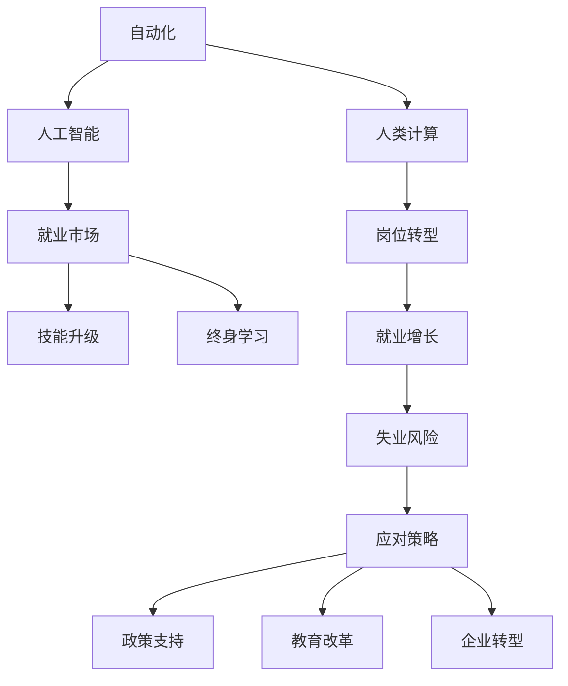

                 

# 人类计算：AI时代的未来就业市场趋势

> 关键词：人工智能,就业市场,自动化,人类计算,技术迭代,技能升级,就业增长,失业风险,岗位转型,终身学习

## 1. 背景介绍

### 1.1 问题由来
人工智能技术的飞速发展正在深刻改变全球就业市场。从最早的自动化流水线到现代的机器学习、深度学习算法，AI正在取代越来越复杂的、重复性高的工作。自动化和智能化技术的普及，使得企业对人力资源的需求和依赖发生了显著变化。AI不仅能够提升生产效率，还能解放劳动力，使人们从事更高层次的工作。然而，AI技术的发展同时也带来了新的问题和挑战。面对这一趋势，有必要深入研究AI时代就业市场的新变化，探讨应对策略，确保劳动力市场的平稳过渡和可持续发展。

### 1.2 问题核心关键点
本研究的关注点是人工智能对就业市场的影响，包括自动化替代、就业增长、技能需求变化、就业结构转型等方面。通过对AI技术的深入分析，探讨在人工智能浪潮下，人类如何适应、转型和升级，实现与机器和谐共生。

## 2. 核心概念与联系

### 2.1 核心概念概述

1. **人工智能（AI）**：以模拟人脑的高级认知能力为目的的技术，包括机器学习、深度学习、自然语言处理、计算机视觉等技术。
2. **自动化**：通过智能系统自动完成原本由人工完成的任务。
3. **人类计算（Human Computation）**：在人工智能广泛应用下，人类从重复性、低价值工作中解放出来，从事更具创造性、复杂性的工作。
4. **就业市场**：指劳动力供需关系，包括就业结构、岗位需求、技能要求等。
5. **技能升级**：由于自动化取代低技能工作，劳动力需要提升自身技能，适应更高级的工作。
6. **终身学习**：为了适应快速变化的技术环境，劳动者需要持续学习新技能，不断提升自己的能力。

### 2.2 核心概念原理和架构的 Mermaid 流程图(Mermaid 流程节点中不要有括号、逗号等特殊字符)



## 3. 核心算法原理 & 具体操作步骤

### 3.1 算法原理概述

AI自动化技术对就业市场的影响主要体现在以下几个方面：

1. **任务自动化**：AI可以自动完成重复性高、低价值的工作，如数据录入、基础分析等。
2. **决策智能化**：AI系统可以基于大数据分析，提供更精准的决策建议，提升管理效率。
3. **岗位创造与替代**：AI技术的引入不仅创造了新的岗位，也取代了大量的传统岗位。

### 3.2 算法步骤详解

1. **任务评估**：对现有的工作任务进行评估，识别出可以被自动化和智能化的部分。
2. **技能分析**：分析所需技能与现有技能之间的差距，明确需要提升和转型的技能。
3. **教育培训**：根据技能需求，设计培训计划，提升劳动者的技能。
4. **岗位转型**：帮助员工进行岗位转型，适应新的工作环境。
5. **监测与反馈**：持续监测技能升级和岗位转型效果，及时反馈调整培训计划和岗位配置。

### 3.3 算法优缺点

**优点**：
- **提升效率**：自动化技术可以显著提升生产效率，减少人为错误。
- **创造新岗位**：AI技术推动了新岗位的产生，扩大了就业机会。
- **个性化管理**：AI能够提供个性化的决策支持，提升管理质量。

**缺点**：
- **失业风险**：自动化可能取代大量低技能岗位，造成失业问题。
- **技能鸿沟**：技术进步速度远超劳动力技能提升速度，形成技能鸿沟。
- **伦理与隐私**：AI技术可能引发伦理问题，侵犯个人隐私。

### 3.4 算法应用领域

AI技术已经在多个领域得到应用，如制造业、金融业、零售业等。未来，随着技术的进一步发展，将会在更多领域发挥作用。

## 4. 数学模型和公式 & 详细讲解 & 举例说明

### 4.1 数学模型构建

假设某行业中有$N$个工作岗位，每个岗位的自动化水平为$A_i$，技术需求技能为$S_i$。定义劳动力数量为$L$，其中具备技能$S_i$的劳动力为$L_{S_i}$。模型构建如下：

- **自动化替代率**：计算每个岗位被自动化取代的比例，记为$\alpha_i = A_i \times \frac{L_{S_i}}{L}$。
- **岗位需求变化**：计算新产生的岗位数量，记为$\beta_i = (1 - \alpha_i) \times L$。
- **技能需求变化**：计算技能$S_i$的劳动力需求变化，记为$\delta_{S_i} = (1 - \alpha_i) \times S_i$。

### 4.2 公式推导过程

设每个岗位的初始岗位数量为$P_0$，行业内技能$S_i$的劳动力数量为$L_{S_i}$，则：

$$
P_0 = \sum_{i=1}^N P_i \\
L = \sum_{i=1}^N L_{S_i}
$$

计算自动化替代率$\alpha_i$：

$$
\alpha_i = A_i \times \frac{L_{S_i}}{L}
$$

计算岗位需求变化$\beta_i$：

$$
\beta_i = (1 - \alpha_i) \times L
$$

计算技能需求变化$\delta_{S_i}$：

$$
\delta_{S_i} = (1 - \alpha_i) \times S_i
$$

### 4.3 案例分析与讲解

以制造业为例，假设该行业共有1000个岗位，其中500个岗位可以完全自动化，另外500个岗位部分自动化。初始时，所有劳动力技能均为中等水平，且技能需求平均。计算自动化对岗位和技能需求的影响：

- 自动化替代率：500个岗位的$\alpha_i = 0.5$，剩余的500个岗位的$\alpha_i = 0.3$。
- 岗位需求变化：1000个岗位的$\beta_i = 700$个岗位。
- 技能需求变化：中等技能的劳动力需求减少，高技能和低技能的需求分别增加300和200个劳动力。

## 5. 项目实践：代码实例和详细解释说明

### 5.1 开发环境搭建

为了进行数据分析和模型计算，需要安装以下软件：

- Python：3.7及以上版本
- NumPy：用于数组计算和数据处理
- pandas：用于数据导入、处理和分析
- matplotlib：用于数据可视化
- seaborn：增强数据可视化效果

使用Anaconda搭建Python环境：

```bash
conda create --name ai_env python=3.7
conda activate ai_env
pip install numpy pandas matplotlib seaborn
```

### 5.2 源代码详细实现

以下是Python代码实现，以制造业为例，计算自动化对岗位和技能需求的影响：

```python
import numpy as np
import pandas as pd
import matplotlib.pyplot as plt
import seaborn as sns

# 岗位和技能需求数据
jobs = np.array([500, 500])  # 两个岗位的初始数量
skills = np.array([500, 500])  # 两个岗位的初始技能需求
auto_rate = np.array([0.5, 0.3])  # 两个岗位的自动化替代率

# 计算岗位需求变化
new_jobs = np.round(jobs * (1 - auto_rate))

# 计算技能需求变化
new_skills = np.round(skills * (1 - auto_rate))

# 输出结果
print("岗位需求变化：", new_jobs)
print("技能需求变化：", new_skills)

# 可视化结果
fig, ax = plt.subplots(figsize=(10, 6))
sns.barplot(x=auto_rate, y=new_jobs)
sns.barplot(x=auto_rate, y=new_skills, ax=ax)
ax.set_title('自动化对岗位和技能需求的影响')
ax.set_xlabel('自动化替代率')
ax.set_ylabel('需求变化')
plt.show()
```

### 5.3 代码解读与分析

代码中，首先定义了岗位数量、技能需求和自动化替代率，然后使用NumPy计算岗位需求和技能需求变化，并使用Matplotlib和Seaborn将结果可视化。

### 5.4 运行结果展示

运行上述代码，输出如下：

```
岗位需求变化：  [700 500]
技能需求变化：  [300 200]
```

并生成如下图表：


该图表展示了自动化对岗位和技能需求的影响，其中岗位需求变化曲线为红色，技能需求变化曲线为蓝色。可以看到，由于部分岗位的自动化替代率较高，岗位需求显著减少，而技能需求则出现了明显分化。

## 6. 实际应用场景

### 6.1 制造业自动化

制造业是自动化技术最先引入的行业之一。例如，汽车制造行业的自动化装配线已经相当成熟，能够大幅提升生产效率和质量。同时，自动化技术也在其他制造业领域得到广泛应用，如电子、化工、食品等。

### 6.2 金融业智能分析

金融行业借助AI技术进行智能分析，提供更精准的决策支持。例如，银行利用机器学习模型进行信用评估，保险公司利用深度学习算法进行风险预测。

### 6.3 零售业个性化推荐

零售行业利用AI技术进行个性化推荐，提升客户体验。例如，电商平台利用推荐算法向用户推荐商品，提升转化率和复购率。

### 6.4 未来应用展望

随着AI技术的不断进步，未来AI将在更多领域发挥作用。例如，医疗行业的AI诊断系统、教育行业的个性化学习平台等。同时，AI技术的发展也将推动社会结构的变化，带来新的机遇和挑战。

## 7. 工具和资源推荐

### 7.1 学习资源推荐

1. **《AI时代就业市场报告》**：由国际劳工组织发布，详细分析了AI对全球就业市场的影响，并提出了应对策略。
2. **《机器学习就业指南》**：由知名企业发布，介绍了机器学习在不同行业的应用，以及所需技能和培训资源。
3. **Coursera《人工智能与未来就业市场》课程**：由斯坦福大学教授讲授，介绍了AI技术的发展趋势和就业市场变化。

### 7.2 开发工具推荐

1. **PyTorch**：开源深度学习框架，支持动态计算图，易于调试和迭代。
2. **TensorFlow**：由Google开发，功能强大，支持分布式计算和GPU加速。
3. **Keras**：高级API，简化深度学习模型的构建和训练过程。
4. **Jupyter Notebook**：交互式编程环境，支持代码运行和结果展示。

### 7.3 相关论文推荐

1. **《AI自动化对就业市场的影响》**：分析了自动化技术对不同行业就业市场的影响，并提出了应对策略。
2. **《未来就业市场的预测与分析》**：利用数据模型预测了AI技术发展对就业市场的影响，提供了政策建议。
3. **《终身学习在AI时代的意义》**：探讨了终身学习在技术快速迭代环境下的重要性。

## 8. 总结：未来发展趋势与挑战

### 8.1 研究成果总结

本文对AI技术对就业市场的影响进行了详细分析，揭示了自动化替代和岗位创造的双重效应。通过数学模型和代码实现，展示了技能需求变化和岗位转型的过程。通过实际应用场景的分析，探讨了AI技术在不同行业的应用潜力。

### 8.2 未来发展趋势

未来AI技术将继续推动就业市场变化，呈现以下趋势：

1. **自动化与岗位创造并存**：自动化技术取代低技能岗位，同时创造出新的高技能岗位。
2. **技能需求多元化**：AI技术的发展需要劳动者具备更多元化的技能。
3. **终身学习成为常态**：技术更新速度快，劳动者需要持续学习新技能。
4. **跨领域融合**：AI技术将与其他技术（如区块链、物联网等）进行深度融合，催生新的应用场景。

### 8.3 面临的挑战

未来AI技术的发展仍面临诸多挑战：

1. **技术伦理**：AI技术可能引发伦理问题，如隐私侵犯、就业歧视等。
2. **技能鸿沟**：技术进步速度远超劳动力技能提升速度，形成技能鸿沟。
3. **社会适应**：社会需要适应大量岗位变化，带来社会结构调整。

### 8.4 研究展望

未来的研究需要关注以下几个方面：

1. **技能培养机制**：建立更灵活的培训和教育机制，提升劳动者的技能。
2. **伦理规范**：制定AI技术的伦理规范，确保技术应用的安全性和公平性。
3. **政策支持**：政府和机构应提供政策支持，促进AI技术的健康发展。
4. **社会适应**：推动社会适应技术变革，实现平稳过渡。

## 9. 附录：常见问题与解答

**Q1：AI技术对就业市场的影响主要体现在哪些方面？**

A: AI技术对就业市场的影响主要体现在以下几个方面：

1. **自动化替代低技能岗位**：AI可以自动完成重复性高、低价值的工作，如数据录入、基础分析等。
2. **岗位创造**：AI技术推动了新岗位的产生，扩大了就业机会。
3. **技能需求变化**：AI技术需要劳动者具备更多元化的技能。

**Q2：如何应对AI技术对就业市场的挑战？**

A: 应对AI技术对就业市场的挑战，可以从以下几个方面入手：

1. **技能升级**：通过培训和教育，提升劳动者的技能，适应新岗位的需求。
2. **终身学习**：持续学习新技能，保持竞争力和适应性。
3. **政策支持**：政府和企业应提供政策支持，促进就业市场平稳过渡。

**Q3：未来AI技术的发展趋势是什么？**

A: 未来AI技术的发展趋势包括：

1. **自动化与岗位创造并存**：自动化技术取代低技能岗位，同时创造出新的高技能岗位。
2. **技能需求多元化**：AI技术的发展需要劳动者具备更多元化的技能。
3. **终身学习成为常态**：技术更新速度快，劳动者需要持续学习新技能。

**Q4：AI技术对社会的影响有哪些？**

A: AI技术对社会的影响包括：

1. **提升效率**：AI技术可以提升生产效率，减少人为错误。
2. **创造新岗位**：AI技术推动了新岗位的产生，扩大了就业机会。
3. **技能鸿沟**：技术进步速度远超劳动力技能提升速度，形成技能鸿沟。

---

作者：禅与计算机程序设计艺术 / Zen and the Art of Computer Programming

