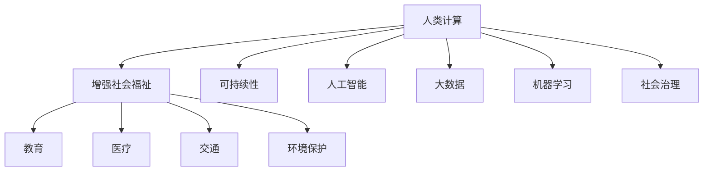

                 

# 人类计算：增强社会福祉和可持续性

> 关键词：人类计算,增强社会福祉,可持续性,人工智能,机器学习,大数据,社会治理,健康医疗

## 1. 背景介绍

在快速发展的数字化时代，技术的力量不断渗透到社会的各个角落。从医疗、教育到交通、金融，从工业生产到农业种植，技术的进步极大地提升了人类社会的生产效率和生活质量。然而，技术的发展也带来了新的挑战，如何在享受技术带来便利的同时，确保社会的可持续发展和福祉，成为一个重要的课题。

### 1.1 问题由来

技术的发展，尤其是人工智能、大数据、区块链等前沿技术的进步，为社会带来了前所未有的机遇，同时也带来了诸多挑战。这些技术的应用，虽然提高了生产效率，但同时也带来了数据隐私泄露、就业失业、环境污染等新的问题。如何在享受技术带来的便利的同时，兼顾社会的可持续发展和福祉，成为了当前社会发展面临的重要课题。

### 1.2 问题核心关键点

在数字化的背景下，人类计算的概念被赋予了新的内涵。人类计算不仅仅是指人类在计算机辅助下进行的计算工作，更涵盖了技术在社会治理、健康医疗、教育、环境保护等多个领域的应用。如何通过技术手段，有效解决社会问题，提升社会福祉，是当前研究的核心。

## 2. 核心概念与联系

### 2.1 核心概念概述

为了更好地理解人类计算在提升社会福祉和可持续发展中的作用，本节将介绍几个关键的概念及其相互联系：

- **人类计算（Human Computation）**：指在计算机辅助下，通过人类的智力和技能解决复杂问题的过程。通过将人类的智慧与计算能力结合，可以更高效地解决复杂问题。

- **增强社会福祉（Enhanced Social Welfare）**：指通过技术手段，改善人民的生活质量，提高社会整体福祉。包括改善教育、医疗、交通、环境保护等多个领域。

- **可持续性（Sustainability）**：指在经济发展的同时，保护环境，确保资源的合理利用，保障未来的可持续发展。

- **人工智能（AI）**：通过模拟人类智能行为，进行学习、推理、判断、决策等智能活动的计算机技术。在提升社会福祉和可持续性中，AI发挥着重要的作用。

- **大数据（Big Data）**：指从各种来源收集到的巨大规模的数据，通过数据分析和挖掘，可以发现新的知识，揭示潜在的规律，为决策提供支持。

- **机器学习（Machine Learning）**：指通过数据和算法训练模型，使模型具备一定的智能推理和学习能力。广泛应用于预测、分类、聚类、推荐等多个领域。

- **社会治理（Social Governance）**：指通过制定政策和法规，运用技术手段，提升社会治理的效率和公平性。

这些概念之间的逻辑关系可以通过以下Mermaid流程图来展示：



这个流程图展示了人类计算与其他关键概念之间的联系：

1. 人类计算通过AI、大数据、机器学习等技术手段，辅助解决复杂问题，提升社会福祉。
2. 社会治理通过应用这些技术，提升治理效率和公平性，保障社会的可持续发展。
3. 人工智能、大数据、机器学习等技术在社会福祉提升中发挥着重要作用。
4. 可持续性是社会福祉提升的保障，通过合理利用资源，确保未来发展的可持续性。

## 3. 核心算法原理 & 具体操作步骤
### 3.1 算法原理概述

人类计算的核心算法原理，主要围绕着通过技术手段，提升人类解决复杂问题的能力。这包括通过数据分析、模型训练、智能推理等技术手段，有效解决各种社会问题，提升社会福祉和可持续性。

在具体的算法实现中，可以将其分为以下几个关键步骤：

1. **数据采集与预处理**：通过各种传感器、互联网等手段，收集相关的数据，并进行清洗、去重、归一化等预处理工作。

2. **模型训练与优化**：选择合适的算法和模型，通过训练数据进行模型训练和优化，使得模型能够准确地预测和推理。

3. **智能推理与决策**：在训练好的模型基础上，通过推理和决策，提供智能化的解决方案，提升社会福祉和可持续性。

### 3.2 算法步骤详解

以下是具体的算法步骤详解：

**Step 1: 数据采集与预处理**

- **数据来源**：包括传感器数据、互联网数据、社交媒体数据等。通过API接口、爬虫等方式进行数据采集。
- **数据清洗**：去除噪声数据、缺失数据、重复数据等，确保数据的质量。
- **特征工程**：通过特征选择、特征提取、特征变换等技术手段，提高数据的表现力。

**Step 2: 模型训练与优化**

- **模型选择**：根据具体问题选择合适的模型，如决策树、支持向量机、深度学习模型等。
- **训练数据**：选择有代表性的训练数据集，进行模型训练。
- **超参数调优**：通过交叉验证、网格搜索等方法，选择最优的超参数，提升模型性能。

**Step 3: 智能推理与决策**

- **推理引擎**：通过推理引擎，将模型预测结果转化为可操作的决策。
- **决策支持**：结合专家知识、规则库等，提供综合决策支持。

### 3.3 算法优缺点

人类计算算法在提升社会福祉和可持续性方面，具有以下优点：

1. **高效性**：通过技术手段，高效解决复杂问题，提升社会福祉和可持续性。
2. **智能化**：通过智能推理和决策，提供更具预测性和预防性的解决方案。
3. **可扩展性**：基于可复用的算法和模型，可以灵活扩展到不同的应用场景。

同时，也存在一些缺点：

1. **依赖高质量数据**：数据采集和预处理的准确性直接影响模型性能。
2. **模型复杂性**：复杂问题需要构建高阶模型，模型训练和调优难度较大。
3. **伦理与安全问题**：算法的透明性和可解释性不足，可能引发伦理和安全问题。
4. **资源消耗大**：数据采集、模型训练、推理等环节需要大量计算资源，成本较高。

### 3.4 算法应用领域

人类计算算法在多个领域中得到广泛应用，包括但不限于以下几个方面：

- **教育**：通过数据分析，优化教学内容和评估方法，提升教育质量。
- **医疗**：通过图像识别、自然语言处理等技术，提升疾病诊断和预防能力。
- **交通**：通过智能交通管理，提高交通效率和安全性。
- **环境保护**：通过数据分析和智能推理，实现资源优化和环境监测。
- **金融**：通过大数据分析，提升风险管理和金融服务水平。
- **农业**：通过智能农业管理，提高生产效率和资源利用率。
- **城市治理**：通过智能城市管理，提升城市服务水平和生活质量。

## 4. 数学模型和公式 & 详细讲解 & 举例说明

### 4.1 数学模型构建

在具体的应用场景中，我们可以构建不同的数学模型来解决具体问题。以医疗诊断为例，可以构建以下数学模型：

- **回归模型**：通过建立线性回归或多项式回归模型，预测疾病的发生概率。
- **分类模型**：通过逻辑回归、支持向量机等分类模型，将疾病分为不同类型。
- **聚类模型**：通过K-means、层次聚类等聚类算法，将患者分为不同的群体。
- **时间序列模型**：通过ARIMA、LSTM等时间序列模型，预测疾病的发展趋势。

### 4.2 公式推导过程

以回归模型为例，线性回归的公式推导如下：

设 $x_1, x_2, ..., x_n$ 为自变量，$y$ 为因变量，$b_0, b_1, ..., b_p$ 为回归系数，则线性回归模型的公式为：

$$
y = b_0 + b_1x_1 + b_2x_2 + ... + b_px_p + \epsilon
$$

其中 $\epsilon$ 为随机误差项，满足 $E(\epsilon) = 0$，$Var(\epsilon) = \sigma^2$。

通过最小二乘法，求解回归系数 $b_0, b_1, ..., b_p$，使得 $y$ 的预测值 $\hat{y}$ 与实际值 $y$ 的误差平方和最小：

$$
\sum_{i=1}^n (y_i - \hat{y}_i)^2 = \min
$$

其中 $\hat{y}_i = b_0 + b_1x_{i1} + b_2x_{i2} + ... + b_px_{ip}$。

通过求解该最小化问题，得到回归系数 $b_0, b_1, ..., b_p$，从而构建线性回归模型。

### 4.3 案例分析与讲解

以医疗领域中的疾病预测为例，通过线性回归模型，可以预测某患者的疾病发生概率。具体步骤如下：

1. **数据采集**：收集患者的年龄、性别、体重、血压、血糖等生理指标，以及相关疾病的诊断信息。
2. **数据预处理**：对数据进行清洗、归一化等预处理操作。
3. **模型训练**：构建线性回归模型，使用训练数据进行模型训练和调优。
4. **模型应用**：将待预测患者的生理指标输入模型，预测其疾病发生概率。

通过以上步骤，可以有效提升疾病预测的准确性和效率，为医生提供决策支持，提升医疗服务质量。

## 5. 项目实践：代码实例和详细解释说明

### 5.1 开发环境搭建

在进行人类计算实践前，我们需要准备好开发环境。以下是使用Python进行TensorFlow开发的环境配置流程：

1. 安装Anaconda：从官网下载并安装Anaconda，用于创建独立的Python环境。

2. 创建并激活虚拟环境：
```bash
conda create -n tf-env python=3.8 
conda activate tf-env
```

3. 安装TensorFlow：根据CUDA版本，从官网获取对应的安装命令。例如：
```bash
conda install tensorflow -c conda-forge -c pypi
```

4. 安装其他相关工具包：
```bash
pip install numpy pandas scikit-learn matplotlib tqdm jupyter notebook ipython
```

完成上述步骤后，即可在`tf-env`环境中开始人类计算实践。

### 5.2 源代码详细实现

下面以医疗领域的疾病预测为例，给出使用TensorFlow进行线性回归模型训练和应用的PyTorch代码实现。

首先，定义数据处理函数：

```python
import numpy as np
import pandas as pd
from sklearn.model_selection import train_test_split
from sklearn.preprocessing import StandardScaler
import tensorflow as tf

def load_data():
    data = pd.read_csv('data.csv')
    X = data.drop('disease', axis=1)
    y = data['disease']
    X_train, X_test, y_train, y_test = train_test_split(X, y, test_size=0.2, random_state=42)
    scaler = StandardScaler()
    X_train = scaler.fit_transform(X_train)
    X_test = scaler.transform(X_test)
    return X_train, y_train, X_test, y_test
```

然后，定义模型和优化器：

```python
def build_model(input_dim):
    model = tf.keras.Sequential([
        tf.keras.layers.Dense(32, activation='relu', input_dim=input_dim),
        tf.keras.layers.Dense(16, activation='relu'),
        tf.keras.layers.Dense(1, activation='sigmoid')
    ])
    return model

def compile_model(model):
    optimizer = tf.keras.optimizers.Adam(learning_rate=0.001)
    model.compile(optimizer=optimizer, loss='binary_crossentropy', metrics=['accuracy'])

def train_model(model, X_train, y_train):
    model.fit(X_train, y_train, epochs=10, batch_size=32, validation_data=(X_test, y_test))
```

最后，启动训练流程：

```python
X_train, y_train, X_test, y_test = load_data()

input_dim = X_train.shape[1]
model = build_model(input_dim)
compile_model(model)
train_model(model, X_train, y_train)

test_loss, test_acc = model.evaluate(X_test, y_test)
print(f'Test loss: {test_loss}, Test accuracy: {test_acc}')
```

以上就是使用TensorFlow进行线性回归模型训练的完整代码实现。可以看到，TensorFlow提供了便捷的API接口和丰富的模型库，使得模型构建和训练变得更加简单高效。

### 5.3 代码解读与分析

让我们再详细解读一下关键代码的实现细节：

**load_data函数**：
- 读取数据集，提取特征和标签，并划分训练集和测试集。
- 对特征进行标准化处理，确保模型训练的稳定性。

**build_model函数**：
- 定义神经网络模型结构，包括输入层、隐藏层和输出层。
- 使用ReLU激活函数提高模型表达能力，使用sigmoid激活函数适应二分类任务。

**compile_model函数**：
- 选择合适的优化器和学习率，定义损失函数和评价指标。
- 编译模型，准备训练。

**train_model函数**：
- 训练模型，设置迭代次数和批次大小。
- 在测试集上评估模型性能，输出模型精度和损失。

可以看到，TensorFlow提供了强大的模型构建和训练功能，使得模型的实现和调试变得更加便捷。

## 6. 实际应用场景

### 6.1 智能医疗

在智能医疗领域，人类计算技术可以应用于疾病预测、健康监测、个性化治疗等多个方面。通过数据分析和模型训练，可以有效提升医疗服务的质量和效率，改善患者的健康状况。

具体而言，可以收集患者的电子病历、生理指标、基因信息等数据，构建医疗模型，进行疾病预测和风险评估。通过智能医疗设备，实时监测患者的生理状态，及时调整治疗方案，实现个性化医疗。

### 6.2 智慧城市

智慧城市建设是当前城市发展的重要方向。通过人类计算技术，可以实现城市管理的智能化和精细化，提升城市治理的效率和质量。

具体应用场景包括智能交通管理、环境监测、智能安防等。通过传感器、视频监控等手段，采集城市运行数据，构建城市模型，进行实时分析和决策。通过AI算法，优化交通流量、提升环境质量、保障公共安全，提升城市居民的幸福感和满意度。

### 6.3 智能农业

农业是关系国计民生的重要领域，通过人类计算技术，可以实现农业生产的智能化和精准化，提升农业生产效率和资源利用率。

具体应用场景包括智能种植、智能灌溉、病虫害监测等。通过传感器和无人机等技术手段，采集农业生产数据，构建农业模型，进行智能分析和决策。通过精准施药、智能灌溉等措施，提升农业生产效率，保障粮食安全。

### 6.4 未来应用展望

随着人类计算技术的不断进步，其在提升社会福祉和可持续性方面的应用前景更加广阔。未来，人类计算技术将在以下领域得到更广泛的应用：

- **智能交通**：通过智能交通管理，优化交通流量，提升出行效率，减少环境污染。
- **智能安防**：通过智能安防系统，实时监测城市运行状态，保障公共安全。
- **智能制造**：通过智能制造技术，优化生产流程，提升生产效率，减少资源浪费。
- **智能服务**：通过智能服务系统，提升客户体验，提升服务质量。
- **智能教育**：通过智能教育系统，个性化推荐学习内容，提升学习效果。

## 7. 工具和资源推荐

### 7.1 学习资源推荐

为了帮助开发者系统掌握人类计算的理论基础和实践技巧，这里推荐一些优质的学习资源：

1. 《深度学习》系列书籍：由多位深度学习专家共同编写，深入浅出地介绍了深度学习的基本概念和算法原理。

2. TensorFlow官方文档：TensorFlow的官方文档，提供了完整的API接口和丰富的示例代码，是学习TensorFlow的重要资源。

3. Coursera深度学习课程：Coursera提供的深度学习课程，由斯坦福大学教授Andrew Ng主讲，深入浅出地介绍了深度学习的基本概念和算法原理。

4. Kaggle竞赛：Kaggle平台提供了大量的数据集和竞赛任务，通过参与竞赛，可以提升数据处理和模型训练的能力。

5. Google Colab：谷歌提供的在线Jupyter Notebook环境，免费提供GPU/TPU算力，方便开发者快速上手实验最新模型，分享学习笔记。

通过对这些资源的学习实践，相信你一定能够快速掌握人类计算的精髓，并用于解决实际的复杂问题。

### 7.2 开发工具推荐

高效的开发离不开优秀的工具支持。以下是几款用于人类计算开发的常用工具：

1. TensorFlow：由Google主导开发的深度学习框架，支持分布式计算，适合大规模工程应用。

2. PyTorch：由Facebook主导开发的深度学习框架，灵活动态的计算图，适合快速迭代研究。

3. Scikit-learn：基于NumPy和SciPy的机器学习库，提供了丰富的算法和工具，适合快速搭建机器学习模型。

4. OpenCV：开源计算机视觉库，提供了丰富的图像处理和计算机视觉算法，适合图像处理任务。

5. Apache Spark：分布式计算框架，支持大数据处理和分析，适合处理海量数据。

6. Jupyter Notebook：开源的交互式笔记本环境，支持Python、R等多种语言，适合数据科学和机器学习开发。

合理利用这些工具，可以显著提升人类计算任务的开发效率，加快创新迭代的步伐。

### 7.3 相关论文推荐

人类计算技术的发展离不开学界的持续研究。以下是几篇奠基性的相关论文，推荐阅读：

1. "Human Computation in the Age of AI" by Yann LeCun：阐述了人类计算在AI时代的重要地位和应用前景。

2. "Deep Learning for Healthcare" by Yoshua Bengio：讨论了深度学习在医疗健康领域的应用，展示了人类计算在提升医疗服务中的潜力。

3. "Intelligent Transportation Systems: Overview and Future Directions" by Peter Knapp：介绍了智能交通系统的应用，展示了人类计算在提升交通效率和环保方面的作用。

4. "Big Data Mining in Environmental Science: An Overview" by Yuehua Guo：讨论了大数据在环境保护中的应用，展示了人类计算在提升环境治理中的作用。

5. "Social Computing: Networking Methods and Applications" by Satoru Miyamoto：介绍了社交计算的概念和应用，展示了人类计算在提升社会福祉中的作用。

这些论文代表了大数据、机器学习、AI等技术的发展脉络。通过学习这些前沿成果，可以帮助研究者把握学科前进方向，激发更多的创新灵感。

## 8. 总结：未来发展趋势与挑战

### 8.1 研究成果总结

本文对人类计算在提升社会福祉和可持续性方面的应用进行了全面系统的介绍。首先阐述了人类计算的概念及其重要性，明确了人类计算在提升社会福祉和可持续性方面的独特价值。其次，从原理到实践，详细讲解了人类计算的数学模型和核心算法，给出了人类计算任务开发的完整代码实例。同时，本文还广泛探讨了人类计算在医疗、交通、环境等多个领域的应用前景，展示了人类计算范式的广阔前景。

通过本文的系统梳理，可以看到，人类计算技术正在成为解决复杂问题的有效手段，为提升社会福祉和可持续性提供了新的途径。未来，伴随人类计算技术的不断进步，相信社会治理、健康医疗、智能交通等领域将迎来新的变革，带来更加美好的人类未来。

### 8.2 未来发展趋势

展望未来，人类计算技术将呈现以下几个发展趋势：

1. **数据智能化**：随着数据采集和处理技术的进步，数据的智能化程度将不断提高，通过数据挖掘和模型训练，发现更多隐藏的知识和规律。

2. **模型泛化性**：人类计算模型将具备更强的泛化能力，能够适应更加复杂和多样化的应用场景。

3. **跨领域应用**：人类计算技术将跨越不同的领域，实现更广泛的应用。例如，在医疗、交通、农业等领域，结合领域知识，提升应用效果。

4. **多模态融合**：人类计算将融合多种模态数据，如文本、图像、声音等，提升模型的综合感知能力。

5. **实时计算**：人类计算将具备更强的实时计算能力，能够及时响应和处理复杂问题。

6. **人机协同**：人类计算将实现人机协同，通过人机交互，优化计算过程，提升计算效果。

### 8.3 面临的挑战

尽管人类计算技术已经取得了显著进展，但在迈向更加智能化、普适化应用的过程中，它仍面临诸多挑战：

1. **数据隐私和安全**：大规模数据采集和处理可能引发隐私泄露和安全问题，如何保障数据隐私和安全，将是重要课题。

2. **模型复杂度**：复杂问题需要构建高阶模型，模型训练和调优难度较大，如何降低模型复杂度，提升计算效率，将是重要课题。

3. **伦理和法律**：算法的透明性和可解释性不足，可能引发伦理和法律问题，如何提升算法的透明性和可解释性，将是重要课题。

4. **计算资源**：数据采集和处理、模型训练和推理等环节需要大量计算资源，如何优化资源消耗，降低成本，将是重要课题。

5. **模型泛化能力**：模型在不同领域和场景中的泛化能力不足，如何提升模型的泛化能力，将是重要课题。

6. **人机协同**：人机协同的机制和算法需要进一步优化，如何优化人机交互，提升计算效果，将是重要课题。

### 8.4 研究展望

面对人类计算面临的种种挑战，未来的研究需要在以下几个方面寻求新的突破：

1. **数据采集和处理技术**：进一步提升数据采集和处理的智能化和自动化水平，减少人工干预，提高数据质量和处理效率。

2. **模型构建和训练方法**：开发更加高效、简单的模型构建和训练方法，降低模型复杂度，提升计算效率。

3. **模型透明性和可解释性**：提升模型的透明性和可解释性，增强算法的可信度和可接受性。

4. **跨领域应用技术**：开发跨领域的算法和工具，实现不同领域之间的知识和信息整合，提升应用效果。

5. **实时计算和响应**：提升实时计算和响应的能力，实现更快速、更精准的计算和决策。

6. **人机协同技术**：开发人机协同的机制和算法，增强人机交互的流畅性和效率，提升计算效果。

这些研究方向将引领人类计算技术迈向更高的台阶，为提升社会福祉和可持续性提供新的动力。只有积极应对挑战，不断创新突破，才能真正实现人类计算技术的广泛应用，构建更加美好的人类未来。

## 9. 附录：常见问题与解答

**Q1: 人类计算是否适用于所有领域？**

A: 人类计算技术适用于大多数领域，但其效果受到数据质量和模型复杂度的影响。对于数据量较小、复杂度较低的领域，可能效果不佳。此外，对于一些需要高度专业知识的应用，如医疗、法律等，需要结合领域知识进行优化。

**Q2: 如何提升模型的泛化能力？**

A: 提升模型的泛化能力需要从数据采集、模型设计、模型训练等多个环节进行优化。具体措施包括：
- 数据采集：采集更多样化的数据，提高数据的多样性和代表性。
- 模型设计：选择更合适的模型结构和特征工程方法，提升模型的表达能力。
- 模型训练：使用迁移学习、集成学习等方法，提升模型的泛化能力。
- 模型评估：使用更多的评估指标和方法，全面评估模型的性能。

**Q3: 数据采集和处理中的隐私保护问题如何解决？**

A: 数据隐私保护是当前研究的重要方向之一。具体措施包括：
- 匿名化处理：对数据进行匿名化处理，保护用户隐私。
- 差分隐私：在数据处理过程中引入噪声，防止数据泄露。
- 加密存储：对敏感数据进行加密存储，防止数据泄露。
- 数据最小化：只采集和使用必要的数据，减少数据泄露风险。

**Q4: 如何提升计算效率？**

A: 提升计算效率需要从数据预处理、模型构建、模型训练等多个环节进行优化。具体措施包括：
- 数据预处理：优化数据预处理流程，减少数据处理时间。
- 模型构建：选择更简单、高效的模型结构和算法。
- 模型训练：使用分布式计算、混合精度训练等技术，提升训练效率。
- 模型压缩：对模型进行压缩和优化，减小模型大小，提升推理速度。

**Q5: 人类计算技术在实际应用中应注意哪些问题？**

A: 在实际应用中，人类计算技术需要注意以下几个问题：
- 数据质量：确保数据的质量和可靠性，防止数据噪音和偏差。
- 模型透明性：提高模型的透明性和可解释性，增强算法的可信度。
- 人机协同：优化人机交互机制，提升用户体验和满意度。
- 伦理和法律：遵守相关伦理和法律规定，防止算法滥用。

通过解决这些常见问题，可以更好地应用人类计算技术，提升社会福祉和可持续性。

---

作者：禅与计算机程序设计艺术 / Zen and the Art of Computer Programming

