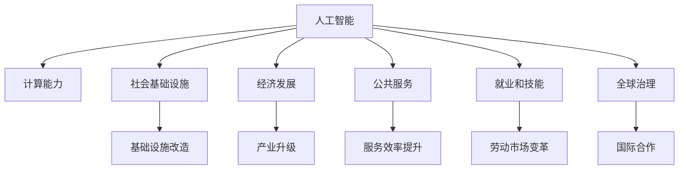

                 

# 人类计算：对社会和经济的影响

> 关键词：人工智能,计算能力,社会变革,经济发展,未来趋势

## 1. 背景介绍

### 1.1 问题由来
在数字化和信息化的浪潮下，计算能力已经成为推动社会进步和经济发展的关键力量。随着人工智能(AI)技术的不断突破，人类计算能力已经远远超越了以往任何一个时代。从工业生产到科学研究，从医疗卫生到金融服务，每一个领域都受到了AI计算能力的深刻影响。然而，这一力量究竟如何塑造了现代社会，又面临哪些挑战？本文旨在全面探讨人类计算对社会和经济的影响，并分析未来趋势。

### 1.2 问题核心关键点
本文的核心问题围绕人类计算能力在社会经济发展中的作用展开，具体包括以下几个关键点：
- 人类计算如何改变了现代社会的基础设施、组织结构和产业生态。
- 计算能力的提升如何推动了大数据、云计算、物联网等新技术的发展，进而影响经济结构和商业模式。
- 计算技术在改善公共服务和提升个体生活质量方面的具体应用。
- 计算能力增长对就业、技能需求和教育的影响。
- 未来几十年，人类计算能力的潜力及其对全球社会经济的潜在影响。

## 2. 核心概念与联系

### 2.1 核心概念概述

为更好地理解人类计算对社会经济的影响，本文将介绍几个关键概念及其相互关系：

- **人工智能(AI)**：利用计算机系统模拟人类智能的行为，包括感知、推理、学习、决策等能力。
- **计算能力**：指计算机系统执行特定任务的速度和效率，是AI技术发展的基础。
- **社会基础设施**：包括交通、通信、能源等领域的设施，计算能力的提升对其结构和效率有重要影响。
- **经济发展**：基于生产要素的投入和产出关系，计算能力作为生产要素之一，对经济增长模式和经济结构有深远影响。
- **公共服务**：如医疗、教育、交通等领域的服务，计算能力可以大幅提升这些服务的效率和质量。
- **就业和技能**：计算能力的提升改变了劳动市场的供需关系，对就业结构、技能需求和教育体系产生影响。
- **全球治理**：计算能力在全球范围内的分布和应用，对国家间的合作与竞争、国际法规制定等有重要影响。

这些核心概念之间的逻辑关系可以通过以下Mermaid流程图来展示：



这个流程图展示了人工智能技术通过计算能力提升，对社会基础设施、经济发展、公共服务、就业和技能、以及全球治理各个方面的影响。

## 3. 核心算法原理 & 具体操作步骤

### 3.1 算法原理概述

人类计算能力的提升主要依赖于两个核心技术：计算机硬件的进步和算法设计的创新。通过高性能计算机和先进算法，AI系统可以处理海量的数据，执行复杂的计算任务，并在各个领域发挥作用。

在AI领域，深度学习是最为关键的算法之一。深度学习通过多层神经网络模型，可以自动学习数据中的特征，实现分类、识别、预测等任务。这一算法在图像识别、自然语言处理、语音识别等领域取得了突破性进展，并广泛应用于社会经济的各个层面。

### 3.2 算法步骤详解

人类计算的核心算法步骤包括以下几个关键环节：

1. **数据收集和预处理**：收集各种类型的数据，如文本、图像、音频等，并通过清洗、标注等步骤准备用于训练模型。
2. **模型训练**：使用大规模数据集训练深度学习模型，通过反向传播算法调整模型参数，使其能够准确预测新数据。
3. **模型优化和调参**：通过交叉验证等方法，优化模型参数和超参数，提升模型性能。
4. **模型部署和应用**：将训练好的模型部署到实际应用中，如智能客服、自动驾驶、智能制造等，提供高效的计算服务。
5. **监控和迭代**：持续监控模型性能，根据实际应用反馈进行模型迭代和优化。

### 3.3 算法优缺点

人类计算能力具有以下优点：
- 提升效率：自动化处理大量重复性任务，大幅提升工作效率。
- 降低成本：减少人力和时间成本，提高资源利用效率。
- 创造新价值：通过数据分析和模式识别，创造新的商业模式和服务。

同时，人类计算能力也面临以下挑战：
- 技术复杂性：需要高水平的工程和算法能力，对人才需求高。
- 数据隐私和安全：大规模数据处理可能涉及隐私泄露和数据安全问题。
- 社会伦理：计算能力可能加剧社会不平等，产生就业和伦理问题。
- 依赖硬件：计算能力高度依赖于硬件性能，存在技术瓶颈。

### 3.4 算法应用领域

人类计算能力在多个领域得到广泛应用，以下是几个典型应用场景：

- **医疗健康**：AI辅助诊断、个性化治疗、智能健康管理等。
- **金融服务**：算法交易、风险管理、客户服务等。
- **制造业**：智能制造、预测性维护、供应链优化等。
- **物流和交通**：智能仓储、无人驾驶、交通流量优化等。
- **教育**：个性化教育、自动批改、智能辅助教学等。
- **媒体和娱乐**：内容推荐、视频分析、虚拟现实等。

## 4. 数学模型和公式 & 详细讲解 & 举例说明

### 4.1 数学模型构建

本文以深度学习模型为例，构建一个简单的线性回归模型，用于理解计算能力在数据分析和预测中的应用。线性回归模型的一般形式为：

$$
y = w_0 + w_1x_1 + w_2x_2 + \ldots + w_nx_n + \epsilon
$$

其中，$y$ 为目标变量，$x_i$ 为输入变量，$w_i$ 为模型参数，$\epsilon$ 为随机误差项。

### 4.2 公式推导过程

线性回归模型的参数估计通常使用最小二乘法（Ordinary Least Squares, OLS），其目标是最小化预测误差。具体公式为：

$$
\hat{w} = (X^TX)^{-1}X^Ty
$$

其中，$\hat{w}$ 为模型参数的估计值，$X$ 为输入变量矩阵，$y$ 为目标变量向量。

### 4.3 案例分析与讲解

以房价预测为例，假设已知房屋面积$x_1$、房间数量$x_2$、地理位置$x_3$与房价$y$的关系，可以通过收集大量历史房价数据，使用线性回归模型进行预测。在模型训练过程中，可以通过计算误差最小化来估计模型参数，并在新房屋数据上验证预测效果。

## 5. 项目实践：代码实例和详细解释说明

### 5.1 开发环境搭建

在进行项目实践前，我们需要准备好开发环境。以下是使用Python进行TensorFlow和Keras进行线性回归模型开发的详细步骤：

1. 安装Anaconda：从官网下载并安装Anaconda，用于创建独立的Python环境。

2. 创建并激活虚拟环境：
```bash
conda create -n tf-env python=3.8 
conda activate tf-env
```

3. 安装TensorFlow和Keras：
```bash
pip install tensorflow==2.4
pip install keras
```

4. 安装各类工具包：
```bash
pip install numpy pandas scikit-learn matplotlib tqdm jupyter notebook ipython
```

完成上述步骤后，即可在`tf-env`环境中开始项目实践。

### 5.2 源代码详细实现

下面是一个简单的线性回归模型的Python代码实现：

```python
import tensorflow as tf
from keras.models import Sequential
from keras.layers import Dense

# 准备数据
X_train = [1.0, 1.2, 1.4, 1.6, 1.8]
y_train = [1.2, 1.3, 1.5, 1.8, 2.0]

# 构建模型
model = Sequential()
model.add(Dense(units=1, input_dim=1, kernel_initializer='random_uniform'))
model.compile(optimizer=tf.train.AdamOptimizer(0.01), loss='mse')

# 训练模型
model.fit(X_train, y_train, epochs=500, batch_size=1, verbose=0)

# 预测
X_test = [1.7, 1.8, 1.9, 2.0, 2.1]
y_pred = model.predict(X_test)
```

### 5.3 代码解读与分析

让我们再详细解读一下关键代码的实现细节：

- **数据准备**：使用numpy数组准备训练数据。
- **模型构建**：使用Keras的Sequential模型，添加一层全连接层，使用随机均匀初始化器。
- **模型编译**：选择Adam优化器，损失函数为均方误差。
- **模型训练**：使用fit方法进行模型训练，设置epochs和batch_size。
- **模型预测**：使用predict方法对新数据进行预测。

## 6. 实际应用场景

### 6.1 智能医疗

计算能力在医疗领域的应用可以显著提升诊断和治疗的效率和准确性。例如，AI辅助影像诊断可以通过深度学习算法分析医学影像，快速识别出肿瘤、骨折等病变。AI还可以在电子病历中挖掘病历数据，发现潜在风险，提供个性化治疗方案。这些应用不仅提升了医疗服务的质量，还降低了医疗成本。

### 6.2 金融服务

计算能力在金融领域的应用包括算法交易、风险管理、客户服务等。AI可以分析大量金融数据，发现市场趋势，自动执行交易策略，提高交易效率和收益。同时，AI还可以用于信用评估、反欺诈检测等风险管理任务，保护金融机构的安全。

### 6.3 智能制造

智能制造是计算能力在制造业中的应用之一，通过传感器、物联网设备收集生产数据，AI可以实时监控生产流程，预测设备故障，优化生产计划，提高生产效率和产品质量。AI还可以用于供应链优化，减少库存成本，提升供应链的响应速度。

### 6.4 智慧城市

智慧城市建设是计算能力在城市管理中的应用，通过大数据分析、物联网技术，AI可以优化城市交通、提升公共安全、改善环境质量等。例如，智慧交通系统可以实时监控交通流量，动态调整交通信号灯，减少交通拥堵。智慧安防系统可以分析视频监控数据，及时发现异常行为，提高公共安全。

## 7. 工具和资源推荐

### 7.1 学习资源推荐

为了帮助开发者系统掌握人类计算的相关知识，这里推荐一些优质的学习资源：

1. 《深度学习》（Ian Goodfellow, Yoshua Bengio, Aaron Courville）：深度学习的经典教材，系统介绍了深度学习的原理和应用。
2. 《机器学习》（Tom Mitchell）：机器学习的入门教材，介绍了机器学习的各种算法和应用。
3. 《人工智能基础》（周志华）：国内著名AI专家编写的教材，涵盖人工智能的多个方面。
4. TensorFlow官方文档：TensorFlow的官方文档，提供了丰富的示例和教程，是学习TensorFlow的最佳资源。
5. Coursera上的“Deep Learning Specialization”：由Andrew Ng教授主讲，涵盖深度学习从入门到高级的多个课程。

通过对这些资源的学习实践，相信你一定能够全面掌握人类计算的相关知识，并用于解决实际的计算问题。

### 7.2 开发工具推荐

高效的开发离不开优秀的工具支持。以下是几款用于人类计算开发的常用工具：

1. TensorFlow：由Google主导开发的开源深度学习框架，生产部署方便，适合大规模工程应用。

2. PyTorch：基于Python的开源深度学习框架，灵活动态的计算图，适合快速迭代研究。

3. Keras：Keras的高级API，简化深度学习模型的开发，易于上手。

4. Weights & Biases：模型训练的实验跟踪工具，可以记录和可视化模型训练过程中的各项指标，方便对比和调优。

5. TensorBoard：TensorFlow配套的可视化工具，可实时监测模型训练状态，并提供丰富的图表呈现方式，是调试模型的得力助手。

6. Jupyter Notebook：Python代码的交互式开发环境，方便编写和调试代码。

合理利用这些工具，可以显著提升人类计算任务的开发效率，加快创新迭代的步伐。

### 7.3 相关论文推荐

人类计算技术的发展源于学界的持续研究。以下是几篇奠基性的相关论文，推荐阅读：

1. 《ImageNet Classification with Deep Convolutional Neural Networks》：AlexNet论文，展示了深度卷积神经网络在图像分类任务上的突破性表现。

2. 《Learning to Play Go without Human Knowledge》：AlphaGo论文，展示了深度强化学习在复杂博弈游戏中的应用。

3. 《Attention is All You Need》：Transformer论文，提出了自注意力机制，显著提升了自然语言处理模型的效果。

4. 《A Survey of Deep Learning for Drug Discovery》：综述了深度学习在药物发现中的应用，展示了计算能力在医学研究中的潜力。

5. 《AlphaGo Zero: Mastering the Game of Go without Human Knowledge》：AlphaGo Zero论文，展示了无需人类知识即可掌握围棋游戏的新技术。

这些论文代表了大规模计算技术的发展脉络。通过学习这些前沿成果，可以帮助研究者把握学科前进方向，激发更多的创新灵感。

## 8. 总结：未来发展趋势与挑战

### 8.1 总结

本文对人类计算能力的提升及其对社会经济的影响进行了全面系统的介绍。首先阐述了计算能力作为人工智能技术的重要组成部分，如何推动了社会基础设施的现代化，经济结构的升级，以及公共服务水平的提升。其次，从原理到实践，详细讲解了人类计算的核心算法步骤和具体应用。最后，分析了计算能力在就业、技能需求、全球治理等方面的深远影响。

通过本文的系统梳理，可以看到，人类计算能力在提升生产效率、促进经济发展、改善公共服务、创造新的商业模式等方面发挥了重要作用。然而，其发展也面临诸多挑战，如技术复杂性、数据隐私、社会伦理、硬件依赖等问题。未来，计算能力的持续提升将进一步推动社会的全面进步，但同时也需要科技工作者和政策制定者共同努力，应对各种挑战，确保人类计算能力的健康发展。

### 8.2 未来发展趋势

展望未来，人类计算能力将呈现以下几个发展趋势：

1. **计算速度的持续提升**：随着硬件性能的不断提升，计算速度将大幅提高，支持更加复杂和高强度的计算任务。

2. **计算能力的泛化**：计算能力将从单一领域向多领域扩展，支持更广泛的计算应用，如量子计算、生物计算等。

3. **计算能力的普适化**：计算能力将更加普及，不再局限于特定行业或组织，而是广泛应用到日常生活和社会治理中。

4. **计算能力的智能化**：计算能力将与AI技术进一步融合，支持更加智能化的计算过程，如自动决策、自适应学习等。

5. **计算能力的安全性**：随着计算能力的提升，数据隐私和安全问题将更加突出，需要构建更加安全可靠的计算环境。

6. **计算能力的伦理考量**：计算能力在提升社会福祉的同时，也可能带来伦理和道德问题，需要制定相应的规范和标准。

以上趋势凸显了人类计算能力的广阔前景。这些方向的探索发展，必将进一步推动计算能力在社会各个领域的广泛应用，为人类社会带来更多创新和机遇。

### 8.3 面临的挑战

尽管人类计算能力已经取得了显著进展，但在迈向更加智能化、普适化应用的过程中，仍面临诸多挑战：

1. **技术复杂性**：计算能力的提升需要高水平的工程和算法能力，对人才需求高。

2. **数据隐私和安全**：大规模数据处理可能涉及隐私泄露和数据安全问题，需要构建更加安全可靠的计算环境。

3. **社会伦理**：计算能力可能加剧社会不平等，产生就业和伦理问题，需要制定相应的规范和标准。

4. **硬件依赖**：计算能力高度依赖于硬件性能，存在技术瓶颈，需要不断提升硬件性能和计算效率。

5. **伦理和道德**：计算能力在提升社会福祉的同时，也可能带来伦理和道德问题，需要制定相应的规范和标准。

6. **社会适应性**：计算能力的提升可能带来职业和教育结构的变化，需要社会各界共同努力，帮助人们适应新的计算环境。

正视这些挑战，积极应对并寻求突破，将是大规模计算能力发展的重要任务。相信随着学界和产业界的共同努力，这些挑战终将一一被克服，人类计算能力必将在构建智能社会中扮演越来越重要的角色。

### 8.4 研究展望

面对人类计算能力的发展，未来的研究需要在以下几个方面寻求新的突破：

1. **计算能力的普适化**：推动计算能力向更加广泛的应用领域普及，提升计算资源的可访问性和可利用性。

2. **计算能力的智能化**：开发更加智能化的计算算法，支持自适应学习、自动决策等高级计算过程。

3. **计算能力的安全性**：构建更加安全可靠的计算环境，确保数据隐私和计算过程的安全性。

4. **计算能力的伦理考量**：制定相应的规范和标准，确保计算能力的发展符合社会伦理和道德。

5. **计算能力的适应性**：推动计算能力与教育体系的结合，培养具备计算能力的人才，提升社会的适应性。

6. **计算能力的跨领域融合**：推动计算能力与各领域的融合，如生物计算、量子计算等，探索计算能力的边界。

这些研究方向将引领人类计算能力迈向更高的台阶，为构建智能社会和推动社会进步提供更强大的计算支持。

## 9. 附录：常见问题与解答

**Q1：人类计算能力是如何提升生产效率的？**

A: 人类计算能力通过自动化和智能化处理大规模数据和复杂任务，大幅提升了生产效率。例如，在制造业中，通过物联网设备和传感器收集生产数据，AI可以实时监控生产流程，预测设备故障，优化生产计划，提高生产效率和产品质量。在金融领域，AI可以分析大量金融数据，发现市场趋势，自动执行交易策略，提高交易效率和收益。

**Q2：计算能力的提升对就业和技能需求有何影响？**

A: 计算能力的提升改变了劳动市场的供需关系，对就业和技能需求产生了深远影响。一方面，计算能力的应用推动了新职业和新技能的产生，如数据科学家、机器学习工程师等。另一方面，计算能力对传统职业的替代效应也在加剧，一些重复性和低技能的工作可能被自动化系统取代。因此，教育体系需要调整，培养具备计算能力的人才，提升社会的适应性。

**Q3：如何保障计算能力的伦理和安全？**

A: 保障计算能力的伦理和安全需要从多个方面入手：
1. 制定相应的规范和标准，确保计算能力的发展符合社会伦理和道德。
2. 构建更加安全可靠的计算环境，确保数据隐私和计算过程的安全性。
3. 推动计算能力与教育体系的结合，培养具备计算能力的人才，提升社会的适应性。

**Q4：未来几十年，人类计算能力的潜力如何？**

A: 未来几十年，人类计算能力的潜力巨大。随着硬件性能的不断提升和计算算法的创新，计算能力将支持更加复杂和高强度的计算任务。计算能力将从单一领域向多领域扩展，支持更广泛的计算应用，如量子计算、生物计算等。计算能力将更加普及，不再局限于特定行业或组织，而是广泛应用到日常生活和社会治理中。计算能力将与AI技术进一步融合，支持更加智能化的计算过程，如自动决策、自适应学习等。

通过本文的系统梳理，可以看到，人类计算能力在提升生产效率、促进经济发展、改善公共服务、创造新的商业模式等方面发挥了重要作用。然而，其发展也面临诸多挑战，如技术复杂性、数据隐私、社会伦理、硬件依赖等问题。未来，计算能力的持续提升将进一步推动社会的全面进步，但同时也需要科技工作者和政策制定者共同努力，应对各种挑战，确保人类计算能力的健康发展。

