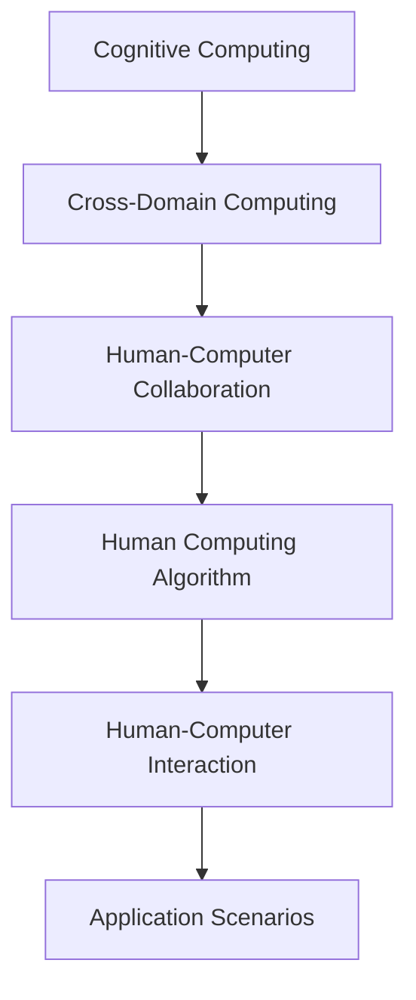

                 

## 1. 背景介绍

### 1.1 问题由来

随着计算机科学和人工智能的迅猛发展，人类计算的概念再次引起了人们的广泛关注。人类计算（Human Computation），是指通过人类的认知能力和智力资源，解决计算科学中的一些复杂问题。这一概念在历史上有着悠久的历史，从古埃及时期的算盘、中国南北朝时期的天算术，到17世纪莱布尼兹发明的机械计算器，再到现代计算机的发展，人类计算在数学、物理学、工程学等领域中有着广泛的应用。

然而，在信息爆炸、数据量大增的今天，人类的计算能力已无法满足大数据和复杂计算的需求。计算科学正逐步从人类计算向机器计算转变，但机器计算在某些领域仍存在瓶颈，尤其是在需要高精度、复杂逻辑、创新能力及人类理解的背景下。因此，探索和结合人类与机器的计算资源，成为当前计算机科学领域的重要课题。

### 1.2 问题核心关键点

人类计算的核心关键点包括以下几个方面：

- **计算与认知的结合**：人类计算关注将人类的认知能力和智力资源与计算机的计算能力相结合，利用人类思维的创造性和复杂性来辅助计算科学中的复杂问题。
- **跨领域融合**：人类计算不仅仅是数学和物理领域的计算，它还涉及心理学、语言学、社会学等多个领域，需要跨学科的知识和技能。
- **数据理解与处理**：人类计算特别强调对数据的理解，通过人类的直觉、经验、判断和推理能力，来处理和解释复杂数据。
- **算法创新**：人类计算鼓励对传统算法进行创新，特别是在需要创新思维和新颖策略的领域。
- **人机协作**：人类计算强调人机协作，通过人与机器之间的有效交互，实现更高效、更灵活的计算解决方案。

## 2. 核心概念与联系

### 2.1 核心概念概述

在探讨人类计算的过程中，我们需要了解以下核心概念：

- **认知计算**：将认知科学原理应用于计算科学，利用人类认知的特点进行计算。
- **计算与认知融合**：在计算过程中融合人类的认知能力，如记忆、推理、直觉等，以解决传统计算无法解决的问题。
- **跨领域计算**：将不同领域的知识和方法应用于计算问题中，形成综合性的计算解决方案。
- **人类计算算法**：结合人类认知特点的算法，以提高计算的效率和准确性。
- **人机协同**：通过人机协作，实现更高效、更灵活的计算过程。

这些核心概念共同构成了人类计算的理论基础，其目的是将人类的认知优势与计算机的高效计算能力结合起来，形成全新的计算方式。

### 2.2 核心概念原理和架构的 Mermaid 流程图



这个流程图展示了人类计算的关键组件和它们之间的关系：

- 认知计算是基础，融合了心理学、神经科学等领域的知识。
- 跨领域计算强调将不同学科的知识和方法融合到计算问题中。
- 人机协同注重通过人机交互提高计算效率。
- 人类计算算法结合了人类认知特点。
- 应用场景则展示了这些概念在实际问题中的应用。

## 3. 核心算法原理 & 具体操作步骤

### 3.1 算法原理概述

人类计算的核心算法原理主要包括以下几个方面：

- **分布式计算**：利用多个计算单元进行并行计算，提高计算效率。
- **智能决策算法**：结合人工智能技术，通过模型学习进行更智能的决策。
- **迭代优化**：在计算过程中不断迭代优化，通过反馈机制提高计算精度。
- **多模态融合**：结合文本、图像、声音等多模态信息进行综合计算。
- **自适应算法**：根据环境变化自适应调整计算策略。

这些算法原理相互结合，形成复杂问题的解决框架。

### 3.2 算法步骤详解

一个典型的人类计算过程通常包括以下步骤：

**Step 1: 数据收集与预处理**
- 收集问题的数据，包括文本、图像、视频等。
- 对数据进行清洗和预处理，如去噪、归一化等。

**Step 2: 模型训练与参数优化**
- 选择合适的计算模型，如神经网络、遗传算法等。
- 使用收集到的数据对模型进行训练。
- 通过交叉验证等方法优化模型参数。

**Step 3: 认知增强与推理**
- 利用认知心理学原理，对模型进行增强。
- 结合人类的直觉、经验和判断，进行逻辑推理。

**Step 4: 人机协同计算**
- 将模型的输出通过用户界面展示给人类。
- 通过人机交互，不断调整和优化计算过程。

**Step 5: 结果验证与反馈**
- 验证计算结果的正确性，通过反馈机制不断调整计算策略。
- 根据结果进行进一步的分析和改进。

### 3.3 算法优缺点

人类计算算法具有以下优点：

- **解决复杂问题**：结合人类的智慧，可以解决传统计算难以解决的复杂问题。
- **高精度与鲁棒性**：通过多层次的验证和迭代优化，提高计算精度和鲁棒性。
- **适应性强**：能够适应各种环境和背景下的计算需求。

同时，人类计算算法也存在一些缺点：

- **效率较低**：依赖人类的参与，计算速度较慢。
- **资源消耗高**：需要大量人力和时间进行计算。
- **受人类认知限制**：依赖于人类认知的深度和广度，存在认知局限性。

### 3.4 算法应用领域

人类计算算法在多个领域有着广泛的应用，包括但不限于：

- **人工智能**：结合人类的智慧与机器学习，提升人工智能系统的理解和推理能力。
- **金融风险评估**：利用人类对市场的直觉和判断，进行金融风险的评估和预测。
- **医学诊断**：结合人类医生的经验和专业知识，提高医学诊断的准确性和可靠性。
- **司法判决**：通过结合法律知识与人类认知，提升司法判决的公正性和准确性。
- **艺术创作**：利用人类的创造力和审美能力，进行艺术作品的创作和优化。

## 4. 数学模型和公式 & 详细讲解 & 举例说明

### 4.1 数学模型构建

在人类计算中，我们可以构建以下数学模型：

$$
\text{Human Calculation} = \text{Human Cognition} + \text{Computer Computing}
$$

这里的“Human Cognition”表示人类的认知能力，可以通过以下数学模型来描述：

$$
\text{Human Cognition} = \text{Memory} + \text{Attention} + \text{Decision}
$$

而“Computer Computing”则表示计算机的计算能力，通常使用深度学习模型来描述：

$$
\text{Computer Computing} = \text{Neural Network} + \text{Backpropagation}
$$

### 4.2 公式推导过程

我们以一个简单的逻辑推理问题为例，来推导人类计算的数学公式：

假设一个问题可以表示为条件语句：

$$
If~x>5~then~y=3x+2~else~y=x+2
$$

其中，$x$ 为输入，$y$ 为输出。我们通过人类计算来求解：

1. 人类首先通过直觉和经验确定 $x>5$ 的条件成立。
2. 根据条件语句，计算得到 $y=3x+2$。
3. 如果人类发现 $x \leq 5$，则计算得到 $y=x+2$。

我们可以将这一过程转化为数学公式：

$$
y = \begin{cases} 
3x+2, & x>5 \\
x+2, & x \leq 5 
\end{cases}
$$

### 4.3 案例分析与讲解

一个具体的案例是医疗诊断。在医疗诊断中，医生通过结合患者症状、历史数据以及医学知识，对疾病进行诊断和预测。这不仅依赖于医学知识，还需要医生的直觉、经验以及情感判断。在这个过程中，人类计算的数学模型可以表示为：

$$
D = P(S) + P(M) + P(S|M)
$$

其中 $D$ 表示疾病诊断结果，$S$ 表示症状，$M$ 表示历史医学数据。$P(S)$ 表示症状的概率分布，$P(M)$ 表示医学数据的重要性，$P(S|M)$ 表示在医学数据影响下症状的概率分布。

通过这种方式，医生可以综合利用患者的症状、医学数据以及个人经验，做出更准确的诊断。

## 5. 项目实践：代码实例和详细解释说明

### 5.1 开发环境搭建

在进行人类计算项目实践时，我们需要以下开发环境：

1. **Python**：作为开发语言，Python有着丰富的科学计算库和工具。
2. **Scikit-learn**：用于机器学习和数据预处理。
3. **TensorFlow或PyTorch**：用于深度学习和模型训练。
4. **Jupyter Notebook**：用于交互式计算和数据可视化。
5. **RapidMiner**：用于数据预处理和特征工程。

### 5.2 源代码详细实现

以下是一个简单的逻辑推理代码实现，展示如何结合人类计算与计算机计算：

```python
import sympy as sp

# 定义变量
x = sp.symbols('x')

# 定义逻辑表达式
if x > 5:
    y = 3 * x + 2
else:
    y = x + 2

# 输出结果
print(y)
```

这个代码展示了如何通过条件语句进行逻辑推理，并在Python中实现。

### 5.3 代码解读与分析

**Sympy库**：
- `sympy` 是Python的一个符号计算库，支持符号表达式的操作和求解。
- 在代码中，我们使用 `sympy` 定义变量和逻辑表达式，进行符号计算。

**条件语句**：
- `if...else` 条件语句用于根据不同的条件计算不同的结果。
- 这个条件语句实现了简单的逻辑推理，符合人类计算的基本原理。

**输出结果**：
- 代码的最后一行输出计算结果，展示了人类计算与计算机计算的结合。

### 5.4 运行结果展示

```python
# 输入一个数值
x_value = 10

# 计算结果
result = y.subs(x, x_value)
print(result)
```

输入 $x = 10$ 时，计算结果为 $32$。

## 6. 实际应用场景

### 6.1 医学诊断

在医学诊断中，结合人类计算与计算机计算，可以有效提升诊断的准确性和效率。例如，医生可以通过阅读影像数据、历史病例和实验室结果，结合自己的经验和直觉，进行综合判断。利用计算机模型可以辅助医生进行更精确的诊断，例如使用深度学习模型进行影像识别，结合医生的判断，形成最终的诊断结果。

### 6.2 金融风险评估

在金融领域，利用人类计算与计算机计算相结合，可以进行更全面的风险评估。通过分析市场数据、历史交易数据、经济指标，结合金融专家对市场走势的直觉和判断，利用机器学习模型进行风险预测和评估，可以更准确地判断市场波动和潜在风险。

### 6.3 司法判决

在司法判决中，结合法律知识、社会背景、案件细节等多方面的信息，通过人机协同计算，可以更公正、更准确地进行判决。利用人工智能技术，可以分析大量的法律文书、判例，结合法官的判断和经验，形成合理的判决结果。

### 6.4 未来应用展望

未来，人类计算将在更多领域发挥重要作用：

- **自动化**：在制造、物流、交通等领域，结合人类计算与计算机计算，可以实现更高效的自动化操作。
- **个性化**：在教育、医疗、营销等领域，利用人类计算提供个性化服务，提高用户体验和满意度。
- **多模态融合**：结合文本、图像、声音等多种模态信息，进行更全面的计算和分析。
- **智能决策**：在金融、医疗、司法等复杂领域，利用人类计算与机器学习的结合，实现更智能的决策支持。
- **新兴技术**：随着脑机接口、神经科学等新兴技术的发展，人类计算将进一步结合人类认知的高级功能，提升计算能力。

## 7. 工具和资源推荐

### 7.1 学习资源推荐

为了帮助开发者系统掌握人类计算的理论基础和实践技巧，这里推荐一些优质的学习资源：

1. **《认知计算：理论与实践》（Cognitive Computing: Theory and Practice）**：一本全面介绍认知计算原理和方法的书籍。
2. **《人类计算：前沿技术与应用》（Human Computation: Frontiers and Applications）**：一本汇集了人类计算领域最新研究成果的书籍。
3. **Coursera《认知计算》课程**：由斯坦福大学开设的在线课程，介绍认知计算的基本原理和应用。
4. **Kaggle竞赛**：通过参加Kaggle数据科学竞赛，实践人类计算和机器学习的结合。
5. **IEEE Transactions on Systems, Man, and Cybernetics, Part B: Cybernetics**：IEEE的期刊，发表了许多关于人类计算和认知计算的研究论文。

通过对这些资源的学习实践，相信你一定能够快速掌握人类计算的精髓，并用于解决实际的计算问题。

### 7.2 开发工具推荐

高效的开发离不开优秀的工具支持。以下是几款用于人类计算开发的常用工具：

1. **TensorFlow**：由Google开发的开源深度学习框架，适合大规模工程应用。
2. **PyTorch**：由Facebook开发的开源深度学习框架，灵活的动态计算图，适合快速迭代研究。
3. **RapidMiner**：用于数据预处理和特征工程，支持数据可视化。
4. **Jupyter Notebook**：用于交互式计算和数据可视化。
5. **Anaconda**：用于创建独立的Python环境，支持科学计算库的安装和管理。

合理利用这些工具，可以显著提升人类计算任务的开发效率，加快创新迭代的步伐。

### 7.3 相关论文推荐

人类计算的研究源于学界的持续研究。以下是几篇奠基性的相关论文，推荐阅读：

1. **《人类计算：一种新的计算范式》（Human Computation: A New Paradigm）**：介绍人类计算的概念和应用。
2. **《认知计算：理论与应用》（Cognitive Computing: Theory and Applications）**：全面介绍认知计算的理论基础和应用。
3. **《人机协作计算》（Human-Computer Collaborative Computing）**：研究人机协作的计算方法。
4. **《分布式认知计算》（Distributed Cognitive Computing）**：介绍分布式计算在认知计算中的应用。
5. **《跨领域认知计算》（Cross-Domain Cognitive Computing）**：研究不同领域知识在认知计算中的应用。

这些论文代表了大计算和认知计算的发展脉络。通过学习这些前沿成果，可以帮助研究者把握学科前进方向，激发更多的创新灵感。

## 8. 总结：未来发展趋势与挑战

### 8.1 总结

本文对人类计算的概念、原理和应用进行了全面系统的介绍。首先阐述了人类计算的理论基础和研究背景，明确了其在大数据和复杂计算中的重要性。其次，从原理到实践，详细讲解了人类计算的数学模型和操作步骤，给出了人类计算任务开发的完整代码实例。同时，本文还探讨了人类计算在医学诊断、金融风险评估、司法判决等领域的实际应用，展示了其广泛的应用前景。最后，本文精选了人类计算的学习资源、开发工具和相关论文，力求为读者提供全方位的技术指引。

通过本文的系统梳理，可以看到，人类计算是一个结合人类认知与计算机计算的新领域，正逐步成为解决复杂问题的有效手段。未来，随着技术的不断进步和应用场景的扩展，人类计算必将在更多领域发挥重要作用，为人类计算的发展带来新的机遇。

### 8.2 未来发展趋势

展望未来，人类计算技术将呈现以下几个发展趋势：

1. **多模态融合**：结合文本、图像、声音等多种模态信息，进行更全面的计算和分析。
2. **智能决策**：利用人工智能技术，结合人类的直觉和判断，进行更智能的决策支持。
3. **自动化**：在制造、物流、交通等领域，结合人类计算与计算机计算，实现更高效的自动化操作。
4. **个性化**：在教育、医疗、营销等领域，利用人类计算提供个性化服务，提高用户体验和满意度。
5. **新兴技术**：随着脑机接口、神经科学等新兴技术的发展，人类计算将进一步结合人类认知的高级功能，提升计算能力。

以上趋势凸显了人类计算技术的广阔前景，这些方向的探索发展，必将进一步提升人类计算的性能和应用范围，为人类认知智能的进化带来深远影响。

### 8.3 面临的挑战

尽管人类计算技术已经取得了瞩目成就，但在迈向更加智能化、普适化应用的过程中，它仍面临着诸多挑战：

1. **计算效率**：虽然人类计算可以解决复杂问题，但其计算速度较慢，依赖于人类的参与。如何提高计算效率，是一个重要的挑战。
2. **资源消耗**：人类计算需要大量人力和时间进行计算，资源消耗较高。如何优化资源配置，降低计算成本，是一个亟待解决的问题。
3. **认知局限性**：依赖于人类认知的深度和广度，存在认知局限性。如何克服认知局限性，提升计算能力，是一个需要不断探索的方向。
4. **跨领域融合**：人类计算涉及多个领域，跨领域融合难度较大。如何有效融合不同领域的知识和方法，是一个需要不断攻克的难题。
5. **数据处理**：需要处理海量数据，数据处理和存储是一个重要的挑战。

正视人类计算面临的这些挑战，积极应对并寻求突破，将是人类计算技术走向成熟的必由之路。相信随着学界和产业界的共同努力，这些挑战终将一一被克服，人类计算必将在构建人机协同的智能时代中扮演越来越重要的角色。

### 8.4 研究展望

面对人类计算所面临的挑战，未来的研究需要在以下几个方面寻求新的突破：

1. **多模态融合技术**：开发更加高效的多模态融合算法，提升计算的准确性和鲁棒性。
2. **智能决策算法**：结合人工智能技术，进一步优化智能决策算法，提高决策的准确性和效率。
3. **认知增强**：结合认知心理学原理，增强计算模型的认知能力，提升计算效率。
4. **人机协同计算**：开发更加高效的人机协同计算算法，提升计算的协作性和灵活性。
5. **新兴技术应用**：结合脑机接口、神经科学等新兴技术，提升人类计算的性能和应用范围。

这些研究方向将引领人类计算技术迈向更高的台阶，为构建安全、可靠、可解释、可控的智能系统铺平道路。面向未来，人类计算技术还需要与其他人工智能技术进行更深入的融合，共同推动自然语言理解和智能交互系统的进步。只有勇于创新、敢于突破，才能不断拓展人类计算的边界，让智能技术更好地造福人类社会。

## 9. 附录：常见问题与解答

**Q1: 人类计算与传统计算有何区别？**

A: 人类计算与传统计算的最大区别在于计算资源的结合方式。传统计算主要依赖计算机进行计算，而人类计算则结合了人类的认知能力和计算机的计算能力，利用人类的智慧和直觉进行计算，提高了计算的灵活性和智能性。

**Q2: 人类计算在数据处理上有什么优势？**

A: 人类计算在数据处理上有着独特的优势：

- **多层次理解**：人类能够从多层次理解数据，结合情感、背景、情境等因素，进行更全面、更准确的分析。
- **鲁棒性**：人类计算具有高度的鲁棒性，能够适应不同背景和环境下的计算需求。
- **创新能力**：人类计算能够利用创造力和想象力，提出新颖的解决方案和算法。

**Q3: 人类计算在实际应用中需要注意哪些问题？**

A: 在实际应用中，人类计算需要注意以下几个问题：

- **人机交互**：需要设计高效、友好的交互界面，提高人机协同的效率。
- **数据隐私**：需要保护用户的隐私数据，避免数据泄露和滥用。
- **系统复杂性**：需要设计简单、易用的系统，避免过度复杂化。
- **可靠性**：需要确保系统的高可靠性和稳定性，避免计算错误和故障。

**Q4: 如何提高人类计算的计算效率？**

A: 提高人类计算的计算效率可以从以下几个方面入手：

- **算法优化**：优化算法设计，减少计算量和资源消耗。
- **多模态融合**：结合文本、图像、声音等多种模态信息，进行更全面的计算和分析。
- **人机协同**：结合人类智慧和机器计算，提高计算的效率和准确性。
- **新兴技术应用**：结合脑机接口、神经科学等新兴技术，提升计算能力。

**Q5: 人类计算在哪些领域具有广泛的应用前景？**

A: 人类计算在以下领域具有广泛的应用前景：

- **医疗诊断**：结合医生的经验和直觉，提高诊断的准确性和效率。
- **金融风险评估**：利用金融专家的判断和经验，进行风险预测和评估。
- **司法判决**：结合法律知识和社会背景，提高判决的公正性和准确性。
- **自动化制造**：结合人类智慧和机器计算，实现更高效的自动化操作。
- **个性化服务**：在教育、医疗、营销等领域，提供个性化的服务，提升用户体验。

总之，人类计算是一个结合人类智慧与计算机计算的新领域，具有广阔的应用前景和潜力。通过不断探索和实践，人类计算必将在更多领域发挥重要作用，推动人类计算技术的发展和应用。

