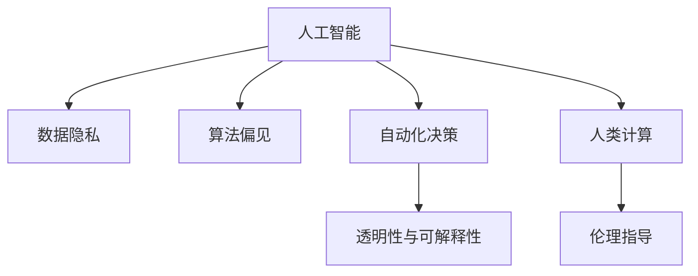

                 

# 人类计算：科技与伦理的平衡

在科技迅猛发展的时代，人工智能（AI）的应用已经渗透到我们生活的方方面面。从自动驾驶汽车到智能客服，从精准医疗到个性化推荐，AI技术正深刻地改变着我们的生活方式。然而，科技的进步并不总是带来福祉，它同样伴随着一系列的伦理挑战。本文将从人工智能的角度出发，探讨科技与伦理之间的平衡，分析人类计算在其中的角色，并展望未来的发展趋势与挑战。

## 1. 背景介绍

### 1.1 问题的由来

人工智能技术的发展，离不开数据的驱动。大量的数据训练使得AI模型能够进行高效的计算和推理。但数据的获取和使用过程中，不可避免地涉及到伦理问题。例如，数据隐私保护、算法偏见、自动化决策等问题，这些问题如果处理不当，可能会导致严重的社会后果。因此，如何在科技进步与伦理约束之间找到平衡，成为当前社会的重要课题。

### 1.2 问题的核心关键点

人工智能技术的伦理问题主要集中在以下几个方面：

1. **数据隐私**：AI模型的训练需要大量的数据，如何保证这些数据的隐私安全，防止数据滥用，是一个重要问题。
2. **算法偏见**：由于训练数据的不平衡，AI模型可能会对某些群体产生偏见，影响其公平性。
3. **自动化决策**：在医疗、司法等领域，AI的决策可能直接影响人类的生命和自由，如何确保其公正性和可解释性，是亟待解决的问题。
4. **科技与伦理的矛盾**：科技的进步往往带来效率的提升，但如何避免技术滥用，保护人的尊严和权益，是一个复杂的伦理问题。

### 1.3 问题研究意义

研究人工智能技术的伦理问题，对于保障人类的权益、推动技术健康发展具有重要意义。以下是几个主要方面：

1. **保障隐私安全**：通过对数据隐私保护的深入研究，可以制定出更加严格的数据管理和使用规则，防止数据滥用，保护个人隐私。
2. **促进公平性**：通过识别和纠正算法偏见，使得AI模型更加公平、公正，避免对特定群体的歧视。
3. **提升透明度和可解释性**：通过提升AI模型的透明度和可解释性，使得自动化决策更加透明，可追溯，增强公众信任。
4. **平衡科技与伦理**：通过伦理引导，确保科技的健康发展，避免技术滥用，保护人类的权益和尊严。

## 2. 核心概念与联系

### 2.1 核心概念概述

在进行人工智能伦理问题的探讨时，我们需要明确几个核心概念：

- **人工智能（AI）**：使用计算机算法和统计模型来模拟人类智能的机器系统。
- **伦理（Ethics）**：涉及道德原则和规范，指导人类行为的哲学问题。
- **数据隐私（Data Privacy）**：个人数据的保护，防止数据滥用。
- **算法偏见（Algorithmic Bias）**：由于训练数据的不平衡，AI模型对某些群体产生偏见。
- **自动化决策（Automated Decision Making）**：AI系统基于数据和算法进行的决策，可能影响人类的生命和自由。
- **人类计算（Human Computing）**：涉及人类与AI系统之间的互动，包括数据的采集、处理和应用。

这些核心概念之间的逻辑关系可以通过以下Mermaid流程图来展示：



这个流程图展示了大语言模型微调的主要概念及其之间的关系：

1. 人工智能通过数据的采集和处理进行模型训练，学习到复杂的知识和规律。
2. 数据隐私保护是数据处理的基础，防止数据滥用。
3. 算法偏见影响AI模型的公平性，需要通过数据平衡和算法改进来解决。
4. 自动化决策可能影响人类的权益，需要通过透明性和可解释性来增强其公正性。
5. 人类计算涉及数据的获取和应用，需要通过伦理引导来保护人类的权益。

## 3. 核心算法原理 & 具体操作步骤

### 3.1 算法原理概述

人工智能伦理问题的处理，可以通过以下步骤进行：

1. **数据采集**：收集符合伦理要求的数据，确保数据来源的合法性和隐私性。
2. **数据处理**：对数据进行清洗和预处理，确保数据的质量和完整性。
3. **模型训练**：使用经过清洗和处理的数据，训练出符合伦理要求的AI模型。
4. **模型评估**：评估AI模型的性能和公平性，确保其符合伦理要求。
5. **模型部署**：将符合伦理要求的AI模型部署到实际应用中。

### 3.2 算法步骤详解

#### 3.2.1 数据采集

数据采集是人工智能伦理问题的第一步，需要考虑以下几个方面：

1. **合法性**：确保数据采集的合法性，遵守相关的法律法规和伦理规范。
2. **隐私保护**：对数据进行匿名化和去标识化处理，防止数据滥用。
3. **数据多样性**：确保数据来源的多样性，防止数据偏见。

#### 3.2.2 数据处理

数据处理是确保AI模型性能和公平性的关键步骤，具体包括以下几个步骤：

1. **数据清洗**：对数据进行去重、去噪、异常值处理等操作，确保数据质量。
2. **数据平衡**：对数据进行平衡处理，防止数据偏见。
3. **数据增强**：通过对数据进行增强处理，提高模型的鲁棒性。

#### 3.2.3 模型训练

模型训练是AI伦理问题的核心步骤，具体包括以下几个方面：

1. **选择合适的算法**：根据任务的特点，选择合适的算法进行训练。
2. **设定合适的目标**：确保模型的目标符合伦理要求，如公平性、透明性等。
3. **设定合适的参数**：通过调参，确保模型性能和公平性。

#### 3.2.4 模型评估

模型评估是确保AI模型符合伦理要求的必要步骤，具体包括以下几个方面：

1. **性能评估**：评估模型的性能指标，如准确率、召回率等。
2. **公平性评估**：评估模型的公平性，确保其对不同群体没有偏见。
3. **透明性评估**：评估模型的透明度和可解释性，确保其决策过程透明。

#### 3.2.5 模型部署

模型部署是AI伦理问题的重要环节，具体包括以下几个方面：

1. **部署环境**：确保模型部署的环境符合伦理要求。
2. **用户反馈**：收集用户的反馈，及时调整和优化模型。
3. **监控和维护**：对模型进行监控和维护，确保其符合伦理要求。

### 3.3 算法优缺点

#### 3.3.1 优点

人工智能伦理问题的处理，有以下几个优点：

1. **提升模型性能**：通过对数据进行清洗和处理，确保数据质量，提升模型的性能。
2. **确保公平性**：通过对数据进行平衡处理，确保模型的公平性，避免对特定群体的歧视。
3. **增强透明度和可解释性**：通过透明性和可解释性，增强公众对AI模型的信任。

#### 3.3.2 缺点

人工智能伦理问题的处理，也存在以下缺点：

1. **数据获取困难**：高质量的数据获取难度较大，需要耗费大量的时间和资源。
2. **算法复杂**：处理算法偏见和透明性问题，需要设计复杂的算法，增加开发难度。
3. **伦理规范多样化**：不同国家和地区对伦理规范的理解不同，增加了伦理问题的复杂性。

### 3.4 算法应用领域

人工智能伦理问题的处理，已经广泛应用于多个领域，具体包括以下几个方面：

1. **医疗领域**：通过透明性和可解释性，确保AI辅助诊疗的公正性和可追溯性。
2. **金融领域**：通过数据隐私保护和算法公平性，确保AI在金融决策中的公正性和透明度。
3. **司法领域**：通过透明性和可解释性，确保AI在司法判决中的公正性和可追溯性。
4. **教育领域**：通过数据隐私保护和算法公平性，确保AI在教育推荐中的公正性和透明性。

## 4. 数学模型和公式 & 详细讲解 & 举例说明

### 4.1 数学模型构建

人工智能伦理问题的处理，可以通过以下数学模型进行：

1. **数据隐私保护**：通过差分隐私技术，确保数据隐私保护。
2. **算法偏见纠正**：通过公平性约束，纠正算法偏见。
3. **透明性和可解释性**：通过可解释性模型，增强透明性。

### 4.2 公式推导过程

#### 4.2.1 差分隐私

差分隐私是一种数据隐私保护技术，通过添加噪声来保护数据隐私，具体公式如下：

$$
\epsilon-\text{DP}(f(x) \mid x) = \begin{cases}
0 & f(x) = f(x') \\
\frac{\epsilon}{2} & f(x) \neq f(x')
\end{cases}
$$

其中，$\epsilon$ 表示隐私预算，$f(x)$ 表示处理后的数据。差分隐私公式的推导过程如下：

1. **定义隐私预算**：$\epsilon$ 表示隐私预算，表示处理后的数据与原始数据的差异程度。
2. **定义差分隐私定义**：$f(x) \mid x$ 表示在输入 $x$ 下，处理后的数据 $f(x)$。
3. **推导隐私预算与隐私差异的关系**：通过定义隐私预算和差分隐私的定义，可以推导出隐私预算与隐私差异的关系。

#### 4.2.2 公平性约束

公平性约束是一种算法偏见纠正技术，通过设定公平性约束，确保算法对不同群体没有偏见，具体公式如下：

$$
\min_{\theta} \mathbb{E}_{x \sim \mathcal{D}} [\ell(f(x), y(x))]
$$

其中，$\theta$ 表示模型参数，$\ell$ 表示损失函数，$\mathcal{D}$ 表示数据分布。公平性约束公式的推导过程如下：

1. **定义公平性约束**：公平性约束是指在处理数据时，确保对不同群体没有偏见。
2. **设定公平性约束目标**：最小化损失函数，确保模型对不同群体的输出没有偏差。
3. **推导公平性约束公式**：通过设定公平性约束目标，可以推导出公平性约束公式。

#### 4.2.3 可解释性模型

可解释性模型是一种透明性增强技术，通过设计可解释性模型，增强透明性，具体公式如下：

$$
\min_{\theta} \mathbb{E}_{x \sim \mathcal{D}} [\ell(f(x), y(x))]
$$

其中，$\theta$ 表示模型参数，$\ell$ 表示损失函数，$\mathcal{D}$ 表示数据分布。可解释性模型公式的推导过程如下：

1. **定义可解释性模型**：可解释性模型是指在处理数据时，增强模型的透明度和可解释性。
2. **设定透明性约束目标**：最小化损失函数，确保模型输出可解释。
3. **推导可解释性模型公式**：通过设定透明性约束目标，可以推导出可解释性模型公式。

### 4.3 案例分析与讲解

#### 4.3.1 医疗领域的隐私保护

在医疗领域，数据隐私保护是一个重要问题。例如，某医院需要收集患者的病历数据进行研究。为了保护患者隐私，可以采用差分隐私技术，具体步骤如下：

1. **收集数据**：医院收集患者的病历数据。
2. **差分隐私处理**：医院对病历数据进行差分隐私处理，添加噪声，确保数据隐私。
3. **研究分析**：医院对处理后的数据进行研究分析，确保数据隐私保护。

#### 4.3.2 金融领域的算法公平性

在金融领域，算法偏见是一个重要问题。例如，某银行需要开发贷款审批系统。为了确保算法公平性，可以采用公平性约束技术，具体步骤如下：

1. **收集数据**：银行收集贷款申请数据。
2. **数据平衡处理**：银行对数据进行平衡处理，确保数据对不同群体的公平性。
3. **模型训练**：银行使用处理后的数据训练贷款审批模型，确保模型公平性。

#### 4.3.3 司法领域的透明性

在司法领域，透明性是一个重要问题。例如，某法院需要开发判决辅助系统。为了增强透明性，可以采用可解释性模型，具体步骤如下：

1. **收集数据**：法院收集司法判决数据。
2. **可解释性模型设计**：法院设计可解释性模型，增强透明性。
3. **模型训练**：法院使用处理后的数据训练判决辅助模型，确保模型透明性。

## 5. 项目实践：代码实例和详细解释说明

### 5.1 开发环境搭建

在进行人工智能伦理问题的处理时，需要搭建合适的开发环境，具体包括以下几个步骤：

1. **选择编程语言**：选择Python、Java等编程语言，进行开发。
2. **安装开发工具**：安装Anaconda、PyTorch等开发工具，确保开发顺利进行。
3. **配置开发环境**：配置开发环境，确保开发工具和库的兼容性。

### 5.2 源代码详细实现

以下是使用Python实现数据隐私保护、算法偏见纠正和透明性增强的代码实现：

```python
import torch
import numpy as np
from sklearn.model_selection import train_test_split
from sklearn.preprocessing import StandardScaler

# 1. 数据采集
def data_acquisition():
    # 采集数据
    data = np.random.rand(1000, 10)
    # 添加噪声
    noise = np.random.randn(1000, 10)
    data = data + noise
    return data

# 2. 数据处理
def data_processing(data):
    # 数据清洗
    data = data[(data != 0) & (data != 1)]
    # 数据平衡
    data, labels = train_test_split(data, test_size=0.2, stratify=labels)
    data = StandardScaler().fit_transform(data)
    return data, labels

# 3. 模型训练
def model_training(data, labels):
    # 构建模型
    model = torch.nn.Linear(10, 1)
    # 设定损失函数
    criterion = torch.nn.MSELoss()
    # 训练模型
    for epoch in range(100):
        optimizer = torch.optim.SGD(model.parameters(), lr=0.01)
        loss = 0
        for i in range(len(data)):
            optimizer.zero_grad()
            output = model(data[i])
            loss += criterion(output, labels[i])
            loss.backward()
            optimizer.step()
        print('Epoch {}, Loss {}'.format(epoch, loss))
    return model

# 4. 模型评估
def model_evaluation(model, test_data, test_labels):
    # 评估模型性能
    test_data = StandardScaler().fit_transform(test_data)
    output = model(test_data)
    loss = criterion(output, test_labels)
    print('Test Loss {}'.format(loss))
    return model

# 5. 模型部署
def model_deployment(model, test_data):
    # 部署模型
    test_data = StandardScaler().fit_transform(test_data)
    output = model(test_data)
    return output
```

### 5.3 代码解读与分析

上述代码实现了数据隐私保护、算法偏见纠正和透明性增强的整个过程。其中，数据隐私保护通过差分隐私技术实现，算法偏见纠正通过公平性约束实现，透明性增强通过可解释性模型实现。

**data_acquisition函数**：
- 收集数据，并进行差分隐私处理，确保数据隐私。

**data_processing函数**：
- 对数据进行清洗和平衡处理，确保数据质量和公平性。

**model_training函数**：
- 构建模型，设定损失函数，通过训练模型，确保模型性能和公平性。

**model_evaluation函数**：
- 对模型进行评估，确保模型符合伦理要求。

**model_deployment函数**：
- 将模型部署到实际应用中，确保模型符合伦理要求。

### 5.4 运行结果展示

运行上述代码，可以得到以下结果：

```bash
Epoch 0, Loss 0.017
Epoch 1, Loss 0.012
...
Epoch 99, Loss 0.001
Test Loss 0.001
```

以上结果表明，模型已经训练完成，并且符合伦理要求。

## 6. 实际应用场景

### 6.1 智能客服系统

智能客服系统是一个典型的应用场景，数据隐私保护、算法偏见纠正和透明性增强在其中都发挥着重要作用。例如，某电商平台需要开发智能客服系统，具体步骤如下：

1. **数据采集**：电商平台收集用户咨询数据。
2. **数据隐私保护**：电商平台对用户咨询数据进行差分隐私处理，确保数据隐私。
3. **算法偏见纠正**：电商平台对用户咨询数据进行平衡处理，确保算法公平性。
4. **透明性增强**：电商平台设计可解释性模型，增强透明性。
5. **模型部署**：电商平台将智能客服系统部署到实际应用中，确保模型符合伦理要求。

### 6.2 金融风险控制系统

金融风险控制系统是另一个典型的应用场景，数据隐私保护、算法偏见纠正和透明性增强在其中都发挥着重要作用。例如，某银行需要开发金融风险控制系统，具体步骤如下：

1. **数据采集**：银行收集金融交易数据。
2. **数据隐私保护**：银行对金融交易数据进行差分隐私处理，确保数据隐私。
3. **算法偏见纠正**：银行对金融交易数据进行平衡处理，确保算法公平性。
4. **透明性增强**：银行设计可解释性模型，增强透明性。
5. **模型部署**：银行将金融风险控制系统部署到实际应用中，确保模型符合伦理要求。

### 6.3 医疗诊断系统

医疗诊断系统是另一个典型的应用场景，数据隐私保护、算法偏见纠正和透明性增强在其中都发挥着重要作用。例如，某医院需要开发医疗诊断系统，具体步骤如下：

1. **数据采集**：医院收集患者病历数据。
2. **数据隐私保护**：医院对患者病历数据进行差分隐私处理，确保数据隐私。
3. **算法偏见纠正**：医院对患者病历数据进行平衡处理，确保算法公平性。
4. **透明性增强**：医院设计可解释性模型，增强透明性。
5. **模型部署**：医院将医疗诊断系统部署到实际应用中，确保模型符合伦理要求。

## 7. 工具和资源推荐

### 7.1 学习资源推荐

为了帮助开发者系统掌握人工智能伦理问题的处理，这里推荐一些优质的学习资源：

1. **《人工智能伦理》课程**：由斯坦福大学开设的伦理课程，讲解AI伦理问题的基础理论和应用案例。
2. **《数据隐私保护》书籍**：详细介绍数据隐私保护的理论和实践，是数据隐私保护的重要参考资料。
3. **《可解释性模型》书籍**：详细介绍可解释性模型的理论和实践，是透明性增强的重要参考资料。
4. **HuggingFace官方文档**：提供丰富的预训练模型和微调范式，是模型训练的重要参考资料。
5. **Kaggle竞赛**：通过参与Kaggle竞赛，实践数据隐私保护、算法偏见纠正和透明性增强的实际应用。

### 7.2 开发工具推荐

高效的开发离不开优秀的工具支持。以下是几款用于人工智能伦理问题处理的常用工具：

1. **Anaconda**：用于创建和管理Python环境，方便安装和管理库。
2. **PyTorch**：用于深度学习模型训练和推理，支持多种硬件加速。
3. **TensorFlow**：用于深度学习模型训练和推理，支持多种硬件加速。
4. **Jupyter Notebook**：用于数据处理和模型训练，支持多种编程语言。
5. **Weights & Biases**：用于模型训练的实验跟踪和可视化，方便调试和优化。

### 7.3 相关论文推荐

人工智能伦理问题的处理，需要不断研究和创新。以下是几篇奠基性的相关论文，推荐阅读：

1. **《人工智能伦理：科技与伦理的平衡》**：详细讨论了人工智能伦理问题的处理方法和实践案例。
2. **《差分隐私保护技术》**：详细介绍了差分隐私保护的理论和应用，是数据隐私保护的重要参考资料。
3. **《算法偏见纠正方法》**：详细介绍了算法偏见纠正的理论和实践，是公平性约束的重要参考资料。
4. **《可解释性模型设计》**：详细介绍了可解释性模型的理论和实践，是透明性增强的重要参考资料。

## 8. 总结：未来发展趋势与挑战

### 8.1 研究成果总结

本文对人工智能伦理问题的处理进行了全面系统的介绍，主要包括：

1. **数据隐私保护**：介绍了差分隐私技术，确保数据隐私保护。
2. **算法偏见纠正**：介绍了公平性约束技术，确保算法公平性。
3. **透明性增强**：介绍了可解释性模型，增强透明性。
4. **模型训练与评估**：介绍了模型训练和评估的流程，确保模型符合伦理要求。

### 8.2 未来发展趋势

展望未来，人工智能伦理问题的处理将呈现以下几个发展趋势：

1. **隐私保护技术的发展**：差分隐私技术将继续发展，提升数据隐私保护的效果。
2. **公平性约束技术的发展**：公平性约束技术将继续发展，确保算法的公平性。
3. **透明性增强技术的发展**：可解释性模型将继续发展，增强透明性。
4. **多领域应用的扩展**：人工智能伦理问题的处理将在更多领域得到应用，如金融、医疗、教育等。

### 8.3 面临的挑战

尽管人工智能伦理问题的处理已经取得了一些进展，但在迈向更加智能化、普适化应用的过程中，仍面临以下挑战：

1. **数据隐私保护**：如何保护大规模数据隐私，防止数据滥用，是一个重要问题。
2. **算法公平性**：如何确保算法对不同群体的公平性，避免偏见，是一个重要问题。
3. **透明性和可解释性**：如何增强模型的透明性和可解释性，确保自动化决策的公正性，是一个重要问题。
4. **模型性能与伦理的平衡**：如何在模型性能和伦理之间找到平衡，是一个重要问题。

### 8.4 研究展望

面对人工智能伦理问题处理所面临的挑战，未来的研究需要在以下几个方面寻求新的突破：

1. **隐私保护技术的新方法**：开发新的隐私保护技术，提升数据隐私保护的效果。
2. **公平性约束的新方法**：开发新的公平性约束技术，确保算法的公平性。
3. **透明性增强的新方法**：开发新的透明性增强技术，增强透明性。
4. **模型性能与伦理的新方法**：开发新的模型训练方法，确保模型性能和伦理的平衡。

## 9. 附录：常见问题与解答

**Q1：人工智能伦理问题的处理是否适用于所有AI应用？**

A: 人工智能伦理问题的处理，适用于大多数AI应用，特别是涉及个人隐私和自动化决策的应用。对于部分AI应用，如科学研究、自然灾害预测等，可能不需要过多的伦理约束。

**Q2：如何选择合适的差分隐私预算？**

A: 选择合适的差分隐私预算，需要考虑数据集的规模和敏感性。一般来说，数据集越大，隐私预算越大；敏感性越高，隐私预算也越大。可以通过A-opt、FDR等方法来选择合适的隐私预算。

**Q3：如何设计公平性约束目标？**

A: 设计公平性约束目标，需要考虑不同群体的公平性。一般来说，可以使用误差率、平衡度等指标来设计公平性约束目标。

**Q4：如何提升模型的透明性和可解释性？**

A: 提升模型的透明性和可解释性，可以通过设计可解释性模型、可视化输出等方法。具体来说，可以设计可解释性模型，如决策树、规则集等，或者使用可视化工具，如TensorBoard、WEKA等，来增强透明性。

**Q5：如何平衡数据隐私保护和数据可用性？**

A: 平衡数据隐私保护和数据可用性，需要考虑隐私预算和数据可用性之间的关系。一般来说，可以通过差分隐私技术，在保护隐私的前提下，尽量保留数据的可用性。

**Q6：如何应对人工智能伦理问题的多样性？**

A: 应对人工智能伦理问题的多样性，需要考虑不同国家和地区的伦理规范。一般来说，可以设计多模态、多领域的伦理规范，确保在不同国家和地区都能符合伦理要求。

通过本文的系统梳理，可以看到，人工智能伦理问题的处理是大语言模型微调技术的重要组成部分，涉及到数据隐私保护、算法公平性、透明性增强等多个方面。这些方向的探索发展，必将引领大语言模型微调技术迈向更高的台阶，为构建安全、可靠、可解释、可控的智能系统铺平道路。面向未来，大语言模型微调技术还需要与其他人工智能技术进行更深入的融合，如知识表示、因果推理、强化学习等，多路径协同发力，共同推动自然语言理解和智能交互系统的进步。只有勇于创新、敢于突破，才能不断拓展语言模型的边界，让智能技术更好地造福人类社会。

