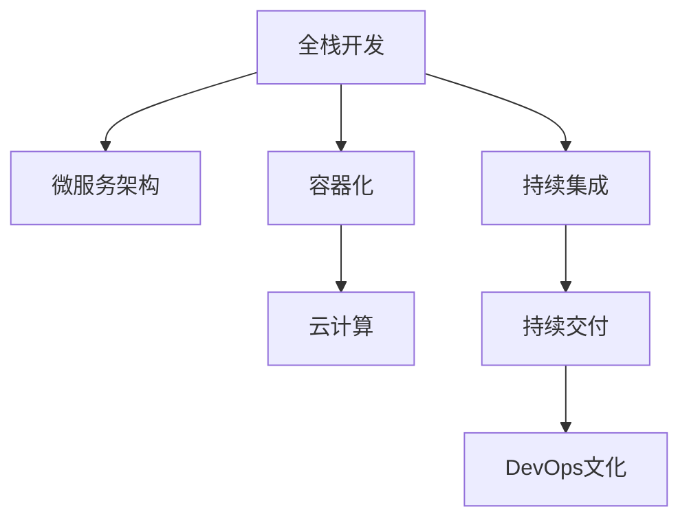

                 

# 从全栈开发到微服务架构师的晋升之路

> 关键词：全栈开发,微服务架构,技术栈升级,DevOps,容器化,云计算,持续集成,持续交付,DevOps文化,敏捷开发

## 1. 背景介绍

### 1.1 问题由来
在软件开发的职业生涯中，从全栈开发到微服务架构师是一个典型的晋升之路。全栈开发人员通常具备多方面的技能，如前端开发、后端开发、数据库设计等，能够独立完成一个或多个项目。随着项目规模的增大和需求的多样化，全栈开发人员开始面临更多的挑战。微服务架构（Microservices Architecture）为解决这些问题提供了一种高效、可扩展的解决方案。

### 1.2 问题核心关键点
微服务架构是一种基于组件的架构，通过将单体应用拆分为多个小型服务，每个服务独立运行、松耦合，并使用轻量级机制通信。这种架构具有高度的灵活性和可扩展性，适用于大规模应用系统的开发和维护。从全栈开发到微服务架构师的晋升之路，需要开发者掌握更多的技术和工具，理解更多的设计和实施原则。

### 1.3 问题研究意义
掌握微服务架构，可以显著提高开发者在大型、复杂系统的设计和实现能力。了解微服务架构的优势和挑战，可以帮助开发者更好地应对企业应用需求的不断变化。微服务架构师的技能和经验，可以在更高级别的技术管理岗位上发挥更大的作用，推动企业技术创新和业务转型。

## 2. 核心概念与联系

### 2.1 核心概念概述

为更好地理解从全栈开发到微服务架构师的晋升之路，本节将介绍几个密切相关的核心概念：

- 全栈开发（Full-stack Development）：指开发人员能够熟练掌握前端和后端的开发技能，能够独立完成整个应用系统的构建和维护。
- 微服务架构（Microservices Architecture）：指将单体应用拆分为多个小型服务，每个服务独立运行、松耦合，并使用轻量级机制通信的架构风格。
- 容器化（Containerization）：指将应用程序及其依赖打包到可移植、自包含的容器中，方便部署和管理。
- 云计算（Cloud Computing）：指通过互联网提供按需、便捷、可扩展的计算资源和服务，如计算、存储、网络等。
- 持续集成（Continuous Integration, CI）：指频繁地将代码合并到公共主分支，并通过自动化测试和部署，提高代码质量和交付效率。
- 持续交付（Continuous Delivery, CD）：指通过持续集成，快速安全地将代码部署到生产环境，缩短交付周期。
- DevOps文化：指将开发和运维团队紧密协作，共同关注软件交付和运营效率，以快速响应业务需求。

这些核心概念之间的逻辑关系可以通过以下Mermaid流程图来展示：



这个流程图展示了一些关键概念之间的联系和演变路径：

1. 从全栈开发开始，逐步引入微服务架构。
2. 容器化技术有助于微服务的部署和管理。
3. 云计算提供了高效、可扩展的计算资源。
4. 持续集成和持续交付提升了软件的交付效率。
5. DevOps文化促进了开发和运维的协同工作。

这些概念共同构成了微服务架构的基础，帮助开发者从全栈开发晋升为微服务架构师。通过理解这些核心概念，我们可以更好地把握微服务架构的设计和实施。

## 3. 核心算法原理 & 具体操作步骤
### 3.1 算法原理概述

微服务架构的核心思想是通过将单体应用拆分为多个小型服务，每个服务独立运行、松耦合，并使用轻量级机制通信，从而提高系统的灵活性、可扩展性和可靠性。其设计原则包括：

- 单责任原则（Single Responsibility Principle）：每个服务只负责单一的业务功能，避免服务之间的复杂依赖。
- 自治原则（Autonomy Principle）：每个服务独立部署、独立运行，可以独立扩展和更新。
- 通信协议统一（Unified Communication Protocol）：服务之间使用统一的通信协议，如HTTP/REST、消息队列等。
- 状态分离（Stateless Principle）：尽量减少服务之间的状态依赖，提高系统的可扩展性和容错性。

### 3.2 算法步骤详解

从全栈开发到微服务架构师，需要掌握以下关键步骤：

**Step 1: 项目需求分析**
- 理解业务需求和系统架构，评估项目的复杂度和规模。
- 与业务团队、运维团队等沟通，了解系统的非功能性需求（如性能、可用性、安全性等）。

**Step 2: 服务拆分**
- 根据业务功能和模块，将单体应用拆分为多个小型服务。每个服务应尽量遵循单一职责原则。
- 识别服务的边界和依赖关系，设计合理的服务调用关系。

**Step 3: 技术栈选择**
- 根据服务特点和需求，选择合适的技术栈，如Java、Go、Node.js等。
- 选择合适的框架和中间件，如Spring Boot、Django、Kubernetes等。

**Step 4: 容器化部署**
- 将服务打包到Docker容器中，方便部署和管理。
- 使用容器编排工具（如Kubernetes、Docker Swarm等），管理服务实例的部署、扩缩容等。

**Step 5: 服务注册与发现**
- 使用服务注册中心（如Consul、Eureka等），管理服务的注册和发现。
- 配置服务间的路由规则，使用负载均衡策略，提高系统的可扩展性。

**Step 6: 持续集成与持续交付**
- 使用CI/CD工具（如Jenkins、GitLab CI等），自动构建、测试和部署服务。
- 定义自动化测试用例，确保代码质量和安全。
- 使用配置管理工具（如Ansible、Puppet等），自动化配置服务的运行环境。

**Step 7: DevOps文化**
- 建立跨部门的DevOps团队，共同关注代码交付和运营效率。
- 推广DevOps文化，鼓励自动化、协作和持续改进。

### 3.3 算法优缺点

微服务架构具有以下优点：
1. 灵活性高：服务独立运行、松耦合，可以快速响应需求变化。
2. 可扩展性好：服务可以独立扩展，避免单体应用扩展的复杂性。
3. 容错性强：服务之间相互独立，某个服务故障不会影响整个系统。

但微服务架构也存在一定的局限性：
1. 部署复杂：需要管理多个服务实例，部署过程较为复杂。
2. 通信开销：服务之间的通信增加了一定的网络开销。
3. 数据一致性：服务之间的数据一致性问题需要特殊处理。

尽管存在这些局限性，但微服务架构仍是大规模应用系统的主流架构风格，成为从全栈开发到微服务架构师晋升之路的重要里程碑。

### 3.4 算法应用领域

微服务架构在多个领域中得到了广泛的应用，包括但不限于：

- 电子商务：将购物车、结算、支付、物流等模块拆分，独立运行、独立扩展。
- 金融科技：将银行、证券、保险等业务模块拆分，提高系统的稳定性和扩展性。
- 医疗健康：将诊疗、病历、药品等模块拆分，提升医疗系统的可扩展性和灵活性。
- 物联网：将设备管理、数据采集、应用处理等模块拆分，实现高效、可扩展的物联网应用。
- 社交媒体：将用户管理、内容生成、数据分析等模块拆分，提高系统的灵活性和可扩展性。

除了上述这些经典应用外，微服务架构还被创新性地应用于更多场景中，如智慧城市、智能制造、智慧交通等，为各行各业带来了新的变革。

## 4. 数学模型和公式 & 详细讲解 & 举例说明
### 4.1 数学模型构建

微服务架构的数学模型主要关注系统性能和可扩展性，以下是几个常见的数学模型：

- 负载均衡模型（Load Balancing Model）：用于描述服务间的负载分配策略，常用的算法包括轮询、加权轮询、随机、最小连接数等。
- 可用性模型（Availability Model）：用于描述系统的可用性，常用的指标包括MTTR（平均修复时间）、MTBF（平均无故障时间）等。
- 扩展性模型（Scalability Model）：用于描述系统的扩展能力，常用的指标包括吞吐量、响应时间等。

### 4.2 公式推导过程

以下我们以负载均衡模型为例，推导轮询算法（Round Robin）的数学公式。

假设服务实例总数为N，当前请求数为Q，当前实例响应时间为R。轮询算法的核心思想是按照顺序依次分配请求到各个服务实例，直到所有实例都分配完毕，然后重新开始。假设当前轮询到第i个实例，其响应时间为R_i，那么该实例处理请求的概率为：

$$ P_i = \frac{Q}{N} \times \frac{R_i}{R} $$

其中，Q/N表示请求平均分配到各个实例的概率，R_i/R表示当前实例的响应时间占总响应时间的比例。

当所有请求处理完毕，即Q=0时，轮询算法结束。假设轮询算法共进行了K次，那么所有实例的请求处理次数和响应时间之和应等于总请求数和总响应时间，即：

$$ \sum_{i=1}^{N} P_i = 1 $$

$$ \sum_{i=1}^{N} R_iP_i = \sum_{i=1}^{N} R_i $$

### 4.3 案例分析与讲解

假设系统有4个服务实例，当前请求数为100，各个实例的响应时间分别为10ms、20ms、30ms、40ms。使用轮询算法分配请求，计算每个实例的请求处理次数和响应时间之和。

首先，计算每个实例的请求处理概率：

- 实例1：$P_1 = \frac{100}{4} \times \frac{10}{10+20+30+40} = 0.2$
- 实例2：$P_2 = \frac{100}{4} \times \frac{20}{10+20+30+40} = 0.2$
- 实例3：$P_3 = \frac{100}{4} \times \frac{30}{10+20+30+40} = 0.2$
- 实例4：$P_4 = \frac{100}{4} \times \frac{40}{10+20+30+40} = 0.2$

然后，计算每个实例的请求处理次数和响应时间之和：

- 实例1：请求处理次数为20，响应时间为10，总和为210
- 实例2：请求处理次数为20，响应时间为20，总和为420
- 实例3：请求处理次数为20，响应时间为30，总和为630
- 实例4：请求处理次数为20，响应时间为40，总和为840

通过轮询算法，实现了请求的公平分配，各个实例的响应时间占总响应时间的比例大致相同，保证了系统的负载均衡。

## 5. 项目实践：代码实例和详细解释说明
### 5.1 开发环境搭建

在进行微服务架构的开发实践前，我们需要准备好开发环境。以下是使用Docker和Kubernetes进行微服务架构开发的流程：

1. 安装Docker：从官网下载并安装Docker，用于构建和管理容器。

2. 安装Kubernetes：根据操作系统和环境，从官网获取Kubernetes的安装包进行安装。

3. 配置Docker Registry：在Docker Desktop上配置Docker Hub，方便构建和推送容器镜像。

4. 配置Kubernetes环境：在本地或云端配置Kubernetes集群，可以使用Minikube、EKS、AKS等工具。

5. 配置CI/CD工具：使用Jenkins、GitLab CI等工具，构建自动化测试和部署流程。

完成上述步骤后，即可在Docker和Kubernetes环境中开始微服务架构的开发和部署。

### 5.2 源代码详细实现

下面我们以一个简单的微服务架构为例，展示如何使用Docker和Kubernetes进行开发和部署。

**Dockerfile**
```dockerfile
# 使用官方Python运行环境
FROM python:3.8

# 设置工作目录
WORKDIR /app

# 安装依赖
COPY requirements.txt .
RUN pip install -r requirements.txt

# 复制代码
COPY . .

# 暴露端口
EXPOSE 5000

# 启动应用
CMD ["python", "app.py"]
```

**requirements.txt**
```
flask
gunicorn
```

**app.py**
```python
from flask import Flask, request
from flask_redis import FlaskRedis

app = Flask(__name__)

app.config['REDIS_HOST'] = 'redis'
app.config['REDIS_PORT'] = 6379

redis = FlaskRedis(app)

@app.route('/echo', methods=['POST'])
def echo():
    data = request.get_json()
    message = data['message']
    redis.set(message, message)
    return message

if __name__ == '__main__':
    app.run(host='0.0.0.0', port=5000)
```

**Kubernetes配置**
```yaml
apiVersion: apps/v1
kind: Deployment
metadata:
  name: myapp
  labels:
    hello: world
spec:
  replicas: 3
  selector:
    matchLabels:
      hello: world
  template:
    metadata:
      labels:
        hello: world
    spec:
      containers:
      - name: myapp
        image: myapp:latest
        ports:
        - containerPort: 5000
        resources:
          limits:
            cpu: "0.5"
            memory: "256Mi"
          requests:
            cpu: "0.1"
            memory: "64Mi"
```

**部署命令**
```bash
kubectl apply -f deployment.yaml
kubectl rollout status deployment/myapp
kubectl get pods
```

以上代码展示了如何使用Docker和Kubernetes部署一个简单的微服务。Docker用于构建和管理容器镜像，Kubernetes用于管理服务的部署和扩展。

### 5.3 代码解读与分析

**Dockerfile**
- `FROM python:3.8`：使用Python 3.8作为基础镜像。
- `WORKDIR /app`：设置工作目录为`/app`。
- `COPY requirements.txt .`：将`requirements.txt`文件复制到容器中。
- `RUN pip install -r requirements.txt`：在容器中安装Python依赖。
- `COPY . .`：将项目代码复制到容器中。
- `EXPOSE 5000`：暴露5000端口。
- `CMD ["python", "app.py"]`：启动应用。

**requirements.txt**
- 指定项目依赖，如Flask、Gunicorn等。

**app.py**
- 定义Flask应用和Redis客户端。
- 定义`/echo`路由，将请求参数保存到Redis缓存中。
- 使用`app.run`启动应用。

**Kubernetes配置**
- 定义Deployment，指定服务的名称、副本数、标签等。
- 定义Pod模板，指定容器的镜像、端口、资源限制等。
- 使用`kubectl apply`部署服务，使用`kubectl rollout status`查看部署状态，使用`kubectl get pods`查看Pod实例。

通过上述步骤，我们可以看到Docker和Kubernetes在微服务架构开发和部署中的应用。Docker提供了容器化解决方案，Kubernetes提供了自动化和弹性扩展能力，大大简化了微服务的开发和运维。

## 6. 实际应用场景
### 6.1 电商系统

电商系统是一个典型的微服务应用场景。电商系统需要处理用户注册、商品管理、订单处理、物流跟踪等复杂业务逻辑，各个模块之间的依赖关系较为复杂。通过将电商系统拆分为多个小型服务，每个服务独立运行、松耦合，可以显著提高系统的灵活性和可扩展性。

在微服务架构下，电商系统可以采用以下架构：

- 用户服务：负责用户注册、登录、信息管理等功能。
- 商品服务：负责商品信息管理、分类、搜索等功能。
- 订单服务：负责订单处理、支付、物流跟踪等功能。
- 营销服务：负责优惠券、推荐商品、促销活动等功能。

每个服务独立部署、独立扩展，通过REST API进行通信，使用Redis等缓存服务提升系统的响应速度和稳定性。

### 6.2 金融系统

金融系统也需要处理复杂的业务逻辑，如交易、清算、风控等。微服务架构可以帮助金融系统更好地应对业务需求的快速变化和并发量的高峰期。

在微服务架构下，金融系统可以采用以下架构：

- 交易服务：负责订单处理、清算、记账等功能。
- 清算服务：负责清算、结算、资金管理等功能。
- 风控服务：负责风险评估、监控、预警等功能。
- 查询服务：负责数据查询、报表生成等功能。

每个服务独立部署、独立扩展，通过消息队列进行通信，使用数据库分布式事务提升系统的稳定性和可靠性。

### 6.3 医疗健康

医疗健康系统需要处理大量数据和复杂的业务逻辑，如电子病历、影像诊断、药品管理等。微服务架构可以帮助医疗健康系统更好地应对数据量的大幅增加和业务需求的变化。

在微服务架构下，医疗健康系统可以采用以下架构：

- 患者服务：负责患者信息管理、预约、诊疗等功能。
- 医生服务：负责医生信息管理、排班、诊疗记录等功能。
- 药品服务：负责药品信息管理、采购、库存等功能。
- 影像服务：负责医学影像存储、处理、分析等功能。

每个服务独立部署、独立扩展，通过REST API进行通信，使用数据同步机制提升系统的数据一致性和可靠性。

### 6.4 未来应用展望

随着微服务架构的不断发展，未来将在更多领域得到应用，为各行各业带来新的变革。

在智慧城市治理中，微服务架构可以帮助城市管理部门更好地应对城市事件监测、舆情分析、应急指挥等复杂任务，提高城市管理的自动化和智能化水平。

在智能制造中，微服务架构可以帮助制造企业更好地应对生产调度、设备管理、质量控制等复杂任务，提高生产效率和产品质量。

在智慧交通中，微服务架构可以帮助交通管理部门更好地应对交通流量监测、交通信号控制、事故预警等复杂任务，提高交通管理的智能化水平。

此外，在医疗健康、智能制造、智慧交通等更多领域，微服务架构也将不断涌现新的应用场景，为各行各业带来新的机遇和挑战。

## 7. 工具和资源推荐
### 7.1 学习资源推荐

为了帮助开发者掌握微服务架构的技术栈和实践经验，这里推荐一些优质的学习资源：

1. 《微服务架构设计与实施》系列博文：由微服务架构专家撰写，深入浅出地介绍了微服务架构的基本概念和最佳实践。

2. CS352《微服务设计》课程：斯坦福大学开设的微服务课程，涵盖微服务架构的基本原理、设计和实现。

3. 《微服务架构实战》书籍：详细介绍了微服务架构的开发、部署、运维等实践经验。

4. Spring Cloud官方文档：Spring Cloud是微服务架构的主流框架，提供了丰富的工具和组件，帮助开发者构建微服务应用。

5. Docker官方文档：Docker提供了容器化的解决方案，简化了微服务应用的部署和管理。

6. Kubernetes官方文档：Kubernetes提供了弹性扩展和自动化管理能力，提升了微服务应用的可靠性。

7. GitLab CI/CD官方文档：GitLab CI/CD提供了持续集成和持续交付的解决方案，简化了微服务应用的开发和部署流程。

通过对这些资源的学习实践，相信你一定能够快速掌握微服务架构的技术栈和实践经验。

### 7.2 开发工具推荐

高效的开发离不开优秀的工具支持。以下是几款用于微服务架构开发的常用工具：

1. Docker：提供了容器化的解决方案，简化了微服务应用的部署和管理。

2. Kubernetes：提供了弹性扩展和自动化管理能力，提升了微服务应用的可靠性。

3. Jenkins：提供了持续集成和持续交付的解决方案，简化了微服务应用的开发和部署流程。

4. GitLab CI/CD：提供了持续集成和持续交付的解决方案，简化了微服务应用的开发和部署流程。

5. Ansible：提供了自动化配置和部署的能力，简化了微服务应用的运维流程。

6. Grafana：提供了可视化监控和告警的能力，帮助开发者监控微服务应用的性能和稳定性。

7. ELK Stack：提供了日志聚合和分析的能力，帮助开发者分析和解决微服务应用的故障。

合理利用这些工具，可以显著提升微服务架构的开发效率，加快创新迭代的步伐。

### 7.3 相关论文推荐

微服务架构的研究源于学界的持续研究。以下是几篇奠基性的相关论文，推荐阅读：

1. Distributed Systems: Principles and Paradigms：Douglas C. Spooner, George C. Papadimitriou 撰写的经典书籍，介绍了微服务架构的基本概念和设计原则。

2. Microservices: A Personal Perspective：Sam Newman撰写的博客文章，详细介绍了微服务架构的历史、演进和实现。

3. Microservices for Dummies：Mark Richards撰写的微服务架构指南，帮助开发者快速上手微服务架构的开发和部署。

4. Cloud Native Microservices Design Patterns：Hans Vogelmann撰写的微服务架构设计模式，帮助开发者设计和实现高可用的微服务应用。

5. Serverless Microservices：Sam Newman撰写的微服务架构指南，介绍如何在云平台中实现微服务应用的自动化部署和运维。

这些论文代表了大规模微服务架构的研究方向，通过学习这些前沿成果，可以帮助研究者把握学科前进方向，激发更多的创新灵感。

## 8. 总结：未来发展趋势与挑战
### 8.1 总结

本文对微服务架构的基本概念和实现方法进行了全面系统的介绍。首先阐述了从全栈开发到微服务架构师的背景和意义，明确了微服务架构在提升系统灵活性、可扩展性和可靠性方面的独特价值。其次，从原理到实践，详细讲解了微服务架构的数学模型和核心算法，给出了微服务架构的开发和部署代码实例。同时，本文还广泛探讨了微服务架构在电商系统、金融系统、医疗健康等多个领域的应用前景，展示了微服务架构的广阔前景。最后，本文精选了微服务架构的学习资源、开发工具和相关论文，力求为读者提供全方位的技术指引。

通过本文的系统梳理，可以看到，微服务架构为大规模应用系统提供了高效、可扩展的解决方案，成为从全栈开发到微服务架构师晋升之路的重要里程碑。掌握微服务架构，可以显著提高开发者在大型、复杂系统的设计和实现能力。了解微服务架构的优势和挑战，可以帮助开发者更好地应对企业应用需求的不断变化。微服务架构师的技能和经验，可以在更高级别的技术管理岗位上发挥更大的作用，推动企业技术创新和业务转型。

### 8.2 未来发展趋势

展望未来，微服务架构将呈现以下几个发展趋势：

1. 云原生（Cloud Native）：微服务架构与云计算深度融合，利用云平台的弹性、自动化和可扩展性，提升系统的部署和运维效率。

2. 容器化（Containerization）：微服务架构将更加依赖容器化技术，提升系统的部署和扩展效率。

3. 分布式事务（Distributed Transactions）：微服务架构需要更好的分布式事务解决方案，确保跨服务的数据一致性和可靠性。

4. 服务网格（Service Mesh）：微服务架构将更加依赖服务网格技术，提升服务的通信效率和稳定性。

5. 微服务安全（Microservice Security）：微服务架构需要更好的安全解决方案，确保系统的安全性。

6. 可观察性（Observability）：微服务架构需要更好的可观察性解决方案，帮助开发者监控和调试系统。

以上趋势凸显了微服务架构的发展方向，推动微服务架构在更多领域得到应用，为各行各业带来新的机遇和挑战。

### 8.3 面临的挑战

尽管微服务架构已经取得了瞩目成就，但在迈向更加智能化、普适化应用的过程中，它仍面临着诸多挑战：

1. 部署复杂：需要管理多个服务实例，部署过程较为复杂。
2. 通信开销：服务之间的通信增加了一定的网络开销。
3. 数据一致性：服务之间的数据一致性问题需要特殊处理。
4. 性能瓶颈：微服务架构在处理高并发请求时，可能面临性能瓶颈。
5. 故障恢复：微服务架构在故障发生时，需要更高效、可靠的系统监控和恢复机制。

尽管存在这些挑战，但微服务架构仍是大规模应用系统的主流架构风格，成为从全栈开发到微服务架构师晋升之路的重要里程碑。

### 8.4 研究展望

面对微服务架构所面临的挑战，未来的研究需要在以下几个方面寻求新的突破：

1. 研究高效、可扩展的分布式事务解决方案，确保跨服务的数据一致性和可靠性。
2. 研究更高效的服务网格技术，提升服务的通信效率和稳定性。
3. 研究微服务安全解决方案，确保系统的安全性。
4. 研究更可观察的微服务监控和调试解决方案，帮助开发者监控和调试系统。

这些研究方向的探索，必将引领微服务架构技术迈向更高的台阶，为构建安全、可靠、可解释、可控的智能系统铺平道路。面向未来，微服务架构技术还需要与其他人工智能技术进行更深入的融合，如知识表示、因果推理、强化学习等，多路径协同发力，共同推动自然语言理解和智能交互系统的进步。只有勇于创新、敢于突破，才能不断拓展微服务架构的边界，让智能技术更好地造福人类社会。

## 9. 附录：常见问题与解答

**Q1：微服务架构与单体应用架构有什么区别？**

A: 微服务架构与单体应用架构的主要区别在于系统架构的设计思路和组织方式。单体应用架构是将整个应用作为一个整体进行设计和部署，各个模块之间的依赖关系较为紧密。微服务架构则是将应用拆分为多个小型服务，每个服务独立运行、松耦合，通过轻量级机制通信。

**Q2：微服务架构的部署复杂度是否可以接受？**

A: 微服务架构的部署复杂度是相对较高的，需要管理多个服务实例，部署过程较为复杂。但通过容器化、自动化部署工具（如Jenkins、GitLab CI等）和Kubernetes等工具，可以显著简化部署过程，提升部署效率。

**Q3：微服务架构的性能瓶颈如何解决？**

A: 微服务架构的性能瓶颈可以通过以下方法解决：
1. 优化服务之间的通信协议，减少网络开销。
2. 使用负载均衡算法，合理分配请求。
3. 使用缓存技术，提升数据访问效率。
4. 优化代码实现，减少函数调用开销。

**Q4：微服务架构的数据一致性问题如何解决？**

A: 微服务架构的数据一致性问题可以通过以下方法解决：
1. 使用分布式事务框架，确保跨服务的数据一致性。
2. 使用数据库分布式锁，避免数据竞争和冲突。
3. 使用事件驱动架构，确保数据的最终一致性。

**Q5：微服务架构的安全性如何保障？**

A: 微服务架构的安全性保障可以通过以下方法解决：
1. 使用服务网格（如Istio）进行网络安全控制。
2. 使用认证和授权机制，确保系统的安全性。
3. 使用安全加密技术，保护数据的机密性和完整性。

通过解答这些常见问题，可以帮助开发者更好地理解微服务架构的基本概念和实践经验，进一步掌握微服务架构的关键技术。

