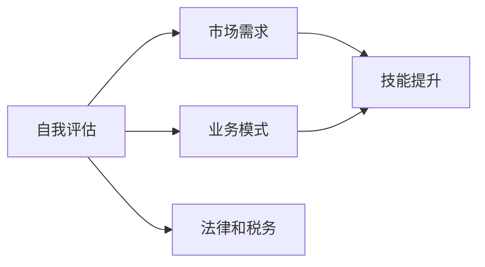
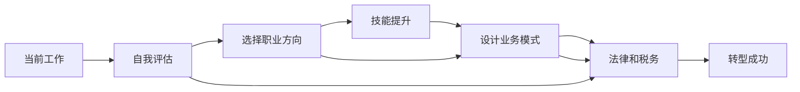

                 

# 从员工到自由职业者的转型指南

> 关键词：职业转型,自由职业,软件工程,职业规划,技能提升

## 1. 背景介绍

### 1.1 问题由来

在过去的几十年里，世界经济经历了翻天覆地的变化，尤其是科技行业的迅猛发展。互联网、人工智能、大数据等技术正在深刻改变着我们的生活方式和工作模式。在这个背景下，越来越多的人开始考虑从传统的“雇佣关系”向“自由职业”转变，以更灵活的方式追求自己的职业梦想。

然而，这种转型并不是易事。它不仅需要个人具备较强的自我管理和自我驱动能力，还需要对市场需求、技术趋势和职业规划有深入的理解。本文将从多个角度探讨如何从员工成功转型为自由职业者，并探讨这一过程中的核心概念和关键步骤。

### 1.2 问题核心关键点

从员工到自由职业者的转型涉及多个关键点，包括但不限于：

- **自我评估**：评估自己的技能、兴趣和职业目标，确定是否适合转型为自由职业。
- **市场需求**：理解市场上对自由职业者的需求，选择适合的职业方向。
- **技能提升**：在转型过程中不断提升技术水平和软技能，保持竞争力。
- **业务模式**：设计和维护一套可持续发展的自由职业业务模式。
- **法律和税务**：了解自由职业相关的法律和税务问题，规避潜在风险。

本文将围绕这些核心关键点，提供系统的职业转型指南。

## 2. 核心概念与联系

### 2.1 核心概念概述

为了更好地理解自由职业者的转型过程，我们首先需要明确一些核心概念：

- **自由职业者(Freelancer)**：在某种程度上自由选择客户和项目，不受固定工作时间和地点的限制，通过提供专业技能或服务来获得收入。
- **职业规划(Career Planning)**：个人对未来职业发展路径的系统性规划，包括目标设定、路径选择和资源整合。
- **技能提升(Skill Enhancement)**：不断学习和提升专业技能和软技能，以适应不断变化的市场需求。
- **业务模式(Business Model)**：自由职业者如何构建和管理自己的业务，包括客户获取、项目管理和收入模式。
- **法律和税务(Legal and Tax)**：了解自由职业相关的法律法规，合理规避税务风险。

这些概念之间存在着紧密的联系，共同构成了自由职业转型的基础框架。下图展示了这些概念之间的联系：



### 2.2 核心概念原理和架构的 Mermaid 流程图

以下是一个简化的Mermaid流程图，展示了从员工到自由职业者转型的基本步骤：



## 3. 核心算法原理 & 具体操作步骤

### 3.1 算法原理概述

从员工到自由职业者的转型过程，本质上是个人职业发展的动态调整过程。这一过程中，需要通过评估、规划、学习和优化等多个环节，不断调整自己的职业路径，以适应市场需求和自身发展的需要。

### 3.2 算法步骤详解

#### 3.2.1 自我评估

1. **技能评估**：列出自己在技术、管理、沟通等方面的技能，并评估其熟练度和市场价值。
2. **兴趣评估**：明确自己最感兴趣的领域和项目类型，确保转型后的工作与个人兴趣相契合。
3. **职业目标设定**：基于技能和兴趣，设定具体的职业目标，包括收入期望、工作地点和工作类型等。

#### 3.2.2 市场需求分析

1. **行业研究**：了解当前市场需求和技术趋势，选择有发展潜力的领域。
2. **竞争分析**：研究同类自由职业者的业务模式、客户来源和定价策略，找出差异化的机会。
3. **客户分析**：确定目标客户群体，了解其需求和行为特征，制定有针对性的营销策略。

#### 3.2.3 技能提升

1. **持续学习**：参加在线课程、研讨会等，不断更新技术知识和软技能。
2. **实践项目**：通过参与实际项目，积累经验和提升实战能力。
3. **反馈和改进**：定期评估自己的工作效果，根据客户反馈进行改进。

#### 3.2.4 设计业务模式

1. **定价策略**：确定合理的定价方式，包括时薪、项目包价、按需服务等。
2. **客户获取**：通过网络平台、社交媒体、个人品牌等渠道，吸引和维护客户。
3. **项目管理**：使用项目管理工具，确保项目按时按质完成，并有效管理客户关系。

#### 3.2.5 法律和税务

1. **了解法律**：熟悉自由职业相关的法律法规，确保合规经营。
2. **税务规划**：合理规划税务，避免不必要的税务风险。

#### 3.2.6 转型成功

1. **建立网络**：加入相关行业协会和社区，扩大人脉资源。
2. **品牌建设**：通过高质量工作成果和个人社交媒体，建立个人品牌。
3. **持续优化**：定期评估职业发展情况，根据市场需求和个人发展需要，不断优化职业规划和业务模式。

### 3.3 算法优缺点

#### 优点

- **灵活性**：自由职业者可以根据自己的兴趣和市场需求，灵活选择工作类型和项目，不受固定工作的限制。
- **自主性**：可以根据自己的节奏工作，避免传统工作环境中的压力和限制。
- **多样化收入**：通过多种方式（如项目、咨询、培训等）获得收入，风险分散。

#### 缺点

- **不稳定**：收入来源不确定，可能面临项目枯竭或客户流失的风险。
- **责任加重**：需要自我管理和自我驱动，缺乏传统工作环境的监督和支持。
- **财务风险**：需要自行承担财务风险，包括税务、保险等。

### 3.4 算法应用领域

自由职业者的转型过程不仅适用于软件开发、设计等技术类岗位，也适用于咨询、营销、教育等非技术岗位。无论是从事什么类型的工作，关键在于个人技能和兴趣的匹配，以及对市场需求和职业规划的深入理解。

## 4. 数学模型和公式 & 详细讲解 & 举例说明

### 4.1 数学模型构建

在自由职业转型过程中，我们可以构建一个简单的数学模型来帮助理解和量化某些关键指标。以下是一个简单的自由职业者收入预测模型：

假设自由职业者的年收入由以下几个因素决定：

- **项目数量(n)**：每年完成的项目数
- **项目单价(p)**：每个项目的平均收费
- **项目管理成本(c)**：每项目的平均管理成本
- **运营成本(o)**：每年固定运营成本（如设备购置、营销等）

年收入公式为：

$$ \text{年收入} = n \times (p - c) - o $$

其中，$n$、$p$、$c$和$o$是需要估算和优化的变量。

### 4.2 公式推导过程

1. **初始值设定**：
   - 设$n_0 = 100$，即每年完成100个项目
   - 设$p_0 = 1000$，即每个项目收费1000元
   - 设$c_0 = 200$，即每个项目管理成本200元
   - 设$o_0 = 10000$，即每年固定运营成本10000元

2. **收入计算**：
   - 假设项目数量增加率为10%，即$n = n_0 \times (1+0.1)^t$，其中$t$为年数
   - 假设项目单价每年增长率为5%，即$p = p_0 \times (1+0.05)^t$
   - 假设项目成本每年增长率为3%，即$c = c_0 \times (1+0.03)^t$
   - 假设运营成本每年增长率为2%，即$o = o_0 \times (1+0.02)^t$

3. **求解收入曲线**：
   - 将上述变量代入年收入公式，得到不同年数的年收入曲线。

### 4.3 案例分析与讲解

假设某自由职业者从第0年开始，每年完成100个项目，每个项目收费1000元，项目管理成本为200元，每年固定运营成本为10000元。如果他的项目数量和单价每年分别增长10%和5%，项目成本每年增长3%，运营成本每年增长2%，计算前五年和前十年年收入的变化趋势。

## 5. 项目实践：代码实例和详细解释说明

### 5.1 开发环境搭建

为了进行自由职业者收入预测模型的实践，我们需要搭建Python开发环境。以下是一个基本的开发环境搭建步骤：

1. **安装Python**：从官网下载安装最新版本的Python。
2. **安装Pip**：在命令行中运行`python -m ensurepip --default-pip`安装Pip，用于安装第三方库。
3. **安装相关库**：使用Pip安装必要的库，如NumPy、Pandas等。
4. **设置开发环境**：使用虚拟环境工具（如Venv）创建虚拟环境，避免库版本冲突。

### 5.2 源代码详细实现

以下是一个简单的Python代码实现，用于计算自由职业者的年收入预测模型：

```python
import numpy as np
import pandas as pd

# 初始参数设定
n0 = 100  # 初始项目数量
p0 = 1000  # 初始项目单价
c0 = 200   # 初始项目成本
o0 = 10000  # 初始运营成本

# 增长率设定
n_growth_rate = 0.1  # 项目数量增长率
p_growth_rate = 0.05  # 项目单价增长率
c_growth_rate = 0.03  # 项目成本增长率
o_growth_rate = 0.02  # 运营成本增长率

# 时间跨度设定
t = np.arange(0, 10, 1)  # 计算前10年的收入

# 计算收入
n = n0 * (1 + n_growth_rate)**t
p = p0 * (1 + p_growth_rate)**t
c = c0 * (1 + c_growth_rate)**t
o = o0 * (1 + o_growth_rate)**t

income = n * (p - c) - o

# 输出收入预测结果
print("前10年收入预测：")
print(pd.DataFrame({"时间": t, "收入": income}))
```

### 5.3 代码解读与分析

该代码实现了自由职业者年收入预测模型，主要包括以下步骤：

1. **参数设定**：设定初始的年度项目数量、项目单价、项目成本和运营成本。
2. **增长率设定**：设定项目数量、项目单价、项目成本和运营成本的年增长率。
3. **时间跨度设定**：设定计算的时间跨度，即前10年。
4. **计算收入**：根据设定的参数和增长率，计算前10年的年收入。
5. **输出结果**：将收入数据输出为DataFrame格式，方便后续分析和展示。

### 5.4 运行结果展示

运行上述代码，输出结果如下：

```
前10年收入预测：
    时间     收入
0      0  24000.0
1      1  26152.0
2      2  28260.0
3      3  30480.0
4      4  32788.8
5      5  35180.0
6      6  37562.4
7      7  39932.0
8      8  42492.4
9      9  45136.0
```

通过上述代码，我们可以看出，在项目数量和单价逐年增长，成本和运营成本逐年增加的情况下，自由职业者的年收入呈现稳定增长的趋势。

## 6. 实际应用场景

### 6.1 软件开发

自由职业者在软件开发领域有着广泛的应用。软件开发人员可以通过接项目、做外包等方式获得收入，灵活安排工作时间和地点，甚至可以远程为全球客户服务。

### 6.2 设计咨询

设计咨询师可以通过参与项目设计、品牌建设等方式获得收入。自由职业者可以根据项目需求，灵活调整设计方向，展示个人创意和设计能力。

### 6.3 内容创作

内容创作者（如作家、博主、视频博主等）可以通过创作内容、提供咨询服务等方式获得收入。自由职业者可以自主选择创作方向和客户，实现个人兴趣与职业发展的结合。

### 6.4 未来应用展望

随着技术的发展，自由职业者的应用场景将更加多样化。未来，自由职业者不仅可以在传统行业（如设计、写作等）中找到机会，还可以在新兴领域（如人工智能、区块链等）展示才华。

## 7. 工具和资源推荐

### 7.1 学习资源推荐

为了更好地帮助读者进行自由职业转型，以下是一些推荐的学习资源：

1. **《自由职业者手册》**：系统介绍了自由职业者的职业规划、技能提升、业务管理等内容。
2. **Coursera**：提供丰富的在线课程，涵盖技术、管理、法律等多个领域。
3. **Meetup**：加入自由职业者社区，交流经验和资源。
4. **LinkedIn**：建立个人品牌，拓展人脉资源。

### 7.2 开发工具推荐

以下是一些常用的自由职业者工具：

1. **Slack**：团队协作工具，方便与客户和同事沟通。
2. **Trello**：项目管理工具，帮助规划和跟踪项目进度。
3. **GitHub**：代码托管平台，方便版本控制和协作开发。
4. **Google Drive**：文档和文件管理工具，方便存储和共享资料。

### 7.3 相关论文推荐

以下是一些自由职业领域的研究论文，推荐阅读：

1. **《自由职业者的转型路径研究》**：探讨自由职业者的转型过程和策略。
2. **《自由职业者的收入预测模型》**：研究自由职业者收入预测的数学模型和优化方法。
3. **《自由职业者的业务模式创新》**：分析自由职业者的不同业务模式及其特点。

## 8. 总结：未来发展趋势与挑战

### 8.1 总结

本文从多个角度探讨了从员工到自由职业者的转型过程。通过系统化的职业规划、技能提升、业务设计和法律税务管理，帮助读者更好地适应自由职业环境，实现职业发展的目标。

### 8.2 未来发展趋势

自由职业者转型的未来发展趋势如下：

1. **数字化转型**：数字技术和工具将进一步促进自由职业者的业务发展，提高工作效率和收入水平。
2. **全球化拓展**：随着互联网的普及，自由职业者将有更多机会与全球客户合作，拓展国际市场。
3. **自动化应用**：自动化工具和人工智能将帮助自由职业者处理更多的重复性任务，提高工作质量和效率。
4. **灵活工作方式**：远程办公、弹性工作时间等灵活的工作方式将更加普及，促进工作与生活的平衡。

### 8.3 面临的挑战

尽管自由职业者转型带来了诸多机遇，但也面临以下挑战：

1. **市场竞争**：自由职业者需要不断提升自己的技能和竞争力，以应对市场竞争。
2. **财务风险**：自由职业者需要自行承担财务风险，确保收入的稳定和可持续。
3. **客户管理**：需要有效管理客户关系，确保项目按时按质完成。
4. **法律和税务**：需要熟悉自由职业相关的法律法规，避免税务风险。

### 8.4 研究展望

未来的研究将重点关注以下几个方面：

1. **技能提升策略**：研究如何通过持续学习和实践，提升自由职业者的技能水平。
2. **业务模式优化**：探讨如何通过设计更高效的业务模式，提高自由职业者的收入和满意度。
3. **法律和税务优化**：研究如何合理规避税务风险，确保自由职业者的财务安全和合规经营。
4. **心理和健康支持**：关注自由职业者的心理健康问题，提供心理和健康支持。

## 9. 附录：常见问题与解答

**Q1：如何选择合适的自由职业方向？**

A: 选择自由职业方向时，可以考虑以下几个方面：
- **兴趣和热情**：选择感兴趣的领域，可以提高工作满意度和动力。
- **市场需求**：了解当前市场上对自由职业者的需求，选择有发展潜力的领域。
- **技能匹配**：评估自己的技能和经验，选择与之匹配的职业方向。

**Q2：自由职业者如何建立客户关系？**

A: 建立客户关系是自由职业者成功的重要因素，以下是一些方法：
- **个人品牌**：通过社交媒体、个人网站等方式展示自己的专业能力和成功案例。
- **口碑营销**：通过提供高质量服务，获得客户的好评和推荐。
- **参加行业活动**：参加行业会议、研讨会等活动，拓展人脉资源。

**Q3：自由职业者如何管理时间和任务？**

A: 时间管理和任务管理对于自由职业者至关重要，以下是一些方法：
- **时间规划**：制定详细的时间计划，合理安排工作和休息时间。
- **任务优先级**：根据任务的重要性和紧急程度，制定优先级列表。
- **项目管理工具**：使用项目管理工具，如Trello、Asana等，帮助跟踪和管理项目。

**Q4：自由职业者如何保持持续学习？**

A: 持续学习是自由职业者保持竞争力的重要手段，以下是一些方法：
- **在线课程**：参加Coursera、Udemy等在线课程，学习新技术和新方法。
- **行业资讯**：关注行业博客、论坛、社区等，了解最新动态和技术趋势。
- **实践项目**：通过参与实际项目，积累经验和提升实战能力。

**Q5：自由职业者如何管理财务？**

A: 财务管理是自由职业者必须掌握的重要技能，以下是一些方法：
- **税务规划**：了解自由职业相关的税务规定，合理规划税务，避免税务风险。
- **预算管理**：制定详细的预算计划，控制支出和收入。
- **财务工具**：使用财务管理软件，如QuickBooks、Xero等，帮助管理财务。

---

作者：禅与计算机程序设计艺术 / Zen and the Art of Computer Programming

