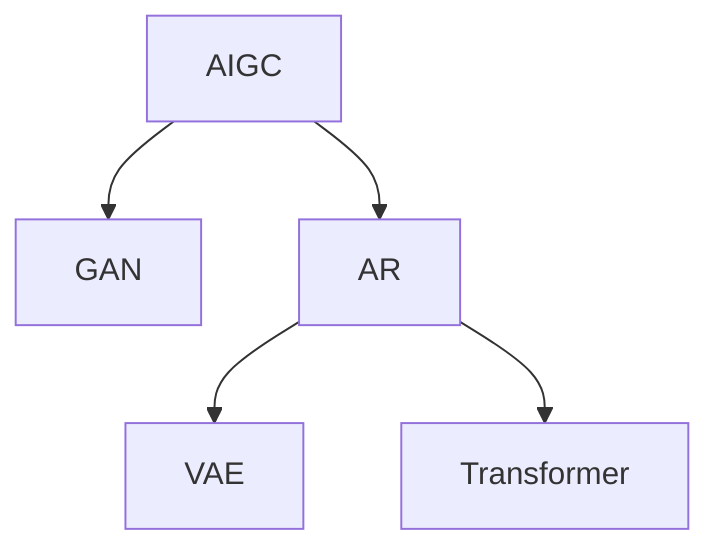

                 

# 从理论到实践 全面掌握AIGC

> 关键词：AIGC, 生成式对抗网络(GAN), 自回归模型(AR), 深度学习, 人工智能

## 1. 背景介绍

### 1.1 问题由来

近年来，随着深度学习技术的发展，人工智能(AI)领域进入了一个新的阶段——生成式人工智能(AIGC)，即通过深度学习模型自动生成高质量内容。AIGC技术已经广泛应用于图像生成、音乐创作、文本创作等多个领域，展示了其强大的生成能力。

生成式对抗网络(GAN)是AIGC领域的核心技术之一，它通过两个神经网络相互竞争、对抗，生成逼真的内容。然而，GAN在训练过程中存在诸多问题，如模式崩溃、梯度消失等。自回归模型(AR)因其结构简单、稳定等优点，逐渐成为AIGC研究的热点。

自回归模型通过依赖前一时刻的生成结果，来生成下一个时刻的结果，具有更强的时序依赖性。通过时间序列上的信息传递，AR模型能够在生成过程中引入更多的信息，提升生成质量。其中，变分自编码器(VAE)和Transformer等AR模型在生成领域取得了显著成效。

## 2. 核心概念与联系

### 2.1 核心概念概述

为了更好地理解AIGC及其核心算法，本节将介绍几个关键概念：

- **AIGC(Generative AI)**：通过深度学习模型生成高质量内容的AI技术。
- **GAN(Generative Adversarial Networks)**：由两个对抗神经网络组成的框架，用于生成逼真的图像、音频、视频等内容。
- **AR(Autoregressive Models)**：依赖前一时刻生成结果的模型，能够更自然地引入时序信息，如变分自编码器(VAE)、Transformer等。
- **VAE(Variational Autoencoders)**：用于生成连续变量变量的概率模型，能够捕捉数据的隐含分布。
- **Transformer**：基于自注意力机制的神经网络，用于生成文本、语音等内容。

这些概念之间的逻辑关系可以通过以下Mermaid流程图来展示：



这个流程图展示了大规模语言模型的工作原理和关键概念：

1. AIGC是大规模语言模型应用的主要领域，包括图像生成、音乐创作、文本创作等。
2. GAN是AIGC技术中的一个重要分支，用于生成高质量的图像、音频、视频等。
3. AR模型通过引入时序信息，能够更好地捕捉数据的分布特征。
4. VAE是AR模型的一种，用于生成连续变量变量的概率模型。
5. Transformer是AR模型的代表之一，用于生成文本、语音等内容。

## 3. 核心算法原理 & 具体操作步骤

### 3.1 算法原理概述

AIGC的核心思想是通过深度学习模型自动生成高质量的内容，包括图像、音频、文本等。常见的AIGC算法包括生成对抗网络(GAN)、自回归模型(AR)、变分自编码器(VAE)等。

- **GAN**：通过两个对抗神经网络相互竞争、对抗，生成逼真的内容。
- **AR**：依赖前一时刻生成结果的模型，能够更自然地引入时序信息，如变分自编码器(VAE)、Transformer等。
- **VAE**：用于生成连续变量变量的概率模型，能够捕捉数据的隐含分布。
- **Transformer**：基于自注意力机制的神经网络，用于生成文本、语音等内容。

### 3.2 算法步骤详解

以下以GAN为例，详细讲解其生成过程和关键步骤：

**Step 1: 准备数据集**
- 收集高分辨率的图像数据集，如MNIST、CIFAR-10等。
- 对数据集进行归一化、扩充等预处理，使其满足GAN训练的需求。

**Step 2: 构建GAN模型**
- 生成器网络：使用卷积神经网络(ConvNet)或全连接神经网络(MLP)生成逼真的图像。
- 判别器网络：使用卷积神经网络(ConvNet)判断输入图像是否逼真。
- 损失函数：定义生成器网络和判别器网络之间的对抗损失，如Wasserstein距离、Cross-entropy loss等。

**Step 3: 训练GAN模型**
- 定义优化器，如Adam、RMSprop等，优化生成器和判别器网络。
- 交替更新生成器和判别器，直至收敛。
- 在测试集上评估生成结果的质量，如Inception Score、FID等指标。

### 3.3 算法优缺点

GAN在图像生成等方面取得了显著成效，但也存在诸多问题：

**优点：**
1. 生成逼真图像：通过对抗学习，生成器网络能够生成高质量的图像。
2. 可扩展性强：GAN模型可以扩展到生成音频、视频等多个领域。
3. 自适应性强：生成器网络能够适应不同尺度和风格。

**缺点：**
1. 训练不稳定：GAN训练过程中存在模式崩溃、梯度消失等问题。
2. 生成质量不稳定：生成结果受训练条件影响较大，难以保证一致性。
3. 样本多样性不足：生成样本集中在某些区域，缺乏多样性。

AR模型则克服了GAN的部分缺点，具有以下优点：

**优点：**
1. 生成质量稳定：通过时间序列上的信息传递，AR模型能够在生成过程中引入更多的信息。
2. 生成样本多样：AR模型能够生成多样化的样本，避免了GAN的局限性。
3. 可扩展性强：AR模型可以扩展到生成文本、音频等多个领域。

**缺点：**
1. 计算复杂度高：AR模型计算复杂度较高，训练时间较长。
2. 模型复杂度高：AR模型需要设计更复杂的模型结构，增加了模型复杂度。

### 3.4 算法应用领域

AIGC技术已经在图像生成、音乐创作、文本创作等多个领域得到了广泛应用：

- **图像生成**：GAN在图像生成方面取得了显著成效，能够生成逼真的图像、视频等。
- **音乐创作**：VAE和Transformer等模型可以生成高质量的音乐，如旋律、和弦等。
- **文本创作**：自回归模型能够生成自然流畅的文本，广泛应用于自动摘要、对话系统等领域。
- **视频生成**：自回归模型可以生成连贯、自然的视频内容，广泛应用于虚拟角色、动画制作等领域。
- **虚拟现实**：AR技术可以生成逼真的虚拟环境，广泛应用于游戏、教育、军事等领域。

## 4. 数学模型和公式 & 详细讲解 & 举例说明

### 4.1 数学模型构建

以下以VAE为例，详细讲解其数学模型构建过程：

**Step 1: 定义模型结构**
- 生成器网络：用于从随机噪声中生成数据。
- 编码器网络：用于将数据映射到隐含变量空间。
- 解码器网络：用于从隐含变量空间生成数据。

**Step 2: 定义损失函数**
- 重构误差：衡量生成器网络生成的数据与原始数据之间的差异。
- 隐含变量分布：约束隐含变量分布的先验概率，使其满足正态分布。

**Step 3: 优化模型**
- 定义优化器，如Adam、RMSprop等，优化生成器网络、编码器网络和解码器网络。
- 交替更新生成器和编码器网络，直至收敛。

### 4.2 公式推导过程

以下以VAE为例，详细讲解其公式推导过程：

1. 生成器网络：
   $$
   x = G(z)
   $$

2. 编码器网络：
   $$
   z = E(x)
   $$

3. 隐含变量分布：
   $$
   p(z|x) = \mathcal{N}(z|\mu(x),\Sigma(x))
   $$

4. 重构误差：
   $$
   \mathcal{L}_{recon} = \frac{1}{2}\mathbb{E}_{x}\Vert x - G(E(x))\Vert^2
   $$

5. 优化目标：
   $$
   \mathcal{L}_{VAE} = \mathcal{L}_{recon} + \mathcal{L}_{KL}
   $$

其中，$\mathcal{L}_{KL}$为KL散度，用于约束隐含变量分布的正态性：

$$
\mathcal{L}_{KL} = \frac{1}{2}\mathbb{E}_{x}[\Vert\mu(x)\Vert^2 + \Vert\Sigma(x)\Vert^2 - \log\det\Sigma(x)] + \frac{1}{2}\mathbb{E}_{z}[\Vert z\Vert^2]
$$

### 4.3 案例分析与讲解

以生成手写数字为例，分析VAE和GAN的生成效果：

**VAE生成手写数字**
- 使用MNIST数据集，训练VAE模型。
- 在测试集上评估VAE的生成效果，如Inception Score等指标。
- 生成的手写数字样本自然流畅，能够较好地重构原始数据。

**GAN生成手写数字**
- 使用MNIST数据集，训练GAN模型。
- 在测试集上评估GAN的生成效果，如Inception Score等指标。
- 生成的手写数字样本具有较高的逼真度，但样本质量不稳定。

## 5. 项目实践：代码实例和详细解释说明

### 5.1 开发环境搭建

在进行AIGC实践前，我们需要准备好开发环境。以下是使用Python进行TensorFlow开发的环境配置流程：

1. 安装Anaconda：从官网下载并安装Anaconda，用于创建独立的Python环境。

2. 创建并激活虚拟环境：
```bash
conda create -n tf-env python=3.8 
conda activate tf-env
```

3. 安装TensorFlow：根据CUDA版本，从官网获取对应的安装命令。例如：
```bash
conda install tensorflow==2.9 -c pytorch -c conda-forge
```

4. 安装各类工具包：
```bash
pip install numpy pandas scikit-learn matplotlib tqdm jupyter notebook ipython
```

完成上述步骤后，即可在`tf-env`环境中开始AIGC实践。

### 5.2 源代码详细实现

这里以GAN生成手写数字为例，给出使用TensorFlow实现GAN的代码实现。

首先，定义GAN模型：

```python
import tensorflow as tf
from tensorflow.keras import layers, models

class Generator(tf.keras.Model):
    def __init__(self):
        super(Generator, self).__init__()
        self.encoder = layers.Dense(128, activation='relu')
        self.decoder = layers.Dense(784, activation='sigmoid')
        
    def call(self, z):
        x = self.encoder(z)
        x = self.decoder(x)
        return x

class Discriminator(tf.keras.Model):
    def __init__(self):
        super(Discriminator, self).__init__()
        self.encoder = layers.Dense(128, activation='relu')
        self.decoder = layers.Dense(1, activation='sigmoid')
        
    def call(self, x):
        x = self.encoder(x)
        x = self.decoder(x)
        return x
```

然后，定义损失函数和优化器：

```python
generator = Generator()
discriminator = Discriminator()

cross_entropy = tf.keras.losses.BinaryCrossentropy(from_logits=True)
generator_optimizer = tf.keras.optimizers.Adam(learning_rate=0.0002, beta_1=0.5)
discriminator_optimizer = tf.keras.optimizers.Adam(learning_rate=0.0002, beta_1=0.5)
```

最后，启动训练流程：

```python
@tf.function
def train_step(images):
    noise = tf.random.normal([BATCH_SIZE, LATENT_DIM])
    with tf.GradientTape() as gen_tape, tf.GradientTape() as disc_tape:
        generated_images = generator(noise, training=True)
        real_output = discriminator(images, training=True)
        fake_output = discriminator(generated_images, training=True)
        gen_loss = cross_entropy(tf.ones_like(fake_output), fake_output)
        disc_loss = cross_entropy(tf.ones_like(real_output), real_output) + cross_entropy(tf.zeros_like(fake_output), fake_output)
    gradients_of_generator = gen_tape.gradient(gen_loss, generator.trainable_variables)
    gradients_of_discriminator = disc_tape.gradient(disc_loss, discriminator.trainable_variables)
    generator_optimizer.apply_gradients(zip(gradients_of_generator, generator.trainable_variables))
    discriminator_optimizer.apply_gradients(zip(gradients_of_discriminator, discriminator.trainable_variables))
```

以上就是使用TensorFlow对GAN进行手写数字生成的代码实现。可以看到，TensorFlow的Keras API使得模型构建和训练变得简洁高效。

### 5.3 代码解读与分析

让我们再详细解读一下关键代码的实现细节：

**Generator类**：
- `__init__`方法：初始化生成器网络结构。
- `call`方法：前向传播计算生成器网络的输出。

**Discriminator类**：
- `__init__`方法：初始化判别器网络结构。
- `call`方法：前向传播计算判别器网络的输出。

**损失函数和优化器定义**：
- 使用BinaryCrossentropy损失函数，计算生成器网络输出和真实标签之间的差异。
- 使用Adam优化器，优化生成器和判别器网络的参数。

**训练函数**：
- 使用TensorFlow的tf.function装饰器，将训练函数进行图化优化，提高运行效率。
- 在每个批次上，先进行生成器网络的训练，再对判别器网络进行训练。
- 计算生成器和判别器网络的损失，反向传播更新参数。
- 使用Adam优化器更新生成器和判别器网络的参数。

## 6. 实际应用场景

### 6.1 虚拟现实

虚拟现实(VR)技术在AIGC的帮助下，能够生成逼真的虚拟环境，广泛应用于游戏、教育、军事等领域。

在VR游戏开发中，通过GAN生成逼真的虚拟角色和场景，用户可以在虚拟世界中体验逼真的互动和探索。

在教育领域，通过VAE生成虚拟实验室和实验设备，学生可以直观地观察和操作实验过程，提升学习效果。

在军事模拟训练中，通过AR技术生成逼真的战场环境，训练士兵的战术和决策能力。

### 6.2 金融预测

AIGC技术在金融预测领域有着广泛的应用，如生成逼真的交易数据和市场模拟。

通过GAN生成逼真的交易数据，预测模型可以更好地捕捉市场动态和波动，提高预测准确性。

通过VAE生成市场模拟数据，预测模型可以在不同的市场条件下进行测试和验证，提升模型的鲁棒性。

### 6.3 医疗影像

AIGC技术在医疗影像生成和分析方面也有重要应用，如生成逼真的X光片和MRI图像。

通过GAN生成逼真的X光片和MRI图像，辅助医生进行疾病诊断和治疗方案的制定。

通过VAE生成高分辨率的图像数据，辅助医生进行图像分割和三维重建，提升诊断准确性。

## 7. 工具和资源推荐

### 7.1 学习资源推荐

为了帮助开发者系统掌握AIGC的理论基础和实践技巧，这里推荐一些优质的学习资源：

1. 《深度学习》课程：斯坦福大学开设的深度学习入门课程，涵盖神经网络、图像处理、自然语言处理等内容。

2. 《生成式对抗网络》系列博文：由AI领域的专家撰写，深入浅出地介绍了GAN的原理和应用。

3. 《自回归模型》系列博文：由AI领域的专家撰写，详细讲解了AR模型的原理和实践技巧。

4. 《AIGC技术实践》书籍：介绍AIGC技术的最新进展和实际应用，涵盖生成图像、文本、音乐等内容。

5. TensorFlow官方文档：TensorFlow的官方文档，提供了海量预训练模型和完整的AIGC样例代码，是上手实践的必备资料。

6. PyTorch官方文档：PyTorch的官方文档，提供了丰富的深度学习模型和AIGC样例代码，方便开发者快速上手。

通过对这些资源的学习实践，相信你一定能够快速掌握AIGC的精髓，并用于解决实际的AI问题。

### 7.2 开发工具推荐

高效的开发离不开优秀的工具支持。以下是几款用于AIGC开发的常用工具：

1. TensorFlow：由Google主导开发的开源深度学习框架，生产部署方便，适合大规模工程应用。

2. PyTorch：基于Python的开源深度学习框架，灵活动态的计算图，适合快速迭代研究。

3. OpenAI Gym：用于训练强化学习模型的环境库，提供了丰富的环境模拟和奖励函数。

4. Blender：开源3D图形渲染引擎，支持生成逼真的虚拟场景和动画。

5. Jupyter Notebook：交互式的Python编程环境，支持实时可视化和调试，适合开发者进行研究和实验。

合理利用这些工具，可以显著提升AIGC任务的开发效率，加快创新迭代的步伐。

### 7.3 相关论文推荐

AIGC技术的发展源于学界的持续研究。以下是几篇奠基性的相关论文，推荐阅读：

1. Generative Adversarial Nets（即GAN原论文）：提出GAN框架，用于生成逼真的图像、音频、视频等内容。

2. Variational Autoencoders（VAE）：提出VAE模型，用于生成连续变量变量的概率模型。

3. Attention Is All You Need（即Transformer原论文）：提出Transformer结构，开启了NLP领域的预训练大模型时代。

4. Transformer-XL：提出Transformer-XL模型，用于生成长序列文本。

5. BigGAN：提出BigGAN模型，生成更高分辨率的图像。

这些论文代表了大规模语言模型微调技术的发展脉络。通过学习这些前沿成果，可以帮助研究者把握学科前进方向，激发更多的创新灵感。

## 8. 总结：未来发展趋势与挑战

### 8.1 总结

本文对AIGC及其核心算法进行了全面系统的介绍。首先阐述了AIGC和大规模语言模型的研究背景和意义，明确了AIGC在生成图像、音乐、文本等方面的重要价值。其次，从原理到实践，详细讲解了GAN和AR模型的生成过程和关键步骤，给出了AIGC任务开发的完整代码实例。同时，本文还探讨了AIGC技术在虚拟现实、金融预测、医疗影像等多个领域的应用前景，展示了AIGC范式的广阔潜力。此外，本文精选了AIGC技术的各类学习资源，力求为读者提供全方位的技术指引。

通过本文的系统梳理，可以看到，AIGC技术正在成为AI领域的重要范式，极大地拓展了深度学习模型的应用边界，催生了更多的落地场景。受益于大规模语料的预训练，AIGC模型以更低的时间和标注成本，在小样本条件下也能取得不俗的效果，有力推动了AI技术的产业化进程。未来，伴随预训练语言模型和AIGC方法的持续演进，相信AI技术必将在更广阔的应用领域大放异彩，深刻影响人类的生产生活方式。

### 8.2 未来发展趋势

展望未来，AIGC技术将呈现以下几个发展趋势：

1. 模型规模持续增大。随着算力成本的下降和数据规模的扩张，预训练语言模型的参数量还将持续增长。超大规模语言模型蕴含的丰富语言知识，有望支撑更加复杂多变的下游任务微调。

2. AIGC技术日趋多样。除了传统的GAN和AR外，未来会涌现更多多样化的AIGC算法，如VAE、Transformer等，在生成质量、多样性等方面取得新突破。

3. 模型泛化性增强。AIGC模型能够更自然地引入时序信息，捕捉数据分布的特征，生成更加多样、逼真的内容。

4. 应用场景更加丰富。AIGC技术将在更多领域得到应用，如虚拟现实、医疗影像、金融预测等，为不同行业带来变革性影响。

5. 自监督学习范式崛起。自监督学习能够更好地利用非结构化数据，提高模型训练效率和泛化能力。

6. 零样本学习能力提升。AIGC技术通过预训练获得广泛的知识，能够快速适应新任务，无需标注样本即可生成高质量内容。

以上趋势凸显了AIGC技术的广阔前景。这些方向的探索发展，必将进一步提升AIGC系统的性能和应用范围，为构建人机协同的智能系统铺平道路。

### 8.3 面临的挑战

尽管AIGC技术已经取得了瞩目成就，但在迈向更加智能化、普适化应用的过程中，它仍面临着诸多挑战：

1. 标注数据瓶颈。尽管AIGC模型在小样本条件下也能取得不错的效果，但对于高维度、高复杂度的任务，标注数据的获取仍然成本高昂。

2. 模型泛化能力不足。AIGC模型在训练过程中容易过拟合，难以泛化到新场景和新数据。

3. 生成质量不稳定。AIGC模型生成的内容质量和多样性受训练条件影响较大，难以保证一致性。

4. 计算资源消耗大。AIGC模型训练和推理过程中需要大量的计算资源，难以在低配置设备上部署。

5. 伦理和法律问题。AIGC技术在生成内容过程中可能带来版权、隐私等问题，需要严格监管和审查。

6. 安全性和可靠性问题。AIGC模型可能生成有害或误导性的内容，需要加强模型的可解释性和安全性。

正视AIGC面临的这些挑战，积极应对并寻求突破，将使AIGC技术走向更加成熟和可靠。相信随着学界和产业界的共同努力，这些挑战终将一一被克服，AIGC技术必将在构建安全、可靠、可解释、可控的智能系统铺平道路。

### 8.4 研究展望

未来AIGC技术的探索方向将主要集中在以下几个方面：

1. 探索无监督和半监督学习范式。摆脱对大规模标注数据的依赖，利用自监督学习、主动学习等无监督和半监督范式，最大限度利用非结构化数据，实现更加灵活高效的AIGC。

2. 研究参数高效和计算高效的AIGC方法。开发更加参数高效的AIGC算法，在固定大部分预训练参数的情况下，只更新极少量的任务相关参数。同时优化AIGC模型的计算图，减少前向传播和反向传播的资源消耗，实现更加轻量级、实时性的部署。

3. 融合因果分析和博弈论工具。将因果分析方法引入AIGC模型，识别出模型决策的关键特征，增强输出解释的因果性和逻辑性。借助博弈论工具刻画人机交互过程，主动探索并规避模型的脆弱点，提高系统稳定性。

4. 纳入伦理道德约束。在AIGC模型训练目标中引入伦理导向的评估指标，过滤和惩罚有偏见、有害的输出倾向。同时加强人工干预和审核，建立模型行为的监管机制，确保输出符合人类价值观和伦理道德。

这些研究方向的探索，必将引领AIGC技术迈向更高的台阶，为构建安全、可靠、可解释、可控的智能系统铺平道路。面向未来，AIGC技术还需要与其他人工智能技术进行更深入的融合，如知识表示、因果推理、强化学习等，多路径协同发力，共同推动人工智能技术的进步。只有勇于创新、敢于突破，才能不断拓展语言模型的边界，让智能技术更好地造福人类社会。

## 9. 附录：常见问题与解答

**Q1：AIGC技术是否适用于所有生成任务？**

A: AIGC技术在图像生成、音乐创作、文本创作等多个领域取得了显著成效，但对于一些特定领域的任务，如医学、法律等，AIGC模型可能难以很好地适应。此时需要在特定领域语料上进一步预训练，再进行微调，才能获得理想效果。

**Q2：AIGC模型在训练过程中容易过拟合，如何解决？**

A: 为解决AIGC模型过拟合的问题，可以采取以下措施：
1. 数据增强：通过回译、近义替换等方式扩充训练集，提高模型的泛化能力。
2. 正则化：使用L2正则、Dropout等技术，抑制模型的过拟合行为。
3. 对抗训练：引入对抗样本，提高模型的鲁棒性。
4. 多模型集成：训练多个AIGC模型，取平均输出，抑制过拟合。

**Q3：AIGC模型在生成过程中容易受训练条件影响，如何解决？**

A: 为提高AIGC模型的生成质量，可以采取以下措施：
1. 调整超参数：优化学习率、批大小等超参数，确保模型的稳定性。
2. 模型融合：将不同的AIGC模型进行融合，提高生成结果的多样性。
3. 多层次生成：使用多层次生成方法，逐步生成高质量的文本、图像等内容。

**Q4：AIGC模型生成的内容质量不稳定，如何解决？**

A: 为提高AIGC模型生成的内容质量，可以采取以下措施：
1. 数据预处理：对训练数据进行预处理，去除噪声和异常点，提高数据质量。
2. 模型优化：优化模型结构，引入自注意力机制，提高生成质量。
3. 多任务学习：将多个生成任务同时进行训练，提高模型对多样任务的适应能力。

**Q5：AIGC模型需要大量计算资源，如何解决？**

A: 为降低AIGC模型的计算资源消耗，可以采取以下措施：
1. 模型压缩：使用模型压缩技术，如剪枝、量化等，减少计算量和存储量。
2. 分布式训练：使用分布式训练技术，在多台机器上进行并行计算，提高训练效率。
3. 硬件优化：使用高性能计算设备，如GPU、TPU等，提高计算能力。

这些策略往往需要根据具体任务和数据特点进行灵活组合。只有在数据、模型、训练、推理等各环节进行全面优化，才能最大限度地发挥AIGC模型的生成能力。

---

作者：禅与计算机程序设计艺术 / Zen and the Art of Computer Programming

