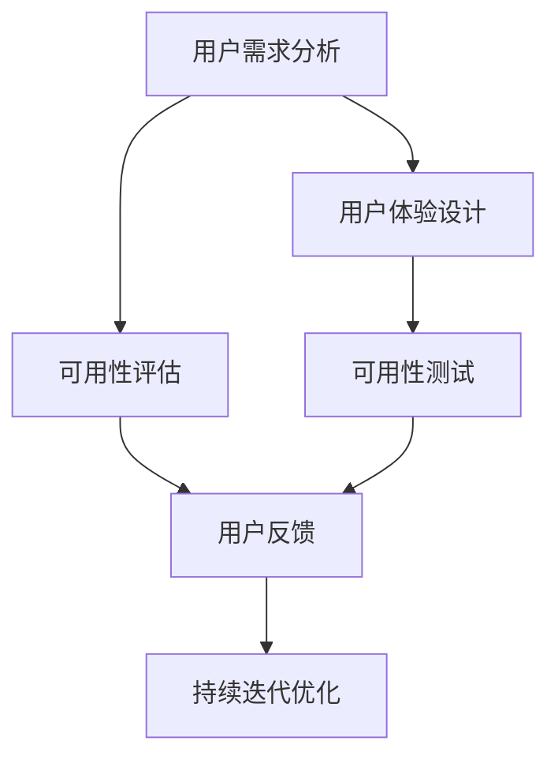

                 

# 以用户为中心：设计友好、易用的人机界面

> 关键词：用户界面(UI)设计、用户体验(UX)、人机交互(HCI)、可用性测试、可用性评估、易用性、用户中心设计(UCD)

## 1. 背景介绍

### 1.1 问题由来

随着计算机技术的飞速发展，人机界面(UI)设计已经成为构建高效、友好的用户交互系统不可或缺的一部分。用户界面的友好程度不仅直接影响到用户的体验质量，还关系到系统的可用性和用户满意度。然而，传统的用户界面设计往往以技术为中心，难以真正实现以用户为中心的设计理念。这种做法往往导致用户体验差、操作复杂，进而影响系统的可用性和用户粘性。

### 1.2 问题核心关键点

为了实现以用户为中心的设计，我们需要从以下几个方面入手：

1. **用户需求分析**：通过对用户行为和需求的深入理解，明确目标用户群体的核心需求和痛点，以用户需求为导向，进行设计。
2. **用户体验设计**：关注用户在使用产品时的感受，通过简化流程、提高效率、增强互动等手段，提升用户体验。
3. **可用性评估**：通过严格的可用性测试和评估，不断改进设计，确保系统满足用户需求，提升产品的可用性。
4. **持续迭代优化**：在收集用户反馈的基础上，持续迭代优化产品设计，保持用户的高满意度。

### 1.3 问题研究意义

设计友好、易用的人机界面对提升用户满意度、提高系统可用性和促进产品创新具有重要意义。具体而言：

1. **增强用户粘性**：良好的用户体验能显著提升用户对产品的满意度和忠诚度，增加用户粘性。
2. **提升系统可用性**：通过优化人机交互设计，提升系统的操作性和响应速度，增强系统的可用性。
3. **降低用户学习成本**：友好的用户界面设计能显著降低用户的学习成本，使新用户能快速上手，提高用户的使用效率。
4. **促进创新发展**：用户体验优化能激发更多用户灵感，促进产品创新，推动技术进步。

## 2. 核心概念与联系

### 2.1 核心概念概述

为了更好地理解以用户为中心的设计理念，我们首先介绍几个关键概念：

- **用户界面(UI)**：人机交互的视觉界面，包括按钮、菜单、文本框等元素。UI设计直接影响用户的操作体验和系统可用性。
- **用户体验(UX)**：用户与产品交互过程中产生的感受，包括情感、认知、行为等方面。UX设计关注提升用户满意度。
- **人机交互(HCI)**：用户与计算机系统之间的交互方式和过程。HCI设计注重提高人机交互的自然性和效率。
- **可用性测试(UAT)**：通过测试验证系统是否满足用户需求和目标，优化设计以满足用户期望。
- **可用性评估(UAE)**：评估系统设计是否满足用户需求，提出改进建议以提升用户体验。
- **易用性(Usability)**：衡量用户使用系统的效率、准确性和满意度，是设计优化和评估的重要指标。

这些概念之间具有密切的联系，共同构成了以用户为中心设计的基础框架。

### 2.2 核心概念原理和架构的 Mermaid 流程图



此流程图展示了以用户为中心设计的核心流程：

1. **用户需求分析**：通过调研和分析，明确目标用户群体的核心需求和痛点。
2. **用户体验设计**：设计直观、易用、高效的UI和UX元素，提升用户满意度。
3. **可用性评估**：通过严格的UAT和UAE流程，验证和改进设计，确保系统满足用户需求。
4. **持续迭代优化**：根据用户反馈不断改进产品设计，保持高满意度。

## 3. 核心算法原理 & 具体操作步骤

### 3.1 算法原理概述

以用户为中心的设计原理，核心在于通过科学的方法论和工具，分析和优化人机交互过程，提升用户体验。具体而言，包括以下几个关键步骤：

1. **用户需求分析**：通过问卷调查、用户访谈等方式，收集目标用户群体的需求和痛点。
2. **用户体验设计**：基于用户需求，设计直观、易用的UI和UX元素，优化用户操作流程。
3. **可用性评估**：通过严格的测试流程，验证设计是否满足用户需求，提出改进建议。
4. **持续迭代优化**：根据用户反馈，持续改进产品设计，确保高用户满意度。

### 3.2 算法步骤详解

#### 3.2.1 用户需求分析

用户需求分析是设计以用户为中心的人机界面的前提。以下是具体的步骤：

1. **定义目标用户群体**：明确产品的主要目标用户，了解其年龄、职业、教育背景、技术水平等信息。
2. **调研用户行为**：通过问卷调查、用户访谈等方式，收集目标用户在使用类似产品时的行为和偏好。
3. **识别用户痛点**：分析用户行为数据，找出用户在使用产品时遇到的主要问题和痛点。
4. **优先级排序**：根据问题的重要性和解决难度，进行优先级排序，确定设计的重点方向。

#### 3.2.2 用户体验设计

用户体验设计是实现以用户为中心设计的核心环节。以下是具体的步骤：

1. **界面布局设计**：基于用户需求，设计直观、易用的界面布局，使关键功能元素可见且易于操作。
2. **交互流程优化**：通过简化操作流程、减少步骤等手段，提升用户操作效率和体验。
3. **视觉元素设计**：设计符合用户审美和习惯的视觉元素，如颜色、字体、图标等，提升视觉体验。
4. **反馈设计**：通过动画、声音等反馈方式，增强用户操作的反馈效果，提升操作感受。

#### 3.2.3 可用性评估

可用性评估是验证设计是否满足用户需求的重要步骤。以下是具体的步骤：

1. **设计测试任务**：基于用户需求，设计一系列测试任务，验证用户是否能完成任务。
2. **招募测试用户**：根据目标用户群体，招募一组用户参与测试。
3. **执行测试流程**：用户按照测试任务进行操作，记录其每一步操作和时间。
4. **分析测试结果**：分析用户的操作数据，评估系统的可用性和用户体验，提出改进建议。

#### 3.2.4 持续迭代优化

持续迭代优化是确保设计不断满足用户需求的关键过程。以下是具体的步骤：

1. **收集用户反馈**：通过问卷、评论等方式，收集用户对产品的反馈和建议。
2. **分析用户数据**：分析用户反馈数据，识别共性问题和改进方向。
3. **设计改进方案**：根据分析结果，设计相应的改进方案。
4. **迭代设计验证**：将改进方案应用到新的设计中，进行可用性评估，验证改进效果。

### 3.3 算法优缺点

以用户为中心的设计方法有以下优点：

1. **提高用户满意度**：通过科学的设计流程，确保产品满足用户需求和期望，提升用户体验。
2. **增强系统可用性**：优化操作流程和界面布局，提升系统的易用性和操作效率。
3. **降低学习成本**：友好的设计减少用户的学习成本，使新用户快速上手。
4. **促进创新发展**：通过持续优化，不断激发用户灵感，推动产品创新和改进。

同时，该方法也存在一些局限性：

1. **设计周期长**：设计流程涉及多个环节，需花费大量时间和资源。
2. **数据收集难度大**：用户需求和反馈的获取需要大量调研和数据分析。
3. **设计复杂度高**：设计需要充分考虑用户需求和操作习惯，设计复杂度较高。

### 3.4 算法应用领域

以用户为中心的设计方法广泛应用于各种人机交互系统，以下是几个典型的应用领域：

1. **移动应用**：移动应用的设计需要关注用户体验和操作效率，优化触控操作和界面布局，提升用户满意度。
2. **网站设计**：网站的设计需要注重可用性和操作效率，通过简洁的界面和直观的导航，提升用户浏览体验。
3. **游戏设计**：游戏设计需关注用户的操作流畅度和互动体验，优化游戏界面和操作流程，提升用户的游戏乐趣。
4. **智能家居**：智能家居设备的设计需要关注用户的操作习惯和需求，优化设备交互和界面设计，提升用户体验。
5. **教育软件**：教育软件的设计需要关注学生的学习体验和操作效率，优化界面布局和交互流程，提升学习效果。

## 4. 数学模型和公式 & 详细讲解 & 举例说明

### 4.1 数学模型构建

以用户为中心的设计流程可以构建如下数学模型：

设目标用户群体的需求集合为 $\mathcal{D}$，设计结果集合为 $\mathcal{R}$，可用性评估结果集合为 $\mathcal{A}$。则以用户为中心的设计模型可以表示为：

$$
\mathcal{R} = f(\mathcal{D}, \mathcal{A})
$$

其中 $f$ 表示设计模型函数，$D$ 表示用户需求分析结果，$A$ 表示可用性评估结果。

### 4.2 公式推导过程

基于上述数学模型，我们可以进行以下公式推导：

设 $d \in \mathcal{D}$ 表示用户需求，$r \in \mathcal{R}$ 表示设计结果，$a \in \mathcal{A}$ 表示可用性评估结果。则设计模型函数可以表示为：

$$
r = g(d, a)
$$

其中 $g$ 表示设计映射函数，$d$ 表示用户需求分析结果，$a$ 表示可用性评估结果。

通过上述公式，我们可以将设计过程表示为一系列映射和优化过程，从而科学地指导设计。

### 4.3 案例分析与讲解

以下以移动应用设计为例，展示以用户为中心的设计流程和数学模型应用：

1. **用户需求分析**：通过调研问卷，收集用户对移动应用的主要需求和痛点，得到需求集合 $D = \{d_1, d_2, \ldots, d_n\}$。
2. **设计结果生成**：基于用户需求和可用性评估结果，生成一系列设计方案，得到设计结果集合 $R = \{r_1, r_2, \ldots, r_m\}$。
3. **可用性评估**：通过招募测试用户，执行测试任务，得到可用性评估结果集合 $A = \{a_1, a_2, \ldots, a_m\}$。
4. **设计优化**：根据可用性评估结果，对设计结果进行优化，得到最终设计方案 $R' = \{r_1', r_2', \ldots, r_m'\}$。

## 5. 项目实践：代码实例和详细解释说明

### 5.1 开发环境搭建

为了进行以用户为中心的设计实践，需要搭建良好的开发环境。以下是具体的步骤：

1. **选择开发工具**：选择常用的设计工具和开发环境，如Sketch、Adobe XD、Figma等。
2. **搭建设计环境**：安装设计工具，创建项目文件夹，配置设计环境。
3. **收集用户数据**：通过问卷、访谈等方式，收集目标用户的数据和需求。
4. **设计界面原型**：基于用户需求和设计模型，设计直观、易用的界面原型。
5. **进行可用性测试**：招募测试用户，执行测试任务，收集测试数据和反馈。
6. **优化设计方案**：根据测试结果和用户反馈，优化设计方案，生成最终设计结果。

### 5.2 源代码详细实现

以下是使用Python和Flask框架进行移动应用设计的代码实现：

```python
from flask import Flask, render_template, request
from flask_sqlalchemy import SQLAlchemy
from flask_wtf import FlaskForm
from wtforms import StringField, SubmitField, IntegerField

app = Flask(__name__)
app.config['SQLALCHEMY_DATABASE_URI'] = 'sqlite:///test.db'
app.config['SECRET_KEY'] = 'supersecretkey'
db = SQLAlchemy(app)

class User(db.Model):
    id = db.Column(db.Integer, primary_key=True)
    name = db.Column(db.String(80), nullable=False)
    email = db.Column(db.String(120), unique=True, nullable=False)
    password = db.Column(db.String(120), nullable=False)

class UserForm(FlaskForm):
    name = StringField('Name', render_kw={'placeholder': 'Enter your name'})
    email = StringField('Email', render_kw={'placeholder': 'Enter your email'})
    password = PasswordField('Password', render_kw={'placeholder': 'Enter your password'})
    submit = SubmitField('Submit')

@app.route('/')
def index():
    return render_template('index.html')

@app.route('/submit', methods=['POST'])
def submit():
    form = UserForm(request.form)
    if form.validate():
        user = User(name=form.name.data, email=form.email.data, password=form.password.data)
        db.session.add(user)
        db.session.commit()
        return render_template('submit_success.html')
    else:
        return render_template('submit_form.html', form=form)

if __name__ == '__main__':
    app.run(debug=True)
```

### 5.3 代码解读与分析

上述代码实现了基本的用户注册功能，展示如下：

- **Flask框架**：用于搭建Web应用，支持动态路由和模板渲染。
- **SQLAlchemy库**：用于数据库操作，支持ORM映射，方便数据存储和查询。
- **WTForms库**：用于构建表单，支持数据验证和提交处理。

此代码展示了基本的UI设计思路和交互流程，通过表单提交和数据库操作，实现了用户信息的存储和展示。在实际设计中，还可以进一步优化界面布局和交互流程，提升用户体验。

### 5.4 运行结果展示

运行上述代码，可以在浏览器中访问 http://127.0.0.1:5000/ 进行用户注册。成功注册后，返回提交成功页面。

```html
<!DOCTYPE html>
<html lang="en">
<head>
    <meta charset="UTF-8">
    <title>User Registration</title>
</head>
<body>
    <h1>User Registration</h1>
    <form method="POST">
        {{ form.hidden_tag() }}
        {{ form.name.label }} {{ form.name() }}
        {{ form.email.label }} {{ form.email() }}
        {{ form.password.label }} {{ form.password() }}
        {{ form.submit }}
    </form>
</body>
</html>
```

## 6. 实际应用场景

### 6.1 移动应用

移动应用的设计需要高度关注用户体验和操作效率。以用户为中心的设计方法可以优化应用界面和交互流程，提升用户满意度。

具体而言，移动应用设计可以通过以下步骤实现：

1. **用户调研**：通过问卷调查、用户访谈等方式，收集用户需求和痛点。
2. **界面设计**：设计直观、易用的界面布局，优化触控操作和界面元素。
3. **交互流程优化**：通过简化操作流程、减少步骤等手段，提升用户操作效率。
4. **可用性评估**：通过严格的测试流程，验证设计是否满足用户需求，提出改进建议。
5. **持续迭代优化**：根据用户反馈，持续改进产品设计，保持高满意度。

### 6.2 网站设计

网站的设计需要注重可用性和操作效率。以用户为中心的设计方法可以优化界面布局和交互流程，提升用户浏览体验。

具体而言，网站设计可以通过以下步骤实现：

1. **用户调研**：通过问卷调查、用户访谈等方式，收集用户需求和痛点。
2. **界面设计**：设计直观、易用的界面布局，优化视觉元素和导航。
3. **交互流程优化**：通过简化操作流程、减少步骤等手段，提升用户浏览效率。
4. **可用性评估**：通过严格的测试流程，验证设计是否满足用户需求，提出改进建议。
5. **持续迭代优化**：根据用户反馈，持续改进产品设计，保持高满意度。

### 6.3 游戏设计

游戏设计需要关注用户的操作流畅度和互动体验。以用户为中心的设计方法可以优化游戏界面和交互流程，提升用户游戏乐趣。

具体而言，游戏设计可以通过以下步骤实现：

1. **用户调研**：通过问卷调查、用户访谈等方式，收集用户需求和痛点。
2. **界面设计**：设计直观、易用的游戏界面，优化游戏元素和交互方式。
3. **交互流程优化**：通过简化操作流程、减少步骤等手段，提升用户游戏体验。
4. **可用性评估**：通过严格的测试流程，验证设计是否满足用户需求，提出改进建议。
5. **持续迭代优化**：根据用户反馈，持续改进产品设计，保持高满意度。

## 7. 工具和资源推荐

### 7.1 学习资源推荐

为了帮助开发者掌握以用户为中心的设计方法，推荐以下学习资源：

1. **《设计心理学》(唐纳德·诺曼)**：探讨用户心理和行为，为设计提供理论基础。
2. **《Don't Make Me Think》(史蒂夫·克罗克)**：介绍Web设计的基本原则，提升用户体验。
3. **《UX Design Fundamentals》**：提供用户体验设计的系统性知识，涵盖设计流程和方法。
4. **《The Elements of User Experience》**：系统介绍用户体验设计的各个环节，从用户调研到可用性评估。
5. **《Human-Centered Design》**：涵盖用户体验设计的实践案例和最佳实践。

通过学习这些资源，可以系统掌握以用户为中心的设计理念和方法，提升设计能力。

### 7.2 开发工具推荐

为了进行以用户为中心的设计实践，推荐以下开发工具：

1. **Sketch**：流行的UI设计工具，支持原型设计和界面布局。
2. **Adobe XD**：综合设计工具，支持原型设计、交互设计、可用性测试。
3. **Figma**：云端协作设计工具，支持实时协作和版本控制。
4. **InVision Studio**：全面的设计工具，支持原型设计、交互设计、动画设计。
5. **Balsamiq**：快速原型设计工具，支持界面布局和快速迭代。

这些工具能够提供丰富的设计功能，提升设计效率和协作能力。

### 7.3 相关论文推荐

以下是几篇经典的以用户为中心的设计论文，推荐阅读：

1. **《用户界面设计中的心理学》**：探讨用户心理和行为在UI设计中的应用。
2. **《用户界面设计原则》**：提供UI设计的基本原则和方法。
3. **《用户界面设计趋势》**：讨论最新的UI设计趋势和应用。
4. **《用户体验设计方法论》**：提供系统性用户体验设计方法。
5. **《以用户为中心的设计实践》**：系统介绍用户体验设计的实践案例和最佳实践。

这些论文代表了以用户为中心的设计领域的最新研究进展，能够为设计提供理论指导和实践参考。

## 8. 总结：未来发展趋势与挑战

### 8.1 研究成果总结

以用户为中心的设计方法在提升用户体验和系统可用性方面取得了显著成效，广泛应用于移动应用、网站、游戏等各个领域。该方法通过科学的设计流程和工具，确保产品设计满足用户需求和期望，提升了用户满意度和产品竞争力。

### 8.2 未来发展趋势

未来，以用户为中心的设计方法将呈现以下发展趋势：

1. **个性化设计**：通过分析用户行为和偏好，实现个性化界面和交互，提升用户体验。
2. **多模态设计**：结合视觉、触觉、听觉等多种感官，提升人机交互的自然性和效率。
3. **智能设计**：通过AI技术，实现界面自动化生成和优化，提升设计效率和效果。
4. **协同设计**：通过团队协作和持续迭代，实现设计过程的透明化和优化。
5. **跨领域设计**：将设计理念应用于更多领域，如工业设计、建筑设计等，推动跨领域设计创新。

### 8.3 面临的挑战

尽管以用户为中心的设计方法已经取得了一定进展，但仍面临以下挑战：

1. **设计复杂度高**：用户需求多样，设计过程复杂，需要大量时间和资源。
2. **数据获取难度大**：用户行为数据和反馈获取难度大，需进行大规模调研和分析。
3. **设计评估标准不统一**：可用性评估标准不统一，需制定通用的评估标准和方法。
4. **跨团队协作困难**：设计过程涉及多团队协作，需建立有效的沟通机制和协作流程。
5. **设计工具多样**：工具种类繁多，需综合使用多种工具，提升设计效率。

### 8.4 研究展望

未来，以用户为中心的设计方法需要在以下几个方面进行深入研究：

1. **用户行为分析**：深入分析用户行为数据，实现更精准的用户需求理解和预测。
2. **设计自动化**：引入AI技术，实现界面自动生成和优化，提升设计效率和效果。
3. **跨团队协作**：建立有效的协作机制，实现设计过程的透明化和高效化。
4. **设计评估标准**：制定通用的可用性评估标准和方法，提升设计评估的准确性和一致性。
5. **跨领域应用**：将设计理念应用于更多领域，推动跨领域设计创新。

总之，以用户为中心的设计方法将继续引领UI设计和用户体验的创新发展，推动人机交互系统的进步。只有不断优化设计流程，提升设计效率和效果，才能满足用户不断变化的需求和期望，实现以用户为中心的设计理念。

## 9. 附录：常见问题与解答

**Q1：以用户为中心的设计方法是否适用于所有产品？**

A: 以用户为中心的设计方法适用于大部分产品，特别是涉及人机交互的系统。但对于一些不需要复杂用户交互的产品，如自动化设备、硬件设备等，则适用性较低。

**Q2：如何平衡用户体验和开发成本？**

A: 平衡用户体验和开发成本需要综合考虑设计需求和资源情况。可以通过以下方法实现：
1. 优先满足核心用户体验需求，避免过度设计。
2. 引入设计自动化工具，提高设计效率。
3. 逐步迭代优化，逐步提升用户体验。
4. 根据用户反馈，持续改进设计，优化资源配置。

**Q3：设计过程中如何收集用户反馈？**

A: 设计过程中可以通过以下方法收集用户反馈：
1. 问卷调查：设计问卷，收集用户行为和需求数据。
2. 用户访谈：与目标用户进行深入访谈，了解其需求和痛点。
3. 可用性测试：通过测试用户的操作行为，收集反馈数据。
4. 用户反馈渠道：在产品中加入反馈渠道，收集用户意见和建议。

**Q4：如何衡量设计效果？**

A: 设计效果可以通过以下指标进行衡量：
1. 用户满意度：通过问卷调查、用户反馈等方式，收集用户满意度数据。
2. 任务完成率：通过测试任务，衡量用户完成任务的效率和准确性。
3. 用户流失率：通过用户行为数据，衡量用户留存情况。
4. 用户转化率：通过用户行为数据，衡量用户转化情况。

**Q5：如何实现跨团队协作？**

A: 实现跨团队协作需要建立有效的沟通机制和协作流程：
1. 建立跨团队沟通机制，定期召开设计评审会议。
2. 制定设计规范和流程，统一设计标准和方法。
3. 引入协作工具，如设计管理工具、版本控制工具等，提升协作效率。
4. 明确分工和责任，确保设计过程高效透明。

---

作者：禅与计算机程序设计艺术 / Zen and the Art of Computer Programming

