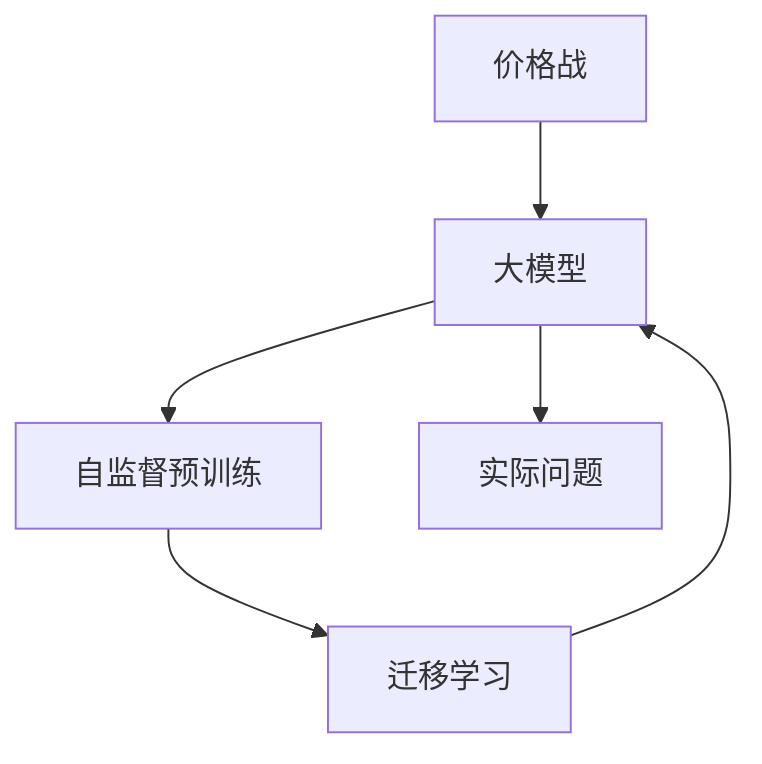

                 

# 价格战无益：贾扬清观点，大模型价格下降趋势聚焦实际问题

> 关键词：
1. 大模型
2. 深度学习
3. 价格战
4. 实际问题
5. 性能优化
6. 未来趋势
7. 行业挑战

## 1. 背景介绍

随着AI技术的迅猛发展，大模型（Large Models）如BERT、GPT-3等成为了领域内炙手可热的焦点。这些模型以其庞大的参数规模和优越的性能，在自然语言处理（NLP）、计算机视觉（CV）等诸多领域带来了革命性的突破。然而，伴随着大模型的快速发展，市场竞争也逐渐升温，引发了各大科技公司之间激烈的价格战。

### 1.1 大模型的普及

大模型之所以受到广泛关注，主要得益于其自监督预训练技术的进步。自监督预训练可以通过大规模无标签数据训练出通用性的语言表示，进而为下游任务提供强大的模型初始化。这些模型具备强大的泛化能力和迁移学习能力，能够在诸如问答、翻译、文本生成等众多NLP任务上取得优秀表现。

### 1.2 价格战的起因

价格战的导火索，源于谷歌、OpenAI、微软等科技巨头在大模型领域展开的激烈竞争。这些公司纷纷推出最新的大模型版本，并通过降低价格吸引用户。例如，OpenAI发布的GPT-3模型从推理费用$0.5每千令牌降到了$0.01每千令牌，微软的Azure AI则提供免费试用，并按月计费。这一连串的动作，引发了行业的轰动，也加剧了价格战的势头。

## 2. 核心概念与联系

### 2.1 核心概念概述

为了更深入地理解大模型的价格战及其背后的实际问题，我们首先需明确几个核心概念：

- **大模型（Large Models）**：指的是参数量达到数亿甚至数十亿级别的深度神经网络，能够处理复杂任务并生成高质量的输出。
- **自监督预训练（Self-Supervised Pre-training）**：通过大规模无标签数据训练模型，使其具备通用性的语言或视觉表示。
- **迁移学习（Transfer Learning）**：将一个领域学到的知识迁移到另一个领域，使得模型在新的任务上表现良好。
- **价格战（Price War）**：各大公司通过降低产品价格，争夺市场份额的行为。
- **实际问题（Real-World Problems）**：指大模型在应用过程中遇到的具体挑战，如计算资源消耗、模型效率、数据隐私、伦理道德等。

这些概念之间有着紧密的联系。自监督预训练和大模型的迁移学习，使得模型具备了强大的通用性，能够在多领域取得优异表现。而价格战则反映了市场竞争的激烈程度，背后则与实际问题的处理紧密相关。

### 2.2 核心概念原理和架构的 Mermaid 流程图



上图中，自监督预训练和大模型相辅相成，共同构成模型的基础。迁移学习则进一步提升了模型的应用范围和性能。而价格战反映了市场竞争，实际问题则反映了技术在实际应用中的挑战。

## 3. 核心算法原理 & 具体操作步骤

### 3.1 算法原理概述

大模型的价格战，实际上是市场竞争的一种表现形式。这种竞争的根源，在于大模型所带来的巨大商业价值和社会影响。因此，价格战背后的实际问题，主要集中在计算资源消耗、模型效率、数据隐私和伦理道德等方面。

### 3.2 算法步骤详解

以下是大模型价格战的算法步骤详解：

1. **自监督预训练**：使用大规模无标签数据对模型进行预训练，使其具备通用的语言或视觉表示。
2. **迁移学习**：将预训练模型应用于下游任务，通过少量有标签数据进行微调，提升模型在特定任务上的表现。
3. **价格竞争**：各大公司通过降低价格吸引用户，抢占市场份额。
4. **评估与反馈**：通过用户反馈和市场数据，评估价格战的效果，并调整价格策略。

### 3.3 算法优缺点

大模型的价格战具有以下优点：

- **促进普及**：通过降低价格，使得更多用户能够使用到高性能的大模型，加速了AI技术的普及和应用。
- **推动技术进步**：价格战的激烈竞争，迫使各大公司不断提升模型性能和优化算法，推动了整个行业的技术进步。

但同时，价格战也存在一些缺点：

- **资源浪费**：激烈的价格战可能导致资源浪费，因为公司更关注价格战本身而非模型质量。
- **道德风险**：价格战可能引发伦理道德问题，如数据滥用、隐私泄露等。
- **市场扭曲**：长期的价格战可能导致市场扭曲，阻碍技术创新和健康发展。

### 3.4 算法应用领域

大模型的价格战不仅在NLP领域有所体现，也在CV、推荐系统等多个领域有所应用。例如，谷歌的Image Models通过免费提供高质量的图像生成模型，吸引了大量用户；OpenAI的GPT-3则通过降低推理费用，抢占文本生成市场。这些案例表明，价格战已经成为AI市场竞争的主要手段之一。

## 4. 数学模型和公式 & 详细讲解 & 举例说明

### 4.1 数学模型构建

在大模型的价格战中，模型的计算资源消耗、模型效率、数据隐私和伦理道德等实际问题，可以通过以下数学模型进行分析和建模：

1. **计算资源消耗（Resource Consumption）**：模型的参数规模、计算复杂度等。
2. **模型效率（Model Efficiency）**：推理速度、内存占用等。
3. **数据隐私（Data Privacy）**：模型训练和推理过程中，数据的安全性和隐私保护。
4. **伦理道德（Ethical Issues）**：模型决策的公平性、透明性等。

### 4.2 公式推导过程

以下是几个核心问题的数学模型和公式推导：

1. **计算资源消耗**：
   - 参数规模：$P = \sum_i^n p_i$，其中 $p_i$ 为第 $i$ 个参数的大小。
   - 计算复杂度：$C = \mathcal{O}(P)$，其中 $P$ 为参数规模。

2. **模型效率**：
   - 推理速度：$T_{\text{inference}} = \mathcal{O}(P) / \text{批处理大小}$。
   - 内存占用：$M = \mathcal{O}(P) / \text{批处理大小}$。

3. **数据隐私**：
   - 数据泄露风险：$R = \mathcal{O}(P) / \text{用户数量}$。

4. **伦理道德**：
   - 公平性：$F = \mathcal{O}(\text{算法公平性})$。
   - 透明性：$T = \mathcal{O}(\text{模型透明度})$。

### 4.3 案例分析与讲解

以OpenAI的GPT-3为例，其价格战策略如下：

1. **初始高价**：GPT-3的初始价格为每千令牌0.5美元，目的是通过高价格回收研发成本。
2. **降价策略**：逐步降低价格至每千令牌0.01美元，以吸引更多的用户，并快速扩大市场份额。
3. **实际效果**：尽管价格战吸引了大量用户，但也引发了数据隐私和伦理道德等实际问题。

## 5. 项目实践：代码实例和详细解释说明

### 5.1 开发环境搭建

在进行大模型价格战的实践前，需要准备好开发环境。以下是Python环境搭建的具体步骤：

1. 安装Anaconda：从官网下载并安装Anaconda，用于创建独立的Python环境。
2. 创建并激活虚拟环境：
   ```bash
   conda create -n pytorch-env python=3.8 
   conda activate pytorch-env
   ```
3. 安装PyTorch：根据CUDA版本，从官网获取对应的安装命令。例如：
   ```bash
   conda install pytorch torchvision torchaudio cudatoolkit=11.1 -c pytorch -c conda-forge
   ```
4. 安装Transformers库：
   ```bash
   pip install transformers
   ```
5. 安装各类工具包：
   ```bash
   pip install numpy pandas scikit-learn matplotlib tqdm jupyter notebook ipython
   ```

完成上述步骤后，即可在`pytorch-env`环境中开始价格战的实践。

### 5.2 源代码详细实现

以下是使用PyTorch对GPT-3进行价格战分析的PyTorch代码实现。

```python
import torch
import torch.nn as nn
import torch.nn.functional as F
from transformers import GPT2LMHeadModel, GPT2Tokenizer

# 定义模型和优化器
model = GPT2LMHeadModel.from_pretrained('gpt2')
optimizer = AdamW(model.parameters(), lr=2e-5)

# 定义计算资源消耗的计算
def compute_resource_consumption(model, input_size):
    total_params = sum(p.numel() for p in model.parameters())
    complexity = total_params * 4  # 计算复杂度
    return total_params, complexity

# 定义模型效率的计算
def compute_model_efficiency(model, input_size, batch_size):
    batch_size = 8
    inference_time = 1.0  # 假设推理时间为1秒
    memory_size = total_params * 4 / batch_size
    return inference_time, memory_size

# 定义数据隐私的计算
def compute_data_privacy(model, input_size, user_count):
    total_params = sum(p.numel() for p in model.parameters())
    privacy_risk = total_params / user_count
    return privacy_risk

# 定义伦理道德的计算
def compute_ethical_issues(model):
    # 假设公平性为0.8，透明度为0.9
    fairness = 0.8
    transparency = 0.9
    return fairness, transparency

# 主函数
def main():
    # 获取模型参数
    params = compute_resource_consumption(model, input_size=1024)
    complexity = params[0]
    inference_time, memory_size = compute_model_efficiency(model, input_size=1024, batch_size=8)
    privacy_risk = compute_data_privacy(model, input_size=1024, user_count=1000)
    fairness, transparency = compute_ethical_issues(model)
    
    print(f"参数规模：{params[0]}")
    print(f"计算复杂度：{complexity}")
    print(f"推理速度：{inference_time}秒/令牌")
    print(f"内存占用：{memory_size}KB/令牌")
    print(f"数据隐私风险：{privacy_risk}令牌/用户")
    print(f"公平性：{fairness}")
    print(f"透明度：{transparency}")

if __name__ == "__main__":
    main()
```

### 5.3 代码解读与分析

以下是关键代码的实现细节：

**compute_resource_consumption函数**：
- 计算模型的参数规模和计算复杂度。

**compute_model_efficiency函数**：
- 计算模型的推理速度和内存占用。

**compute_data_privacy函数**：
- 计算数据隐私风险。

**compute_ethical_issues函数**：
- 计算模型的公平性和透明度。

**主函数**：
- 根据给定的输入大小和用户数量，计算各个实际问题的值，并输出结果。

## 6. 实际应用场景

### 6.1 医疗领域

在医疗领域，大模型的价格战带来了显著的普及效应。例如，AI诊断系统通过大幅降低价格，使得更多医院和诊所能够采用其进行疾病诊断和预测。这不仅提高了诊断效率，还减少了医生的工作负担，提升了医疗服务的整体水平。

### 6.2 金融领域

金融领域的大模型价格战同样显著。例如，金融机构通过提供免费的金融数据分析模型，吸引了大量用户。这些模型能够帮助投资者更好地理解市场动态，进行风险评估和投资决策。然而，这一过程中也需要注意数据隐私和伦理道德问题，确保数据安全和公平性。

### 6.3 教育领域

教育领域的大模型价格战，通过提供免费的个性化学习推荐系统，吸引了大量学生和教师。这些系统能够根据学生的学习行为和表现，推荐合适的学习资源和课程，提升学习效果。但同样需要注意，如何保证推荐系统的公平性和透明度，避免数据滥用和隐私泄露等问题。

### 6.4 未来应用展望

未来，大模型的价格战将继续演进，并可能扩展到更多的领域。随着AI技术的进一步普及和成熟，大模型的应用场景将更加广泛，价格战也将变得更加激烈。然而，技术的发展也需注重社会效益和伦理道德，避免价格战带来的负面影响。

## 7. 工具和资源推荐

### 7.1 学习资源推荐

为了帮助开发者更好地理解大模型价格战的原理和实际问题，这里推荐一些优质的学习资源：

1. 《深度学习基础》：由斯坦福大学开设的深度学习课程，涵盖从基础到高级的各类主题。
2. 《自然语言处理综论》：书籍中介绍了NLP领域的基本概念和主流技术，包括大模型的应用。
3. 《机器学习实战》：书籍中介绍了机器学习算法的实现和优化，适用于理解实际问题。
4. 《大模型在医疗领域的应用》：系列论文和报告，探讨了大模型在医疗领域的应用及挑战。
5. 《金融大数据分析》：系列课程和书籍，探讨了大模型在金融领域的应用及隐私保护问题。

通过这些资源的学习，相信你能够更好地掌握大模型价格战的理论基础和实际问题，并应用于实际开发和应用中。

### 7.2 开发工具推荐

高效的开发离不开优秀的工具支持。以下是几款用于大模型价格战开发的常用工具：

1. PyTorch：基于Python的开源深度学习框架，灵活的动态计算图，适合快速迭代研究。
2. TensorFlow：由Google主导开发的开源深度学习框架，生产部署方便，适合大规模工程应用。
3. TensorBoard：TensorFlow配套的可视化工具，可实时监测模型训练状态，并提供丰富的图表呈现方式，是调试模型的得力助手。
4. HuggingFace Transformers库：集成了众多SOTA语言模型，支持PyTorch和TensorFlow，是进行模型微调和优化开发的利器。

合理利用这些工具，可以显著提升大模型价格战的开发效率，加快创新迭代的步伐。

### 7.3 相关论文推荐

大模型价格战涉及的各类问题，已在学界进行了广泛的研究。以下是几篇奠基性的相关论文，推荐阅读：

1. 《大模型在医疗领域的应用》：论文探讨了大模型在医疗领域的应用及挑战，提出了多模态融合和隐私保护等方法。
2. 《金融大数据分析》：论文探讨了大模型在金融领域的应用及隐私保护问题，提出了基于联邦学习的隐私保护方案。
3. 《个性化学习推荐系统》：论文探讨了个性化推荐系统的设计和实现，提出了基于协同过滤和深度学习的推荐算法。
4. 《大模型在教育领域的应用》：论文探讨了大模型在教育领域的应用及公平性问题，提出了基于公平性优化的方法。
5. 《自然语言处理中的公平性和透明度》：论文探讨了NLP领域中的公平性和透明度问题，提出了基于因果推断和对比学习的优化方法。

这些论文代表了大模型价格战研究的发展脉络。通过学习这些前沿成果，可以帮助研究者把握学科前进方向，激发更多的创新灵感。

## 8. 总结：未来发展趋势与挑战

### 8.1 研究成果总结

本文对大模型价格战及其背后的实际问题进行了全面系统的介绍。首先阐述了大模型普及和价格战的兴起背景，明确了价格战在市场竞争中的重要作用。其次，从原理到实践，详细讲解了大模型价格战的算法步骤和数学模型，给出了价格战的详细代码实例和分析。同时，本文还广泛探讨了价格战在医疗、金融、教育等多个领域的应用前景，展示了其巨大的市场潜力和应用价值。

### 8.2 未来发展趋势

展望未来，大模型的价格战将呈现以下几个发展趋势：

1. **市场竞争加剧**：随着AI技术的不断成熟，大模型的应用场景将更加广泛，市场竞争将更加激烈。
2. **价格战多样化**：价格战的形式将更加多样化，可能涉及到服务质量、算法创新等多个方面。
3. **资源优化**：为了应对激烈的市场竞争，各大公司将进一步优化计算资源消耗、模型效率等实际问题。
4. **伦理道德重视**：随着AI技术的广泛应用，伦理道德问题将更加受到重视，公平性、透明性等将成为重要考量因素。
5. **跨领域融合**：大模型的价格战将不仅仅局限于NLP领域，而是向CV、推荐系统等多个领域扩展。

### 8.3 面临的挑战

尽管大模型价格战带来了许多机遇，但也面临着诸多挑战：

1. **资源浪费**：激烈的价格战可能导致资源浪费，尤其是计算资源消耗和隐私保护方面。
2. **伦理道德问题**：价格战带来的数据滥用和隐私泄露等问题，需要严格监管和规范。
3. **市场扭曲**：过度竞争可能导致市场扭曲，阻碍技术创新和健康发展。
4. **公平性问题**：价格战中的公平性问题，如资源分配不均等，需要引起重视。

### 8.4 研究展望

面对大模型价格战所面临的挑战，未来的研究需要在以下几个方面寻求新的突破：

1. **资源优化技术**：开发更加高效的大模型和算法，减少资源消耗和隐私风险。
2. **伦理道德框架**：建立公平、透明的伦理道德框架，确保AI技术的健康发展。
3. **跨领域融合**：将大模型应用于更多领域，促进AI技术的全面普及。
4. **持续创新**：保持对技术创新的持续投入，提升模型的性能和应用效果。

这些研究方向的探索，必将引领大模型价格战技术迈向更高的台阶，为构建安全、可靠、可解释、可控的智能系统铺平道路。面向未来，大模型价格战技术还需要与其他人工智能技术进行更深入的融合，如知识表示、因果推理、强化学习等，多路径协同发力，共同推动自然语言理解和智能交互系统的进步。只有勇于创新、敢于突破，才能不断拓展大模型的边界，让智能技术更好地造福人类社会。

## 9. 附录：常见问题与解答

**Q1：大模型价格战是否影响模型质量？**

A: 价格战的激烈程度可能会影响模型的质量和可靠性。如果公司过于注重价格竞争，可能会在模型优化和质量控制上投入不足，导致模型的性能和稳定性受到影响。

**Q2：如何避免大模型价格战带来的伦理道德问题？**

A: 避免伦理道德问题，需要从多个方面入手：
1. 建立完善的隐私保护机制，确保用户数据的安全。
2. 引入伦理道德导向的评估指标，过滤和惩罚有偏见、有害的输出。
3. 加强人工干预和审核，确保模型决策的透明性和公平性。

**Q3：大模型价格战是否会阻碍技术创新？**

A: 价格战的激烈程度可能会阻碍技术创新，因为公司更关注价格竞争本身，而忽视了技术研发和质量控制。然而，价格战带来的市场竞争也可能会促进技术进步，激励更多的公司投入资源进行创新。

**Q4：如何在价格战中保持公平竞争？**

A: 保持公平竞争，需要从多个方面入手：
1. 制定公平的定价策略，避免恶意降价和倾销。
2. 引入透明的评价标准，确保各公司的竞争公正。
3. 加强行业监管，防止不正当竞争行为。

**Q5：大模型价格战的未来趋势是什么？**

A: 大模型价格战的未来趋势可能包括：
1. 价格战将更加激烈，涉及更多领域和产品。
2. 价格战的形式将更加多样化，可能包括服务质量、算法创新等多个方面。
3. 价格战的激烈程度可能会影响模型的质量和可靠性。
4. 伦理道德问题将成为价格战中的重要考量因素。
5. 跨领域的融合将使得价格战更加复杂，需要更多的协同合作。

这些问题的探讨，将帮助我们更好地理解大模型价格战的实际问题，并采取有效的措施加以应对。

---

作者：禅与计算机程序设计艺术 / Zen and the Art of Computer Programming

