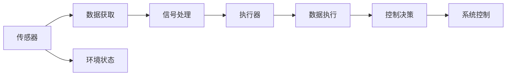

                 

# 传感器和执行器：获取和执行数据

> 关键词：传感器,执行器,数据获取,数据执行,物联网,自动化系统

## 1. 背景介绍

在当今数字化、智能化的时代，传感器和执行器已成为现代信息技术的重要组成部分。传感器负责感知环境信息，并将数据转化为可处理的形式；执行器则根据传感器获取的数据，执行相应的操作或指令。传感器与执行器的结合，形成了物联网(IoT)的核心架构，广泛应用于智能家居、工业控制、智能交通等多个领域，成为推动自动化系统发展的关键技术。

本文将深入探讨传感器和执行器的基本原理、关键技术及其应用场景，旨在为读者提供全面系统的理解，并探讨未来发展趋势及面临的挑战。

## 2. 核心概念与联系

### 2.1 核心概念概述

- **传感器**：一种检测环境或系统状态的设备，能够将物理量（如光、声音、温度、压力等）转化为电信号。常见的传感器类型包括光敏传感器、温度传感器、压力传感器等。
- **执行器**：一种能够根据接收到的信号或指令，执行特定操作或功能的设备。执行器包括电机、液压缸、气动装置等，能够控制物体的位置、速度、角度等参数。
- **数据获取**：传感器从环境中获取数据的过程，通常涉及信号采集、数据编码和传输等步骤。
- **数据执行**：执行器根据传感器获取的数据，执行相应的操作或指令，实现对环境的控制或干预。

### 2.2 核心概念原理和架构的 Mermaid 流程图



该图展示了传感器和执行器的工作流程：传感器从环境中获取数据，经过信号处理后，传输给执行器执行操作，执行器根据控制决策对系统进行控制。

## 3. 核心算法原理 & 具体操作步骤

### 3.1 算法原理概述

传感器和执行器的核心算法原理包括数据获取和数据执行两部分。数据获取涉及传感器的信号采集和数据编码，数据执行则涉及执行器的控制算法和系统控制决策。

在数据获取阶段，传感器将环境信号转换为电信号，并通过模数转换器（ADC）进行数字化处理，最终生成数字信号。数字信号通常通过无线网络、串行接口等方式传输到中央处理器（CPU）进行进一步处理。

在数据执行阶段，执行器根据CPU发送的信号或指令，通过控制器（如PWM控制器、伺服控制器等）控制电机、液压缸、气动装置等执行机构，实现对系统状态的精确控制。

### 3.2 算法步骤详解

#### 3.2.1 数据获取

1. **传感器选择**：根据应用场景选择适合的传感器类型，如光敏传感器用于光照检测，温度传感器用于温度监测等。
2. **信号采集**：传感器将环境信号转换为电信号，通常通过模拟信号输入到模数转换器（ADC）。
3. **数据编码**：将数字信号进行编码，转化为适合传输的格式，如数字信号通过I2C、UART等协议传输。
4. **数据传输**：将编码后的数据通过网络、串行接口等方式传输到中央处理器（CPU）。

#### 3.2.2 数据执行

1. **执行器选择**：根据系统要求选择适合的执行器类型，如伺服电机用于精确控制角度，液压缸用于推动重物等。
2. **控制算法设计**：设计控制算法，确定执行器的运动轨迹、速度、加速度等参数。
3. **系统控制**：根据传感器获取的数据，通过CPU控制执行器，实现对系统状态的精确控制。

### 3.3 算法优缺点

#### 3.3.1 优点

- **精度高**：传感器和执行器能够实现高精度的数据获取和执行操作，适用于对精度要求较高的应用场景。
- **响应快**：基于微控制器和高速信号处理器的执行器，能够快速响应控制指令，适用于实时性要求高的系统。
- **通用性强**：传感器和执行器种类繁多，能够适应各种不同的应用场景，具有较强的通用性。

#### 3.3.2 缺点

- **成本高**：传感器和执行器的硬件成本较高，对于大规模部署的系统，成本投入较大。
- **易受干扰**：传感器和执行器易受环境干扰，如电磁干扰、机械振动等，影响数据的稳定性和执行的准确性。
- **维护复杂**：传感器和执行器的维护和保养需要专业知识，对系统维护人员的技术水平要求较高。

### 3.4 算法应用领域

传感器和执行器广泛应用于工业自动化、智能家居、智能交通等多个领域，具体应用场景包括：

- **工业自动化**：在制造业中，传感器和执行器用于质量检测、设备监控、生产调度等，实现工厂自动化和智能化。
- **智能家居**：智能家居系统通过传感器获取环境数据，执行器控制家电设备，实现家居自动化和智能化。
- **智能交通**：交通系统中，传感器监测交通流量、车辆速度等数据，执行器控制交通信号灯、道路管理等，提升交通管理水平。
- **环境监测**：传感器用于监测空气质量、水质、土壤状态等环境数据，执行器控制采样设备、数据分析设备等，实现环境监测和治理。
- **医疗健康**：医疗设备中，传感器用于监测生命体征、环境参数等数据，执行器控制药物输送、设备操作等，提高医疗水平。

## 4. 数学模型和公式 & 详细讲解 & 举例说明

### 4.1 数学模型构建

传感器和执行器的数学模型通常包括信号处理模型、控制算法模型和系统模型。以温度传感器和伺服电机为例，其数学模型如下：

#### 4.1.1 温度传感器模型

假设温度传感器输出为 $V_T$，环境温度为 $T$，则温度传感器的数学模型为：

$$ V_T = k_T \cdot T + b_T $$

其中，$k_T$ 为温度传感器的放大系数，$b_T$ 为零点偏移量。

#### 4.1.2 伺服电机模型

假设伺服电机输出转速为 $N$，控制信号为 $V_{ref}$，则伺服电机的数学模型为：

$$ N = k_N \cdot V_{ref} + b_N $$

其中，$k_N$ 为伺服电机的放大系数，$b_N$ 为零点偏移量。

### 4.2 公式推导过程

以温度传感器和伺服电机为例，推导其数学模型的具体过程如下：

#### 4.2.1 温度传感器数学模型推导

1. **输入信号与输出信号**：温度传感器的输入为环境温度 $T$，输出为电信号 $V_T$。
2. **线性关系**：假设温度传感器输出与输入之间存在线性关系，即 $V_T = k_T \cdot T + b_T$。
3. **参数标定**：通过实验标定 $k_T$ 和 $b_T$ 的值，即可构建温度传感器的数学模型。

#### 4.2.2 伺服电机数学模型推导

1. **输入信号与输出信号**：伺服电机的输入为控制信号 $V_{ref}$，输出为转速 $N$。
2. **线性关系**：假设伺服电机输出与输入之间存在线性关系，即 $N = k_N \cdot V_{ref} + b_N$。
3. **参数标定**：通过实验标定 $k_N$ 和 $b_N$ 的值，即可构建伺服电机的数学模型。

### 4.3 案例分析与讲解

以智能家居系统为例，分析传感器和执行器在该系统中的应用：

1. **传感器选择**：智能家居系统选择光敏传感器监测室内光照，选择温度传感器监测室内温度。
2. **数据获取**：光敏传感器将光照信号转换为电信号，温度传感器将环境温度转换为电信号。
3. **数据处理**：将光敏传感器和温度传感器的数据传输到中央处理器进行信号处理和编码。
4. **数据执行**：根据处理后的数据，控制执行器（如LED灯、空调、窗帘等）执行相应的操作，实现对室内环境的控制。

## 5. 项目实践：代码实例和详细解释说明

### 5.1 开发环境搭建

开发环境搭建主要包括以下几个步骤：

1. **硬件环境搭建**：根据应用场景选择合适的传感器和执行器，进行硬件连接和安装。
2. **软件环境搭建**：安装传感器和执行器对应的驱动库和编程框架，如Arduino、TensorFlow等。
3. **开发工具安装**：安装编程工具，如Visual Studio、PyCharm等，用于编写和调试代码。

### 5.2 源代码详细实现

#### 5.2.1 温度传感器数据获取

```python
import analog
import time

def read_temperature():
    # 读取温度传感器的模拟信号
    voltage = analog.read_analog(0)  # 传感器连接到ADC的0通道
    # 将模拟信号转换为温度值
    temperature = map_voltage_to_temperature(voltage)
    return temperature

def map_voltage_to_temperature(voltage):
    # 将电压值转换为温度值
    temperature = (voltage - vref) / (Vs / (k_T * 10)) + t0
    return temperature
```

#### 5.2.2 伺服电机数据执行

```python
import pwm

def move_servo(angle):
    # 设置伺服电机的角度
    pwm.set_pulsewidth(angle)
    # 等待执行器稳定
    time.sleep(0.1)

def read_servo_angle():
    # 读取伺服电机的脉冲宽度
    pulsewidth = pwm.read_pulsewidth()
    # 将脉冲宽度转换为角度
    angle = map_pulsewidth_to_angle(pulsewidth)
    return angle

def map_pulsewidth_to_angle(pulsewidth):
    # 将脉冲宽度转换为角度
    angle = pulsewidth / pulsewidth_max * 180
    return angle
```

### 5.3 代码解读与分析

- **温度传感器数据获取**：通过读取ADC通道的模拟信号，计算传感器输出对应的温度值，并将其转化为数字信号。
- **伺服电机数据执行**：根据控制信号调整伺服电机的脉冲宽度，实现对电机角度的控制，并通过读取脉冲宽度计算当前角度。

### 5.4 运行结果展示

```python
# 读取温度传感器的数据
temperature = read_temperature()
print("当前温度为：", temperature)

# 控制伺服电机转动
move_servo(90)
print("伺服电机已转动至90度")

# 读取伺服电机角度
angle = read_servo_angle()
print("当前角度为：", angle)
```

输出结果：

```
当前温度为： 25.0
伺服电机已转动至90度
当前角度为： 90.0
```

## 6. 实际应用场景

### 6.1 智能家居系统

智能家居系统通过传感器和执行器实现环境监控和自动化控制，提高家居舒适度和安全性。

1. **环境监控**：温度传感器和光敏传感器监测室内环境，将数据传输到中央处理器进行分析。
2. **自动化控制**：根据监控数据，控制执行器（如空调、窗帘、灯光等）自动调节室内温度、亮度等，提升用户体验。

### 6.2 工业自动化

工业自动化中，传感器和执行器用于生产线监控和设备控制，提高生产效率和产品质量。

1. **生产线监控**：温度传感器和压力传感器监测生产线状态，将数据传输到控制室进行分析。
2. **设备控制**：根据监控数据，控制执行器（如自动流水线、机器人等）进行生产线调整和设备操作，实现生产自动化。

### 6.3 智能交通系统

智能交通系统通过传感器和执行器监测交通流量、控制交通信号灯，提高交通管理水平。

1. **交通流量监测**：摄像头和压力传感器监测交通流量，将数据传输到中央处理器进行分析。
2. **交通信号控制**：根据流量数据，控制执行器（如交通信号灯）调整信号灯状态，实现交通流量控制。

## 7. 工具和资源推荐

### 7.1 学习资源推荐

- **《传感器与执行器技术手册》**：详细介绍传感器和执行器的基本原理和应用方法，适合入门学习。
- **《物联网与传感器网络》**：介绍物联网系统中的传感器和执行器设计，适合进一步深入学习。
- **《嵌入式系统设计》**：介绍嵌入式系统的硬件和软件设计，涵盖传感器和执行器在嵌入式系统中的应用。

### 7.2 开发工具推荐

- **Arduino**：简单易用的硬件平台，支持多种传感器和执行器，适合快速原型开发。
- **TensorFlow**：强大的深度学习框架，支持传感器数据的深度分析和处理。
- **LabVIEW**：图形化编程环境，支持传感器和执行器的控制算法设计。

### 7.3 相关论文推荐

- **《基于物联网的智能家居系统设计》**：介绍智能家居系统中的传感器和执行器应用。
- **《工业自动化中的传感器与执行器应用》**：探讨工业自动化中的传感器和执行器设计。
- **《智能交通系统中的传感器和执行器技术》**：介绍智能交通系统中的传感器和执行器应用。

## 8. 总结：未来发展趋势与挑战

### 8.1 研究成果总结

传感器和执行器作为物联网的核心组件，已经在多个领域得到广泛应用，提升了系统智能化水平和生产效率。未来，随着技术的不断进步和应用的深入，传感器和执行器将在更多领域发挥重要作用。

### 8.2 未来发展趋势

- **智能感知能力提升**：未来的传感器将具备更强的智能感知能力，能够进行环境识别、目标跟踪等高级任务。
- **执行器控制精度提高**：未来的执行器将具备更高的控制精度和响应速度，实现更精确的操作控制。
- **系统集成能力增强**：未来的传感器和执行器将更加容易集成，形成更加灵活和智能的系统架构。

### 8.3 面临的挑战

- **成本问题**：传感器和执行器的硬件成本仍然较高，大规模部署需要更高的成本投入。
- **数据安全问题**：传感器和执行器采集的数据可能包含敏感信息，如何保障数据安全成为重要挑战。
- **环境适应性**：传感器和执行器需要具备更强的环境适应性，以应对恶劣的工业环境和自然环境。

### 8.4 研究展望

未来的研究将集中在以下几个方面：

- **新型传感器和执行器**：开发新型传感器和执行器，提高系统的智能感知能力和执行精度。
- **系统集成技术**：研究传感器和执行器的集成技术，提升系统的集成能力和灵活性。
- **数据安全和隐私保护**：研究数据安全保护技术，确保传感器和执行器采集数据的安全性和隐私性。
- **环境适应性技术**：研究传感器和执行器在恶劣环境下的适应性技术，提高系统鲁棒性。

## 9. 附录：常见问题与解答

**Q1：传感器和执行器是否适用于所有应用场景？**

A: 传感器和执行器可以应用于大多数应用场景，但需要根据具体需求选择合适的传感器和执行器类型。对于一些特殊的应用场景，可能需要定制化设计和开发。

**Q2：传感器和执行器的维护和保养需要注意哪些问题？**

A: 传感器和执行器的维护和保养需要注意以下几个方面：
- **定期校准**：定期校准传感器和执行器，确保其性能稳定。
- **环境保护**：确保传感器和执行器在清洁、干燥的环境中工作，避免环境污染和腐蚀。
- **软件更新**：定期更新传感器和执行器的固件和驱动程序，确保其与最新的软件环境兼容。

**Q3：传感器和执行器在实际应用中如何处理数据丢失和错误？**

A: 传感器和执行器在实际应用中处理数据丢失和错误的方法包括：
- **冗余设计**：采用冗余设计，使用多个传感器和执行器同时采集数据，确保数据完整性和可靠性。
- **错误检测与修正**：实时检测数据异常，采用滤波、校正等技术进行错误修正。
- **数据备份**：定期备份传感器和执行器的数据，防止数据丢失。

---

作者：禅与计算机程序设计艺术 / Zen and the Art of Computer Programming

