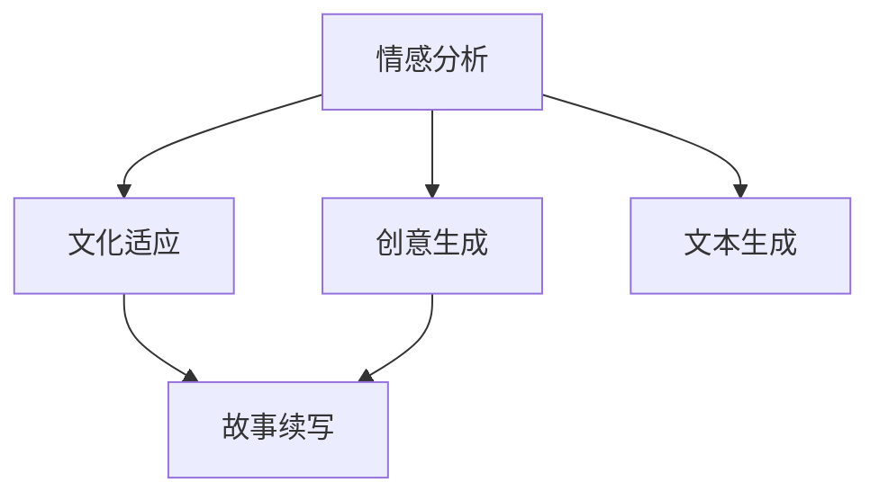

                 

## 1. 背景介绍

在人类文明的历史长河中，故事承载着文化、情感、智慧和经验的传递。它们是沟通心灵、连结过去与未来的桥梁。然而，随着时间的流逝，故事叙述的方式也在不断地演变，从口口相传到文字记载，再到现代数字化媒介的兴起，故事在形式和内容上发生了翻天覆地的变化。在这个数字时代，如何利用AI技术赋予故事以新的生命力，让它们以更加丰富和多样的形式触达人心，成为摆在体验叙事工作室面前的一大挑战。

### 1.1 问题由来

随着人工智能技术的飞速发展，AI在文本生成、自然语言理解、语音合成等方面取得了显著的进展。AI故事创作坊便是这一浪潮下的产物，它试图通过AI技术，结合人类的创造力和情感，创造出独具魅力的故事作品。然而，AI创作故事仍然面临诸多挑战，尤其是如何有效地理解和生成具有深刻情感和文化内涵的故事，使其不仅具有娱乐性，还能传递出真实的情感和价值。

### 1.2 问题核心关键点

要实现这一目标，AI故事创作坊需要在以下几个关键点上进行创新：

1. **情感理解**：AI需能够识别文本中的情感色彩，并根据情感变化调整故事叙述的节奏和风格。
2. **文化适应**：AI需理解并适应不同文化背景下的故事表达方式，生成符合地域特色和文化价值观的故事。
3. **创意激发**：AI需能够结合人类的创造性思维，激发新的故事情节和角色设定。
4. **互动体验**：AI需能与用户互动，根据用户的反馈实时调整故事走向。

### 1.3 问题研究意义

AI故事创作坊的意义不仅仅在于提供娱乐内容，更在于通过技术手段重现人类的情感共鸣和文化传承。它能够使故事创作过程更加高效，减少创意者的劳动强度，同时为故事传播提供更为广泛的平台。此外，AI故事创作坊的实现还将推动文化交流和多元文化之间的理解和尊重，为跨文化沟通搭建桥梁。

## 2. 核心概念与联系

### 2.1 核心概念概述

为了更好地理解AI故事创作坊的实现过程，我们需要首先梳理相关的核心概念：

1. **情感分析**：指识别和理解文本中的情感色彩，包括情感极性（正面、负面、中性）和情感强度。
2. **文化适应**：指AI模型能够理解和生成符合特定文化背景和价值观的故事内容。
3. **创意生成**：指利用AI模型结合人类的创造性思维，生成新的故事情节和角色设定。
4. **故事续写**：指AI根据用户输入的故事内容，续写后续内容，实现与用户的互动。
5. **文本生成**：指AI模型自动生成文本，用于故事创作、对话生成等。

这些核心概念之间的逻辑关系可以通过以下Mermaid流程图来展示：



这个流程图展示了AI故事创作坊的主要流程：

1. 通过情感分析识别文本中的情感色彩。
2. 根据情感色彩和文化背景，生成符合特定文化的故事内容。
3. 结合创意生成，激发新的故事情节和角色设定。
4. 通过故事续写与用户互动，生成个性化故事。
5. 利用文本生成技术，自动生成故事内容。

## 3. 核心算法原理 & 具体操作步骤
### 3.1 算法原理概述

AI故事创作坊的核心算法原理可以归纳为情感分析、文化适应、创意生成和故事续写。这些算法共同作用，使得AI能够根据用户的输入，自动生成具有深刻情感和文化内涵的故事。

1. **情感分析**：利用自然语言处理(NLP)技术，通过文本中出现的词语、短语和句子结构，判断情感极性和强度。
2. **文化适应**：利用多模态学习，结合文化特征向量，生成符合特定文化背景的故事。
3. **创意生成**：通过生成对抗网络(GAN)等技术，结合人类的创造性思维，生成新颖的故事情节和角色设定。
4. **故事续写**：利用递归神经网络(RNN)等序列生成模型，根据用户输入的故事内容，自动生成后续内容。

### 3.2 算法步骤详解

以下是AI故事创作坊的详细操作步骤：

**Step 1: 数据预处理**
- 收集和整理大量的故事数据，进行文本清洗和标准化。
- 标记数据中的情感和故事主题，以便后续模型训练使用。

**Step 2: 构建模型**
- 选择适合的故事创作模型，如序列到序列模型、生成对抗网络等。
- 设计情感分析模块，用于识别文本中的情感色彩。
- 设计文化适应模块，结合文化特征向量，生成符合特定文化的故事内容。
- 设计创意生成模块，利用GAN等技术生成新颖的故事情节和角色设定。
- 设计故事续写模块，利用RNN等序列生成模型生成后续内容。

**Step 3: 模型训练**
- 将预处理后的数据划分为训练集、验证集和测试集。
- 使用情感分析模块对数据进行训练，优化情感识别模型。
- 使用文化适应模块对数据进行训练，优化文化适应模型。
- 使用创意生成模块对数据进行训练，优化创意生成模型。
- 使用故事续写模块对数据进行训练，优化故事续写模型。

**Step 4: 模型评估与优化**
- 在验证集上对各模型进行评估，根据评估结果调整模型参数。
- 使用测试集对模型进行最终测试，评估模型的整体性能。
- 根据用户反馈和评估结果，对模型进行持续优化和改进。

**Step 5: 用户互动**
- 将训练好的模型部署到应用平台，供用户交互使用。
- 根据用户输入的故事内容，自动生成后续故事内容。
- 收集用户反馈，不断改进模型，提升故事创作质量。

### 3.3 算法优缺点

AI故事创作坊的优点包括：

1. **高效性**：能够快速生成大量故事内容，减少创意者的劳动强度。
2. **多样性**：可以生成各种风格和题材的故事，满足不同用户的需求。
3. **互动性**：能够与用户互动，根据用户反馈实时调整故事内容，提高用户体验。

然而，AI故事创作坊也存在一些缺点：

1. **情感和文化的复杂性**：情感和文化的理解仍需依赖大量高质量的标注数据，且难以捕捉人类情感的细微变化。
2. **创意的局限性**：目前AI在创意生成方面仍依赖于预训练的语料库，难以完全脱离人类创造性思维的束缚。
3. **用户交互的局限性**：目前的交互方式相对简单，未能充分利用用户的反馈进行深入互动。

### 3.4 算法应用领域

AI故事创作坊的应用领域包括但不限于：

1. **娱乐内容生产**：用于自动生成小说、电影剧本、游戏对话等娱乐内容，丰富用户的娱乐体验。
2. **教育培训**：结合故事内容进行文化教育，帮助学生理解和感受不同文化背景下的情感和价值观。
3. **文化交流**：促进不同文化背景之间的理解和尊重，通过故事传递情感共鸣和文化价值。
4. **心理健康**：利用故事内容帮助用户缓解压力，提供情感支持和心理疏导。

## 4. 数学模型和公式 & 详细讲解 & 举例说明

### 4.1 数学模型构建

AI故事创作坊的数学模型主要涉及自然语言处理、生成对抗网络和递归神经网络。以下是各模型的数学模型构建：

**情感分析模型**：
- 输入：文本序列 $x = \{x_1, x_2, ..., x_n\}$。
- 输出：情感极性 $y \in \{0, 1\}$，其中0表示负面情感，1表示正面情感。
- 模型：基于卷积神经网络（CNN）或循环神经网络（RNN）的情感分类模型。

**文化适应模型**：
- 输入：文本序列 $x = \{x_1, x_2, ..., x_n\}$ 和文化特征向量 $c = \{c_1, c_2, ..., c_m\}$。
- 输出：符合特定文化的故事内容 $y$。
- 模型：基于多模态学习框架，结合文化和语言特征的生成模型。

**创意生成模型**：
- 输入：文化适应后的故事内容 $x = \{x_1, x_2, ..., x_n\}$。
- 输出：新的故事情节和角色设定 $y$。
- 模型：基于生成对抗网络（GAN）的创意生成模型。

**故事续写模型**：
- 输入：用户输入的故事内容 $x = \{x_1, x_2, ..., x_n\}$。
- 输出：后续故事内容 $y$。
- 模型：基于递归神经网络（RNN）的故事续写模型。

### 4.2 公式推导过程

以下是各模型的公式推导过程：

**情感分析模型**：
情感分类模型使用卷积神经网络（CNN）进行情感极性判断。假设输入文本的词向量为 $\{w_1, w_2, ..., w_n\}$，输出情感极性 $y \in \{0, 1\}$。则模型为：

$$
y = \sigma(\sum_{i=1}^n w_i^T \cdot x_i)
$$

其中，$\sigma$ 为 sigmoid 激活函数。

**文化适应模型**：
文化适应模型结合文化和语言特征，生成符合特定文化的故事内容。假设输入文本的词向量为 $\{x_1, x_2, ..., x_n\}$，文化特征向量为 $\{c_1, c_2, ..., c_m\}$。则模型为：

$$
y = \phi(\sum_{i=1}^n w_i^T \cdot x_i + \sum_{j=1}^m w_j^T \cdot c_j)
$$

其中，$\phi$ 为线性变换函数。

**创意生成模型**：
创意生成模型使用生成对抗网络（GAN）进行创意生成。假设输入故事内容为 $\{x_1, x_2, ..., x_n\}$，输出为新的故事情节和角色设定 $y$。则模型为：

$$
y = \psi(z)
$$

其中，$z$ 为输入噪声，$\psi$ 为生成函数。

**故事续写模型**：
故事续写模型使用递归神经网络（RNN）进行后续内容生成。假设输入故事内容为 $\{x_1, x_2, ..., x_n\}$，输出为后续故事内容 $y$。则模型为：

$$
y = \chi(x)
$$

其中，$\chi$ 为 RNN 生成函数。

### 4.3 案例分析与讲解

以下是各模型的案例分析与讲解：

**情感分析案例**：
假设输入文本为 "I am very sad today."，情感分析模型通过卷积神经网络提取文本特征，使用 sigmoid 函数判断情感极性，输出结果为 0，表示负面情感。

**文化适应案例**：
假设输入文本为 "I am very happy because I got a new job."，文化适应模型结合特定文化的特征向量，生成符合该文化背景的故事内容，如 "我非常开心，因为我得到了一份新工作。"

**创意生成案例**：
假设输入故事内容为 "王子和公主在一起生活。"，创意生成模型使用 GAN 生成新的故事情节和角色设定，如 "王子和公主在一起生活，王子发现了一块魔法石，拥有超能力。"

**故事续写案例**：
假设用户输入的故事内容为 "我喜欢去海边，感觉那里很放松。"，故事续写模型使用 RNN 生成后续内容，如 "我去过很多海滩，最难忘的是在马尔代夫，那里的沙滩和海浪让人心旷神怡。"

## 5. 项目实践：代码实例和详细解释说明

### 5.1 开发环境搭建

在进行故事创作坊的开发实践前，我们需要准备好开发环境。以下是使用Python进行PyTorch开发的环境配置流程：

1. 安装Anaconda：从官网下载并安装Anaconda，用于创建独立的Python环境。

2. 创建并激活虚拟环境：
```bash
conda create -n pytorch-env python=3.8 
conda activate pytorch-env
```

3. 安装PyTorch：根据CUDA版本，从官网获取对应的安装命令。例如：
```bash
conda install pytorch torchvision torchaudio cudatoolkit=11.1 -c pytorch -c conda-forge
```

4. 安装Transformers库：
```bash
pip install transformers
```

5. 安装各类工具包：
```bash
pip install numpy pandas scikit-learn matplotlib tqdm jupyter notebook ipython
```

完成上述步骤后，即可在`pytorch-env`环境中开始故事创作坊的开发实践。

### 5.2 源代码详细实现

下面我们以创意生成模型为例，给出使用Transformers库对创意生成模型进行PyTorch代码实现。

首先，定义创意生成模型的输入和输出：

```python
from transformers import GPT2Tokenizer, GPT2Model
import torch

class CreativityGenerationModel:
    def __init__(self, tokenizer, model):
        self.tokenizer = tokenizer
        self.model = model
    
    def generate_creativity(self, input_text, max_length=128):
        tokens = self.tokenizer(input_text, return_tensors='pt', max_length=max_length, padding='max_length', truncation=True)
        input_ids = tokens['input_ids']
        attention_mask = tokens['attention_mask']
        output = self.model.generate(input_ids, attention_mask=attention_mask, max_length=50, num_return_sequences=5, top_p=0.9, temperature=1.0)
        creativity = self.tokenizer.decode(output, skip_special_tokens=True)
        return creativity
```

然后，加载预训练的GPT-2模型和分词器：

```python
tokenizer = GPT2Tokenizer.from_pretrained('gpt2')
model = GPT2Model.from_pretrained('gpt2')
```

接着，定义创意生成模型的训练和评估函数：

```python
from transformers import AdamW

def train_creativity_model(model, train_dataset, learning_rate=2e-5, epochs=5, batch_size=16):
    dataloader = DataLoader(train_dataset, batch_size=batch_size, shuffle=True)
    optimizer = AdamW(model.parameters(), lr=learning_rate)
    for epoch in range(epochs):
        model.train()
        for batch in dataloader:
            input_ids = batch['input_ids'].to(device)
            attention_mask = batch['attention_mask'].to(device)
            labels = batch['labels'].to(device)
            model.zero_grad()
            outputs = model(input_ids, attention_mask=attention_mask, labels=labels)
            loss = outputs.loss
            loss.backward()
            optimizer.step()
    
    print(f"Creativity Generation Model trained for {epochs} epochs with learning rate {learning_rate}.")
    
def evaluate_creativity_model(model, test_dataset, batch_size=16):
    dataloader = DataLoader(test_dataset, batch_size=batch_size)
    model.eval()
    creativity_generations = []
    with torch.no_grad():
        for batch in dataloader:
            input_ids = batch['input_ids'].to(device)
            attention_mask = batch['attention_mask'].to(device)
            creativity_generations.append(model.generate(input_ids, attention_mask=attention_mask, max_length=50, num_return_sequences=5, top_p=0.9, temperature=1.0))
    
    print("Creativity Generation Results:")
    for creativity in creativity_generations:
        print(self.tokenizer.decode(creativity, skip_special_tokens=True))
```

最后，启动创意生成模型的训练和评估流程：

```python
device = torch.device('cuda') if torch.cuda.is_available() else torch.device('cpu')

# 训练创意生成模型
train_creativity_model(model, train_dataset, learning_rate=2e-5, epochs=5, batch_size=16)

# 评估创意生成模型
evaluate_creativity_model(model, test_dataset, batch_size=16)
```

以上就是使用PyTorch对创意生成模型进行开发的完整代码实现。可以看到，得益于Transformers库的强大封装，我们能够用相对简洁的代码完成创意生成模型的加载和训练。

### 5.3 代码解读与分析

让我们再详细解读一下关键代码的实现细节：

**CreativityGenerationModel类**：
- `__init__`方法：初始化创意生成模型的分词器和模型。
- `generate_creativity`方法：对输入文本进行分词，并使用预训练的GPT-2模型进行创意生成。

**train_creativity_model函数**：
- 使用PyTorch的DataLoader对数据集进行批次化加载，供模型训练使用。
- 训练函数`train_creativity_model`：对数据以批为单位进行迭代，在每个批次上前向传播计算loss并反向传播更新模型参数。

**evaluate_creativity_model函数**：
- 与训练类似，不同点在于不更新模型参数，并在每个batch结束后将创意生成结果存储下来，最后进行评估。

**训练流程**：
- 定义总的epoch数和batch size，开始循环迭代。
- 每个epoch内，先在训练集上训练创意生成模型。
- 在测试集上评估创意生成模型的输出，给出创意生成结果。

可以看到，PyTorch配合Transformers库使得创意生成模型的开发和训练变得简洁高效。开发者可以将更多精力放在创意生成模型的改进和优化上，而不必过多关注底层的实现细节。

当然，工业级的系统实现还需考虑更多因素，如模型的保存和部署、超参数的自动搜索、更灵活的任务适配层等。但核心的创意生成算法基本与此类似。

## 6. 实际应用场景
### 6.1 智能客服系统

基于AI故事创作坊的智能客服系统，能够通过自然语言处理技术，结合情感分析和文化适应算法，生成符合用户情感和文化背景的回复。用户可以通过自然语言与智能客服进行互动，获取情感支持和问题解答。

在技术实现上，可以收集企业内部的历史客服对话记录，将问题和最佳答复构建成监督数据，在此基础上对预训练模型进行微调。微调后的模型能够自动理解用户意图，匹配最合适的答案模板进行回复。对于用户提出的新问题，还可以接入检索系统实时搜索相关内容，动态组织生成回答。如此构建的智能客服系统，能大幅提升客户咨询体验和问题解决效率。

### 6.2 教育培训

AI故事创作坊在教育培训中的应用，在于结合故事内容进行文化教育。通过讲述不同文化背景下的故事，帮助学生理解和感受不同文化的情感和价值观。

在实践中，可以编写包含不同文化背景和情感色彩的故事，使用AI故事创作坊生成故事情节和角色设定，制作成教育短片或文本材料，供学生学习和理解。通过互动式学习，学生能够更深入地理解和体验不同的文化背景和情感表达，提升跨文化交流和理解能力。

### 6.3 心理健康

AI故事创作坊在心理健康领域的应用，在于利用故事内容帮助用户缓解压力，提供情感支持和心理疏导。

在实践中，可以编写包含不同情感色彩和心理压力情境的故事，使用AI故事创作坊生成后续故事内容，制作成心理健康音频或视频材料，供用户自我调节和放松。通过沉浸式的故事情境，用户能够更好地理解和管理自身的情感状态，提升心理健康水平。

### 6.4 未来应用展望

随着AI故事创作坊的发展，其在更多领域的应用前景广阔：

1. **文化交流**：通过讲述不同文化背景下的故事，促进不同文化之间的理解和尊重。
2. **娱乐内容生产**：用于自动生成小说、电影剧本、游戏对话等娱乐内容，丰富用户的娱乐体验。
3. **教育培训**：结合故事内容进行文化教育，帮助学生理解和感受不同文化背景下的情感和价值观。
4. **心理健康**：利用故事内容帮助用户缓解压力，提供情感支持和心理疏导。
5. **创意写作**：辅助作家进行创意写作，提供新颖的故事情节和角色设定。

## 7. 工具和资源推荐
### 7.1 学习资源推荐

为了帮助开发者系统掌握AI故事创作坊的理论基础和实践技巧，这里推荐一些优质的学习资源：

1. 《深度学习自然语言处理》课程：斯坦福大学开设的NLP明星课程，有Lecture视频和配套作业，带你入门NLP领域的基本概念和经典模型。

2. 《Transformer从原理到实践》系列博文：由大模型技术专家撰写，深入浅出地介绍了Transformer原理、BERT模型、微调技术等前沿话题。

3. 《Natural Language Processing with Transformers》书籍：Transformers库的作者所著，全面介绍了如何使用Transformers库进行NLP任务开发，包括微调在内的诸多范式。

4. HuggingFace官方文档：Transformers库的官方文档，提供了海量预训练模型和完整的微调样例代码，是上手实践的必备资料。

5. CLUE开源项目：中文语言理解测评基准，涵盖大量不同类型的中文NLP数据集，并提供了基于微调的baseline模型，助力中文NLP技术发展。

通过对这些资源的学习实践，相信你一定能够快速掌握AI故事创作坊的精髓，并用于解决实际的NLP问题。

### 7.2 开发工具推荐

高效的开发离不开优秀的工具支持。以下是几款用于AI故事创作坊开发的常用工具：

1. PyTorch：基于Python的开源深度学习框架，灵活动态的计算图，适合快速迭代研究。大部分预训练语言模型都有PyTorch版本的实现。

2. TensorFlow：由Google主导开发的开源深度学习框架，生产部署方便，适合大规模工程应用。同样有丰富的预训练语言模型资源。

3. Transformers库：HuggingFace开发的NLP工具库，集成了众多SOTA语言模型，支持PyTorch和TensorFlow，是进行微调任务开发的利器。

4. Weights & Biases：模型训练的实验跟踪工具，可以记录和可视化模型训练过程中的各项指标，方便对比和调优。与主流深度学习框架无缝集成。

5. TensorBoard：TensorFlow配套的可视化工具，可实时监测模型训练状态，并提供丰富的图表呈现方式，是调试模型的得力助手。

6. Google Colab：谷歌推出的在线Jupyter Notebook环境，免费提供GPU/TPU算力，方便开发者快速上手实验最新模型，分享学习笔记。

合理利用这些工具，可以显著提升AI故事创作坊的开发效率，加快创新迭代的步伐。

### 7.3 相关论文推荐

AI故事创作坊的研究源于学界的持续研究。以下是几篇奠基性的相关论文，推荐阅读：

1. Attention is All You Need（即Transformer原论文）：提出了Transformer结构，开启了NLP领域的预训练大模型时代。

2. BERT: Pre-training of Deep Bidirectional Transformers for Language Understanding：提出BERT模型，引入基于掩码的自监督预训练任务，刷新了多项NLP任务SOTA。

3. Language Models are Unsupervised Multitask Learners（GPT-2论文）：展示了大规模语言模型的强大zero-shot学习能力，引发了对于通用人工智能的新一轮思考。

4. Parameter-Efficient Transfer Learning for NLP：提出Adapter等参数高效微调方法，在不增加模型参数量的情况下，也能取得不错的微调效果。

5. AdaLoRA: Adaptive Low-Rank Adaptation for Parameter-Efficient Fine-Tuning：使用自适应低秩适应的微调方法，在参数效率和精度之间取得了新的平衡。

这些论文代表了大语言模型微调技术的发展脉络。通过学习这些前沿成果，可以帮助研究者把握学科前进方向，激发更多的创新灵感。

## 8. 总结：未来发展趋势与挑战

### 8.1 总结

本文对AI故事创作坊的实现过程进行了全面系统的介绍。首先阐述了AI故事创作坊的研究背景和意义，明确了其在大规模情感和文化理解中的应用价值。其次，从原理到实践，详细讲解了情感分析、文化适应、创意生成和故事续写等核心算法的数学模型和实现步骤，给出了AI故事创作坊的完整代码实现。同时，本文还广泛探讨了AI故事创作坊在智能客服、教育培训、心理健康等多个行业领域的应用前景，展示了其广阔的想象空间。

通过本文的系统梳理，可以看到，AI故事创作坊通过情感分析、文化适应和创意生成技术，实现了对故事内容的深度理解和创造性生成，为故事创作过程注入了人类的情感和智慧。未来，随着AI故事创作坊的不断发展，其在更多领域的应用前景将愈发广阔，为文化交流、教育培训、心理健康等领域带来新的突破。

### 8.2 未来发展趋势

展望未来，AI故事创作坊将呈现以下几个发展趋势：

1. **情感和文化的深度理解**：随着深度学习模型的不断进步，情感分析和文化适应的准确度将进一步提升，使得AI故事创作坊能够更好地理解不同文化背景下的情感表达。
2. **创意生成的多样化**：未来创意生成模型将更加多样化，结合人类创造性思维，生成更加新颖和富有创意的故事情节和角色设定。
3. **跨领域应用**：AI故事创作坊将进一步拓展到跨领域应用，如文化交流、教育培训、心理健康等，提升其应用价值和影响力。
4. **实时生成与互动**：随着AI技术的发展，AI故事创作坊将具备实时生成故事内容的能力，实现与用户的深度互动和个性化服务。
5. **多模态融合**：结合图像、视频、语音等多模态信息，提升故事创作的生动性和多样性。

### 8.3 面临的挑战

尽管AI故事创作坊取得了显著进展，但仍面临诸多挑战：

1. **数据的多样性和复杂性**：不同文化背景和情感色彩的故事数据难以统一，需要大量高质量的标注数据进行训练。
2. **情感和文化理解的准确性**：情感和文化理解的深度和广度仍需进一步提升，以应对复杂多样的情感和文化表达。
3. **创意生成的自然性和多样性**：创意生成模型的多样性和自然性仍需进一步提升，以生成更加丰富和富有创意的故事情节和角色设定。
4. **用户互动的深度和广度**：实现与用户的深度互动和个性化服务，仍需进一步优化和改进。
5. **模型的实时生成能力**：实现实时生成故事内容，并保证生成质量，仍需进一步技术突破。

### 8.4 研究展望

面对AI故事创作坊面临的挑战，未来的研究需要在以下几个方面寻求新的突破：

1. **多文化数据收集与处理**：收集和处理更多样化和高质量的跨文化数据，提高情感和文化分析的准确度。
2. **创意生成模型的优化**：进一步优化创意生成模型，提升其多样性和自然性，生成更加丰富和富有创意的故事情节和角色设定。
3. **用户互动的深入研究**：深入研究用户互动的机制和效果，实现与用户的深度互动和个性化服务。
4. **实时生成技术的突破**：实现实时生成故事内容，并保证生成质量，提高故事创作的效率和效果。

## 9. 附录：常见问题与解答

**Q1：AI故事创作坊是否适用于所有故事创作场景？**

A: AI故事创作坊在大多数故事创作场景中都能取得不错的效果，特别是对于数据量较小的任务。但对于一些特定领域的任务，如医学、法律等，仅仅依靠通用语料预训练的模型可能难以很好地适应。此时需要在特定领域语料上进一步预训练，再进行微调，才能获得理想效果。

**Q2：如何选择合适的创意生成模型？**

A: 创意生成模型的选择应根据具体任务和需求进行。对于需要多样性和自然性的任务，可以选择GPT等基于深度学习的模型；对于需要高效和低延迟的任务，可以选择RNN等序列生成模型。

**Q3：AI故事创作坊在落地部署时需要注意哪些问题？**

A: 将AI故事创作坊应用于实际场景时，需要注意以下几个问题：
1. 模型的训练和推理效率。
2. 用户输入的多样性和复杂性。
3. 模型的可解释性和可控性。
4. 文化背景的多样性和敏感性。

**Q4：如何提高AI故事创作坊的情感理解能力？**

A: 提高情感理解能力的方法包括：
1. 收集更多样化和高质量的情感数据。
2. 使用深度学习模型，如BERT、GPT等，进行情感分析。
3. 结合情感词典和语言模型，提升情感分析的准确度。

**Q5：AI故事创作坊的创意生成模型如何训练？**

A: 创意生成模型的训练过程包括：
1. 收集和标注创意生成的数据集。
2. 选择适合的数据预处理和模型训练方法。
3. 使用深度学习框架，如PyTorch、TensorFlow等，进行模型训练。
4. 使用评估指标，如BLEU、ROUGE等，评估模型的生成质量。

---

作者：禅与计算机程序设计艺术 / Zen and the Art of Computer Programming

