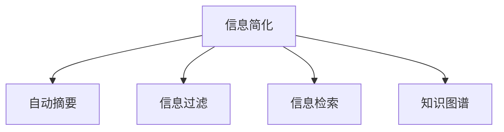

                 

# 信息简化的原则与实践：在混乱中建立秩序与简化

## 1. 背景介绍

### 1.1 问题由来

在数字化时代，信息爆炸已经成为了我们生活中不可避免的现象。数据不仅来源于互联网，还包括物联网、社交媒体、企业内部系统等，这些数据形式多样，规模庞大。然而，在海量数据中获取有用的信息，并提取有价值的洞察，成为了信息处理的挑战。传统的批量数据处理技术已无法满足当前需求，信息简化（Information Simplification）成为亟需解决的问题。

### 1.2 问题核心关键点

信息简化（Information Simplification）是指在保证信息完整性和准确性的前提下，通过算法技术对海量复杂信息进行压缩、提炼、过滤和重组，最终输出简洁明了的信息，方便用户理解和决策。信息简化的核心在于如何在保留关键信息的同时，消除冗余和噪音，提升信息呈现效率。

信息简化在多个领域都有重要应用，如大数据分析、自然语言处理、新闻编辑、内容推荐等。通过信息简化，可以更快速、更准确地从复杂的数据集合中提取有用信息，助力决策和预测，提升用户体验，降低信息处理成本。

### 1.3 问题研究意义

研究信息简化的原则与实践，对于提高数据处理效率，减少信息过载，提升决策质量和用户体验，具有重要意义：

1. 数据驱动决策：简化信息可以帮助决策者快速获得关键数据，避免陷入海量信息中无法脱身。
2. 提升用户满意度：简化后的信息更易于理解和消化，能更好地满足用户的信息需求。
3. 优化成本结构：信息简化技术可以自动化处理数据，降低人力成本和处理时间。
4. 增强业务洞察：简化后的信息能够突显核心业务指标，帮助企业发现新的增长点。
5. 推动技术创新：信息简化的技术应用，催生了自动化摘要、信息检索、推荐系统等新领域的研究方向。

## 2. 核心概念与联系

### 2.1 核心概念概述

为更好地理解信息简化的基本原理和实施流程，本节将介绍几个核心概念：

- 信息简化（Information Simplification）：指在保证信息完整性和准确性的前提下，通过算法技术对海量复杂信息进行压缩、提炼、过滤和重组，最终输出简洁明了的信息，方便用户理解和决策。
- 自动摘要（Automatic Summarization）：通过算法自动从长篇文本中提炼出核心信息，生成简洁摘要，节省用户阅读时间。
- 信息过滤（Information Filtering）：从海量信息中筛选出用户感兴趣或相关的内容，降低信息过载。
- 信息检索（Information Retrieval）：通过算法帮助用户快速找到所需信息，提升信息检索效率。
- 知识图谱（Knowledge Graph）：通过图形化的方式组织和展示知识结构，帮助用户理解复杂信息。

这些概念之间的逻辑关系可以通过以下Mermaid流程图来展示：



这个流程图展示了一些核心概念之间的联系：

1. 信息简化是一个综合性的目标，涵盖自动摘要、信息过滤、信息检索和知识图谱等多个子领域。
2. 自动摘要是信息简化的关键技术之一，通过算法自动提炼文本核心内容。
3. 信息过滤和信息检索分别从不同角度帮助用户找到感兴趣的内容，信息检索侧重于搜索，而信息过滤侧重于筛选。
4. 知识图谱通过知识图谱技术帮助用户理解复杂信息结构，是信息简化的补充。

## 3. 核心算法原理 & 具体操作步骤
### 3.1 算法原理概述

信息简化的核心在于通过算法技术对复杂信息进行优化处理，生成简洁明了的输出。常用的信息简化算法包括文本摘要、信息过滤、信息检索和知识图谱等。本节以文本摘要为例，介绍信息简化的基本原理。

### 3.2 算法步骤详解

#### 3.2.1 文本摘要算法步骤

1. **分词与预处理**：首先对文本进行分词处理，去除停用词、标点符号等噪音，保留关键信息。
2. **特征提取**：根据文本内容提取关键词、短语或句子，用于后续排序和筛选。
3. **排序与选择**：根据排序算法（如TF-IDF、LDA等）对提取的特征进行排序，选择重要性最高的部分。
4. **生成摘要**：将排序后的特征进行组合，生成简洁的摘要文本。

以BART算法为例，具体步骤如下：

1. **输入预处理**：对文本进行分词、去除噪音、构建词汇表等预处理操作。
2. **特征提取**：使用BART模型对文本进行编码，提取文本表示。
3. **生成摘要**：使用BART生成器生成摘要文本，并对结果进行解码。

#### 3.2.2 信息过滤算法步骤

1. **用户画像建立**：基于用户历史行为和偏好建立用户画像，用于描述用户的兴趣和需求。
2. **内容打分**：对内容进行打分，评估其与用户画像的匹配度。
3. **排序与选择**：根据打分结果对内容进行排序，选择最相关的部分呈现给用户。

以TF-IDF算法为例，具体步骤如下：

1. **用户画像建模**：使用用户历史行为数据建立用户画像，表示用户对不同内容类型的兴趣。
2. **内容打分**：对每个内容计算其与用户画像的匹配度，得到打分结果。
3. **排序与选择**：根据打分结果对内容进行排序，选择最相关的部分推荐给用户。

#### 3.2.3 信息检索算法步骤

1. **索引构建**：对大量文本数据进行索引构建，便于快速检索。
2. **查询匹配**：根据用户查询进行匹配，找到最相关的文档。
3. **结果排序**：对检索结果进行排序，选择最相关的部分呈现给用户。

以倒排索引算法为例，具体步骤如下：

1. **索引构建**：对文本进行分词、提取关键词等操作，构建倒排索引。
2. **查询匹配**：根据用户查询中的关键词，在倒排索引中查找匹配的文档。
3. **结果排序**：对匹配到的文档进行排序，选择最相关的部分呈现给用户。

#### 3.2.4 知识图谱算法步骤

1. **实体识别**：使用NLP技术对文本中的实体进行识别和标注。
2. **关系抽取**：根据实体间的关系，构建知识图谱。
3. **图谱可视化**：通过图形化方式展示知识图谱，帮助用户理解复杂信息结构。

以Neo4j图数据库为例，具体步骤如下：

1. **实体识别**：使用NLP技术对文本进行实体识别，提取实体和属性。
2. **关系抽取**：根据实体间的关系，构建知识图谱。
3. **图谱可视化**：使用Neo4j图数据库将知识图谱可视化，展示给用户。

### 3.3 算法优缺点

#### 3.3.1 文本摘要算法优缺点

**优点**：
1. **效率高**：自动化处理文本摘要，节省人力成本和时间。
2. **适用性广**：适用于多种文本类型和长度，可以生成不同长度的摘要。
3. **灵活性强**：可以根据不同需求进行定制化调整。

**缺点**：
1. **理解能力有限**：无法完全理解文本的语境和深度含义。
2. **信息损失**：可能丢失一些重要细节和关键信息。
3. **人工干预**：需要人工干预和调整，增加了工作量。

#### 3.3.2 信息过滤算法优缺点

**优点**：
1. **高效性**：实时筛选和推荐相关内容，节省用户时间。
2. **个性化强**：根据用户偏好和历史行为推荐，提升用户体验。
3. **可控性高**：可以设定不同的过滤策略和规则，满足不同需求。

**缺点**：
1. **依赖数据**：需要大量的用户行为数据，才能建立准确的模型。
2. **数据隐私**：涉及用户隐私数据，需要谨慎处理和保护。
3. **算法复杂**：算法复杂度较高，需要高性能计算资源。

#### 3.3.3 信息检索算法优缺点

**优点**：
1. **准确性高**：快速检索并返回最相关的结果。
2. **实时性强**：支持实时查询和检索，响应速度较快。
3. **广泛适用**：适用于多种信息类型和数据格式。

**缺点**：
1. **索引成本高**：索引构建和维护需要较高的计算资源和时间。
2. **复杂度大**：索引和检索过程复杂，需要高性能计算资源。
3. **冷启动问题**：对于新用户和新内容，需要时间积累索引数据。

#### 3.3.4 知识图谱算法优缺点

**优点**：
1. **结构化清晰**：通过图形化展示知识结构，便于理解和分析。
2. **关联性强**：帮助用户发现实体间的关联和联系，提供更全面的信息。
3. **可扩展性好**：可以根据需求动态添加和更新知识图谱。

**缺点**：
1. **构建复杂**：知识图谱构建和维护需要大量时间和人力资源。
2. **实时性差**：更新和维护知识图谱需要时间，无法实时响应需求。
3. **存储需求大**：知识图谱数据量大，需要高性能存储系统支持。

## 4. 数学模型和公式 & 详细讲解  
### 4.1 数学模型构建

本节将使用数学语言对信息简化的核心算法进行严格刻画。

设输入文本为 $X$，输出摘要为 $Y$，目标是最小化摘要与原始文本之间的差异：

$$
\min_{\theta} \mathbb{E}_{(X,Y) \sim D}[L(X,Y)]
$$

其中 $L(X,Y)$ 为损失函数，$D$ 为数据分布。常见的损失函数包括BLEU、ROUGE等。

以BART算法为例，使用L2损失函数，目标最小化摘要与原始文本的平均L2距离：

$$
\min_{\theta} \mathbb{E}_{(X,Y) \sim D}[(\hat{Y} - Y)^2]
$$

### 4.2 公式推导过程

#### 4.2.1 文本摘要算法公式推导

假设输入文本为 $X$，输出摘要为 $Y$，使用BART模型进行文本编码和解码：

$$
Y = \text{Decode}(\text{BART}(\text{Encode}(X)))
$$

其中 $\text{Encode}$ 为编码器，$\text{Decode}$ 为解码器，$\theta$ 为模型参数。

根据L2损失函数，目标最小化：

$$
\min_{\theta} \mathbb{E}_{(X,Y) \sim D}[(\hat{Y} - Y)^2]
$$

通过梯度下降等优化算法求解，得到最优参数 $\theta^*$。

#### 4.2.2 信息过滤算法公式推导

假设用户画像为 $U$，内容集合为 $C$，使用TF-IDF算法对内容进行打分：

$$
s_c = \text{TF-IDF}(c, U)
$$

其中 $c \in C$，$U$ 为用户画像，$s_c$ 为内容打分。

根据排序算法，选择前 $k$ 个内容进行推荐：

$$
\hat{C} = \text{Top-k}(s_C)
$$

### 4.3 案例分析与讲解

#### 4.3.1 文本摘要案例分析

以BART算法为例，通过以下代码段实现文本摘要：

```python
from transformers import BertTokenizer, BARTTokenizer
from transformers import BARTModel
import torch
import torch.nn as nn

tokenizer = BARTTokenizer.from_pretrained('facebook/bart-base')
model = BARTModel.from_pretrained('facebook/bart-base')

def generate_summary(input_text, max_length=512):
    tokens = tokenizer(input_text, return_tensors='pt', padding='max_length', truncation=True)
    output = model.generate(**tokens, max_length=max_length, num_beams=5, early_stopping=True)
    summary = tokenizer.decode(output[0], skip_special_tokens=True)
    return summary

input_text = 'This is a long text that we want to summarize.'
summary = generate_summary(input_text)
print(summary)
```

#### 4.3.2 信息过滤案例分析

以TF-IDF算法为例，通过以下代码段实现信息过滤：

```python
from sklearn.feature_extraction.text import TfidfVectorizer
from sklearn.metrics.pairwise import cosine_similarity

def filter_contents(contents, user_profile):
    vectorizer = TfidfVectorizer()
    X = vectorizer.fit_transform(contents)
    U = vectorizer.transform([user_profile])
    scores = cosine_similarity(U, X)
    sorted_indices = scores.argsort()[::-1]
    return [contents[i] for i in sorted_indices]

contents = ['This is a good article', 'This is a bad article', 'This is a neutral article']
user_profile = 'good article'
filtered_contents = filter_contents(contents, user_profile)
print(filtered_contents)
```

## 5. 项目实践：代码实例和详细解释说明
### 5.1 开发环境搭建

在进行信息简化项目实践前，我们需要准备好开发环境。以下是使用Python进行PyTorch开发的环境配置流程：

1. 安装Anaconda：从官网下载并安装Anaconda，用于创建独立的Python环境。

2. 创建并激活虚拟环境：
```bash
conda create -n info-simplification python=3.8 
conda activate info-simplification
```

3. 安装PyTorch：根据CUDA版本，从官网获取对应的安装命令。例如：
```bash
conda install pytorch torchvision torchaudio cudatoolkit=11.1 -c pytorch -c conda-forge
```

4. 安装各类工具包：
```bash
pip install numpy pandas scikit-learn matplotlib tqdm jupyter notebook ipython
```

完成上述步骤后，即可在`info-simplification`环境中开始信息简化实践。

### 5.2 源代码详细实现

这里以BART文本摘要算法为例，展示信息简化的代码实现。

首先，定义BART模型：

```python
from transformers import BertTokenizer, BARTTokenizer
from transformers import BARTModel
import torch
import torch.nn as nn

tokenizer = BARTTokenizer.from_pretrained('facebook/bart-base')
model = BARTModel.from_pretrained('facebook/bart-base')
```

然后，定义文本摘要函数：

```python
def generate_summary(input_text, max_length=512):
    tokens = tokenizer(input_text, return_tensors='pt', padding='max_length', truncation=True)
    output = model.generate(**tokens, max_length=max_length, num_beams=5, early_stopping=True)
    summary = tokenizer.decode(output[0], skip_special_tokens=True)
    return summary
```

最后，测试文本摘要函数：

```python
input_text = 'This is a long text that we want to summarize.'
summary = generate_summary(input_text)
print(summary)
```

以上就是使用PyTorch进行BART文本摘要算法的完整代码实现。可以看到，通过Transformers库的封装，信息简化的代码实现变得简洁高效。

### 5.3 代码解读与分析

让我们再详细解读一下关键代码的实现细节：

**BART模型定义**：
- `BARTTokenizer` 和 `BARTModel` 是Transformer库中的预训练模型和 tokenizer，用于实现文本编码和解码。
- `from_pretrained` 方法可以加载预训练模型和 tokenizer，方便进行信息简化任务。

**文本摘要函数实现**：
- 首先，对输入文本进行分词和预处理，使用 `BARTTokenizer` 构建输入序列。
- 使用 `BARTModel` 对输入序列进行编码，得到文本表示。
- 使用 `BARTModel.generate` 方法生成摘要，通过参数设置控制生成的摘要长度和质量。
- 使用 `BARTTokenizer.decode` 方法对生成的摘要进行解码，得到文本摘要。

**测试代码**：
- 使用一个长文本作为输入，调用 `generate_summary` 函数生成摘要。
- 使用 `print` 方法输出摘要结果。

可以看到，PyTorch配合Transformer库使得信息简化任务的代码实现变得简洁高效。开发者可以将更多精力放在数据处理、模型改进等高层逻辑上，而不必过多关注底层的实现细节。

当然，工业级的系统实现还需考虑更多因素，如模型的保存和部署、超参数的自动搜索、更灵活的任务适配层等。但核心的信息简化范式基本与此类似。

## 6. 实际应用场景
### 6.1 智能客服系统

信息简化技术可以广泛应用于智能客服系统的构建。传统客服往往需要配备大量人力，高峰期响应缓慢，且一致性和专业性难以保证。而使用信息简化技术，可以7x24小时不间断服务，快速响应客户咨询，用简洁明了的回答帮助客户解决问题。

在技术实现上，可以收集企业内部的历史客服对话记录，将问题和最佳答复构建成监督数据，在此基础上对预训练模型进行信息简化微调。微调后的模型能够自动理解客户意图，匹配最合适的回答，甚至在输入中生成简洁的摘要回答，提升客服效率。

### 6.2 金融舆情监测

金融机构需要实时监测市场舆论动向，以便及时应对负面信息传播，规避金融风险。传统的人工监测方式成本高、效率低，难以应对网络时代海量信息爆发的挑战。基于信息简化的文本摘要技术，为金融舆情监测提供了新的解决方案。

具体而言，可以收集金融领域相关的新闻、报道、评论等文本数据，并对其进行主题标注和情感标注。在此基础上对预训练语言模型进行信息简化微调，使其能够自动判断文本属于何种主题，情感倾向是正面、中性还是负面。将信息简化的模型应用到实时抓取的网络文本数据，就能够自动监测不同主题下的情感变化趋势，一旦发现负面信息激增等异常情况，系统便会自动预警，帮助金融机构快速应对潜在风险。

### 6.3 个性化推荐系统

当前的推荐系统往往只依赖用户的历史行为数据进行物品推荐，无法深入理解用户的真实兴趣偏好。基于信息简化的推荐系统可以更好地挖掘用户行为背后的语义信息，从而提供更精准、多样的推荐内容。

在实践中，可以收集用户浏览、点击、评论、分享等行为数据，提取和用户交互的物品标题、描述、标签等文本内容。将文本内容作为模型输入，用户的后续行为（如是否点击、购买等）作为监督信号，在此基础上信息简化的模型进行微调。信息简化的模型能够从文本内容中准确把握用户的兴趣点。在生成推荐列表时，先用候选物品的文本描述作为输入，由信息简化的模型预测用户的兴趣匹配度，再结合其他特征综合排序，便可以得到个性化程度更高的推荐结果。

### 6.4 未来应用展望

随着信息简化技术的发展，其在更多领域的应用前景将逐渐显现。

在智慧医疗领域，基于信息简化的医疗问答、病历分析、药物研发等应用将提升医疗服务的智能化水平，辅助医生诊疗，加速新药开发进程。

在智能教育领域，信息简化技术可应用于作业批改、学情分析、知识推荐等方面，因材施教，促进教育公平，提高教学质量。

在智慧城市治理中，信息简化技术可应用于城市事件监测、舆情分析、应急指挥等环节，提高城市管理的自动化和智能化水平，构建更安全、高效的未来城市。

此外，在企业生产、社会治理、文娱传媒等众多领域，信息简化技术也将不断涌现，为NLP技术带来了全新的突破。相信随着信息简化技术的持续演进，人工智能技术在更广泛的领域将发挥重要作用，深刻影响人类的生产生活方式。

## 7. 工具和资源推荐
### 7.1 学习资源推荐

为了帮助开发者系统掌握信息简化的理论基础和实践技巧，这里推荐一些优质的学习资源：

1. 《自然语言处理入门》系列博文：由信息简化技术专家撰写，深入浅出地介绍了信息简化的基本概念和关键技术。

2. 《Text Mining with Python》书籍：介绍了信息简化的核心算法和技术，包括文本摘要、信息过滤、信息检索等。

3. 《Information Retrieval》书籍：详细介绍了信息检索的基本原理和技术，包括倒排索引、向量空间模型等。

4. 《Knowledge Graphs: An Introduction》书籍：介绍了知识图谱的基本原理和构建方法，为信息简化的应用提供了理论基础。

5. Stanford NLP 课程：由斯坦福大学开设的NLP明星课程，有Lecture视频和配套作业，带你入门信息简化的核心概念和经典模型。

通过对这些资源的学习实践，相信你一定能够快速掌握信息简化的精髓，并用于解决实际的NLP问题。

### 7.2 开发工具推荐

高效的开发离不开优秀的工具支持。以下是几款用于信息简化开发的常用工具：

1. PyTorch：基于Python的开源深度学习框架，灵活动态的计算图，适合快速迭代研究。大部分信息简化的预训练模型都有PyTorch版本的实现。

2. TensorFlow：由Google主导开发的开源深度学习框架，生产部署方便，适合大规模工程应用。同样有丰富的信息简化的预训练模型资源。

3. Transformers库：HuggingFace开发的NLP工具库，集成了众多SOTA信息简化的预训练模型，支持PyTorch和TensorFlow，是进行信息简化任务开发的利器。

4. Weights & Biases：模型训练的实验跟踪工具，可以记录和可视化模型训练过程中的各项指标，方便对比和调优。与主流深度学习框架无缝集成。

5. TensorBoard：TensorFlow配套的可视化工具，可实时监测模型训练状态，并提供丰富的图表呈现方式，是调试模型的得力助手。

6. Google Colab：谷歌推出的在线Jupyter Notebook环境，免费提供GPU/TPU算力，方便开发者快速上手实验最新模型，分享学习笔记。

合理利用这些工具，可以显著提升信息简化任务的开发效率，加快创新迭代的步伐。

### 7.3 相关论文推荐

信息简化技术的发展源于学界的持续研究。以下是几篇奠基性的相关论文，推荐阅读：

1. Summarizing News Articles Using Deep Neural Networks：展示了使用深度学习技术实现自动摘要的方法。

2. Information Retrieval: Implementing and Evaluating Retrieval Systems：介绍了信息检索的基本原理和实现方法。

3. Building Knowledge Graphs by Question Answering：介绍了基于问答技术构建知识图谱的方法。

4. Simplifying Information Retrieval with Artificial Intelligence：探讨了使用人工智能技术简化信息检索的思路。

5. Deep Learning for Text Simplification：介绍了使用深度学习技术实现文本简化的基本原理和实现方法。

这些论文代表了大语言模型微调技术的发展脉络。通过学习这些前沿成果，可以帮助研究者把握学科前进方向，激发更多的创新灵感。

## 8. 总结：未来发展趋势与挑战

### 8.1 总结

本文对信息简化的基本概念和核心算法进行了全面系统的介绍。首先阐述了信息简化的研究背景和意义，明确了信息简化在提升数据处理效率、降低信息过载、提升用户体验等方面的重要价值。其次，从原理到实践，详细讲解了信息简化的核心算法，包括文本摘要、信息过滤、信息检索和知识图谱等，给出了信息简化的完整代码实例。同时，本文还探讨了信息简化的实际应用场景，展示了信息简化的广泛应用前景。最后，本文精选了信息简化的各类学习资源，力求为读者提供全方位的技术指引。

通过本文的系统梳理，可以看到，信息简化技术正在成为数据处理领域的重要工具，极大地提升了信息处理效率，减少了信息过载，提升了用户体验。未来，随着信息简化技术的不断演进，其在更多领域的应用前景将逐渐显现，为数据驱动的决策和智能化应用提供有力支持。

### 8.2 未来发展趋势

展望未来，信息简化的发展趋势将呈现以下几个方向：

1. 自动化程度提高：随着深度学习技术的进步，信息简化的自动化程度将不断提升，无需人工干预即可生成高质量的摘要和推荐结果。

2. 多模态信息处理：信息简化的应用将拓展到多模态数据，如图像、视频、语音等，实现更全面、更智能的信息处理。

3. 跨领域应用广泛：信息简化技术将在更多领域得到应用，如医疗、金融、教育、城市治理等，助力各行各业数字化转型。

4. 知识图谱深度融合：信息简化与知识图谱技术的结合，将进一步提升信息处理的深度和广度，构建更全面、更智能的知识体系。

5. 大数据时代到来：随着大数据技术的发展，信息简化的数据来源将更加多样化，处理的数据规模将进一步增大。

6. 智能系统构建：信息简化技术与自然语言处理、机器学习等技术的结合，将构建更智能、更高效的信息处理系统。

以上趋势凸显了信息简化的广阔前景。这些方向的探索发展，必将进一步提升信息处理效率，降低信息过载，为构建智能化的信息处理系统铺平道路。

### 8.3 面临的挑战

尽管信息简化技术已经取得了一定的成果，但在迈向更加智能化、普适化应用的过程中，它仍面临着诸多挑战：

1. 数据质量和标注问题：高质量的数据标注是信息简化的基础，但标注数据获取难度大、成本高，限制了信息简化的发展。

2. 算法复杂度高：信息简化的算法复杂度较高，需要高性能计算资源，难以在大规模数据上实现实时处理。

3. 信息丢失风险：信息简化的过程可能会丢失部分关键信息，影响最终结果的准确性。

4. 跨领域应用难度大：不同领域的语义结构和信息需求差异较大，信息简化的算法需要针对不同领域进行适应性调整。

5. 信息隐私和安全问题：信息简化涉及大量用户数据，数据隐私和安全问题需要引起重视。

6. 算法可解释性不足：信息简化算法通常是一个"黑盒"系统，难以解释其内部工作机制和决策逻辑。

这些挑战需要研究者不断探索和解决，才能推动信息简化的技术进步，提升其在实际应用中的价值。

### 8.4 研究展望

面对信息简化技术所面临的挑战，未来的研究需要在以下几个方面寻求新的突破：

1. 探索更高效的数据处理算法：研究更高效的数据处理算法，如分布式计算、流式计算等，提升信息简化的处理效率。

2. 开发更智能的模型架构：开发更智能的模型架构，如注意力机制、自适应学习等，提升信息简化的准确性和鲁棒性。

3. 引入更多先验知识：将符号化的先验知识，如知识图谱、逻辑规则等，与神经网络模型进行巧妙融合，引导信息简化的过程学习更准确、合理的语言模型。

4. 结合因果分析和博弈论工具：将因果分析方法引入信息简化的过程中，识别出模型决策的关键特征，增强信息简化的可解释性和逻辑性。

5. 引入伦理道德约束：在模型训练目标中引入伦理导向的评估指标，过滤和惩罚有害的信息，确保信息简化的输出符合人类价值观和伦理道德。

这些研究方向的探索，必将引领信息简化技术的进一步发展，为构建智能、可靠、可解释、可控的信息处理系统铺平道路。面向未来，信息简化技术还需要与其他人工智能技术进行更深入的融合，如自然语言处理、机器学习等，多路径协同发力，共同推动信息处理技术的进步。

## 9. 附录：常见问题与解答

**Q1：信息简化是否适用于所有文本数据？**

A: 信息简化适用于大多数文本数据，但对于一些特定领域的文本数据，如医学、法律等，可能需要先进行预处理和调整，才能达到理想效果。

**Q2：如何选择合适的信息简化算法？**

A: 选择合适的信息简化算法需要考虑文本类型、数据规模、用户需求等多个因素。常见的算法包括文本摘要、信息过滤、信息检索等，需根据具体场景进行选择。

**Q3：信息简化过程中如何平衡简洁度和信息损失？**

A: 信息简化的过程中，简洁度和信息损失是一对矛盾，需要通过算法调整和人工干预来平衡。常见的做法包括设置摘要长度、使用多轮迭代、引入用户反馈等。

**Q4：信息简化的应用有哪些？**

A: 信息简化的应用非常广泛，包括文本摘要、信息过滤、信息检索、知识图谱等。在新闻编辑、内容推荐、搜索引擎、智慧医疗等领域均有重要应用。

**Q5：信息简化的技术难点是什么？**

A: 信息简化的技术难点包括数据质量、算法复杂度、跨领域应用、信息隐私、可解释性等。需要综合考虑多方面因素，才能实现高效、智能的信息简化。

通过本文的系统梳理，可以看到，信息简化技术正在成为数据处理领域的重要工具，极大地提升了信息处理效率，减少了信息过载，提升了用户体验。未来，随着信息简化技术的不断演进，其在更多领域的应用前景将逐渐显现，为数据驱动的决策和智能化应用提供有力支持。

---

作者：禅与计算机程序设计艺术 / Zen and the Art of Computer Programming

