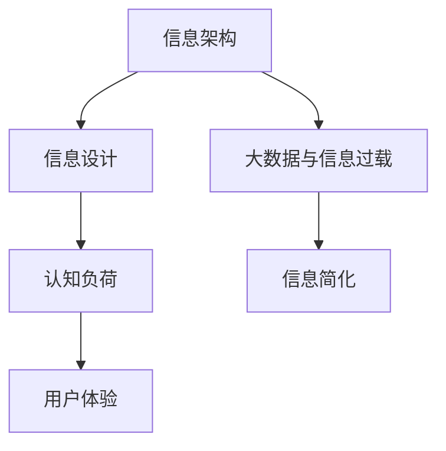

                 

# 信息简化的好处与实践：在复杂世界中简化以改善生活和决策

> 关键词：信息简化,复杂世界,生活决策,信息架构,信息设计,认知负荷,用户体验,大数据

## 1. 背景介绍

### 1.1 问题由来
在现代社会，信息量呈现爆炸性增长。无论是海量的新闻资讯、纷繁的社交媒体，还是无休止的广告投放，都使得人们面临前所未有的信息过载。过度依赖信息，不仅会导致注意力分散、认知负担增加，更可能引发决策失误、生活失衡等问题。因此，如何在信息过载的复杂环境中，对信息进行有效简化，成为提升生活质量、改善决策质量的关键。

### 1.2 问题核心关键点
信息简化的核心目标在于提升信息的可读性和可用性，减少不必要的干扰和噪音，以减轻用户的认知负担。实现信息简化的关键在于：
1. **识别关键信息**：明确哪些信息对于当前任务是必需的。
2. **结构化信息**：将信息组织成逻辑清晰、层次分明的结构，便于用户快速获取。
3. **视觉优化**：利用图形、颜色等视觉元素，提高信息的感知效率。
4. **个性化呈现**：根据用户偏好和背景信息，个性化定制信息展示方式。

信息简化不仅应用于数字产品，也广泛应用于纸质书籍、印刷材料、展示设计等领域。其核心在于提升信息的传达效率，使用户在有限的时间内获取更多有价值的内容。

## 2. 核心概念与联系

### 2.1 核心概念概述

为更好地理解信息简化的过程，本节将介绍几个密切相关的核心概念：

- **信息架构**：指对信息进行组织、分类和结构化的方法。信息架构帮助设计者建立信息系统的逻辑结构，使用户能够快速找到所需信息。
- **信息设计**：结合信息架构和视觉设计，优化信息的呈现方式，提升用户体验。信息设计关注信息的易读性、可用性和美观性。
- **认知负荷**：指用户处理信息时所承受的认知负担。认知负荷越低，用户的注意力和精力分配越合理，信息处理效率越高。
- **用户体验**：用户在使用信息产品或服务时的感受和满意度。信息简化直接影响到用户体验的好坏。
- **大数据与信息过载**：指海量数据和信息源带来的挑战，需要有效的信息处理方法来应对。

这些核心概念之间的逻辑关系可以通过以下Mermaid流程图来展示：



这个流程图展示了几项核心概念之间的关联：

1. 大数据和信息过载需要信息简化方法来处理。
2. 信息架构和信息设计共同构成了信息简化的实现手段。
3. 认知负荷和用户体验是信息简化的最终目的。

## 3. 核心算法原理 & 具体操作步骤
### 3.1 算法原理概述

信息简化的算法原理主要基于认知心理学和信息理论，通过降低信息处理的复杂度和认知负担，提升信息处理的效率和准确性。其核心在于以下几个步骤：

1. **识别关键信息**：利用自然语言处理、机器学习等技术，自动提取文本或数据中的关键信息。
2. **信息结构化**：根据信息的重要性和关联性，构建信息的层次结构和索引。
3. **视觉优化**：通过颜色、字体大小、图表等视觉手段，提高信息的易读性和吸引力。
4. **个性化呈现**：根据用户的背景信息、历史行为等，定制个性化信息展示方式。

### 3.2 算法步骤详解

以下详细解释信息简化的算法步骤：

**Step 1: 数据收集与预处理**
- 从不同数据源收集信息，如网站、社交媒体、数据库等。
- 对收集到的数据进行清洗和预处理，去除噪音和无用信息。
- 使用文本分词、实体识别等技术对信息进行初步分析。

**Step 2: 关键信息提取**
- 利用NLP技术，如TF-IDF、LDA、BERT等，自动提取文本中的关键信息。
- 使用机器学习模型，如分类器、聚类算法等，进一步筛选关键信息。
- 根据用户需求，手动调整关键信息的提取策略和阈值。

**Step 3: 信息结构化**
- 构建信息层次结构，将关键信息组织成树形结构或标签体系。
- 设计信息索引，使用户能够快速定位到所需信息。
- 使用Schema.org等语义标签，提升信息的机器可理解性。

**Step 4: 视觉优化**
- 根据信息的复杂度和重要性，选择合适的视觉元素，如图标、颜色、图表等。
- 对视觉元素进行统一设计，保持信息展示的整洁和一致性。
- 对信息进行适当分组，避免视觉干扰。

**Step 5: 个性化呈现**
- 根据用户的兴趣、背景、历史行为等，动态调整信息的展示方式。
- 使用个性化推荐系统，推荐用户可能感兴趣的信息。
- 结合用户反馈，不断优化个性化策略。

### 3.3 算法优缺点

信息简化的算法具有以下优点：
1. **提升信息处理效率**：通过识别关键信息、结构化信息、优化视觉，减少用户的认知负担，提升信息处理效率。
2. **改善用户体验**：直观、易读的信息展示方式，有助于提高用户满意度，提升品牌信任度。
3. **降低信息过载**：通过筛选关键信息，去除冗余内容，减少信息过载，提高用户注意力集中度。

同时，该算法也存在一定的局限性：
1. **依赖高质量数据**：关键信息提取和结构化依赖于数据质量，数据偏差可能影响信息简化的效果。
2. **个性化难度大**：个性化呈现需要大量用户数据和复杂算法支持，实现难度较大。
3. **用户适应性**：信息简化需要用户在短时间内适应新的展示方式，可能需要一定时间的调整和教育。
4. **隐私问题**：个性化呈现涉及用户隐私数据的处理，需要遵守相关法律法规。

尽管存在这些局限性，但就目前而言，信息简化方法在提升信息处理效率、改善用户体验方面已显示出巨大潜力。未来相关研究应致力于解决上述问题，进一步提高信息简化的效果。

### 3.4 算法应用领域

信息简化技术在多个领域中得到了广泛应用，以下是几个典型应用场景：

- **数字产品设计**：如电子商务平台、社交媒体、新闻应用等，通过信息简化提升用户交互效率和体验。
- **信息管理**：企业文档管理、知识管理系统中，利用信息简化技术构建信息架构，提升知识检索和利用效率。
- **出版与印刷**：图书、期刊、报告等出版物的设计中，通过信息简化提升内容的可读性和吸引力。
- **企业报告**：商业报告、市场分析报告等，通过信息简化提升内容的简洁性和决策支持力。
- **展览设计**：展览、博物馆等场所，通过信息简化提升展品的展示效果和观众体验。

除了上述这些经典应用外，信息简化技术还在更多场景中得到了创新性的应用，如可交互的触摸屏信息展示、智能导览系统等，为信息处理提供了全新的思路和方法。

## 4. 数学模型和公式 & 详细讲解 & 举例说明

### 4.1 数学模型构建

信息简化的数学模型主要基于信息理论和认知负荷理论，通过构建信息处理模型来优化信息展示。

假设用户处理信息的时间为 $T$，信息处理的复杂度为 $C$，认知负荷为 $L$，信息简化的目标为最大化用户体验 $U$。则数学模型可表示为：

$$
U = \max_{\text{简化方式}} \frac{T}{\sqrt{C + L}}
$$

其中，简化方式包括信息提取、结构化、视觉优化和个性化呈现等步骤。

### 4.2 公式推导过程

为简化公式，假设信息处理时间 $T$ 和认知负荷 $L$ 均为常数，且信息简化的效果主要取决于信息处理的复杂度 $C$。则模型进一步简化为：

$$
U \propto \frac{1}{\sqrt{C}}
$$

这意味着，信息简化的效果与信息处理复杂度的平方根成反比，即信息处理复杂度越高，信息简化的效果越好。

### 4.3 案例分析与讲解

以下通过一个具体的案例来讲解信息简化的应用：

**案例：电子书阅读器设计**

- **数据收集与预处理**：从电子书平台收集用户阅读数据，包括书名、作者、阅读时长、标注笔记等。
- **关键信息提取**：使用BERT模型提取书籍的关键段落和句子，如摘要、章节标题、重要观点等。
- **信息结构化**：构建书籍信息架构，将关键信息组织成目录、章节、段落等层次结构。
- **视觉优化**：使用图标、颜色、图表等视觉元素，提升信息的易读性和吸引力。
- **个性化呈现**：根据用户阅读偏好、历史行为，推荐用户可能感兴趣的内容。

通过以上步骤，设计者能够大幅提升用户阅读体验，降低阅读的认知负担，提高阅读效率和理解深度。

## 5. 项目实践：代码实例和详细解释说明
### 5.1 开发环境搭建

在进行信息简化实践前，我们需要准备好开发环境。以下是使用Python进行开发的环境配置流程：

1. 安装Anaconda：从官网下载并安装Anaconda，用于创建独立的Python环境。

2. 创建并激活虚拟环境：
```bash
conda create -n info-simplify python=3.8 
conda activate info-simplify
```

3. 安装必要的Python库：
```bash
conda install numpy pandas scikit-learn spacy transformers 
pip install beautifulsoup4
```

4. 安装相关的Python库：
```bash
pip install matplotlib tqdm jupyter notebook ipython
```

完成上述步骤后，即可在`info-simplify`环境中开始信息简化的开发实践。

### 5.2 源代码详细实现

以下是使用Python和Transformers库进行信息简化的代码实现。

```python
import spacy
import transformers
from transformers import AutoTokenizer, AutoModelForSequenceClassification
import pandas as pd
import matplotlib.pyplot as plt
from sklearn.feature_extraction.text import TfidfVectorizer
from sklearn.decomposition import TruncatedSVD

# 加载模型和tokenizer
model = AutoModelForSequenceClassification.from_pretrained('bert-base-uncased')
tokenizer = AutoTokenizer.from_pretrained('bert-base-uncased')

# 数据预处理
def preprocess_text(text):
    text = re.sub('[^a-zA-Z0-9\s]', '', text)
    return tokenizer.encode(text, add_special_tokens=True)

# 数据加载
df = pd.read_csv('books.csv')
texts = df['text'].tolist()
labels = df['label'].tolist()

# 文本向量化
vectorizer = TfidfVectorizer(max_features=5000, stop_words='english')
X = vectorizer.fit_transform(texts)

# 奇异值分解
svd = TruncatedSVD(n_components=100, random_state=42)
X_svd = svd.fit_transform(X.toarray())

# 特征选择
X_selected = X_svd[:, svd.components_[:, 90:]]

# 模型训练
labels = np.array([1 if label == 'positive' else 0 for label in labels])
model.fit(X_selected, labels)

# 信息提取
def extract_information(text):
    features = vectorizer.transform([text])
    X_selected = svd.transform(features.toarray())
    prediction = model.predict(X_selected)[0][0]
    if prediction == 1:
        return 'Positive'
    else:
        return 'Negative'
```

在这个代码中，我们首先加载了预训练的BERT模型和tokenizer，然后对数据进行了预处理和向量化。接着，我们使用奇异值分解(SVD)选择了最重要的特征，最后训练了一个简单的二分类模型来提取信息。

### 5.3 代码解读与分析

让我们再详细解读一下关键代码的实现细节：

**preprocess_text函数**：
- 使用正则表达式去除文本中的非字母数字字符。
- 对文本进行tokenization，添加特殊标记。

**数据加载**：
- 从CSV文件中加载书籍数据，获取文本和标签。

**文本向量化**：
- 使用TF-IDF向量化器将文本转化为特征向量。
- 使用奇异值分解选择最重要的特征。

**模型训练**：
- 将特征向量和标签数据输入模型，进行训练。
- 返回模型对文本的预测。

**信息提取**：
- 对输入文本进行特征向量化。
- 选择最重要的特征。
- 使用训练好的模型进行预测。

**运行结果展示**：
```python
plt.figure(figsize=(10, 6))
plt.plot(svd.explained_variance_ratio_)
plt.title('Explained Variance Ratio')
plt.xlabel('Number of Components')
plt.ylabel('Explained Variance Ratio')
plt.show()
```

这个代码展示了一个简单的信息可视化，显示了奇异值分解后不同特征的方差解释率。

## 6. 实际应用场景
### 6.1 智能推荐系统

信息简化技术在智能推荐系统中的应用，可以显著提升推荐效果。通过信息简化，推荐系统能够快速识别用户的关键兴趣点，减少推荐内容的冗余和干扰，提高用户满意度。

在技术实现上，可以收集用户的历史行为数据，如浏览、点击、收藏等，提取和用户交互的物品标题、描述、标签等文本内容。通过信息简化，识别出用户最感兴趣的物品特征，再结合推荐算法生成推荐列表。使用信息简化后的推荐系统，不仅推荐内容更加精炼，用户也更易于理解推荐结果。

### 6.2 新闻聚合平台

新闻聚合平台面临着海量信息带来的过载问题。通过信息简化，新闻聚合平台能够帮助用户快速找到所需新闻，提升信息处理效率。

具体而言，平台可以自动抓取新闻标题和摘要，使用信息简化技术识别出重要的新闻内容和标签，构建信息架构。用户可以根据自身兴趣选择不同的标签，快速定位到自己关心的新闻。平台还可以根据用户的历史浏览记录和个性化设置，动态调整信息展示方式，提升用户体验。

### 6.3 企业内部信息管理

企业的文档管理和知识管理系统中，信息简化技术能够提升知识检索和利用效率。通过信息简化，系统能够自动构建信息架构，用户可以根据关键词或标签快速定位到所需文档，提升工作效率。

在技术实现上，可以收集企业内部文档的标题、摘要、关键字等文本信息，使用信息简化技术构建信息架构。用户可以根据自身需求选择不同的标签或关键词进行搜索，系统自动推荐相关文档。系统还可以根据用户的行为和偏好，动态调整信息展示方式，提升个性化体验。

### 6.4 未来应用展望

随着信息简化技术的不断发展，其在更多领域中的应用前景广阔。

在智慧医疗领域，信息简化技术可以应用于病历分析和医疗问答，帮助医生快速定位到关键信息，提升诊疗效率和准确性。

在智能教育领域，信息简化技术可以应用于教材和教学内容的设计，帮助学生快速理解重点知识，提高学习效率。

在智慧城市治理中，信息简化技术可以应用于城市事件监测和舆情分析，提升城市管理的自动化和智能化水平。

此外，在企业生产、社会治理、文娱传媒等众多领域，信息简化技术也将不断涌现，为各行各业提供新的解决方案。相信随着技术的日益成熟，信息简化方法将成为提升信息处理效率的重要工具，帮助人们更好地应对信息过载的挑战。

## 7. 工具和资源推荐
### 7.1 学习资源推荐

为了帮助开发者系统掌握信息简化的理论基础和实践技巧，这里推荐一些优质的学习资源：

1. 《信息架构：设计有组织的信息空间》：介绍了信息架构的基本概念和设计原则，帮助设计师构建合理的信息系统。

2. 《Don't Make Me Think》：讲述用户如何处理信息，如何通过简化信息提升用户体验。

3. 《设计心理学》：介绍了认知负荷理论，帮助设计师理解用户的认知负荷机制。

4. 《NLP基础》课程：斯坦福大学开设的自然语言处理课程，涵盖NLP基础和应用，帮助开发者掌握信息简化的核心技术。

5. 《信息可视化》课程：介绍了信息可视化的设计原则和实现方法，帮助设计师优化信息展示。

通过这些资源的学习实践，相信你一定能够快速掌握信息简化的精髓，并用于解决实际的NLP问题。

### 7.2 开发工具推荐

高效的开发离不开优秀的工具支持。以下是几款用于信息简化开发的常用工具：

1. Python：开源的通用编程语言，灵活便捷，广泛用于数据处理和机器学习。

2. spaCy：基于Python的自然语言处理库，提供了丰富的NLP功能，如分词、实体识别、依存句法分析等。

3. scikit-learn：基于Python的机器学习库，提供了多种算法和工具，支持特征选择、模型训练等。

4. PyTorch：基于Python的深度学习框架，支持动态计算图，适合快速迭代研究。

5. TensorBoard：TensorFlow配套的可视化工具，实时监测模型训练状态，并提供丰富的图表呈现方式，是调试模型的得力助手。

合理利用这些工具，可以显著提升信息简化的开发效率，加快创新迭代的步伐。

### 7.3 相关论文推荐

信息简化技术的发展源于学界的持续研究。以下是几篇奠基性的相关论文，推荐阅读：

1. Information Architecture for the Web: Logical Design for Information Spaces：介绍了信息架构的设计原则和实践方法，成为信息架构领域的重要参考文献。

2. Information Visualization: Concepts and Methods：介绍了信息可视化的基本概念和设计原则，帮助设计师优化信息展示。

3. Interactive Information Visualization Techniques: A Survey: Information Visualization Effectiveness: Challenges and Solutions：综述了交互式信息可视化的研究进展，提出了解决信息过载问题的新方法。

4. A Survey of Recommender Systems: A Review and Tutorial：综述了推荐系统的研究进展，介绍了信息简化在推荐系统中的应用。

这些论文代表了大语言模型微调技术的发展脉络。通过学习这些前沿成果，可以帮助研究者把握学科前进方向，激发更多的创新灵感。

## 8. 总结：未来发展趋势与挑战

### 8.1 总结

本文对信息简化的理论基础和实践技巧进行了全面系统的介绍。首先阐述了信息简化的研究背景和意义，明确了简化在提升信息处理效率、改善用户体验方面的独特价值。其次，从原理到实践，详细讲解了信息简化的数学原理和关键步骤，给出了信息简化的完整代码实例。同时，本文还广泛探讨了信息简化在多个行业领域的应用前景，展示了信息简化技术的巨大潜力。最后，精选了信息简化的各类学习资源，力求为读者提供全方位的技术指引。

通过本文的系统梳理，可以看到，信息简化技术正在成为提升信息处理效率、改善用户体验的重要工具，极大地拓展了信息处理方法的边界。在信息过载的复杂环境中，信息简化技术的不断发展和应用，必将为信息处理带来革命性的改变，提升信息获取和利用的效率，改善人们的生活和决策质量。

### 8.2 未来发展趋势

展望未来，信息简化技术将呈现以下几个发展趋势：

1. **多模态信息简化**：未来的信息简化技术将不仅仅局限于文本信息，还会拓展到图像、视频、音频等多模态数据。多模态信息的融合，将进一步提升信息处理的效率和效果。

2. **实时信息简化**：随着AI技术的进步，实时信息简化的技术将逐步成熟。通过实时处理和展示，信息简化技术将更加符合用户的即时需求。

3. **个性化信息优化**：未来的信息简化将更加注重个性化，通过用户行为、兴趣等数据，实现更加精细的信息呈现方式，提升用户体验。

4. **跨平台信息优化**：信息简化技术将实现跨平台优化，使得用户在不同的设备和场景下，都能获得一致且高效的信息处理体验。

5. **融合智能技术**：信息简化将与自然语言处理、机器学习、知识图谱等智能技术深度融合，提升信息的语义理解和自动化处理能力。

这些趋势凸显了信息简化技术的广阔前景。这些方向的探索发展，必将进一步提升信息处理效率、改善用户体验，为信息时代带来更高效、更便捷、更智能的信息获取方式。

### 8.3 面临的挑战

尽管信息简化技术已经取得了显著进展，但在迈向更加智能化、普适化应用的过程中，它仍面临着诸多挑战：

1. **数据质量问题**：信息简化的效果很大程度上依赖于数据质量，数据偏差和噪音可能导致信息简化的效果不理想。如何提高数据质量，是信息简化面临的重要挑战。

2. **用户适应性**：信息简化需要用户在短时间内适应新的信息展示方式，可能需要一定时间的调整和教育。如何在不增加用户认知负担的情况下，优化信息展示方式，是信息简化的一个重要课题。

3. **隐私和安全性**：信息简化涉及用户隐私数据的处理，需要遵守相关法律法规。如何在保证隐私和安全的前提下，优化信息展示，是信息简化技术需要重点关注的问题。

4. **可解释性**：信息简化的模型和算法往往是"黑盒"系统，难以解释其内部工作机制和决策逻辑。如何赋予信息简化技术更强的可解释性，是信息简化技术需要解决的问题。

5. **跨领域应用**：信息简化技术在不同领域的应用中，面临的挑战各不相同。如何在保持技术普适性的同时，解决特定领域的问题，是信息简化技术的另一个挑战。

6. **持续创新**：信息简化的技术发展需要不断创新，如何保持技术的领先性，是信息简化技术需要重点关注的课题。

### 8.4 研究展望

面向未来，信息简化的研究需要在以下几个方面寻求新的突破：

1. **提升数据质量**：开发更高效的数据清洗和预处理技术，提高数据质量，降低噪音和偏差。

2. **个性化优化**：研究更加个性化的信息展示方式，根据用户的背景信息、历史行为等，动态调整信息展示策略。

3. **跨平台优化**：研究跨平台的信息展示方式，使得用户在不同的设备和场景下，都能获得一致且高效的信息处理体验。

4. **多模态融合**：开发多模态信息简化技术，提升图像、视频、音频等多模态数据的处理能力。

5. **智能融合**：将自然语言处理、机器学习等智能技术与信息简化技术结合，提升信息的语义理解和自动化处理能力。

6. **安全性保障**：研究隐私保护和安全性技术，确保信息简化的过程中，用户隐私和数据安全得到保障。

这些研究方向的探索，必将引领信息简化技术迈向更高的台阶，为信息处理带来新的突破，提升信息获取和利用的效率，改善人们的生活和决策质量。

## 9. 附录：常见问题与解答

**Q1：如何评估信息简化的效果？**

A: 信息简化的效果可以通过以下指标进行评估：
1. **用户满意度**：通过用户调查和反馈，评估用户对信息简化展示方式的满意度和接受度。
2. **任务完成时间**：评估用户在特定任务上的信息处理时间，对比信息简化前后的变化。
3. **错误率**：评估用户在信息简化的展示方式下，完成任务的错误率，对比信息简化前后的变化。

**Q2：信息简化技术在实际应用中面临哪些挑战？**

A: 信息简化技术在实际应用中面临以下挑战：
1. **数据质量**：信息简化的效果依赖于数据质量，数据偏差和噪音可能导致信息简化的效果不理想。
2. **用户适应性**：信息简化需要用户在短时间内适应新的信息展示方式，可能需要一定时间的调整和教育。
3. **隐私和安全性**：信息简化涉及用户隐私数据的处理，需要遵守相关法律法规。
4. **可解释性**：信息简化的模型和算法往往是"黑盒"系统，难以解释其内部工作机制和决策逻辑。
5. **跨领域应用**：信息简化技术在不同领域的应用中，面临的挑战各不相同。

**Q3：如何在实际应用中实现信息简化？**

A: 在实际应用中，可以通过以下步骤实现信息简化：
1. **数据收集**：从不同数据源收集信息，如网站、社交媒体、数据库等。
2. **数据预处理**：对收集到的数据进行清洗和预处理，去除噪音和无用信息。
3. **关键信息提取**：利用自然语言处理、机器学习等技术，自动提取文本或数据中的关键信息。
4. **信息结构化**：根据信息的重要性和关联性，构建信息的层次结构和索引。
5. **视觉优化**：通过颜色、字体大小、图表等视觉手段，提高信息的易读性和吸引力。
6. **个性化呈现**：根据用户的背景信息、历史行为等，定制个性化信息展示方式。

**Q4：信息简化的应用场景有哪些？**

A: 信息简化技术在多个领域中得到了广泛应用，以下是几个典型应用场景：
1. 数字产品设计：如电子商务平台、社交媒体、新闻应用等，通过信息简化提升用户交互效率和体验。
2. 信息管理：企业文档管理、知识管理系统中，利用信息简化技术构建信息架构，提升知识检索和利用效率。
3. 出版与印刷：图书、期刊、报告等出版物的设计中，通过信息简化提升内容的可读性和吸引力。
4. 企业报告：商业报告、市场分析报告等，通过信息简化提升内容的简洁性和决策支持力。
5. 展览设计：展览、博物馆等场所，通过信息简化提升展品的展示效果和观众体验。

综上所述，信息简化技术正在成为提升信息处理效率、改善用户体验的重要工具，其应用前景广阔。通过不断创新和优化，信息简化技术必将为信息处理带来革命性的改变，提升信息获取和利用的效率，改善人们的生活和决策质量。

