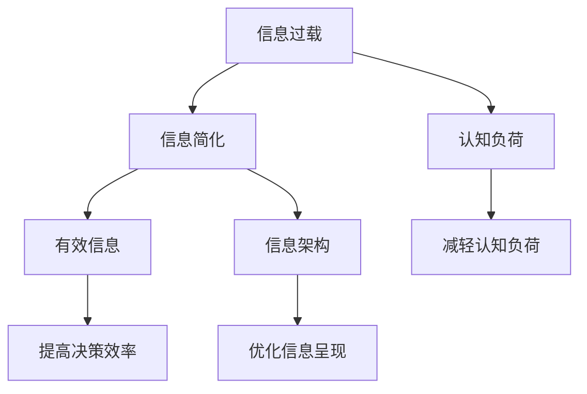

                 

# 信息简化的好处与艺术：在复杂世界中简化以提高生活质量和效率

## 1. 背景介绍

### 1.1 问题由来
在现代社会中，信息爆炸已成为不争的事实。信息无处不在，信息量也急剧膨胀。从新闻、社交媒体、广告，到电子邮件、文档、会议记录，几乎每一刻，我们都在被海量信息所淹没。信息量的激增，使得我们很难从这些信息中快速抽取关键要素，从而影响了决策的效率和质量。

### 1.2 问题核心关键点
面对信息爆炸的挑战，如何有效简化信息，并从中提取出有价值的部分，成为当下的一个重要问题。信息简化并非简单地删除多余内容，而是通过合理的组织和呈现，帮助用户更快、更准地理解信息，提高生活质量和效率。

### 1.3 问题研究意义
研究信息简化的原则与技术，有助于我们更高效地处理信息，提升决策的准确性，降低信息过载的负面影响，从而在复杂世界中提高生活质量和效率。

## 2. 核心概念与联系

### 2.1 核心概念概述

为了更好地理解信息简化的原理与实践，本节将介绍几个关键概念：

- 信息过载(Information Overload)：指个人或组织接收的信息超过其处理能力的现象，导致注意力分散，决策效率低下。
- 信息简化(Information Simplification)：通过合理的组织和呈现，使信息更易于理解和使用，帮助用户快速处理大量信息。
- 认知负荷(Cognitive Load)：指在信息处理过程中，人脑所需要承担的工作量。
- 有效信息(Effective Information)：指对决策有帮助、能够帮助用户理解问题的关键信息。
- 信息架构(Information Architecture)：指对信息的组织和呈现方式进行设计和规划，以帮助用户快速理解和使用信息。

这些概念之间的逻辑关系可以通过以下Mermaid流程图来展示：



这个流程图展示了信息简化与信息过载、认知负荷、有效信息、信息架构等概念之间的联系：

1. 信息过载问题需要通过信息简化来缓解。
2. 信息简化有助于减轻认知负荷，使信息处理更加高效。
3. 有效信息是信息简化的最终目标，确保信息对决策有帮助。
4. 信息架构是信息简化的手段，通过合理的组织和呈现方式，使信息更易于理解。

## 3. 核心算法原理 & 具体操作步骤
### 3.1 算法原理概述

信息简化并非单一的算法或技术，而是一种跨学科的方法，涉及认知心理学、信息科学、用户体验设计等多个领域。其核心原理是利用用户认知模型，合理组织信息，减少用户认知负荷，提升信息处理效率。

### 3.2 算法步骤详解

信息简化的操作步骤主要包括以下几个步骤：

1. **需求分析**：了解目标用户和应用场景，分析信息需求，确定哪些信息是关键，哪些可以被简化或删除。

2. **信息整理**：将大量信息进行分类、分组，提炼出关键要素，去除冗余和无关信息。

3. **信息呈现**：选择合适的信息呈现方式，如图表、列表、摘要等，将信息简洁地呈现给用户。

4. **用户反馈**：收集用户对简化信息的反馈，进一步优化信息呈现方式。

5. **持续迭代**：根据用户反馈和实际应用情况，不断调整和优化信息简化策略。

### 3.3 算法优缺点

信息简化的优点包括：

1. **提高决策效率**：简化后的信息更加清晰，有助于用户更快地理解和作出决策。
2. **减轻认知负荷**：减少信息处理过程中的工作量，使信息处理更加轻松。
3. **增强用户满意度**：通过合理的信息呈现方式，提高用户的使用体验。

信息简化的缺点包括：

1. **信息遗漏风险**：在简化过程中，可能会遗漏重要信息，影响决策质量。
2. **理解难度增加**：过于简化的信息可能使某些关键细节难以理解，导致误解或错误。
3. **个性化难度**：不同用户对信息的需求不同，信息简化需要兼顾多样性和个性化。

### 3.4 算法应用领域

信息简化技术在多个领域都有广泛应用，包括但不限于：

1. **新闻和媒体**：在新闻标题、摘要、导语等部分，通过简化的信息传达重要内容。
2. **商业和金融**：在报告、分析、推荐等环节，通过简化的信息帮助用户快速理解市场动态和财务信息。
3. **医疗健康**：在病历、诊断、治疗方案等环节，通过简化的信息帮助医生和患者快速理解医疗信息。
4. **教育培训**：在教材、讲义、课程大纲等环节，通过简化的信息帮助学生快速掌握知识。
5. **政府和企业**：在报告、总结、决策支持系统等环节，通过简化的信息帮助决策者快速获取关键信息。

## 4. 数学模型和公式 & 详细讲解 & 举例说明

### 4.1 数学模型构建

信息简化并非完全依赖于数学模型，而是更多依赖于信息科学和用户体验设计的综合考量。然而，在信息的量化分析方面，仍有一些数学模型可以提供帮助。

### 4.2 公式推导过程

在信息简化的过程中，常常使用到信息熵的概念。信息熵是衡量信息不确定性的指标，可以量化信息的复杂度和混乱度。对于一组信息 $X=\{x_1, x_2, ..., x_n\}$，其信息熵 $H(X)$ 定义为：

$$
H(X) = -\sum_{i=1}^n p(x_i) \log p(x_i)
$$

其中 $p(x_i)$ 是信息 $x_i$ 出现的概率。

### 4.3 案例分析与讲解

以一个简单的电商产品页面为例，假设有100个属性字段需要展示。为了简化信息，可以计算每个字段的熵值，找出熵值最大的前20个字段，优先展示这些关键字段。这样可以确保展示的信息对用户最有帮助，同时减轻用户的认知负荷。

## 5. 项目实践：代码实例和详细解释说明
### 5.1 开发环境搭建

在进行信息简化项目开发前，需要先准备好开发环境。以下是使用Python进行Flask开发的环境配置流程：

1. 安装Anaconda：从官网下载并安装Anaconda，用于创建独立的Python环境。

2. 创建并激活虚拟环境：
```bash
conda create -n flask-env python=3.8 
conda activate flask-env
```

3. 安装Flask：
```bash
pip install Flask
```

4. 安装SQLAlchemy：
```bash
pip install SQLAlchemy
```

5. 安装Flask-RESTful：
```bash
pip install Flask-RESTful
```

完成上述步骤后，即可在`flask-env`环境中开始信息简化的开发实践。

### 5.2 源代码详细实现

我们以一个电商产品页面的信息简化为例，展示如何使用Flask进行信息展示。

```python
from flask import Flask, jsonify
from flask_sqlalchemy import SQLAlchemy

app = Flask(__name__)
app.config['SQLALCHEMY_DATABASE_URI'] = 'sqlite:///info_simplification.db'
db = SQLAlchemy(app)

class Product(db.Model):
    id = db.Column(db.Integer, primary_key=True)
    name = db.Column(db.String(100), nullable=False)
    description = db.Column(db.Text, nullable=True)
    price = db.Column(db.Float, nullable=False)
    attributes = db.Column(db.String(100), nullable=True)

@app.route('/products/<int:product_id>', methods=['GET'])
def get_product(product_id):
    product = Product.query.get_or_404(product_id)
    attributes = product.attributes.split(',')
    attributes = [attr.strip() for attr in attributes]
    response = {
        'name': product.name,
        'description': product.description,
        'price': product.price,
        'attributes': attributes
    }
    return jsonify(response)

if __name__ == '__main__':
    app.run(debug=True)
```

在这个示例中，我们使用Flask构建了一个简单的API，展示了一个产品的基本信息。通过查询产品属性，将属性字段按照需求简化，返回给用户。

### 5.3 代码解读与分析

让我们再详细解读一下关键代码的实现细节：

**Product类**：
- 定义了产品的基本信息，包括ID、名称、描述、价格、属性等字段。
- 使用SQLAlchemy进行数据库操作，方便数据的存储和查询。

**Flask路由**：
- 定义了一个GET路由，根据产品ID查询产品信息，并按照需求简化了属性字段。
- 返回给用户的JSON数据，包含了产品名称、描述、价格和属性。

**get_product函数**：
- 从数据库中查询产品信息，将属性字段按逗号分隔，并去除前后空格。
- 返回给用户的JSON数据，包括了产品名称、描述、价格和属性列表。

这个示例展示了如何使用Flask进行简单的信息展示，通过查询和简化产品属性，为用户提供了清晰简洁的信息。

## 6. 实际应用场景
### 6.1 电商平台

电商平台上的商品信息量巨大，如何简化商品展示，帮助用户快速选择商品，是一个重要的问题。通过信息简化，可以按照用户需求展示关键属性，如价格、品牌、销量等，使用户能够迅速作出决策。

### 6.2 企业报告

企业报告通常包含大量的数据和信息，如何简化报告内容，使其更易于理解，是一个重要的课题。通过信息简化，可以将关键数据和信息提炼出来，使用图表、摘要等方式呈现，帮助决策者快速理解报告内容。

### 6.3 医疗记录

医疗记录中包含了大量患者的信息，如何简化医疗记录，使其更易于理解，是一个重要的课题。通过信息简化，可以按照医生需求展示关键信息，如病史、症状、诊断等，帮助医生快速作出诊断和治疗决策。

### 6.4 未来应用展望

随着信息技术的不断发展，信息简化的应用场景将更加广泛。未来的信息简化技术将结合人工智能和大数据分析，实现更高效、更个性化的信息呈现。例如，通过自然语言处理技术，自动总结文本信息；通过推荐系统，动态调整信息展示内容，提高用户满意度。

## 7. 工具和资源推荐
### 7.1 学习资源推荐

为了帮助开发者系统掌握信息简化的理论基础和实践技巧，这里推荐一些优质的学习资源：

1. 《信息架构：原则与实践》书籍：深入浅出地介绍了信息架构的原理和实践，帮助用户更好地组织信息。

2. 《信息可视化设计》课程：介绍如何通过可视化手段简化和呈现信息，提升用户体验。

3. 《认知负荷理论与实践》书籍：介绍了认知负荷的概念和减轻认知负荷的方法，为信息简化提供理论支持。

4. 《数据可视化设计》课程：介绍如何通过数据可视化技术，将复杂数据简化为易于理解的形式。

5. 《用户体验设计》课程：介绍如何通过用户体验设计，优化信息呈现方式，提高用户满意度。

通过对这些资源的学习实践，相信你一定能够快速掌握信息简化的精髓，并用于解决实际的业务问题。

### 7.2 开发工具推荐

高效的信息简化开发离不开优秀的工具支持。以下是几款用于信息简化开发的常用工具：

1. Python：作为信息简化的主要开发语言，Python具有强大的数据处理和分析能力，可以方便地进行数据查询和简化。

2. SQLAlchemy：Python中的ORM框架，方便进行数据库操作，支持复杂查询和数据简化。

3. Flask：轻量级的Web框架，方便构建API，将信息展示到网页上。

4. D3.js：JavaScript中的数据可视化库，可以动态生成图表，使信息更易于理解。

5. Chart.js：另一个流行的数据可视化库，支持多种图表类型，方便信息展示。

6. Google Analytics：可以实时监控和分析网站用户行为，优化信息展示效果。

合理利用这些工具，可以显著提升信息简化的开发效率，加快创新迭代的步伐。

### 7.3 相关论文推荐

信息简化技术的发展源于学界的持续研究。以下是几篇奠基性的相关论文，推荐阅读：

1. 《信息架构：原则与实践》论文：介绍了信息架构的原理和实践，为信息简化提供理论支持。

2. 《认知负荷理论与实践》论文：介绍了认知负荷的概念和减轻认知负荷的方法，为信息简化提供理论支持。

3. 《数据可视化设计与实现》论文：介绍了数据可视化的原理和实践，为信息简化提供技术支持。

4. 《用户体验设计与评估》论文：介绍了用户体验设计的原理和实践，为信息简化提供实践指导。

这些论文代表了大语言模型微调技术的发展脉络。通过学习这些前沿成果，可以帮助研究者把握学科前进方向，激发更多的创新灵感。

## 8. 总结：未来发展趋势与挑战

### 8.1 总结

本文对信息简化的原理与实践进行了全面系统的介绍。首先阐述了信息过载的问题由来和核心关键点，明确了信息简化在提高生活质量和效率方面的独特价值。其次，从原理到实践，详细讲解了信息简化的数学模型和操作步骤，给出了信息简化任务开发的完整代码实例。同时，本文还广泛探讨了信息简化技术在电商、企业报告、医疗记录等多个行业领域的应用前景，展示了信息简化的巨大潜力。此外，本文精选了信息简化技术的各类学习资源，力求为读者提供全方位的技术指引。

通过本文的系统梳理，可以看到，信息简化技术正在成为信息处理的重要范式，极大地提高了信息的可理解性和处理效率，帮助用户在复杂的世界中快速作出决策。未来，伴随信息技术的不断进步，信息简化技术还将继续发展，为构建更加智能、高效的信息系统铺平道路。

### 8.2 未来发展趋势

展望未来，信息简化技术将呈现以下几个发展趋势：

1. **人工智能和大数据分析的应用**：未来的信息简化技术将更多地结合人工智能和大数据分析，实现更高效、更个性化的信息呈现。例如，通过自然语言处理技术，自动总结文本信息；通过推荐系统，动态调整信息展示内容，提高用户满意度。

2. **跨学科的融合**：信息简化将更多地与其他学科结合，如心理学、社会学、经济学等，通过多学科的视角提升信息的呈现效果。

3. **实时性和动态性**：未来的信息展示将更多地关注实时性和动态性，通过实时更新和动态调整，提供更加及时和准确的信息。

4. **交互性和参与性**：未来的信息展示将更加注重交互性和参与性，通过用户反馈和参与，优化信息展示效果，提高用户满意度。

这些趋势凸显了信息简化技术的广阔前景。这些方向的探索发展，必将进一步提升信息处理的效率和质量，为人类社会的进步提供更强大的支持。

### 8.3 面临的挑战

尽管信息简化技术已经取得了瞩目成就，但在迈向更加智能化、普适化应用的过程中，它仍面临着诸多挑战：

1. **数据量巨大的挑战**：信息简化需要处理的数据量通常很大，如何在保证处理速度的同时，提取关键信息，是一个重要的问题。

2. **个性化需求的多样性**：不同用户对信息的需求不同，信息简化需要兼顾多样性和个性化，找到最佳的呈现方式。

3. **技术融合的难度**：信息简化需要结合多种技术，如自然语言处理、数据分析、可视化等，技术融合的难度较大。

4. **用户理解的复杂性**：过于简化的信息可能使某些关键细节难以理解，导致误解或错误。

5. **信息安全与隐私保护**：在信息简化的过程中，如何保障信息安全和用户隐私，也是一个重要的课题。

6. **技术实现的高成本**：信息简化的实现往往需要较高的技术成本，包括开发、维护和迭代成本。

正视信息简化面临的这些挑战，积极应对并寻求突破，将是大语言模型微调走向成熟的必由之路。相信随着学界和产业界的共同努力，这些挑战终将一一被克服，信息简化技术必将在构建智能高效的信息系统方面发挥重要作用。

### 8.4 未来突破

面对信息简化所面临的种种挑战，未来的研究需要在以下几个方面寻求新的突破：

1. **人工智能与大数据的深度融合**：通过结合人工智能和大数据分析，实现更高效、更个性化的信息呈现，提升用户满意度。

2. **多学科的协同合作**：通过多学科的协同合作，提升信息的呈现效果，解决信息简化的复杂性问题。

3. **实时动态的信息展示**：通过实时更新和动态调整，提供更加及时和准确的信息，增强信息的实时性和动态性。

4. **交互性和参与性的提升**：通过用户反馈和参与，优化信息展示效果，提高用户满意度。

5. **技术实现的高效性**：通过优化算法和数据结构，提升信息简化的实现效率，降低技术成本。

6. **信息安全和隐私保护的保障**：在信息简化的过程中，保障信息安全和用户隐私，建立信息安全机制。

这些研究方向的探索，必将引领信息简化技术迈向更高的台阶，为构建智能高效的信息系统提供更强大的支持。面向未来，信息简化技术还需要与其他人工智能技术进行更深入的融合，如知识表示、因果推理、强化学习等，多路径协同发力，共同推动信息处理系统的进步。只有勇于创新、敢于突破，才能不断拓展信息简化的边界，让信息处理技术更好地服务于人类社会。

## 9. 附录：常见问题与解答

**Q1：信息简化是否适用于所有应用场景？**

A: 信息简化在大多数应用场景中都有广泛的应用，尤其是数据量大、信息复杂的情况。但一些简单的应用场景，如短文本信息，可能不需要进行信息简化。

**Q2：信息简化的过程中需要注意哪些关键点？**

A: 信息简化的过程中，需要注意以下几点：

1. **关键信息的提炼**：需要根据应用场景，提炼出关键信息，去除冗余和无关信息。

2. **呈现方式的合理性**：选择合适的信息呈现方式，如图表、列表、摘要等，将信息简洁地呈现给用户。

3. **用户反馈的收集**：收集用户对简化信息的反馈，进一步优化信息呈现方式。

4. **持续的迭代优化**：根据用户反馈和实际应用情况，不断调整和优化信息简化策略。

**Q3：信息简化如何实现个性化展示？**

A: 信息简化的个性化展示可以通过以下方法实现：

1. **用户画像的构建**：通过用户画像，了解用户需求和偏好，实现个性化信息展示。

2. **动态调整的算法**：通过机器学习等技术，动态调整信息展示内容，提高用户满意度。

3. **用户参与的机制**：通过用户参与和反馈，优化信息展示效果，提高用户满意度。

这些方法可以结合使用，实现更高效、更个性化的信息展示。

**Q4：信息简化如何保障信息安全与隐私保护？**

A: 信息简化的过程中，保障信息安全和隐私保护非常重要。以下是一些常用的方法：

1. **数据脱敏**：对敏感信息进行脱敏处理，保障用户隐私。

2. **访问控制**：通过访问控制技术，限制对敏感信息的访问权限，保障信息安全。

3. **数据加密**：对敏感信息进行加密处理，保障信息安全。

4. **审计机制**：建立数据使用审计机制，记录数据使用情况，保障数据安全。

5. **法律合规**：遵守相关法律法规，保障数据安全和隐私保护。

这些方法可以结合使用，保障信息简化过程中的信息安全和隐私保护。

---

作者：禅与计算机程序设计艺术 / Zen and the Art of Computer Programming

