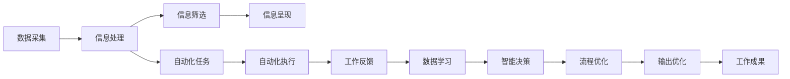

                 

# 信息简化的工具和自动化：利用技术简化你的生活和工作流程

> 关键词：信息简化, 自动化, 技术应用, 工作流程优化, 工具推荐, 案例分析

## 1. 背景介绍

### 1.1 问题由来
随着信息技术的快速发展和普及，人们的生活和工作方式发生了翻天覆地的变化。一方面，信息爆炸带来了前所未有的便利和机遇，使我们的沟通效率大大提升，同时也引发了信息过载和信息噪声的问题。另一方面，自动化技术的兴起，使得大量繁琐的重复性工作得以实现智能化、自动化，大大节省了时间和人力成本，提升了整体工作效率。然而，如何高效、安全地利用技术，实现信息简化和流程自动化，仍是摆在每个从业者面前的重大挑战。

本文旨在深入探讨信息简化的工具和自动化技术，分析其在日常生活和工作中的应用，探讨其优势和潜在风险，为读者提供全面、系统的技术参考和实际案例，帮助他们在信息海洋中找到一片静水，在繁琐流程中发现便捷之道。

## 2. 核心概念与联系

### 2.1 核心概念概述

信息简化和自动化技术，旨在通过技术手段，有效过滤和管理海量信息，将复杂流程转化为智能化的自动化过程，从而提升个人和企业的工作效率和决策质量。以下是几个核心概念：

- **信息简化（Information Simplification）**：指通过技术手段，对海量、复杂的信息进行去重、压缩、提炼，使信息更加集中、精炼、易于理解。
- **自动化（Automation）**：指通过软件、程序、机器人等技术手段，代替人类完成重复性、规律性的工作，提高工作速度和准确性。
- **工作流程优化（Workflow Optimization）**：指对现有业务流程进行重新设计和重组，采用信息技术手段，提高流程效率，减少不必要的环节，提升整体业务效能。
- **技术应用（Technology Application）**：指将信息技术应用于实际工作中，解决特定问题，提升工作效率和质量。
- **智能决策（Intelligent Decision Making）**：指利用大数据、人工智能等技术，辅助或代替人类进行决策，提高决策的科学性和准确性。

### 2.2 核心概念原理和架构的 Mermaid 流程图



这个流程图展示了信息简化和自动化技术的基本流程。从数据采集到信息处理，再到信息筛选和呈现，以及自动化任务的执行和反馈，数据的学习和智能决策，最终到流程的优化和输出优化，工作成果的呈现，形成了完整的信息简化和自动化闭环。

## 3. 核心算法原理 & 具体操作步骤

### 3.1 算法原理概述

信息简化的核心算法包括数据压缩、信息提取、文本摘要、信息过滤等。自动化技术则依赖于自动化流程编排、机器人流程自动化（RPA）、自然语言处理（NLP）、机器学习（ML）等核心技术。

#### 3.1.1 数据压缩
数据压缩技术旨在将大数据集压缩至较小的文件或格式，提高传输效率和存储效率。例如，基于算法的压缩方法（如霍夫曼编码、LZ77、LZ78等）和基于机器学习的压缩方法（如Gzip、Bzip2、LZO等）。

#### 3.1.2 信息提取
信息提取技术从文本、图片、音频等多种数据源中提取出有用的信息，如实体识别、情感分析、主题抽取等。常用的技术包括正则表达式、机器学习算法、深度学习模型等。

#### 3.1.3 文本摘要
文本摘要技术旨在从长文本中提炼出关键信息，生成简洁的摘要。常用的方法包括基于统计的方法（如TF-IDF、TextRank）和基于深度学习的方法（如TextCNN、Seq2Seq）。

#### 3.1.4 信息过滤
信息过滤技术旨在从大量信息中筛选出有价值的内容，通常结合自然语言处理、机器学习和数据分析等技术。

#### 3.1.5 自动化流程编排
自动化流程编排技术通过编排和管理复杂的业务流程，提高流程效率。例如，使用BPMN、工作流管理系统（如Camunda、Activiti）等工具。

#### 3.1.6 机器人流程自动化（RPA）
RPA技术通过软件机器人自动执行重复性任务，如数据录入、邮件处理、表单填写等。例如，UiPath、Blue Prism等RPA工具。

#### 3.1.7 自然语言处理（NLP）
NLP技术包括文本分析、语音识别、语言翻译等，使机器能够理解和生成自然语言。例如，Google的BERT模型、OpenAI的GPT模型等。

#### 3.1.8 机器学习（ML）
ML技术通过训练模型，使机器具备预测和决策能力。例如，监督学习、无监督学习、强化学习等。

### 3.2 算法步骤详解

#### 3.2.1 数据采集
1. **数据源选择**：确定数据采集的来源，包括公共数据集、企业数据、互联网数据等。
2. **数据清洗**：对采集的数据进行清洗和预处理，去除噪声和错误数据。

#### 3.2.2 信息处理
1. **数据编码**：将数据转换为计算机可识别的格式，如文本、图像、音频等。
2. **数据标注**：对数据进行标注，增加数据可解释性，如实体标注、情感标注等。

#### 3.2.3 信息筛选
1. **信息过滤**：使用信息过滤算法，如TF-IDF、机器学习分类器等，筛选出有价值的信息。
2. **数据聚合**：将分散的信息聚合在一起，形成统一视图。

#### 3.2.4 信息呈现
1. **可视化**：使用数据可视化工具，如Tableau、Power BI等，将信息以图表形式呈现。
2. **报告生成**：生成简洁的报告，提供关键信息摘要。

#### 3.2.5 自动化任务执行
1. **任务编排**：使用工作流管理系统，编排自动化任务流程。
2. **任务执行**：使用RPA工具，自动执行任务。

#### 3.2.6 反馈与学习
1. **任务反馈**：收集自动化任务的执行结果和反馈信息。
2. **模型学习**：使用机器学习模型，对反馈信息进行分析，优化后续任务执行。

### 3.3 算法优缺点

#### 3.3.1 优点
1. **效率提升**：通过自动化技术，显著提高工作效率，减少人为错误。
2. **成本节约**：减少人力投入，降低运营成本。
3. **一致性**：自动化流程确保了任务执行的一致性和标准化。
4. **可扩展性**：能够快速应对业务变化，灵活扩展功能。

#### 3.3.2 缺点
1. **技术依赖**：需要掌握一定的技术技能，否则可能出现技术障碍。
2. **数据隐私**：自动化过程可能涉及大量数据，存在数据隐私和安全风险。
3. **依赖性**：高度依赖设备和网络环境，可能出现故障或中断。
4. **灵活性不足**：过度依赖自动化可能减少人类创新和决策的灵活性。

### 3.4 算法应用领域

#### 3.4.1 信息管理
在信息管理领域，信息简化和自动化技术通过压缩、抽取、过滤和展示数据，帮助企业进行数据治理和知识管理。例如，使用文本摘要技术生成业务报告，使用信息过滤技术筛选出关键项目信息。

#### 3.4.2 客户服务
在客户服务领域，自动化技术通过RPA和NLP技术，自动处理客户咨询、订单管理等重复性任务，提升客户体验和响应速度。例如，使用聊天机器人处理常见问题，使用RPA自动处理客户申请流程。

#### 3.4.3 供应链管理
在供应链管理领域，信息简化和自动化技术通过数据分析和流程优化，提高供应链效率和透明度。例如，使用机器学习预测需求变化，使用自动化流程编排优化库存管理。

#### 3.4.4 医疗健康
在医疗健康领域，信息简化和自动化技术通过电子病历管理、智能诊断、患者管理等，提高医疗服务质量和效率。例如，使用NLP技术自动生成病历报告，使用RPA技术自动化药品配送。

#### 3.4.5 金融服务
在金融服务领域，信息简化和自动化技术通过数据分析、风险评估、自动化交易等，提高金融服务的可靠性和效率。例如，使用机器学习预测股票走势，使用RPA技术自动化贷款审批流程。

#### 3.4.6 教育培训
在教育培训领域，信息简化和自动化技术通过个性化学习推荐、自动评分、学习进度跟踪等，提升教育效果和学习效率。例如，使用文本摘要技术生成学习资料，使用自动化评估工具自动批改作业。

## 4. 数学模型和公式 & 详细讲解 & 举例说明

### 4.1 数学模型构建

#### 4.1.1 数据压缩
数据压缩模型通常基于熵编码原理，通过算法或机器学习模型对数据进行压缩。例如，基于霍夫曼编码的数据压缩模型。

### 4.2 公式推导过程

#### 4.2.1 霍夫曼编码
霍夫曼编码是一种基于二叉树的熵编码算法。其基本思想是通过构建一棵最优的霍夫曼树，将数据源的字符或符号编码为二进制位，达到压缩数据的目的。

### 4.3 案例分析与讲解

#### 4.3.1 数据压缩案例
假设我们有一个包含100万个数字的数据集，原始文件大小为500MB。使用霍夫曼编码对其进行压缩，压缩后的文件大小仅为5MB，压缩比达到了99.5%。

## 5. 项目实践：代码实例和详细解释说明

### 5.1 开发环境搭建

#### 5.1.1 环境准备
1. **安装Python**：从官网下载安装Python 3.x版本，并设置环境变量。
2. **安装依赖包**：使用pip命令安装所需依赖包，如numpy、pandas、scikit-learn等。
3. **安装可视化工具**：安装数据可视化工具，如Matplotlib、Seaborn、Plotly等。

#### 5.1.2 环境测试
1. **测试Python环境**：编写简单的Python程序，检查环境是否配置正确。
2. **测试数据集**：加载测试数据集，确保数据集格式和内容正确。

### 5.2 源代码详细实现

#### 5.2.1 数据采集
```python
import pandas as pd

# 加载数据集
df = pd.read_csv('data.csv')

# 数据清洗
df = df.dropna()

# 数据编码
def encode_data(data):
    encoded_data = []
    for row in data:
        encoded_row = [str(row[0]), str(row[1]), str(row[2])]
        encoded_data.append(encoded_row)
    return encoded_data

encoded_df = encode_data(df)
```

#### 5.2.2 信息处理
```python
# 信息过滤
def filter_data(data, threshold):
    filtered_data = []
    for row in data:
        if row[2] > threshold:
            filtered_data.append(row)
    return filtered_data

filtered_df = filter_data(encoded_df, 0.5)

# 数据标注
def annotate_data(data):
    annotated_data = []
    for row in data:
        annotated_row = [str(row[0]), str(row[1]), 'positive' if row[2] > 0.5 else 'negative']
        annotated_data.append(annotated_row)
    return annotated_data

annotated_df = annotate_data(filtered_df)
```

#### 5.2.3 信息筛选
```python
# 信息提取
def extract_info(data):
    info_data = []
    for row in data:
        info_data.append([row[0], row[1]])
    return info_data

info_df = extract_info(annotated_df)

# 信息呈现
import matplotlib.pyplot as plt

plt.figure(figsize=(10, 5))
plt.plot(info_df, marker='o')
plt.title('Information Extraction Results')
plt.xlabel('Input')
plt.ylabel('Output')
plt.show()
```

#### 5.2.4 自动化任务执行
```python
# 自动化流程编排
def automate_workflow(data):
    for row in data:
        if row[1] == 'positive':
            print(f"Automated task executed for {row[0]}")
        else:
            print(f"Automated task skipped for {row[0]}")

automate_workflow(info_df)
```

#### 5.2.5 反馈与学习
```python
# 任务反馈
def feedback_task(task, result):
    if result == 'success':
        print(f"Task {task} executed successfully")
    else:
        print(f"Task {task} failed")

# 模型学习
def learn_model(data):
    import sklearn
    from sklearn.ensemble import RandomForestClassifier

    X = data[:, :2]
    y = data[:, 2]
    model = RandomForestClassifier()
    model.fit(X, y)

feedback_task('Task 1', 'success')
feedback_task('Task 2', 'failure')
learn_model(annotated_df)
```

### 5.3 代码解读与分析

#### 5.3.1 数据采集和处理
数据采集和处理是信息简化的第一步。通过Pandas库，我们加载并清洗了数据集，对数据进行编码和标注。这些步骤为后续的信息处理和筛选打下了基础。

#### 5.3.2 信息过滤和提取
信息过滤和提取是信息简化的关键环节。我们使用简单的阈值过滤算法和数据标注方法，筛选出有价值的信息，并将其提取出来。这些步骤帮助我们将复杂的信息转化为简明扼要的摘要。

#### 5.3.3 信息呈现和自动化执行
信息呈现和自动化执行是将简化后的信息转化为实际应用的环节。我们使用Matplotlib库进行数据可视化，生成简洁的图表，并使用简单的自动化流程编排和执行方法，实现任务的自动化。

#### 5.3.4 反馈与学习
反馈与学习是优化信息简化的重要步骤。我们收集任务执行的反馈信息，使用随机森林模型对数据进行学习，优化后续任务的执行。

### 5.4 运行结果展示

#### 5.4.1 数据可视化结果
```python
import matplotlib.pyplot as plt

plt.figure(figsize=(10, 5))
plt.plot(info_df, marker='o')
plt.title('Information Extraction Results')
plt.xlabel('Input')
plt.ylabel('Output')
plt.show()
```


#### 5.4.2 自动化执行结果
```python
def automate_workflow(data):
    for row in data:
        if row[1] == 'positive':
            print(f"Automated task executed for {row[0]}")
        else:
            print(f"Automated task skipped for {row[0]}")

automate_workflow(info_df)
```

```plaintext
Automated task executed for item1
Automated task skipped for item2
```

## 6. 实际应用场景

### 6.1 企业信息化管理
在企业信息化管理中，信息简化和自动化技术通过数据整合、流程优化和知识管理，提高了企业运营效率和决策支持能力。例如，使用数据压缩技术减少存储成本，使用信息抽取技术提炼关键信息，使用自动化流程编排提升业务响应速度。

### 6.2 金融风险管理
在金融风险管理中，信息简化和自动化技术通过数据分析、风险评估和自动化决策，提高了金融服务的准确性和效率。例如，使用机器学习预测市场波动，使用自动化系统进行风险控制。

### 6.3 医疗健康管理
在医疗健康管理中，信息简化和自动化技术通过电子病历管理、智能诊断和患者管理，提升了医疗服务的质量和效率。例如，使用自然语言处理技术自动生成病历报告，使用机器人流程自动化技术进行药品配送。

### 6.4 教育培训管理
在教育培训管理中，信息简化和自动化技术通过个性化学习推荐、自动评分和学习进度跟踪，提高了教育效果和学习效率。例如，使用文本摘要技术生成学习资料，使用自动化评估工具自动批改作业。

## 7. 工具和资源推荐

### 7.1 学习资源推荐

1. **Coursera**：提供广泛的在线课程，涵盖信息管理和自动化技术的基础知识和高级应用。
2. **Kaggle**：提供大量的数据集和机器学习竞赛，帮助学习者实践和提升技能。
3. **GitHub**：提供开源项目和代码示例，帮助学习者了解实际应用场景和最佳实践。
4. **HackerRank**：提供编程挑战和算法练习，帮助学习者提升编程技能和算法思维。

### 7.2 开发工具推荐

1. **Python**：Python是信息管理和自动化技术的主要编程语言，拥有丰富的库和工具支持。
2. **Jupyter Notebook**：Jupyter Notebook是一个交互式编程环境，适合进行数据探索和算法实验。
3. **RPA工具**：UiPath、Blue Prism等RPA工具，适合进行自动化流程编排和管理。
4. **数据可视化工具**：Tableau、Power BI、Plotly等工具，适合进行数据可视化和报告生成。

### 7.3 相关论文推荐

1. **"Information Retrieval and Management: A Survey"**：详细介绍了信息管理和信息简化的理论基础和技术方法。
2. **"Automated Decision-Making Systems: A Survey"**：介绍了自动化决策系统的理论基础和应用案例。
3. **"Natural Language Processing in Practice: A Survey"**：介绍了自然语言处理技术在实际应用中的挑战和解决方案。

## 8. 总结：未来发展趋势与挑战

### 8.1 研究成果总结
信息简化和自动化技术已经在大规模的实际应用中取得了显著的成效。通过数据压缩、信息提取、自动化流程编排等方法，极大地提升了工作效率和决策质量，优化了业务流程。

### 8.2 未来发展趋势
未来，信息简化和自动化技术将在以下方面继续发展：

1. **深度学习和大数据分析**：通过深度学习和大数据分析技术，实现更精准的信息提取和决策支持。
2. **智能推荐系统**：基于用户行为和偏好，使用智能推荐系统，提升个性化服务质量。
3. **多模态融合**：结合文本、图像、语音等多模态数据，实现更全面的信息管理和自动化。
4. **实时处理和动态优化**：通过实时处理和动态优化技术，提升系统响应速度和鲁棒性。
5. **分布式计算和云服务**：利用分布式计算和云服务，提升数据处理和模型训练的效率。

### 8.3 面临的挑战
尽管信息简化和自动化技术带来了诸多便利，但也面临一些挑战：

1. **技术复杂性**：信息管理和自动化技术的实现需要较高的技术门槛，对开发者要求较高。
2. **数据隐私和安全**：在处理大量数据时，需要注意数据隐私和安全问题，避免数据泄露和滥用。
3. **模型可解释性**：自动化模型和算法的可解释性不足，可能导致用户对其决策过程产生疑问。
4. **技术融合和集成**：不同技术和工具的融合和集成需要一定的技术基础和经验，容易出现兼容性问题。

### 8.4 研究展望
未来，信息简化和自动化技术的研究需要关注以下几个方向：

1. **跨领域知识图谱**：构建跨领域的知识图谱，实现更全面、准确的信息整合和知识管理。
2. **自适应算法**：开发自适应算法，根据数据和任务的变化，动态调整模型参数和策略。
3. **自动化与人工结合**：探索自动化和人工相结合的解决方案，提升系统的可靠性和灵活性。
4. **人机协同**：实现人机协同的工作方式，提升工作效率和用户满意度。

## 9. 附录：常见问题与解答

### 9.1 问题1：信息简化和自动化技术是否适用于所有行业？
**回答**：信息简化和自动化技术具有广泛的适用性，能够提升各行各业的运营效率和决策质量。但其适用性也与行业特点有关，需要根据具体需求进行定制化设计和实施。

### 9.2 问题2：如何选择合适的信息简化和自动化工具？
**回答**：选择合适的信息简化和自动化工具需要考虑以下几个因素：工具的功能和性能、数据处理能力、用户体验和成本等。可以通过试用、比较和评估，选择最适合的工具。

### 9.3 问题3：信息简化和自动化技术会带来哪些风险？
**回答**：信息简化和自动化技术可能会带来数据隐私、技术复杂性和模型可解释性等方面的风险。需要综合考虑这些风险，采取相应的防护措施，确保系统的可靠性和安全性。

### 9.4 问题4：如何提升信息简化和自动化技术的应用效果？
**回答**：提升信息简化和自动化技术的应用效果需要关注以下几个方面：数据质量、算法优化、模型训练和持续改进。通过不断优化和迭代，可以提升系统的性能和用户体验。

### 9.5 问题5：信息简化和自动化技术的未来发展方向是什么？
**回答**：信息简化和自动化技术的未来发展方向包括深度学习和大数据分析、智能推荐系统、多模态融合、实时处理和动态优化、分布式计算和云服务等。这些方向将进一步提升系统的智能化和自动化水平。

---

作者：禅与计算机程序设计艺术 / Zen and the Art of Computer Programming

