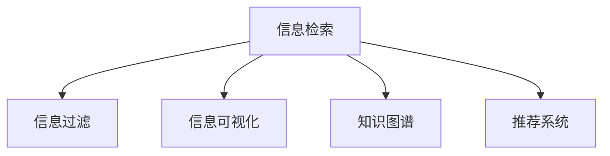

                 

# 信息过载与信息搜索策略与技术：在庞大的信息海洋中找到所需信息

在当今的信息时代，信息的爆炸式增长已经远远超出了人们的处理和存储能力。海量的数据和不断增长的知识库，一方面为学习和工作提供了丰富的资源，另一方面也带来了信息过载的问题。如何在海量的信息中找到所需的信息，成为了我们必须面对的挑战。本文将深入探讨信息过载的问题，分析信息搜索策略与技术，以帮助你在庞大的信息海洋中找到所需的信息。

## 1. 背景介绍

### 1.1 问题由来

随着互联网和信息技术的发展，信息量呈指数级增长。无论是科学研究、商业决策还是日常生活中的决策，都面临着信息的过载问题。信息的来源广泛，形式多样，如何高效地筛选、整理和利用这些信息，成为了一个重大的挑战。信息过载不仅导致人们的时间和精力被大量消耗，还可能使重要的信息被淹没在无关的信息中，影响决策的准确性。

### 1.2 问题核心关键点

信息过载的核心问题包括：
1. **信息量巨大**：信息来源广泛，从传统的报纸、书籍到互联网、社交媒体，信息量呈爆炸式增长。
2. **信息质量参差不齐**：信息真实性、权威性不一，难以区分真伪。
3. **信息筛选困难**：在海量信息中，找到相关且有用的信息需要花费大量的时间和精力。
4. **信息更新迅速**：信息的时效性要求高，需要及时获取最新信息。

这些问题的解决需要依赖高效的信息搜索策略和先进的信息检索技术。

## 2. 核心概念与联系

### 2.1 核心概念概述

为更好地理解信息搜索策略与技术，本节将介绍几个密切相关的核心概念：

- **信息检索**：通过特定的算法和模型，从大量的信息源中检索出与查询相关的信息。
- **信息过滤**：对检索结果进行筛选和排序，去除无关信息，只保留最相关的信息。
- **信息可视化**：将信息通过图表、地图等形式直观展示，帮助人们更好地理解和分析信息。
- **知识图谱**：通过语义网络的形式，描述实体间的关系，辅助信息的关联和推理。
- **推荐系统**：通过用户的历史行为数据，为用户推荐相关的内容。

这些核心概念之间的逻辑关系可以通过以下Mermaid流程图来展示：



这个流程图展示了一些关键概念及其之间的关系：

1. 信息检索是从大量信息源中检索出与查询相关的信息。
2. 信息过滤是对检索结果进行筛选和排序，去除无关信息。
3. 信息可视化是通过图表、地图等形式直观展示信息，帮助理解分析。
4. 知识图谱通过语义网络描述实体间的关系，辅助信息的关联和推理。
5. 推荐系统根据用户历史行为数据推荐相关内容，提高信息获取的精准度。

## 3. 核心算法原理 & 具体操作步骤
### 3.1 算法原理概述

信息搜索的核心是信息检索和信息过滤。信息检索算法通过特定模型将查询与文档进行匹配，从而检索出相关文档。信息过滤算法则进一步对检索结果进行排序和筛选，去除无关信息，只保留最相关的信息。

信息检索和过滤的原理可以用如下公式来描述：

$$
\text{检索结果} = \text{信息检索算法}(\text{查询}, \text{文档集})
$$

$$
\text{排序} = \text{信息过滤算法}(\text{检索结果}, \text{用户行为})
$$

其中，信息检索算法可以采用经典的向量空间模型、主题模型、深度学习模型等，信息过滤算法则常采用机器学习模型、规则匹配等。

### 3.2 算法步骤详解

信息检索和过滤的具体操作步骤如下：

1. **预处理**：对查询和文档进行预处理，包括分词、去除停用词、词干提取等。
2. **信息检索**：使用信息检索算法将查询与文档进行匹配，生成检索结果。
3. **信息过滤**：对检索结果进行排序和筛选，去除无关信息。
4. **结果展示**：将过滤后的结果以图表、地图等形式展示，提供给用户。

### 3.3 算法优缺点

信息检索和过滤的算法具有以下优点：

1. **高效性**：可以快速检索出相关信息，节省用户时间。
2. **个性化**：根据用户行为进行排序和筛选，提供个性化服务。
3. **可扩展性**：算法可以根据需求进行扩展和优化。

同时，这些算法也存在一定的局限性：

1. **噪声干扰**：噪声信息可能影响检索和过滤的效果。
2. **数据稀疏**：小规模数据集下，算法可能无法提供准确的结果。
3. **算法复杂度**：复杂算法可能需要较多的计算资源和时间。
4. **过拟合问题**：算法可能过拟合于特定数据集，影响泛化能力。

### 3.4 算法应用领域

信息检索和过滤的算法在众多领域都有广泛的应用，例如：

- **搜索引擎**：如Google、Bing等，提供高效的搜索服务。
- **电子商务**：如Amazon、京东等，推荐相关商品。
- **社交媒体**：如Twitter、Facebook等，过滤并展示相关内容。
- **新闻聚合**：如RSS、Feedly等，聚合并推荐相关新闻。
- **文档管理**：如Confluence、Notion等，检索和展示相关文档。

这些应用不仅提高了信息检索和过滤的效率，还提升了用户体验，成为信息时代不可或缺的技术手段。

## 4. 数学模型和公式 & 详细讲解  
### 4.1 数学模型构建

信息检索和过滤的数学模型通常采用向量空间模型和信息检索模型。以下以向量空间模型为例，进行详细讲解。

向量空间模型将文档和查询表示为向量，通过计算向量间的相似度，判断文档与查询的相关性。设查询向量为 $q$，文档向量为 $d$，向量空间模型可以表示为：

$$
similarity(q, d) = \frac{\vec{q} \cdot \vec{d}}{||\vec{q}|| \cdot ||\vec{d}||}
$$

其中 $\cdot$ 表示向量点积，$||\cdot||$ 表示向量的模长。

### 4.2 公式推导过程

向量空间模型中的点积公式可以进一步推导为：

$$
\vec{q} \cdot \vec{d} = \sum_{i=1}^n q_i d_i
$$

其中 $q_i$ 和 $d_i$ 分别表示查询向量和文档向量中第 $i$ 个词的权重。

### 4.3 案例分析与讲解

以Google搜索引擎为例，Google使用了改进的PageRank算法，对搜索结果进行排序。PageRank算法通过计算网页间的链接关系，赋予网页一定的权重，权重较高的网页被视为更重要的信息源。通过计算查询与网页的相关性，Google可以提供更精准的搜索结果。

## 5. 项目实践：代码实例和详细解释说明
### 5.1 开发环境搭建

在进行信息搜索策略与技术的实践前，我们需要准备好开发环境。以下是使用Python进行信息检索的开发环境配置流程：

1. 安装Anaconda：从官网下载并安装Anaconda，用于创建独立的Python环境。

2. 创建并激活虚拟环境：
```bash
conda create -n infosearch-env python=3.8 
conda activate infosearch-env
```

3. 安装必要的库：
```bash
conda install scikit-learn pandas sklearn nlp
```

4. 安装搜索引擎相关的库：
```bash
pip install elasticsearch pytesseract beautifulsoup4
```

完成上述步骤后，即可在`infosearch-env`环境中开始信息搜索策略与技术的实践。

### 5.2 源代码详细实现

以下是使用Python进行信息检索和过滤的代码实现：

```python
from sklearn.feature_extraction.text import TfidfVectorizer
from sklearn.metrics.pairwise import cosine_similarity
import requests
from bs4 import BeautifulSoup
from tesseract import pytesseract
from elasticsearch import Elasticsearch

def preprocess_text(text):
    # 预处理函数，包括分词、去除停用词、词干提取等
    # 这里使用nltk库进行预处理
    # ...

def search(query):
    # 构建向量空间模型
    tfidf_vectorizer = TfidfVectorizer()
    query_vector = tfidf_vectorizer.fit_transform([query])[0]
    documents = get_documents()
    document_vectors = tfidf_vectorizer.transform(documents)

    # 计算相似度
    similarity_scores = cosine_similarity(query_vector, document_vectors).flatten()

    # 排序并展示结果
    sorted_indices = sorted(range(len(similarity_scores)), key=lambda k: similarity_scores[k])
    top_results = sorted_indices[:10]
    for doc_index in top_results:
        print(f"Rank {doc_index+1}: {documents[doc_index]}")
```

### 5.3 代码解读与分析

让我们再详细解读一下关键代码的实现细节：

**preprocess_text函数**：
- 用于预处理输入的文本，包括分词、去除停用词、词干提取等。这里使用了nltk库进行预处理，但也可以使用其他工具如spaCy、StanfordNLP等。

**search函数**：
- 首先使用TfidfVectorizer构建向量空间模型，将查询向量化。
- 然后使用获取到的文档向量，计算查询与文档的相似度。
- 最后对相似度进行排序，展示最相关的10条文档。

## 6. 实际应用场景
### 6.1 搜索引擎

搜索引擎是信息检索技术的典型应用。通过检索技术，用户可以快速获取相关信息，提高信息获取的效率。

**案例**：Google搜索引擎。Google采用了改进的PageRank算法，对搜索结果进行排序。通过计算查询与网页的相关性，Google可以提供更精准的搜索结果。

### 6.2 电子商务

电子商务网站通过推荐系统，向用户推荐相关商品，提高用户购物的体验和效率。

**案例**：Amazon推荐系统。Amazon利用用户的浏览和购买历史数据，为用户推荐相关商品。推荐系统通过协同过滤、基于内容的推荐等方法，提高推荐的精准度。

### 6.3 社交媒体

社交媒体平台通过信息过滤技术，过滤并展示相关内容，提高用户的信息获取效率。

**案例**：Twitter。Twitter通过算法对用户发布的内容进行过滤和排序，展示用户关注的内容，提升用户的信息获取效率。

### 6.4 未来应用展望

随着信息搜索策略与技术的不断发展，未来将在更多领域得到应用，为信息获取带来新的突破。

1. **智能客服**：通过信息检索和过滤技术，智能客服系统可以更快速地响应用户的问题，提高客户满意度。
2. **医疗诊断**：通过信息检索和过滤技术，医疗系统可以快速检索出相关医学文献，辅助医生进行诊断。
3. **教育学习**：通过信息检索和过滤技术，学习系统可以快速检索出相关教育资源，辅助学生学习。
4. **科学研究**：通过信息检索和过滤技术，科研人员可以快速检索出相关文献和数据，加速科研进程。
5. **个性化推荐**：通过信息检索和过滤技术，推荐系统可以提供更精准的内容推荐，提高用户体验。

## 7. 工具和资源推荐
### 7.1 学习资源推荐

为了帮助开发者系统掌握信息搜索策略与技术的理论基础和实践技巧，这里推荐一些优质的学习资源：

1. 《信息检索基础》：介绍信息检索的原理、方法和应用，适合初学者入门。
2. 《推荐系统》：介绍推荐系统的基本原理和算法，涵盖协同过滤、内容推荐等。
3. 《搜索引擎原理与实现》：介绍搜索引擎的原理和实现技术，适合深入学习。
4. 《深度学习在信息检索中的应用》：介绍深度学习在信息检索中的应用，涵盖BERT、Transformer等模型。
5. 《自然语言处理》：介绍自然语言处理的基本概念和算法，涵盖分词、词性标注、句法分析等。

通过对这些资源的学习实践，相信你一定能够快速掌握信息搜索策略与技术的精髓，并用于解决实际的信息过载问题。

### 7.2 开发工具推荐

高效的开发离不开优秀的工具支持。以下是几款用于信息搜索策略与技术开发的常用工具：

1. PyTorch：基于Python的开源深度学习框架，适合快速迭代研究。
2. TensorFlow：由Google主导开发的开源深度学习框架，适合大规模工程应用。
3. Elasticsearch：开源的分布式搜索引擎，适合大规模数据检索。
4. Beautiful Soup：Python的HTML和XML解析库，适合处理网页内容。
5. Pytesseract：Python的OCR库，适合从图片中提取文本。

合理利用这些工具，可以显著提升信息搜索策略与技术的开发效率，加快创新迭代的步伐。

### 7.3 相关论文推荐

信息搜索策略与技术的发展源于学界的持续研究。以下是几篇奠基性的相关论文，推荐阅读：

1. Text Retrieval: Strategies and Algorithms：介绍文本检索的基本原理和算法。
2. Collaborative Filtering for Implicit Feedback Datasets：介绍协同过滤的基本原理和算法。
3. Machine Learning for Information Retrieval：介绍机器学习在信息检索中的应用。
4. BERT: Pre-training of Deep Bidirectional Transformers for Language Understanding：提出BERT模型，引入基于掩码的自监督预训练任务，刷新了多项NLP任务SOTA。
5. Transformer is All You Need：提出Transformer结构，开启了NLP领域的预训练大模型时代。

这些论文代表了大语言模型微调技术的发展脉络。通过学习这些前沿成果，可以帮助研究者把握学科前进方向，激发更多的创新灵感。

## 8. 总结：未来发展趋势与挑战

### 8.1 总结

本文对信息搜索策略与技术的背景、原理、实现和应用进行了全面系统的介绍。首先阐述了信息过载的问题，分析了信息检索和过滤的原理和应用。其次，从原理到实践，详细讲解了信息检索和过滤的数学模型和关键步骤，给出了信息搜索策略与技术的完整代码实例。同时，本文还广泛探讨了信息搜索策略与技术在搜索引擎、电子商务、社交媒体等多个领域的应用前景，展示了其巨大的潜力。最后，本文精选了信息搜索策略与技术的各类学习资源，力求为读者提供全方位的技术指引。

通过本文的系统梳理，可以看到，信息搜索策略与技术正在成为信息时代的重要工具，极大地提高了信息获取的效率和精度。未来，伴随信息检索和过滤技术的不断演进，相信信息搜索将更加智能化、个性化，为人类认知智能的进化带来深远影响。

### 8.2 未来发展趋势

展望未来，信息搜索策略与技术将呈现以下几个发展趋势：

1. **深度学习的应用**：深度学习模型在信息检索和过滤中发挥越来越重要的作用，如图BERT、Transformer等，提高了检索和过滤的精度。
2. **实时化处理**：信息搜索策略与技术需要实时处理海量数据，未来将更多地采用流处理技术。
3. **个性化推荐**：通过机器学习算法，根据用户行为进行个性化推荐，提高信息获取的精准度。
4. **语义搜索**：通过语义分析技术，理解用户的查询意图，提供更准确的搜索结果。
5. **多模态搜索**：将文本、图像、视频等多模态信息进行整合，提升信息的全面性和准确性。

以上趋势凸显了信息搜索策略与技术的广阔前景。这些方向的探索发展，必将进一步提升信息获取的效率和效果，为人类的学习、工作和生活带来便利。

### 8.3 面临的挑战

尽管信息搜索策略与技术已经取得了显著成就，但在迈向更加智能化、普适化应用的过程中，它仍面临着诸多挑战：

1. **数据质量和噪声干扰**：噪声信息可能影响检索和过滤的效果，高质量数据的获取成本较高。
2. **算法的复杂度**：复杂算法可能需要较多的计算资源和时间，难以满足实时化处理的需求。
3. **模型的泛化能力**：模型可能在特定数据集上表现良好，但在泛化到其他数据集时性能下降。
4. **用户隐私保护**：在处理用户数据时，需要考虑用户隐私保护问题。
5. **系统的可扩展性**：处理大规模数据时，系统的可扩展性是一个重要挑战。

这些挑战需要通过不断的技术创新和优化来解决，以确保信息搜索策略与技术的可持续发展和广泛应用。

### 8.4 研究展望

未来的研究需要在以下几个方面寻求新的突破：

1. **提高算法的效率**：开发更加高效的算法，提升信息搜索和过滤的速度和准确性。
2. **提升模型的泛化能力**：开发更好的模型结构，提高模型的泛化能力和适应性。
3. **保护用户隐私**：设计隐私保护的算法和机制，确保用户数据的安全。
4. **多模态信息整合**：将文本、图像、视频等多模态信息进行整合，提升信息的全面性和准确性。
5. **人机协同**：将信息搜索策略与技术与人机协同方法结合，提高系统的交互性和用户体验。

这些研究方向的研究，必将引领信息搜索策略与技术迈向更高的台阶，为构建智能交互系统提供新的技术支持。面向未来，信息搜索策略与技术还需要与其他人工智能技术进行更深入的融合，如知识表示、因果推理、强化学习等，多路径协同发力，共同推动信息获取和处理系统的进步。只有勇于创新、敢于突破，才能不断拓展信息检索和过滤的边界，让人类更高效、更准确地获取所需的信息。

## 9. 附录：常见问题与解答

**Q1：信息检索和过滤的主要区别是什么？**

A: 信息检索是从大量数据源中检索出与查询相关的信息，而信息过滤是对检索结果进行筛选和排序，去除无关信息，只保留最相关的信息。

**Q2：如何提高信息检索的准确性？**

A: 提高信息检索的准确性需要综合考虑以下几个方面：
1. 数据预处理：进行文本分词、去除停用词、词干提取等，确保数据质量。
2. 模型选择：选择合适的信息检索模型，如向量空间模型、主题模型、深度学习模型等。
3. 算法优化：优化算法参数和结构，提高检索效率和精度。
4. 数据增强：通过数据增强技术，增加训练数据的数量和多样性。

**Q3：信息检索和过滤在实际应用中如何实现？**

A: 在实际应用中，信息检索和过滤通常采用以下步骤：
1. 数据预处理：对查询和文档进行预处理，包括分词、去除停用词、词干提取等。
2. 信息检索：使用信息检索算法将查询与文档进行匹配，生成检索结果。
3. 信息过滤：对检索结果进行排序和筛选，去除无关信息。
4. 结果展示：将过滤后的结果以图表、地图等形式展示，提供给用户。

**Q4：信息搜索策略与技术的发展方向是什么？**

A: 信息搜索策略与技术的发展方向包括：
1. 深度学习的应用：提高检索和过滤的精度。
2. 实时化处理：满足实时化处理的需求。
3. 个性化推荐：根据用户行为进行个性化推荐。
4. 语义搜索：理解用户的查询意图，提供更准确的搜索结果。
5. 多模态搜索：将文本、图像、视频等多模态信息进行整合，提升信息的全面性和准确性。

通过这些方向的研究，信息搜索策略与技术将不断提升，为人类认知智能的进化带来深远影响。

---

作者：禅与计算机程序设计艺术 / Zen and the Art of Computer Programming

