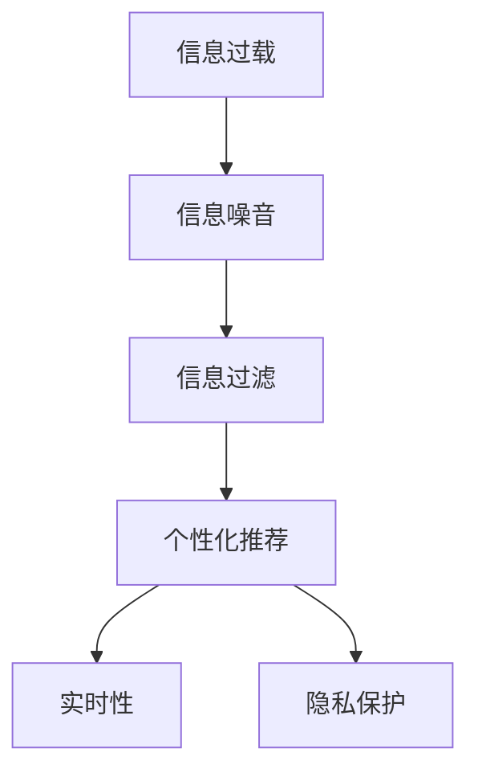

                 

# 信息过载与信息筛选技术：在信息洪流中找到有价值的信息

## 1. 背景介绍

### 1.1 问题由来
随着互联网的迅速普及，人们获取信息变得前所未有的容易。搜索引擎、社交媒体、新闻客户端、在线购物平台等各类信息服务，使得我们无时无刻不处于信息洪流之中。然而，这种便利也带来了新的问题：信息过载（Information Overload）。

信息过载指的是人们面对的海量信息超出了自己处理能力的范畴，导致信息噪音充斥我们的认知空间，难以快速有效获取和利用有价值的信息。这种现象在当今社会已经变得非常普遍，给我们的工作和生活带来了不小的困扰。

### 1.2 问题核心关键点
要解决信息过载的问题，关键在于设计高效的信息筛选技术，以帮助我们在信息洪流中快速准确地找到有价值的信息。核心问题包括以下几个方面：

- 如何在海量的信息中识别出有价值的信息？
- 如何根据不同用户的需求，提供个性化的信息筛选服务？
- 如何保证信息筛选的实时性和准确性？
- 如何保护用户隐私，防止个人信息被滥用？

## 2. 核心概念与联系

### 2.1 核心概念概述

为更好地理解信息筛选技术，我们首先要介绍几个核心概念：

- **信息过载（Information Overload）**：指信息量的迅速增长，超出了个人或系统处理和吸收能力的现象。
- **信息噪音（Information Noise）**：在信息传输和处理过程中，无用的、干扰性的信息，降低信息价值和可读性。
- **信息过滤（Information Filtering）**：根据用户兴趣、行为等特征，对海量信息进行筛选和排序，提高信息的相关性和可用性。
- **个性化推荐（Personalized Recommendation）**：基于用户的历史行为、兴趣和社交关系，为其提供定制化的信息服务。
- **实时性（Real-time）**：信息筛选和推荐需要能够实时响应用户需求，提供最新的信息。
- **隐私保护（Privacy Protection）**：确保用户个人信息的安全，防止信息泄露和滥用。

这些核心概念之间的关系可以通过以下Mermaid流程图来展示：



这个流程图展示了信息过载经过信息噪音后，通过信息过滤和个性化推荐，结合实时性和隐私保护，最终得到满足用户需求的有用信息的过程。

## 3. 核心算法原理 & 具体操作步骤
### 3.1 算法原理概述

信息筛选技术主要基于以下几个算法原理：

1. **协同过滤（Collaborative Filtering）**：通过分析用户历史行为数据，找到用户相似度，从而推荐与用户喜好相似的信息。
2. **内容过滤（Content-Based Filtering）**：基于信息内容特征，与用户兴趣进行匹配，推荐相关内容。
3. **混合过滤（Hybrid Filtering）**：结合协同过滤和内容过滤的优点，综合考虑用户行为和信息内容，提高推荐准确性。
4. **深度学习（Deep Learning）**：通过神经网络模型，从大规模数据中学习用户行为和信息内容之间的关系，实现更加复杂的筛选和推荐。
5. **实时性算法（Real-time Algorithms）**：利用流式处理和分布式计算技术，实现对用户行为的实时分析与推荐。
6. **隐私保护算法（Privacy-Preserving Algorithms）**：使用差分隐私、联邦学习等技术，保护用户数据隐私，同时保留推荐质量。

这些算法相互配合，共同构建了高效的信息筛选技术体系。

### 3.2 算法步骤详解

下面是信息筛选技术的具体操作步骤：

**Step 1: 数据收集与预处理**
- 收集用户行为数据，包括浏览历史、点击记录、评分、评论等。
- 对数据进行清洗、去重、归一化等预处理，确保数据质量和一致性。

**Step 2: 用户建模**
- 使用协同过滤、内容过滤等技术，对用户进行建模，识别出用户的兴趣和偏好。
- 利用深度学习模型，如隐式神经网络、矩阵分解等，从用户行为中提取隐式特征，捕捉用户更深层的需求。

**Step 3: 信息建模**
- 对信息内容进行建模，提取特征向量，如关键词、分类、标签等。
- 使用深度学习模型，如卷积神经网络、循环神经网络等，学习信息内容特征，构建语义空间。

**Step 4: 筛选与推荐**
- 根据用户模型和信息模型，通过协同过滤、内容过滤、混合过滤等算法进行信息筛选。
- 利用深度学习模型，如自注意力机制、双向LSTM等，对信息进行综合排序和推荐。

**Step 5: 实时处理与隐私保护**
- 利用流式处理和分布式计算技术，实现对用户行为的实时分析与推荐。
- 使用差分隐私、联邦学习等技术，保护用户数据隐私，同时保留推荐质量。

### 3.3 算法优缺点

信息筛选技术具有以下优点：
1. 个性化：能够根据不同用户的需求，提供定制化的信息服务。
2. 实时性：能够实时响应用户需求，提供最新的信息。
3. 高效性：通过协同过滤、深度学习等技术，能够高效处理海量数据。

同时，也存在以下局限：
1. 数据隐私：需要收集和处理大量的用户数据，存在隐私泄露的风险。
2. 模型复杂：深度学习模型参数量大，训练和推理成本较高。
3. 模型偏见：推荐算法可能存在数据偏见，导致推荐结果不公平或失真。
4. 适用性：不是所有领域和任务都适合使用信息筛选技术，需要根据具体情况进行优化。

## 4. 数学模型和公式 & 详细讲解

### 4.1 数学模型构建

我们以协同过滤（Collaborative Filtering）为例，建立数学模型。

假设用户集合为 $U=\{u_1, u_2, ..., u_n\}$，物品集合为 $I=\{i_1, i_2, ..., i_m\}$。用户 $u$ 对物品 $i$ 的评分记为 $R_{ui}$。

协同过滤的目标是预测用户对未评分物品的评分，使用用户-物品相似度矩阵 $P_{ij}$ 来描述用户 $u$ 与物品 $i$ 的相似度。

协同过滤常用的数学模型包括：
- 基于用户（User-Based）的协同过滤
- 基于物品（Item-Based）的协同过滤
- 矩阵分解（Matrix Factorization）

### 4.2 公式推导过程

以基于用户的协同过滤为例，假设用户 $u$ 对物品 $i$ 的预测评分为 $\hat{R}_{ui}$，则可以使用以下公式：

$$
\hat{R}_{ui} = \sum_{v \in N(u)}\alpha_v R_{vi} P_{vi,i}
$$

其中 $N(u)$ 表示与用户 $u$ 相邻的 $k$ 个用户，$\alpha_v$ 为调整系数，$P_{vi,i}$ 为物品 $i$ 在用户 $v$ 与物品 $i$ 之间的相似度。

在实际应用中，常用矩阵分解的方法来求解 $P_{ij}$，即：

$$
P_{ij} = u_i v_j^T
$$

其中 $u_i$ 和 $v_j$ 分别为用户和物品的低维表示向量。

### 4.3 案例分析与讲解

以Netflix推荐系统为例，其使用基于矩阵分解的协同过滤算法，对用户进行建模，学习用户与物品之间的隐式关联。具体步骤如下：

1. 收集用户行为数据，包括观看历史、评分、播放记录等。
2. 对数据进行预处理，去除噪音和异常值。
3. 对用户和物品分别进行矩阵分解，得到低维表示向量 $u_i$ 和 $v_j$。
4. 利用公式计算用户对物品的预测评分，并进行排序推荐。

## 5. 项目实践：代码实例和详细解释说明
### 5.1 开发环境搭建

在进行信息筛选技术开发前，我们需要准备好开发环境。以下是使用Python进行TensorFlow开发的环境配置流程：

1. 安装Anaconda：从官网下载并安装Anaconda，用于创建独立的Python环境。

2. 创建并激活虚拟环境：
```bash
conda create -n tensorflow-env python=3.8 
conda activate tensorflow-env
```

3. 安装TensorFlow：根据CUDA版本，从官网获取对应的安装命令。例如：
```bash
conda install tensorflow-gpu -c conda-forge
```

4. 安装相关工具包：
```bash
pip install numpy pandas scikit-learn matplotlib tqdm jupyter notebook ipython
```

完成上述步骤后，即可在`tensorflow-env`环境中开始信息筛选技术的开发实践。

### 5.2 源代码详细实现

我们以Netflix推荐系统为例，给出TensorFlow代码实现。

首先，定义协同过滤模型的输入输出数据格式：

```python
import tensorflow as tf
from tensorflow.keras.layers import Input, Embedding, DotProduct, Dense

user_input = Input(shape=(1,), dtype='int32', name='user_input')
item_input = Input(shape=(1,), dtype='int32', name='item_input')

user_embedding = Embedding(input_dim=num_users, output_dim=10, name='user_embedding')(user_input)
item_embedding = Embedding(input_dim=num_items, output_dim=10, name='item_embedding')(item_input)

# 用户和物品向量之间的点积
dot_product = DotProduct(name='dot_product')([user_embedding, item_embedding])

# 加权求和
weighted_sum = Dense(units=num_items, activation='softmax')(dot_product)

model = tf.keras.Model(inputs=[user_input, item_input], outputs=[weighted_sum])
```

接着，定义模型训练过程：

```python
from tensorflow.keras.optimizers import Adam
from tensorflow.keras.losses import MeanSquaredError
from tensorflow.keras.metrics import RootMeanSquaredError

num_epochs = 10
batch_size = 128

model.compile(optimizer=Adam(), loss=MeanSquaredError(), metrics=[RootMeanSquaredError()])

# 训练数据
train_dataset = tf.data.Dataset.from_tensor_slices((train_user_ids, train_item_ids, train_ratings)).batch(batch_size)

# 验证数据
valid_dataset = tf.data.Dataset.from_tensor_slices((valid_user_ids, valid_item_ids, valid_ratings)).batch(batch_size)

model.fit(train_dataset, epochs=num_epochs, validation_data=valid_dataset)
```

最后，评估模型效果：

```python
from sklearn.metrics import mean_absolute_error, mean_squared_error

# 测试数据
test_dataset = tf.data.Dataset.from_tensor_slices((test_user_ids, test_item_ids, test_ratings)).batch(batch_size)

# 评估指标
test_predictions = model.predict(test_dataset)
test_rmsle = mean_squared_error(test_predictions, test_ratings, squared=False)
print(f'Test RMSE: {test_rmsle:.3f}')
```

以上就是使用TensorFlow对Netflix推荐系统进行信息筛选的完整代码实现。可以看到，TensorFlow提供了简单易用的API，使得协同过滤模型的实现变得非常直观和高效。

### 5.3 代码解读与分析

让我们再详细解读一下关键代码的实现细节：

**定义输入层和嵌入层**：
- 使用`Input`层定义用户和物品的输入，指定维度为1。
- 使用`Embedding`层将用户和物品输入映射到低维空间，得到用户和物品的嵌入向量。

**计算点积和加权求和**：
- 使用`DotProduct`层计算用户和物品向量之间的点积。
- 使用`Dense`层对点积结果进行加权求和，得到最终的推荐评分。

**模型编译与训练**：
- 使用`compile`方法定义模型的优化器、损失函数和评估指标。
- 使用`fit`方法对训练集进行迭代训练，设置训练轮数和批次大小。
- 使用`evaluate`方法在验证集上评估模型的预测效果。

**评估指标计算**：
- 使用`mean_absolute_error`和`mean_squared_error`计算模型预测与真实评分之间的均方根误差。

可以看到，TensorFlow通过简单明了的API，使得协同过滤模型的实现变得非常直观和高效。开发者只需关注核心算法，即可快速实现信息筛选技术。

## 6. 实际应用场景
### 6.1 智能推荐系统

基于信息筛选技术的智能推荐系统，已经广泛应用于电商、新闻、视频、音乐等领域，为用户提供了个性化的推荐服务。

在电商领域，通过分析用户浏览历史和购买行为，推荐其可能感兴趣的商品，提升用户购物体验和满意度。例如，亚马逊的推荐系统利用协同过滤算法，为用户推荐相关商品，显著提高了转化率和销售额。

在新闻领域，根据用户阅读历史和互动行为，推荐其感兴趣的新闻内容，帮助用户发现最新、最相关的新闻资讯。例如，今日头条使用协同过滤和内容过滤相结合的方式，为用户推荐新闻文章，实现了内容精准推荐。

在视频和音乐领域，基于用户的观看历史和听歌行为，推荐其感兴趣的视频和歌曲，提升用户体验。例如，Netflix和Spotify利用协同过滤和内容过滤算法，为用户推荐个性化视频和音乐，增强了平台的黏性。

### 6.2 社交媒体内容推荐

社交媒体平台利用信息筛选技术，为用户推荐有价值的内容，增加用户粘性，提升平台活跃度。

例如，Facebook利用协同过滤算法，为用户推荐好友动态和兴趣标签，增加用户互动和参与。Instagram通过分析用户的浏览和点赞行为，推荐其感兴趣的内容，提升用户内容消费和分享。

### 6.3 广告推荐系统

广告推荐系统利用信息筛选技术，帮助广告主精准投放广告，提升广告效果和ROI。

例如，谷歌利用协同过滤和内容过滤算法，为用户推荐其感兴趣的商品广告，提高了广告点击率和转化率。百度通过分析用户搜索行为，推荐与其兴趣相关的广告，实现了广告的精准投放。

### 6.4 未来应用展望

随着信息筛选技术的不断进步，未来将在更多领域得到应用，为人类生活和工作带来深刻变革。

在智慧城市治理中，利用信息筛选技术，分析城市数据，提供智慧决策支持，提高城市管理效率和质量。例如，智慧交通系统通过分析用户出行数据，推荐最优路线，减少交通拥堵，提升出行效率。

在医疗领域，通过分析患者历史病历和就诊记录，推荐个性化治疗方案，提升诊疗效果和患者满意度。例如，IBM Watson利用深度学习算法，为患者推荐最适合的治疗方案，提高了医疗质量和效率。

在教育领域，通过分析学生的学习行为和成绩，推荐个性化学习内容和资源，提升教学效果和学生学习体验。例如，Knewton通过分析学生的学习数据，推荐最合适的学习内容，提高了学习效果和学生成绩。

总之，信息筛选技术将在更多领域得到应用，为人类社会带来更深远的变革和影响。未来，随着算力和技术的不断提升，信息筛选技术将变得更加高效和智能，能够更好地满足用户需求，提高生活和工作质量。

## 7. 工具和资源推荐
### 7.1 学习资源推荐

为了帮助开发者系统掌握信息筛选技术，这里推荐一些优质的学习资源：

1. 《Python机器学习》书籍：由斯坦福大学教授编写，全面介绍了机器学习算法和工具，包括协同过滤、深度学习等。

2. 《深度学习框架TensorFlow实战》书籍：由TensorFlow官方编写，详细介绍了TensorFlow的API和实战案例，适合动手实践。

3. 《推荐系统实战》书籍：由亚马逊资深工程师编写，介绍了推荐系统的实现方法和应用场景，适合深入理解推荐技术。

4. 《信息检索与推荐系统》课程：由北京大学开设的在线课程，介绍了信息检索和推荐系统的基本概念和算法。

5. Kaggle平台：数据科学竞赛平台，提供海量数据集和实战项目，适合练习和提升信息筛选技术的实践能力。

通过对这些资源的学习实践，相信你一定能够系统掌握信息筛选技术的精髓，并用于解决实际的推荐问题。

### 7.2 开发工具推荐

高效的开发离不开优秀的工具支持。以下是几款用于信息筛选技术开发的常用工具：

1. TensorFlow：由Google主导开发的开源深度学习框架，生产部署方便，适合大规模工程应用。

2. PyTorch：基于Python的开源深度学习框架，灵活动态的计算图，适合快速迭代研究。

3. Apache Spark：大数据处理框架，支持分布式计算，适合处理大规模数据。

4. Elasticsearch：分布式搜索和分析引擎，适合高效检索和分析大规模文本数据。

5. Redis：高并发、高性能的内存数据库，适合实时推荐和缓存。

6. Kibana：Elasticsearch的可视化界面，方便数据分析和可视化展示。

合理利用这些工具，可以显著提升信息筛选技术的开发效率，加快创新迭代的步伐。

### 7.3 相关论文推荐

信息筛选技术的发展源于学界的持续研究。以下是几篇奠基性的相关论文，推荐阅读：

1. "Collaborative Filtering for Recommendation"：由Adams等人提出，介绍了协同过滤算法的理论基础和实现方法。

2. "Item-Based Collaborative Filtering Recommendation Algorithms"：由Herlocker等人提出，详细介绍了基于物品的协同过滤算法。

3. "Matrix Factorization Techniques for Recommender Systems"：由Carselli等人提出，介绍了矩阵分解方法在推荐系统中的应用。

4. "Deep Recommendation Algorithms with Explicit Supervision"：由Bengio等人提出，介绍了深度学习在推荐系统中的应用。

5. "A Non-Negative Matrix Factorization Approach to Collaborative Filtering"：由Hofmann等人提出，介绍了非负矩阵分解在推荐系统中的应用。

这些论文代表了大语言模型微调技术的发展脉络。通过学习这些前沿成果，可以帮助研究者把握学科前进方向，激发更多的创新灵感。

## 8. 总结：未来发展趋势与挑战
### 8.1 总结

本文对信息筛选技术的核心算法和操作步骤进行了全面系统的介绍。首先阐述了信息过载和信息筛选技术的研究背景和意义，明确了信息筛选在推荐系统中的应用价值。其次，从原理到实践，详细讲解了协同过滤、深度学习等核心算法，给出了信息筛选任务开发的完整代码实例。同时，本文还广泛探讨了信息筛选技术在电商、社交媒体、广告等领域的应用前景，展示了信息筛选技术的巨大潜力。此外，本文精选了信息筛选技术的各类学习资源，力求为读者提供全方位的技术指引。

通过本文的系统梳理，可以看到，信息筛选技术在推荐系统中的应用，已经从简单的协同过滤，拓展到深度学习、混合过滤等多种算法。未来，随着深度学习等技术的不断进步，信息筛选技术将变得更加高效和智能，能够更好地满足用户需求，提升推荐效果。

### 8.2 未来发展趋势

展望未来，信息筛选技术将呈现以下几个发展趋势：

1. 算法多样化。除了协同过滤和深度学习，未来还将涌现更多基于图模型、知识图谱等技术的信息筛选算法，提高推荐准确性和效果。

2. 跨领域融合。信息筛选技术将与自然语言处理、计算机视觉、语音识别等多领域技术进行融合，实现跨领域推荐，提升推荐系统的泛化性和适用性。

3. 实时性提升。利用流式处理和分布式计算技术，实现对用户行为的实时分析与推荐，满足用户对实时性的需求。

4. 隐私保护强化。采用差分隐私、联邦学习等技术，保护用户数据隐私，同时保留推荐质量。

5. 个性化推荐深化。结合用户行为数据和先验知识，进行个性化推荐，提高推荐的针对性和多样性。

6. 商品推荐商品化。在推荐系统中，将推荐系统本身作为一种商品进行推荐，使用户发现和体验更多的推荐系统，提升用户满意度。

以上趋势凸显了信息筛选技术的广阔前景。这些方向的探索发展，必将进一步提升推荐系统的性能和应用范围，为人类生活和工作带来更深远的变革和影响。

### 8.3 面临的挑战

尽管信息筛选技术已经取得了瞩目成就，但在迈向更加智能化、普适化应用的过程中，它仍面临着诸多挑战：

1. 数据隐私。需要收集和处理大量的用户数据，存在隐私泄露的风险。如何保护用户数据隐私，防止信息滥用，将是重要的研究方向。

2. 模型复杂。深度学习模型参数量大，训练和推理成本较高。如何在保证性能的同时，减小模型规模，提升计算效率，将是重要的优化方向。

3. 模型偏见。推荐算法可能存在数据偏见，导致推荐结果不公平或失真。如何消除模型偏见，提升推荐公平性，将是重要的研究方向。

4. 适用性。信息筛选技术不是所有领域和任务都适用，需要根据具体情况进行优化。如何在不同领域和任务中推广应用，将是重要的研究方向。

5. 鲁棒性。信息筛选系统面对数据波动、网络攻击等不稳定因素时，容易出现性能下降，如何提高系统的鲁棒性，将是重要的研究方向。

6. 安全性。信息筛选系统需要抵御恶意攻击，防止系统被恶意篡改或攻击，如何提高系统的安全性，将是重要的研究方向。

7. 实时性。信息筛选系统需要能够实时响应用户需求，如何提高系统的实时性，将是重要的研究方向。

8. 可解释性。信息筛选系统需要可解释性强，能够帮助用户理解推荐结果的依据，如何提高系统的可解释性，将是重要的研究方向。

9. 个性化推荐。信息筛选系统需要能够提供个性化推荐，如何提高系统的个性化推荐能力，将是重要的研究方向。

10. 商品推荐。信息筛选系统需要能够推荐推荐系统本身，如何提高系统的商品推荐能力，将是重要的研究方向。

这些挑战需要我们在实践中不断探索和解决，才能将信息筛选技术推向更高的台阶，为推荐系统提供更加智能、高效、安全的服务。

### 8.4 研究展望

面对信息筛选技术面临的种种挑战，未来的研究需要在以下几个方面寻求新的突破：

1. 探索无监督和半监督信息筛选方法。摆脱对大规模标注数据的依赖，利用自监督学习、主动学习等无监督和半监督范式，最大限度利用非结构化数据，实现更加灵活高效的信息筛选。

2. 研究参数高效和计算高效的信息筛选范式。开发更加参数高效的深度学习模型，在固定大部分参数的情况下，只更新极少量的任务相关参数。同时优化信息筛选模型的计算图，减少前向传播和反向传播的资源消耗，实现更加轻量级、实时性的部署。

3. 引入更多先验知识。将符号化的先验知识，如知识图谱、逻辑规则等，与神经网络模型进行巧妙融合，引导信息筛选过程学习更准确、合理的语言模型。同时加强不同模态数据的整合，实现视觉、语音等多模态信息与文本信息的协同建模。

4. 结合因果分析和博弈论工具。将因果分析方法引入信息筛选模型，识别出模型决策的关键特征，增强输出解释的因果性和逻辑性。借助博弈论工具刻画人机交互过程，主动探索并规避模型的脆弱点，提高系统稳定性。

5. 纳入伦理道德约束。在信息筛选的目标中引入伦理导向的评估指标，过滤和惩罚有偏见、有害的输出倾向。同时加强人工干预和审核，建立信息筛选模型的监管机制，确保输出的公平性和合法性。

这些研究方向的探索，必将引领信息筛选技术迈向更高的台阶，为推荐系统提供更加智能、高效、安全的服务。面向未来，信息筛选技术还需要与其他人工智能技术进行更深入的融合，如知识表示、因果推理、强化学习等，多路径协同发力，共同推动推荐系统的进步。只有勇于创新、敢于突破，才能不断拓展推荐系统的边界，让信息筛选技术更好地服务于人类社会。

## 9. 附录：常见问题与解答

**Q1：信息筛选技术是否适用于所有推荐场景？**

A: 信息筛选技术在大多数推荐场景上都能取得不错的效果，特别是对于数据量较大的推荐任务。但对于一些特定领域，如医疗、金融等，需要更多的先验知识和领域专家的参与，才能获得更好的推荐效果。

**Q2：如何缓解信息筛选中的过拟合问题？**

A: 过拟合是信息筛选面临的主要挑战，尤其是在标注数据较少的情况下。常见的缓解策略包括：
1. 数据增强：通过回译、近义替换等方式扩充训练集
2. 正则化：使用L2正则、Dropout、Early Stopping等防止过拟合
3. 对抗训练：引入对抗样本，提高模型鲁棒性
4. 参数高效筛选：只调整少量参数，减小过拟合风险
5. 多模型集成：训练多个筛选模型，取平均输出，抑制过拟合

这些策略往往需要根据具体场景进行灵活组合。只有在数据、模型、训练、推荐等各环节进行全面优化，才能最大限度地发挥信息筛选技术的威力。

**Q3：信息筛选技术在落地部署时需要注意哪些问题？**

A: 将信息筛选技术转化为实际应用，还需要考虑以下因素：
1. 模型裁剪：去除不必要的层和参数，减小模型尺寸，加快推理速度
2. 量化加速：将浮点模型转为定点模型，压缩存储空间，提高计算效率
3. 服务化封装：将模型封装为标准化服务接口，便于集成调用
4. 弹性伸缩：根据请求流量动态调整资源配置，平衡服务质量和成本
5. 监控告警：实时采集系统指标，设置异常告警阈值，确保服务稳定性
6. 安全防护：采用访问鉴权、数据脱敏等措施，保障数据和模型安全

信息筛选技术需要开发者根据具体任务，不断迭代和优化模型、数据和算法，方能得到理想的效果。

**Q4：信息筛选技术如何在不同领域和任务中推广应用？**

A: 信息筛选技术在不同领域和任务中的应用推广，需要结合领域特性进行优化：
1. 电商推荐：结合用户浏览历史、购买行为、社交关系等多维数据，进行个性化推荐。
2. 新闻推荐：分析用户阅读历史、互动行为、兴趣标签等数据，推荐相关新闻内容。
3. 视频推荐：利用用户观看历史、评分、社交关系等数据，推荐相关视频内容。
4. 广告推荐：结合用户搜索历史、浏览行为、社交关系等数据，进行精准广告投放。

在每个领域中，需要结合具体任务，选择合适的方法和算法，同时进行充分的数据清洗和预处理，才能取得较好的推荐效果。

---

作者：禅与计算机程序设计艺术 / Zen and the Art of Computer Programming

