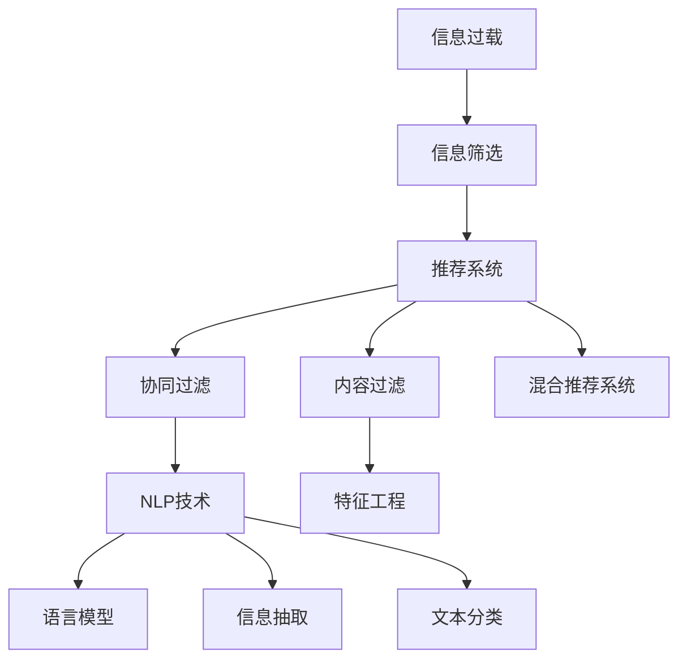

                 

# 信息过载与信息筛选技术：在信息洪流中找到有价值的信息

## 1. 背景介绍

### 1.1 问题由来
随着互联网和数字化技术的发展，信息获取变得前所未有的便捷。但与此同时，信息爆炸带来的问题也日益凸显。用户面对海量信息，难以从中筛选出真正有价值的内容，导致信息过载和决策困难。这一问题不仅影响个人的生活，也成为企业在信息管理和决策分析中的一大挑战。

### 1.2 问题核心关键点
信息筛选技术旨在帮助用户从庞大的数据集合中快速找到相关信息，从而减轻信息过载带来的负担。它的核心在于算法模型的设计，以及用户需求的深度理解。具体而言，可以分为以下几个方面：

- **算法模型的选择**：从简单的统计分析、文本匹配，到复杂的机器学习、深度学习模型。
- **用户需求的识别**：基于用户的查询历史、行为数据，构建用户画像，实现个性化信息推荐。
- **数据源的多样化**：不仅限于单一的文本数据，还包括图片、视频、音频等多模态数据，以丰富信息筛选结果。
- **模型的可解释性**：确保模型输出的可信度和可解释性，提升用户对筛选结果的信任感。

### 1.3 问题研究意义
开发高效的信息筛选技术，对于提升用户体验、降低信息过载压力、优化决策过程具有重要意义：

- **提升用户满意度**：帮助用户快速找到所需信息，提高工作效率和生活质量。
- **优化决策过程**：为决策者提供精准的辅助信息，减少决策偏差和风险。
- **降低信息获取成本**：避免因盲目浏览大量信息而浪费时间和资源。
- **推动技术创新**：信息筛选技术的发展，促进了自然语言处理、机器学习等前沿技术的应用和进步。

## 2. 核心概念与联系

### 2.1 核心概念概述

为更好地理解信息筛选技术的原理和架构，本节将介绍几个核心概念：

- **信息过载(Information Overload)**：指用户面对的海量信息远远超出了其处理能力，导致注意力分散、决策困难的问题。
- **信息筛选(Information Filtering)**：通过算法技术，从信息洪流中挑选出用户感兴趣或相关的信息，减轻用户的信息负担。
- **推荐系统(Recommender System)**：基于用户行为和偏好，向用户推荐可能感兴趣的内容。推荐系统是信息筛选的重要实现形式。
- **自然语言处理(Natural Language Processing, NLP)**：涉及语言模型、信息抽取、文本分类等技术，是信息筛选中的关键环节。
- **协同过滤(Collaborative Filtering)**：利用用户之间的相似性，推荐相似用户喜欢的内容。
- **内容过滤(Content-Based Filtering)**：基于内容的特征，推荐与用户兴趣相似的内容。
- **混合推荐系统(Hybrid Recommender System)**：结合协同过滤和内容过滤，提供更精准的信息推荐。

这些概念之间的逻辑关系可以通过以下Mermaid流程图来展示：



这个流程图展示了几大核心概念之间的关联：

1. 信息过载引发对信息筛选的需求。
2. 推荐系统是信息筛选的重要手段。
3. 协同过滤和内容过滤是推荐系统的主要技术。
4. 自然语言处理技术，包括语言模型、信息抽取、文本分类等，是实现信息筛选和推荐的基础。

## 3. 核心算法原理 & 具体操作步骤

### 3.1 算法原理概述

信息筛选技术通常基于机器学习或深度学习模型，通过训练数据集来预测用户对不同信息的兴趣程度。其核心在于用户兴趣建模和信息匹配两个步骤：

- **用户兴趣建模**：通过对用户的历史行为数据（如浏览记录、点击行为、搜索查询等）进行建模，捕捉用户偏好。
- **信息匹配**：基于用户兴趣模型，计算每条信息与用户兴趣的匹配度，从而筛选出相关性高的信息。

形式化地，假设用户的历史行为数据为 $X=\{x_1, x_2, ..., x_N\}$，其中 $x_i$ 为第 $i$ 个行为数据， $y_i$ 为对应的标签（0或1，表示用户是否对该信息感兴趣）。信息筛选的目标是找到最优模型 $f(X) \rightarrow \{0, 1\}$，使其在测试集上具有较高的预测准确率。

### 3.2 算法步骤详解

基于机器学习的信息筛选算法一般包括以下几个关键步骤：

**Step 1: 数据准备与预处理**
- 收集用户行为数据，包括浏览记录、点击行为、搜索查询等。
- 对数据进行清洗和标注，移除噪声和不相关样本。
- 对文本数据进行分词、向量化等预处理。

**Step 2: 用户兴趣建模**
- 选择合适的特征表示方法，如TF-IDF、Word2Vec等。
- 设计用户兴趣模型，如线性回归、逻辑回归、SVM等，或深度学习模型，如CNN、RNN、Transformer等。
- 训练用户兴趣模型，通过交叉验证优化超参数。

**Step 3: 信息匹配与筛选**
- 基于用户兴趣模型，计算每条信息与用户兴趣的匹配度，使用匹配度函数（如余弦相似度、点积等）计算。
- 根据匹配度对信息进行排序，选择前k条作为推荐结果。
- 使用在线学习算法不断更新用户兴趣模型，提升筛选精度。

**Step 4: 系统部署与评估**
- 将训练好的模型部署到推荐系统中。
- 使用A/B测试等方法评估模型效果，对比基线模型的表现。
- 持续收集用户反馈和行为数据，不断迭代优化模型。

### 3.3 算法优缺点

基于机器学习的信息筛选技术具有以下优点：
1. 能够处理大量数据，实现个性化推荐。
2. 能够动态更新模型，适应用户兴趣的变化。
3. 可以处理多种数据类型，包括文本、图片、视频等。
4. 能够进行多目标优化，满足用户多样化的需求。

但同时，这些方法也存在一些局限：
1. 数据依赖性强。需要大量的标注数据和行为数据，获取成本高。
2. 对数据质量要求高。数据噪声和不相关样本会影响模型性能。
3. 模型复杂度高。深度学习模型计算量大，训练时间长。
4. 可解释性差。黑盒模型难以解释其决策过程。
5. 容易过拟合。特别是在数据量较小的情况下。

尽管存在这些局限，基于机器学习的推荐系统仍是大数据时代信息筛选的主要范式。未来相关研究的重点在于如何进一步降低对标注数据的依赖，提高模型的泛化能力，同时兼顾可解释性和伦理安全性等因素。

### 3.4 算法应用领域

基于机器学习的信息筛选技术，在多个领域得到了广泛的应用，如：

- **电商推荐系统**：对用户的浏览记录和购买行为进行分析，推荐相关商品。
- **新闻阅读系统**：基于用户的历史阅读数据，推荐可能感兴趣的新闻文章。
- **视频观看系统**：通过用户观看历史和评分，推荐相似的视频内容。
- **社交媒体平台**：分析用户互动行为，推荐朋友和帖子。
- **个性化教育系统**：根据学生的学习记录，推荐个性化学习内容和资源。

除了上述这些经典应用外，信息筛选技术还被创新性地应用到更多场景中，如智能医疗、智能家居、智慧城市等，为各个行业的智能化转型提供了新的技术路径。

## 4. 数学模型和公式 & 详细讲解 & 举例说明

### 4.1 数学模型构建

本节将使用数学语言对基于机器学习的信息筛选过程进行更加严格的刻画。

记用户行为数据为 $X=\{x_1, x_2, ..., x_N\}$，其中 $x_i$ 为第 $i$ 个行为数据， $y_i$ 为对应的标签（0或1）。设用户兴趣模型为 $f(X)$，则信息筛选的目标是最大化预测准确率：

$$
\max_{f} \frac{1}{N}\sum_{i=1}^{N} \mathbb{I}[f(x_i) = y_i]
$$

其中 $\mathbb{I}$ 为示性函数，表示模型预测与实际标签是否一致。

### 4.2 公式推导过程

以逻辑回归模型为例，推导其目标函数和梯度计算公式。

假设用户兴趣模型为逻辑回归模型，其输出为 $\hat{y} = f(X) = \sigma(W^T X + b)$，其中 $\sigma$ 为sigmoid函数，$W$ 和 $b$ 为模型参数。则信息筛选的目标函数为：

$$
L(W, b) = -\frac{1}{N} \sum_{i=1}^{N} [y_i \log \hat{y_i} + (1-y_i) \log(1-\hat{y_i})]
$$

将目标函数对 $W$ 和 $b$ 求导，得到：

$$
\frac{\partial L}{\partial W} = -\frac{1}{N} \sum_{i=1}^{N} (y_i - \hat{y_i}) x_i
$$

$$
\frac{\partial L}{\partial b} = -\frac{1}{N} \sum_{i=1}^{N} (y_i - \hat{y_i})
$$

使用随机梯度下降等优化算法更新模型参数。通过反复迭代，不断优化模型参数 $W$ 和 $b$，使得信息筛选模型能够更准确地预测用户对信息的兴趣。

### 4.3 案例分析与讲解

考虑一个简单的电商推荐系统，对用户的浏览记录进行建模，推荐可能感兴趣的商品。

- **数据准备**：收集用户的浏览记录 $X=\{x_1, x_2, ..., x_N\}$，其中 $x_i$ 包含浏览的商品ID和浏览时间等信息。
- **用户兴趣建模**：使用逻辑回归模型对用户行为数据进行建模，得到用户兴趣模型 $f(X)$。
- **信息匹配与筛选**：计算每条商品ID $x_i$ 与用户兴趣的匹配度 $\hat{y_i} = f(x_i)$，选择匹配度高的商品ID作为推荐结果。
- **模型评估**：使用A/B测试等方法评估推荐效果，对比基线模型的表现。

## 5. 项目实践：代码实例和详细解释说明

### 5.1 开发环境搭建

在进行信息筛选实践前，我们需要准备好开发环境。以下是使用Python进行TensorFlow开发的环境配置流程：

1. 安装Anaconda：从官网下载并安装Anaconda，用于创建独立的Python环境。

2. 创建并激活虚拟环境：
```bash
conda create -n tf-env python=3.8 
conda activate tf-env
```

3. 安装TensorFlow：根据CUDA版本，从官网获取对应的安装命令。例如：
```bash
conda install tensorflow -c pytorch -c conda-forge
```

4. 安装Keras：Keras是TensorFlow的高层API，方便快速实现机器学习模型。
```bash
pip install keras
```

5. 安装各类工具包：
```bash
pip install numpy pandas scikit-learn matplotlib tqdm jupyter notebook ipython
```

完成上述步骤后，即可在`tf-env`环境中开始信息筛选实践。

### 5.2 源代码详细实现

这里我们以电商推荐系统为例，给出使用TensorFlow对用户兴趣进行建模的代码实现。

首先，定义数据处理函数：

```python
import numpy as np
from sklearn.preprocessing import StandardScaler

class Dataset:
    def __init__(self, train_data, test_data):
        self.train_data = train_data
        self.test_data = test_data
        
    def preprocess(self):
        train_x = self.train_data[:, :-1]
        train_y = self.train_data[:, -1]
        train_x = StandardScaler().fit_transform(train_x)
        test_x = self.test_data[:, :-1]
        test_y = self.test_data[:, -1]
        test_x = StandardScaler().fit_transform(test_x)
        
        return train_x, train_y, test_x, test_y
    
    def train_test_split(self, test_size=0.2):
        indices = np.arange(len(self.train_data))
        np.random.shuffle(indices)
        split_idx = int(len(self.train_data) * test_size)
        train_idx = indices[:split_idx]
        test_idx = indices[split_idx:]
        
        train_data = self.train_data[train_idx]
        test_data = self.train_data[test_idx]
        
        return train_data, test_data
    
    def split(self, test_size=0.2):
        train_data, test_data = self.train_test_split(test_size)
        
        train_x, train_y, test_x, test_y = self.preprocess()
        train_x = train_x[train_data]
        train_y = train_y[train_data]
        test_x = test_x[test_data]
        test_y = test_y[test_data]
        
        return train_x, train_y, test_x, test_y
```

然后，定义用户兴趣建模函数：

```python
from tensorflow.keras.models import Sequential
from tensorflow.keras.layers import Dense, Dropout
from tensorflow.keras.optimizers import Adam

def build_model(input_dim, output_dim):
    model = Sequential([
        Dense(64, activation='relu', input_dim=input_dim),
        Dropout(0.5),
        Dense(output_dim, activation='sigmoid')
    ])
    
    model.compile(optimizer=Adam(), loss='binary_crossentropy', metrics=['accuracy'])
    return model
```

接着，训练并评估模型：

```python
import tensorflow as tf
from tensorflow.keras.callbacks import EarlyStopping

# 构建数据集
dataset = Dataset(train_data, test_data)

# 分割数据集
train_x, train_y, test_x, test_y = dataset.split()

# 构建模型
model = build_model(input_dim=train_x.shape[1], output_dim=1)

# 训练模型
history = model.fit(train_x, train_y, epochs=50, batch_size=32, validation_data=(test_x, test_y), callbacks=[EarlyStopping(patience=5)])

# 评估模型
score = model.evaluate(test_x, test_y)
print(f"Test accuracy: {score[1]:.2f}")
```

以上就是使用TensorFlow对用户兴趣进行建模的完整代码实现。可以看到，使用Keras的高级API，我们可以非常便捷地实现信息筛选的机器学习模型。

### 5.3 代码解读与分析

让我们再详细解读一下关键代码的实现细节：

**Dataset类**：
- `__init__`方法：初始化训练集和测试集。
- `preprocess`方法：对数据进行标准化处理。
- `train_test_split`方法：对数据集进行随机划分。
- `split`方法：对数据集进行标准化处理和随机划分。

**build_model函数**：
- 构建一个包含一个全连接层和一个输出层的神经网络模型。
- 使用Adam优化器和二元交叉熵损失函数进行模型编译。

**训练和评估函数**：
- 使用`model.fit`方法对模型进行训练，设置随机种子确保结果可复现。
- 使用`model.evaluate`方法在测试集上评估模型性能。

**训练流程**：
- 定义训练轮数和批次大小。
- 通过`EarlyStopping`回调机制，设置提前停止训练的条件，避免过拟合。

可以看到，TensorFlow和Keras的结合，使得信息筛选模型的实现变得更加简洁高效。开发者可以将更多精力放在模型优化和数据处理上，而不必过多关注底层细节。

当然，工业级的系统实现还需考虑更多因素，如模型的保存和部署、超参数的自动搜索、更多的训练技巧等。但核心的信息筛选范式基本与此类似。

## 6. 实际应用场景

### 6.1 智能推荐系统

基于机器学习的信息筛选技术，可以广泛应用于智能推荐系统，帮助用户快速找到所需内容，提高用户体验。例如：

- **电商推荐**：推荐相关商品，提升用户购买意愿。
- **视频推荐**：推荐用户喜欢的视频内容，增加用户粘性。
- **音乐推荐**：推荐用户喜欢的音乐，丰富用户听歌体验。

### 6.2 个性化新闻推荐

个性化新闻推荐系统通过分析用户的历史阅读数据，推荐可能感兴趣的新闻文章。用户可以在推荐的文章中快速找到有价值的信息，节省查找时间。

### 6.3 智能广告投放

智能广告投放系统通过分析用户的行为数据，推荐可能感兴趣的广告内容，提高广告点击率和转化率。同时，基于用户的反馈和互动，动态调整广告内容，提升广告效果。

### 6.4 未来应用展望

随着机器学习和深度学习技术的不断发展，基于信息筛选技术的推荐系统将在更多领域得到应用，为用户带来更加精准、个性化的服务。

在智慧医疗领域，推荐系统可以辅助医生推荐诊断和治疗方案，提升医疗服务质量。

在智能教育领域，推荐系统可以根据学生的学习记录和行为数据，推荐个性化学习资源和内容，促进学生自主学习。

在智能交通领域，推荐系统可以根据用户的出行历史和偏好，推荐最优的交通路线，提高出行效率。

## 7. 工具和资源推荐

### 7.1 学习资源推荐

为了帮助开发者系统掌握信息筛选技术的理论基础和实践技巧，这里推荐一些优质的学习资源：

1. **《深度学习》**：Ian Goodfellow等著，全面介绍了深度学习的基础理论和应用实例，适合初学者和专业人士。

2. **《推荐系统》**：Joachim P. H. Benkler等著，系统讲解了推荐系统的理论基础和实现方法，涵盖协同过滤、内容过滤、混合推荐等技术。

3. **《Python机器学习》**：Sebastian Raschka等著，介绍了使用Python进行机器学习的实践技巧，适合有一定编程基础的读者。

4. **Coursera的《Machine Learning》课程**：由斯坦福大学教授Andrew Ng主讲，涵盖了机器学习的基本概念和算法，是学习信息筛选技术的经典课程。

5. **Kaggle平台**：提供大量的数据集和竞赛项目，适合动手实践信息筛选技术。

通过这些资源的学习实践，相信你一定能够快速掌握信息筛选技术的精髓，并用于解决实际的推荐问题。

### 7.2 开发工具推荐

高效的开发离不开优秀的工具支持。以下是几款用于信息筛选开发的常用工具：

1. **TensorFlow**：由Google主导开发的开源深度学习框架，支持大规模分布式训练，适用于复杂推荐系统的实现。

2. **PyTorch**：由Facebook主导开发的开源深度学习框架，灵活性高，适合快速迭代研究。

3. **Keras**：TensorFlow的高层API，使用便捷，适合快速构建和训练机器学习模型。

4. **Scikit-learn**：基于Python的机器学习库，包含多种经典算法和工具函数，适合初学者入门。

5. **Pandas**：基于Python的数据处理库，支持高效的数据清洗和预处理。

6. **Jupyter Notebook**：开源的交互式编程环境，支持多种语言和工具的集成。

合理利用这些工具，可以显著提升信息筛选任务的开发效率，加快创新迭代的步伐。

### 7.3 相关论文推荐

信息筛选技术的发展源于学界的持续研究。以下是几篇奠基性的相关论文，推荐阅读：

1. **《The Bell Labs PageRank and Personalized Web Search Algorithm》**：提出PageRank算法，用于网页排序和个性化搜索。

2. **《Collaborative Filtering for Recommendation Learning》**：介绍协同过滤算法，通过用户之间的相似性进行推荐。

3. **《Adaptive Collaborative Filtering using Matrix Factorization Techniques》**：提出基于矩阵分解的协同过滤算法，进一步提升推荐效果。

4. **《A Multi-objective Optimization Framework for Personalized Recommendations》**：提出多目标优化框架，满足用户多样化的需求。

5. **《Deep Collaborative Filtering》**：提出深度学习模型在推荐系统中的应用，提升推荐精度。

这些论文代表了大信息筛选技术的发展脉络。通过学习这些前沿成果，可以帮助研究者把握学科前进方向，激发更多的创新灵感。

## 8. 总结：未来发展趋势与挑战

### 8.1 总结

本文对基于机器学习的信息筛选技术进行了全面系统的介绍。首先阐述了信息过载问题的背景和核心关键点，明确了信息筛选技术的独特价值。其次，从原理到实践，详细讲解了信息筛选的数学模型和关键步骤，给出了信息筛选任务开发的完整代码实例。同时，本文还广泛探讨了信息筛选技术在电商推荐、新闻推荐、广告投放等多个行业领域的应用前景，展示了信息筛选技术的广阔潜力。此外，本文精选了信息筛选技术的各类学习资源，力求为读者提供全方位的技术指引。

通过本文的系统梳理，可以看到，基于机器学习的推荐系统正在成为大数据时代信息筛选的主要范式，极大地减轻了信息过载带来的负担，提升了用户体验和工作效率。未来，伴随深度学习技术的发展，基于深度学习的推荐系统将进一步提升推荐精度和多样化，为用户带来更加个性化、精准的推荐服务。

### 8.2 未来发展趋势

展望未来，信息筛选技术将呈现以下几个发展趋势：

1. **深度学习技术的应用**：深度学习模型在信息筛选中的应用将更加广泛，通过学习更加丰富的特征表示，提升推荐精度。
2. **多模态信息的融合**：推荐系统将不仅仅限于文本信息，融合图片、视频、音频等多模态数据，实现更全面的信息筛选。
3. **联邦学习和隐私保护**：在保护用户隐私的前提下，利用联邦学习等技术进行分布式推荐，提高数据利用效率。
4. **实时推荐系统的构建**：通过在线学习等技术，实现推荐系统的实时更新和优化，提升用户体验。
5. **自适应推荐系统的开发**：开发基于用户行为动态调整的推荐系统，实现更加个性化、自适应的推荐服务。

以上趋势凸显了信息筛选技术的广阔前景。这些方向的探索发展，必将进一步提升推荐系统的性能和应用范围，为各个行业带来智能化升级的机遇。

### 8.3 面临的挑战

尽管基于机器学习的推荐系统已经取得了显著成就，但在迈向更加智能化、普适化应用的过程中，它仍面临着诸多挑战：

1. **数据质量和获取成本**：推荐系统依赖于大量的用户行为数据，获取高质量数据成本高。如何高效获取并利用数据，仍是重要的研究方向。
2. **用户隐私和数据安全**：用户数据的隐私和安全问题，需要采用严格的加密和保护措施。如何在保障隐私的同时，实现高质量的推荐，需要更多的技术和伦理考量。
3. **推荐模型的可解释性**：深度学习模型通常是黑盒，难以解释其决策过程。如何提升推荐模型的可解释性，增强用户信任感，是未来研究的重要方向。
4. **冷启动问题**：新用户或新商品的推荐，通常需要更多的数据和更复杂的方法。如何在冷启动阶段提供有效的推荐，是推荐系统的常见挑战。
5. **推荐效果的多样性**：推荐系统的多样性目标和个性化目标之间存在矛盾，如何平衡两者的关系，提供丰富且个性化的推荐，需要更多的优化算法和模型设计。

这些挑战需要学界和工业界共同努力，通过不断的技术创新和实践探索，才能进一步推动信息筛选技术的发展和应用。

### 8.4 研究展望

面对信息筛选技术面临的种种挑战，未来的研究需要在以下几个方面寻求新的突破：

1. **无监督学习和半监督学习**：探索无监督和半监督学习的方法，减少对标注数据的依赖，利用更多的非结构化数据，提高推荐系统的泛化能力。
2. **混合推荐系统**：结合协同过滤和内容过滤，实现更加精准和多样化的推荐。
3. **深度强化学习**：结合强化学习，动态优化推荐策略，提升推荐系统的实时性和自适应性。
4. **跨领域推荐系统**：将推荐系统应用到不同领域，如医疗、金融、教育等，提供更加多样化和智能化的服务。
5. **用户行为建模**：结合心理学、社会学等学科，构建更加深入的用户行为模型，提供更符合用户心理需求的推荐。
6. **多模态推荐系统**：融合多模态数据，提供更加全面和丰富的推荐内容。

这些研究方向的探索，必将引领信息筛选技术迈向更高的台阶，为各个行业带来智能化升级的机遇。

## 9. 附录：常见问题与解答

**Q1：信息筛选系统如何处理冷启动问题？**

A: 冷启动问题是信息筛选系统中常见的问题，指新用户或新商品的推荐需要更多的数据和更复杂的方法。以下是一些解决冷启动问题的策略：

1. **利用先验知识**：基于领域知识和规则，构建推荐模型。例如，对于电影推荐系统，可以利用电影类型、导演等先验知识进行推荐。
2. **引入用户反馈**：在新用户或新商品刚刚进入系统时，引入人工推荐或用户反馈，收集更多数据。
3. **基于内容推荐**：利用物品的特征信息进行推荐，例如，对于新商品，可以通过商品的描述、标签等进行推荐。
4. **基于相似用户推荐**：利用相似用户的历史行为数据进行推荐，例如，对于新用户，可以通过其朋友或相似用户的行为进行推荐。
5. **使用元学习**：利用元学习技术，学习通用的推荐策略，快速适应新用户或新商品。

**Q2：信息筛选系统如何保护用户隐私？**

A: 保护用户隐私是信息筛选系统开发中必须重视的问题。以下是一些保护用户隐私的策略：

1. **数据匿名化**：在数据处理和分析过程中，对用户身份进行匿名化处理，避免泄露用户隐私。
2. **差分隐私**：通过添加噪声等技术，保护用户的个体数据，同时保证数据分析的准确性。
3. **联邦学习**：采用联邦学习技术，在保护用户隐私的前提下，实现分布式推荐。
4. **用户可控**：允许用户自主控制其数据的共享和使用，提供隐私保护选项和数据保护机制。

**Q3：如何评估信息筛选系统的推荐效果？**

A: 评估信息筛选系统的推荐效果是信息筛选系统开发中重要的环节。以下是一些常用的评估指标：

1. **准确率（Accuracy）**：推荐结果中正确结果的比例。
2. **召回率（Recall）**：真实结果中被推荐的结果占总真实结果的比例。
3. **精确率（Precision）**：推荐结果中正确结果占推荐结果的比例。
4. **F1-score**：综合准确率和召回率的评估指标，是精确率和召回率的调和平均。
5. **平均绝对误差（MAE）**：预测结果与真实结果的平均绝对误差。
6. **均方误差（MSE）**：预测结果与真实结果的均方误差。

这些指标通常使用交叉验证等方法进行评估，可以全面反映信息筛选系统的推荐效果。

**Q4：信息筛选系统如何实现实时推荐？**

A: 实现实时推荐系统需要采用在线学习等技术，不断更新推荐模型，适应用户行为的变化。以下是一些实现实时推荐的策略：

1. **在线学习**：通过不断更新模型参数，实现实时推荐。常用的在线学习算法包括增量梯度下降（SGD）、随机梯度下降（SGD）等。
2. **增量采样**：在训练过程中，对新的用户行为数据进行增量采样，不断更新模型。
3. **分布式计算**：利用分布式计算技术，提高推荐系统的计算效率和处理能力。
4. **缓存技术**：利用缓存技术，提高推荐系统的响应速度，减少计算延时。

通过这些策略，可以构建实时推荐系统，提升用户体验和推荐效果。

---

作者：禅与计算机程序设计艺术 / Zen and the Art of Computer Programming

