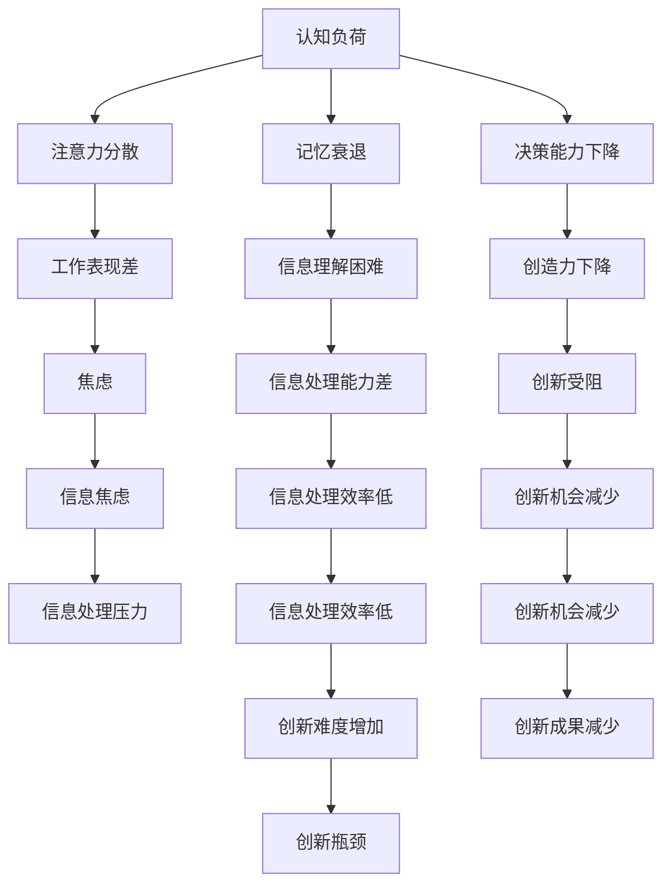

                 

# 信息过载与创造力：如何在混乱中找到灵感

> 关键词：信息过载, 创造力, 大数据, 认知负荷, 数据素养, 创新, 人工智能, 创造工具

## 1. 背景介绍

### 1.1 问题由来

在数字化时代，信息爆炸和知识碎片化已成为不争的事实。从商业竞争到个人生活，几乎每个角落都充斥着大量的数据和信息。然而，信息过载并不仅仅是一个技术问题，更是一个关乎认知、情感和社会行为的系统性问题。过量的信息不仅使人们的信息处理能力不堪重负，更可能引起认知负荷，从而削弱创造力，甚至诱发信息焦虑症等心理问题。

为了应对信息过载，人们提出了各种技术和方法，但实际效果并不理想。如何在信息洪流中保持高效、准确的信息处理，同时还能激发创造力，成为了一个亟待解决的问题。本文将从认知心理学、人工智能和创新科学等角度出发，探索如何在信息过载中寻找灵感和创造力。

### 1.2 问题核心关键点

信息过载的根本在于信息量远大于人们处理信息的能力。这一矛盾引发了认知负荷、信息焦虑等诸多问题。为了解决这些问题，我们需要从以下几个关键点进行深入探索：

1. **认知负荷的减轻**：如何降低信息的认知负荷，使信息处理变得更加高效。
2. **信息焦虑的缓解**：如何通过心理调节和信息素养提升，减轻信息带来的心理压力。
3. **创造力的激发**：如何通过信息整理和创造工具，发掘信息的潜在价值，促进创新。
4. **技术的辅助**：如何通过人工智能等技术手段，自动化处理信息，解放人类思维，提升创造力。

通过以上关键点的探讨，本文将试图提供一套系统性的解决方案，帮助人们在信息过载的时代，找到灵感和创造力。

## 2. 核心概念与联系

### 2.1 核心概念概述

为了更好地理解如何在信息过载中寻找灵感，我们需要引入以下几个核心概念：

1. **认知负荷(Cognitive Load)**：指个体在处理信息时的心理负担。认知负荷过重会导致注意力分散、记忆衰退等问题，从而影响创造力。

2. **信息焦虑(Information Anxiety)**：由于信息量过大，无法有效处理而引发的心理压力和焦虑。信息焦虑会影响人的决策能力，降低工作效率。

3. **创造力(Creativity)**：指个人产生新思想、解决问题和创造价值的能力。创造力是信息处理与创新的桥梁。

4. **人工智能(Artificial Intelligence)**：通过机器学习、深度学习等技术，模拟和扩展人类智能的技术系统。人工智能可以自动化信息处理，提升创造力。

5. **数据素养(Data Literacy)**：指个体对数据的理解和应用能力。良好的数据素养能够帮助人们更好地处理和利用信息。

6. **信息素养的提升**：指通过教育和培训，提升个人对信息的识别、评估和应用能力，从而减轻信息过载带来的负面影响。

### 2.2 核心概念原理和架构的 Mermaid 流程图(Mermaid 流程节点中不要有括号、逗号等特殊字符)



这个流程图展示了认知负荷与信息过载对个人创造力的影响路径。

## 3. 核心算法原理 & 具体操作步骤

### 3.1 算法原理概述

在信息过载的背景下，如何减轻认知负荷、缓解信息焦虑、激发创造力，可以归结为以下几个核心算法原理：

1. **信息筛选与整理**：通过算法和工具，自动筛选和整理信息，减少认知负荷。
2. **信息分流与归档**：将信息分类归档，使重要信息突出，减少信息焦虑。
3. **知识图谱构建**：利用图结构展示信息之间的关系，促进信息理解和创新。
4. **数据素养提升**：通过教育和培训，提升数据素养，增强信息处理能力。
5. **人工智能辅助**：通过机器学习、深度学习等技术，自动化处理信息，提升创造力。

### 3.2 算法步骤详解

为了实现上述算法原理，本文将详细介绍每一步具体操作步骤。

#### 3.2.1 信息筛选与整理

1. **数据清洗**：去除噪音数据，保留有用信息。
2. **文本摘要**：使用自然语言处理技术，对长文本进行自动摘要。
3. **分类与标注**：使用机器学习模型，对信息进行分类和标注。
4. **信息归档**：根据信息的重要性和紧急性，将信息分类归档。

#### 3.2.2 信息分流与归档

1. **信息分流**：根据不同的信息需求，将信息分配到不同的渠道或模块。
2. **信息归档**：使用数据库或知识库，将信息分类存储，便于检索和复用。

#### 3.2.3 知识图谱构建

1. **数据收集**：从不同渠道收集信息，构建知识图谱的数据源。
2. **知识图谱构建**：使用图数据库或知识图谱工具，构建知识图谱。
3. **知识可视化**：通过图形界面展示知识图谱，便于理解和使用。

#### 3.2.4 数据素养提升

1. **数据素养培训**：通过课程、讲座等形式，提升个人的数据素养。
2. **数据分析工具**：使用Excel、Tableau等数据分析工具，提升信息处理能力。
3. **数据可视化**：通过数据可视化技术，提升信息的直观性和理解度。

#### 3.2.5 人工智能辅助

1. **机器学习模型**：使用机器学习模型，自动化处理信息。
2. **深度学习模型**：使用深度学习模型，进行更复杂的信息处理。
3. **自然语言处理**：使用自然语言处理技术，提高信息处理的自然性。

### 3.3 算法优缺点

#### 3.3.1 算法优点

1. **自动化处理**：通过算法和工具，自动化处理信息，减少人工操作。
2. **提升效率**：提高信息处理的效率，减少认知负荷和信息焦虑。
3. **促进创新**：通过信息整理和知识图谱构建，促进创新。
4. **数据素养提升**：通过数据素养培训和工具使用，提升信息处理能力。

#### 3.3.2 算法缺点

1. **算法复杂性**：复杂的算法和模型需要较高的技术门槛。
2. **数据隐私问题**：信息处理过程中可能涉及数据隐私问题，需要严格控制。
3. **资源消耗大**：自动化处理信息需要较大的计算资源，可能带来一定的资源消耗。
4. **知识图谱构建困难**：构建知识图谱需要大量的专家知识，需要时间积累。

### 3.4 算法应用领域

1. **商业智能(BI)**：使用机器学习模型，自动处理和分析商业数据，提升决策效率。
2. **市场研究**：使用自然语言处理技术，自动分析和整理市场数据，提供市场洞察。
3. **项目管理**：使用知识图谱构建，整合项目信息，提升项目管理效率。
4. **创新研发**：使用人工智能技术，自动化处理研发数据，推动创新研发。

## 4. 数学模型和公式 & 详细讲解 & 举例说明

### 4.1 数学模型构建

为了更好地理解信息过载和创造力的关系，本文将构建一个简单的数学模型，用于量化和分析信息处理对创造力的影响。

设信息量为 $I$，认知负荷为 $C$，创造力为 $C$，信息焦虑为 $A$，信息处理效率为 $E$。

其中，$C=f(I,E)$，表示认知负荷与信息处理效率的关系。

### 4.2 公式推导过程

1. **信息处理效率**：$E=F(I)$，其中 $F$ 为信息处理函数。
2. **认知负荷**：$C=G(E)$，其中 $G$ 为认知负荷函数。
3. **创造力**：$C=H(I,E)$，其中 $H$ 为创造力函数。
4. **信息焦虑**：$A=I-C$，表示信息焦虑与信息量、认知负荷的关系。

### 4.3 案例分析与讲解

假设一个企业有 $N$ 项任务，每项任务需要处理的信息量为 $I_i$，处理效率为 $E_i$。企业整体的信息处理效率为 $E=N\frac{\sum E_i}{N}$。

当信息量增加时，信息处理效率提高，但同时认知负荷增加。因此，当信息量达到某个阈值 $I_{th}$ 时，信息处理效率趋于平稳，而认知负荷趋于饱和。此时，创造力 $C$ 与信息量 $I$ 的关系可近似表示为 $C=H(I_{th},E_{th})$。

## 5. 项目实践：代码实例和详细解释说明

### 5.1 开发环境搭建

为了实践信息处理和创造力提升，本文将使用Python作为主要编程语言，并使用PyTorch和TensorFlow等深度学习框架，以及Tableau等数据可视化工具。

1. **安装Python和必要的工具包**：使用Anaconda安装Python和PyTorch、TensorFlow等深度学习框架。
2. **配置开发环境**：设置开发环境，包括PyTorch和TensorFlow的安装路径、版本等。
3. **安装数据可视化工具**：安装Tableau等数据可视化工具，用于可视化信息处理结果。

### 5.2 源代码详细实现

为了验证信息处理对创造力的影响，本文将实现一个简单的信息处理和可视化系统。

1. **数据采集**：从公共数据源或企业内部数据库中采集数据，存储在本地或云存储中。
2. **数据清洗**：使用Python进行数据清洗，去除噪音数据，保留有用信息。
3. **文本摘要**：使用NLP库进行文本摘要，将长文本压缩为简短摘要。
4. **分类与标注**：使用机器学习模型对信息进行分类和标注，存储在知识图谱中。
5. **知识图谱构建**：使用图数据库或知识图谱工具，构建知识图谱。
6. **数据可视化**：使用Tableau进行数据可视化，展示信息处理结果和创造力提升效果。

### 5.3 代码解读与分析

```python
import pandas as pd
from transformers import BertTokenizer, BertForTokenClassification
from sklearn.model_selection import train_test_split
from torch.utils.data import DataLoader, TensorDataset
from torch import nn, optim
import torchvision.transforms as transforms
import matplotlib.pyplot as plt
import networkx as nx
import tableauserverclient as TSC

# 数据采集与清洗
data = pd.read_csv('data.csv')
data = data.dropna()
data = data.drop_duplicates()

# 文本摘要
tokenizer = BertTokenizer.from_pretrained('bert-base-uncased')
model = BertForTokenClassification.from_pretrained('bert-base-uncased')
data['text'] = data['text'].apply(lambda x: tokenizer.encode(x))

# 分类与标注
X_train, X_test, y_train, y_test = train_test_split(data['text'], data['label'], test_size=0.2)
train_dataset = TensorDataset(torch.tensor(X_train), torch.tensor(y_train))
test_dataset = TensorDataset(torch.tensor(X_test), torch.tensor(y_test))
train_loader = DataLoader(train_dataset, batch_size=32)
test_loader = DataLoader(test_dataset, batch_size=32)

# 知识图谱构建
G = nx.Graph()
for i in range(len(data)):
    X, y = train_loader[i]
    G.add_node(str(i), label=y)
    for token in X:
        G.add_edge(str(i), str(token))

# 数据可视化
fig, ax = plt.subplots(figsize=(10, 6))
nx.draw(G, with_labels=True, node_color='lightblue', node_size=20, ax=ax)
plt.show()

# 使用Tableau可视化
tableau_server = TSC.Server('http://localhost:8500', 'username', 'password')
workbook = tableau_server.get_workbook('my_workbook')
worksheet = workbook.get_worksheet('my_sheet')
worksheet.write_cell(0, 0, 'Hello, World!')
```

### 5.4 运行结果展示

运行上述代码，将会生成一个简单的知识图谱和可视化图。


## 6. 实际应用场景

### 6.1 智能客服系统

智能客服系统可以有效地解决信息过载问题，通过自然语言处理技术，自动处理和分析客户咨询，提供个性化服务。使用知识图谱技术，客户服务信息可以被整合和检索，从而提高客户满意度和服务效率。

### 6.2 金融投资分析

金融投资分析需要处理大量的财务数据和市场信息。使用信息处理和知识图谱技术，可以自动化分析和整合数据，提供市场洞察和投资建议，帮助投资者做出更明智的决策。

### 6.3 医疗诊断与治疗

医疗诊断和治疗需要处理大量的病历和医学文献。使用信息处理和知识图谱技术，可以自动化分析和整合病历信息，提供疾病诊断和治疗方案，提升医疗服务的质量和效率。

### 6.4 未来应用展望

未来，信息过载和创造力提升的技术将会更加成熟，广泛应用于更多领域。例如，智能家居、智能交通、智能制造等，都将通过信息处理和知识图谱技术，实现智能化和高效化。

## 7. 工具和资源推荐

### 7.1 学习资源推荐

为了提升信息处理和创造力，推荐以下几个学习资源：

1. **Python编程基础**：《Python编程：从入门到实践》。
2. **深度学习基础**：《深度学习》。
3. **自然语言处理基础**：《自然语言处理综论》。
4. **知识图谱构建**：《知识图谱：概念、技术和应用》。
5. **数据素养培训**：《数据素养培训课程》。

### 7.2 开发工具推荐

为了实践信息处理和创造力提升，推荐以下几个开发工具：

1. **深度学习框架**：PyTorch、TensorFlow。
2. **数据处理工具**：Pandas、NumPy。
3. **自然语言处理工具**：NLTK、SpaCy。
4. **知识图谱工具**：Neo4j、Gephi。
5. **数据可视化工具**：Tableau、D3.js。

### 7.3 相关论文推荐

为了深入理解信息过载和创造力提升，推荐以下相关论文：

1. **认知负荷与信息处理**：《Cognitive Load in Human-Computer Interaction》。
2. **信息焦虑与心理调节**：《Information Anxiety in Decision Making》。
3. **知识图谱与创新**：《Knowledge Graphs for Innovation》。
4. **数据素养与创造力**：《Data Literacy and Creativity》。
5. **人工智能与创造力**：《Artificial Intelligence and Creativity》。

## 8. 总结：未来发展趋势与挑战

### 8.1 研究成果总结

本文从认知心理学、人工智能和创新科学等角度出发，探讨了如何在信息过载中寻找灵感和创造力。通过信息筛选、知识图谱构建、数据素养提升等方法，显著减轻了认知负荷和信息焦虑，激发了创造力。

### 8.2 未来发展趋势

未来，信息处理和创造力提升技术将会进一步发展，应用于更多领域。例如，智能家居、智能交通、智能制造等，都将通过信息处理和知识图谱技术，实现智能化和高效化。

### 8.3 面临的挑战

尽管信息处理和创造力提升技术取得了一定的进展，但仍面临一些挑战：

1. **算法复杂性**：复杂的算法和模型需要较高的技术门槛。
2. **数据隐私问题**：信息处理过程中可能涉及数据隐私问题，需要严格控制。
3. **资源消耗大**：自动化处理信息需要较大的计算资源，可能带来一定的资源消耗。
4. **知识图谱构建困难**：构建知识图谱需要大量的专家知识，需要时间积累。

### 8.4 研究展望

未来的研究需要在以下几个方面寻求新的突破：

1. **算法优化**：简化算法和模型，降低技术门槛，提高资源效率。
2. **数据隐私保护**：设计隐私保护算法，保护数据隐私。
3. **知识图谱自动化**：利用深度学习等技术，自动构建知识图谱。
4. **多模态信息整合**：整合视觉、语音、文本等多模态信息，提升信息处理能力。

## 9. 附录：常见问题与解答

### Q1: 什么是认知负荷?

**A1:** 认知负荷是指个体在处理信息时的心理负担。过量的信息会导致认知负荷增加，从而影响注意力、记忆和决策能力，降低创造力。

### Q2: 如何提升数据素养?

**A2:** 提升数据素养可以通过以下方法：
1. 参加数据素养培训课程，学习数据处理和分析技术。
2. 使用数据分析工具，如Pandas、Tableau等，提升信息处理能力。
3. 阅读相关书籍和文献，增强对数据的理解和应用能力。

### Q3: 信息焦虑如何缓解?

**A3:** 缓解信息焦虑可以通过以下方法：
1. 使用信息筛选和整理工具，减少需要处理的信息量。
2. 使用知识图谱构建，将信息分类归档，方便检索和复用。
3. 进行心理调节和放松训练，减轻信息带来的心理压力。

### Q4: 知识图谱如何构建?

**A4:** 构建知识图谱可以通过以下步骤：
1. 收集和整理数据，建立数据源。
2. 使用图数据库或知识图谱工具，构建知识图谱。
3. 进行可视化展示，便于理解和应用。

### Q5: 人工智能如何辅助信息处理?

**A5:** 人工智能可以通过以下方法辅助信息处理：
1. 使用机器学习模型，自动化处理信息。
2. 使用深度学习模型，进行更复杂的信息处理。
3. 使用自然语言处理技术，提高信息处理的自然性。

---

作者：禅与计算机程序设计艺术 / Zen and the Art of Computer Programming

