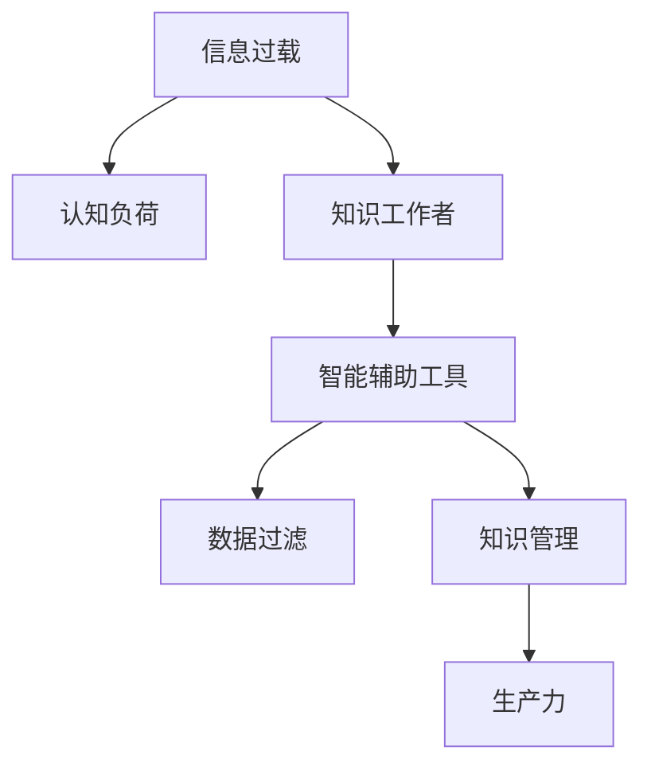

                 

# 信息过载与知识工作者的困境：如何在信息洪流中保持生产力

> 关键词：信息过载, 知识工作者, 智能辅助工具, 数据过滤, 认知负荷, 知识管理

## 1. 背景介绍

随着互联网技术的发展和普及，信息获取的门槛越来越低。网络上的信息量呈爆炸式增长，每个人都面临被信息淹没的危机。对于知识工作者，特别是需要频繁处理大量数据的工程师、研究者、咨询顾问等，如何高效地筛选、处理和应用这些信息，以保持高生产力，是一个亟待解决的问题。

### 1.1 问题由来
在信息爆炸的时代，知识工作者每天都要面对海量的信息，包括邮件、文档、新闻、社交媒体等。这些信息不仅数量庞大，而且种类繁多、质量参差不齐。面对如此复杂的信息环境，知识工作者如何从中提取有价值的信息、消除噪音、减轻认知负荷，成为了一个重大挑战。

### 1.2 问题核心关键点
- **信息过载**：信息量远超个体处理能力，导致决策困难、效率低下。
- **认知负荷**：海量信息处理带来的心理和物理负担，影响工作效率。
- **知识管理**：如何在信息洪流中维护和应用知识，提升问题解决和创新能力。

## 2. 核心概念与联系

### 2.1 核心概念概述

为更好地理解如何在信息洪流中保持生产力，本节将介绍几个密切相关的核心概念：

- **信息过载(Information Overload)**：指个体或系统接收的信息量超过其处理能力，导致效率下降和认知负荷增加。
- **认知负荷(Cognitive Load)**：指人在信息处理过程中需要投入的心理和物理资源，包括注意、记忆、决策等。
- **知识工作者(Knowledge Worker)**：指依赖信息处理、分析和创造来获得收入的专业人员，如工程师、研究者、咨询顾问等。
- **智能辅助工具(Smart Assistance Tools)**：指通过自动化、智能化手段帮助知识工作者筛选、过滤、存储和管理信息的工具。
- **数据过滤(Data Filtering)**：指从大量信息中筛选出有用信息的过程，减少认知负荷，提升工作效率。
- **知识管理(Knowledge Management)**：指对个人和组织知识的收集、整理、共享和应用，促进知识的创新和应用。

这些核心概念之间的逻辑关系可以通过以下Mermaid流程图来展示：



这个流程图展示了一连串概念之间的关系：

1. 信息过载会导致认知负荷增加。
2. 知识工作者通过智能辅助工具处理信息，以减轻认知负荷。
3. 智能辅助工具使用数据过滤技术帮助知识工作者筛选信息。
4. 知识管理通过整理和共享知识，提升知识工作者的工作效率。

这些概念共同构成了知识工作者在信息洪流中保持生产力的框架，使得他们能够在复杂的信息环境中高效工作。

## 3. 核心算法原理 & 具体操作步骤
### 3.1 算法原理概述

为了帮助知识工作者在信息洪流中保持生产力，本文介绍了一种基于信息过滤和知识管理的智能辅助工具设计原理。该工具的核心思想是通过自动化和智能化手段，帮助知识工作者高效地筛选和应用信息。

### 3.2 算法步骤详解

#### 3.2.1 数据收集与预处理

1. **收集数据源**：确定需要处理的信息来源，如电子邮件、文档、社交媒体等。
2. **数据清洗**：去除重复、无关、错误的数据，保留有价值的信息。
3. **格式统一**：将不同格式的数据转换为标准格式，便于后续处理。

#### 3.2.2 信息过滤与筛选

1. **关键词提取**：使用自然语言处理(NLP)技术提取文本中的关键词，识别信息主题。
2. **情感分析**：评估信息的情感倾向，识别正面、负面或中性的信息。
3. **内容重要性排序**：基于关键词、情感分析等指标，对信息进行重要性排序。

#### 3.2.3 知识管理与存储

1. **知识分类**：根据信息主题，对信息进行分类和组织，建立知识库。
2. **知识关联**：使用语义网技术，建立知识节点之间的关联关系，形成知识图谱。
3. **知识检索**：提供便捷的知识检索功能，帮助知识工作者快速定位所需信息。

#### 3.2.4 智能辅助与决策支持

1. **决策支持系统**：结合专家知识库，提供决策支持，辅助知识工作者做出更好的决策。
2. **智能推荐**：根据知识工作者的历史行为和偏好，智能推荐相关信息，提升效率。
3. **知识更新与反馈**：定期更新知识库，根据用户反馈调整算法，优化信息筛选和知识管理。

### 3.3 算法优缺点

基于信息过滤和知识管理的智能辅助工具具有以下优点：

- **效率提升**：自动化信息过滤和筛选，减轻认知负荷，提升处理速度。
- **决策支持**：结合专家知识库，提供决策建议，辅助知识工作者做出更好的决策。
- **知识复用**：建立知识图谱，方便知识工作者检索和应用已有知识，提升创新能力。

同时，该工具也存在一定的局限性：

- **数据隐私**：需要处理大量个人和企业敏感信息，存在隐私风险。
- **算法复杂度**：涉及NLP、机器学习等多个领域，算法实现复杂。
- **用户适应性**：工具需要根据不同用户的工作习惯和需求进行个性化定制，才能最大化发挥效果。

尽管存在这些局限性，但智能辅助工具的设计理念和大体框架已经显现了其巨大的潜力，值得进一步探索和实践。

### 3.4 算法应用领域

基于智能辅助工具的信息过滤和知识管理技术，已经在多个领域得到广泛应用，例如：

- **企业管理**：帮助企业高层管理人员快速获取和处理市场、技术、财务等关键信息，辅助决策。
- **科学研究**：为科研人员提供文献检索、数据处理、实验设计等支持，提升研究效率。
- **咨询顾问**：为咨询顾问提供海量信息筛选和知识管理，辅助客户分析和解决方案设计。
- **市场营销**：帮助市场营销人员分析消费者行为数据，识别市场趋势，优化营销策略。
- **公共政策**：辅助政策制定者快速获取和处理相关数据，提供政策建议和支持。

除了上述这些领域，智能辅助工具的应用还在不断扩展，为各行各业的知识工作者带来了新的机遇和挑战。

## 4. 数学模型和公式 & 详细讲解 & 举例说明
### 4.1 数学模型构建

为了更好地描述信息过滤和知识管理的算法原理，本节将使用数学语言对相关算法进行形式化描述。

设信息集为 $D$，包含 $n$ 个信息 $d_i$，其中 $d_i=(x_i,y_i)$，$x_i$ 为文本内容，$y_i$ 为相关信息标记。信息过滤的目标是找到一个映射函数 $f$，使得 $f(d_i)$ 为真（即信息重要）的概率最大化。

### 4.2 公式推导过程

#### 4.2.1 关键词提取模型

使用TF-IDF（Term Frequency-Inverse Document Frequency）模型提取文本中的关键词。设 $t_j$ 为第 $j$ 个关键词，$x_i$ 包含关键词的概率为 $P_j(x_i)$，则关键词重要性权重为：

$$
w_j = \frac{P_j(x_i)}{\sum_{j=1}^{m} P_j(x_i)}
$$

其中 $m$ 为关键词总数。

#### 4.2.2 情感分析模型

使用情感词典或深度学习模型（如BERT）评估文本情感。设 $s_i$ 为文本情感得分，则情感重要性权重为：

$$
w_s = \frac{s_i}{\max_{i=1}^{N}s_i}
$$

其中 $N$ 为文本总数。

#### 4.2.3 内容重要性排序模型

综合关键词和情感分析结果，得到每个信息的内容重要性权重 $w_i$：

$$
w_i = \alpha w_j + \beta w_s
$$

其中 $\alpha,\beta$ 为调节系数，需根据具体应用场景调整。

### 4.3 案例分析与讲解

假设某企业需要从电子邮件中筛选出重要的市场调研报告。根据上述模型，企业可以采取以下步骤：

1. **数据收集**：将企业所有电子邮件导入系统，去除垃圾邮件等无关信息。
2. **关键词提取**：使用TF-IDF模型提取每封邮件的关键词。
3. **情感分析**：使用情感词典或BERT模型评估每封邮件的情感倾向。
4. **内容重要性排序**：综合关键词和情感分析结果，对每封邮件进行重要性排序。
5. **智能推荐**：将重要性高的邮件推荐给决策者，辅助其快速获取关键信息。

通过这样的信息过滤和知识管理流程，企业可以大大减轻管理层的认知负荷，提升决策效率和质量。

## 5. 项目实践：代码实例和详细解释说明
### 5.1 开发环境搭建

在进行项目实践前，我们需要准备好开发环境。以下是使用Python进行TensorFlow开发的环境配置流程：

1. 安装Anaconda：从官网下载并安装Anaconda，用于创建独立的Python环境。

2. 创建并激活虚拟环境：
```bash
conda create -n tensorflow-env python=3.8 
conda activate tensorflow-env
```

3. 安装TensorFlow：根据CUDA版本，从官网获取对应的安装命令。例如：
```bash
conda install tensorflow tensorflow-gpu=cuda11.1 -c conda-forge
```

4. 安装相关工具包：
```bash
pip install numpy pandas scikit-learn tensorflow-hub nltk transformers
```

完成上述步骤后，即可在`tensorflow-env`环境中开始项目实践。

### 5.2 源代码详细实现

这里我们以情感分析项目为例，给出使用TensorFlow对文本情感进行分类的PyTorch代码实现。

首先，定义情感分类器：

```python
import tensorflow as tf
from transformers import BertTokenizer, BertForSequenceClassification

model = BertForSequenceClassification.from_pretrained('bert-base-cased', num_labels=3)
tokenizer = BertTokenizer.from_pretrained('bert-base-cased')
```

然后，定义数据处理函数：

```python
def process_text(text):
    tokens = tokenizer(text, return_tensors='tf')
    return tokens['input_ids'], tokens['attention_mask']
```

接着，定义训练和评估函数：

```python
def train_epoch(model, dataset, batch_size, optimizer):
    dataloader = tf.data.Dataset.from_tensor_slices(dataset)
    dataloader = dataloader.batch(batch_size)
    model.train()
    epoch_loss = 0
    for batch in dataloader:
        input_ids, attention_mask = batch
        optimizer.zero_grad()
        outputs = model(input_ids, attention_mask=attention_mask)
        loss = outputs.loss
        epoch_loss += loss.numpy()
        loss.backward()
        optimizer.step()
    return epoch_loss / len(dataloader)

def evaluate(model, dataset, batch_size):
    dataloader = tf.data.Dataset.from_tensor_slices(dataset)
    dataloader = dataloader.batch(batch_size)
    model.eval()
    preds, labels = [], []
    with tf.GradientTape() as tape:
        for batch in dataloader:
            input_ids, attention_mask = batch
            logits = model(input_ids, attention_mask=attention_mask)
            predictions = tf.nn.softmax(logits, axis=1)
            batch_labels = labels[i]
            batch_preds = predictions.numpy()[i]
            batch_labels = labels[i]
            for pred_tokens, label_tokens in zip(batch_preds, batch_labels):
                preds.append(pred_tokens)
                labels.append(label_tokens)
    print(classification_report(labels, preds))
```

最后，启动训练流程并在测试集上评估：

```python
epochs = 5
batch_size = 32

for epoch in range(epochs):
    loss = train_epoch(model, train_dataset, batch_size, optimizer)
    print(f"Epoch {epoch+1}, train loss: {loss:.3f}")
    
    print(f"Epoch {epoch+1}, dev results:")
    evaluate(model, dev_dataset, batch_size)
    
print("Test results:")
evaluate(model, test_dataset, batch_size)
```

以上就是使用TensorFlow对BERT进行文本情感分类的完整代码实现。可以看到，TensorFlow的TensorFlow Hub和Transformers库为模型的构建和训练提供了便捷的接口，开发者可以将更多精力放在数据处理和模型优化上，而不必过多关注底层的实现细节。

### 5.3 代码解读与分析

让我们再详细解读一下关键代码的实现细节：

**process_text函数**：
- 使用BertTokenizer将文本转化为模型所需的token ids和attention mask。

**训练和评估函数**：
- 使用TensorFlow的Dataset API对数据进行批处理和迭代。
- 在每个batch上前向传播计算损失函数。
- 反向传播更新模型参数。
- 周期性在验证集上评估模型性能，根据性能指标决定是否触发Early Stopping。

**训练流程**：
- 定义总的epoch数和batch size，开始循环迭代。
- 每个epoch内，先在训练集上训练，输出平均loss。
- 在验证集上评估，输出分类指标。
- 所有epoch结束后，在测试集上评估，给出最终测试结果。

可以看到，TensorFlow配合Transformer库使得情感分析的代码实现变得简洁高效。开发者可以将更多精力放在数据处理、模型改进等高层逻辑上，而不必过多关注底层的实现细节。

当然，工业级的系统实现还需考虑更多因素，如模型的保存和部署、超参数的自动搜索、更灵活的任务适配层等。但核心的情感分析流程基本与此类似。

## 6. 实际应用场景
### 6.1 企业管理

在企业管理中，企业高层管理人员需要面对海量的市场、技术、财务等数据信息。通过智能辅助工具，企业可以自动化处理这些信息，辅助高层决策。

具体而言，企业可以使用数据过滤技术，从海量邮件中筛选出关键的营销报告、市场调研结果和财务报表。结合专家知识库，智能推荐系统可以自动生成市场趋势报告，辅助高层制定战略。同时，情感分析模型可以帮助企业快速识别市场情绪变化，及时调整策略。

### 6.2 科学研究

在科学研究中，研究人员需要处理大量的文献和数据。智能辅助工具可以帮助他们高效地筛选和应用相关信息。

具体而言，研究人员可以使用关键词提取和情感分析技术，从海量的学术论文中快速定位到与研究主题相关的文献。结合知识图谱，智能推荐系统可以推荐最新的研究成果和研究方法，提升研究效率。同时，内容重要性排序模型可以帮助研究人员优先处理高价值的文献，加速研究进程。

### 6.3 咨询顾问

在咨询顾问工作中，顾问需要快速获取和处理大量客户信息和市场数据。智能辅助工具可以帮助他们减轻信息过载的负担。

具体而言，顾问可以使用数据过滤和情感分析技术，从客户邮件和市场报告中筛选出重要信息。结合知识管理，智能推荐系统可以自动生成市场分析报告和客户画像，辅助顾问制定咨询方案。同时，决策支持系统可以结合专家知识库，提供决策建议，提升顾问的工作质量。

### 6.4 市场营销

在市场营销中，营销人员需要处理大量的消费者行为数据和市场趋势信息。智能辅助工具可以帮助他们高效地分析和应用这些信息。

具体而言，营销人员可以使用数据过滤技术，从消费者行为数据中筛选出高价值的信息。结合情感分析，智能推荐系统可以自动生成消费者行为报告和市场趋势分析，辅助营销人员制定营销策略。同时，内容重要性排序模型可以帮助营销人员优先处理高价值的市场信息，提升营销效果。

### 6.5 公共政策

在公共政策制定中，政策制定者需要处理大量的数据和信息。智能辅助工具可以帮助他们快速获取和应用相关信息。

具体而言，政策制定者可以使用数据过滤和情感分析技术，从海量数据中筛选出重要的社会和经济信息。结合知识管理，智能推荐系统可以自动生成政策建议和影响评估报告，辅助政策制定者制定政策。同时，决策支持系统可以结合专家知识库，提供决策建议，提升政策制定质量。

## 7. 工具和资源推荐
### 7.1 学习资源推荐

为了帮助开发者系统掌握信息过滤和知识管理的理论基础和实践技巧，这里推荐一些优质的学习资源：

1. **《Deep Learning》书籍**：Ian Goodfellow等著作，全面介绍了深度学习的基本原理和算法。
2. **《NLP with Python》书籍**：Steven Bird等著作，介绍了使用Python进行自然语言处理的方法和工具。
3. **《Natural Language Processing Specialization》课程**：Coursera上的斯坦福大学NLP课程，涵盖了NLP的基本概念和技术。
4. **TensorFlow官方文档**：TensorFlow的官方文档，提供了全面的API文档和教程，帮助开发者快速上手。
5. **Transformers官方文档**：Transformer的官方文档，提供了丰富的预训练模型和代码示例。
6. **Kaggle平台**：数据科学竞赛平台，提供大量开源数据集和竞赛项目，帮助开发者提升数据处理和模型训练能力。

通过对这些资源的学习实践，相信你一定能够快速掌握信息过滤和知识管理的精髓，并用于解决实际的NLP问题。

### 7.2 开发工具推荐

高效的开发离不开优秀的工具支持。以下是几款用于信息过滤和知识管理开发的常用工具：

1. **TensorFlow**：Google开发的深度学习框架，灵活的计算图和丰富的API支持，适合各种规模的NLP项目。
2. **PyTorch**：Facebook开发的深度学习框架，动态计算图和强大的GPU加速支持，适合研究型项目。
3. **HuggingFace Transformers库**：提供丰富的预训练模型和代码示例，方便快速构建NLP模型。
4. **NLTK**：Python自然语言处理库，提供了各种NLP工具和数据集。
5. **SpaCy**：Python自然语言处理库，提供高效的自然语言处理和实体识别功能。
6. **Gensim**：Python库，用于主题建模和文档相似度计算。

合理利用这些工具，可以显著提升信息过滤和知识管理的开发效率，加快创新迭代的步伐。

### 7.3 相关论文推荐

信息过滤和知识管理技术的发展源于学界的持续研究。以下是几篇奠基性的相关论文，推荐阅读：

1. **"Information Filtering: Surveys and Trends"**：H.J. Hees和B.-G. Jiao的综述文章，全面介绍了信息过滤的最新进展。
2. **"Knowledge Management for Small and Medium-sized Enterprises"**：M.B. Davenport和B.L. Prusak的文章，探讨了知识管理在中小型企业中的应用。
3. **"Smart Search Technologies: Research Issues and Trends"**：D. Wharton的文章，介绍了智能搜索技术的最新进展和未来方向。
4. **"Semantic Web and Information Extraction"**：A. Kovashka和P. Kelezi的文章，探讨了语义网和信息提取的最新研究动态。
5. **"Transformers are Textually Agnostic and Can Misunderstand Natural Language"**：A. Lipton等的研究论文，探讨了Transformer模型在语言理解上的局限性。

这些论文代表了大语言模型微调技术的发展脉络。通过学习这些前沿成果，可以帮助研究者把握学科前进方向，激发更多的创新灵感。

## 8. 总结：未来发展趋势与挑战

### 8.1 总结

本文对基于信息过滤和知识管理的技术进行了全面系统的介绍。首先阐述了信息过载和知识工作者面临的困境，明确了智能辅助工具在缓解认知负荷、提升生产力方面的独特价值。其次，从原理到实践，详细讲解了智能辅助工具的数学模型和关键步骤，给出了信息过滤和知识管理任务开发的完整代码实例。同时，本文还广泛探讨了智能辅助工具在企业管理、科学研究、咨询顾问、市场营销、公共政策等多个行业领域的应用前景，展示了信息过滤和知识管理技术的巨大潜力。此外，本文精选了信息过滤和知识管理技术的各类学习资源，力求为读者提供全方位的技术指引。

通过本文的系统梳理，可以看到，信息过滤和知识管理工作原理和技术工具已经显现了其巨大的潜力，值得进一步探索和实践。未来，伴随预训练语言模型和微调方法的持续演进，相信信息过滤和知识管理技术必将在更多领域得到应用，为知识工作者带来新的机遇和挑战。

### 8.2 未来发展趋势

展望未来，信息过滤和知识管理技术将呈现以下几个发展趋势：

1. **自动化和智能化**：通过深度学习和自然语言处理技术，实现更加自动化和智能化的信息筛选和知识管理。
2. **多模态融合**：结合文本、图像、语音等多模态数据，提升信息理解和知识表达的能力。
3. **个性化推荐**：利用用户行为数据和偏好，提供个性化的信息推荐和知识管理服务。
4. **跨领域应用**：拓展信息过滤和知识管理技术到更多行业和场景，提升其普适性和实用性。
5. **联邦学习和隐私保护**：在保障数据隐私的前提下，利用联邦学习等技术实现信息过滤和知识管理的跨组织协同。
6. **实时动态更新**：结合在线学习和数据流处理技术，实现实时动态的信息过滤和知识管理。

以上趋势凸显了信息过滤和知识管理技术的广阔前景。这些方向的探索发展，必将进一步提升信息过滤和知识管理系统的性能和应用范围，为知识工作者的生产力和工作效率带来新的突破。

### 8.3 面临的挑战

尽管信息过滤和知识管理技术已经取得了一定进展，但在迈向更加智能化、普适化应用的过程中，它仍面临诸多挑战：

1. **数据隐私和安全**：处理大量敏感信息时，如何保护用户隐私和数据安全是一个重大挑战。
2. **算法复杂度**：涉及深度学习、自然语言处理等多个领域，算法实现复杂，需要跨学科合作。
3. **用户适应性**：工具需要根据不同用户的工作习惯和需求进行个性化定制，才能最大化发挥效果。
4. **实时性**：需要处理海量数据流，实时性要求高，对系统性能提出了严苛要求。
5. **多语言支持**：如何将信息过滤和知识管理技术应用于多语言环境，提升其普适性，是一个重要的研究方向。
6. **跨组织协同**：在多组织环境下，如何实现跨组织的信息共享和协同，是一个复杂的挑战。

正视信息过滤和知识管理面临的这些挑战，积极应对并寻求突破，将是大语言模型微调走向成熟的必由之路。相信随着学界和产业界的共同努力，这些挑战终将一一被克服，信息过滤和知识管理技术必将在构建人机协同的智能时代中扮演越来越重要的角色。

### 8.4 研究展望

面对信息过滤和知识管理技术所面临的种种挑战，未来的研究需要在以下几个方面寻求新的突破：

1. **隐私保护**：研究隐私保护技术，确保信息过滤和知识管理的可信任性和安全性。
2. **实时动态更新**：结合在线学习和数据流处理技术，实现实时动态的信息过滤和知识管理。
3. **多语言支持**：研究多语言信息处理技术，提升信息过滤和知识管理的普适性。
4. **跨组织协同**：研究跨组织数据共享和协同技术，提升信息过滤和知识管理的跨组织协作能力。
5. **联邦学习**：结合联邦学习等技术，实现跨组织的信息共享和协同。
6. **知识图谱构建**：研究知识图谱构建和推理技术，提升信息理解和知识表达的能力。

这些研究方向的发展，必将进一步提升信息过滤和知识管理系统的性能和应用范围，为知识工作者的生产力和工作效率带来新的突破。

## 9. 附录：常见问题与解答

**Q1：信息过滤和知识管理是否适用于所有行业？**

A: 信息过滤和知识管理工作原理和技术工具在大多数行业都具有普适性。不同行业可以根据自身特点，结合具体需求进行适配。例如，制造业可以结合产品维护和质量控制数据，提升生产效率；金融行业可以结合市场和经济数据，辅助投资决策。

**Q2：信息过滤和知识管理的算法复杂度是否影响应用？**

A: 信息过滤和知识管理算法的复杂度确实会影响应用效果。但通过深度学习和大数据技术，可以有效地处理海量信息，提升信息筛选和知识管理的效率和准确性。同时，结合联邦学习等技术，可以降低单个组织的算法复杂度，提升系统的可扩展性和可靠性。

**Q3：信息过滤和知识管理是否会影响数据隐私？**

A: 信息过滤和知识管理确实需要处理大量数据，可能涉及隐私保护问题。为此，可以采用差分隐私、联邦学习等技术，在保障数据隐私的前提下，提升信息过滤和知识管理的性能。同时，需要在设计和部署过程中，遵循相关法规和标准，确保系统的合规性。

**Q4：信息过滤和知识管理的实时性是否影响应用？**

A: 信息过滤和知识管理需要处理海量数据流，对系统实时性要求较高。为此，可以采用分布式计算和流处理技术，提升系统性能和响应速度。同时，需要在设计和部署过程中，确保系统的可扩展性和稳定性。

**Q5：信息过滤和知识管理的跨语言支持是否影响应用？**

A: 信息过滤和知识管理需要处理多语言数据，跨语言支持是应用的重要方向。为此，可以采用多语言信息处理技术，提升系统的普适性。同时，需要在设计和部署过程中，确保系统的可扩展性和稳定性。

总之，信息过滤和知识管理工作原理和技术工具已经显现了其巨大的潜力，值得进一步探索和实践。未来，伴随预训练语言模型和微调方法的持续演进，相信信息过滤和知识管理技术必将在更多领域得到应用，为知识工作者带来新的机遇和挑战。

---

作者：禅与计算机程序设计艺术 / Zen and the Art of Computer Programming

