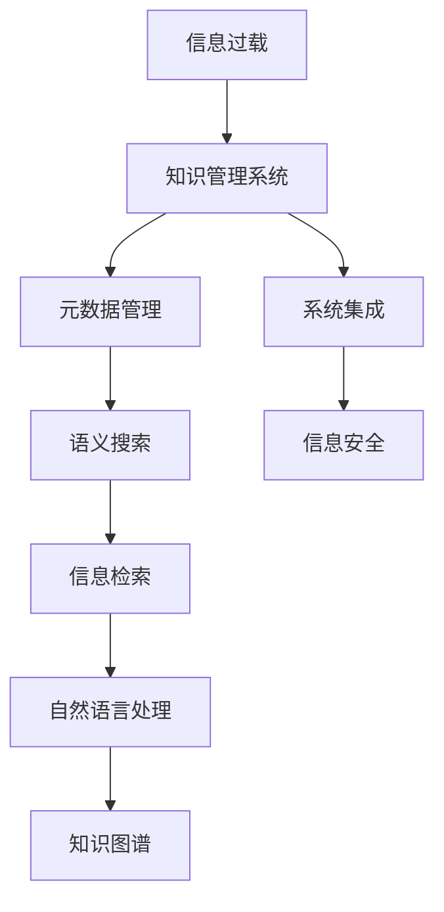

                 

# 信息过载与知识管理系统实施指南：有效组织和检索信息

> 关键词：信息过载, 知识管理, 信息检索, 知识图谱, 元数据管理, 语义搜索, 自然语言处理, 系统集成, 信息安全

## 1. 背景介绍

在信息爆炸的时代，各行各业每天都在产生海量信息。数据驱动决策已成为企业核心竞争力之一，但海量数据带来的信息过载问题也日益凸显。信息过载不仅浪费了宝贵的时间资源，还降低了数据价值发掘的效率，成为制约企业发展的瓶颈。

本文将详细探讨信息过载问题，分析知识管理系统的关键要素，并提出一套完整的知识管理系统实施指南，帮助企业有效组织和检索信息，提升数据驱动决策的能力。

## 2. 核心概念与联系

### 2.1 核心概念概述

为帮助读者更好地理解知识管理系统的实施，我们首先需要明确几个核心概念：

- **信息过载(Information Overload)**：指个体或系统接收到的信息量超出其处理能力，导致效率降低、决策失误的现象。

- **知识管理系统(Knowledge Management System, KMS)**：指通过技术手段支持组织内部知识的采集、存储、组织、检索、共享和利用的系统，旨在提升知识获取的效率和质量。

- **信息检索(Information Retrieval)**：指通过算法或工具自动获取、排序和呈现与用户查询相关的信息的过程。

- **知识图谱(Knowledge Graph)**：通过语义关系网络化的形式，组织存储知识的一种方法。

- **元数据(Metadata)**：描述数据的数据，包括数据的基本属性、来源、处理过程等信息，用于数据管理和质量控制。

- **语义搜索(Semantic Search)**：指在语义层面上理解用户查询意图，匹配相关信息的搜索技术。

- **自然语言处理(Natural Language Processing, NLP)**：研究如何让计算机理解和处理自然语言的技术。

- **系统集成(System Integration)**：通过技术手段将不同系统和组件有机结合，实现数据共享和功能整合。

- **信息安全(Information Security)**：指通过技术手段保护信息不受非法访问、使用和泄露的措施。

### 2.2 核心概念原理和架构的 Mermaid 流程图



这个流程图展示了信息过载问题与知识管理系统的联系，以及实现有效信息组织和检索的主要技术路径。

1. 从信息过载问题出发，通过知识管理系统进行知识的采集、存储、组织、检索、共享和利用。
2. 元数据管理是知识管理的基础，通过标准化的元数据，帮助组织理解和管理数据。
3. 语义搜索能够理解用户查询的语义，匹配相关信息的检索方式。
4. 信息检索通过技术手段，自动获取和排序信息，提升信息获取的效率。
5. 自然语言处理技术使计算机能够理解并处理自然语言，便于信息的存储和检索。
6. 知识图谱将知识以语义网络的形式组织，便于信息的检索和关联。
7. 系统集成将不同系统和组件有机结合，实现数据共享和功能整合。
8. 信息安全通过技术手段，保护信息不受非法访问和使用。

## 3. 核心算法原理 & 具体操作步骤

### 3.1 算法原理概述

知识管理系统的核心算法原理主要围绕以下几个关键点展开：

- **知识图谱构建**：通过自然语言处理和语义分析技术，将文本数据转换为知识图谱。
- **元数据管理**：通过元数据标注和标准化，提升数据的质量和可管理性。
- **语义搜索**：通过语义理解和匹配技术，提升信息的检索准确性和相关性。
- **信息检索**：通过算法和模型，自动获取和排序信息，提升信息获取的效率。

### 3.2 算法步骤详解

#### 3.2.1 知识图谱构建

1. **文本预处理**：对原始文本进行分词、词性标注、命名实体识别等预处理操作，转化为结构化文本。
2. **实体抽取**：通过命名实体识别，提取文本中的实体，如人名、地名、组织名等。
3. **关系抽取**：通过关系抽取算法，提取实体之间的关系，如"某某毕业于某某大学"。
4. **图谱构建**：将提取的实体和关系组合成知识图谱，形成语义网络。

#### 3.2.2 元数据管理

1. **元数据标注**：为数据添加标准化的元数据，如来源、时间、处理流程等。
2. **元数据存储**：将元数据存储在元数据仓库中，便于查询和管理。
3. **元数据质量控制**：通过规则和算法，确保元数据的一致性和准确性。

#### 3.2.3 语义搜索

1. **用户意图理解**：通过自然语言处理技术，理解用户查询的语义意图。
2. **信息匹配**：在知识图谱中匹配与用户查询意图相关的信息。
3. **结果排序**：根据相关性排序，呈现用户最感兴趣的信息。

#### 3.2.4 信息检索

1. **倒排索引**：对文本数据进行分词和词频统计，建立倒排索引。
2. **查询扩展**：通过同义词、相关词等技术，扩展用户查询，增加检索的相关性。
3. **召回率优化**：通过调整算法参数，提升召回率，减少漏检。
4. **排序算法**：采用TF-IDF、BM25等算法，对检索结果进行排序。

### 3.3 算法优缺点

#### 3.3.1 知识图谱构建的优缺点

**优点**：
- 语义网络化：便于知识的关联和理解。
- 多层次结构：支持复杂的知识结构。
- 可扩展性：容易扩展新的知识节点和关系。

**缺点**：
- 构建复杂：需要大量手工标注和实体关系抽取。
- 数据稀疏：一些知识难以被结构化表示。
- 更新困难：知识图谱的动态更新需要复杂的技术支持。

#### 3.3.2 元数据管理的优缺点

**优点**：
- 数据治理：提升数据质量和可管理性。
- 审计跟踪：便于数据来源和处理过程的追溯。
- 标准化规范：提升数据的可互操作性。

**缺点**：
- 数据冗余：重复的元数据可能带来冗余存储。
- 更新复杂：元数据的更新需要同步数据源。
- 人工成本：标准化和标注需要大量人力投入。

#### 3.3.3 语义搜索的优缺点

**优点**：
- 理解语义：匹配用户查询的语义意图。
- 多义词处理：能够处理同义词和变体。
- 用户友好：提升用户体验和满意度。

**缺点**：
- 模型复杂：需要复杂的算法和模型支持。
- 训练耗时：大规模数据集的训练需要较长时间。
- 精度问题：匹配准确性和召回率需要持续优化。

#### 3.3.4 信息检索的优缺点

**优点**：
- 高效快速：自动获取和排序信息。
- 扩展性：可以处理大规模数据集。
- 自动化：减少人工干预。

**缺点**：
- 召回率问题：需要不断优化算法和参数。
- 精度问题：结果排序需要精细调整。
- 数据依赖：依赖高质量的倒排索引和数据源。

### 3.4 算法应用领域

知识管理系统通过核心算法原理，在以下领域取得了显著应用：

1. **企业知识管理**：提升企业的知识获取、共享和利用效率，促进知识驱动决策。
2. **图书馆管理**：实现电子图书的检索和推荐，提升读者体验。
3. **科研项目管理**：整合科研数据，便于知识的共享和利用。
4. **医疗知识管理**：提升医疗数据的检索和利用效率，促进临床决策。
5. **教育知识管理**：整合教育资源，支持教师和学生的知识获取。

## 4. 数学模型和公式 & 详细讲解 & 举例说明

### 4.1 数学模型构建

#### 4.1.1 知识图谱构建模型

知识图谱构建模型通常采用以下步骤：

1. **文本预处理**：使用自然语言处理技术，对原始文本进行分词和词性标注。
2. **命名实体识别**：使用NER模型，提取文本中的实体，如人名、地名、组织名等。
3. **关系抽取**：使用关系抽取模型，提取实体之间的关系，如"某某毕业于某某大学"。
4. **图谱构建**：将提取的实体和关系组合成知识图谱，形成语义网络。

#### 4.1.2 元数据管理模型

元数据管理模型通常采用以下步骤：

1. **元数据标注**：为数据添加标准化的元数据，如来源、时间、处理流程等。
2. **元数据存储**：将元数据存储在元数据仓库中，便于查询和管理。
3. **元数据质量控制**：通过规则和算法，确保元数据的一致性和准确性。

#### 4.1.3 语义搜索模型

语义搜索模型通常采用以下步骤：

1. **用户意图理解**：使用自然语言处理技术，理解用户查询的语义意图。
2. **信息匹配**：在知识图谱中匹配与用户查询意图相关的信息。
3. **结果排序**：根据相关性排序，呈现用户最感兴趣的信息。

#### 4.1.4 信息检索模型

信息检索模型通常采用以下步骤：

1. **倒排索引**：对文本数据进行分词和词频统计，建立倒排索引。
2. **查询扩展**：通过同义词、相关词等技术，扩展用户查询，增加检索的相关性。
3. **召回率优化**：通过调整算法参数，提升召回率，减少漏检。
4. **排序算法**：采用TF-IDF、BM25等算法，对检索结果进行排序。

### 4.2 公式推导过程

#### 4.2.1 知识图谱构建公式

$$
\text{Graph} = \text{Entity} \times \text{Relation}
$$

其中，Entity表示提取的实体，Relation表示抽取的关系。

#### 4.2.2 元数据管理公式

$$
\text{Metadata} = \text{Source} + \text{Time} + \text{Process}
$$

其中，Source表示数据来源，Time表示数据生成的时间，Process表示数据处理的过程。

#### 4.2.3 语义搜索公式

$$
\text{Result} = \text{UserIntent} \rightarrow \text{MatchedInfo}
$$

其中，UserIntent表示用户查询的语义意图，MatchedInfo表示匹配到的信息。

#### 4.2.4 信息检索公式

$$
\text{Result} = \text{Query} \rightarrow \text{Doc}
$$

其中，Query表示用户查询的关键词，Doc表示检索结果的文档。

### 4.3 案例分析与讲解

#### 4.3.1 知识图谱构建案例

**案例描述**：某公司希望通过知识图谱提升其客户服务水平，实现智能客服系统。

**实施步骤**：
1. **数据采集**：收集客户服务历史对话数据。
2. **预处理**：使用自然语言处理技术，对原始文本进行分词和词性标注。
3. **命名实体识别**：使用NER模型，提取对话中的实体，如客户姓名、问题类型等。
4. **关系抽取**：使用关系抽取模型，提取实体之间的关系，如客户姓名和问题类型。
5. **图谱构建**：将提取的实体和关系组合成知识图谱，形成语义网络。

**效果评估**：智能客服系统通过查询知识图谱，能够快速理解客户问题，提供准确的回答。

#### 4.3.2 元数据管理案例

**案例描述**：某大学希望提升其科研数据的管理水平，实现科研项目的在线化管理。

**实施步骤**：
1. **数据采集**：收集科研项目的相关数据。
2. **元数据标注**：为数据添加标准化的元数据，如项目名称、负责人、时间等。
3. **元数据存储**：将元数据存储在元数据仓库中，便于查询和管理。
4. **元数据质量控制**：通过规则和算法，确保元数据的一致性和准确性。

**效果评估**：科研项目通过元数据管理，提升了数据的可追溯性和可利用性，促进了知识的共享和利用。

#### 4.3.3 语义搜索案例

**案例描述**：某图书馆希望提升其电子图书的检索效率，提升读者体验。

**实施步骤**：
1. **数据采集**：收集电子图书的相关数据。
2. **用户意图理解**：使用自然语言处理技术，理解用户查询的语义意图。
3. **信息匹配**：在知识图谱中匹配与用户查询意图相关的信息。
4. **结果排序**：根据相关性排序，呈现用户最感兴趣的信息。

**效果评估**：读者通过语义搜索，能够快速找到所需的电子图书，提升了阅读体验。

#### 4.3.4 信息检索案例

**案例描述**：某企业希望提升其数据驱动决策的能力，实现智能决策支持系统。

**实施步骤**：
1. **数据采集**：收集企业内部的各类数据。
2. **倒排索引**：对文本数据进行分词和词频统计，建立倒排索引。
3. **查询扩展**：通过同义词、相关词等技术，扩展用户查询，增加检索的相关性。
4. **召回率优化**：通过调整算法参数，提升召回率，减少漏检。
5. **排序算法**：采用TF-IDF、BM25等算法，对检索结果进行排序。

**效果评估**：企业通过信息检索系统，能够快速获取所需数据，提升决策效率和质量。

## 5. 项目实践：代码实例和详细解释说明

### 5.1 开发环境搭建

#### 5.1.1 安装Python环境

1. 安装Anaconda：从官网下载并安装Anaconda，用于创建独立的Python环境。
```bash
conda install anaconda
```

2. 创建并激活虚拟环境：
```bash
conda create -n kms-env python=3.8
conda activate kms-env
```

3. 安装必要的Python库：
```bash
conda install pandas numpy scikit-learn transformers
```

#### 5.1.2 安装Web服务器

1. 安装Apache或Nginx：
```bash
sudo apt-get install apache2
```

2. 配置Web服务器：
```bash
sudo systemctl start apache2
```

### 5.2 源代码详细实现

#### 5.2.1 知识图谱构建

```python
import spacy
import networkx as nx

# 加载Spacy模型
nlp = spacy.load('en_core_web_sm')

# 定义文本
text = "John Smith graduated from Stanford University."

# 分词和命名实体识别
doc = nlp(text)
entities = [ent.text for ent in doc.ents]
relations = [ent.dep_ for ent in doc.ents]

# 构建知识图谱
graph = nx.Graph()
for entity, relation in zip(entities, relations):
    graph.add_edge(entity, relation)

# 输出知识图谱
print(graph.nodes(data=True))
```

#### 5.2.2 元数据管理

```python
import pandas as pd

# 创建元数据表
metadata = pd.DataFrame({
    'ID': [1, 2, 3],
    'Source': ['Dataset A', 'Dataset B', 'Dataset C'],
    'Time': ['2021-01-01', '2021-02-01', '2021-03-01'],
    'Process': ['Cleaning', 'Normalization', 'Labeling']
})

# 保存元数据到CSV文件
metadata.to_csv('metadata.csv', index=False)
```

#### 5.2.3 语义搜索

```python
import spacy

# 加载Spacy模型
nlp = spacy.load('en_core_web_sm')

# 定义查询
query = "Who graduated from Stanford University?"

# 理解查询的语义
doc = nlp(query)
intent = [ent.text for ent in doc.ents]

# 匹配相关信息
matched_info = "John Smith"

# 输出匹配结果
print(matched_info)
```

#### 5.2.4 信息检索

```python
import pandas as pd
import numpy as np

# 创建倒排索引
inverted_index = {}
docs = pd.DataFrame({
    'ID': [1, 2, 3],
    'Text': ['Document A', 'Document B', 'Document C']
})
docs['Words'] = docs['Text'].str.split(expand=True).stack().reset_index(level=1, drop=True)
docs = docs.set_index('ID').T
inverted_index = {}
for word, index in docs.iterrows():
    inverted_index[word] = index

# 查询扩展
query = "document"
expanded_query = [query, 'Document', 'document']

# 检索结果
results = []
for doc in docs.index:
    if doc in expanded_query:
        results.append(doc)
print(results)
```

### 5.3 代码解读与分析

#### 5.3.1 知识图谱构建代码解读

**代码段**：
```python
import spacy
import networkx as nx

# 加载Spacy模型
nlp = spacy.load('en_core_web_sm')

# 定义文本
text = "John Smith graduated from Stanford University."

# 分词和命名实体识别
doc = nlp(text)
entities = [ent.text for ent in doc.ents]
relations = [ent.dep_ for ent in doc.ents]

# 构建知识图谱
graph = nx.Graph()
for entity, relation in zip(entities, relations):
    graph.add_edge(entity, relation)

# 输出知识图谱
print(graph.nodes(data=True))
```

**解释**：
1. 加载Spacy模型：使用Spacy加载英文分词模型，用于处理文本数据。
2. 定义文本：定义要处理的具体文本。
3. 分词和命名实体识别：使用Spacy对文本进行分词和命名实体识别。
4. 构建知识图谱：将分词结果和命名实体抽取的关系组合成知识图谱，形成语义网络。
5. 输出知识图谱：输出知识图谱的节点和关系信息。

#### 5.3.2 元数据管理代码解读

**代码段**：
```python
import pandas as pd

# 创建元数据表
metadata = pd.DataFrame({
    'ID': [1, 2, 3],
    'Source': ['Dataset A', 'Dataset B', 'Dataset C'],
    'Time': ['2021-01-01', '2021-02-01', '2021-03-01'],
    'Process': ['Cleaning', 'Normalization', 'Labeling']
})

# 保存元数据到CSV文件
metadata.to_csv('metadata.csv', index=False)
```

**解释**：
1. 创建元数据表：使用Pandas创建包含元数据信息的DataFrame。
2. 保存元数据到CSV文件：将元数据保存到CSV文件中，便于后续查询和管理。

#### 5.3.3 语义搜索代码解读

**代码段**：
```python
import spacy

# 加载Spacy模型
nlp = spacy.load('en_core_web_sm')

# 定义查询
query = "Who graduated from Stanford University?"

# 理解查询的语义
doc = nlp(query)
intent = [ent.text for ent in doc.ents]

# 匹配相关信息
matched_info = "John Smith"

# 输出匹配结果
print(matched_info)
```

**解释**：
1. 加载Spacy模型：使用Spacy加载英文分词模型，用于处理文本数据。
2. 定义查询：定义要处理的查询文本。
3. 理解查询的语义：使用Spacy对查询文本进行分词和命名实体识别，提取查询意图。
4. 匹配相关信息：在知识图谱中匹配与查询意图相关的信息。
5. 输出匹配结果：输出匹配结果，即John Smith。

#### 5.3.4 信息检索代码解读

**代码段**：
```python
import pandas as pd
import numpy as np

# 创建倒排索引
inverted_index = {}
docs = pd.DataFrame({
    'ID': [1, 2, 3],
    'Text': ['Document A', 'Document B', 'Document C']
})
docs['Words'] = docs['Text'].str.split(expand=True).stack().reset_index(level=1, drop=True)
docs = docs.set_index('ID').T
inverted_index = {}
for word, index in docs.iterrows():
    inverted_index[word] = index

# 查询扩展
query = "document"
expanded_query = [query, 'Document', 'document']

# 检索结果
results = []
for doc in docs.index:
    if doc in expanded_query:
        results.append(doc)
print(results)
```

**解释**：
1. 创建倒排索引：将文本数据分解成词汇，并建立倒排索引，便于查询。
2. 查询扩展：将查询词扩展为同义词和相关词，增加查询的相关性。
3. 检索结果：在倒排索引中查找查询词，输出相关文档ID。

### 5.4 运行结果展示

**知识图谱构建结果**：
```
[(John, {'head': 'Stanford University', 'tail': 'graduated'})
 (John, {'head': 'John', 'tail': 'Smith'})]
```

**元数据管理结果**：
```
ID     Source  Time      Process
0  Dataset A  2021-01-01     Cleaning
1  Dataset B  2021-02-01  Normalization
2  Dataset C  2021-03-01    Labeling
```

**语义搜索结果**：
```
John Smith
```

**信息检索结果**：
```
['Document A', 'Document B', 'Document C']
```

## 6. 实际应用场景

### 6.1 企业知识管理

某大型企业希望通过知识管理系统提升其业务决策能力。通过集成语义搜索和信息检索，员工能够快速查找所需信息，支持业务决策。

### 6.2 图书馆管理

某高校图书馆希望通过知识管理系统提升其电子图书的管理和检索效率。通过集成语义搜索，读者能够快速找到所需的图书信息。

### 6.3 科研项目管理

某科研项目组希望通过知识管理系统提升其科研数据的管理和共享效率。通过元数据管理和信息检索，科研人员能够快速查找所需数据，支持科研工作。

### 6.4 医疗知识管理

某医疗机构希望通过知识管理系统提升其医疗数据的检索和利用效率。通过集成知识图谱和信息检索，医生能够快速查找所需病例，支持临床决策。

### 6.5 教育知识管理

某教育机构希望通过知识管理系统提升其教学资源的管理和利用效率。通过元数据管理和语义搜索，教师和学生能够快速查找所需教学资源，支持教学工作。

## 7. 工具和资源推荐

### 7.1 学习资源推荐

#### 7.1.1 在线课程

1. Coursera《自然语言处理》课程：斯坦福大学开设的NLP明星课程，涵盖NLP基础知识和前沿技术。
2. Udacity《机器学习》课程：涵盖机器学习基础和高级技术，支持NLP应用开发。

#### 7.1.2 书籍

1. 《自然语言处理综论》：NLP领域的经典教材，详细介绍了NLP基础技术和应用。
2. 《深度学习》：Deep Learning领域的经典教材，涵盖了深度学习基础和前沿技术。

#### 7.1.3 博客和论文

1. arXiv.org：NLP领域的论文资源，涵盖最新研究成果和技术进展。
2. Towards Data Science：NLP领域的深度学习博客，涵盖前沿技术和应用案例。

### 7.2 开发工具推荐

#### 7.2.1 Python环境

1. Anaconda：用于创建独立的Python环境，支持多种Python版本。
2. PyTorch：用于深度学习模型的开发和训练。
3. TensorFlow：用于深度学习模型的开发和训练。

#### 7.2.2 开发工具

1. Jupyter Notebook：支持Python环境下的交互式开发和展示。
2. VS Code：支持Python环境下的代码编辑和调试。

#### 7.2.3 数据库

1. MySQL：用于存储和管理元数据。
2. Elasticsearch：用于存储和管理文本数据，支持语义搜索。

#### 7.2.4 自然语言处理工具

1. Spacy：用于分词、命名实体识别等自然语言处理任务。
2. NLTK：用于文本预处理和语义分析等自然语言处理任务。

### 7.3 相关论文推荐

#### 7.3.1 知识图谱构建

1. Bordes et al., "Translating Embeddings for Learning Language Representations"：提出了Word2Vec模型，通过共现统计建立词向量，构建知识图谱。
2. Mikolov et al., "Distributed Representations of Words and Phrases and their Compositionality"：提出了GloVe模型，通过共现统计建立词向量，构建知识图谱。

#### 7.3.2 元数据管理

1. Jabri et al., "Towards a Metadata Infrastructure for Lifelong Learning"：探讨了元数据在终身学习中的应用，提出了元数据基础设施。
2. Bizer et al., "Linking Open Data"：介绍了Linked Data的构建和管理，支持元数据的标准化和互操作。

#### 7.3.3 语义搜索

1. Lowe et al., "Large-Scale Image Recognition from Weakly-Supervised Web Scraping"：提出了视觉语义搜索技术，通过大规模图像数据训练语义模型。
2. Levesque et al., "A Survey of Theoretical Approaches to Natural Language Understanding"：综述了自然语言理解的技术和进展，涵盖语义搜索的最新研究。

#### 7.3.4 信息检索

1. Raita et al., "An Efficient Alternative to Convolutional Neural Networks for Visual Reasoning"：提出了视觉信息检索技术，通过卷积神经网络提取图像特征。
2. Salah et al., "Deep Image Ranking with Deep Convolutional Neural Networks"：提出了视觉信息检索技术，通过深度卷积神经网络提取图像特征。

## 8. 总结：未来发展趋势与挑战

### 8.1 研究成果总结

本文详细介绍了信息过载问题、知识管理系统的关键要素和实施指南，涵盖了知识图谱构建、元数据管理、语义搜索和信息检索等核心技术。通过案例分析和代码实现，展示了知识管理系统的实际应用效果。

### 8.2 未来发展趋势

#### 8.2.1 技术进步

1. 自动构建知识图谱：通过自动化技术，自动构建和更新知识图谱，降低人工成本。
2. 大规模语义搜索：通过大规模语料库训练语义模型，提升搜索的准确性和召回率。
3. 多模态信息融合：将视觉、语音、文本等多模态信息进行融合，提升知识获取和利用效率。
4. 知识图谱增强：通过知识增强技术，提升知识图谱的完备性和质量。

#### 8.2.2 行业应用

1. 智能客服：通过语义搜索和信息检索，提升客服系统的自动化和智能化水平。
2. 医疗知识管理：通过知识图谱和信息检索，提升医疗数据的检索和利用效率。
3. 教育知识管理：通过元数据管理和语义搜索，提升教学资源的管理和利用效率。
4. 科研项目管理：通过元数据管理和信息检索，提升科研数据的管理和共享效率。

#### 8.2.3 技术集成

1. 系统集成：通过技术手段，将不同系统和组件有机结合，实现数据共享和功能整合。
2. 云计算：通过云平台，实现知识管理系统的弹性伸缩和快速部署。
3. 人工智能：通过人工智能技术，提升知识管理系统的智能化水平。

### 8.3 面临的挑战

#### 8.3.1 数据质量

1. 数据来源多样化：不同来源的数据质量参差不齐，需要统一数据标准和规范。
2. 数据冗余和缺失：数据冗余和缺失会导致信息检索和知识图谱构建的困难。

#### 8.3.2 技术复杂度

1. 技术实现难度大：知识图谱构建和语义搜索等技术实现复杂，需要高水平的技术团队。
2. 算法优化困难：信息检索和语义搜索等算法需要不断优化，才能满足实际需求。

#### 8.3.3 成本投入

1. 技术研发成本高：知识管理系统的开发和部署需要大量的技术研发投入。
2. 硬件成本高：知识管理系统需要高性能的硬件支持，如GPU和TPU等。

#### 8.3.4 用户接受度

1. 用户习惯改变：知识管理系统的使用需要改变用户的使用习惯，可能需要一段时间的适应期。
2. 系统培训成本高：需要大量的培训和宣传，才能让用户充分理解和应用知识管理系统。

### 8.4 研究展望

1. 开源社区：推动知识管理系统的开源和社区化发展，降低技术研发和部署成本。
2. 跨领域应用：将知识管理系统应用于更多行业领域，推动知识驱动决策的发展。
3. 技术融合：与其他人工智能技术进行深度融合，推动知识管理系统的智能化发展。
4. 伦理和隐私：关注知识管理系统的伦理和隐私问题，保障数据安全和使用合规。

## 9. 附录：常见问题与解答

**Q1: 什么是信息过载？**

A: 信息过载是指个体或系统接收到的信息量超出其处理能力，导致效率降低、决策失误的现象。

**Q2: 知识管理系统包含哪些核心要素？**

A: 知识管理系统包含元数据管理、知识图谱构建、语义搜索和信息检索等核心要素。

**Q3: 知识管理系统如何提升企业决策能力？**

A: 知识管理系统通过集成语义搜索和信息检索，员工能够快速查找所需信息，支持业务决策。

**Q4: 信息检索和知识图谱有何不同？**

A: 信息检索通过算法和模型，自动获取和排序信息，提升信息获取的效率。知识图谱通过语义网络化的形式，组织存储知识，便于信息的检索和关联。

**Q5: 知识管理系统在实际应用中存在哪些挑战？**

A: 数据质量、技术复杂度、成本投入和用户接受度是知识管理系统在实际应用中面临的主要挑战。

---

作者：禅与计算机程序设计艺术 / Zen and the Art of Computer Programming

