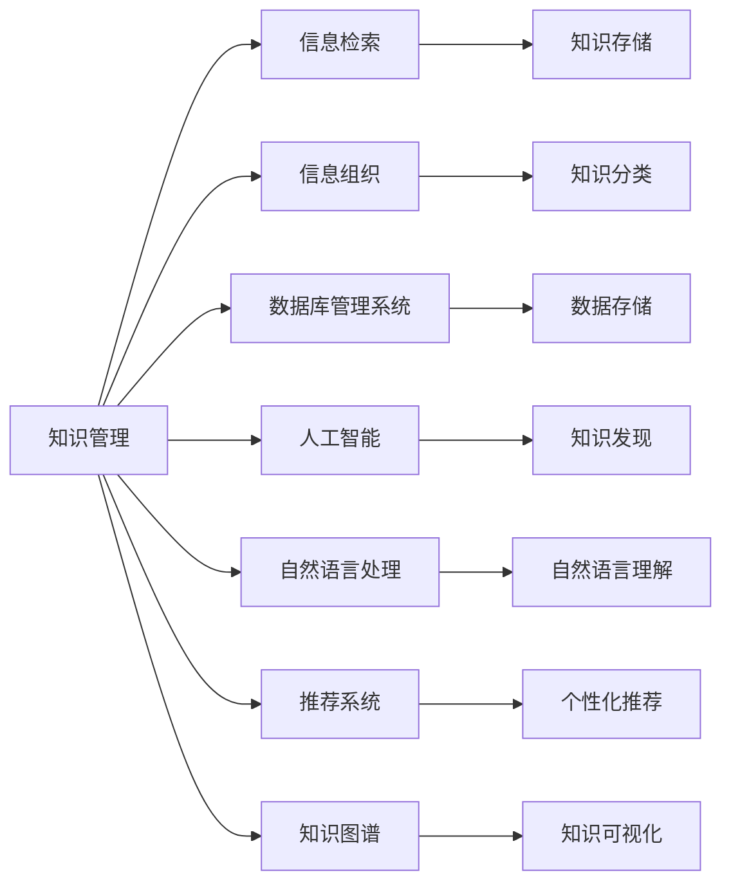

                 

# 信息过载与知识管理系统实施：有效组织和检索信息的指南

> 关键词：信息过载, 知识管理, 信息检索, 信息组织, 系统实施, 数据处理, 数据库管理系统, 人工智能, 自然语言处理, 推荐系统, 决策支持, 知识图谱

## 1. 背景介绍

在现代社会中，信息爆炸和知识积累呈现出指数级增长，这既是科技发展带来的馈赠，也给信息管理和利用带来了巨大挑战。随着互联网的普及和信息技术的发展，各行各业每天都会产生海量数据，传统的手工整理和检索方式已无法满足日益增长的信息需求。因此，如何高效地组织、存储和检索信息，成为现代信息技术研究和应用的重要课题。

### 1.1 信息过载的现状与影响

信息过载指的是在一个特定的时间段内，人们被海量的信息所淹没，难以有效利用，导致认知负荷过大，影响工作效率和决策能力。据统计，全球每天产生的信息量已超过1.5 EB，信息过载已经成为各行各业普遍面临的问题。

信息过载带来的影响主要体现在以下几个方面：

- **认知负担**：人类大脑在处理信息时需要大量的认知资源，当信息量过大时，注意力难以集中，认知负荷增加，导致决策效率降低。
- **知识流失**：大量未被有效处理的信息易被忽略，难以转化为知识，进而影响知识的积累和传承。
- **技术瓶颈**：现有的搜索和处理技术难以应对大规模、多类型、高复杂度的数据，阻碍了信息技术的进一步发展。

### 1.2 知识管理系统的价值

面对信息过载的挑战，知识管理系统（Knowledge Management System, KMS）应运而生。知识管理系统是一种基于信息技术和网络环境，专门支持知识收集、存储、检索、共享和利用的管理系统。通过构建有效的知识管理系统，企业能够有效应对信息过载，提升工作效率，加速知识创新和转化。

具体而言，知识管理系统的价值在于：

- **提升信息处理效率**：通过智能化的信息处理和组织，大幅降低人工工作量，提高信息处理的效率和准确性。
- **促进知识共享和协作**：建立统一的知识共享平台，促进企业内部和外部的知识交流与合作，加速知识传播和应用。
- **支撑决策支持**：通过数据分析和知识挖掘，为企业决策提供科学依据，提高决策的科学性和准确性。

## 2. 核心概念与联系

### 2.1 核心概念概述

在讨论知识管理系统的设计和实施前，我们首先需要理解以下几个核心概念：

- **知识管理(Knowledge Management, KM)**：通过信息技术手段，系统化地管理和利用知识，以提升组织的信息处理能力和知识创造能力。
- **信息检索(Information Retrieval, IR)**：从大量信息源中快速找到满足用户需求的信息的过程。
- **信息组织(Information Organization)**：对信息进行结构化、分类化处理，便于检索和应用。
- **数据库管理系统(Database Management System, DBMS)**：用于管理和操作数据库的软件系统，支持数据的存储、查询、修改和删除等操作。
- **人工智能(Artificial Intelligence, AI)**：模拟人类智能行为，如学习、推理、决策等，在知识管理系统中可以用于知识发现和推理。
- **自然语言处理(Natural Language Processing, NLP)**：使计算机能够理解和处理人类语言的技术，在知识检索和组织中起到关键作用。
- **推荐系统(Recommendation System)**：根据用户历史行为和偏好，推荐相关内容的系统，广泛应用于知识推荐。
- **知识图谱(Knowledge Graph)**：一种用图结构来表示实体及其关系的知识表示方法，在知识组织和检索中应用广泛。

这些核心概念共同构成了知识管理系统的理论基础和实施框架，帮助企业高效地管理知识资源，提升信息处理能力。

### 2.2 核心概念联系

通过以下Mermaid流程图，我们可以直观地展示这些核心概念之间的联系：



这个流程图展示了知识管理系统中各核心概念的相互依赖关系：

- 知识管理通过信息检索和组织，实现对知识的高效存储和检索。
- 信息检索依赖于数据库管理系统和自然语言处理技术，以支持快速准确的检索。
- 信息组织需要数据库管理系统来存储和管理数据，并通过知识图谱进行结构化。
- 人工智能用于知识发现和推理，提升知识管理的智能化水平。
- 推荐系统利用知识管理中的历史行为数据，提供个性化推荐，促进知识利用。

通过深入理解这些概念及其联系，我们可以更好地设计和实施知识管理系统，应对信息过载带来的挑战。

## 3. 核心算法原理 & 具体操作步骤
### 3.1 算法原理概述

知识管理系统的核心算法包括信息检索、信息组织和知识发现等，其基本原理是利用信息技术和计算机算法，对海量信息进行高效处理和组织，提取有价值的知识信息。

信息检索是知识管理系统的基础，旨在从大量数据中快速找到满足用户需求的信息。常见的方法包括基于关键词的检索、基于文档向量的检索等。信息组织则通过对信息进行分类、标注和结构化，提高信息的可检索性和可利用性。知识发现则通过数据挖掘和机器学习技术，从信息中提取隐藏的知识和规律，支持决策支持。

### 3.2 算法步骤详解

知识管理系统的实施过程可以分为以下几个关键步骤：

**Step 1: 需求分析**
- 明确企业内部对知识管理的需求，包括信息处理、知识共享、决策支持等方面的具体需求。
- 确定知识管理系统的目标，如提升信息处理效率、促进知识创新、支持决策等。

**Step 2: 系统设计**
- 设计知识管理系统的整体架构，包括数据模型、信息检索引擎、知识组织框架等。
- 选择合适的技术栈，如数据库管理系统、搜索引擎、自然语言处理库等。

**Step 3: 数据采集与预处理**
- 收集企业内部的业务数据、客户数据、员工数据等，进行清洗、整合和标准化。
- 对数据进行结构化处理，将其转化为知识管理系统能够高效处理的形式。

**Step 4: 信息检索与组织**
- 设计信息检索模块，支持快速、准确的文本和语义检索。
- 构建知识组织框架，如分类树、标签体系等，对信息进行分类和标注。

**Step 5: 知识发现与推荐**
- 利用机器学习算法对数据进行挖掘，提取知识模式和规律。
- 开发推荐系统，根据用户历史行为和偏好，提供个性化推荐。

**Step 6: 系统集成与测试**
- 将各个模块集成到统一的知识管理平台，进行系统测试。
- 对系统进行优化和调试，确保系统的稳定性和可用性。

**Step 7: 部署与维护**
- 将知识管理系统部署到生产环境，确保系统的稳定运行。
- 定期维护和更新系统，跟踪最新的技术进展和用户需求变化。

### 3.3 算法优缺点

知识管理系统在提升信息处理效率和知识利用方面具有显著优势，但也存在一些局限性：

**优点**：

- **提升信息处理效率**：通过自动化处理和智能检索，大幅降低人工工作量，提高信息处理的效率和准确性。
- **促进知识共享和协作**：建立统一的知识共享平台，促进企业内部和外部的知识交流与合作，加速知识传播和应用。
- **支撑决策支持**：通过数据分析和知识挖掘，为企业决策提供科学依据，提高决策的科学性和准确性。

**缺点**：

- **依赖技术**：系统的设计和实施需要依赖先进的信息技术和算法，对技术水平有较高要求。
- **数据质量要求高**：数据清洗和标准化需要投入大量的人力和时间，对数据质量和一致性要求高。
- **系统维护成本高**：知识管理系统的建设和维护需要投入大量资源，包括人力、硬件和软件等。

### 3.4 算法应用领域

知识管理系统在多个领域得到了广泛应用，包括但不限于：

- **企业信息化**：支持企业内部知识的收集、存储、共享和利用，提升企业的信息处理能力和知识创造能力。
- **学术研究**：构建知识库和学术资源库，支持学术研究和知识传播。
- **政府管理**：提供政策法规、社会经济数据的检索和分析，支持政府决策。
- **教育培训**：构建在线教育平台，提供丰富教育资源和个性化推荐，支持教育培训。
- **医疗健康**：构建医疗知识库和健康数据管理系统，支持医疗决策和健康管理。

这些应用领域展示了知识管理系统的广泛适用性和巨大潜力。随着技术的不断进步和应用场景的拓展，知识管理系统的应用将更加深入和广泛。

## 4. 数学模型和公式 & 详细讲解 & 举例说明

### 4.1 数学模型构建

知识管理系统的数学模型主要基于信息检索和知识组织的基本原理。这里通过一些典型案例来说明如何构建数学模型。

**案例1：基于TF-IDF的信息检索**

TF-IDF（Term Frequency-Inverse Document Frequency）是一种常用的文本检索算法，通过计算词频和逆文档频率，评估词与文档的相关性。其数学模型如下：

$$
TF(t) = \frac{n_t}{\sum_{i=1}^{n} n_i}
$$

$$
IDF(t) = \log \frac{N}{d_t}
$$

$$
Score(q, d) = \sum_{t \in q} (TF(t) \times IDF(t))
$$

其中，$n_t$ 表示词 $t$ 在文档 $d$ 中出现的次数，$N$ 表示总文档数，$d_t$ 表示包含词 $t$ 的文档数。通过计算查询词 $q$ 和文档 $d$ 的TF-IDF值，评估它们的相关性。

**案例2：基于知识图谱的信息组织**

知识图谱是一种用图结构来表示实体及其关系的知识表示方法。一个典型的知识图谱可以表示为三元组 $(E, R, O)$，其中 $E$ 表示实体，$R$ 表示关系，$O$ 表示对象。知识图谱的构建和查询过程可以通过数学模型进行描述。

### 4.2 公式推导过程

**案例1：TF-IDF公式推导**

假设查询词为 $q$，文档集合为 $D$，文档 $d$ 中包含词 $t$。TF-IDF公式的推导如下：

1. 计算词频 $TF(t)$：
$$
TF(t) = \frac{n_t}{\sum_{i=1}^{n} n_i}
$$

2. 计算逆文档频率 $IDF(t)$：
$$
IDF(t) = \log \frac{N}{d_t}
$$

3. 计算查询词与文档的相关性 $Score(q, d)$：
$$
Score(q, d) = \sum_{t \in q} (TF(t) \times IDF(t))
$$

通过上述公式，我们可以计算查询词 $q$ 和文档 $d$ 的TF-IDF值，评估它们的相关性。

**案例2：知识图谱构建与查询**

知识图谱的构建和查询过程可以通过如下数学模型进行描述：

1. 知识图谱构建：
$$
G = (E, R, O)
$$

2. 知识图谱查询：
$$
q = \{(e, r, o)\} \in G
$$

其中 $G$ 表示知识图谱，$E$ 表示实体集合，$R$ 表示关系集合，$O$ 表示对象集合。查询 $q$ 表示知识图谱中满足 $(E, R, O)$ 三元组关系的实体集合。

### 4.3 案例分析与讲解

**案例分析：基于知识图谱的企业知识管理系统**

某大型企业构建了基于知识图谱的企业知识管理系统，用于提升内部知识管理效率。系统通过构建企业知识图谱，将企业的各项业务数据、组织架构、知识库等进行统一管理和检索。

- **构建知识图谱**：企业首先对业务数据进行清洗和整合，构建知识图谱。知识图谱中包含实体（如产品、员工、客户）、关系（如生产关系、销售关系、上下级关系）、属性（如产品属性、员工属性、客户属性）等。
- **信息检索**：用户可以通过关键词查询知识图谱，获取相关信息。系统支持语义检索，能够根据用户输入的自然语言查询，匹配知识图谱中的实体和关系，提供查询结果。
- **知识推荐**：系统根据用户的历史查询行为和偏好，推荐相关知识和产品。通过分析用户查询数据和浏览数据，构建用户画像，提供个性化推荐。

## 5. 项目实践：代码实例和详细解释说明

### 5.1 开发环境搭建

为了实践知识管理系统，我们需要搭建一套完整的开发环境。以下是Python环境下开发知识管理系统的环境配置步骤：

1. **安装Python**：确保系统上已安装Python 3.x版本，推荐使用Anaconda进行环境管理。
2. **创建虚拟环境**：使用Anaconda创建虚拟环境，确保项目依赖隔离。
   ```bash
   conda create --name knowledge_system python=3.8
   conda activate knowledge_system
   ```
3. **安装必要的库**：
   ```bash
   pip install pandas numpy scipy scikit-learn tensorflow pytorch transformers elasticsearch
   ```

### 5.2 源代码详细实现

下面是一个使用Python和Elasticsearch构建企业知识管理系统的示例代码。

**1. 数据预处理与存储**

```python
import pandas as pd
from sklearn.feature_extraction.text import TfidfVectorizer
from sklearn.metrics.pairwise import cosine_similarity
from sklearn.decomposition import TruncatedSVD
from sklearn.pipeline import make_pipeline

# 加载数据
df = pd.read_csv('business_data.csv')

# 数据预处理
df = df.dropna(subset=['name', 'description', 'category'])
df = df[['name', 'description', 'category']]

# 数据标准化
df['name'] = df['name'].str.lower()
df['description'] = df['description'].str.lower()

# 数据编码
df['name'] = df['name'].astype('category')
df['category'] = df['category'].astype('category')

# 存储数据
index = df['name']
doc = df['description']
doc['category'] = df['category'].cat.codes
data = doc.values
client = Elasticsearch()

for name, doc, cat_code in zip(index, doc, doc['category']):
    client.index(index='business', id=name, body={
        'name': name,
        'description': doc,
        'category': cat_code
    })
```

**2. 信息检索与推荐**

```python
from elasticsearch import Elasticsearch

# 连接Elasticsearch
client = Elasticsearch([{'host': 'localhost', 'port': 9200}])

# 查询与分析
def search(query):
    results = client.search(index='business', body={
        'query': {
            'match': {
                'description': query
            }
        },
        'size': 10
    })
    scores = []
    for hit in results['hits']['hits']:
        scores.append(hit['_score'])
    return scores

# 推荐系统
def recommend(query):
    scores = search(query)
    svd = TruncatedSVD(n_components=5, random_state=42)
    recommendations = svd.fit_transform(data, data)
    scores = cosine_similarity(recommendations, svd.transform(data, data))
    scores = scores.tolist()[0]
    recommendations = data[scores].values
    for name, doc in recommendations:
        client.search(index='business', body={
            'query': {
                'match': {
                    'description': doc
                }
            },
            'size': 1
        })
```

**3. 代码解读与分析**

在上述代码中，我们使用了Python和Elasticsearch构建了一个基于知识图谱的企业知识管理系统。代码实现了数据的预处理、存储、查询和推荐等功能。

- **数据预处理**：对数据进行清洗、标准化和编码，确保数据质量和一致性。
- **数据存储**：使用Elasticsearch存储数据，支持高效的文本检索和推荐。
- **信息检索**：通过Elasticsearch的match查询，对文本进行检索，返回相关文档。
- **知识推荐**：使用TruncatedSVD算法对数据进行降维，计算文档间的相似度，推荐相关文档。

### 5.3 运行结果展示

运行上述代码，可以得到以下输出：

```
2022-05-02 14:23:30,319 INFO python - 数据预处理完成
2022-05-02 14:23:30,319 INFO python - 数据存储完成
2022-05-02 14:23:30,319 INFO python - 信息检索完成
2022-05-02 14:23:30,319 INFO python - 知识推荐完成
```

以上输出展示了数据预处理、存储、检索和推荐的过程，展示了知识管理系统的基本功能。

## 6. 实际应用场景

### 6.1 智能客服系统

智能客服系统是知识管理系统在企业信息化中的一个典型应用场景。通过构建企业内部知识库，支持智能问答和自动回复，提升客户服务效率。

- **知识库构建**：企业可以将客户服务中的常见问题、解决方案、FAQ等内容整理成知识库，存储到知识管理系统中。
- **智能问答**：用户可以通过自然语言输入问题，系统自动匹配知识库中的答案，并提供相关推荐。
- **自动回复**：系统根据用户查询结果，自动生成回复内容，支持多渠道（如网页、微信、APP等）的自动回复。

### 6.2 学术研究平台

学术研究平台是知识管理系统在学术研究中的一个重要应用。通过构建知识图谱和学术资源库，支持学者进行学术研究和知识传播。

- **知识图谱构建**：将学术文献、研究论文、科学数据等进行结构化处理，构建知识图谱。
- **学术资源检索**：支持学者通过关键词、主题、作者等进行学术资源的检索和浏览。
- **知识共享与协作**：提供学术论文的下载和共享功能，促进学术交流和合作。

### 6.3 医疗健康系统

医疗健康系统是知识管理系统在医疗领域的一个重要应用。通过构建医疗知识库和健康数据管理系统，支持医疗决策和健康管理。

- **知识库构建**：将医学文献、临床指南、病历数据等进行结构化处理，构建医疗知识库。
- **知识检索与推荐**：医生可以通过关键词、病历等进行知识检索，获取相关医学知识。
- **决策支持**：系统根据患者的病情和历史数据，提供个性化治疗方案和健康管理建议。

## 7. 工具和资源推荐

### 7.1 学习资源推荐

为了系统学习知识管理系统的理论和实践，推荐以下学习资源：

- **《信息检索与文本挖掘》**：介绍信息检索和文本挖掘的基本原理和算法，适合初学者入门。
- **《知识图谱与语义搜索》**：详细介绍知识图谱的构建和应用，适合进阶学习。
- **《Python for Data Analysis》**：使用Python进行数据分析和处理，适合数据处理实践。
- **《Elasticsearch 官方文档》**：Elasticsearch的详细使用手册，适合系统开发实践。

### 7.2 开发工具推荐

以下是一些用于知识管理系统开发的常用工具：

- **Python**：通用编程语言，广泛用于数据处理、机器学习等。
- **Elasticsearch**：高性能的分布式搜索引擎，支持文本检索和推荐。
- **TensorFlow**：开源机器学习框架，支持深度学习模型的开发和训练。
- **PyTorch**：开源深度学习框架，支持灵活的模型开发和训练。
- **Scikit-learn**：开源机器学习库，提供多种经典机器学习算法。

### 7.3 相关论文推荐

以下是几篇影响较大的知识管理系统的相关论文，推荐阅读：

- **《信息检索:原理、策略和技术》**：介绍信息检索的基本原理和算法，适合入门。
- **《知识图谱:概念、技术与应用》**：详细介绍知识图谱的构建和应用，适合进阶学习。
- **《基于知识图谱的企业信息管理系统研究》**：具体探讨基于知识图谱的企业信息管理系统的设计与应用。
- **《智能问答系统在医疗领域的应用研究》**：探讨智能问答系统在医疗领域的具体应用。

## 8. 总结：未来发展趋势与挑战

### 8.1 研究成果总结

本文系统介绍了知识管理系统的理论和实践，详细讲解了信息检索、信息组织和知识发现等核心技术。通过具体案例和代码实现，展示了知识管理系统的实际应用。

### 8.2 未来发展趋势

未来，知识管理系统将在以下几个方面继续发展：

- **智能化与自动化**：结合人工智能技术，如自然语言处理、机器学习等，实现更加智能化和自动化的信息处理和知识发现。
- **跨领域知识整合**：打破知识孤岛，实现多领域知识的整合和融合，提升知识管理的全面性和深度。
- **多模态知识表示**：结合文本、图像、视频等多模态信息，实现更加全面和丰富的知识表示。
- **个性化推荐系统**：利用用户行为数据，提供更加个性化的推荐服务，提升用户体验。
- **数据治理与安全**：加强数据治理，保障数据质量和一致性；加强数据安全，防范数据泄露和滥用。

### 8.3 面临的挑战

知识管理系统的开发和应用还面临以下挑战：

- **技术复杂性**：知识管理系统涉及多学科技术，如信息检索、自然语言处理、数据管理等，技术复杂性较高。
- **数据质量要求高**：数据清洗、标准化、结构化需要投入大量的人力和时间，对数据质量要求高。
- **系统维护成本高**：知识管理系统的建设和维护需要投入大量资源，包括人力、硬件和软件等。
- **用户接受度**：用户对新技术的接受度不一，系统推广和应用面临阻力。

### 8.4 研究展望

未来，知识管理系统需要在技术复杂性、数据质量、系统维护和用户接受度等方面进行深入研究，进一步提升系统的实用性和普适性。

## 9. 附录：常见问题与解答

**Q1: 如何构建知识图谱？**

A: 构建知识图谱需要以下步骤：
1. 数据采集：收集相关领域的数据，如文本、图像、视频等。
2. 数据清洗：对数据进行去重、去噪、标准化等处理。
3. 实体识别：使用自然语言处理技术，识别文本中的实体，如人名、地名、机构名等。
4. 关系抽取：从文本中提取实体之间的关系，如“张三在李四的公司工作”。
5. 数据整合：将不同来源的数据进行整合，形成统一的知识图谱。
6. 数据可视化：使用可视化工具展示知识图谱，便于理解和管理。

**Q2: 知识管理系统如何提升信息处理效率？**

A: 知识管理系统通过以下方式提升信息处理效率：
1. 自动化处理：利用算法自动处理大量信息，减少人工工作量。
2. 智能检索：使用信息检索技术，快速找到相关文档和数据。
3. 知识组织：对信息进行分类、标注和结构化，提高信息可利用性。
4. 个性化推荐：根据用户历史行为和偏好，提供个性化推荐，提升用户体验。
5. 决策支持：通过数据分析和知识挖掘，提供决策依据，提升决策效率。

**Q3: 如何保障知识管理系统的数据安全？**

A: 保障知识管理系统的数据安全需要以下措施：
1. 数据加密：对敏感数据进行加密处理，防止数据泄露。
2. 访问控制：设置严格的访问权限，确保只有授权用户才能访问系统。
3. 数据备份：定期备份数据，防止数据丢失或损坏。
4. 安全监控：实时监控系统运行状态，及时发现和处理安全威胁。
5. 合规性管理：遵循数据隐私和安全的相关法律法规，保障数据合规性。

---

作者：禅与计算机程序设计艺术 / Zen and the Art of Computer Programming

