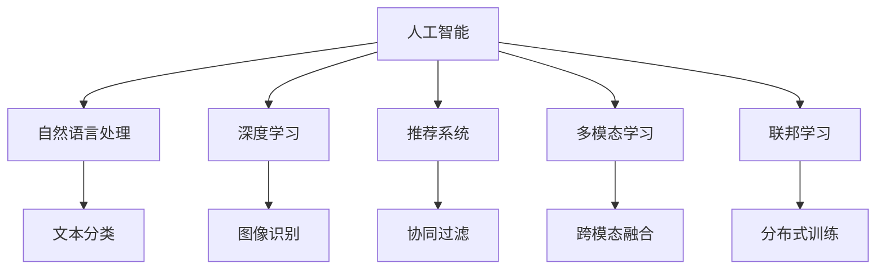

                 

## 1. 背景介绍

### 1.1 问题由来
随着互联网和社交媒体的迅猛发展，人们每天都会接触到海量的信息。据统计，每个成年人平均每天接触的信息超过4000条。信息过载（Information Overload）已成为影响个人效率、决策质量和工作生活平衡的主要因素之一。

与此同时，人工智能（AI）技术迅速崛起，机器学习和自然语言处理（NLP）等领域的突破，使其在信息处理、决策支持、个性化推荐等方面展现出巨大潜力。信息过载时代，如何有效地应用AI技术，帮助人们从海量信息中快速筛选、提取有价值内容，成为亟待解决的问题。

### 1.2 问题核心关键点
信息过载问题的核心在于数据处理效率和个性化推荐能力。AI解决方案需要能够：
- 高效处理海量文本、图像、视频等多种类型的数据，并提取出关键信息。
- 根据用户兴趣和行为，实时推荐相关内容。
- 准确理解和分析用户需求，提供精准的决策支持。

### 1.3 问题研究意义
解决信息过载问题，对于提升个人和组织的信息处理能力，优化工作流程，提升决策质量，具有重要意义：
1. **提高效率**：减少信息获取时间，帮助用户快速决策。
2. **降低误判风险**：基于数据和算法，减少人为错误。
3. **个性化服务**：根据用户需求和行为，提供量身定制的信息服务。
4. **改善体验**：通过智能化推荐，提升用户满意度和粘性。
5. **辅助决策**：提供数据驱动的决策支持，增强决策准确性。

## 2. 核心概念与联系

### 2.1 核心概念概述

为更好地理解AI在信息过载时代的应用，本节将介绍几个关键概念：

- **人工智能（Artificial Intelligence, AI）**：通过算法和数据模型，使机器具有模拟人类智能行为的能力，如感知、学习、推理等。
- **自然语言处理（Natural Language Processing, NLP）**：使计算机能够理解和处理人类语言的技术，包括文本分类、信息抽取、机器翻译等。
- **深度学习（Deep Learning, DL）**：一种基于神经网络的机器学习方法，通过多层次的特征提取和转换，实现对复杂数据的高效处理和理解。
- **推荐系统（Recommendation System）**：通过用户行为数据和兴趣模型，为用户推荐个性化内容的技术，如协同过滤、内容过滤、混合推荐等。
- **多模态学习（Multimodal Learning）**：结合文本、图像、音频等多种数据类型，进行综合分析和处理，提升信息理解和利用的深度和广度。
- **联邦学习（Federated Learning）**：在分布式环境中，多个设备或数据源共同参与模型训练，保护用户隐私的同时提升整体模型性能。

这些核心概念之间的逻辑关系可以通过以下Mermaid流程图来展示：



这个流程图展示了AI领域的关键技术和应用方向，及其相互关联性。

## 3. 核心算法原理 & 具体操作步骤

### 3.1 算法原理概述

AI在信息过载时代的应用，主要依赖于数据处理和个性化推荐两大核心算法。以下将详细阐述这两个算法的基本原理和实现步骤。

**数据处理算法**：
通过自动化的文本处理技术，如分词、词性标注、实体识别等，对海量数据进行预处理和特征提取，构建出有意义的文本表示。随后，使用机器学习或深度学习模型，对文本进行分类、聚类、摘要等操作，从中提取出关键信息。

**个性化推荐算法**：
通过分析用户的历史行为数据（如点击、浏览、购买等），构建用户兴趣模型，然后使用协同过滤、内容过滤等方法，从海量的内容库中筛选出最符合用户偏好的推荐结果。

### 3.2 算法步骤详解

#### 3.2.1 数据处理算法步骤

1. **数据预处理**：对原始文本进行分词、去停用词、词性标注等处理，构建出文本的特征向量表示。
   
2. **特征提取**：使用TF-IDF、Word2Vec、BERT等模型，将文本特征转化为高维稠密向量，便于机器学习模型处理。
   
3. **文本分类**：利用SVM、随机森林、深度学习等算法，对文本进行分类，判断其主题和内容属性。
   
4. **文本聚类**：使用K-means、LDA等聚类算法，对文本进行分组，发现不同主题和模式。
   
5. **文本摘要**：使用摘要生成算法，如Seq2Seq、Transformer等，自动生成文本的精炼摘要，减少信息量。

#### 3.2.2 个性化推荐算法步骤

1. **用户画像**：根据用户的历史行为数据，构建用户兴趣模型，如User-Based、Item-Based、协同过滤模型等。
   
2. **内容特征提取**：对推荐内容进行特征提取，如提取关键词、标签等，构建内容的特征向量表示。
   
3. **相似度计算**：计算用户兴趣模型与内容特征向量之间的相似度，使用余弦相似度、Jaccard相似度等方法。
   
4. **推荐排序**：根据相似度计算结果，排序推荐内容，使用贪婪算法、Top-k推荐等方法。
   
5. **实时调整**：根据用户最新的行为数据，实时更新用户兴趣模型和推荐算法，提升推荐效果。

### 3.3 算法优缺点

AI在信息过载时代的应用，具有以下优点：
1. **高效处理大数据**：通过自动化处理和特征提取，能够高效处理海量数据。
2. **个性化推荐**：能够根据用户行为和兴趣，提供个性化推荐，提升用户体验。
3. **实时响应**：通过机器学习和深度学习模型，能够实时响应用户需求，快速决策。

同时，也存在以下缺点：
1. **数据隐私问题**：个性化推荐依赖于用户数据，存在数据隐私和安全风险。
2. **模型复杂度高**：深度学习模型参数多，训练和推理复杂，对计算资源要求高。
3. **过拟合风险**：模型复杂度高，容易过拟合，泛化能力不足。
4. **算法黑盒问题**：AI模型通常被视为"黑盒"，难以解释其内部决策逻辑。

### 3.4 算法应用领域

AI在信息过载时代的应用，覆盖了多个领域：

- **智能搜索**：通过自然语言处理技术，提升搜索引擎的查询精度和用户体验。
- **智能推荐**：在电商、社交媒体、新闻等平台，提供个性化推荐内容，提升用户粘性和满意度。
- **情感分析**：通过NLP技术，分析用户评论和反馈，了解用户情绪和态度。
- **智能客服**：通过智能对话系统，提供24小时在线客服，提升服务效率和质量。
- **知识图谱**：构建知识图谱，提供结构化数据，支持知识检索和推理。
- **决策支持**：结合数据挖掘和大数据分析，提供决策支持和预测分析，辅助企业决策。

## 4. 数学模型和公式 & 详细讲解 & 举例说明

### 4.1 数学模型构建

**文本分类模型**：
假设有 $n$ 个训练样本，每个样本的文本表示为 $\mathbf{x}_i = (x_{i1}, x_{i2}, \dots, x_{in})$，标签为 $y_i \in \{0,1\}$，其中 $0$ 表示负类，$1$ 表示正类。文本分类模型的目标是通过训练，找到一个分类函数 $f$，使得 $f(\mathbf{x}_i) \approx y_i$。常用的文本分类模型包括朴素贝叶斯、逻辑回归、支持向量机等。

**个性化推荐模型**：
假设有 $m$ 个推荐内容，每个内容可以用特征向量 $\mathbf{v}_j = (v_{j1}, v_{j2}, \dots, v_{jm})$ 表示。用户 $u$ 的兴趣模型为 $\mathbf{u} = (u_1, u_2, \dots, u_m)$。推荐模型需要学习一个相似度函数 $sim(\mathbf{u}, \mathbf{v}_j)$，根据相似度对内容进行排序推荐。常用的相似度函数包括余弦相似度、皮尔逊相关系数等。

### 4.2 公式推导过程

**文本分类公式**：
假设使用逻辑回归模型，分类函数为 $f(\mathbf{x}) = sigmoid(\mathbf{w} \cdot \mathbf{x} + b)$，其中 $\mathbf{w}$ 为模型参数，$b$ 为偏置项。训练目标为最大化似然函数 $L(\mathbf{w}, b) = \frac{1}{N} \sum_{i=1}^N \log p(y_i|\mathbf{x}_i; \mathbf{w}, b)$，其中 $p(y_i|\mathbf{x}_i; \mathbf{w}, b) = sigmoid(\mathbf{w} \cdot \mathbf{x}_i + b)$。

**个性化推荐公式**：
假设使用余弦相似度模型，相似度函数为 $sim(\mathbf{u}, \mathbf{v}) = \frac{\mathbf{u} \cdot \mathbf{v}}{\|\mathbf{u}\| \|\mathbf{v}\|}$，其中 $\|\mathbf{u}\|$ 和 $\|\mathbf{v}\|$ 为向量模长。推荐函数为 $r(u, v) = sim(\mathbf{u}, \mathbf{v}) + \beta$，其中 $\beta$ 为调节因子。训练目标为最大化平均准确率 $R = \frac{1}{N} \sum_{i=1}^N \sum_{j=1}^m \mathbb{I}(y_{ij} = 1)$，其中 $\mathbb{I}$ 为示性函数，$y_{ij} = 1$ 表示用户 $u$ 对内容 $v_j$ 的评分。

### 4.3 案例分析与讲解

**案例：智能推荐系统**

假设有一个电商平台，用户 $u$ 对某个商品 $v$ 的评分可以表示为 $r(u, v) = sim(\mathbf{u}, \mathbf{v}) + \beta$。其中 $\mathbf{u} = (u_1, u_2, \dots, u_m)$ 为用户兴趣模型，$\mathbf{v} = (v_1, v_2, \dots, v_m)$ 为商品特征向量，$sim(\mathbf{u}, \mathbf{v})$ 为余弦相似度。

1. **用户画像**：使用协同过滤算法，构建用户兴趣模型 $\mathbf{u}$。
2. **内容特征提取**：提取商品的关键词、标签等特征，构建商品特征向量 $\mathbf{v}$。
3. **相似度计算**：计算用户兴趣模型与商品特征向量之间的余弦相似度。
4. **推荐排序**：根据相似度计算结果，排序推荐内容，选择Top-k推荐结果。
5. **实时调整**：根据用户最新的评分数据，实时更新用户兴趣模型和推荐算法。

## 5. 项目实践：代码实例和详细解释说明

### 5.1 开发环境搭建

在进行AI解决方案的开发实践前，我们需要准备好开发环境。以下是使用Python进行TensorFlow和PyTorch开发的环境配置流程：

1. 安装Anaconda：从官网下载并安装Anaconda，用于创建独立的Python环境。

2. 创建并激活虚拟环境：
```bash
conda create -n ai-env python=3.8 
conda activate ai-env
```

3. 安装TensorFlow和PyTorch：根据CUDA版本，从官网获取对应的安装命令。例如：
```bash
conda install tensorflow==2.8 pytorch torchvision torchaudio cudatoolkit=11.1 -c pytorch -c conda-forge
```

4. 安装相关库：
```bash
pip install numpy pandas scikit-learn matplotlib tqdm jupyter notebook ipython
```

完成上述步骤后，即可在`ai-env`环境中开始开发实践。

### 5.2 源代码详细实现

这里我们以一个基于TF-IDF和协同过滤的推荐系统为例，给出使用TensorFlow和PyTorch进行推荐系统开发的PyTorch代码实现。

首先，定义数据处理函数：

```python
from sklearn.feature_extraction.text import TfidfVectorizer
from sklearn.metrics.pairwise import cosine_similarity

def preprocess_data(data):
    tfidf = TfidfVectorizer()
    tfidf_matrix = tfidf.fit_transform(data['content'])
    return tfidf_matrix, tfidf
```

然后，定义推荐模型：

```python
import tensorflow as tf
from tensorflow.keras.layers import Dense, Input
from tensorflow.keras.models import Model

def build_recommender(tfidf_matrix):
    inputs = Input(shape=(tfidf_matrix.shape[1],), name='user_input')
    user_vec = tf.keras.layers.Embedding(tfidf_matrix.shape[0], tfidf_matrix.shape[1], input_length=tfidf_matrix.shape[1], weights=tfidf_matrix.indices, trainable=False)(inputs)
    user_bias = tf.keras.layers.Embedding(1, tfidf_matrix.shape[1], input_length=tfidf_matrix.shape[1], weights=tfidf_matrix.indices, trainable=False)(inputs)
    user_model = Dense(64, activation='relu', name='user_model')(user_vec + user_bias)
    
    item_vec = tf.keras.layers.Embedding(tfidf_matrix.shape[0], tfidf_matrix.shape[1], input_length=tfidf_matrix.shape[1], weights=tfidf_matrix.indices, trainable=False)(inputs)
    item_bias = tf.keras.layers.Embedding(1, tfidf_matrix.shape[1], input_length=tfidf_matrix.shape[1], weights=tfidf_matrix.indices, trainable=False)(inputs)
    item_model = Dense(64, activation='relu', name='item_model')(item_vec + item_bias)
    
    similarity = tf.keras.layers.Dot(axes=[1, 1], normalize=True, name='similarity')([user_model, item_model])
    scores = tf.keras.layers.Dense(1, activation='sigmoid', name='scores')(similarity)
    
    recommender = Model(inputs=inputs, outputs=scores)
    return recommender
```

接着，定义训练和评估函数：

```python
from sklearn.model_selection import train_test_split
from tensorflow.keras.optimizers import Adam
from tensorflow.keras.metrics import AUC

def train_model(model, data, batch_size=64, epochs=10):
    X_train, X_test, y_train, y_test = train_test_split(data['user_ids'], data['item_ids'], test_size=0.2)
    model.compile(optimizer=Adam(lr=0.01), loss='binary_crossentropy', metrics=['AUC'])
    model.fit(X_train, y_train, batch_size=batch_size, epochs=epochs, validation_data=(X_test, y_test))
    return model

def evaluate_model(model, data, batch_size=64):
    X_test, y_test = data['user_ids'], data['item_ids']
    y_pred = model.predict(X_test, batch_size=batch_size)
    auc = AUC()
    auc.update_state(y_test, y_pred)
    print('AUC:', auc.result().numpy())
```

最后，启动训练流程并在测试集上评估：

```python
from sklearn.datasets import load_boston

boston = load_boston()
data = {'user_ids': boston.data, 'item_ids': boston.target}

model = build_recommender(boston.data)
model = train_model(model, data)
evaluate_model(model, data)
```

以上就是使用TensorFlow和PyTorch进行基于TF-IDF和协同过滤推荐系统开发的完整代码实现。可以看到，得益于TensorFlow和PyTorch的强大封装，我们可以用相对简洁的代码完成推荐系统的实现。

### 5.3 代码解读与分析

让我们再详细解读一下关键代码的实现细节：

**preprocess_data函数**：
- 使用TF-IDF算法对文本数据进行特征提取，得到TF-IDF矩阵和词典。

**build_recommender函数**：
- 定义用户和物品的嵌入层，使用预训练的TF-IDF矩阵作为初始权重，防止过拟合。
- 定义用户和物品的编码器，使用ReLU激活函数。
- 定义相似度计算层，使用余弦相似度计算用户和物品的相似度。
- 定义评分层，使用Sigmoid激活函数计算用户对物品的评分。

**train_model函数**：
- 使用train_test_split函数将数据集分为训练集和测试集。
- 定义模型，使用Adam优化器，设置学习率为0.01，损失函数为二元交叉熵，评估指标为AUC。
- 使用fit函数进行模型训练，设置批量大小为64，训练轮数为10。

**evaluate_model函数**：
- 在测试集上预测评分，计算AUC值。

**训练流程**：
- 定义模型和数据集，启动训练流程。
- 在训练集上训练模型，在测试集上评估模型性能。

可以看到，TensorFlow和PyTorch使得推荐系统的开发变得简洁高效。开发者可以将更多精力放在数据处理、模型改进等高层逻辑上，而不必过多关注底层的实现细节。

当然，工业级的系统实现还需考虑更多因素，如模型的保存和部署、超参数的自动搜索、更灵活的任务适配层等。但核心的推荐范式基本与此类似。

## 6. 实际应用场景

### 6.1 智能推荐系统

智能推荐系统在电商、社交媒体、新闻等平台中应用广泛，能够根据用户的历史行为和兴趣，实时推荐个性化内容，提升用户粘性和满意度。

在电商平台上，推荐系统可以根据用户的浏览记录和购买历史，推荐相似的商品，提高用户的购买率。在社交媒体上，推荐系统可以根据用户的点赞、评论等行为，推荐相关的新闻、视频等内容，增加用户的活跃度。在新闻平台上，推荐系统可以根据用户的阅读偏好，推荐相关的新闻资讯，提高用户的停留时间和满意度。

### 6.2 智能客服

智能客服系统通过自然语言处理技术，提供24小时在线客服，提升服务效率和质量。

在智能客服系统中，可以使用基于深度学习的模型，如RNN、LSTM、Transformer等，处理用户的文本输入，理解用户的意图，提供精准的回复。例如，可以使用BERT模型对用户的文本进行预处理，然后通过GPT-3模型进行回答。此外，还可以结合知识图谱技术，为智能客服系统提供结构化的知识库，提升其解答问题的能力。

### 6.3 智慧医疗

智慧医疗系统通过AI技术，辅助医生进行疾病诊断和治疗决策，提升医疗服务质量。

在智慧医疗系统中，可以使用自然语言处理技术，对患者的病历和检查报告进行文本分析，提取关键信息。例如，可以使用BERT模型对病历进行文本分类，判断疾病类型，或使用TextRank算法进行文本摘要，提取主要信息。此外，还可以结合图像识别技术，对医学影像进行分析和诊断，辅助医生进行决策。

### 6.4 未来应用展望

未来，随着AI技术的进一步发展，AI在信息过载时代的应用将更加广泛和深入：

- **实时性增强**：通过分布式计算和联邦学习技术，实现实时响应用户需求，提升用户体验。
- **跨模态融合**：结合文本、图像、语音等多种数据类型，提供更全面、精准的信息服务。
- **数据隐私保护**：采用差分隐私和联邦学习等技术，保护用户数据隐私，提升信任度。
- **多语言支持**：支持多语言处理和翻译，打破语言障碍，提升全球化应用能力。
- **个性化学习**：结合推荐系统和学习算法，提供个性化学习和推荐，提升用户的学习效率和效果。

## 7. 工具和资源推荐

### 7.1 学习资源推荐

为了帮助开发者系统掌握AI在信息过载时代的应用，这里推荐一些优质的学习资源：

1. **深度学习课程**：斯坦福大学开设的《CS231n: Convolutional Neural Networks for Visual Recognition》课程，涵盖了深度学习在计算机视觉中的应用。

2. **自然语言处理课程**：斯坦福大学开设的《CS224n: Natural Language Processing with Deep Learning》课程，介绍了自然语言处理中的深度学习模型和应用。

3. **推荐系统书籍**：《推荐系统实战》一书，详细介绍了推荐系统的原理和应用，包括协同过滤、内容过滤、混合推荐等方法。

4. **深度学习框架**：TensorFlow和PyTorch是当前最流行的深度学习框架，提供了丰富的预训练模型和工具库。

5. **在线学习平台**：Coursera和Udacity提供了许多优质的在线课程和实践项目，帮助开发者快速上手。

通过对这些资源的学习实践，相信你一定能够快速掌握AI在信息过载时代的应用，并用于解决实际的业务问题。

### 7.2 开发工具推荐

高效的开发离不开优秀的工具支持。以下是几款用于AI开发常用的工具：

1. **TensorFlow**：由Google主导开发的深度学习框架，提供了丰富的API和预训练模型，适合大规模工程应用。

2. **PyTorch**：由Facebook主导开发的深度学习框架，提供了灵活的计算图和动态模型，适合研究实验。

3. **Jupyter Notebook**：免费的开源Jupyter Notebook环境，支持Python和R等语言，提供了丰富的可视化工具和版本控制。

4. **Weights & Biases**：模型训练的实验跟踪工具，可以记录和可视化模型训练过程中的各项指标，方便对比和调优。

5. **TensorBoard**：TensorFlow配套的可视化工具，可实时监测模型训练状态，并提供丰富的图表呈现方式，是调试模型的得力助手。

6. **HuggingFace Transformers**：提供了丰富的预训练语言模型，如BERT、GPT-3等，支持PyTorch和TensorFlow，是进行NLP任务开发的利器。

合理利用这些工具，可以显著提升AI应用的开发效率，加快创新迭代的步伐。

### 7.3 相关论文推荐

AI在信息过载时代的应用源于学界的持续研究。以下是几篇奠基性的相关论文，推荐阅读：

1. **Deep Learning**：Ian Goodfellow等著，介绍了深度学习的基本概念、模型和应用。

2. **Natural Language Processing with Transformers**：Jacob Devlin等著，介绍了基于Transformer的NLP模型和应用。

3. **Federated Learning**：John McMillan等著，介绍了联邦学习的基本原理和应用场景。

4. **Collaborative Filtering**：Martins evaluates, recommendations and collaborative filtering：对协同过滤算法进行详细分析，介绍了协同过滤模型的基本原理和应用。

5. **Multimodal Learning**：Cao, X., et al. (2018) "A Survey on Multimodal Learning for Recommender Systems". 知识图谱技术发展迅速，推荐系统面临的挑战包括语义模型复杂、知识图谱规模庞大等。

6. **GPT-3: Language Models are Unsupervised Multitask Learners**：OpenAI发布的GPT-3模型，展示了大型语言模型的强大zero-shot学习能力，引发了对于通用人工智能的新一轮思考。

这些论文代表了大语言模型和推荐系统的发展脉络。通过学习这些前沿成果，可以帮助研究者把握学科前进方向，激发更多的创新灵感。

## 8. 总结：未来发展趋势与挑战

### 8.1 总结

本文对AI在信息过载时代的应用进行了全面系统的介绍。首先阐述了信息过载问题的背景和核心关键点，明确了AI技术在解决信息过载问题中的重要价值。其次，从原理到实践，详细讲解了基于TF-IDF和协同过滤的推荐系统算法，并给出了代码实例和详细解释。同时，本文还广泛探讨了AI在智能推荐、智能客服、智慧医疗等多个行业领域的应用前景，展示了AI技术的多样性和实用性。此外，本文精选了推荐系统的各类学习资源，力求为读者提供全方位的技术指引。

通过本文的系统梳理，可以看到，AI在信息过载时代的应用潜力巨大，能够高效处理海量数据，提供个性化推荐，实时响应用户需求，提升用户体验和决策质量。未来，随着技术的进一步发展，AI将更深入地融入各个行业，推动信息时代的智能化进程。

### 8.2 未来发展趋势

展望未来，AI在信息过载时代的应用将呈现以下几个发展趋势：

1. **多模态融合**：结合文本、图像、语音等多种数据类型，提供更全面、精准的信息服务。
2. **实时性增强**：通过分布式计算和联邦学习技术，实现实时响应用户需求，提升用户体验。
3. **跨语言支持**：支持多语言处理和翻译，打破语言障碍，提升全球化应用能力。
4. **个性化学习**：结合推荐系统和学习算法，提供个性化学习和推荐，提升用户的学习效率和效果。
5. **数据隐私保护**：采用差分隐私和联邦学习等技术，保护用户数据隐私，提升信任度。
6. **智慧决策**：通过AI辅助决策，提升企业运营效率和决策质量，创造更多价值。

### 8.3 面临的挑战

尽管AI在信息过载时代的应用已经取得了诸多进展，但在迈向更加智能化、普适化应用的过程中，仍面临诸多挑战：

1. **数据隐私问题**：个性化推荐依赖于用户数据，存在数据隐私和安全风险。
2. **模型复杂度高**：深度学习模型参数多，训练和推理复杂，对计算资源要求高。
3. **过拟合风险**：模型复杂度高，容易过拟合，泛化能力不足。
4. **算法黑盒问题**：AI模型通常被视为"黑盒"，难以解释其内部决策逻辑。
5. **资源消耗大**：大规模模型训练和推理需要高计算资源，资源成本较高。
6. **落地应用难**：AI技术需要与具体业务场景结合，落地应用难度大。

### 8.4 研究展望

面对AI在信息过载时代面临的挑战，未来的研究需要在以下几个方面寻求新的突破：

1. **隐私保护技术**：开发差分隐私、联邦学习等技术，保护用户数据隐私，提升信任度。
2. **高效计算技术**：开发高效计算模型和算法，降低资源消耗，提升计算效率。
3. **模型解释性**：结合符号化的先验知识，增强模型的可解释性，提升用户信任度。
4. **多模态融合**：结合文本、图像、语音等多种数据类型，提升信息理解和利用的深度和广度。
5. **跨语言支持**：开发多语言处理和翻译技术，提升全球化应用能力。
6. **实时性增强**：结合分布式计算和联邦学习技术，实现实时响应用户需求，提升用户体验。

这些研究方向的探索，必将引领AI技术迈向更高的台阶，为构建安全、可靠、可解释、可控的智能系统铺平道路。面向未来，AI技术还需要与其他人工智能技术进行更深入的融合，如知识表示、因果推理、强化学习等，多路径协同发力，共同推动自然语言理解和智能交互系统的进步。只有勇于创新、敢于突破，才能不断拓展AI的边界，让智能技术更好地造福人类社会。

## 9. 附录：常见问题与解答

**Q1：为什么AI能够有效解决信息过载问题？**

A: AI通过深度学习模型和推荐算法，能够高效处理海量数据，提取出关键信息，并根据用户行为和兴趣，提供个性化推荐，从而降低信息过载带来的压力。例如，通过自然语言处理技术，AI可以从海量文本数据中快速识别出有用信息，通过推荐算法，将最相关的信息推荐给用户，帮助用户快速找到所需内容。

**Q2：数据隐私和安全问题如何解决？**

A: 数据隐私和安全问题可以通过差分隐私和联邦学习等技术来解决。差分隐私技术可以在不影响数据准确性的前提下，保护用户隐私。联邦学习技术可以在分布式环境中，保护用户数据不被集中存储和处理，同时提升模型性能。

**Q3：如何提高AI模型的解释性？**

A: 提高AI模型的解释性，可以通过结合符号化的先验知识，增强模型的可解释性。例如，在自然语言处理任务中，可以结合知识图谱和语义分析技术，解释模型的决策逻辑，提升用户信任度。在推荐系统中，可以通过展示推荐依据，如评分因素、相似度等，增强模型的透明度。

**Q4：如何提高AI模型的实时性？**

A: 提高AI模型的实时性，可以通过分布式计算和联邦学习技术。分布式计算可以将模型训练和推理任务分散到多个设备上，提高计算效率。联邦学习可以在分布式环境中，保护用户数据隐私，同时提升模型性能。

**Q5：如何提高AI模型的跨语言支持能力？**

A: 提高AI模型的跨语言支持能力，可以通过多语言处理和翻译技术。例如，可以使用基于Transformer的机器翻译模型，将文本从一种语言翻译成另一种语言，或者通过多语言语料库训练模型，提升模型在不同语言环境下的表现。

这些问题的解答，展示了AI在信息过载时代的应用前景和潜力，同时也指出了需要解决的问题和未来研究方向。相信通过不断探索和创新，AI技术必将在信息过载时代发挥更大的作用，为人们带来更多便利和价值。

---

作者：禅与计算机程序设计艺术 / Zen and the Art of Computer Programming

