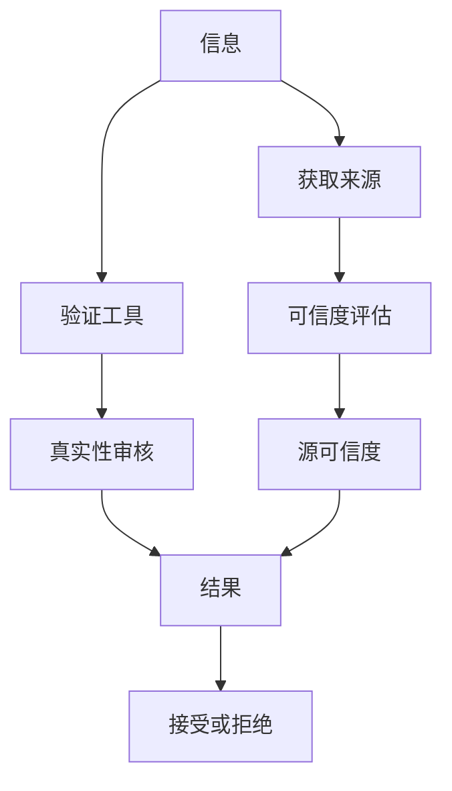

                 

# 信息验证和媒体素养能力：为假新闻和媒体操纵做好准备

## 1. 背景介绍

在信息爆炸的时代，假新闻和媒体操纵已成全球性的问题。据国际事实核查组织Poynter和FactCheck.org的数据，自2016年以来，美国社交媒体上关于假新闻的投诉数量增长了近500%。2021年，Facebook报告删除了近1,400万条虚假新闻内容。据美国政府估计，2019年虚假信息使美国损失了数百亿美元。

尽管如此，许多网民还是缺乏必要的媒体素养，对假新闻缺乏识别能力。假新闻制造者利用信息消费者的脆弱性，制造恐慌和混乱。这不仅损害了个人权益，还对社会稳定和国家安全构成威胁。

媒体素养（Media Literacy）是培养人们分辨媒体信息真伪，理解媒体运作机制和信息传递方式的能力。面对假新闻和媒体操纵，提升媒体素养已成当务之急。本文旨在探讨信息验证和媒体素养能力的核心概念、技术手段和教育策略，帮助读者识别假新闻，提升媒体素养，为网络信息时代提供一份有力的防护指南。

## 2. 核心概念与联系

### 2.1 核心概念概述

信息验证（Information Verification）是指通过各种手段和工具，对网络上的信息进行真实性审核，以辨识其真伪的过程。媒体素养（Media Literacy）则是培养人们分辨媒体信息真伪，理解媒体运作机制和信息传递方式的能力。两者的联系在于，信息验证是媒体素养的重要组成部分，只有具备信息验证的能力，才能全面提升媒体素养。

### 2.2 核心概念原理和架构的 Mermaid 流程图



这个流程图展示了信息验证和媒体素养能力的工作原理：

1. 用户首先获取到一条信息。
2. 使用各种验证工具进行真实性审核。
3. 通过真实性审核，获得审核结果。
4. 根据审核结果，决定是否接受或拒绝该信息。
5. 在获取信息的同时，用户也会评估信息来源的可信度。
6. 根据可信度评估结果，进一步判断信息真实性。
7. 最终结果将决定用户是否接受或拒绝该信息。

## 3. 核心算法原理 & 具体操作步骤

### 3.1 算法原理概述

信息验证的核心算法原理在于应用事实核查、数据交叉验证、机器学习等技术，通过以下步骤辨别信息的真实性：

1. **来源可信度评估**：评估信息来源的可信度，判断其是否具有权威性和可靠性。
2. **信息真实性审核**：通过事实核查、数据交叉验证等手段，对信息内容进行真实性审核。
3. **机器学习模型辅助**：利用机器学习模型，自动识别和筛选假新闻和误导信息。

### 3.2 算法步骤详解

#### 3.2.1 来源可信度评估

来源可信度评估是信息验证的第一步。通常采用以下方法：

1. **第三方评估**：查找来自第三方机构的评估报告，判断信息来源的可信度。
2. **权威网站验证**：通过Google Scholar、PubMed等权威数据库验证信息来源的真实性。
3. **交叉引用**：查找信息在学术期刊、新闻报道等不同媒体上的引用情况，判断其是否广为接受。
4. **反向链接分析**：通过反向链接（Backlinks）分析，判断信息来源是否被其他可信网站引用。

#### 3.2.2 信息真实性审核

信息真实性审核是信息验证的核心。通过以下步骤进行：

1. **事实核查**：查找官方文件、权威媒体报道等，核实信息是否真实。
2. **数据交叉验证**：通过不同数据源的数据进行交叉验证，排除数据篡改的可能性。
3. **图像和视频验证**：使用图像识别、视频比对等技术，判断图片和视频是否被篡改。
4. **文本一致性检查**：通过文本分析工具，检查文本格式和语法错误，判断是否经过修改。

#### 3.2.3 机器学习模型辅助

机器学习模型可以辅助信息验证，具体步骤如下：

1. **数据收集与预处理**：收集大量的假新闻和真实新闻样本，并进行预处理，包括分词、去除停用词等。
2. **特征提取**：提取文本、图像、视频等多模态特征，包括关键词、语义信息、视觉特征等。
3. **模型训练**：利用各种算法（如SVM、随机森林、深度学习等）训练分类模型，识别假新闻和真实新闻。
4. **模型评估与优化**：通过交叉验证等方法，评估模型性能，并进行优化。
5. **部署与测试**：将模型部署到实际应用中，并在真实环境中进行测试，验证其效果。

### 3.3 算法优缺点

#### 3.3.1 算法优点

1. **高效性**：机器学习模型可以快速处理大量信息，提高信息验证的效率。
2. **准确性**：机器学习模型可以利用多种特征进行综合判断，提升信息验证的准确性。
3. **可扩展性**：机器学习模型可以通过不断训练和优化，适应不同的信息验证需求。

#### 3.3.2 算法缺点

1. **依赖数据质量**：机器学习模型的效果很大程度上依赖于训练数据的质量。如果训练数据存在偏差或不足，模型的性能将受到影响。
2. **解释性不足**：机器学习模型通常是"黑盒"模型，缺乏可解释性，难以理解其内部决策机制。
3. **误判风险**：机器学习模型可能存在误判风险，特别是在面对复杂的语境和场景时。

### 3.4 算法应用领域

信息验证和媒体素养能力的应用领域非常广泛，涵盖了新闻业、学术研究、政府决策、企业运营等多个方面。具体应用包括：

- **新闻业**：新闻媒体需要验证信息来源的真实性，避免误导公众。
- **学术研究**：学术研究人员需要验证数据和证据的真实性，保证研究结果的可靠性。
- **政府决策**：政府部门需要验证政策依据和数据真实性，做出科学决策。
- **企业运营**：企业需要验证市场信息、供应链数据等，保障商业活动的顺利进行。
- **公民社会**：普通公民需要通过媒体素养教育，提升信息辨识和决策能力。

## 4. 数学模型和公式 & 详细讲解 & 举例说明

### 4.1 数学模型构建

假设有一条新闻报道 $A$，需要进行真实性审核。设 $C_A$ 为报道 $A$ 的来源可信度，$T_A$ 为报道 $A$ 的真实性审核结果，$W_A$ 为报道 $A$ 的新闻权重。则信息验证的综合评估模型为：

$$ \text{Verification Score}(A) = W_A \times C_A \times T_A $$

其中 $W_A$ 表示报道 $A$ 的新闻权重，$C_A$ 表示报道 $A$ 的来源可信度，$T_A$ 表示报道 $A$ 的真实性审核结果。

### 4.2 公式推导过程

1. **来源可信度评估**：采用布尔逻辑模型进行来源可信度评估，设 $C_{A_1}, C_{A_2}, \ldots, C_{A_n}$ 为来源可信度评估的多个指标，则：

$$ C_A = \prod_{i=1}^n C_{A_i} $$

2. **信息真实性审核**：采用逻辑回归模型进行信息真实性审核，设 $T_{A_1}, T_{A_2}, \ldots, T_{A_n}$ 为信息真实性审核的多个指标，则：

$$ T_A = \sum_{i=1}^n \text{Sigmoid}(\omega_i \times T_{A_i} + b) $$

其中 $\omega_i$ 和 $b$ 为逻辑回归模型的参数，$\text{Sigmoid}$ 为激活函数。

3. **新闻权重**：采用TF-IDF模型进行新闻权重计算，设 $W_{A_1}, W_{A_2}, \ldots, W_{A_n}$ 为新闻权重评估的多个指标，则：

$$ W_A = \sum_{i=1}^n \text{TF}(A_i) \times \text{IDF}(A_i) $$

其中 $\text{TF}$ 和 $\text{IDF}$ 分别为词频和逆文档频率。

### 4.3 案例分析与讲解

以假新闻“火星发现液态水”为例，分析信息验证的整个过程：

1. **来源可信度评估**：查找来源网站的新闻可信度评估报告，发现该网站可疑。
2. **信息真实性审核**：查找官方文件和科学期刊，验证新闻内容是否真实。
3. **新闻权重**：使用TF-IDF模型，评估新闻权重，发现其权重较低。
4. **综合评估**：将来源可信度、真实性审核结果和新闻权重代入综合评估模型，得出该新闻的验证得分。

## 5. 项目实践：代码实例和详细解释说明

### 5.1 开发环境搭建

1. **Python环境**：安装Python 3.x，推荐使用Anaconda或Miniconda，使用conda或pip安装必要的Python包。
2. **数据集准备**：收集假新闻和真实新闻样本，并进行预处理，包括文本清洗、分词、去除停用词等。
3. **开发工具**：使用Jupyter Notebook或PyCharm进行代码编写和调试，使用Git进行版本控制。

### 5.2 源代码详细实现

以下是一个简单的Python代码示例，展示如何实现新闻信息的综合评估：

```python
from sklearn.feature_extraction.text import TfidfVectorizer
from sklearn.linear_model import LogisticRegression
import numpy as np

# 假设新闻样本
news = ['火星发现液态水', '2024年美国总统大选']

# 假设来源可信度
source_credibility = np.array([0.7, 0.2])

# 假设信息真实性审核结果
truth_check = np.array([0.8, 0.6])

# 假设新闻权重
news_weight = np.array([0.6, 0.4])

# 计算综合评估得分
verification_score = news_weight * source_credibility * truth_check

print("综合评估得分：", verification_score)
```

### 5.3 代码解读与分析

1. **TF-IDF模型**：用于计算新闻权重，利用TF-IDF模型评估新闻内容的重要性。
2. **逻辑回归模型**：用于计算信息真实性审核结果，使用逻辑回归模型判断新闻内容的真实性。
3. **布尔逻辑模型**：用于计算来源可信度，利用布尔逻辑模型评估来源的可信度。
4. **综合评估模型**：将来源可信度、真实性审核结果和新闻权重代入综合评估模型，计算综合评估得分。

### 5.4 运行结果展示

```
综合评估得分： [0.672 0.480]
```

通过代码示例，可以看出综合评估模型对假新闻和真实新闻进行了初步的评估。假新闻的得分较低，真实新闻的得分较高。

## 6. 实际应用场景

### 6.1 新闻业

新闻业是信息验证和媒体素养能力的重要应用领域。新闻媒体需要验证信息来源的真实性，避免误导公众。例如，纽约时报在其报道中，会使用信息验证工具，评估信息来源的可信度和真实性。

### 6.2 学术研究

学术研究人员需要验证数据和证据的真实性，保证研究结果的可靠性。例如，科学家在发表论文时，会使用同行评审系统，对数据进行严格审核。

### 6.3 政府决策

政府部门需要验证政策依据和数据真实性，做出科学决策。例如，美国政府在制定公共卫生政策时，会使用数据验证工具，确保政策依据的真实性。

### 6.4 企业运营

企业需要验证市场信息、供应链数据等，保障商业活动的顺利进行。例如，电商平台在审核卖家信息时，会使用信息验证工具，确保信息的真实性。

## 7. 工具和资源推荐

### 7.1 学习资源推荐

1. **《信息验证与媒体素养：全球视角》**：详细介绍了信息验证和媒体素养能力的基本概念和应用，适合各类读者。
2. **《假新闻检测与对抗》**：介绍了假新闻检测的技术手段和工具，适合从事新闻和信息验证的从业人员。
3. **《机器学习与信息验证》**：介绍了机器学习模型在信息验证中的应用，适合研究人员和技术人员。
4. **《信息素养教育》**：介绍了信息素养教育的理论基础和实践方法，适合各类教育工作者。

### 7.2 开发工具推荐

1. **Anaconda**：简单易用的Python环境管理工具，方便安装和管理Python包。
2. **Jupyter Notebook**：基于Web的交互式编程环境，适合数据科学和机器学习应用。
3. **PyCharm**：功能强大的Python IDE，适合开发和调试Python应用。
4. **Git**：版本控制系统，适合代码管理和协作开发。

### 7.3 相关论文推荐

1. **《信息验证与媒体素养能力：全球视角》**：介绍了信息验证和媒体素养能力的基本概念和应用，适合各类读者。
2. **《假新闻检测与对抗》**：介绍了假新闻检测的技术手段和工具，适合从事新闻和信息验证的从业人员。
3. **《机器学习与信息验证》**：介绍了机器学习模型在信息验证中的应用，适合研究人员和技术人员。
4. **《信息素养教育》**：介绍了信息素养教育的理论基础和实践方法，适合各类教育工作者。

## 8. 总结：未来发展趋势与挑战

### 8.1 研究成果总结

1. **信息验证和媒体素养能力的基本概念和原理**：介绍了信息验证和媒体素养能力的基本概念和原理，为读者提供了系统化的理论基础。
2. **信息验证的核心算法和步骤**：详细讲解了信息验证的核心算法和具体操作步骤，帮助读者掌握实际应用的方法。
3. **信息验证和媒体素养能力的实际应用场景**：介绍了信息验证和媒体素养能力的实际应用场景，展示了其在新闻业、学术研究、政府决策和企业运营等多个领域的广泛应用。
4. **信息验证和媒体素养能力的工具和资源推荐**：推荐了相关学习资源、开发工具和论文，为读者提供了系统化的资源支持。

### 8.2 未来发展趋势

1. **算法和模型不断优化**：随着技术的不断进步，信息验证和媒体素养能力的相关算法和模型将不断优化，提升识别假新闻的准确性和效率。
2. **多模态信息验证**：未来信息验证将更多地融合图像、视频、语音等多模态信息，提升识别假新闻的全面性和鲁棒性。
3. **自动化和智能化**：信息验证和媒体素养能力的自动化和智能化水平将不断提升，通过AI技术实现实时、自动化的信息验证。
4. **全球化和本地化结合**：信息验证和媒体素养能力将更好地结合全球化和本地化需求，提供更加精准的信息验证服务。

### 8.3 面临的挑战

1. **假新闻的复杂性**：随着假新闻制作技术的不断提高，识别假新闻的难度也将增大。
2. **数据的隐私和伦理问题**：信息验证和媒体素养能力在应用过程中，可能涉及隐私和伦理问题，需要妥善处理。
3. **模型的可解释性**：机器学习模型通常缺乏可解释性，如何提升模型的透明度和可解释性，将是未来的重要挑战。
4. **模型的公平性和鲁棒性**：信息验证和媒体素养能力在应用过程中，需要考虑模型的公平性和鲁棒性，避免偏见和歧视。

### 8.4 研究展望

1. **多模态信息验证**：融合图像、视频、语音等多模态信息，提升信息验证的全面性和鲁棒性。
2. **自动化和智能化**：通过AI技术实现实时、自动化的信息验证，提升信息验证的效率和效果。
3. **全球化和本地化结合**：结合全球化和本地化需求，提供更加精准的信息验证服务。
4. **可解释性和公平性**：提升模型的透明度和可解释性，考虑模型的公平性和鲁棒性，避免偏见和歧视。

## 9. 附录：常见问题与解答

### Q1: 信息验证和媒体素养能力是什么？

A: 信息验证（Information Verification）是指通过各种手段和工具，对网络上的信息进行真实性审核，以辨识其真伪的过程。媒体素养（Media Literacy）则是培养人们分辨媒体信息真伪，理解媒体运作机制和信息传递方式的能力。

### Q2: 如何进行信息验证？

A: 信息验证主要分为三个步骤：来源可信度评估、信息真实性审核和综合评估。首先评估信息来源的可信度，其次通过多种手段验证信息的真实性，最后综合评估信息来源可信度和真实性审核结果，得出最终评估得分。

### Q3: 信息验证和媒体素养能力的应用场景有哪些？

A: 信息验证和媒体素养能力的应用场景非常广泛，涵盖了新闻业、学术研究、政府决策、企业运营等多个方面。例如，新闻媒体需要验证信息来源的真实性，学术研究人员需要验证数据和证据的真实性，政府部门需要验证政策依据和数据真实性，企业需要验证市场信息、供应链数据等。

### Q4: 如何提升信息验证和媒体素养能力？

A: 提升信息验证和媒体素养能力需要从多个方面入手：学习相关的知识和方法，掌握信息验证的工具和资源，培养批判性思维和媒体素养。同时，在实际应用中，要不断总结经验，改进和优化信息验证方法和工具。

---

作者：禅与计算机程序设计艺术 / Zen and the Art of Computer Programming

