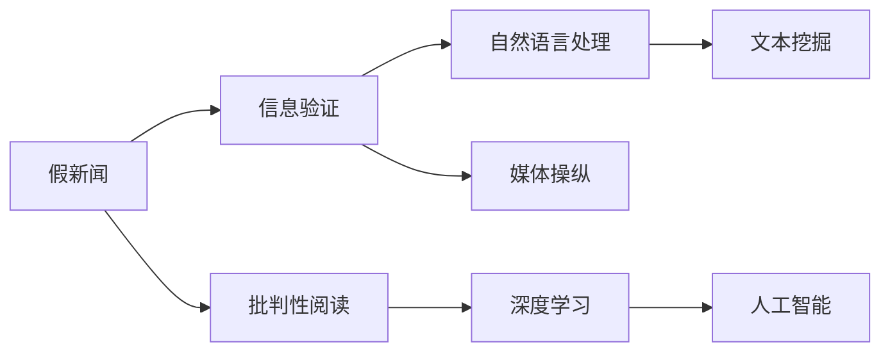

                 

# 信息验证和批判性阅读指南：在假新闻和媒体操纵的时代导航

> 关键词：假新闻, 信息验证, 批判性阅读, 媒体操纵, 深度学习, 自然语言处理, 文本挖掘, 人工智能, 机器学习

## 1. 背景介绍

在信息爆炸的现代社会，我们每天被海量信息所淹没。互联网时代的“后真相”现象愈发凸显，假新闻、虚假信息以及媒体操纵行为屡见不鲜。2020年新冠疫情期间，网络上涌现了大量未经证实的信息，对社会秩序和公共安全产生了重大影响。虚假信息的泛滥不仅损害公众利益，还削弱了公众对媒体的信任。

针对这一问题，本文将基于深度学习和自然语言处理技术，探讨信息验证和批判性阅读的方法和工具。深度学习在信息处理和特征抽取方面表现卓越，而自然语言处理技术则擅长处理文本数据，具有较强的文本理解能力。

## 2. 核心概念与联系

### 2.1 核心概念概述

在假新闻和媒体操纵的语境下，核心概念主要包括：

- **假新闻**：故意捏造、扭曲、夸大或夸小事实信息，旨在误导读者。
- **信息验证**：使用数据分析和人工智能技术，对信息来源、内容、传播路径进行全面审查，以确定信息真伪。
- **批判性阅读**：读者在获取信息时，通过系统性思考和深度分析，识别信息的真实性和可靠性。
- **媒体操纵**：媒体通过不实报道、误导性标题、偏见性评论等手段，影响公众观点和决策。
- **深度学习**：一种基于神经网络的机器学习技术，擅长从复杂数据中提取模式和特征。
- **自然语言处理**：研究计算机如何理解、处理和生成人类语言的学科。
- **文本挖掘**：从文本数据中挖掘出有用信息的技术，如情感分析、实体识别等。
- **人工智能**：使计算机系统具备人类智能的技术，特别是通过机器学习实现自主决策和行为。

### 2.2 核心概念原理和架构的 Mermaid 流程图



这个流程图展示了假新闻与信息验证、批判性阅读之间的关系，以及这些核心概念如何通过自然语言处理、深度学习和人工智能技术相互作用。

## 3. 核心算法原理 & 具体操作步骤

### 3.1 算法原理概述

信息验证和批判性阅读的核心算法主要是基于深度学习技术和自然语言处理技术。其基本流程如下：

1. **数据收集与预处理**：收集相关文本数据，包括新闻、社交媒体帖子、评论等。对这些数据进行预处理，如去除停用词、分词、标准化等。
2. **特征提取与向量化**：使用自然语言处理技术，将文本数据转化为计算机可以处理的向量形式。常用的特征提取方法包括词袋模型、TF-IDF、Word2Vec等。
3. **模型训练与评估**：使用深度学习模型（如卷积神经网络CNN、循环神经网络RNN、Transformer等）对数据进行训练，并评估模型的性能。
4. **信息验证与批判性阅读**：基于训练好的模型，对输入的文本数据进行信息验证和批判性阅读分析。

### 3.2 算法步骤详解

#### 3.2.1 数据收集与预处理

数据收集可以通过网络爬虫、API接口、公共数据集等渠道进行。常用的数据集包括的事实核查网站（Fact-Checking Websites）和假新闻检测数据集（Fake News Detection Datasets）。

预处理步骤包括：

1. **去噪与清洗**：去除无用信息、处理缺失数据。
2. **分词与标准化**：将文本转换为分词形式，并进行拼写、大小写、标点等标准化处理。
3. **去除停用词**：过滤掉常见但无意义的停用词，如“的”、“是”等。
4. **特征提取**：使用NLP工具（如NLTK、SpaCy等）提取文本特征，如词频、词性、TF-IDF等。

#### 3.2.2 特征提取与向量化

特征提取与向量化是信息验证和批判性阅读的重要步骤。常用的方法包括：

1. **词袋模型（Bag of Words, BoW）**：将文本转换为词频向量，简单且高效。
2. **TF-IDF（Term Frequency-Inverse Document Frequency）**：考虑词频的同时，还引入词在文档中的重要性。
3. **Word2Vec**：将单词映射为向量，利用词向量之间的相似性，提取语义信息。
4. **BERT**：使用预训练的语言模型，可以捕获更复杂的语义关系。

#### 3.2.3 模型训练与评估

深度学习模型通常需要大量的标注数据进行训练。常用的模型包括：

1. **卷积神经网络（CNN）**：擅长提取局部特征，常用于图像处理。
2. **循环神经网络（RNN）**：能够处理序列数据，适用于文本分类、情感分析等任务。
3. **Transformer**：使用自注意力机制，在语言模型任务中表现优异。

训练与评估步骤包括：

1. **模型构建与训练**：选择合适的模型结构，设置超参数，进行模型训练。
2. **交叉验证与调参**：使用交叉验证评估模型性能，调整超参数。
3. **评估指标**：使用准确率、精确率、召回率、F1值等指标评估模型效果。

#### 3.2.4 信息验证与批判性阅读

基于训练好的模型，对输入的文本数据进行信息验证和批判性阅读分析。主要步骤如下：

1. **信息来源验证**：判断信息来源的可靠性和权威性。
2. **内容真实性验证**：通过自然语言处理技术，识别文本中的关键信息点，与可靠来源进行比对。
3. **传播路径分析**：分析信息的传播路径，识别传播过程中的干扰因素。
4. **情感分析与主题挖掘**：使用深度学习模型进行情感分析和主题挖掘，了解信息背后的情感倾向和主题。
5. **用户行为分析**：分析用户对信息的互动行为，判断信息的接受度和传播效果。

### 3.3 算法优缺点

深度学习和自然语言处理技术在信息验证和批判性阅读中有以下优缺点：

#### 优点

1. **高精度与自动化**：深度学习模型能够高效地从大量数据中学习特征，提供高精度的信息验证结果。
2. **可扩展性**：自然语言处理技术可以应用于多种文本数据，具有较强的通用性。
3. **自动化**：通过自动化工具，可以快速分析大量信息，减少人工审核成本。

#### 缺点

1. **数据依赖**：深度学习模型的性能依赖于训练数据的质量和数量，缺乏高质量数据会影响模型效果。
2. **解释性不足**：深度学习模型的决策过程缺乏解释性，难以理解其内部机制。
3. **高资源消耗**：深度学习模型需要大量的计算资源和时间进行训练和推理，对硬件要求较高。
4. **误判风险**：深度学习模型可能存在过拟合风险，对特定数据集过度适应，导致误判。

### 3.4 算法应用领域

深度学习与自然语言处理技术在假新闻和媒体操纵领域有广泛的应用，包括：

1. **假新闻检测**：通过模型训练，检测和标记假新闻，提供可靠的新闻来源建议。
2. **信息可信度评估**：使用自然语言处理技术，评估信息的可信度，辅助新闻编辑和信息筛选。
3. **用户行为分析**：分析用户对信息的互动行为，识别信息传播中的偏见和操纵。
4. **舆论引导与矫正**：利用深度学习模型，识别和矫正媒体操纵行为，引导公众正确看待新闻信息。
5. **舆情监测与预警**：通过文本挖掘技术，监测社会舆情，及时预警潜在信息风险。

## 4. 数学模型和公式 & 详细讲解 & 举例说明

### 4.1 数学模型构建

基于深度学习的信息验证和批判性阅读模型可以表示为：

$$
M = F(x, \theta)
$$

其中，$x$ 表示输入的文本数据，$\theta$ 表示模型参数。$F$ 表示深度学习模型，如CNN、RNN或Transformer。

信息验证模型的目标函数为：

$$
\mathcal{L} = \sum_{i=1}^N \mathcal{L}_i
$$

其中，$\mathcal{L}_i$ 表示对第 $i$ 个文本数据的信息验证损失。

### 4.2 公式推导过程

以Transformer模型为例，其编码器-解码器的结构如下：

$$
\begin{aligned}
\text{Encoder}(x) &= \text{Self-Attention}(x) + \text{FeedForward}(x) \\
\text{Decoder}(y) &= \text{Softmax}(\text{Self-Attention}(y)) + \text{Softmax}(\text{Attention}(\text{Encoder}(x)))
\end{aligned}
$$

其中，$\text{Self-Attention}$ 表示自注意力机制，$\text{FeedForward}$ 表示前向传播，$\text{Softmax}$ 表示归一化处理。

### 4.3 案例分析与讲解

以假新闻检测为例，训练一个基于Transformer的假新闻检测模型：

1. **数据准备**：收集假新闻和真实新闻的数据集，进行预处理和特征提取。
2. **模型构建**：选择Transformer模型作为基础架构，设计信息验证的输出层。
3. **模型训练**：使用交叉验证评估模型性能，调整超参数，进行模型训练。
4. **模型评估**：在测试集上评估模型效果，使用混淆矩阵、ROC曲线等指标。
5. **模型应用**：将训练好的模型部署到生产环境，实时验证信息真实性。

## 5. 项目实践：代码实例和详细解释说明

### 5.1 开发环境搭建

以下是使用Python和PyTorch搭建信息验证项目的开发环境：

1. **安装Python**：
   ```
   python3 -m ensurepip --default-pip
   ```

2. **安装PyTorch**：
   ```
   pip install torch torchvision torchaudio
   ```

3. **安装Transformer库**：
   ```
   pip install transformers
   ```

4. **安装NLP工具库**：
   ```
   pip install nltk
   spacy
   ```

5. **安装其他依赖**：
   ```
   pip install pandas numpy scikit-learn
   ```

### 5.2 源代码详细实现

以下是一个使用Transformer进行假新闻检测的示例代码：

```python
import torch
import torch.nn as nn
import torch.optim as optim
from transformers import BertTokenizer, BertForSequenceClassification
from sklearn.model_selection import train_test_split
from sklearn.metrics import accuracy_score, precision_recall_fscore_support

# 定义训练函数
def train(model, optimizer, train_loader, device, num_epochs):
    model.train()
    for epoch in range(num_epochs):
        total_loss = 0
        correct = 0
        for batch in train_loader:
            input_ids = batch["input_ids"].to(device)
            attention_mask = batch["attention_mask"].to(device)
            labels = batch["labels"].to(device)
            
            model.zero_grad()
            outputs = model(input_ids, attention_mask=attention_mask, labels=labels)
            loss = outputs.loss
            total_loss += loss.item()
            loss.backward()
            optimizer.step()
            correct += torch.argmax(outputs.logits, dim=1).eq(labels).sum().item()
        print(f"Epoch {epoch+1}, Loss: {total_loss/len(train_loader)}, Accuracy: {correct/len(train_loader)}")

# 定义评估函数
def evaluate(model, test_loader, device):
    model.eval()
    total_correct = 0
    total_labels = 0
    for batch in test_loader:
        input_ids = batch["input_ids"].to(device)
        attention_mask = batch["attention_mask"].to(device)
        labels = batch["labels"].to(device)
        
        with torch.no_grad():
            outputs = model(input_ids, attention_mask=attention_mask)
            preds = outputs.logits.argmax(dim=1)
            total_correct += preds.eq(labels).sum().item()
            total_labels += labels.numel()
    return total_correct / total_labels

# 加载预训练模型和分词器
tokenizer = BertTokenizer.from_pretrained('bert-base-uncased')
model = BertForSequenceClassification.from_pretrained('bert-base-uncased', num_labels=2)

# 加载数据集
train_data, test_data = train_test_split(data, test_size=0.2)
train_dataset = dataset(train_data, tokenizer)
test_dataset = dataset(test_data, tokenizer)

# 定义训练和评估超参数
optimizer = optim.Adam(model.parameters(), lr=2e-5)
num_epochs = 5
batch_size = 32

# 训练模型
train_loader = DataLoader(train_dataset, batch_size=batch_size, shuffle=True)
device = torch.device('cuda' if torch.cuda.is_available() else 'cpu')
train(model, optimizer, train_loader, device, num_epochs)

# 评估模型
test_loader = DataLoader(test_dataset, batch_size=batch_size, shuffle=False)
accuracy = evaluate(model, test_loader, device)
print(f"Accuracy: {accuracy}")
```

### 5.3 代码解读与分析

1. **数据准备**：使用NLP工具库和Pandas库，将数据集加载并处理为TensorFlow可用的格式。
2. **模型构建**：加载预训练的BERT模型和分词器，定义训练函数和评估函数。
3. **模型训练**：使用Adam优化器进行模型训练，设置超参数。
4. **模型评估**：在测试集上评估模型效果，输出准确率。

## 6. 实际应用场景

### 6.1 新闻媒体平台

新闻媒体平台可以使用深度学习模型进行信息验证和批判性阅读，提升新闻质量和用户信任度。例如：

- **自动审核系统**：部署模型自动审核发布的新闻内容，标记假新闻，提高审核效率。
- **内容推荐系统**：基于用户行为和新闻可信度，推荐可信度高的新闻内容，避免假新闻传播。

### 6.2 社交媒体平台

社交媒体平台需要快速响应和处理大量用户上传的内容，可以借助深度学习模型进行信息验证和舆论引导：

- **虚假信息检测**：使用模型检测和过滤虚假信息，减少信息误导。
- **舆论导向与矫正**：利用模型识别和纠正舆论操纵行为，引导用户正确看待新闻事件。
- **用户行为分析**：分析用户对信息的互动行为，识别信息传播中的偏见和操纵。

### 6.3 政府与公共部门

政府与公共部门需要确保信息的真实性和可靠性，避免虚假信息对公共决策造成影响：

- **信息验证系统**：部署模型验证政府发布的各类信息，确保信息的真实性。
- **舆情监测与预警**：实时监测社会舆情，及时预警潜在信息风险。
- **政策制定与评估**：利用模型评估政策影响，辅助政策制定和评估。

### 6.4 未来应用展望

未来，深度学习与自然语言处理技术将在假新闻和媒体操纵领域有更广泛的应用：

1. **自动化与智能化**：通过深度学习模型，实现自动审核、自动矫正、智能推荐等。
2. **多模态融合**：融合文本、图像、视频等多种数据源，提高信息验证的全面性和准确性。
3. **跨语言处理**：开发跨语言的信息验证模型，帮助解决全球化信息传播问题。
4. **边缘计算与分布式部署**：利用边缘计算技术，提高信息验证的速度和效率。

## 7. 工具和资源推荐

### 7.1 学习资源推荐

1. **深度学习课程**：
   - Coursera上的《深度学习专项课程》（由Andrew Ng教授主讲）
   - 斯坦福大学《CS231n: 卷积神经网络》课程

2. **自然语言处理书籍**：
   - 《自然语言处理综论》（Thomas M. Mitchell）
   - 《Python自然语言处理》（Steven Bird等）

3. **假新闻检测资源**：
   - Kaggle上的假新闻检测竞赛数据集
   - SemEval-2020 Task 8: False News Detection Challenge

4. **深度学习框架**：
   - PyTorch官方文档
   - TensorFlow官方文档

### 7.2 开发工具推荐

1. **IDE与开发环境**：
   - PyCharm
   - Jupyter Notebook

2. **数据处理与分析**：
   - Pandas
   - NumPy

3. **NLP工具库**：
   - NLTK
   - SpaCy

4. **深度学习框架**：
   - PyTorch
   - TensorFlow

### 7.3 相关论文推荐

1. **假新闻检测**：
   - "A Systematic Study of Transfer Learning Methods for False News Detection"（SemEval 2020）
   - "Deep Fake News Detection with Attention and Temporal Fusion"（IJCAI 2019）

2. **信息验证**：
   - "Semantic Accuracy: A Measure of News Trustworthiness"（ACL 2019）
   - "Misinformation and Fake News Detection in Social Media: A Survey and Taxonomy"（IEEE JBIA 2020）

3. **批判性阅读**：
   - "A Survey of Fake News Detection Methods"（IEEE JBIA 2021）
   - "Adversarial Attention Mechanism in Fake News Detection"（ACL 2021）

## 8. 总结：未来发展趋势与挑战

### 8.1 研究成果总结

深度学习与自然语言处理技术在信息验证和批判性阅读领域已取得重要进展，但尚需克服以下挑战：

1. **数据标注成本高**：高质量的标注数据是模型性能提升的基础，但标注成本高、标注质量难以保证。
2. **模型解释性不足**：深度学习模型的决策过程难以解释，难以保证透明度和可靠性。
3. **泛化能力差**：模型往往对特定数据集过度拟合，难以泛化到新数据集。
4. **计算资源消耗大**：深度学习模型需要大量计算资源进行训练和推理。

### 8.2 未来发展趋势

深度学习与自然语言处理技术将在未来继续发展：

1. **自动化与智能化**：自动化工具将大幅提升信息验证和批判性阅读的效率。
2. **多模态融合**：融合多种数据源，提升信息验证的全面性和准确性。
3. **跨语言处理**：开发跨语言的信息验证模型，解决全球化信息传播问题。
4. **实时化与在线化**：实时响应和处理用户上传内容，提升用户体验。

### 8.3 面临的挑战

1. **数据标注**：高质量标注数据的高成本问题。
2. **模型泛化**：模型在新数据集上的泛化能力不足。
3. **计算资源**：计算资源消耗大的问题。
4. **模型解释**：深度学习模型的解释性不足。

### 8.4 研究展望

未来需从以下方面进行研究：

1. **自动化标注**：利用半监督学习、主动学习等方法，降低数据标注成本。
2. **模型泛化**：研究泛化能力强的深度学习模型，提升模型在新数据集上的表现。
3. **计算优化**：优化模型结构，降低计算资源消耗，提高推理速度。
4. **模型解释**：开发可解释的深度学习模型，提高模型的透明度和可靠性。

总之，深度学习与自然语言处理技术在信息验证和批判性阅读领域具有广阔的应用前景，但需在数据、模型、计算等多个层面进行创新和优化，方能实现真正的智能化和可靠性。

## 9. 附录：常见问题与解答

### Q1: 如何选择合适的深度学习模型进行信息验证？

A: 选择合适的深度学习模型需要考虑以下几个方面：
- **任务类型**：根据任务类型（如分类、文本生成等）选择相应的模型。
- **数据规模**：根据数据规模选择合适的模型复杂度，避免过拟合或欠拟合。
- **资源限制**：根据计算资源和硬件条件选择合适的模型结构。

### Q2: 深度学习模型在信息验证中存在哪些局限性？

A: 深度学习模型在信息验证中存在以下局限性：
- **数据依赖**：模型性能依赖于标注数据的质量和数量。
- **解释性不足**：模型决策过程难以解释，缺乏透明性。
- **泛化能力差**：模型在新数据集上表现不稳定。
- **计算资源高**：模型训练和推理需要大量计算资源。

### Q3: 如何进行深度学习模型的超参数调优？

A: 深度学习模型的超参数调优主要包括以下步骤：
- **网格搜索**：通过遍历超参数空间，寻找最优超参数组合。
- **随机搜索**：通过随机选择超参数，寻找最优超参数组合。
- **贝叶斯优化**：利用贝叶斯方法优化超参数，提高搜索效率。

### Q4: 如何处理假新闻中的噪声和干扰信息？

A: 处理假新闻中的噪声和干扰信息主要包括以下步骤：
- **数据清洗**：去除无用信息和噪声，提高数据质量。
- **特征选择**：选择有意义的特征，减少噪声干扰。
- **模型集成**：使用多个模型进行集成，减少误判风险。

### Q5: 如何进行深度学习模型的评估和验证？

A: 深度学习模型的评估和验证主要包括以下步骤：
- **训练集和测试集划分**：将数据集划分为训练集和测试集，进行模型训练和测试。
- **评估指标**：选择适当的评估指标（如准确率、精确率、召回率、F1值等），评估模型性能。
- **交叉验证**：使用交叉验证方法，评估模型在不同数据集上的表现。

通过以上详细的介绍和案例分析，相信读者对深度学习与自然语言处理技术在信息验证和批判性阅读中的应用有更深入的了解。希望这些知识和技能能够帮助你在实际应用中更好地应对假新闻和媒体操纵问题。

