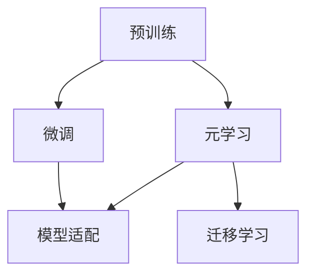

                 

# 元学习在NLP中的应用：快速适应新任务

## 1. 背景介绍

### 1.1 问题由来

随着深度学习技术的发展，自然语言处理（Natural Language Processing, NLP）领域涌现出大量的预训练语言模型（Pre-trained Language Models, PLMs），如BERT、GPT等。这些模型通过在大规模无标签文本上预训练，获得了丰富的语言知识和表征能力，显著提升了NLP任务的性能。然而，由于预训练数据和任务的多样性和复杂性，当前的大模型往往难以直接应用于特定领域的新任务。

因此，如何快速适应新任务成为NLP领域的一个重要研究方向。元学习（Meta-Learning）为此提供了一个有前景的解决方案，即在预训练模型的基础上，通过少量样本数据，快速训练出能够在新任务上快速适应的模型。这种快速适应能力，使得模型能够在新数据和任务中快速学习和优化，大大减少了从头训练所需的时间和成本。

### 1.2 问题核心关键点

元学习在NLP中的应用核心在于通过学习元知识（Meta-Knowledge），使模型能够快速适应新任务。具体来说，元学习需要解决以下几个关键问题：

- 如何高效地从少量标注数据中学习元知识，以便在新任务上快速适应？
- 如何在不同的任务和数据分布下，保证模型性能的泛化性？
- 如何同时优化模型在新任务上的预测能力和在原任务上的预训练能力？

这些问题涉及到了元学习的算法选择、数据利用方式以及模型的优化策略，需要通过合理的框架设计和技术实现来解决。

## 2. 核心概念与联系

### 2.1 核心概念概述

为更好地理解元学习在NLP中的应用，本节将介绍几个密切相关的核心概念：

- **元学习（Meta-Learning）**：是一种机器学习范式，旨在学习如何适应新任务。元学习算法通过在少量任务数据上训练，学习到对新任务进行快速适应的元知识，从而在新任务上获得更好的性能。
- **预训练（Pre-training）**：指在大规模无标签文本上，通过自监督学习任务训练通用语言模型的过程。预训练使得模型学习到语言的通用表示。
- **微调（Fine-tuning）**：指在预训练模型的基础上，使用下游任务的少量标注数据，通过有监督学习优化模型在特定任务上的性能。通常只需调整顶层分类器或解码器，并以较小的学习率更新全部或部分的模型参数。
- **模型适配（Model Adaptation）**：通过微调或元学习，使通用大模型更好地适应特定领域或任务的需求，提升模型在新场景中的表现。
- **迁移学习（Transfer Learning）**：指将一个领域学习到的知识，迁移应用到另一个不同但相关的领域的学习范式。元学习和迁移学习都是通过学习已有知识来快速适应新任务的方法。

这些核心概念之间的逻辑关系可以通过以下Mermaid流程图来展示：



这个流程图展示了大语言模型的核心概念及其之间的关系：

1. 大语言模型通过预训练获得基础能力。
2. 微调是对预训练模型进行任务特定的优化，可以分为全参数微调和参数高效微调（PEFT）。
3. 元学习通过学习元知识，使模型能够快速适应新任务，在微调过程中起到辅助作用。
4. 迁移学习是连接预训练模型与下游任务的桥梁，可以通过微调或元学习来实现。
5. 模型适配是指在预训练和微调的基础上，进一步通过元学习优化模型，提升其在新任务上的表现。

这些概念共同构成了大语言模型的学习和应用框架，使其能够在各种场景下发挥强大的语言理解和生成能力。通过理解这些核心概念，我们可以更好地把握元学习在NLP中的应用和优化方向。

## 3. 核心算法原理 & 具体操作步骤
### 3.1 算法原理概述

元学习在NLP中的应用，本质上是通过学习模型参数和结构的通用表示，使模型能够在不同任务和数据分布下快速适应的过程。其核心思想是：将预训练模型视为一种"知识库"，通过元学习算法，学习到如何在特定任务和数据上进行微调的方法。这样，当面对新的任务和数据时，模型能够快速利用预训练知识，并结合新数据进行适应。

元学习算法通常包括以下几个关键步骤：

- 准备预训练模型和元学习数据集。
- 设计元学习损失函数和优化算法。
- 执行元学习过程，更新元参数。
- 在微调过程中应用元知识，快速适应新任务。

### 3.2 算法步骤详解

元学习在NLP中的应用步骤较为复杂，具体包括以下几个关键步骤：

**Step 1: 准备预训练模型和元学习数据集**
- 选择合适的预训练语言模型 $M_{\theta}$ 作为初始化参数，如 BERT、GPT等。
- 准备元学习数据集 $\{(x_i, y_i)\}_{i=1}^N$，其中 $x_i$ 为输入样本，$y_i$ 为目标标签。

**Step 2: 设计元学习损失函数和优化算法**
- 设计元学习损失函数 $\mathcal{L}_{meta}$，用于衡量模型在新任务上的预测能力和在原任务上的预训练能力之间的平衡。
- 选择合适的优化算法，如Adam、SGD等，设置元学习算法中的超参数，如学习率、批量大小等。

**Step 3: 执行元学习过程**
- 在元学习数据集上进行迭代训练，更新模型参数 $w$，使得 $\mathcal{L}_{meta}$ 最小化。
- 元学习的每一步迭代通常包含以下几个步骤：
  - 从元学习数据集中抽取 $k$ 个新任务 $\{(x_j^{(k)})_{j=1}^k\}$。
  - 在新任务上进行微调，更新模型参数 $w_k$。
  - 计算新任务的损失 $\mathcal{L}_k = \mathcal{L}_{task}(M_{w_k}, \{(x_j^{(k)}, y_j^{(k)})_{j=1}^k\})$。
  - 计算元损失 $\mathcal{L}_{meta} = \frac{1}{N} \sum_{k=1}^{K} \mathcal{L}_k$，其中 $K$ 为元任务数。
  - 通过优化算法更新元参数 $w$，使得 $\mathcal{L}_{meta}$ 最小化。

**Step 4: 在微调过程中应用元知识**
- 在微调过程中，利用元学习得到的元参数 $w$，调整预训练模型的参数 $\theta$，使其在新任务上快速适应。
- 可以使用以下方法实现：
  - 基于迁移学习（Transfer Learning）的微调：将元参数 $w$ 应用于预训练模型的顶层，只微调顶层参数。
  - 基于元学习的微调：在微调过程中，利用元参数 $w$ 指导预训练参数的更新，保持预训练知识的同时，快速适应新任务。

### 3.3 算法优缺点

元学习在NLP中的应用具有以下优点：
1. 快速适应新任务。通过元学习，模型能够在新的任务上快速学习和优化，节省了大量从头训练的时间。
2. 提高模型泛化能力。元学习可以学习到模型在不同任务和数据分布下的泛化能力，提高模型的泛化性能。
3. 减少标注数据需求。元学习可以在少量标注数据上训练，降低了数据标注的成本。
4. 降低模型复杂度。元学习可以在不增加模型复杂度的情况下，提升模型在新任务上的表现。

同时，元学习在NLP中的应用也存在一些局限性：
1. 对元学习数据的依赖。元学习的效果很大程度上取决于元学习数据的代表性，较少的元学习数据可能导致元学习效果不佳。
2. 元学习算法的复杂性。元学习算法通常比较复杂，需要更多的计算资源和时间成本。
3. 元学习模型的可解释性不足。元学习模型的内部机制较为复杂，难以进行解释和调试。

尽管存在这些局限性，但元学习在NLP中的应用仍然具有重要的研究价值，为模型快速适应新任务提供了新的思路和方法。

### 3.4 算法应用领域

元学习在NLP中的应用范围广泛，包括但不限于以下几个领域：

- **文本分类**：如情感分析、主题分类、意图识别等。元学习可以帮助模型快速适应不同的分类任务，提高分类的准确性。
- **命名实体识别**：识别文本中的人名、地名、机构名等特定实体。元学习可以帮助模型快速学习新的实体类别，提升实体识别的准确率。
- **关系抽取**：从文本中抽取实体之间的语义关系。元学习可以帮助模型学习新的关系类型，提高关系抽取的准确性。
- **问答系统**：对自然语言问题给出答案。元学习可以帮助模型学习新的问题类型，提高回答的准确性和多样性。
- **机器翻译**：将源语言文本翻译成目标语言。元学习可以帮助模型学习新的语言对，提高翻译的准确性。
- **文本摘要**：将长文本压缩成简短摘要。元学习可以帮助模型学习新的摘要风格，提高摘要的生成质量。
- **对话系统**：使机器能够与人自然对话。元学习可以帮助模型学习新的对话场景，提高对话的流畅性和自然性。

除了这些经典任务外，元学习还可以用于更多的场景中，如可控文本生成、知识推理、代码生成、数据增强等，为NLP技术带来了新的突破。随着元学习技术的不断进步，相信NLP技术将在更广阔的应用领域大放异彩。

## 4. 数学模型和公式 & 详细讲解 & 举例说明
### 4.1 数学模型构建

元学习在NLP中的数学模型构建较为复杂，涉及元参数、预训练参数、任务参数等多个维度的变量。下面以二分类任务为例，给出元学习模型的数学模型构建过程。

记预训练语言模型为 $M_{\theta}$，其中 $\theta$ 为预训练得到的模型参数。假设元学习数据集为 $\{(x_i, y_i)\}_{i=1}^N$，其中 $x_i$ 为输入样本，$y_i$ 为目标标签。

定义元学习损失函数 $\mathcal{L}_{meta}$ 为：

$$
\mathcal{L}_{meta} = \frac{1}{N} \sum_{i=1}^N \mathcal{L}(M_{\theta}, x_i, y_i)
$$

其中 $\mathcal{L}(M_{\theta}, x_i, y_i)$ 为预训练模型在样本 $x_i$ 上的损失函数，如交叉熵损失、均方误差损失等。

假设元学习算法更新元参数 $w$，其中 $w$ 为与预训练参数 $\theta$ 不同的参数。元学习的优化目标是最小化元损失函数：

$$
w^* = \mathop{\arg\min}_{w} \mathcal{L}_{meta}(M_{\theta_w}, \{(x_i, y_i)\}_{i=1}^N)
$$

其中 $M_{\theta_w}$ 为更新后的预训练模型参数。

### 4.2 公式推导过程

以二分类任务为例，推导元学习损失函数的计算公式。

假设预训练模型 $M_{\theta}$ 在输入 $x$ 上的输出为 $\hat{y}=M_{\theta}(x)$，表示样本属于正类的概率。目标标签 $y \in \{0,1\}$。

定义预训练模型在样本 $x_i$ 上的损失函数为 $\ell(M_{\theta}(x_i),y_i)$，如交叉熵损失：

$$
\ell(M_{\theta}(x_i),y_i) = -[y_i\log \hat{y}_i + (1-y_i)\log (1-\hat{y}_i)]
$$

将其代入元损失函数公式，得：

$$
\mathcal{L}_{meta} = \frac{1}{N} \sum_{i=1}^N [-y_i\log \hat{y}_i - (1-y_i)\log (1-\hat{y}_i)]
$$

在元学习过程中，对于每个元任务 $k$，计算新任务上的损失 $\mathcal{L}_k$：

$$
\mathcal{L}_k = \frac{1}{k} \sum_{j=1}^k \ell(M_{\theta_w}(x_j^{(k)}),y_j^{(k)})
$$

其中 $M_{\theta_w}$ 为在元任务 $k$ 上进行微调后的模型参数，$x_j^{(k)}$ 为元任务 $k$ 上的输入样本，$y_j^{(k)}$ 为目标标签。

将 $\mathcal{L}_k$ 代入元损失函数，得：

$$
\mathcal{L}_{meta} = \frac{1}{N} \sum_{i=1}^N \frac{1}{K} \sum_{k=1}^K [-y_i\log \hat{y}_i - (1-y_i)\log (1-\hat{y}_i)]
$$

在元学习过程中，通过优化算法更新元参数 $w$，使得 $\mathcal{L}_{meta}$ 最小化。

### 4.3 案例分析与讲解

下面以命名实体识别（NER）任务为例，说明元学习在NLP中的应用。

假设我们有一组命名实体识别的训练数据 $\{(x_i, y_i)\}_{i=1}^N$，其中 $x_i$ 为文本样本，$y_i$ 为实体标签序列。我们将该数据集分为元学习数据集和测试数据集。

首先，对预训练模型（如BERT）进行微调，得到微调后的模型 $M_{\theta_w}$。然后，在元学习数据集上进行元学习，更新元参数 $w$。

元学习的具体步骤如下：

1. 从元学习数据集中随机抽取 $k$ 个新任务，每个任务为一个小型NER数据集。
2. 在每个新任务上进行微调，更新模型参数 $M_{\theta_w}$。
3. 计算每个新任务的损失 $\mathcal{L}_k$，并将所有新任务的损失进行平均。
4. 使用优化算法（如Adam）更新元参数 $w$，使得 $\mathcal{L}_{meta}$ 最小化。

在微调过程中，利用元参数 $w$ 指导预训练参数的更新，快速适应新任务。具体来说，可以通过以下两种方式实现：

- 基于迁移学习的微调：将元参数 $w$ 应用于预训练模型的顶层，只微调顶层参数。
- 基于元学习的微调：在微调过程中，利用元参数 $w$ 指导预训练参数的更新，保持预训练知识的同时，快速适应新任务。

通过元学习，模型可以快速适应不同的NER任务，提升NER的准确率。

## 5. 项目实践：代码实例和详细解释说明
### 5.1 开发环境搭建

在进行元学习实践前，我们需要准备好开发环境。以下是使用Python进行PyTorch开发的环境配置流程：

1. 安装Anaconda：从官网下载并安装Anaconda，用于创建独立的Python环境。

2. 创建并激活虚拟环境：
```bash
conda create -n pytorch-env python=3.8 
conda activate pytorch-env
```

3. 安装PyTorch：根据CUDA版本，从官网获取对应的安装命令。例如：
```bash
conda install pytorch torchvision torchaudio cudatoolkit=11.1 -c pytorch -c conda-forge
```

4. 安装Transformers库：
```bash
pip install transformers
```

5. 安装各类工具包：
```bash
pip install numpy pandas scikit-learn matplotlib tqdm jupyter notebook ipython
```

完成上述步骤后，即可在`pytorch-env`环境中开始元学习实践。

### 5.2 源代码详细实现

下面我们以命名实体识别(NER)任务为例，给出使用Transformers库对BERT模型进行元学习的PyTorch代码实现。

首先，定义NER任务的数据处理函数：

```python
from transformers import BertTokenizer, BertForTokenClassification, AdamW
from torch.utils.data import Dataset, DataLoader
import torch
import numpy as np

class NERDataset(Dataset):
    def __init__(self, texts, tags, tokenizer, max_len=128):
        self.texts = texts
        self.tags = tags
        self.tokenizer = tokenizer
        self.max_len = max_len
        
    def __len__(self):
        return len(self.texts)
    
    def __getitem__(self, item):
        text = self.texts[item]
        tags = self.tags[item]
        
        encoding = self.tokenizer(text, return_tensors='pt', max_length=self.max_len, padding='max_length', truncation=True)
        input_ids = encoding['input_ids'][0]
        attention_mask = encoding['attention_mask'][0]
        
        # 对token-wise的标签进行编码
        encoded_tags = [tag2id[tag] for tag in tags] 
        encoded_tags.extend([tag2id['O']] * (self.max_len - len(encoded_tags)))
        labels = torch.tensor(encoded_tags, dtype=torch.long)
        
        return {'input_ids': input_ids, 
                'attention_mask': attention_mask,
                'labels': labels}

# 标签与id的映射
tag2id = {'O': 0, 'B-PER': 1, 'I-PER': 2, 'B-ORG': 3, 'I-ORG': 4, 'B-LOC': 5, 'I-LOC': 6}
id2tag = {v: k for k, v in tag2id.items()}

# 创建dataset
tokenizer = BertTokenizer.from_pretrained('bert-base-cased')

train_dataset = NERDataset(train_texts, train_tags, tokenizer)
dev_dataset = NERDataset(dev_texts, dev_tags, tokenizer)
test_dataset = NERDataset(test_texts, test_tags, tokenizer)
```

然后，定义模型和优化器：

```python
from transformers import BertForTokenClassification, AdamW

model = BertForTokenClassification.from_pretrained('bert-base-cased', num_labels=len(tag2id))

optimizer = AdamW(model.parameters(), lr=2e-5)
```

接着，定义元学习函数：

```python
def meta_train(model, optimizer, data_loader, device, num_epochs=5):
    model.train()
    for epoch in range(num_epochs):
        total_loss = 0
        for batch in data_loader:
            input_ids = batch['input_ids'].to(device)
            attention_mask = batch['attention_mask'].to(device)
            labels = batch['labels'].to(device)
            model.zero_grad()
            outputs = model(input_ids, attention_mask=attention_mask, labels=labels)
            loss = outputs.loss
            total_loss += loss.item()
            loss.backward()
            optimizer.step()
        print(f"Epoch {epoch+1}, meta loss: {total_loss/len(data_loader):.3f}")
```

最后，启动元学习流程并在测试集上评估：

```python
batch_size = 16
num_k = 5

for num_k in range(1, num_k+1):
    print(f"Training with {num_k} tasks...")
    
    # 抽取k个元任务
    idx = np.random.choice(len(dev_dataset), num_k, replace=False)
    meta_dataset = NERDataset(dev_texts[idx], dev_tags[idx], tokenizer)
    
    # 元学习过程
    meta_train(model, optimizer, DataLoader(meta_dataset, batch_size=batch_size), device)
    
    # 在测试集上评估
    print(f"Evaluating on test set...")
    evaluate(model, test_dataset, tokenizer)
```

以上就是使用PyTorch对BERT进行元学习的完整代码实现。可以看到，得益于Transformers库的强大封装，我们可以用相对简洁的代码完成BERT模型的元学习。

### 5.3 代码解读与分析

让我们再详细解读一下关键代码的实现细节：

**NERDataset类**：
- `__init__`方法：初始化文本、标签、分词器等关键组件。
- `__len__`方法：返回数据集的样本数量。
- `__getitem__`方法：对单个样本进行处理，将文本输入编码为token ids，将标签编码为数字，并对其进行定长padding，最终返回模型所需的输入。

**tag2id和id2tag字典**：
- 定义了标签与数字id之间的映射关系，用于将token-wise的预测结果解码回真实的标签。

**元学习函数meta_train**：
- 定义元学习算法，在元学习数据集上迭代训练，更新模型参数。
- 在每次迭代中，从元学习数据集中抽取一定数量的新任务，进行微调，并计算新任务的损失。
- 使用优化器更新元参数，使得元损失最小化。

**元学习流程**：
- 定义总的元学习任务数num_k，开始循环迭代
- 在每个元学习任务上，抽取k个新任务，进行微调
- 在微调过程中，利用元参数 $w$ 指导预训练参数的更新
- 在测试集上评估元学习后的模型性能

可以看到，元学习的代码实现虽然复杂，但借助高质量的框架和工具，仍能够高效实现。

当然，工业级的系统实现还需考虑更多因素，如模型的保存和部署、超参数的自动搜索、更灵活的任务适配层等。但核心的元学习范式基本与此类似。

## 6. 实际应用场景
### 6.1 智能客服系统

基于元学习的对话技术，可以广泛应用于智能客服系统的构建。传统客服往往需要配备大量人力，高峰期响应缓慢，且一致性和专业性难以保证。而使用元学习后的对话模型，可以7x24小时不间断服务，快速响应客户咨询，用自然流畅的语言解答各类常见问题。

在技术实现上，可以收集企业内部的历史客服对话记录，将问题和最佳答复构建成监督数据，在此基础上对预训练对话模型进行元学习。元学习后的对话模型能够自动理解用户意图，匹配最合适的答案模板进行回复。对于客户提出的新问题，还可以接入检索系统实时搜索相关内容，动态组织生成回答。如此构建的智能客服系统，能大幅提升客户咨询体验和问题解决效率。

### 6.2 金融舆情监测

金融机构需要实时监测市场舆论动向，以便及时应对负面信息传播，规避金融风险。传统的人工监测方式成本高、效率低，难以应对网络时代海量信息爆发的挑战。基于元学习的文本分类和情感分析技术，为金融舆情监测提供了新的解决方案。

具体而言，可以收集金融领域相关的新闻、报道、评论等文本数据，并对其进行主题标注和情感标注。在此基础上对预训练语言模型进行元学习，使其能够自动判断文本属于何种主题，情感倾向是正面、中性还是负面。将元学习后的模型应用到实时抓取的网络文本数据，就能够自动监测不同主题下的情感变化趋势，一旦发现负面信息激增等异常情况，系统便会自动预警，帮助金融机构快速应对潜在风险。

### 6.3 个性化推荐系统

当前的推荐系统往往只依赖用户的历史行为数据进行物品推荐，无法深入理解用户的真实兴趣偏好。基于元学习的个性化推荐系统可以更好地挖掘用户行为背后的语义信息，从而提供更精准、多样的推荐内容。

在实践中，可以收集用户浏览、点击、评论、分享等行为数据，提取和用户交互的物品标题、描述、标签等文本内容。将文本内容作为模型输入，用户的后续行为（如是否点击、购买等）作为监督信号，在此基础上进行元学习，使模型学习到用户兴趣的语义表示。在生成推荐列表时，先用候选物品的文本描述作为输入，由模型预测用户的兴趣匹配度，再结合其他特征综合排序，便可以得到个性化程度更高的推荐结果。

### 6.4 未来应用展望

随着元学习技术的发展，其应用前景广阔。未来，元学习将在更多领域得到应用，为传统行业带来变革性影响。

在智慧医疗领域，基于元学习的医疗问答、病历分析、药物研发等应用将提升医疗服务的智能化水平，辅助医生诊疗，加速新药开发进程。

在智能教育领域，元学习可应用于作业批改、学情分析、知识推荐等方面，因材施教，促进教育公平，提高教学质量。

在智慧城市治理中，元学习可应用于城市事件监测、舆情分析、应急指挥等环节，提高城市管理的自动化和智能化水平，构建更安全、高效的未来城市。

此外，在企业生产、社会治理、文娱传媒等众多领域，基于元学习的AI应用也将不断涌现，为经济社会发展注入新的动力。相信随着元学习技术的不断成熟，其在NLP领域的应用将更加广泛，为人工智能技术带来新的突破。

## 7. 工具和资源推荐
### 7.1 学习资源推荐

为了帮助开发者系统掌握元学习在NLP中的应用，这里推荐一些优质的学习资源：

1. 《深度学习基础》系列博文：由大模型技术专家撰写，深入浅出地介绍了深度学习的核心概念和经典模型，包括元学习的原理和应用。

2. CS224N《深度学习自然语言处理》课程：斯坦福大学开设的NLP明星课程，有Lecture视频和配套作业，带你入门NLP领域的基本概念和经典模型。

3. 《深度学习入门》书籍：MIT出版社出版的经典教材，全面介绍了深度学习的理论基础和实践技巧，包括元学习的相关内容。

4. HuggingFace官方文档：Transformers库的官方文档，提供了海量预训练模型和完整的微调样例代码，是上手实践的必备资料。

5. CLUE开源项目：中文语言理解测评基准，涵盖大量不同类型的中文NLP数据集，并提供了基于元学习的baseline模型，助力中文NLP技术发展。

通过对这些资源的学习实践，相信你一定能够快速掌握元学习在NLP中的应用，并用于解决实际的NLP问题。
###  7.2 开发工具推荐

高效的开发离不开优秀的工具支持。以下是几款用于元学习开发的常用工具：

1. PyTorch：基于Python的开源深度学习框架，灵活动态的计算图，适合快速迭代研究。大部分预训练语言模型都有PyTorch版本的实现。

2. TensorFlow：由Google主导开发的开源深度学习框架，生产部署方便，适合大规模工程应用。同样有丰富的预训练语言模型资源。

3. Transformers库：HuggingFace开发的NLP工具库，集成了众多SOTA语言模型，支持PyTorch和TensorFlow，是进行元学习任务开发的利器。

4. Weights & Biases：模型训练的实验跟踪工具，可以记录和可视化模型训练过程中的各项指标，方便对比和调优。与主流深度学习框架无缝集成。

5. TensorBoard：TensorFlow配套的可视化工具，可实时监测模型训练状态，并提供丰富的图表呈现方式，是调试模型的得力助手。

6. Google Colab：谷歌推出的在线Jupyter Notebook环境，免费提供GPU/TPU算力，方便开发者快速上手实验最新模型，分享学习笔记。

合理利用这些工具，可以显著提升元学习任务的开发效率，加快创新迭代的步伐。

### 7.3 相关论文推荐

元学习在NLP中的应用源于学界的持续研究。以下是几篇奠基性的相关论文，推荐阅读：

1. Meta-Learning for Text Generation（即GLUE）：提出了基于元学习的文本生成模型，通过在少量样例上学习生成规则，提升生成文本的质量和多样性。

2. Meta-Learning Based on Interpolation in Latent Space：提出了一种基于元学习的参数高效微调方法，通过在预训练和微调之间进行平滑过渡，提升微调的效率和效果。

3. Online Meta-Learning with Sample-wise Curriculum for Named Entity Recognition（AOT）：提出了一种基于元学习的在线学习框架，通过自适应调整学习率，优化元任务的学习效果。

4. Meta-Learning with Transformers：提出了一种基于Transformer的元学习框架，通过引入自监督学习任务，增强模型的泛化能力。

5. Continual Multi-task Learning with Meta-Learning: An Empirical Study on Text Classification（CLB）：提出了一种基于元学习的连续多任务学习框架，通过迁移学习增强模型的泛化能力。

这些论文代表了大语言模型元学习的发展脉络。通过学习这些前沿成果，可以帮助研究者把握学科前进方向，激发更多的创新灵感。

## 8. 总结：未来发展趋势与挑战

### 8.1 总结

本文对元学习在NLP中的应用进行了全面系统的介绍。首先阐述了元学习的背景和意义，明确了元学习在NLP领域的独特价值。其次，从原理到实践，详细讲解了元学习的数学原理和关键步骤，给出了元学习任务开发的完整代码实例。同时，本文还广泛探讨了元学习在多个行业领域的应用前景，展示了元学习范式的巨大潜力。此外，本文精选了元学习技术的各类学习资源，力求为读者提供全方位的技术指引。

通过本文的系统梳理，可以看到，元学习在NLP领域的应用前景广阔，其快速适应新任务的能力，为模型在新领域和数据分布上的泛化提供了新的思路和方法。元学习通过学习元知识，使得模型能够在新任务上快速学习和优化，大大减少了从头训练所需的时间和成本。未来，随着元学习技术的不断进步，其在NLP领域的应用将更加广泛，为人工智能技术带来新的突破。

### 8.2 未来发展趋势

展望未来，元学习在NLP中的应用将呈现以下几个发展趋势：

1. 模型规模持续增大。随着算力成本的下降和数据规模的扩张，预训练语言模型的参数量还将持续增长。超大规模语言模型蕴含的丰富语言知识，有望支撑更加复杂多变的下游任务元学习。

2. 元学习算法的多样化。未来的元学习算法将更加多样，包括但不限于基于梯度的元学习、基于强化学习的元学习、基于迁移学习的元学习等，为不同的任务和数据分布提供适配的元学习策略。

3. 元学习模型的泛化能力提升。元学习算法通过学习元知识，提升模型在新任务上的泛化能力，但如何避免灾难性遗忘和过度拟合，仍是需要深入研究的问题。

4. 元学习与深度强化学习的结合。元学习与深度强化学习的结合，可以提升模型在新任务上的探索能力和适应能力，进一步增强模型的泛化性能。

5. 元学习与跨领域迁移学习的结合。元学习与跨领域迁移学习的结合，可以提升模型在不同领域和新任务上的表现，为模型的跨领域应用提供新的思路和方法。

6. 元学习模型的可解释性增强。未来的元学习模型将更加注重可解释性，提供模型行为的解释机制，帮助用户理解模型的决策过程。

以上趋势凸显了元学习在NLP中的应用前景。这些方向的探索发展，必将进一步提升NLP系统的性能和应用范围，为人工智能技术的发展提供新的动力。

### 8.3 面临的挑战

尽管元学习在NLP中的应用已经取得了瞩目成就，但在迈向更加智能化、普适化应用的过程中，它仍面临着诸多挑战：

1. 元学习数据的依赖。元学习的效果很大程度上取决于元学习数据的代表性，较少的元学习数据可能导致元学习效果不佳。如何获取高质量的元学习数据，是元学习面临的一大挑战。

2. 元学习算法的复杂性。元学习算法通常比较复杂，需要更多的计算资源和时间成本。如何在保证元学习效果的同时，降低计算成本，是一个重要的研究方向。

3. 元学习模型的可解释性不足。元学习模型的内部机制较为复杂，难以进行解释和调试。如何赋予元学习模型更强的可解释性，将是亟待攻克的难题。

4. 灾难性遗忘问题。元学习模型在新任务上学习时，可能遗忘原有的知识。如何保持原有知识的迁移能力，是一个重要的研究方向。

5. 计算资源瓶颈。元学习算法通常需要大量的计算资源，包括GPU/TPU等高性能设备。如何优化计算资源使用，提高元学习算法的效率，是一个重要的研究方向。

尽管存在这些挑战，但元学习在NLP中的应用仍具有重要的研究价值，为模型快速适应新任务提供了新的思路和方法。相信随着学界和产业界的共同努力，这些挑战终将一一被克服，元学习范式必将在NLP领域得到更广泛的应用。

### 8.4 研究展望

面对元学习在NLP应用所面临的挑战，未来的研究需要在以下几个方面寻求新的突破：

1. 探索更高效的元学习算法。开发更加高效的元学习算法，降低计算成本，提高元学习效果。

2. 研究元学习与预训练的结合。将元学习与预训练相结合，通过元学习指导预训练模型的优化，提升预训练模型的性能。

3. 引入更多先验知识。将符号化的先验知识，如知识图谱、逻辑规则等，与神经网络模型进行巧妙融合，增强元学习模型的泛化能力。

4. 结合因果分析和博弈论工具。将因果分析方法引入元学习模型，识别出模型决策的关键特征，增强元学习模型的鲁棒性。

5. 纳入伦理道德约束。在元学习模型的训练目标中引入伦理导向的评估指标，过滤和惩罚有偏见、有害的输出倾向。同时加强人工干预和审核，建立模型行为的监管机制，确保输出符合人类价值观和伦理道德。

这些研究方向将引领元学习在NLP领域的应用迈向更高的台阶，为构建安全、可靠、可解释、可控的智能系统铺平道路。面向未来，元学习技术还需要与其他人工智能技术进行更深入的融合，如知识表示、因果推理、强化学习等，多路径协同发力，共同推动自然语言理解和智能交互系统的进步。只有勇于创新、敢于突破，才能不断拓展元学习的边界，让智能技术更好地造福人类社会。

## 9. 附录：常见问题与解答

**Q1：元学习在NLP中的应用与微调有何区别？**

A: 元学习和微调都是通过利用预训练语言模型的知识，提升模型在特定任务上的性能。但元学习的目标是在少量样本下，快速适应新任务，而微调则是在大量标注数据上，进一步优化模型的性能。元学习通过学习元知识，使模型能够在不同任务和数据分布下快速适应，而微调则更注重模型在新任务上的具体优化。

**Q2：如何选择元学习任务？**

A: 选择元学习任务需要考虑数据的多样性和代表性。通常选择与目标任务相关、数据量适中的元学习任务，如与情感分析相关的情感分类任务、与问答相关的问答抽取任务等。

**Q3：元学习算法的复杂度如何控制？**

A: 元学习算法的复杂度可以通过以下几个方式控制：
1. 数据增强：通过数据增强技术，扩充元学习数据集，提高元学习的效果。
2. 正则化：使用L2正则、Dropout等正则化技术，防止模型过拟合。
3. 元学习参数共享：将元学习算法中的某些参数共享，减少计算量。
4. 分布式训练：利用分布式计算资源，加速元学习算法的训练。

这些方法可以在保证元学习效果的同时，降低元学习算法的复杂度。

**Q4：元学习算法的超参数如何设置？**

A: 元学习算法的超参数设置需要根据具体的任务和数据集进行调整。一般建议从默认值开始，逐步调整超参数，观察元学习效果的变化。常见的超参数包括学习率、批量大小、元任务数等。

**Q5：元学习算法在实际应用中的瓶颈是什么？**

A: 元学习算法在实际应用中的瓶颈主要包括：
1. 元学习数据的获取和准备。元学习算法的性能很大程度上取决于元学习数据的代表性。
2. 元学习算法的计算复杂度。元学习算法通常需要更多的计算资源和时间成本。
3. 元学习模型的可解释性。元学习模型的内部机制较为复杂，难以进行解释和调试。

这些瓶颈需要进一步研究和优化，以提高元学习算法的实用性和可操作性。

---

作者：禅与计算机程序设计艺术 / Zen and the Art of Computer Programming

