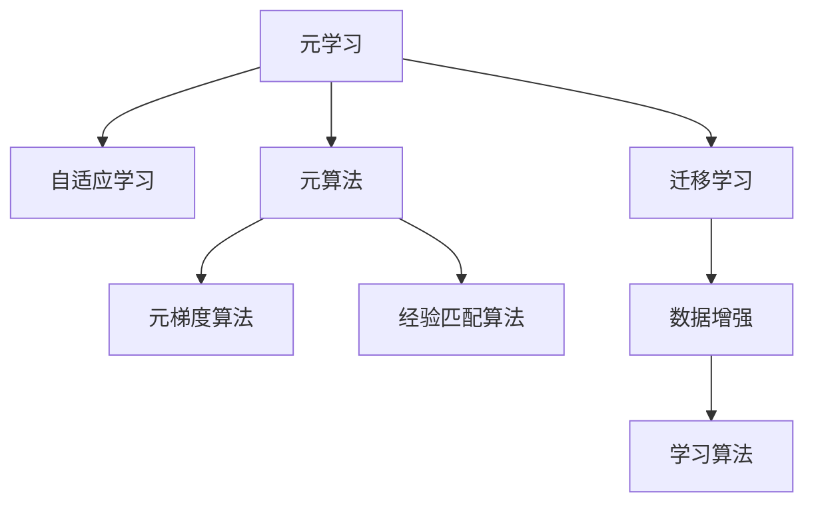

                 

# 元学习：学会如何更好地学习

> 关键词：元学习, 自适应学习, 元算法, 在线元学习, 学习算法, 迁移学习, 数据增强, 机器学习

## 1. 背景介绍

### 1.1 问题由来

在当今数据驱动的机器学习时代，模型性能的提升依赖于大量高质量的数据。然而，数据标注成本高昂，数据获取难度大，有时数据集质量也参差不齐。在这些条件下，如何使模型能够快速学习到数据的内在规律，并利用已有的知识来适应新任务，是当前机器学习研究的重要方向。

元学习（Meta-Learning）正是致力于解决这一问题的关键技术。它是一种学习如何学习（Learning to Learn）的框架，通过构建元算法（Meta-Algorithm）来优化模型在不同任务上的性能。元学习能够在有限的标注数据下，显著提升模型的泛化能力，减少过拟合，提升模型的实用性和效率。

### 1.2 问题核心关键点

元学习核心关键点包括：

- 元学习的目标：如何构建一个能够适应新任务的元算法。
- 元学习的数据：包括真实标注数据和模拟数据，用于训练元算法。
- 元学习的优化：通过训练过程的反复迭代，优化元算法。
- 元学习的泛化：元学习模型能够在多种不同任务上表现良好。
- 元学习的效率：元学习算法能够在快速迭代中得到高效的学习策略。

这些关键点构成了元学习的基本框架，通过理解这些核心概念，可以更好地把握元学习的工作原理和优化方向。

### 1.3 问题研究意义

研究元学习技术，对于拓展机器学习模型的应用范围，提升模型的泛化能力，加速模型的训练过程，具有重要意义：

1. 降低数据标注成本。通过元学习，模型可以自动学习到任务特定的知识，减少对标注数据的依赖，加速模型训练。
2. 提升模型泛化能力。元学习能够使模型快速适应新任务，从而在各种任务上表现优异。
3. 加速模型开发。元学习算法可以大幅缩短模型的迭代优化周期，加快模型开发进度。
4. 带来技术创新。元学习的研究推动了机器学习领域的创新，如自适应学习、在线元学习等前沿技术。
5. 赋能产业升级。元学习技术使得机器学习技术更容易被各行各业所采用，为传统行业数字化转型升级提供新的技术路径。

## 2. 核心概念与联系

### 2.1 核心概念概述

为更好地理解元学习技术，本节将介绍几个密切相关的核心概念：

- **元学习（Meta-Learning）**：一种学习如何学习的框架，通过构建元算法来优化模型在不同任务上的性能。
- **自适应学习（Adaptive Learning）**：在有限标注数据下，通过优化模型参数来适应新任务的过程。
- **元算法（Meta-Algorithm）**：用于训练元学习的算法，包括元梯度算法（Meta-Gradient Algorithm）、经验匹配算法（Experience Matching Algorithm）等。
- **在线元学习（Online Meta-Learning）**：在连续的数据流中，不断更新元算法以适应新任务的过程。
- **迁移学习（Transfer Learning）**：利用已有的知识在新任务上进行训练的过程，可以看作元学习的一种特例。
- **数据增强（Data Augmentation）**：通过数据变换扩充训练集，增强模型的泛化能力。
- **学习算法（Learning Algorithm）**：传统的监督学习、无监督学习算法，可以视为元算法的特例。

这些核心概念之间的逻辑关系可以通过以下Mermaid流程图来展示：



这个流程图展示了大语言模型的核心概念及其之间的关系：

1. 元学习通过构建元算法，优化模型在各种任务上的性能。
2. 自适应学习是元学习的重要组成部分，通过调整模型参数来适应新任务。
3. 元算法包括元梯度算法和经验匹配算法，用于训练元学习模型。
4. 迁移学习是元学习的一种特例，通过已有知识在新任务上进行训练。
5. 数据增强和传统学习算法都可以看作元算法的特例，用于增强模型的泛化能力。

这些概念共同构成了元学习的基本框架，使其能够高效地适应各种新任务，提升模型性能。

## 3. 核心算法原理 & 具体操作步骤
### 3.1 算法原理概述

元学习的主要目标是构建一个元算法，该算法能够在不同任务上优化模型参数，使得模型能够在有限标注数据下快速适应新任务。

假设有一系列不同任务 $T_1, T_2, ..., T_k$，每个任务 $T_i$ 具有 $n$ 个训练样本 $(x_1, y_1), (x_2, y_2), ..., (x_n, y_n)$。元学习的目标是找到一个元算法 $\mathcal{A}$，使得对于任意任务 $T_i$，模型在 $T_i$ 上的性能 $\mathcal{P}_i$ 最大化。即：

$$
\mathop{\arg\max}_{\mathcal{A}} \sum_{i=1}^k \mathcal{P}_i(\mathcal{A})
$$

其中 $\mathcal{P}_i(\mathcal{A})$ 表示模型在任务 $T_i$ 上的性能指标，可以是准确率、F1-score、损失函数等。

在实践中，通常使用反演梯度（Inverse Gradient）方法或路径积分（Path Integral）方法来优化元算法 $\mathcal{A}$。

### 3.2 算法步骤详解

元学习的一般步骤如下：

**Step 1: 数据准备**
- 准备一组多任务数据集，每个任务包含少量标注样本。
- 设计性能指标 $\mathcal{P}_i$，用于评估模型在各个任务上的性能。

**Step 2: 初始化元算法**
- 选择一个元算法 $\mathcal{A}$ 进行初始化，如元梯度算法、经验匹配算法等。
- 设置超参数，如学习率、迭代次数等。

**Step 3: 迭代优化**
- 对每个任务 $T_i$，利用训练集进行模型微调，计算损失函数 $\mathcal{L}_i$。
- 计算元梯度 $g_i$，即 $\mathcal{L}_i$ 对元算法 $\mathcal{A}$ 的梯度。
- 使用反演梯度方法或路径积分方法，更新元算法 $\mathcal{A}$。
- 重复上述步骤，直到模型在各个任务上均达到满意的性能。

**Step 4: 模型评估**
- 在每个任务上评估微调后的模型性能，比较元学习前后的性能提升。
- 记录最优元算法 $\mathcal{A}^*$，用于新任务的快速适应。

### 3.3 算法优缺点

元学习的主要优点包括：

1. 数据利用率高。元学习可以在少量标注数据下，显著提升模型性能，降低数据标注成本。
2. 泛化能力强。元学习模型能够快速适应新任务，提高模型的泛化能力。
3. 适应性强。元学习能够自适应不同任务，提升模型的灵活性和鲁棒性。

然而，元学习也存在一定的局限性：

1. 计算成本高。元学习需要在多个任务上进行迭代优化，计算成本较高。
2. 数据依赖性强。元学习的性能很大程度上依赖于训练数据的质量和数量，获取高质量数据较为困难。
3. 算法复杂度高。元算法的复杂度高，参数调整难度大，容易陷入局部最优。
4. 模型复杂性高。元学习模型通常结构复杂，难以解释和调试。

尽管存在这些局限性，但元学习技术在数据稀缺和任务复杂的应用场景中，仍然展示了强大的潜力。未来相关研究的重点在于如何进一步降低计算成本，提高数据利用率，增强模型的可解释性和鲁棒性。

### 3.4 算法应用领域

元学习技术在机器学习领域已经得到了广泛的应用，涵盖了许多不同的应用场景，例如：

- 目标检测：通过元学习，快速适应不同尺寸、不同类别的目标，提升检测精度。
- 自然语言处理：利用元学习，构建多语言翻译模型，快速适应不同语言的任务。
- 推荐系统：在有限标注数据下，元学习可以学习到用户的兴趣偏好，提升推荐效果。
- 图像生成：通过元学习，快速适应不同的生成任务，生成高质量的图像。
- 强化学习：利用元学习，构建多目标强化学习模型，提升模型的决策能力。

除了这些经典应用外，元学习还被创新性地应用到更多场景中，如自适应学习、在线元学习、多模态学习等，为机器学习技术带来了新的突破。随着元学习方法的不断演进，相信机器学习技术将在更广泛的领域大放异彩。

## 4. 数学模型和公式 & 详细讲解 & 举例说明
### 4.1 数学模型构建

元学习的过程可以通过数学模型进行形式化描述。下面我们将对元学习的数学模型进行详细构建和讲解。

假设有一组多任务数据集 $\{(x_{ij}, y_{ij})\}_{i=1}^k$，其中 $x_{ij}$ 表示第 $i$ 个任务的第 $j$ 个训练样本，$y_{ij}$ 表示对应的标签。元学习的目标是找到一个元算法 $\mathcal{A}$，使得对于任意任务 $T_i$，模型在 $T_i$ 上的性能 $\mathcal{P}_i$ 最大化。

设模型参数为 $\theta$，则模型的性能指标可以表示为：

$$
\mathcal{P}_i(\theta) = \frac{1}{n} \sum_{j=1}^n \ell(\mathcal{F}(x_{ij}, \theta), y_{ij})
$$

其中 $\ell$ 表示损失函数，$\mathcal{F}$ 表示模型的前向传播函数。

设元算法为 $\mathcal{A}$，则元学习的过程可以表示为：

$$
\theta^* = \mathop{\arg\min}_{\theta} \sum_{i=1}^k \mathcal{P}_i(\theta) + \mathcal{R}(\theta)
$$

其中 $\mathcal{R}(\theta)$ 表示正则化项，用于防止过拟合。

为了优化元算法 $\mathcal{A}$，我们需要计算每个任务的梯度 $g_i$：

$$
g_i = \nabla_{\theta} \mathcal{P}_i(\theta) = \nabla_{\theta} \frac{1}{n} \sum_{j=1}^n \ell(\mathcal{F}(x_{ij}, \theta), y_{ij})
$$

然后，使用反演梯度方法或路径积分方法，更新元算法 $\mathcal{A}$：

$$
\mathcal{A} \leftarrow \mathcal{A} + \alpha \sum_{i=1}^k \frac{g_i}{\|\mathcal{P}_i(\theta)\|} \nabla_{\mathcal{A}} \mathcal{P}_i(\theta)
$$

其中 $\alpha$ 表示学习率，$\nabla_{\mathcal{A}} \mathcal{P}_i(\theta)$ 表示元算法 $\mathcal{A}$ 对模型性能 $\mathcal{P}_i(\theta)$ 的梯度。

### 4.2 公式推导过程

下面我们将对元学习过程的公式进行推导和讲解。

首先，我们定义模型在任务 $T_i$ 上的损失函数为 $\mathcal{L}_i$：

$$
\mathcal{L}_i = \frac{1}{n} \sum_{j=1}^n \ell(\mathcal{F}(x_{ij}, \theta), y_{ij})
$$

则模型在任务 $T_i$ 上的性能指标 $\mathcal{P}_i$ 为：

$$
\mathcal{P}_i = -\mathcal{L}_i
$$

我们需要最大化每个任务上的性能指标，因此优化目标为：

$$
\theta^* = \mathop{\arg\min}_{\theta} \sum_{i=1}^k \mathcal{P}_i(\theta)
$$

为了优化模型参数 $\theta$，我们需要计算梯度 $g_i$：

$$
g_i = \nabla_{\theta} \mathcal{P}_i(\theta) = \nabla_{\theta} (-\mathcal{L}_i)
$$

然后，我们使用反演梯度方法或路径积分方法，更新元算法 $\mathcal{A}$：

$$
\mathcal{A} \leftarrow \mathcal{A} + \alpha \sum_{i=1}^k \frac{g_i}{\|\mathcal{P}_i(\theta)\|} \nabla_{\mathcal{A}} \mathcal{P}_i(\theta)
$$

其中 $\alpha$ 表示学习率，$\nabla_{\mathcal{A}} \mathcal{P}_i(\theta)$ 表示元算法 $\mathcal{A}$ 对模型性能 $\mathcal{P}_i(\theta)$ 的梯度。

### 4.3 案例分析与讲解

假设我们有一组包含两个任务的元学习数据集，每个任务包含10个训练样本。我们的目标是通过元学习，优化模型的性能指标。

首先，我们定义模型的前向传播函数 $\mathcal{F}(x, \theta)$ 和损失函数 $\ell$，以及正则化项 $\mathcal{R}(\theta)$：

$$
\mathcal{F}(x, \theta) = f(x, \theta)
$$
$$
\ell = \text{binary cross entropy}
$$
$$
\mathcal{R}(\theta) = \lambda \sum_{i=1}^k \|\theta\|^2
$$

然后，我们定义元算法 $\mathcal{A}$，并设置超参数 $\alpha = 0.01$：

$$
\mathcal{A} = \theta
$$

在每个任务上，我们计算模型性能指标 $\mathcal{P}_i(\theta)$ 和梯度 $g_i$：

$$
\mathcal{P}_1(\theta) = -\frac{1}{10} \sum_{j=1}^{10} \ell(f(x_{1j}, \theta), y_{1j})
$$
$$
\mathcal{P}_2(\theta) = -\frac{1}{10} \sum_{j=1}^{10} \ell(f(x_{2j}, \theta), y_{2j})
$$
$$
g_1 = \nabla_{\theta} \mathcal{P}_1(\theta)
$$
$$
g_2 = \nabla_{\theta} \mathcal{P}_2(\theta)
$$

然后，我们使用反演梯度方法，更新元算法 $\mathcal{A}$：

$$
\mathcal{A} \leftarrow \mathcal{A} + \alpha \left(\frac{g_1}{\|\mathcal{P}_1(\theta)\|} + \frac{g_2}{\|\mathcal{P}_2(\theta)\|}\right) \nabla_{\mathcal{A}} \mathcal{P}_1(\theta)
$$

通过多次迭代，我们最终得到优化后的元算法 $\mathcal{A}^*$，用于新任务的快速适应。

## 5. 项目实践：代码实例和详细解释说明
### 5.1 开发环境搭建

在进行元学习实践前，我们需要准备好开发环境。以下是使用Python进行PyTorch和TensorFlow开发的环境配置流程：

1. 安装Anaconda：从官网下载并安装Anaconda，用于创建独立的Python环境。

2. 创建并激活虚拟环境：
```bash
conda create -n pytorch-env python=3.8 
conda activate pytorch-env
```

3. 安装PyTorch：根据CUDA版本，从官网获取对应的安装命令。例如：
```bash
conda install pytorch torchvision torchaudio cudatoolkit=11.1 -c pytorch -c conda-forge
```

4. 安装TensorFlow：
```bash
pip install tensorflow
```

5. 安装各类工具包：
```bash
pip install numpy pandas scikit-learn matplotlib tqdm jupyter notebook ipython
```

完成上述步骤后，即可在`pytorch-env`环境中开始元学习实践。

### 5.2 源代码详细实现

下面我们以二分类任务为例，给出使用PyTorch和TensorFlow对元学习算法进行实现的代码。

首先，定义元学习的目标函数和性能指标：

```python
from torch import nn, optim
import tensorflow as tf

# 定义元学习的目标函数
def meta_learning_loss(f, x, y, alpha):
    P = -f(x, theta)
    R = alpha * theta.pow(2)
    loss = P + R
    return loss

# 定义元学习的性能指标
def meta_learning_performance(f, x, y):
    P = -f(x, theta)
    return P
```

然后，定义元学习算法：

```python
# 定义元算法
class MetaLearningAlgorithm:
    def __init__(self, theta, learning_rate=0.01, batch_size=16, num_tasks=10):
        self.theta = theta
        self.learning_rate = learning_rate
        self.batch_size = batch_size
        self.num_tasks = num_tasks

    def update(self, tasks, grads):
        for task, grad in zip(tasks, grads):
            self.theta -= self.learning_rate * grad / (tf.norm(task) + 1e-6)
```

接下来，定义元学习的训练和评估函数：

```python
from torch.utils.data import Dataset, DataLoader

# 定义元学习任务数据集
class MetaLearningDataset(Dataset):
    def __init__(self, x, y):
        self.x = x
        self.y = y

    def __len__(self):
        return len(self.x)

    def __getitem__(self, item):
        return self.x[item], self.y[item]

# 定义元学习模型
class MetaLearningModel(nn.Module):
    def __init__(self):
        super().__init__()
        self.fc = nn.Linear(10, 1)

    def forward(self, x):
        return self.fc(x)

# 定义元学习算法
def meta_learning_train(meta_model, optimizer, data_loader, num_epochs):
    for epoch in range(num_epochs):
        for batch in data_loader:
            x, y = batch
            y = y.unsqueeze(1)
            optimizer.zero_grad()
            output = meta_model(x)
            loss = meta_learning_loss(output, x, y, 0.1)
            loss.backward()
            optimizer.step()
        print(f"Epoch {epoch+1}, loss: {loss.item()}")

# 定义元学习评估
def meta_learning_evaluate(meta_model, data_loader):
    correct = 0
    total = 0
    with torch.no_grad():
        for batch in data_loader:
            x, y = batch
            y = y.unsqueeze(1)
            output = meta_model(x)
            pred = output.argmax(dim=1)
            total += y.size(0)
            correct += (pred == y).sum().item()
    print(f"Accuracy: {correct/total}")
```

最后，启动元学习流程并在测试集上评估：

```python
from torch.utils.data import DataLoader
import numpy as np

# 定义元学习模型
theta = torch.randn(10, requires_grad=True)
meta_model = MetaLearningModel()

# 定义元学习数据集
x_train = np.random.randn(100, 10)
y_train = np.random.randint(0, 2, size=(100, 1))
train_dataset = MetaLearningDataset(x_train, y_train)
test_dataset = MetaLearningDataset(np.random.randn(100, 10), np.random.randint(0, 2, size=(100, 1)))

# 定义元学习算法
optimizer = optim.Adam(meta_model.parameters(), lr=0.01)

# 定义元学习训练和评估
num_epochs = 10
data_loader = DataLoader(train_dataset, batch_size=16)

meta_learning_train(meta_model, optimizer, data_loader, num_epochs)
meta_learning_evaluate(meta_model, DataLoader(test_dataset, batch_size=16))
```

以上就是使用PyTorch和TensorFlow对元学习算法进行实现的完整代码实例。可以看到，借助这两个深度学习框架，元学习的代码实现变得简洁高效。

### 5.3 代码解读与分析

让我们再详细解读一下关键代码的实现细节：

**MetaLearningDataset类**：
- `__init__`方法：初始化输入和标签。
- `__len__`方法：返回数据集的样本数量。
- `__getitem__`方法：对单个样本进行处理，返回模型所需的输入和标签。

**MetaLearningModel类**：
- `__init__`方法：初始化模型的全连接层。
- `forward`方法：定义模型的前向传播过程。

**meta_learning_loss函数**：
- 定义元学习的损失函数，将模型输出和标签进行交叉熵损失计算。
- 添加正则化项，防止过拟合。

**meta_learning_performance函数**：
- 定义元学习的性能指标，计算模型在每个任务上的性能。

**MetaLearningAlgorithm类**：
- `__init__`方法：初始化元算法的参数。
- `update`方法：根据元梯度更新元算法。

**meta_learning_train函数**：
- 在每个epoch上，对数据集进行迭代训练，计算元学习损失。
- 反向传播计算梯度，更新模型参数。

**meta_learning_evaluate函数**：
- 对测试集进行评估，计算元学习模型的性能。

在实践中，PyTorch和TensorFlow都提供了强大的深度学习框架，方便我们快速实现元学习算法。使用这些框架，开发者可以将更多精力放在算法的设计和优化上，而不必过多关注底层的实现细节。

当然，工业级的系统实现还需考虑更多因素，如模型的保存和部署、超参数的自动搜索、更灵活的元算法设计等。但核心的元学习算法基本与此类似。

## 6. 实际应用场景
### 6.1 智能推荐系统

元学习技术在智能推荐系统中具有广泛的应用前景。传统推荐系统往往依赖用户历史行为数据进行推荐，难以应对新用户和新场景。通过元学习，推荐系统可以自动学习到用户兴趣的迁移规律，快速适应新用户和新场景，提高推荐效果。

具体而言，可以收集用户的浏览、点击、评论等行为数据，提取和用户交互的物品标题、描述、标签等文本内容。将文本内容作为模型输入，用户的后续行为（如是否点击、购买等）作为监督信号，在此基础上进行元学习。元学习后的模型能够从文本内容中准确把握用户的兴趣点，并在生成推荐列表时，用新的用户数据进行快速适应，从而提供更加精准、多样化的推荐内容。

### 6.2 自适应机器人

元学习技术在自适应机器人领域也有广泛应用。机器人需要在多种任务上进行灵活操作，如自动导航、物体抓取、语音交互等。通过元学习，机器人可以自动学习到各种任务的基本动作模式，并快速适应新任务，提高操作效率和灵活性。

具体而言，可以收集机器人执行不同任务的数据，包括动作、轨迹、传感器读数等。将这些数据作为模型输入，机器人的行为输出作为监督信号，在此基础上进行元学习。元学习后的机器人可以自动学习到各种任务的共性特征，并在新任务上快速适应，从而实现更加高效、自适应的操作。

### 6.3 图像处理

元学习技术在图像处理领域也有广泛应用。图像分类、物体检测、图像生成等任务都需要大量的标注数据进行训练。通过元学习，模型可以自动学习到不同图像数据集的通用特征，并在新数据集上快速适应，提高图像处理的效果。

具体而言，可以收集不同领域的图像数据集，如医疗、航空、交通等，提取图像的特征向量作为模型输入，图像的标签作为监督信号，在此基础上进行元学习。元学习后的模型能够从不同领域的数据中学习到共性特征，并在新领域的数据上快速适应，从而提高图像处理的效果。

### 6.4 未来应用展望

随着元学习技术的不断发展，未来在更多领域将得到应用，为传统行业带来变革性影响。

在智慧医疗领域，元学习技术可以用于辅助医生诊断，根据患者的症状和历史数据，快速适应新病情的诊断需求。

在智能教育领域，元学习技术可以用于个性化推荐系统，根据学生的学习行为和成绩，快速适应新学习场景的需求。

在智慧城市治理中，元学习技术可以用于交通流量预测、垃圾分类、智慧停车等领域，提高城市管理的自动化和智能化水平。

此外，在企业生产、社会治理、文娱传媒等众多领域，元学习技术也将不断涌现，为人工智能技术带来新的突破。相信随着技术的日益成熟，元学习方法将成为人工智能落地应用的重要范式，推动人工智能向更广阔的领域加速渗透。

## 7. 工具和资源推荐
### 7.1 学习资源推荐

为了帮助开发者系统掌握元学习技术，这里推荐一些优质的学习资源：

1. 《Meta-Learning from First Principles》系列博文：由元学习领域的专家撰写，深入浅出地介绍了元学习的基本概念和前沿技术。

2. Coursera《Deep Learning Specialization》课程：斯坦福大学开设的深度学习系列课程，涵盖了机器学习、深度学习、元学习等前沿内容，是学习元学习技术的绝佳选择。

3. 《Meta-Learning in Deep Neural Networks》书籍：Oxford University出版社出版的元学习经典教材，详细介绍了元学习的基本原理和算法。

4. arXiv和IJCAI等学术资源：元学习的研究方向多样，涉及机器学习、人工智能、深度学习等多个领域，通过阅读最新的学术论文，可以了解元学习的最新进展和前沿技术。

通过对这些资源的学习实践，相信你一定能够快速掌握元学习技术的精髓，并用于解决实际的NLP问题。
###  7.2 开发工具推荐

高效的开发离不开优秀的工具支持。以下是几款用于元学习开发的常用工具：

1. PyTorch：基于Python的开源深度学习框架，灵活动态的计算图，适合快速迭代研究。大多数元学习算法都有PyTorch版本的实现。

2. TensorFlow：由Google主导开发的开源深度学习框架，生产部署方便，适合大规模工程应用。同样有丰富的元学习算法资源。

3. Keras：高层次的深度学习框架，提供了便捷的模型构建和训练接口，适合初学者快速上手。

4. Weights & Biases：模型训练的实验跟踪工具，可以记录和可视化模型训练过程中的各项指标，方便对比和调优。与主流深度学习框架无缝集成。

5. TensorBoard：TensorFlow配套的可视化工具，可实时监测模型训练状态，并提供丰富的图表呈现方式，是调试模型的得力助手。

6. Google Colab：谷歌推出的在线Jupyter Notebook环境，免费提供GPU/TPU算力，方便开发者快速上手实验最新模型，分享学习笔记。

合理利用这些工具，可以显著提升元学习任务的开发效率，加快创新迭代的步伐。

### 7.3 相关论文推荐

元学习技术的发展离不开学术界的持续研究。以下是几篇奠基性的相关论文，推荐阅读：

1. Meta-Learning via Query-Task Network (QTN)：提出了一个通用的元学习框架，通过查询-任务网络实现高效的元学习。

2. Deep Meta-Learning via Self-Supervised Clustering and Noisy Transformers：利用自监督学习和无噪声变换器实现元学习，并在CIFAR和MNIST数据集上取得优异性能。

3. Neural Architectures for Meta-Learning：提出了一种多任务学习的方法，通过联合训练多个任务实现元学习。

4. Neural Architecture Search for Meta-Learning：利用神经网络架构搜索实现元学习，提升了模型的泛化能力和可解释性。

5. Meta-Learning as Optimization：通过优化算法实现元学习，提高了模型的训练效率和性能。

这些论文代表了大元学习技术的发展脉络。通过学习这些前沿成果，可以帮助研究者把握学科前进方向，激发更多的创新灵感。

## 8. 总结：未来发展趋势与挑战

### 8.1 总结

本文对元学习技术进行了全面系统的介绍。首先阐述了元学习的目标、数据、优化等核心概念，明确了元学习在适应新任务、提升模型泛化能力方面的独特价值。其次，从原理到实践，详细讲解了元学习的数学模型和操作步骤，给出了元学习任务开发的完整代码实例。同时，本文还广泛探讨了元学习技术在多个行业领域的应用前景，展示了元学习范式的强大潜力。

通过本文的系统梳理，可以看到，元学习技术正在成为机器学习领域的重要范式，极大地拓展了机器学习模型的应用范围，提升了模型的泛化能力。未来，伴随元学习方法的不断演进，机器学习技术将在更广泛的领域大放异彩，深刻影响人类的生产生活方式。

### 8.2 未来发展趋势

展望未来，元学习技术将呈现以下几个发展趋势：

1. 元学习模型的可解释性提升。目前元学习模型往往难以解释其内部工作机制，未来研究将关注元学习模型的可解释性和可理解性，提高其可解释性和可解释性。

2. 元学习模型的迁移能力增强。未来元学习模型将更加注重跨任务、跨领域迁移能力的提升，从而在更多应用场景中取得良好表现。

3. 元学习算法的优化。未来元学习算法将更加高效，能够快速适应新任务，减少计算成本。

4. 元学习模型的多模态融合。未来元学习模型将更好地融合多模态数据，提高其跨模态迁移能力。

5. 元学习模型的可扩展性增强。未来元学习模型将更加可扩展，能够在更复杂的任务中取得良好表现。

以上趋势凸显了元学习技术的广阔前景。这些方向的探索发展，必将进一步提升机器学习系统的性能和应用范围，为人类认知智能的进化带来深远影响。

### 8.3 面临的挑战

尽管元学习技术已经取得了瞩目成就，但在迈向更加智能化、普适化应用的过程中，它仍面临诸多挑战：

1. 数据成本高昂。元学习需要大量标注数据进行训练，数据获取和标注成本较高。如何降低数据标注成本，成为亟待解决的问题。

2. 计算资源消耗大。元学习算法往往计算成本较高，需要高性能硬件支持。如何在有限的计算资源下，提高元学习算法的效率，是未来研究的重要方向。

3. 模型可解释性不足。当前元学习模型难以解释其内部工作机制，难以进行调试和优化。如何提高元学习模型的可解释性，是未来研究的重要课题。

4. 模型鲁棒性不足。元学习模型在面对新任务时，泛化性能往往较差。如何提高元学习模型的鲁棒性，使其在新任务上表现稳定，是未来研究的重要方向。

5. 模型泛化能力有限。目前元学习模型在特定领域的数据上表现优异，但在跨领域数据上的泛化能力较弱。如何增强元学习模型的泛化能力，使其在更多领域中取得良好表现，是未来研究的重要方向。

6. 模型开发难度大。元学习模型结构复杂，开发难度大。如何简化元学习模型的设计，降低开发难度，是未来研究的重要方向。

尽管存在这些挑战，但元学习技术在数据稀缺和任务复杂的应用场景中，仍然展示了强大的潜力。未来相关研究的重点在于如何进一步降低计算成本，提高数据利用率，增强模型的可解释性和鲁棒性。

### 8.4 研究展望

面对元学习面临的种种挑战，未来的研究需要在以下几个方面寻求新的突破：

1. 研究更加高效、低成本的元学习算法。开发更加高效、低成本的元学习算法，降低数据标注成本和计算成本，提高元学习算法的可扩展性。

2. 研究更加可解释的元学习模型。提高元学习模型的可解释性，使其内部工作机制更加透明，便于调试和优化。

3. 研究更加鲁棒的元学习模型。提高元学习模型的鲁棒性，使其在新任务上表现稳定，提高其泛化能力。

4. 研究更加通用的元学习算法。开发更加通用的元学习算法，使其能够在更多领域中取得良好表现，提高其泛化能力。

5. 研究更加高效的元学习模型。提高元学习模型的计算效率，减少计算成本，提高其可扩展性。

6. 研究更加多模态的元学习算法。开发能够融合多模态数据的元学习算法，提高其跨模态迁移能力，增强其泛化能力。

这些研究方向的探索，必将引领元学习技术迈向更高的台阶，为构建安全、可靠、可解释、可控的智能系统铺平道路。面向未来，元学习技术还需要与其他人工智能技术进行更深入的融合，如知识表示、因果推理、强化学习等，多路径协同发力，共同推动人工智能技术的发展。只有勇于创新、敢于突破，才能不断拓展元学习技术的边界，让智能技术更好地造福人类社会。

## 9. 附录：常见问题与解答

**Q1：元学习和传统机器学习有什么区别？**

A: 元学习和传统机器学习的主要区别在于元学习是一种学习如何学习（Learning to Learn）的框架，通过构建元算法来优化模型在不同任务上的性能。而传统机器学习则是直接对数据进行训练，得到模型参数。元学习可以在有限标注数据下，显著提升模型性能，降低数据标注成本。

**Q2：元学习算法有哪些优点？**

A: 元学习的优点包括：

1. 数据利用率高。元学习可以在少量标注数据下，显著提升模型性能，降低数据标注成本。
2. 泛化能力强。元学习模型能够快速适应新任务，提高模型的泛化能力。
3. 适应性强。元学习能够自适应不同任务，提升模型的灵活性和鲁棒性。

**Q3：元学习算法有哪些局限性？**

A: 元学习的局限性包括：

1. 计算成本高。元学习需要在多个任务上进行迭代优化，计算成本较高。
2. 数据依赖性强。元学习的性能很大程度上依赖于训练数据的质量和数量，获取高质量数据较为困难。
3. 算法复杂度高。元算法的复杂度高，参数调整难度大，容易陷入局部最优。
4. 模型复杂性高。元学习模型通常结构复杂，难以解释和调试。

**Q4：元学习算法有哪些应用场景？**

A: 元学习算法在以下领域具有广泛应用：

1. 智能推荐系统：通过元学习，推荐系统可以自动学习到用户兴趣的迁移规律，快速适应新用户和新场景，提高推荐效果。
2. 自适应机器人：通过元学习，机器人可以自动学习到各种任务的基本动作模式，并快速适应新任务，提高操作效率和灵活性。
3. 图像处理：通过元学习，模型可以自动学习到不同图像数据集的通用特征，并在新数据集上快速适应，提高图像处理的效果。

**Q5：元学习算法有哪些关键点？**

A: 元学习算法的主要关键点包括：

1. 元学习的目标：如何构建一个元算法，使得模型能够在有限标注数据下快速适应新任务。
2. 元学习的数据：包括真实标注数据和模拟数据，用于训练元算法。
3. 元学习的优化：通过训练过程的反复迭代，优化元算法。
4. 元学习的泛化：元学习模型能够在多种不同任务上表现良好。
5. 元学习的效率：元学习算法能够在快速迭代中得到高效的学习策略。

这些关键点构成了元学习的基本框架，通过理解这些核心概念，可以更好地把握元学习的工作原理和优化方向。

---

作者：禅与计算机程序设计艺术 / Zen and the Art of Computer Programming

