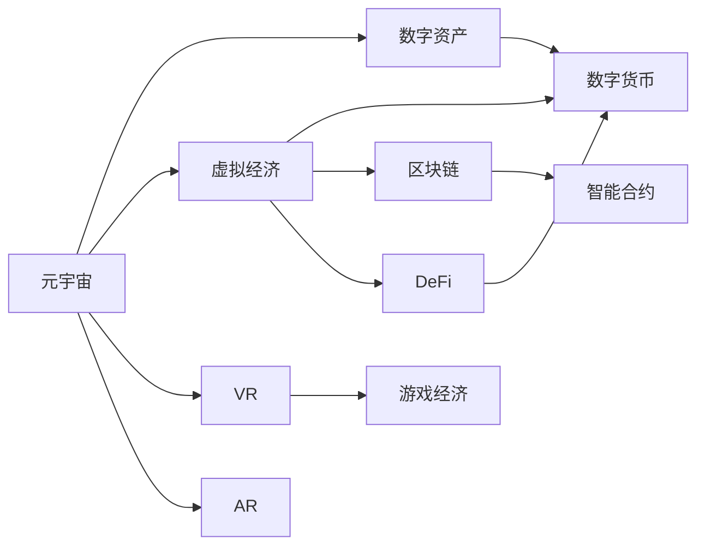

                 

# 元宇宙中的数字资产:价值交换的新模式

> 关键词：元宇宙,数字资产,价值交换,虚拟经济,数字货币,区块链技术,非同质化代币(NFT),虚拟现实(VR),增强现实(AR),游戏经济,DeFi

## 1. 背景介绍

### 1.1 问题由来
随着技术的快速发展和应用场景的不断拓展，元宇宙正在成为数字时代的下一个互联网风口。它不仅是虚拟世界的再现，更是基于虚拟经济的全新价值体系。在这样的背景下，数字资产的价值交换成为实现元宇宙经济循环的关键环节。传统货币体系已经难以满足元宇宙虚拟经济的需求，亟需新的价值交换模式。

### 1.2 问题核心关键点
元宇宙中的数字资产指的是那些具有一定经济价值和使用价值的数字对象，如虚拟土地、数字艺术品、游戏内货币等。这些资产通过区块链技术进行记录和交易，避免了传统金融系统的中心化问题和监管难题，具有更高的安全性和灵活性。

元宇宙中的价值交换模式，是指在虚拟世界中进行数字资产的交易、流通和分配的机制。这不仅包括传统货币和资产的兑换，还涵盖了虚拟经济的多个方面，如游戏内经济、虚拟现实体验、增强现实交互等。

数字资产的价值交换面临以下关键问题：

- **安全性和隐私性**：如何保证交易数据的安全和隐私不被泄露。
- **去中心化与信任问题**：如何在没有中心化机构参与的情况下，建立信任机制。
- **跨链互操作性**：不同区块链之间的资产互通问题。
- **智能合约机制**：如何在交易过程中自动执行合同条款。

### 1.3 问题研究意义
研究元宇宙中的数字资产价值交换模式，对于构建安全、高效、开放的虚拟经济体系具有重要意义：

- **促进元宇宙发展**：通过合理的价值交换机制，吸引更多用户和资源进入元宇宙，推动虚拟经济繁荣。
- **提升金融包容性**：为金融边缘化群体提供新的经济机会，促进社会公平。
- **增强经济稳定性**：通过区块链等技术，避免传统金融系统的中心化风险，提高经济稳定性。
- **推动技术创新**：在价值交换模式的研究过程中，催生更多前沿技术，如区块链、智能合约、NFT等。
- **应用场景广阔**：元宇宙经济的应用场景十分广阔，几乎涵盖了人类活动的各个领域。

## 2. 核心概念与联系

### 2.1 核心概念概述

为了深入理解元宇宙中数字资产的价值交换模式，我们需要了解一些关键概念：

- **元宇宙(Metaverse)**：基于虚拟现实、增强现实、虚拟经济、虚拟社会和数字资产等元素构建的虚拟世界。
- **数字资产(Digital Assets)**：如虚拟土地、数字艺术品、游戏内货币等，具备一定经济价值和使用价值的数字对象。
- **虚拟经济(Virtual Economy)**：在元宇宙中形成的经济活动，涉及资产的生产、交易、分配等。
- **数字货币(Digital Currency)**：用于元宇宙内价值交换的虚拟货币。
- **区块链(Blockchain)**：通过去中心化数据库记录交易信息，保证数据透明、不可篡改的技术。
- **非同质化代币(NFT, Non-Fungible Tokens)**：具有唯一身份的数字资产，如虚拟土地、艺术品等。
- **虚拟现实(VR, Virtual Reality)**：提供沉浸式体验的技术，支持虚拟经济和游戏经济。
- **增强现实(AR, Augmented Reality)**：将数字信息叠加到现实世界，增强现实互动。
- **DeFi (Decentralized Finance)**：基于区块链技术的金融服务，如借贷、交易、保险等。

这些核心概念之间的逻辑关系可以通过以下Mermaid流程图来展示：



这个流程图展示了大语言模型的工作原理和优化方向。

## 3. 核心算法原理 & 具体操作步骤
### 3.1 算法原理概述

元宇宙中的数字资产价值交换模式，主要基于区块链技术和智能合约机制。其核心思想是通过去中心化的区块链网络，记录和验证交易行为，确保交易的安全性和透明性。同时，通过智能合约自动执行合同条款，降低交易成本，提高交易效率。

### 3.2 算法步骤详解

以下是元宇宙中数字资产价值交换的基本步骤：

1. **初始化区块链**：部署区块链网络，设置智能合约规则，确保交易数据的透明和不可篡改。

2. **创建数字资产**：在区块链上创建新的数字资产，如虚拟土地、艺术品等，并为其分配唯一标识符（如NFT）。

3. **发布和销售数字资产**：将数字资产发布到市场，通过智能合约自动记录和验证交易，确保交易的真实性和合法性。

4. **价值交换和交易**：用户之间通过智能合约进行数字资产的买卖、交换等操作，智能合约自动执行合同条款，如分配交易手续费、转移资产所有权等。

5. **跨链互操作**：通过跨链技术，实现不同区块链之间的数字资产互通，打破资产流通的壁垒。

### 3.3 算法优缺点

基于区块链技术的数字资产价值交换模式具有以下优点：

- **去中心化**：减少了对中心化机构的依赖，提升了交易的透明度和安全性。
- **智能合约自动执行**：降低了交易成本，提高了交易效率，确保合同条款的严格执行。
- **不可篡改性**：区块链上的交易数据不可篡改，增强了数字资产的信任度。
- **灵活性**：可以在元宇宙的多个场景中进行价值交换，应用广泛。

但同时，这种模式也存在以下局限：

- **扩展性问题**：区块链网络的处理能力有限，可能无法满足大规模交易的需求。
- **隐私保护**：虽然交易数据透明，但个人隐私数据可能被泄露。
- **跨链互操作性**：不同区块链之间的互操作性仍然存在技术挑战。
- **智能合约漏洞**：智能合约的设计和实现存在安全漏洞，可能被攻击者利用。

### 3.4 算法应用领域

基于区块链技术的数字资产价值交换模式，在元宇宙的多个领域都有广泛应用：

- **游戏经济**：如《沙盒(Sandbox)》、《Roblox》等游戏中的虚拟货币、道具、土地等交易。
- **虚拟房地产**：如《Alberta》平台上的虚拟土地交易，每个土地具有独特的地理位置和土地所有权。
- **数字艺术品**：如《宪法币》平台上的数字艺术品交易，通过NFT技术确保作品的唯一性和所有权。
- **社交平台**：如《Alchemy》平台上的虚拟社交和游戏体验，通过数字资产进行互动和奖励。

此外，数字资产的价值交换模式还应用于教育、医疗、旅游等多个领域，推动虚拟经济的多元化发展。

## 4. 数学模型和公式 & 详细讲解 & 举例说明

### 4.1 数学模型构建

在元宇宙中，数字资产的价值交换可以通过以下数学模型来描述：

设交易双方为Alice和Bob，数字资产为A，交易量为X，交易手续费率为F，交易前的数字资产余额分别为$A_{Alice}$和$A_{Bob}$，交易后的余额分别为$A_{Alice}'$和$A_{Bob}'$。则交易的数学模型为：

$$
A_{Alice}' = A_{Alice} - X - F
$$

$$
A_{Bob}' = A_{Bob} + X - F
$$

其中，$F = X \times f$，$0 \leq f \leq 1$。

### 4.2 公式推导过程

根据上述数学模型，我们可以推导出交易过程的具体步骤：

1. **初始化**：Alice和Bob在区块链上注册账户，初始化数字资产余额。

2. **交易发起**：Alice发起交易请求，包含交易量和接收方Bob的地址。

3. **智能合约验证**：智能合约验证交易的有效性和合法性，检查交易量是否合理、Bob的账户余额是否充足等。

4. **交易执行**：智能合约自动执行交易，更新Alice和Bob的数字资产余额，计算并扣除交易手续费。

5. **交易记录**：交易数据被记录在区块链上，确保不可篡改和透明性。

### 4.3 案例分析与讲解

以虚拟土地交易为例，分析其在元宇宙中的价值交换过程：

1. **土地创建**：土地所有者Alice在区块链上创建一块虚拟土地，并为其分配唯一标识符（如NFT）。

2. **土地发布**：Alice将土地发布到市场，设置最低交易价格和手续费率。

3. **土地销售**：Bob希望购买这块土地，向Alice发起购买请求。

4. **智能合约验证**：智能合约验证Bob的资金充足、交易价格合理等条件。

5. **交易执行**：智能合约自动执行交易，更新Alice和Bob的土地余额，计算并扣除交易手续费。

6. **交易记录**：交易数据被记录在区块链上，确保不可篡改和透明性。

通过这个案例，我们可以看到，基于区块链技术的数字资产价值交换模式，不仅简化了交易流程，还提升了交易的安全性和透明性。

## 5. 项目实践：代码实例和详细解释说明

### 5.1 开发环境搭建

要进行数字资产价值交换的开发实践，需要搭建相应的开发环境：

1. **安装Python和相关依赖**：
   ```bash
   conda create -n blockchain-env python=3.8
   conda activate blockchain-env
   pip install web3 pyethereum eth-tron py-tron
   ```

2. **配置区块链网络**：
   ```python
   from eth_account import Account
   from web3 import Web3
   
   # 创建以太坊钱包
   private_key = '0x...'  # 生成或导入私钥
   account = Account(private_key)
   
   # 连接以太坊主网
   web3 = Web3(Web3.HTTPProvider('https://mainnet.infura.io/v3/your-infra-id'))
   
   # 创建智能合约
   contract = Contract(abi, address, web3)
   ```

3. **部署智能合约**：
   ```python
   # 部署智能合约
   contract = contract.deploy(account)
   
   # 等待合约部署完成
   contract.functions.deployed().wait()
   ```

### 5.2 源代码详细实现

以下是一个简单的智能合约示例，用于实现数字资产的转移和交易手续费的计算：

```python
from eth_account import Account
from web3 import Web3

# 创建以太坊钱包
private_key = '0x...'  # 生成或导入私钥
account = Account(private_key)

# 连接以太坊主网
web3 = Web3(Web3.HTTPProvider('https://mainnet.infura.io/v3/your-infra-id'))

# 创建智能合约
abi = """
   contract Token {
       function transfer(address to, uint256 amount) public;
       function transfer(address to, uint256 amount, uint256 fee) public;
   }
"""
address = '0x...'  # 智能合约地址

contract = Contract(abi, address, web3)

# 部署智能合约
contract = contract.deploy(account)

# 等待合约部署完成
contract.functions.deployed().wait()

# 使用智能合约进行数字资产转移
def transfer_asset(to, amount, fee):
    tx = contract.functions.transfer(to, amount, fee).transact({'from': account.privateKey})
    tx.wait()
    
# 调用智能合约进行资产转移
transfer_asset('0x...', 10, 0.5)  # 将10个单位的资产转移到'0x...'地址，手续费为0.5个单位
```

### 5.3 代码解读与分析

上述代码实现了数字资产的转移和交易手续费的计算。其中，`transfer_asset`函数用于调用智能合约的`transfer`函数，执行资产转移操作。智能合约中的`transfer`函数接收目标地址、资产数量和交易手续费，确保交易的合法性和正确性。

### 5.4 运行结果展示

运行上述代码后，可以在区块链上查看交易记录，确保资产的转移和手续费的计算是否正确。

## 6. 实际应用场景

### 6.1 游戏经济

在元宇宙中，游戏经济是数字资产价值交换的重要场景之一。游戏中的虚拟货币、道具、土地等，都是通过智能合约进行记录和交易的。例如，《Roblox》平台上的虚拟货币Robux，可以通过智能合约进行买卖和兑换，为玩家提供了便捷的经济交易方式。

### 6.2 虚拟房地产

虚拟房地产是元宇宙中非常有潜力的应用场景。通过区块链和智能合约技术，虚拟土地的所有权和交易过程得到了良好的保障。如《Alberta》平台上的虚拟土地交易，每个土地具有独特的地理位置和土地所有权，用户可以通过智能合约进行买卖和租赁。

### 6.3 数字艺术品

数字艺术品是元宇宙中的另一个重要应用场景。通过NFT技术，数字艺术品可以确保其唯一性和所有权。如《宪法币》平台上的数字艺术品交易，艺术家可以通过智能合约发布和出售自己的作品，获得版权收益。

### 6.4 未来应用展望

未来，随着元宇宙技术的不断发展，数字资产的价值交换模式将更加多样化和复杂化。以下是一些未来的应用展望：

1. **跨链互操作性**：不同区块链之间的数字资产互通将成为重要趋势，打破资产流通的壁垒，促进元宇宙经济的繁荣。

2. **智能合约自动化**：智能合约的自动化和自适应能力将进一步提升，确保交易的准确性和安全性。

3. **去中心化金融(DeFi)**：元宇宙中的DeFi应用将更加丰富，涵盖借贷、保险、衍生品等多个领域，为元宇宙经济提供更多金融服务。

4. **虚拟现实和增强现实**：VR和AR技术的应用将更加广泛，虚拟经济的场景和应用将更加丰富和多样化。

5. **数字资产的流动性**：通过链上和链下结合的方式，提高数字资产的流动性，降低交易成本，提升用户体验。

6. **社交互动和游戏经济**：元宇宙中的社交互动和游戏经济将更加紧密结合，通过数字资产进行奖励和激励，推动社区发展。

## 7. 工具和资源推荐

### 7.1 学习资源推荐

要深入学习元宇宙中的数字资产价值交换模式，可以参考以下学习资源：

1. 《区块链技术入门与实践》系列书籍：详细介绍了区块链技术的基本概念和应用场景。
2. 《智能合约编程实战》：介绍智能合约的开发和部署方法。
3. 《元宇宙：未来经济的新时代》：讨论元宇宙经济的发展和未来趋势。
4. 《DeFi创新实践》：涵盖DeFi技术的详细介绍和应用案例。
5. 《Web3.0：重塑互联网的未来》：探讨Web3.0技术在元宇宙中的应用前景。

### 7.2 开发工具推荐

以下是一些常用的元宇宙开发工具和库：

1. **Web3.js**：用于连接区块链和进行智能合约操作。
2. **Tron.js**：用于连接Tron区块链和进行智能合约操作。
3. **PyTron**：Python语言中连接Tron区块链的库。
4. **Interledger Protocol**：用于不同区块链之间的跨链互操作。
5. **Mintable**：用于创建和分发NFT的数字资产平台。

### 7.3 相关论文推荐

以下是几篇关于元宇宙数字资产价值交换模式的论文，推荐阅读：

1. Decentralized Autonomy: Building Decentralized Systems with Smart Contracts。
2. The Economics of Bitcoin, The Race to Alternative Digital Currencies, and the Challenges to Central Banking。
3. The Decentralization Paradox: The Dynamics of the Second Machine Age。
4. NFT's in the Metaverse: The Future of Digital Art and Collectibles。
5. Smart Contracts: Trustless Self-Executing Computational Contracts with Blockchain-Backed Security.

## 8. 总结：未来发展趋势与挑战

### 8.1 总结

本文详细介绍了元宇宙中的数字资产价值交换模式，并从算法原理、操作步骤、学习资源等方面进行了系统的介绍。数字资产的价值交换模式，是实现元宇宙经济的重要环节，具有广泛的应用前景和深远的意义。

通过区块链技术和智能合约的结合，数字资产的价值交换过程得到了良好的保障，为元宇宙经济的发展提供了强大的技术支持。然而，面对元宇宙的复杂性和多样性，数字资产价值交换模式仍需解决一些关键问题，如扩展性、隐私保护、跨链互操作等。

### 8.2 未来发展趋势

未来，元宇宙中的数字资产价值交换模式将呈现以下发展趋势：

1. **去中心化和自治**：元宇宙经济将更加去中心化和自治化，减少中心化机构的参与，提升系统的稳定性和透明性。
2. **智能合约自动化**：智能合约的自动化和自适应能力将进一步提升，确保交易的准确性和安全性。
3. **跨链互操作**：不同区块链之间的数字资产互通将成为重要趋势，打破资产流通的壁垒，促进元宇宙经济的繁荣。
4. **数字货币多样化**：元宇宙中的数字货币将更加多样化，涵盖DeFi、稳定币、虚拟货币等多种类型。
5. **虚拟现实和增强现实**：VR和AR技术的应用将更加广泛，虚拟经济的场景和应用将更加丰富和多样化。
6. **社交互动和游戏经济**：元宇宙中的社交互动和游戏经济将更加紧密结合，通过数字资产进行奖励和激励，推动社区发展。

### 8.3 面临的挑战

尽管元宇宙中的数字资产价值交换模式具有广阔的应用前景，但在发展过程中仍面临以下挑战：

1. **扩展性问题**：区块链网络的处理能力有限，可能无法满足大规模交易的需求。
2. **隐私保护**：虽然交易数据透明，但个人隐私数据可能被泄露。
3. **跨链互操作性**：不同区块链之间的互操作性仍然存在技术挑战。
4. **智能合约漏洞**：智能合约的设计和实现存在安全漏洞，可能被攻击者利用。
5. **去中心化治理**：如何建立有效的去中心化治理机制，确保系统的公平性和公正性。
6. **技术标准化**：元宇宙经济中各技术标准不统一，导致互操作性不足。

### 8.4 研究展望

未来，元宇宙中的数字资产价值交换模式的研究方向包括：

1. **跨链互操作性**：开发高效、安全的跨链技术，实现不同区块链之间的资产互通。
2. **智能合约优化**：提升智能合约的自动化和自适应能力，确保交易的准确性和安全性。
3. **隐私保护**：研究隐私保护技术，如零知识证明、差分隐私等，保护用户隐私数据。
4. **去中心化治理**：建立有效的去中心化治理机制，确保系统的公平性和公正性。
5. **NFT技术创新**：推动NFT技术的创新，如智能合约的可编程性、数字资产的流动性等。
6. **社交互动和游戏经济**：研究元宇宙中的社交互动和游戏经济，通过数字资产进行奖励和激励，推动社区发展。

## 9. 附录：常见问题与解答

**Q1: 元宇宙中的数字资产与现实资产有哪些区别？**

A: 元宇宙中的数字资产与现实资产有以下主要区别：
1. 不可物理占有：数字资产是虚拟的，不能被物理占有，只能在元宇宙中进行交易。
2. 无限复制性：数字资产可以被无限复制和分发，但可以通过区块链确保唯一性。
3. 数字版权：数字资产通常由创作者享有数字版权，保护作品不被盗用和滥用。
4. 交易便捷性：数字资产的交易速度快、成本低，可以通过智能合约自动执行。

**Q2: 如何确保元宇宙中数字资产的安全性和隐私性？**

A: 确保元宇宙中数字资产的安全性和隐私性，主要通过以下手段：
1. 区块链技术的去中心化和透明性：确保交易数据的不可篡改和透明性。
2. 智能合约的自执行机制：确保合同条款的严格执行，降低人为风险。
3. 隐私保护技术：如零知识证明、差分隐私等，保护用户隐私数据。
4. 去中心化治理：通过社区共识和规则，确保系统的公平性和公正性。

**Q3: 如何提升元宇宙中数字资产的流动性？**

A: 提升元宇宙中数字资产的流动性，主要通过以下方式：
1. 链上和链下结合：通过跨链互操作技术，实现不同区块链之间的资产互通。
2. 去中心化交易所(DEX)：提供去中心化的交易平台，降低交易成本，提升交易速度。
3. 抵押借贷机制：通过抵押数字资产进行借贷，提升资产的利用效率。
4. 多重签名机制：通过多重签名技术，增强资产的安全性。

**Q4: 元宇宙中数字资产的价值交换模式有哪些应用场景？**

A: 元宇宙中数字资产的价值交换模式主要应用于以下场景：
1. 游戏经济：如虚拟货币、道具、土地等交易。
2. 虚拟房地产：如虚拟土地的买卖和租赁。
3. 数字艺术品：如数字艺术品的发布和销售。
4. 社交平台：如虚拟社交和游戏体验的奖励和激励。
5. 教育培训：如虚拟学习场景中的数字化教材和证书。
6. 金融服务：如借贷、保险、投资等金融服务。

**Q5: 如何构建去中心化金融(DeFi)平台？**

A: 构建去中心化金融(DeFi)平台，主要通过以下步骤：
1. 部署智能合约：开发和部署智能合约，实现金融服务的功能。
2. 跨链互操作：实现不同区块链之间的资产互通，打破资产流通的壁垒。
3. 去中心化治理：通过社区共识和规则，确保系统的公平性和公正性。
4. 去中心化交易所(DEX)：提供去中心化的交易平台，降低交易成本，提升交易速度。
5. 稳定币机制：通过算法稳定币机制，确保数字资产的稳定性。

---

作者：禅与计算机程序设计艺术 / Zen and the Art of Computer Programming

