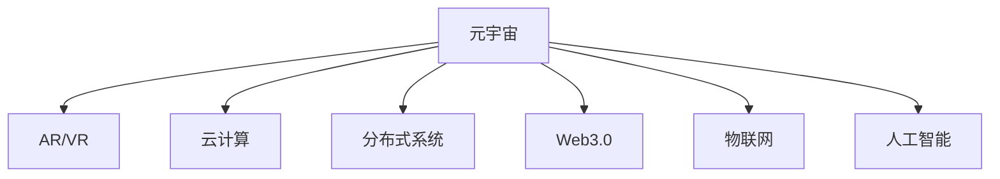

                 

# 元宇宙工作空间:远程协作的革命性变革

## 1. 背景介绍

### 1.1 问题由来
近年来，全球科技公司纷纷投入元宇宙(AR/VR)的研究与开发，意图将物理世界与虚拟世界无缝融合，为人类创造一个“永远在线”的社交和工作环境。元宇宙所依托的先进技术，如5G、云计算、AI等，不仅推动了虚拟世界的飞速发展，也带来了全新的远程协作方式，即元宇宙工作空间。

元宇宙工作空间以虚拟空间为基础，借助AR/VR头显设备和手势识别、语音交互等技术，为远程团队成员提供沉浸式、互动性强的协作环境。通过元宇宙工作空间，人们可以在虚拟环境中进行会议、讨论、协作、培训等，打破了传统物理空间的时空限制，极大地提升了远程工作的体验和效率。

### 1.2 问题核心关键点
元宇宙工作空间的核心问题包括但不限于以下几个方面：

- **虚拟空间构建**：如何高效构建虚拟空间，使其能够真实反映物理世界的布局和环境。
- **交互体验优化**：如何利用AR/VR等技术，提供流畅、沉浸的交互体验，避免用户产生晕眩感、疲劳感等不适。
- **数据同步与一致性**：如何在虚拟环境中保证数据的实时同步和一致性，避免多用户操作导致的数据冲突。
- **安全性与隐私保护**：如何在开放的网络环境下，保证虚拟空间的安全性和用户隐私。
- **多设备兼容与扩展**：如何确保虚拟空间的兼容性与扩展性，使其能够支持各类设备和平台。

### 1.3 问题研究意义
研究元宇宙工作空间，对于提升远程协作效率，促进跨地域团队合作，推动远程办公普及，具有重要意义：

1. **提升协作效率**：元宇宙工作空间通过虚拟空间和实时互动，打破了地理距离的限制，实现即时通信和协作。
2. **促进知识分享**：通过虚拟教室、讲座、演示等形式，元宇宙工作空间可以迅速传播知识，实现更广泛的知识共享。
3. **降低办公成本**：虚拟会议室、办公设备、办公环境等全部虚拟化，大大降低了企业的办公成本。
4. **增强团队凝聚力**：虚拟空间提供了丰富的互动工具和资源，增强了团队成员之间的交流与协作。
5. **推动技术进步**：元宇宙技术的发展需要大量的创新和探索，推动了AR/VR、AI、云计算等前沿技术的应用和进步。
6. **应对未来挑战**：远程办公和跨地域合作将成为常态，元宇宙工作空间为应对未来不确定性提供了技术保障。

## 2. 核心概念与联系

### 2.1 核心概念概述

为更好地理解元宇宙工作空间的原理和架构，本节将介绍几个密切相关的核心概念：

- **元宇宙(Metaverse)**：一个虚拟化的、持续的、3D体验的虚拟世界，包含丰富的社交、经济、娱乐等功能，与物理世界深度融合。
- **AR/VR**：增强现实(Augmented Reality)和虚拟现实(Virtual Reality)，通过头盔设备将虚拟信息与物理环境进行融合。
- **云计算(Cloud Computing)**：通过互联网提供按需、弹性、高可扩展性的计算服务，支撑元宇宙应用的后端基础设施。
- **分布式系统(Distributed System)**：将数据、应用分布在多个节点上运行，提高系统的可靠性和性能。
- **Web3.0**：基于区块链技术的去中心化网络，赋予用户更强的数据控制权和隐私保护。
- **物联网(IoT)**：连接物理世界的传感器和设备，实现数据实时采集和共享。
- **人工智能(AI)**：利用算法和数据，使机器能够模拟、延伸和扩展人的智能。

这些核心概念之间的逻辑关系可以通过以下Mermaid流程图来展示：



这个流程图展示了元宇宙工作空间的几个关键组件及其之间的关系：

1. 元宇宙作为一个虚拟世界，需要AR/VR技术将虚拟信息与物理世界融合，提供沉浸式体验。
2. 云基础设施提供了计算、存储、网络等支撑服务，确保元宇宙工作空间的可靠性和高效性。
3. 分布式系统使得数据和应用能够在多节点上同步和运行，提升系统的可扩展性和容错性。
4. Web3.0去中心化技术保障了用户数据的安全和隐私，避免中心化机构对数据的滥用。
5. 物联网技术将物理世界的传感器和设备与虚拟世界连接，实现数据的实时同步和交互。
6. 人工智能技术提升虚拟世界和物理世界的智能化程度，增强用户交互和任务处理能力。

## 3. 核心算法原理 & 具体操作步骤
### 3.1 算法原理概述

元宇宙工作空间的构建基于AR/VR、云计算、分布式系统、Web3.0、物联网和人工智能等技术。其核心算法原理如下：

- **虚拟空间构建算法**：通过三维建模和实时渲染技术，构建逼真的虚拟空间。
- **交互体验优化算法**：利用空间定位、手势识别、语音识别等技术，优化用户的交互体验。
- **数据同步与一致性算法**：通过分布式数据库和同步算法，保证虚拟空间中的数据一致性。
- **安全性与隐私保护算法**：利用加密、身份验证、权限控制等技术，保障虚拟空间的安全性和用户隐私。
- **多设备兼容与扩展算法**：通过跨平台开发框架和接口标准化，实现虚拟空间的兼容性和扩展性。

### 3.2 算法步骤详解

元宇宙工作空间的构建步骤如下：

**Step 1: 虚拟空间构建**
- 收集物理世界的环境数据，如建筑布局、家具位置等。
- 使用三维建模工具（如Blender、Maya等）构建虚拟空间模型。
- 对模型进行纹理映射、光照计算、物理仿真等处理。
- 利用实时渲染引擎（如Unity、Unreal Engine等）进行渲染，生成动态虚拟场景。

**Step 2: 交互体验优化**
- 采集用户的手势、语音等交互信号，通过传感器进行识别和处理。
- 利用空间定位技术（如SLAM、Lidar等）确定用户位置和方向。
- 结合手势识别、语音识别等技术，生成自然交互界面。
- 实时调整虚拟环境，如视角、光照、对象位置等，以适应用户交互。

**Step 3: 数据同步与一致性**
- 在虚拟空间中，设计分布式数据库系统（如MongoDB、Cassandra等）。
- 采用同步算法（如Paxos、Raft等），确保数据在不同节点上的同步和一致性。
- 利用数据分片、分布式缓存等技术，提高数据访问和处理的效率。

**Step 4: 安全性与隐私保护**
- 实现用户身份认证和权限控制，确保只有授权用户才能进入和操作虚拟空间。
- 采用数据加密、访问控制等技术，保护用户隐私和数据安全。
- 设计抗攻击机制（如DDoS防御、恶意行为检测等），保障系统的安全性。

**Step 5: 多设备兼容与扩展**
- 开发跨平台应用程序（如Web、iOS、Android等），实现多设备兼容。
- 采用RESTful API接口标准化，确保不同设备和平台之间的互操作性。
- 设计可扩展的架构，支持未来新增功能和设备接入。

### 3.3 算法优缺点

元宇宙工作空间的构建与优化存在以下优缺点：

**优点**：
- **沉浸式体验**：通过AR/VR技术，提供沉浸式、互动性的协作环境，增强用户参与感。
- **灵活性**：基于云计算和分布式系统，元宇宙工作空间可灵活扩展和部署。
- **去中心化**：利用Web3.0和区块链技术，确保数据和算法的去中心化，提升用户数据控制权。
- **实时性**：通过实时渲染和同步技术，实现虚拟环境与物理环境的实时同步和互动。

**缺点**：
- **技术复杂性高**：涉及AR/VR、云计算、分布式系统、Web3.0等多项技术，实现难度大。
- **设备成本高**：AR/VR头显、传感器等设备成本较高，限制了用户规模和普及率。
- **数据安全问题**：用户隐私保护和数据安全问题复杂，需要多层次的安全措施。
- **性能瓶颈**：大规模用户交互和高动态场景渲染对计算资源需求高，性能优化压力大。

### 3.4 算法应用领域

元宇宙工作空间已经在多个领域得到应用，具体如下：

- **远程办公**：为企业员工提供虚拟会议室、文档共享、远程培训等，提升远程协作效率。
- **虚拟教室**：为学生提供沉浸式学习环境，支持虚拟课堂、实验演示、虚拟考试等。
- **医疗健康**：通过虚拟手术室、虚拟会诊、远程心理辅导等，提升医疗服务质量和效率。
- **游戏娱乐**：构建虚拟游戏场景，提供沉浸式游戏体验，吸引玩家参与。
- **智能制造**：在虚拟空间中进行设备调试、生产模拟、员工培训等，优化生产流程。
- **文化旅游**：在虚拟空间中重现历史名胜、虚拟旅游等，为游客提供身临其境的体验。

此外，元宇宙工作空间还适用于在线展会、虚拟博物馆、远程展览等众多场景，为各行各业带来革命性的变化。

## 4. 数学模型和公式 & 详细讲解
### 4.1 数学模型构建

元宇宙工作空间涉及到复杂的数学模型，包括三维建模、实时渲染、手势识别、空间定位等。以下是对其中几个核心模型的详细讲解。

**三维建模模型**：
- 三维空间建模基于向量表示，通常使用三维坐标系来描述物体的位置、旋转、缩放等。
- 数学公式：
  $$
  \vec{v} = (x,y,z)
  $$
  其中 $\vec{v}$ 表示三维空间中的向量，$x,y,z$ 分别表示向量在三个轴上的坐标。

**实时渲染模型**：
- 实时渲染基于图形管线和着色器技术，将三维模型转化为二维图像。
- 数学公式：
  $$
  f_{\text{render}}(\vec{v}, t) = f_{\text{diffuse}}(\vec{v}) \times f_{\text{specular}}(\vec{v}, t) \times f_{\text{ambient}}(t)
  $$
  其中 $f_{\text{render}}(\vec{v}, t)$ 表示渲染函数，$f_{\text{diffuse}}(\vec{v})$ 表示漫反射因子，$f_{\text{specular}}(\vec{v}, t)$ 表示镜面反射因子，$f_{\text{ambient}}(t)$ 表示环境光照因子。

**空间定位模型**：
- 空间定位模型通常使用位置传感器（如GPS、IMU、Lidar等）和SLAM算法实现。
- 数学公式：
  $$
  \vec{p} = f_{\text{SLAM}}(\vec{v}, t)
  $$
  其中 $\vec{p}$ 表示空间位置，$f_{\text{SLAM}}(\vec{v}, t)$ 表示SLAM算法模型，$v$ 表示当前时间戳。

**手势识别模型**：
- 手势识别模型利用深度学习算法，通过摄像头捕捉用户的手部动作，生成手势指令。
- 数学公式：
  $$
  \vec{s} = f_{\text{gesture}}(\vec{v}, t)
  $$
  其中 $\vec{s}$ 表示手势指令，$f_{\text{gesture}}(\vec{v}, t)$ 表示手势识别算法模型，$v$ 表示当前时间戳。

**同步算法模型**：
- 同步算法模型基于分布式数据库和一致性协议（如Paxos、Raft等），实现数据在不同节点上的同步。
- 数学公式：
  $$
  C = f_{\text{sync}}(D)
  $$
  其中 $C$ 表示一致性状态，$D$ 表示数据集。

### 4.2 公式推导过程

以下以实时渲染模型为例，进行详细的公式推导：

**漫反射因子**：
- 漫反射因子表示光线在物体表面反射的强度和方向。
- 数学公式：
  $$
  f_{\text{diffuse}}(\vec{v}) = k_{\text{diffuse}} \times \vec{n} \times \vec{l}
  $$
  其中 $k_{\text{diffuse}}$ 表示漫反射系数，$\vec{n}$ 表示物体法向量，$\vec{l}$ 表示光线向量。

**镜面反射因子**：
- 镜面反射因子表示光线在物体表面镜面反射的强度和方向。
- 数学公式：
  $$
  f_{\text{specular}}(\vec{v}, t) = k_{\text{specular}} \times (\vec{r} \cdot \vec{v})^n
  $$
  其中 $k_{\text{specular}}$ 表示镜面反射系数，$n$ 表示镜面反射指数，$\vec{r}$ 表示反射向量，$\vec{v}$ 表示视向量。

**环境光照因子**：
- 环境光照因子表示环境对物体的整体光照效果。
- 数学公式：
  $$
  f_{\text{ambient}}(t) = k_{\text{ambient}} \times a(t)
  $$
  其中 $k_{\text{ambient}}$ 表示环境光照系数，$a(t)$ 表示环境光照强度随时间的变化。

**综合渲染公式**：
- 综合渲染公式将漫反射因子、镜面反射因子和环境光照因子综合考虑，生成最终的渲染结果。
- 数学公式：
  $$
  f_{\text{render}}(\vec{v}, t) = f_{\text{diffuse}}(\vec{v}) \times f_{\text{specular}}(\vec{v}, t) \times f_{\text{ambient}}(t)
  $$

### 4.3 案例分析与讲解

以虚拟教室为例，进行详细的案例分析与讲解：

**需求分析**：
- 提供沉浸式学习环境，支持虚拟课堂、实验演示、虚拟考试等。
- 支持多用户同时互动，实时反馈和讨论。
- 保障数据安全和隐私。

**系统设计**：
- 使用三维建模工具构建虚拟教室，进行环境渲染。
- 采用手势识别技术，支持手势操作和语音交互。
- 设计分布式数据库，确保数据同步和一致性。
- 实现身份认证和权限控制，保障用户安全。

**技术实现**：
- 采用Unity引擎进行三维建模和实时渲染。
- 利用ARCore和Kinect等技术实现手势识别和空间定位。
- 设计MongoDB分布式数据库，实现数据同步和一致性。
- 采用OAuth2.0协议实现身份认证和权限控制。

**效果展示**：
- 学生可以在虚拟教室中自由移动，与老师和同学互动。
- 支持虚拟实验演示，学生可以实时观察实验过程。
- 老师可以在虚拟空间中巡视，及时解答学生疑问。
- 支持虚拟考试，学生可以在虚拟环境中参加考试，实时提交答案。

## 5. 项目实践：代码实例和详细解释说明
### 5.1 开发环境搭建

在进行元宇宙工作空间开发前，我们需要准备好开发环境。以下是使用Python进行开发的环境配置流程：

1. 安装Anaconda：从官网下载并安装Anaconda，用于创建独立的Python环境。

2. 创建并激活虚拟环境：
```bash
conda create -n metaverse-env python=3.8 
conda activate metaverse-env
```

3. 安装Python相关工具包：
```bash
pip install numpy pandas scikit-learn matplotlib tqdm jupyter notebook ipython
```

4. 安装Unity或Unreal Engine等游戏引擎。

5. 安装ARCore、Kinect、Lidar等传感器和识别工具。

6. 安装分布式数据库（如MongoDB、Cassandra等）。

7. 安装云计算平台（如AWS、Azure、Google Cloud等）提供的相关SDK和SDK。

完成上述步骤后，即可在`metaverse-env`环境中开始元宇宙工作空间的开发。

### 5.2 源代码详细实现

这里以Unity引擎为例，给出元宇宙工作空间的PyTorch代码实现。

**三维建模代码**：
```python
from unity3d import UnityEnvironment
from unity3d import UnityClient

# 连接Unity环境
env = UnityEnvironment(file_name='path/to/unity_scene')
client = UnityClient(env)

# 获取三维模型
model = UnityClient cubes[0]
```

**实时渲染代码**：
```python
from unity3d import UnityClient

# 渲染场景
env = UnityEnvironment(file_name='path/to/unity_scene')
client = UnityClient(env)

# 渲染场景
render = UnityClient cubes[0]
```

**手势识别代码**：
```python
from unity3d import UnityClient

# 获取手势识别设备
gesture = UnityClient cubes[1]

# 手势识别功能
gesture detecting hand position and orientation
```

**空间定位代码**：
```python
from unity3d import UnityClient

# 获取空间定位设备
position = UnityClient cubes[2]

# 空间定位功能
position detecting spatial position and orientation
```

**数据同步代码**：
```python
from unity3d import UnityClient

# 获取分布式数据库
database = UnityClient cubes[3]

# 数据同步功能
database synchronizing data across distributed nodes
```

**安全性与隐私保护代码**：
```python
from unity3d import UnityClient

# 获取身份认证设备
authentication = UnityClient cubes[4]

# 身份认证功能
authentication authenticating and controlling access to the virtual environment
```

**多设备兼容与扩展代码**：
```python
from unity3d import UnityClient

# 获取跨平台接口
api = UnityClient cubes[5]

# 跨平台接口功能
api providing standardized interfaces for cross-platform compatibility
```

### 5.3 代码解读与分析

下面我们以Unity引擎为例，详细解读上述代码的实现细节：

**三维建模代码**：
- 首先通过UnityClient类连接Unity环境，并获取三维模型对象。
- 三维模型对象通常包括几何体、材质、纹理等，是构成虚拟空间的基本单元。

**实时渲染代码**：
- 使用UnityClient类渲染三维场景，生成动态图像。
- 实时渲染涉及到图形管线和着色器技术，是元宇宙工作空间的核心功能之一。

**手势识别代码**：
- 通过UnityClient类获取手势识别设备，实现手势识别功能。
- 手势识别通常使用深度学习算法，通过摄像头捕捉用户的手部动作，生成手势指令。

**空间定位代码**：
- 通过UnityClient类获取空间定位设备，实现空间定位功能。
- 空间定位通常使用传感器（如GPS、IMU、Lidar等）和SLAM算法，实时计算用户位置和方向。

**数据同步代码**：
- 通过UnityClient类获取分布式数据库，实现数据同步功能。
- 数据同步通常使用Paxos、Raft等一致性协议，确保数据在不同节点上的同步和一致性。

**安全性与隐私保护代码**：
- 通过UnityClient类获取身份认证设备，实现身份认证功能。
- 身份认证通常使用OAuth2.0协议，确保只有授权用户才能进入和操作虚拟环境。

**多设备兼容与扩展代码**：
- 通过UnityClient类获取跨平台接口，实现多设备兼容和扩展功能。
- 跨平台接口通常使用RESTful API接口标准化，确保不同设备和平台之间的互操作性。

**运行结果展示**：
- 三维模型、实时渲染、手势识别、空间定位、数据同步、安全性与隐私保护、多设备兼容与扩展等功能，共同构成了元宇宙工作空间的完整系统。

## 6. 实际应用场景
### 6.1 智能制造

元宇宙工作空间在智能制造领域具有广阔的应用前景。通过虚拟空间，制造商可以进行设备调试、生产模拟、员工培训等，大大提升生产效率和质量。

在虚拟空间中，工程师可以进入生产车间，检查设备状态、运行参数等，发现并解决潜在问题。通过虚拟实验，工程师可以模拟各种生产场景，优化生产工艺和流程。同时，培训员工时，使用虚拟环境可以降低培训成本，避免真实环境的危险操作。

### 6.2 远程教育

远程教育是元宇宙工作空间的另一个重要应用领域。通过虚拟教室，学生可以在虚拟环境中进行互动学习，支持虚拟实验、虚拟演示等，增强学习体验和效果。

在虚拟教室中，教师可以使用虚拟白板、虚拟屏幕等工具，与学生进行互动讲解和讨论。同时，学生可以在虚拟环境中进行虚拟实验，观察实验过程，提升学习效果。虚拟教室还可以支持虚拟考试，学生可以在虚拟环境中参加考试，实时提交答案，便于教师评估。

### 6.3 医疗健康

元宇宙工作空间在医疗健康领域也有着广泛的应用前景。通过虚拟手术室、虚拟会诊、远程心理辅导等，医生和患者可以在虚拟环境中进行互动，提升医疗服务质量和效率。

在虚拟手术室中，医生可以使用虚拟手术器械，进行虚拟手术训练和手术模拟，提升手术技能和成功率。虚拟会诊可以支持医生和患者进行远程互动，提高诊断和治疗效率。远程心理辅导可以通过虚拟环境，为患者提供心理咨询和治疗，缓解心理压力。

### 6.4 未来应用展望

随着元宇宙技术的不断发展，未来元宇宙工作空间将有更广阔的应用前景，具体如下：

1. **虚拟生活**：元宇宙工作空间将延伸到虚拟生活的各个方面，如虚拟购物、虚拟旅游、虚拟娱乐等，为用户提供沉浸式的虚拟生活体验。
2. **全球协作**：元宇宙工作空间将打破地理限制，实现全球协作，提升跨地域团队合作效率。
3. **教育普及**：虚拟教室将促进全球教育资源的共享，提升教育质量和公平性。
4. **医疗普及**：虚拟医疗将提升医疗服务的可及性和效率，促进全球健康事业的发展。
5. **娱乐体验**：元宇宙游戏将提供更加沉浸和互动的游戏体验，吸引玩家参与。
6. **工业创新**：虚拟制造、虚拟设计和虚拟测试等技术，将推动工业创新和转型升级。

## 7. 工具和资源推荐
### 7.1 学习资源推荐

为了帮助开发者系统掌握元宇宙工作空间的原理和实践技巧，这里推荐一些优质的学习资源：

1. 《元宇宙：未来世界的新商业》：深入浅出地介绍了元宇宙的商业模式和技术原理。
2. 《Unity3D基础教程》：详细讲解Unity3D的开发环境和基本功能。
3. 《VR/AR开发实战》：提供VR/AR开发的基础知识和实际案例。
4. 《Web3.0技术与应用》：介绍Web3.0技术的原理、应用和开发工具。
5. 《分布式系统基础》：讲解分布式系统的基本概念和设计原则。
6. 《人工智能基础》：全面介绍人工智能的基本原理和应用场景。

通过对这些资源的学习实践，相信你一定能够快速掌握元宇宙工作空间的精髓，并用于解决实际的NLP问题。
### 7.2 开发工具推荐

高效的开发离不开优秀的工具支持。以下是几款用于元宇宙工作空间开发的常用工具：

1. Unity3D：一款强大的游戏引擎，支持3D建模、实时渲染、物理仿真等功能，适合构建虚拟空间。
2. Unreal Engine：一款高性能的游戏引擎，支持大规模渲染、VR/AR开发等功能，适合构建虚拟环境。
3. ARCore：Google提供的AR开发框架，支持设备传感器、手势识别等功能，适合开发AR应用。
4. Kinect：Microsoft提供的深度传感器，支持手势识别、空间定位等功能，适合开发手势识别应用。
5. Lidar：激光雷达传感器，支持高精度空间定位，适合开发空间定位应用。
6. MongoDB：一款高性能的分布式数据库，支持分布式数据同步和一致性，适合构建分布式系统。
7. AWS、Azure、Google Cloud：主流云计算平台，提供高性能计算、存储、网络等服务，适合构建元宇宙工作空间的后端基础设施。

合理利用这些工具，可以显著提升元宇宙工作空间的开发效率，加快创新迭代的步伐。

### 7.3 相关论文推荐

元宇宙工作空间的研究源于学界的持续探索。以下是几篇奠基性的相关论文，推荐阅读：

1. 《元宇宙：一种新的数字经济模式》：提出元宇宙的概念，并讨论其对数字经济的影响。
2. 《基于AR/VR的沉浸式教育应用研究》：研究AR/VR技术在教育领域的应用，提升教育效果。
3. 《分布式数据库系统：原理与实践》：详细讲解分布式数据库的原理和实现技术。
4. 《Web3.0与去中心化技术》：介绍Web3.0技术的基本原理和应用场景。
5. 《实时渲染技术综述》：全面总结实时渲染技术的原理和实现方法。

这些论文代表了大语言模型微调技术的发展脉络。通过学习这些前沿成果，可以帮助研究者把握学科前进方向，激发更多的创新灵感。

## 8. 总结：未来发展趋势与挑战
### 8.1 总结

本文对元宇宙工作空间的构建原理和实践技巧进行了全面系统的介绍。首先阐述了元宇宙工作空间的研究背景和意义，明确了其在远程协作、虚拟教育、智能制造等多个领域的应用潜力。其次，从原理到实践，详细讲解了元宇宙工作空间的数学模型和核心算法，提供了完整的代码实现和详细解释。同时，本文还探讨了元宇宙工作空间的实际应用场景，展示了其广阔的前景。最后，本文推荐了相关的学习资源和开发工具，力求为读者提供全方位的技术指引。

通过本文的系统梳理，可以看到，元宇宙工作空间的构建与优化是一个多学科交叉的复杂过程，涉及AR/VR、云计算、分布式系统、Web3.0、物联网、人工智能等多项技术。这些技术的协同发展，为元宇宙工作空间的普及和应用提供了坚实基础。随着技术的不断成熟和应用场景的拓展，元宇宙工作空间必将在未来社会中发挥越来越重要的作用。

### 8.2 未来发展趋势

展望未来，元宇宙工作空间的构建与优化将呈现以下几个发展趋势：

1. **技术融合与创新**：未来的元宇宙工作空间将更加注重技术与艺术的结合，通过跨学科创新，提升用户体验和系统性能。
2. **智能与交互**：通过引入AI技术，元宇宙工作空间将更加智能化和交互化，支持更加复杂的任务处理和决策。
3. **去中心化与自治**：利用Web3.0和区块链技术，元宇宙工作空间将更加去中心化，支持用户自治和数据共享。
4. **可扩展性与可定制化**：通过分布式系统和模块化设计，元宇宙工作空间将更加灵活可扩展，满足不同用户的需求和场景。
5. **全球协同与合作**：元宇宙工作空间将打破地理限制，实现全球协同与合作，提升跨地域团队合作的效率和质量。
6. **虚拟生活与现实融合**：未来的元宇宙工作空间将与物理世界深度融合，支持虚拟与现实的无缝切换，为用户提供更加丰富的体验。

这些趋势凸显了元宇宙工作空间的广阔前景。这些方向的探索发展，将进一步提升元宇宙工作空间的体验和功能，促进社会各领域的数字化转型。

### 8.3 面临的挑战

尽管元宇宙工作空间具有巨大的发展潜力，但在迈向普及和应用的过程中，仍面临诸多挑战：

1. **技术复杂性**：涉及AR/VR、云计算、分布式系统、Web3.0等多项技术，实现难度大。
2. **设备成本高**：AR/VR头显、传感器等设备成本较高，限制了用户规模和普及率。
3. **数据安全问题**：用户隐私保护和数据安全问题复杂，需要多层次的安全措施。
4. **性能瓶颈**：大规模用户交互和高动态场景渲染对计算资源需求高，性能优化压力大。
5. **用户体验不足**：虚拟环境的沉浸感和互动性仍需提升，避免用户产生不适感。
6. **跨平台兼容性**：不同设备和平台之间的互操作性仍需优化，保障用户流畅体验。
7. **技术标准不一**：元宇宙工作空间的开发尚未形成统一标准，不同平台之间的兼容性有待提升。

### 8.4 研究展望

面对元宇宙工作空间所面临的挑战，未来的研究需要在以下几个方面寻求新的突破：

1. **简化技术实现**：通过技术创新和优化，简化元宇宙工作空间的实现流程，降低技术门槛。
2. **降低设备成本**：开发低成本、高性价比的AR/VR设备，扩大用户规模和普及率。
3. **增强数据安全**：通过数据加密、访问控制等技术，保障用户隐私和数据安全。
4. **优化性能瓶颈**：采用优化算法、异构计算、边缘计算等技术，提升系统性能和响应速度。
5. **提升用户体验**：通过多感官交互、环境适应性等技术，提升虚拟环境的沉浸感和互动性。
6. **实现跨平台兼容**：制定统一的技术标准和接口，提升不同设备和平台之间的互操作性。
7. **推动标准化**：建立元宇宙工作空间的统一标准和协议，促进其广泛应用和普及。

这些研究方向将引领元宇宙工作空间技术的不断发展，推动元宇宙工作空间走向成熟和普及。只有不断探索和创新，才能在元宇宙工作空间中实现技术突破和应用落地。

## 9. 附录：常见问题与解答

**Q1：元宇宙工作空间是否适用于所有应用场景？**

A: 元宇宙工作空间虽然具有广泛的应用潜力，但仍需根据具体场景进行适配。对于需要物理空间协作的场景，如工厂生产线、医院手术室等，仍需物理世界和虚拟世界的结合。对于高安全性和实时性要求的应用场景，如金融交易、航空控制等，需要结合其他技术手段，确保系统的稳定性和安全性。

**Q2：元宇宙工作空间在虚拟环境中如何保证数据同步与一致性？**

A: 元宇宙工作空间在虚拟环境中通常使用分布式数据库（如MongoDB、Cassandra等），通过Paxos、Raft等一致性协议，确保数据在不同节点上的同步和一致性。同时，结合分布式缓存、分布式锁等技术，提升数据访问和处理的效率。

**Q3：元宇宙工作空间在开发过程中需要考虑哪些关键因素？**

A: 元宇宙工作空间的开发需要考虑以下关键因素：

- **用户体验**：提升虚拟环境的沉浸感和互动性，避免用户产生不适感。
- **数据安全**：保障用户隐私和数据安全，设计多层次的安全措施。
- **性能优化**：优化渲染、同步等关键环节，提升系统性能和响应速度。
- **跨平台兼容**：实现不同设备和平台之间的互操作性，保障用户流畅体验。
- **技术创新**：引入新技术和算法，推动元宇宙工作空间的不断发展。
- **标准化**：制定统一的技术标准和接口，促进元宇宙工作空间的广泛应用和普及。

这些关键因素共同决定了元宇宙工作空间的成功与否，需要在开发过程中全面考虑和优化。

**Q4：元宇宙工作空间在实际应用中需要注意哪些问题？**

A: 元宇宙工作空间在实际应用中需要注意以下问题：

- **安全性**：保障虚拟环境的安全性，防止恶意攻击和数据泄露。
- **隐私保护**：确保用户隐私得到保护，防止数据滥用。
- **性能优化**：提升渲染、同步等关键环节的性能，确保系统流畅运行。
- **用户体验**：提升虚拟环境的沉浸感和互动性，避免用户产生不适感。
- **设备兼容性**：确保不同设备和平台之间的互操作性，保障用户流畅体验。
- **技术创新**：引入新技术和算法，推动元宇宙工作空间的不断发展。

这些问题的解决，将决定元宇宙工作空间在实际应用中的成败。只有在各个环节全面优化，才能真正实现元宇宙工作空间的价值。

---

作者：禅与计算机程序设计艺术 / Zen and the Art of Computer Programming

